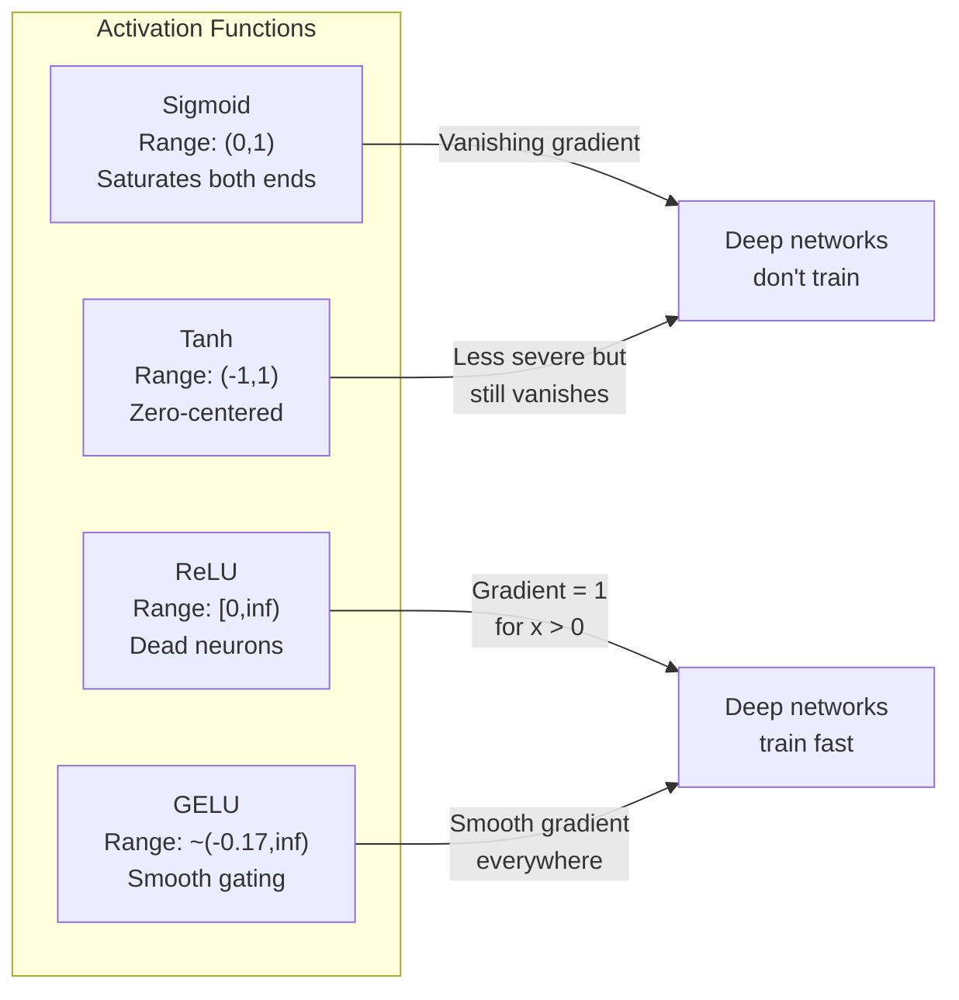
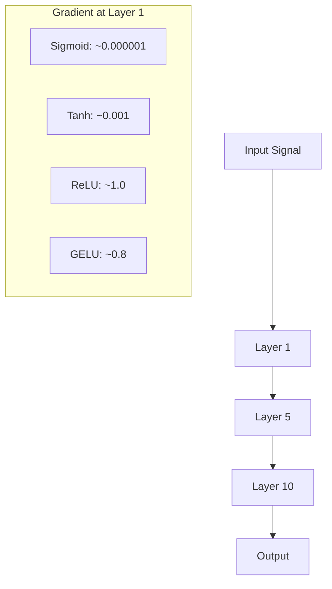
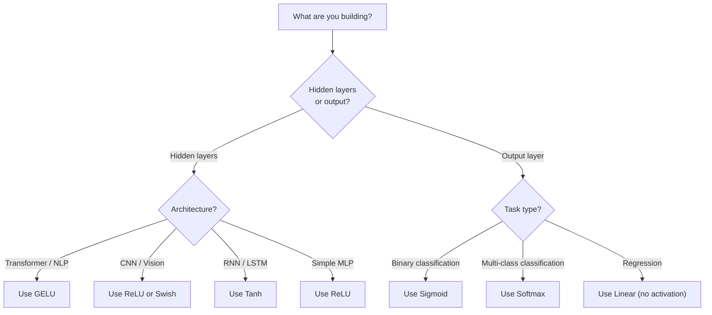

# 激活函数

> 没有非线性，你的100层网络只是一场华丽的矩阵乘法。激活函数是让神经网络能够进行曲线思维的门控。

**类型:** 构建
**语言:** Python
**先决条件:** 第03.03课 (反向传播)
**时间:** ~75分钟

## 学习目标

- 从零实现sigmoid、tanh、ReLU、Leaky ReLU、GELU、Swish和softmax及其导数
- 通过测量10+层不同激活函数的激活幅度，诊断梯度消失问题
- 检测ReLU网络中的神经元死亡，并解释GELU如何避免此故障模式
- 为给定架构（Transformer、CNN、RNN、输出层）选择正确的激活函数

## 问题所在

堆叠两个线性变换：y = W2(W1x + b1) + b2。展开它：y = W2W1x + W2b1 + b2。这仅仅是 y = Ax + c —— 一个单一的线性变换。无论你堆叠多少线性层，结果都会坍缩为一次矩阵乘法。你的100层网络与单层网络具有相同的表示能力。

这不是理论上的好奇。它意味着深度线性网络根本无法学习XOR，无法分类螺旋数据集，无法识别面孔。没有激活函数，深度就是一种幻觉。

激活函数打破了线性。它们通过非线性函数扭曲每一层的输出，赋予网络弯曲决策边界、近似任意函数并真正学习的能力。但选错了激活函数，你的梯度会消失为零（深层网络中的sigmoid），爆炸为无穷大（没有仔细初始化的无界激活），或者你的神经元会永久死亡（具有大负偏置的ReLU）。激活函数的选择直接决定了你的网络是否能够学习。

## 概念

### 为什么非线性是必要的

矩阵乘法具有可组合性。将一个向量乘以矩阵A再乘以矩阵B，等同于乘以AB。这意味着堆叠十个线性层在数学上等同于使用一个包含一个大矩阵的线性层。所有这些参数，所有这些深度——都浪费了。你需要某种东西来打破这个链条。这就是激活函数的作用。

这里是证明。一个线性层计算 f(x) = Wx + b。堆叠两个：

```
Layer 1: h = W1 * x + b1
Layer 2: y = W2 * h + b2
```

代入：

```
y = W2 * (W1 * x + b1) + b2
y = (W2 * W1) * x + (W2 * b1 + b2)
y = A * x + c
```

一个层。在层之间插入一个非线性激活g()：

```
h = g(W1 * x + b1)
y = W2 * h + b2
```

现在代入关系被打破了。W2 * g(W1 * x + b1) + b2 无法简化为单一的线性变换。网络可以表示非线性函数。每一个带激活的额外层都增加了表示能力。

### Sigmoid

神经网络最初的激活函数。

```
sigmoid(x) = 1 / (1 + e^(-x))
```

输出范围：(0, 1)。平滑、可微，将任意实数映射到类似概率的值。

其导数：

```
sigmoid'(x) = sigmoid(x) * (1 - sigmoid(x))
```

该导数的最大值为0.25，出现在x=0处。在反向传播中，梯度通过各层相乘。十层sigmoid意味着梯度最多被乘以0.25十次：

```
0.25^10 = 0.000000953674
```

不到原始信号的百万分之一。这就是梯度消失问题。早期层的梯度变得如此之小，以至于权重几乎无法更新。网络看起来在学习——后面的层损失在下降——但前面的层是冻结的。深层sigmoid网络根本无法训练。

额外的问题：sigmoid输出总是正的（0到1），这意味着权重的梯度符号总是相同。这会导致梯度下降过程中的锯齿形震荡。

### Tanh

Sigmoid的中心化版本。

```
tanh(x) = (e^x - e^(-x)) / (e^x + e^(-x))
```

输出范围：(-1, 1)。以零为中心，消除了锯齿形问题。

其导数：

```
tanh'(x) = 1 - tanh(x)^2
```

最大导数为1.0，出现在x=0处——比sigmoid好四倍。但梯度消失问题仍然存在。对于大的正或负输入，导数趋近于零。十层仍然会压制梯度，只是不那么剧烈。

### ReLU：突破性进展

线性整流单元。由Nair和Hinton在2010年推广用于深度学习（该函数本身可追溯到Fukushima 1969年的工作），它改变了一切。

```
relu(x) = max(0, x)
```

输出范围：[0, infinity)。其导数极其简单：

```
relu'(x) = 1  if x > 0
            0  if x <= 0
```

对于正输入没有梯度消失。梯度正好是1，直接传递。这就是为什么深度网络变得可训练——ReLU保留了梯度在各层间的幅度。

但存在一种故障模式：神经元死亡问题。如果一个神经元的加权输入总是负的（由于大的负偏置或不幸的权重初始化），其输出总是零，其梯度也总是零，它永远不会更新。它永久死亡了。实际上，ReLU网络中10-40%的神经元在训练过程中可能会死亡。

### Leaky ReLU

修复神经元死亡的最简单方法。

```
leaky_relu(x) = x        if x > 0
                alpha * x if x <= 0
```

其中alpha是一个小常数，通常为0.01。负侧有一个小斜率而不是零，因此死亡的神经元仍然能获得梯度信号并可以恢复。

### GELU：现代默认选项

高斯误差线性单元。由Hendrycks和Gimpel于2016年提出。是BERT、GPT和大多数现代Transformer中的默认激活函数。

```
gelu(x) = x * Phi(x)
```

其中Phi(x)是标准正态分布的累积分布函数。实践中使用的近似公式：

```
gelu(x) ~= 0.5 * x * (1 + tanh(sqrt(2/pi) * (x + 0.044715 * x^3)))
```

GELU处处平滑，允许小的负值（不像ReLU那样硬截断为零），并且具有概率解释：它根据输入在高斯分布下为正的概率来对每个输入进行加权。这种平滑的门控在Transformer架构中优于ReLU，因为它提供了更好的梯度流并完全避免了神经元死亡问题。

### Swish / SiLU

由Ramachandran等人于2017年通过自动化搜索发现的自门控激活。

```
swish(x) = x * sigmoid(x)
```

Swish的形式是x * sigmoid(x)。Google通过在激活函数空间上进行自动化搜索发现了它——一个神经网络在设计神经网络的部件。

与GELU类似，它是平滑的、非单调的，并且允许小的负值。区别很微妙：Swish使用sigmoid进行门控，而GELU使用高斯累积分布函数。实际上，性能几乎相同。Swish用于EfficientNet和一些视觉模型。GELU在语言模型中占主导地位。

### Softmax：输出激活

不在隐藏层中使用。Softmax将原始分数向量（logits）转换为概率分布。

```
softmax(x_i) = e^(x_i) / sum(e^(x_j) for all j)
```

每个输出都在0和1之间。所有输出之和为1。这使其成为多类分类的标准最终激活。最大的logit获得最高的概率，但与argmax不同，softmax是可微的，并保留了关于相对置信度的信息。

### 形状比较



### 梯度流比较



### 何时使用哪种激活



## 动手构建

### 第1步：实现所有激活函数及其导数

每个函数接受一个浮点数并返回一个浮点数。每个导数函数接受相同的输入并返回梯度。

```python
import math

def sigmoid(x):
    x = max(-500, min(500, x))
    return 1.0 / (1.0 + math.exp(-x))

def sigmoid_derivative(x):
    s = sigmoid(x)
    return s * (1 - s)

def tanh_act(x):
    return math.tanh(x)

def tanh_derivative(x):
    t = math.tanh(x)
    return 1 - t * t

def relu(x):
    return max(0.0, x)

def relu_derivative(x):
    return 1.0 if x > 0 else 0.0

def leaky_relu(x, alpha=0.01):
    return x if x > 0 else alpha * x

def leaky_relu_derivative(x, alpha=0.01):
    return 1.0 if x > 0 else alpha

def gelu(x):
    return 0.5 * x * (1 + math.tanh(math.sqrt(2 / math.pi) * (x + 0.044715 * x ** 3)))

def gelu_derivative(x):
    phi = 0.5 * (1 + math.erf(x / math.sqrt(2)))
    pdf = math.exp(-0.5 * x * x) / math.sqrt(2 * math.pi)
    return phi + x * pdf

def swish(x):
    return x * sigmoid(x)

def swish_derivative(x):
    s = sigmoid(x)
    return s + x * s * (1 - s)

def softmax(xs):
    max_x = max(xs)
    exps = [math.exp(x - max_x) for x in xs]
    total = sum(exps)
    return [e / total for e in exps]
```

### 第2步：可视化梯度消失的位置

计算从-5到5均匀分布的100个点上的梯度。打印一个文本直方图，显示每种激活函数的梯度接近零的位置。

```python
def gradient_scan(name, derivative_fn, start=-5, end=5, n=100):
    step = (end - start) / n
    near_zero = 0
    healthy = 0
    for i in range(n):
        x = start + i * step
        g = derivative_fn(x)
        if abs(g) < 0.01:
            near_zero += 1
        else:
            healthy += 1
    pct_dead = near_zero / n * 100
    print(f"{name:15s}: {healthy:3d} healthy, {near_zero:3d} near-zero ({pct_dead:.0f}% dead zone)")

gradient_scan("Sigmoid", sigmoid_derivative)
gradient_scan("Tanh", tanh_derivative)
gradient_scan("ReLU", relu_derivative)
gradient_scan("Leaky ReLU", leaky_relu_derivative)
gradient_scan("GELU", gelu_derivative)
gradient_scan("Swish", swish_derivative)
```

### 第3步：梯度消失实验

使用sigmoid与ReLU，将信号通过N层进行前向传播。测量激活幅度如何变化。

```python
import random

def vanishing_gradient_experiment(activation_fn, name, n_layers=10, n_inputs=5):
    random.seed(42)
    values = [random.gauss(0, 1) for _ in range(n_inputs)]

    print(f"\n{name} through {n_layers} layers:")
    for layer in range(n_layers):
        weights = [random.gauss(0, 1) for _ in range(n_inputs)]
        z = sum(w * v for w, v in zip(weights, values))
        activated = activation_fn(z)
        magnitude = abs(activated)
        bar = "#" * int(magnitude * 20)
        print(f"  Layer {layer+1:2d}: magnitude = {magnitude:.6f} {bar}")
        values = [activated] * n_inputs

vanishing_gradient_experiment(sigmoid, "Sigmoid")
vanishing_gradient_experiment(relu, "ReLU")
vanishing_gradient_experiment(gelu, "GELU")
```

### 第4步：死亡神经元检测器

创建一个ReLU网络，通过它传递随机输入，计算有多少神经元从未被激活。

```python
def dead_neuron_detector(n_inputs=5, hidden_size=20, n_samples=1000):
    random.seed(0)
    weights = [[random.gauss(0, 1) for _ in range(n_inputs)] for _ in range(hidden_size)]
    biases = [random.gauss(0, 1) for _ in range(hidden_size)]

    fire_counts = [0] * hidden_size

    for _ in range(n_samples):
        inputs = [random.gauss(0, 1) for _ in range(n_inputs)]
        for neuron_idx in range(hidden_size):
            z = sum(w * x for w, x in zip(weights[neuron_idx], inputs)) + biases[neuron_idx]
            if relu(z) > 0:
                fire_counts[neuron_idx] += 1

    dead = sum(1 for c in fire_counts if c == 0)
    rarely_fire = sum(1 for c in fire_counts if 0 < c < n_samples * 0.05)
    healthy = hidden_size - dead - rarely_fire

    print(f"\nDead Neuron Report ({hidden_size} neurons, {n_samples} samples):")
    print(f"  Dead (never fired):     {dead}")
    print(f"  Barely alive (<5%):     {rarely_fire}")
    print(f"  Healthy:                {healthy}")
    print(f"  Dead neuron rate:       {dead/hidden_size*100:.1f}%")

    for i, c in enumerate(fire_counts):
        status = "DEAD" if c == 0 else "WEAK" if c < n_samples * 0.05 else "OK"
        bar = "#" * (c * 40 // n_samples)
        print(f"  Neuron {i:2d}: {c:4d}/{n_samples} fires [{status:4s}] {bar}")

dead_neuron_detector()
```

### 第5步：训练比较——Sigmoid vs ReLU vs GELU

在圆形数据集（圆内的点=类别1，圆外的点=类别0）上使用三种不同的激活函数训练同一个两层网络。比较收敛速度。

```python
def make_circle_data(n=200, seed=42):
    random.seed(seed)
    data = []
    for _ in range(n):
        x = random.uniform(-2, 2)
        y = random.uniform(-2, 2)
        label = 1.0 if x * x + y * y < 1.5 else 0.0
        data.append(([x, y], label))
    return data


class ActivationNetwork:
    def __init__(self, activation_fn, activation_deriv, hidden_size=8, lr=0.1):
        random.seed(0)
        self.act = activation_fn
        self.act_d = activation_deriv
        self.lr = lr
        self.hidden_size = hidden_size

        self.w1 = [[random.gauss(0, 0.5) for _ in range(2)] for _ in range(hidden_size)]
        self.b1 = [0.0] * hidden_size
        self.w2 = [random.gauss(0, 0.5) for _ in range(hidden_size)]
        self.b2 = 0.0

    def forward(self, x):
        self.x = x
        self.z1 = []
        self.h = []
        for i in range(self.hidden_size):
            z = self.w1[i][0] * x[0] + self.w1[i][1] * x[1] + self.b1[i]
            self.z1.append(z)
            self.h.append(self.act(z))

        self.z2 = sum(self.w2[i] * self.h[i] for i in range(self.hidden_size)) + self.b2
        self.out = sigmoid(self.z2)
        return self.out

    def backward(self, target):
        error = self.out - target
        d_out = error * self.out * (1 - self.out)

        for i in range(self.hidden_size):
            d_h = d_out * self.w2[i] * self.act_d(self.z1[i])
            self.w2[i] -= self.lr * d_out * self.h[i]
            for j in range(2):
                self.w1[i][j] -= self.lr * d_h * self.x[j]
            self.b1[i] -= self.lr * d_h
        self.b2 -= self.lr * d_out

    def train(self, data, epochs=200):
        losses = []
        for epoch in range(epochs):
            total_loss = 0
            correct = 0
            for x, y in data:
                pred = self.forward(x)
                self.backward(y)
                total_loss += (pred - y) ** 2
                if (pred >= 0.5) == (y >= 0.5):
                    correct += 1
            avg_loss = total_loss / len(data)
            accuracy = correct / len(data) * 100
            losses.append(avg_loss)
            if epoch % 50 == 0 or epoch == epochs - 1:
                print(f"    Epoch {epoch:3d}: loss={avg_loss:.4f}, accuracy={accuracy:.1f}%")
        return losses


data = make_circle_data()

configs = [
    ("Sigmoid", sigmoid, sigmoid_derivative),
    ("ReLU", relu, relu_derivative),
    ("GELU", gelu, gelu_derivative),
]

results = {}
for name, act_fn, act_d_fn in configs:
    print(f"\n=== Training with {name} ===")
    net = ActivationNetwork(act_fn, act_d_fn, hidden_size=8, lr=0.1)
    losses = net.train(data, epochs=200)
    results[name] = losses

print("\n=== Final Loss Comparison ===")
for name, losses in results.items():
    print(f"  {name:10s}: start={losses[0]:.4f} -> end={losses[-1]:.4f} (improvement: {(1 - losses[-1]/losses[0])*100:.1f}%)")
```

## 实际应用

PyTorch以函数和模块形式提供了所有这些激活函数：

```python
import torch
import torch.nn as nn
import torch.nn.functional as F

x = torch.randn(4, 10)

relu_out = F.relu(x)
gelu_out = F.gelu(x)
sigmoid_out = torch.sigmoid(x)
swish_out = F.silu(x)

logits = torch.randn(4, 5)
probs = F.softmax(logits, dim=1)

model = nn.Sequential(
    nn.Linear(10, 64),
    nn.GELU(),
    nn.Linear(64, 32),
    nn.GELU(),
    nn.Linear(32, 5),
)
```

Transformer中的隐藏层：GELU。CNN中的隐藏层：ReLU。分类的输出层：softmax。回归的输出层：无（线性）。概率的输出层：sigmoid。就这些。从这些默认值开始。只有当你有证据时才改变它们。

RNN和LSTM对隐藏状态使用tanh，对门控使用sigmoid，但如果你今天从头构建，你可能不会使用RNN。如果你的ReLU网络中神经元正在死亡，换成GELU。除非你有特定理由，否则不要用Leaky ReLU——GELU解决了神经元死亡问题并提供更好的梯度流。

## 提交成果

本课产出：
- `outputs/prompt-activation-selector.md` —— 一个可重用的提示，帮助你为任何架构选择正确的激活函数

## 练习

1.  实现参数化ReLU (PReLU)，其中负斜率alpha是一个可学习的参数。在圆形数据集上训练它，并与固定的Leaky ReLU进行比较。

2.  使用50层而不是10层进行梯度消失实验。绘制sigmoid、tanh、ReLU和GELU每一层的信号幅度。每种激活函数的信号在哪一层实际上达到了零？

3.  实现ELU（指数线性单元）：elu(x) = x if x > 0, alpha * (e^x - 1) if x <= 0。将其死亡神经元率与同一网络上的ReLU进行比较。

4.  构建一个在训练期间运行的"梯度健康监测器"：在每个epoch，计算每一层的平均梯度幅度。当任何一层的梯度低于0.001或超过100时打印警告。

5.  修改训练比较，使用第01课的XOR数据集代替圆形。哪种激活在XOR上收敛最快？为什么这与圆形的结果不同？

## 关键术语

| 术语 | 人们通常怎么说 | 它的实际含义 |
|------|----------------|----------------------|
| 激活函数 | "非线性部分" | 应用于每个神经元输出上的函数，打破线性，使网络能够学习非线性映射 |
| 梯度消失 | "梯度在深度网络中消失了" | 当激活函数的导数小于1时，梯度在各层间指数级缩小，使得早期层无法训练 |
| 梯度爆炸 | "梯度爆炸了" | 当有效乘数超过1时，梯度在各层间指数级增长，导致训练不稳定 |
| 神经元死亡 | "停止学习的神经元" | 输入永久为负的ReLU神经元，输出为零，梯度也为零 |
| Sigmoid | "将值压缩到0-1" | 逻辑函数1/(1+e^-x)，历史上很重要，但在深层网络中导致梯度消失 |
| ReLU | "将负值截断为零" | max(0, x) -- 通过保留梯度幅度使深度学习变得实用的激活函数 |
| GELU | "Transformer的激活函数" | 高斯误差线性单元，一种平滑的激活函数，根据输入为正的概率对其进行加权 |
| Swish/SiLU | "自门控的ReLU" | x * sigmoid(x)，通过自动化搜索发现，用于EfficientNet |
| Softmax | "将分数变成概率" | 将logit向量归一化为概率分布，所有值都在(0,1)之间且总和为1 |
| Leaky ReLU | "不会死的ReLU" | max(alpha*x, x)，其中alpha很小（0.01），通过允许小的负梯度来防止神经元死亡 |
| 饱和 | "sigmoid的平坦部分" | 激活函数的导数趋近于零的区域，阻断梯度流 |
| Logit | "softmax之前的原始分数" | 应用softmax或sigmoid之前最后一层的未归一化输出 |

## 延伸阅读

- Nair & Hinton, "Rectified Linear Units Improve Restricted Boltzmann Machines" (2010) -- 介绍ReLU并使深度网络训练成为可能的论文
- Hendrycks & Gimpel, "Gaussian Error Linear Units (GELUs)" (2016) -- 介绍了成为Transformer默认激活函数的激活函数
- Ramachandran et al., "Searching for Activation Functions" (2017) -- 使用自动化搜索发现了Swish，表明激活设计可以自动化
- Glorot & Bengio, "Understanding the difficulty of training deep feedforward neural networks" (2010) -- 诊断梯度消失/爆炸问题并提出Xavier初始化的论文
- Goodfellow, Bengio, Courville, "Deep Learning" Chapter 6.3 (https://www.deeplearningbook.org/) -- 对隐藏单元和激活函数的严谨阐述