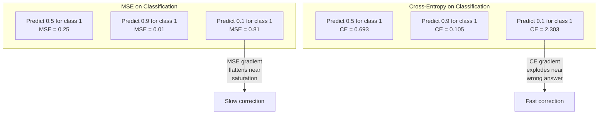
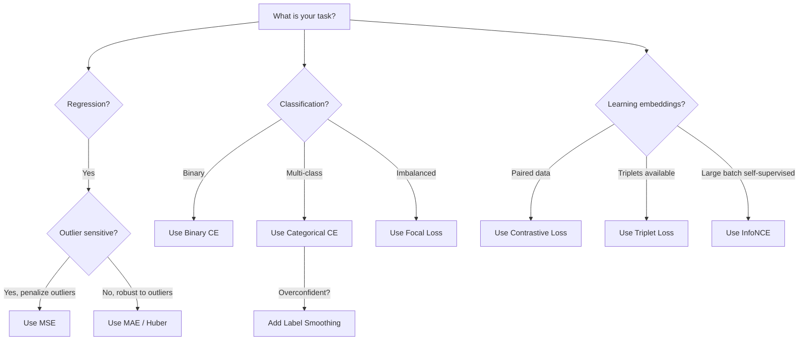
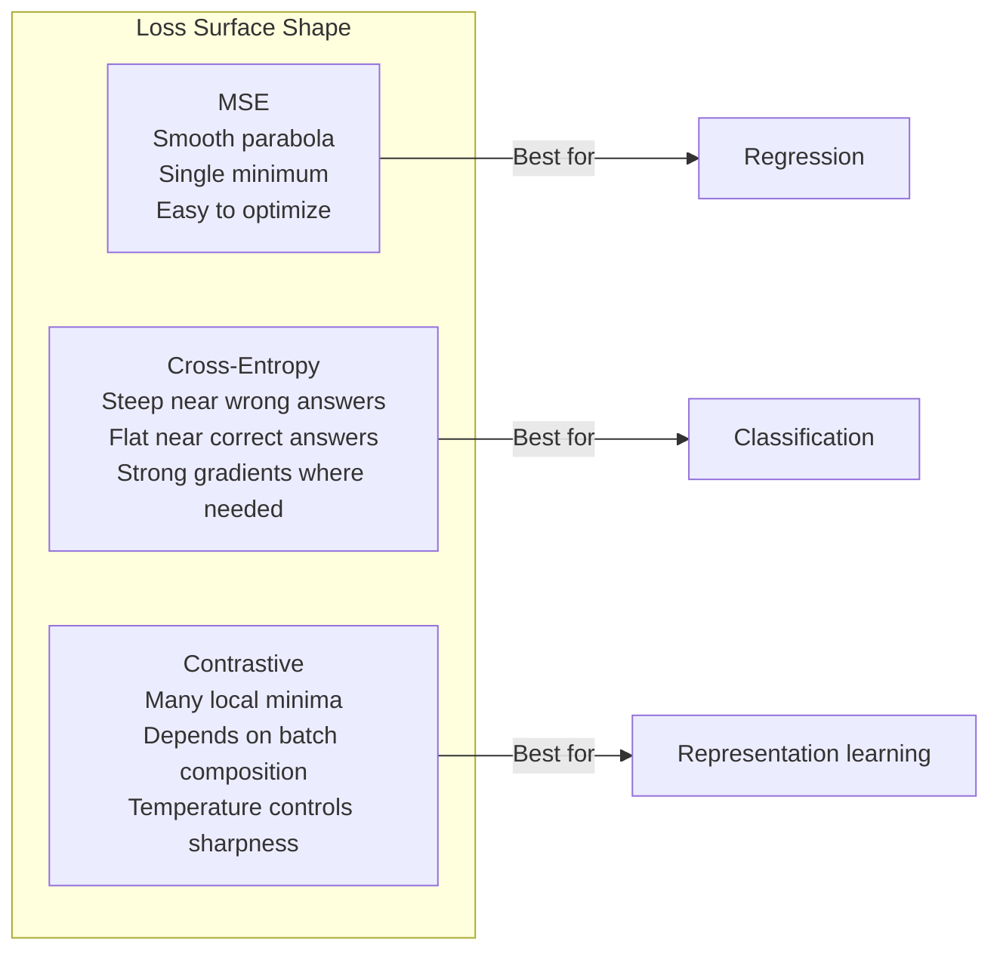

# 损失函数

> 你的网络做出预测，而真实值另有说法。它错得有多离谱？这个数字就是损失值。选错了损失函数，你的模型就会完全优化错误的目标。

**类型:** 构建
**语言:** Python
**先决条件:** 课程 03.04（激活函数）
**时间:** 约 75 分钟

## 学习目标

- 从零开始实现 MSE、二元交叉熵、分类交叉熵和对比损失 (InfoNCE) 及其梯度
- 通过演示“对所有预测 0.5”的失败模式，解释 MSE 为何不适用于分类任务
- 将标签平滑应用于交叉熵，并描述其如何防止过度自信的预测
- 为回归、二元分类、多类分类和嵌入学习任务选择正确的损失函数

## 问题所在

一个在分类问题上最小化 MSE 的模型，会对所有预测自信地输出 0.5。它确实在最小化损失。但它也毫无用处。

损失函数是你的模型实际优化的唯一目标。不是准确率。不是 F1 分数。不是你向经理汇报的任何指标。优化器计算损失函数的梯度，并调整权重以减小该数值。如果损失函数没有捕获你关心的内容，模型将找到满足它的数学上最省事的方法，而这几乎从来不是你想要的。

这里有一个具体的例子。你有一个二元分类任务。两个类别，50/50 的划分。你使用 MSE 作为损失。模型对每个输入都预测 0.5。平均 MSE 是 0.25，这是不实际学习任何东西的情况下的最低可能值。模型没有判别能力，但它确实在技术上最小化了你的损失函数。换成交叉熵，同样的模型就被迫将预测推向 0 或 1，因为 -log(0.5) = 0.693 是一个很糟糕的损失，而 -log(0.99) = 0.01 则奖励自信的正确预测。损失函数的选择，决定了模型是学到东西，还是在玩弄指标。

情况还会更糟。在自监督学习中，你甚至没有标签。对比损失完全定义了学习信号：什么算相似，什么算不同，以及模型应该多用力将它们分开。如果对比损失选错了，你的嵌入会坍缩到一个点——每个输入都映射到相同的向量。技术上损失为零。完全无价值。

## 概念解析

### 均方误差 (MSE)

回归任务的默认选择。计算预测值与目标值之间的平方差，并对所有样本取平均。

```
MSE = (1/n) * sum((y_pred - y_true)^2)
```

为何平方很重要：它以二次方惩罚大的误差。误差为 2 的代价是误差为 1 的 4 倍。误差为 10 的代价是 100 倍。这使得 MSE 对离群值非常敏感——一个极其错误的预测会主导损失。

实际数字：如果你的模型预测房价，对大多数房子误差是 $10,000，但对一座豪宅误差是 $200,000，MSE 会极力去修正那座豪宅，可能会损害对其他 99 座房子的预测性能。

MSE 相对于预测值的梯度是：

```
dMSE/dy_pred = (2/n) * (y_pred - y_true)
```

关于误差是线性的。更大的误差得到更大的梯度。这对回归来说是特性（大误差需要大修正），而对分类来说是缺陷（你想指数级地惩罚自信的错误答案，而不是线性的）。

### 交叉熵损失

分类任务的损失函数。植根于信息论——它衡量预测概率分布与真实分布之间的差异。

**二元交叉熵 (BCE):**

```
BCE = -(y * log(p) + (1 - y) * log(1 - p))
```

其中 y 是真实标签（0 或 1），p 是预测概率。

为何 -log(p) 有效：当真实标签为 1 而你预测 p = 0.99 时，损失是 -log(0.99) = 0.01。当你预测 p = 0.01 时，损失是 -log(0.01) = 4.6。这个 460 倍的差异就是交叉熵有效的原因。它残酷地惩罚自信的错误预测，而对自信的正确预测几乎不惩罚。

梯度讲述了同样的故事：

```
dBCE/dp = -(y/p) + (1-y)/(1-p)
```

当 y = 1 且 p 接近零时，梯度是 -1/p，趋近于负无穷。模型得到一个巨大的信号来修正其错误。当 p 接近 1 时，梯度很小。已经正确了，无需修正。

**分类交叉熵:**

用于 one-hot 编码目标的多类分类。

```
CCE = -sum(y_i * log(p_i))
```

只有真实类对损失有贡献（因为所有其他 y_i 都是零）。如果有 10 个类别，而正确类别的概率是 0.1（随机猜测），损失是 -log(0.1) = 2.3。如果正确类别的概率是 0.9，损失是 -log(0.9) = 0.105。模型学习将概率质量集中在正确答案上。

### MSE 为何不适用于分类



当预测接近 0 或 1 时，MSE 梯度会变平（由于 S 饱和）。交叉熵梯度对此进行了补偿——-log 抵消了 S 函数的平坦区域，恰好在最需要的地方给出强大的梯度。

### 标签平滑

标准 one-hot 标签表示“这 100% 是类别 3，0% 是其他所有类别”。这是一个很强的断言。标签平滑对其进行了软化：

```
smooth_label = (1 - alpha) * one_hot + alpha / num_classes
```

当 alpha = 0.1 且有 10 个类别时：目标不再是 [0, 0, 1, 0, ...]，而是 [0.01, 0.01, 0.91, 0.01, ...]。模型目标变成了 0.91 而不是 1.0。

为何有效：一个试图通过 softmax 输出恰好为 1.0 的模型，需要将对数几率推到无穷大。这会导致过度自信，损害泛化能力，并使模型对分布偏移脆弱。标签平滑将目标上限限制在 0.9（当 alpha=0.1），使对数几率保持在合理范围内。GPT 和大多数现代模型都使用标签平滑或其等价方法。

### 对比损失

没有标签。没有类别。只有输入对，以及一个问题：这些输入是相似的还是不同的？

**SimCLR 风格对比损失 (NT-Xent / InfoNCE):**

取一张图像。为其创建两个增强视图（裁剪、旋转、颜色抖动）。这些是“正样本对”——它们应该有相似的嵌入。批次中的每一张其他图像都构成一个“负样本对”——它们应该有不同的嵌入。

```
L = -log(exp(sim(z_i, z_j) / tau) / sum(exp(sim(z_i, z_k) / tau)))
```

其中 sim() 是余弦相似度，z_i 和 z_j 是正样本对，求和是对所有负样本进行的，tau（温度）控制分布的锐度。温度越低 = 困难负样本 = 更积极的分离。

实际数字：批次大小为 256 意味着每个正样本对有 255 个负样本。温度 tau = 0.07（SimCLR 默认值）。该损失看起来像是在相似度上做 softmax——它希望正样本对的相似度在所有 256 个选项中最高。

**三元组损失:**

取三个输入：锚点、正样本（同类）、负样本（异类）。

```
L = max(0, d(anchor, positive) - d(anchor, negative) + margin)
```

间隔（通常为 0.2-1.0）强制要求正负样本距离之间有一个最小差距。如果负样本已经足够远，损失为零——没有梯度，不更新。这使得训练高效，但需要仔细的三元组挖掘（选择靠近锚点的困难负样本）。

### 焦点损失

用于不平衡数据集。标准交叉熵对所有正确分类的例子一视同仁。焦点损失降低简单例子的权重：

```
FL = -alpha * (1 - p_t)^gamma * log(p_t)
```

其中 p_t 是真实类别的预测概率，gamma 控制聚焦程度。当 gamma = 0 时，这就是标准交叉熵。当 gamma = 2（默认值）时：

- 简单例子 (p_t = 0.9): 权重 = (0.1)^2 = 0.01。实际上被忽略。
- 困难例子 (p_t = 0.1): 权重 = (0.9)^2 = 0.81。完整的梯度信号。

焦点损失由 Lin 等人针对目标检测提出，其中 99% 的候选区域是背景（简单负样本）。没有焦点损失，模型会淹没在简单的背景例子中，永远学不会检测物体。有了它，模型将其能力集中在重要的、困难的、模糊的案例上。

### 损失函数决策树



### 损失景观



## 动手实现

### 步骤 1: MSE 及其梯度

```python
def mse(predictions, targets):
    n = len(predictions)
    total = 0.0
    for p, t in zip(predictions, targets):
        total += (p - t) ** 2
    return total / n

def mse_gradient(predictions, targets):
    n = len(predictions)
    grads = []
    for p, t in zip(predictions, targets):
        grads.append(2.0 * (p - t) / n)
    return grads
```

### 步骤 2: 二元交叉熵

log(0) 的问题是真实存在的。如果模型对正样本预测恰好为 0，log(0) = 负无穷。裁剪可以防止这种情况。

```python
import math

def binary_cross_entropy(predictions, targets, eps=1e-15):
    n = len(predictions)
    total = 0.0
    for p, t in zip(predictions, targets):
        p_clipped = max(eps, min(1 - eps, p))
        total += -(t * math.log(p_clipped) + (1 - t) * math.log(1 - p_clipped))
    return total / n

def bce_gradient(predictions, targets, eps=1e-15):
    grads = []
    for p, t in zip(predictions, targets):
        p_clipped = max(eps, min(1 - eps, p))
        grads.append(-(t / p_clipped) + (1 - t) / (1 - p_clipped))
    return grads
```

### 步骤 3: 带 Softmax 的分类交叉熵

Softmax 将原始对数几率转换为概率。然后我们针对 one-hot 目标计算交叉熵。

```python
def softmax(logits):
    max_val = max(logits)
    exps = [math.exp(x - max_val) for x in logits]
    total = sum(exps)
    return [e / total for e in exps]

def categorical_cross_entropy(logits, target_index, eps=1e-15):
    probs = softmax(logits)
    p = max(eps, probs[target_index])
    return -math.log(p)

def cce_gradient(logits, target_index):
    probs = softmax(logits)
    grads = list(probs)
    grads[target_index] -= 1.0
    return grads
```

softmax + 交叉熵的梯度简化得非常漂亮：对于真实类是（预测概率 - 1），对于所有其他类是（预测概率）。这种优雅的简化并非巧合——这正是 softmax 和交叉熵被配对使用的原因。

### 步骤 4: 标签平滑

```python
def label_smoothed_cce(logits, target_index, num_classes, alpha=0.1, eps=1e-15):
    probs = softmax(logits)
    loss = 0.0
    for i in range(num_classes):
        if i == target_index:
            smooth_target = 1.0 - alpha + alpha / num_classes
        else:
            smooth_target = alpha / num_classes
        p = max(eps, probs[i])
        loss += -smooth_target * math.log(p)
    return loss
```

### 步骤 5: 对比损失（简化版 InfoNCE）

```python
def cosine_similarity(a, b):
    dot = sum(x * y for x, y in zip(a, b))
    norm_a = math.sqrt(sum(x * x for x in a))
    norm_b = math.sqrt(sum(x * x for x in b))
    if norm_a < 1e-10 or norm_b < 1e-10:
        return 0.0
    return dot / (norm_a * norm_b)

def contrastive_loss(anchor, positive, negatives, temperature=0.07):
    sim_pos = cosine_similarity(anchor, positive) / temperature
    sim_negs = [cosine_similarity(anchor, neg) / temperature for neg in negatives]

    max_sim = max(sim_pos, max(sim_negs)) if sim_negs else sim_pos
    exp_pos = math.exp(sim_pos - max_sim)
    exp_negs = [math.exp(s - max_sim) for s in sim_negs]
    total_exp = exp_pos + sum(exp_negs)

    return -math.log(max(1e-15, exp_pos / total_exp))
```

### 步骤 6: MSE 与交叉熵在分类任务上的对比

在课程 04（圆形数据集）的相同网络上，分别使用这两种损失函数进行训练。观察交叉熵收敛得更快。

```python
import random

def sigmoid(x):
    x = max(-500, min(500, x))
    return 1.0 / (1.0 + math.exp(-x))

def make_circle_data(n=200, seed=42):
    random.seed(seed)
    data = []
    for _ in range(n):
        x = random.uniform(-2, 2)
        y = random.uniform(-2, 2)
        label = 1.0 if x * x + y * y < 1.5 else 0.0
        data.append(([x, y], label))
    return data


class LossComparisonNetwork:
    def __init__(self, loss_type="bce", hidden_size=8, lr=0.1):
        random.seed(0)
        self.loss_type = loss_type
        self.lr = lr
        self.hidden_size = hidden_size

        self.w1 = [[random.gauss(0, 0.5) for _ in range(2)] for _ in range(hidden_size)]
        self.b1 = [0.0] * hidden_size
        self.w2 = [random.gauss(0, 0.5) for _ in range(hidden_size)]
        self.b2 = 0.0

    def forward(self, x):
        self.x = x
        self.z1 = []
        self.h = []
        for i in range(self.hidden_size):
            z = self.w1[i][0] * x[0] + self.w1[i][1] * x[1] + self.b1[i]
            self.z1.append(z)
            self.h.append(max(0.0, z))

        self.z2 = sum(self.w2[i] * self.h[i] for i in range(self.hidden_size)) + self.b2
        self.out = sigmoid(self.z2)
        return self.out

    def backward(self, target):
        if self.loss_type == "mse":
            d_loss = 2.0 * (self.out - target)
        else:
            eps = 1e-15
            p = max(eps, min(1 - eps, self.out))
            d_loss = -(target / p) + (1 - target) / (1 - p)

        d_sigmoid = self.out * (1 - self.out)
        d_out = d_loss * d_sigmoid

        for i in range(self.hidden_size):
            d_relu = 1.0 if self.z1[i] > 0 else 0.0
            d_h = d_out * self.w2[i] * d_relu
            self.w2[i] -= self.lr * d_out * self.h[i]
            for j in range(2):
                self.w1[i][j] -= self.lr * d_h * self.x[j]
            self.b1[i] -= self.lr * d_h
        self.b2 -= self.lr * d_out

    def compute_loss(self, pred, target):
        if self.loss_type == "mse":
            return (pred - target) ** 2
        else:
            eps = 1e-15
            p = max(eps, min(1 - eps, pred))
            return -(target * math.log(p) + (1 - target) * math.log(1 - p))

    def train(self, data, epochs=200):
        losses = []
        for epoch in range(epochs):
            total_loss = 0.0
            correct = 0
            for x, y in data:
                pred = self.forward(x)
                self.backward(y)
                total_loss += self.compute_loss(pred, y)
                if (pred >= 0.5) == (y >= 0.5):
                    correct += 1
            avg_loss = total_loss / len(data)
            accuracy = correct / len(data) * 100
            losses.append((avg_loss, accuracy))
            if epoch % 50 == 0 or epoch == epochs - 1:
                print(f"    Epoch {epoch:3d}: loss={avg_loss:.4f}, accuracy={accuracy:.1f}%")
        return losses
```

## 应用它

PyTorch 提供了所有标准损失函数，并内置了数值稳定性：

```python
import torch
import torch.nn as nn
import torch.nn.functional as F

predictions = torch.tensor([0.9, 0.1, 0.7], requires_grad=True)
targets = torch.tensor([1.0, 0.0, 1.0])

mse_loss = F.mse_loss(predictions, targets)
bce_loss = F.binary_cross_entropy(predictions, targets)

logits = torch.randn(4, 10)
labels = torch.tensor([3, 7, 1, 9])
ce_loss = F.cross_entropy(logits, labels)
ce_smooth = F.cross_entropy(logits, labels, label_smoothing=0.1)
```

使用 `F.cross_entropy`（而不是 `F.nll_loss` 加上手动 softmax）。它在一个数值稳定的操作中结合了 log-softmax 和负对数似然。分别应用 softmax 然后取对数不太稳定——在减去大的指数值时会损失精度。

对于对比学习，大多数团队使用自定义实现或像 `lightly` 或 `pytorch-metric-learning` 这样的库。核心循环总是一样的：计算成对相似度，在正负样本上创建 softmax，反向传播。

## 部署它

本课程产出：
- `outputs/prompt-loss-function-selector.md` —— 一个用于选择正确损失函数的可复用提示
- `outputs/prompt-loss-debugger.md` —— 一个用于当你的损失曲线看起来不对劲时的诊断提示

## 练习题

1.  实现 Huber 损失（平滑 L1 损失），它对小误差是 MSE，对大误差是 MAE。当 5% 的训练目标添加了随机噪声（离群值）时，使用 MSE 与 Huber 训练一个预测 y = sin(x) 的回归网络。比较最终测试误差。

2.  将焦点损失添加到二元分类训练循环中。创建一个不平衡数据集（90% 类别 0，10% 类别 1）。在 200 个 epoch 后，比较标准 BCE 与焦点损失 (gamma=2) 在少数类召回率上的表现。

3.  实现带半困难负样本挖掘的三元组损失。为 5 个类别生成 2D 嵌入数据。对于每个锚点，找到仍然比正样本更远的最困难负样本（半困难）。比较其与随机三元组选择的收敛性。

4.  运行 MSE 与交叉熵的比较，但在训练期间跟踪每层的梯度大小。绘制每个 epoch 的平均梯度范数。验证交叉熵在模型最不确定的早期 epoch 会产生更大的梯度。

5.  实现 KL 散度损失，并验证当真实分布是 one-hot 时，最小化 KL(真实 || 预测) 给出的梯度与交叉熵相同。然后尝试软目标（如知识蒸馏），其中“真实”分布来自教师模型的 softmax 输出。

## 关键术语

| 术语 | 人们通常怎么说 | 它的实际含义 |
|------|----------------|----------------------|
| 损失函数 | “模型错得有多厉害” | 一个将预测值和目标映射到标量的可微分函数，优化器将其最小化 |
| MSE | “平均平方误差” | 预测值与目标值之间平方差的均值；以二次方惩罚大误差 |
| 交叉熵 | “分类损失” | 使用 -log(p) 衡量预测概率分布与真实分布之间的差异 |
| 二元交叉熵 | “BCE” | 用于两类别的交叉熵：-(y*log(p) + (1-y)*log(1-p)) |
| 标签平滑 | “软化目标” | 用软化值（例如 0.1/0.9）替换硬 0/1 目标，以防止过度自信并提高泛化能力 |
| 对比损失 | “拉近相似的，推开不同的” | 通过使相似样本对在嵌入空间中靠近、不同样本对远离来学习表示的损失 |
| InfoNCE | “CLIP/SimCLR 损失” | 在相似度分数上进行归一化温度缩放的交叉熵；将对比学习视为分类问题 |
| 焦点损失 | “不平衡数据解决方案” | 由 (1-p_t)^gamma 加权的交叉熵，降低简单样本的权重，聚焦于困难样本 |
| 三元组损失 | “锚点-正样本-负样本” | 通过最小间隔，推动锚点在嵌入空间中比负样本更靠近正样本 |
| 温度 | “锐度旋钮” | 一个作用于对数几率/相似度的标量除数，控制结果分布的峰值；越低 = 越尖锐 |

## 扩展阅读

- Lin et al., "Focal Loss for Dense Object Detection" (2017) —— 提出了焦点损失，用于处理目标检测（RetinaNet）中的极端类别不平衡问题
- Chen et al., "A Simple Framework for Contrastive Learning of Visual Representations" (SimCLR, 2020) —— 定义了使用 NT-Xent 损失的现代对比学习流程
- Szegedy et al., "Rethinking the Inception Architecture" (2016) —— 将标签平滑作为一种正则化技术引入，现已成为大多数大型模型的标准做法
- Hinton et al., "Distilling the Knowledge in a Neural Network" (2015) —— 使用软目标和 KL 散度进行知识蒸馏，是模型压缩的基础