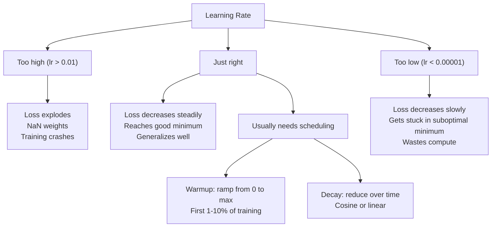
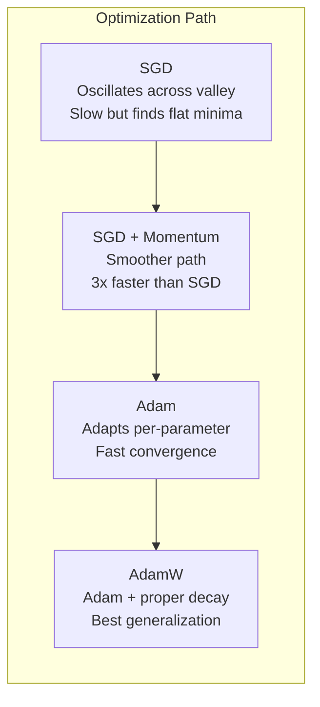
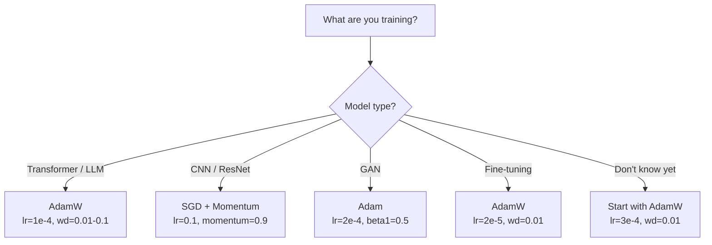

# 优化器

> 梯度下降告诉你该朝哪个方向移动。它没有说明要移动多远或多快。SGD是指南针。Adam是带有交通数据的GPS。

**类型:** 构建  
**语言:** Python  
**先修课程:** 课程 03.05（损失函数）  
**时间:** ~75分钟

## 学习目标

- 从零开始用Python实现SGD、带动量的SGD、Adam和AdamW优化器
- 解释Adam的偏差校正如何补偿早期训练步骤中零初始化的动量估计
- 演示为什么AdamW在同一任务上比带L2正则化的Adam产生更好的泛化效果
- 为Transformer、CNN、GAN和微调选择合适的优化器及默认超参数

## 问题所在

你已经计算了梯度。你知道权重#4,721应该减少0.003以降低损失。但0.003是什么单位？按什么比例缩放？而且在第1步和第1000步，应该移动相同的量吗？

原始梯度下降在每一步对每个参数应用相同的学习率：w = w - lr * 梯度。这在实践中带来了三个问题，使得训练神经网络变得困难。

首先是振荡。损失曲面很少像光滑的碗形。它更像是一个狭长的山谷。梯度指向山谷的横断面（陡峭方向），而不是沿山谷方向（平缓方向）。梯度下降在狭窄维度上来回反弹，而在有用的方向上进展甚微。你见过这种情况：损失快速下降然后进入平台期，不是因为模型收敛了，而是因为它在振荡。

其次，所有参数使用同一个学习率是错误的。有些权重需要较大的更新（它们处于欠拟合的早期阶段）。其他则需要微小的更新（它们已接近最优值）。适用于前者的学习率会破坏后者，反之亦然。

第三，鞍点。在高维空间中，损失曲面存在大片梯度接近零的平坦区域。原始SGD以梯度的速度爬过这些区域，实际上就是零速度。模型看起来卡住了。它并没有卡住——它只是在平坦区域的这一侧，有用的下降在另一侧。但SGD没有机制来推进。

Adam解决了所有这三个问题。它为每个参数维护两个移动平均值——平均梯度（动量，处理振荡）和平均平方梯度（自适应率，处理不同尺度）。结合最初几步的偏差校正，它为你提供了一个在80%的问题上默认超参数就能工作的单一优化器。本课程将从零开始构建它，以便你准确理解它在其余20%问题上何时以及为何会失败。

## 概念

### 随机梯度下降（SGD）

最简单的优化器。在一个小批量上计算梯度，并沿相反方向更新。

```
w = w - lr * gradient
```

"随机"意味着你使用数据的随机子集（小批量）来估计梯度，而不是使用整个数据集。这种噪声实际上是有用的——它有助于逃离尖锐的局部极小值。但噪声也会导致振荡。

学习率是唯一的调节旋钮。太高：损失发散。太低：训练需要很长时间。最优值取决于架构、数据、批量大小和当前的训练阶段。对于现代网络上的原始SGD，典型值范围是0.01到0.1。但即使在一次训练运行中，理想的学习率也会变化。

### 动量

小球滚下山坡的类比虽然被过度使用但很准确。你不是仅根据梯度进行更新，而是维护一个累积过去梯度的速度。

```
m_t = beta * m_{t-1} + gradient
w = w - lr * m_t
```

Beta（通常为0.9）控制保留多少历史。当beta = 0.9时，动量大约是最近10个梯度的平均值（1 / (1 - 0.9) = 10）。

这如何解决振荡：指向相同方向的梯度会累积。方向反转的梯度会相互抵消。在那个狭窄的山谷中，"横跨"分量每一步都会反转符号并被抑制。"沿山谷"分量保持一致并被放大。结果是在有用的方向上平滑加速。

实际数字：在条件差的损失曲面上，仅SGD可能需要10,000步。带动量的SGD（beta=0.9）在相同问题上通常需要3,000-5,000步。加速效果并非微不足道。

### RMSProp

第一个真正有效的逐参数自适应学习率方法。由Hinton在Coursera讲座中提出（从未正式发表）。

```
s_t = beta * s_{t-1} + (1 - beta) * gradient^2
w = w - lr * gradient / (sqrt(s_t) + epsilon)
```

s_t 跟踪梯度平方的移动平均值。梯度持续较大的参数会被除以一个较大的数（有效学习率变小）。梯度较小的参数会被除以一个较小的数（有效学习率变大）。

这解决了"所有参数使用同一学习率"的问题。一个已经获得较大更新的权重可能接近其目标——减慢它。一个只获得微小更新的权重可能训练不足——加快它。

Epsilon（通常为1e-8）防止当某个参数未被更新时除以零。

### Adam：动量 + RMSProp

Adam结合了两种思想。它为每个参数维护两个指数移动平均值：

```
m_t = beta1 * m_{t-1} + (1 - beta1) * gradient        (first moment: mean)
v_t = beta2 * v_{t-1} + (1 - beta2) * gradient^2       (second moment: variance)
```

**偏差校正**是大多数解释跳过的关键细节。在第1步，m_1 = (1 - beta1) * 梯度。当beta1 = 0.9时，就是0.1 * 梯度——小了十倍。移动平均值还没有预热。偏差校正进行了补偿：

```
m_hat = m_t / (1 - beta1^t)
v_hat = v_t / (1 - beta2^t)
```

在beta1 = 0.9时的第1步：m_hat = m_1 / (1 - 0.9) = m_1 / 0.1 = 实际的梯度。在第100步：(1 - 0.9^100) 大约等于1.0，因此校正消失。偏差校正在最初约10步内很重要，在约50步后变得无关紧要。

更新规则：

```
w = w - lr * m_hat / (sqrt(v_hat) + epsilon)
```

Adam默认值：lr = 0.001, beta1 = 0.9, beta2 = 0.999, epsilon = 1e-8。这些默认值适用于80%的问题。当不适用时，首先更改lr。然后是beta2。几乎不需要更改beta1或epsilon。

### AdamW：正确实现权重衰减

L2正则化向损失函数添加 lambda * w^2。在原始SGD中，这等价于权重衰减（在每一步从权重中减去 lambda * w）。在Adam中，这种等价性失效了。

Loshchilov 和 Hutter 的见解是：当你将L2添加到损失中，然后Adam处理梯度时，自适应学习率也会缩放正则化项。梯度方差大的参数得到较少的正则化。梯度方差小的参数得到较多的正则化。这不是你想要的——你希望无论梯度统计如何，都能获得均匀的正则化。

AdamW通过直接对权重应用权重衰减来解决这个问题，在Adam更新之后：

```
w = w - lr * m_hat / (sqrt(v_hat) + epsilon) - lr * lambda * w
```

权重衰减项（lr * lambda * w）没有被Adam的自适应因子缩放。每个参数获得相同比例的收缩。

这看起来像是一个微小的细节。其实不然。在几乎每一项任务上，AdamW都比Adam + L2正则化收敛到更好的解。它是PyTorch中训练Transformer、扩散模型和大多数现代架构的默认优化器。BERT、GPT、LLaMA、Stable Diffusion——都是用AdamW训练的。

### 学习率：最重要的超参数



如果你要调整一个超参数，那就调整学习率。学习率变化10倍比你做出的任何架构决策都更重要。常见默认值：

- SGD：lr = 0.01 到 0.1
- Adam/AdamW：lr = 1e-4 到 3e-4
- 微调预训练模型：lr = 1e-5 到 5e-5
- 学习率预热：在训练的前1-10%步数内线性增加

### 优化器比较



### 各优化器的优势场景



## 构建它

### 步骤 1：原始 SGD

```python
class SGD:
    def __init__(self, lr=0.01):
        self.lr = lr

    def step(self, params, grads):
        for i in range(len(params)):
            params[i] -= self.lr * grads[i]
```

### 步骤 2：带动量的 SGD

```python
class SGDMomentum:
    def __init__(self, lr=0.01, beta=0.9):
        self.lr = lr
        self.beta = beta
        self.velocities = None

    def step(self, params, grads):
        if self.velocities is None:
            self.velocities = [0.0] * len(params)
        for i in range(len(params)):
            self.velocities[i] = self.beta * self.velocities[i] + grads[i]
            params[i] -= self.lr * self.velocities[i]
```

### 步骤 3：Adam

```python
import math

class Adam:
    def __init__(self, lr=0.001, beta1=0.9, beta2=0.999, epsilon=1e-8):
        self.lr = lr
        self.beta1 = beta1
        self.beta2 = beta2
        self.epsilon = epsilon
        self.m = None
        self.v = None
        self.t = 0

    def step(self, params, grads):
        if self.m is None:
            self.m = [0.0] * len(params)
            self.v = [0.0] * len(params)

        self.t += 1

        for i in range(len(params)):
            self.m[i] = self.beta1 * self.m[i] + (1 - self.beta1) * grads[i]
            self.v[i] = self.beta2 * self.v[i] + (1 - self.beta2) * grads[i] ** 2

            m_hat = self.m[i] / (1 - self.beta1 ** self.t)
            v_hat = self.v[i] / (1 - self.beta2 ** self.t)

            params[i] -= self.lr * m_hat / (math.sqrt(v_hat) + self.epsilon)
```

### 步骤 4：AdamW

```python
class AdamW:
    def __init__(self, lr=0.001, beta1=0.9, beta2=0.999, epsilon=1e-8, weight_decay=0.01):
        self.lr = lr
        self.beta1 = beta1
        self.beta2 = beta2
        self.epsilon = epsilon
        self.weight_decay = weight_decay
        self.m = None
        self.v = None
        self.t = 0

    def step(self, params, grads):
        if self.m is None:
            self.m = [0.0] * len(params)
            self.v = [0.0] * len(params)

        self.t += 1

        for i in range(len(params)):
            self.m[i] = self.beta1 * self.m[i] + (1 - self.beta1) * grads[i]
            self.v[i] = self.beta2 * self.v[i] + (1 - self.beta2) * grads[i] ** 2

            m_hat = self.m[i] / (1 - self.beta1 ** self.t)
            v_hat = self.v[i] / (1 - self.beta2 ** self.t)

            params[i] -= self.lr * m_hat / (math.sqrt(v_hat) + self.epsilon)
            params[i] -= self.lr * self.weight_decay * params[i]
```

### 步骤 5：训练对比

使用所有四种优化器在课程05中的圆形数据集上训练同一个两层网络。比较收敛性。

```python
import random

def sigmoid(x):
    x = max(-500, min(500, x))
    return 1.0 / (1.0 + math.exp(-x))

def make_circle_data(n=200, seed=42):
    random.seed(seed)
    data = []
    for _ in range(n):
        x = random.uniform(-2, 2)
        y = random.uniform(-2, 2)
        label = 1.0 if x * x + y * y < 1.5 else 0.0
        data.append(([x, y], label))
    return data


class OptimizerTestNetwork:
    def __init__(self, optimizer, hidden_size=8):
        random.seed(0)
        self.hidden_size = hidden_size
        self.optimizer = optimizer

        self.w1 = [[random.gauss(0, 0.5) for _ in range(2)] for _ in range(hidden_size)]
        self.b1 = [0.0] * hidden_size
        self.w2 = [random.gauss(0, 0.5) for _ in range(hidden_size)]
        self.b2 = 0.0

    def get_params(self):
        params = []
        for row in self.w1:
            params.extend(row)
        params.extend(self.b1)
        params.extend(self.w2)
        params.append(self.b2)
        return params

    def set_params(self, params):
        idx = 0
        for i in range(self.hidden_size):
            for j in range(2):
                self.w1[i][j] = params[idx]
                idx += 1
        for i in range(self.hidden_size):
            self.b1[i] = params[idx]
            idx += 1
        for i in range(self.hidden_size):
            self.w2[i] = params[idx]
            idx += 1
        self.b2 = params[idx]

    def forward(self, x):
        self.x = x
        self.z1 = []
        self.h = []
        for i in range(self.hidden_size):
            z = self.w1[i][0] * x[0] + self.w1[i][1] * x[1] + self.b1[i]
            self.z1.append(z)
            self.h.append(max(0.0, z))

        self.z2 = sum(self.w2[i] * self.h[i] for i in range(self.hidden_size)) + self.b2
        self.out = sigmoid(self.z2)
        return self.out

    def compute_grads(self, target):
        eps = 1e-15
        p = max(eps, min(1 - eps, self.out))
        d_loss = -(target / p) + (1 - target) / (1 - p)
        d_sigmoid = self.out * (1 - self.out)
        d_out = d_loss * d_sigmoid

        grads = [0.0] * (self.hidden_size * 2 + self.hidden_size + self.hidden_size + 1)
        idx = 0
        for i in range(self.hidden_size):
            d_relu = 1.0 if self.z1[i] > 0 else 0.0
            d_h = d_out * self.w2[i] * d_relu
            grads[idx] = d_h * self.x[0]
            grads[idx + 1] = d_h * self.x[1]
            idx += 2

        for i in range(self.hidden_size):
            d_relu = 1.0 if self.z1[i] > 0 else 0.0
            grads[idx] = d_out * self.w2[i] * d_relu
            idx += 1

        for i in range(self.hidden_size):
            grads[idx] = d_out * self.h[i]
            idx += 1

        grads[idx] = d_out
        return grads

    def train(self, data, epochs=300):
        losses = []
        for epoch in range(epochs):
            total_loss = 0.0
            correct = 0
            for x, y in data:
                pred = self.forward(x)
                grads = self.compute_grads(y)
                params = self.get_params()
                self.optimizer.step(params, grads)
                self.set_params(params)

                eps = 1e-15
                p = max(eps, min(1 - eps, pred))
                total_loss += -(y * math.log(p) + (1 - y) * math.log(1 - p))
                if (pred >= 0.5) == (y >= 0.5):
                    correct += 1
            avg_loss = total_loss / len(data)
            accuracy = correct / len(data) * 100
            losses.append((avg_loss, accuracy))
            if epoch % 75 == 0 or epoch == epochs - 1:
                print(f"    Epoch {epoch:3d}: loss={avg_loss:.4f}, accuracy={accuracy:.1f}%")
        return losses
```

## 使用它

PyTorch优化器处理参数组、梯度裁剪和学习率调度：

```python
import torch
import torch.optim as optim

model = torch.nn.Sequential(
    torch.nn.Linear(784, 256),
    torch.nn.ReLU(),
    torch.nn.Linear(256, 10),
)

optimizer = optim.AdamW(model.parameters(), lr=3e-4, weight_decay=0.01)

scheduler = optim.lr_scheduler.CosineAnnealingLR(optimizer, T_max=100)

for epoch in range(100):
    optimizer.zero_grad()
    output = model(torch.randn(32, 784))
    loss = torch.nn.functional.cross_entropy(output, torch.randint(0, 10, (32,)))
    loss.backward()
    torch.nn.utils.clip_grad_norm_(model.parameters(), max_norm=1.0)
    optimizer.step()
    scheduler.step()
```

模式始终是：zero_grad, forward, loss, backward, (clip), step, (schedule)。记住这个顺序。搞错顺序（例如，在optimizer.step()之前调用scheduler.step()）是常见细微错误的根源。

对于CNN，许多从业者仍然偏好SGD + 动量（lr=0.1, momentum=0.9, weight_decay=1e-4）配合阶梯式或余弦调度。SGD能找到更平坦的极小值，这通常能带来更好的泛化。对于Transformer和大语言模型（LLM），AdamW + 预热 + 余弦衰减是通用的默认设置。没有经过验证的理由，不要违背共识。

## 交付

本课程产出：
- `outputs/prompt-optimizer-selector.md` – 一个用于为任何架构选择正确优化器和学习率的决策提示

## 练习

1. 实现Nesterov动量，你在"前瞻"位置（w - lr * beta * v）而不是当前位置计算梯度。在圆形数据集上将其收敛性与标准动量进行比较。

2. 实现学习率预热调度：在前10%的训练步骤内从0线性增加到最大学习率（max_lr），然后余弦衰减到0。使用Adam + 预热与不使用预热的Adam进行训练。测量在圆形数据集上达到90%准确率所需的epoch数。

3. 在Adam训练期间跟踪每个参数的有效学习率。有效学习率为 lr * m_hat / (sqrt(v_hat) + eps)。在第10、50和200步后绘制有效学习率的分布图。所有参数是否以相同速度更新？

4. 实现梯度裁剪（按全局范数裁剪）。将最大梯度范数设为1.0。使用高学习率（Adam的lr=0.01）分别进行带裁剪和不带裁剪的训练。在10个随机种子下，统计带裁剪和不带裁剪时有多少次运行发散（损失变为NaN）。

5. 在一个权重较大的网络上比较Adam与AdamW。将所有权重初始化为[-5, 5]范围内的随机值（远大于正常值）。使用权重衰减（weight_decay=0.1）训练200个epoch。为两种优化器绘制训练过程中权重L2范数的变化图。AdamW应显示出更快的权重收缩。

## 关键术语

| 术语 | 人们的说法 | 实际含义 |
|------|------------|----------|
| 学习率 | "步长" | 梯度更新的标量乘数；训练中最具影响力的超参数 |
| SGD | "基本梯度下降" | 随机梯度下降：通过减去 lr * 梯度来更新权重，梯度在小批量上计算 |
| 动量 | "滚动的球" | 过去梯度的指数移动平均；抑制振荡并加速一致的方向 |
| RMSProp | "自适应学习率" | 将每个参数的梯度除以其近期梯度的均方根（RMS）；均衡学习率 |
| Adam | "默认优化器" | 结合了动量（一阶矩）和RMSProp（二阶矩），并带有初始步骤的偏差校正 |
| AdamW | "正确实现的Adam" | 带有解耦权重衰减的Adam；直接对权重应用正则化，而不是通过梯度 |
| 偏差校正 | "移动平均的预热" | 除以 (1 - beta^t) 以补偿Adam动量估计的零初始化 |
| 权重衰减 | "缩小权重" | 在每一步减去权重值的一个比例；惩罚大权重的正则化器 |
| 学习率调度 | "随时间改变学习率" | 在训练期间调整学习率的函数；预热 + 余弦衰减是现代默认设置 |
| 梯度裁剪 | "限制梯度范数" | 当梯度向量的范数超过阈值时对其进行缩放；防止梯度更新爆炸 |

## 延伸阅读

- Kingma & Ba, "Adam: A Method for Stochastic Optimization" (2014) – 原始Adam论文，包含收敛分析和偏差校正推导
- Loshchilov & Hutter, "Decoupled Weight Decay Regularization" (2017) – 证明了在Adam中L2正则化和权重衰减并不等价，并提出了AdamW
- Smith, "Cyclical Learning Rates for Training Neural Networks" (2017) – 引入了学习率范围测试和循环调度，消除了调整固定学习率的需要
- Ruder, "An Overview of Gradient Descent Optimization Algorithms" (2016) – 关于所有优化器变体的最佳综述，包含清晰的比较和直觉解释