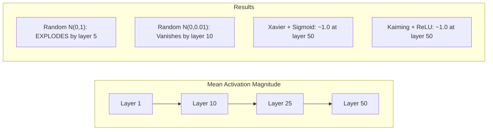
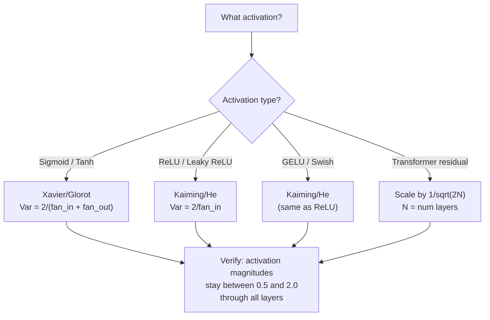

# 权重初始化与训练稳定性

> 错误初始化，训练无法开始。正确初始化，50层网络也能像3层一样平稳训练。

**类型：** 构建
**语言：** Python
**先决课程：** 03.04课（激活函数）、03.07课（正则化）
**时间：** ~90分钟

## 学习目标

- 实现零初始化、随机初始化、Xavier/Glorot初始化和Kaiming/He初始化策略，并通过50层网络测量其对激活幅度的影响
- 推导为何Xavier初始化使用 Var(w) = 2/(fan_in + fan_out)，而Kaiming使用 Var(w) = 2/fan_in
- 演示零初始化的对称性问题，并解释为何仅靠随机尺度是不够的
- 将正确的初始化策略与激活函数匹配：sigmoid/tanh使用Xavier，ReLU/GELU使用Kaiming

## 问题所在

将所有权重初始化为零。什么都学不会。每个神经元计算相同的函数，接收相同的梯度，并以完全相同的方式更新。经过10000个epoch后，你的512神经元隐藏层仍然是512个相同神经元的复制品。你付了512个参数的钱，只得到了1个。

初始化值太大。激活值会在网络中爆炸式增长。到第10层，数值达到1e15。到第20层，它们溢出到无穷大。梯度也沿反向路径经历相同的轨迹。

从标准正态分布随机初始化。对3层网络有效。到50层时，根据随机尺度是略小还是略大，信号要么衰减到零，要么爆炸到无穷大。"有效"与"失效"之间的界限极其细微。

权重初始化是深度学习中最被低估的决策。架构能发表论文。优化器能撰写博客。而初始化只出现在脚注中。但如果出错，其他一切都无关紧要——你的网络在训练开始前就已经死了。

## 概念理解

### 对称性问题

层中的每个神经元具有相同的结构：将输入乘以权重，加上偏置，应用激活函数。如果所有权重都从相同的值开始（零是极端情况），每个神经元将计算出相同的输出。在反向传播期间，每个神经元接收相同的梯度。在更新步骤中，每个神经元以相同的量改变。

你陷入了困境。网络有数百个参数，但它们全部同步移动。这称为对称性，而随机初始化是打破它的粗暴方法。每个神经元从权重空间中的不同点开始，因此每个神经元学习不同的特征。

但"随机"是不够的。随机性的 *尺度* 决定了网络能否训练。

### 通过各层的方差传播

考虑一个具有 fan_in 个输入的单层：

```
z = w1*x1 + w2*x2 + ... + w_n*x_n
```

如果每个权重 wi 来自方差为 Var(w) 的分布，每个输入 xi 的方差为 Var(x)，则输出方差为：

```
Var(z) = fan_in * Var(w) * Var(x)
```

如果 Var(w) = 1 且 fan_in = 512，则输出方差是输入方差的512倍。经过10层后：512^10 = 1.2e27。你的信号爆炸了。

如果 Var(w) = 0.001，则每层输出方差缩减 0.001 * 512 = 0.512 倍。经过10层后：0.512^10 = 0.00013。你的信号消失了。

目标：选择 Var(w) 使得 Var(z) = Var(x)。信号幅度在各层间保持恒定。

### Xavier/Glorot 初始化

Glorot和Bengio (2010) 针对sigmoid和tanh激活函数推导出了该解。为了在前向和反向传播中保持方差恒定：

```
Var(w) = 2 / (fan_in + fan_out)
```

实践中，权重从以下分布抽取：

```
w ~ Uniform(-limit, limit)  where limit = sqrt(6 / (fan_in + fan_out))
```

或：

```
w ~ Normal(0, sqrt(2 / (fan_in + fan_out)))
```

这之所以有效，是因为sigmoid和tanh在零点附近是近似线性的，而经过适当初始化的激活值就处于该区域。方差通过数十层保持稳定。

### Kaiming/He 初始化

ReLU会将一半的输出置零（所有负值变为零）。由于平均而言一半输入被置零，有效的 fan_in 减半。Xavier初始化没有考虑这一点——它低估了所需的方差。

He等人 (2015) 调整了公式：

```
Var(w) = 2 / fan_in
```

权重从以下分布抽取：

```
w ~ Normal(0, sqrt(2 / fan_in))
```

乘以2的因子是为了补偿ReLU将一半激活置零的情况。如果没有这个因子，信号每层大约衰减0.5倍。经过50层：0.5^50 = 8.8e-16。Kaiming初始化防止了这种情况。

### Transformer 初始化

GPT-2引入了一种不同的模式。残差连接将每个子层的输出加到其输入上：

```
x = x + sublayer(x)
```

每次加法都会增加方差。有N个残差层时，方差与N成比例增长。GPT-2将残差层的权重缩放 1/sqrt(2N)，其中N是层数。这保持了累积信号幅度的稳定。

Llama 3 (4050亿参数，126层) 使用了类似的方案。如果没有这种缩放，残差流将在126层的注意力和前馈块中无限增长。

```mermaid
flowchart TD
    subgraph "Zero Init"
        Z1["Layer 1<br/>All weights = 0"] --> Z2["Layer 2<br/>All neurons identical"]
        Z2 --> Z3["Layer 3<br/>Still identical"]
        Z3 --> ZR["Result: 1 effective neuron<br/>regardless of width"]
    end

    subgraph "Xavier Init"
        X1["Layer 1<br/>Var = 2/(fan_in+fan_out)"] --> X2["Layer 2<br/>Signal stable"]
        X2 --> X3["Layer 50<br/>Signal stable"]
        X3 --> XR["Result: Trains with<br/>sigmoid/tanh"]
    end

    subgraph "Kaiming Init"
        K1["Layer 1<br/>Var = 2/fan_in"] --> K2["Layer 2<br/>Signal stable"]
        K2 --> K3["Layer 50<br/>Signal stable"]
        K3 --> KR["Result: Trains with<br/>ReLU/GELU"]
    end
```



### 通过50层的激活幅度



### 选择正确的初始化



## 动手构建

### 步骤1：初始化策略

四种初始化权重矩阵的方法。每种方法返回一个列表的列表（一个二维矩阵），具有 fan_in 列和 fan_out 行。

```python
import math
import random


def zero_init(fan_in, fan_out):
    return [[0.0 for _ in range(fan_in)] for _ in range(fan_out)]


def random_init(fan_in, fan_out, scale=1.0):
    return [[random.gauss(0, scale) for _ in range(fan_in)] for _ in range(fan_out)]


def xavier_init(fan_in, fan_out):
    std = math.sqrt(2.0 / (fan_in + fan_out))
    return [[random.gauss(0, std) for _ in range(fan_in)] for _ in range(fan_out)]


def kaiming_init(fan_in, fan_out):
    std = math.sqrt(2.0 / fan_in)
    return [[random.gauss(0, std) for _ in range(fan_in)] for _ in range(fan_out)]
```

### 步骤2：激活函数

我们需要sigmoid、tanh和ReLU来测试每种初始化策略与其预期的激活函数。

```python
def sigmoid(x):
    x = max(-500, min(500, x))
    return 1.0 / (1.0 + math.exp(-x))


def tanh_act(x):
    return math.tanh(x)


def relu(x):
    return max(0.0, x)
```

### 步骤3：通过50层的前向传播

将随机数据通过一个深层网络，并在每一层测量平均激活幅度。

```python
def forward_deep(init_fn, activation_fn, n_layers=50, width=64, n_samples=100):
    random.seed(42)
    layer_magnitudes = []

    inputs = [[random.gauss(0, 1) for _ in range(width)] for _ in range(n_samples)]

    for layer_idx in range(n_layers):
        weights = init_fn(width, width)
        biases = [0.0] * width

        new_inputs = []
        for sample in inputs:
            output = []
            for neuron_idx in range(width):
                z = sum(weights[neuron_idx][j] * sample[j] for j in range(width)) + biases[neuron_idx]
                output.append(activation_fn(z))
            new_inputs.append(output)
        inputs = new_inputs

        magnitudes = []
        for sample in inputs:
            magnitudes.append(sum(abs(v) for v in sample) / width)
        mean_mag = sum(magnitudes) / len(magnitudes)
        layer_magnitudes.append(mean_mag)

    return layer_magnitudes
```

### 步骤4：实验

运行所有组合：零初始化、随机 N(0,1)、随机 N(0,0.01)、Xavier 与 sigmoid、Xavier 与 tanh、Kaiming 与 ReLU。在关键层打印幅度。

```python
def run_experiment():
    configs = [
        ("Zero init + Sigmoid", lambda fi, fo: zero_init(fi, fo), sigmoid),
        ("Random N(0,1) + ReLU", lambda fi, fo: random_init(fi, fo, 1.0), relu),
        ("Random N(0,0.01) + ReLU", lambda fi, fo: random_init(fi, fo, 0.01), relu),
        ("Xavier + Sigmoid", xavier_init, sigmoid),
        ("Xavier + Tanh", xavier_init, tanh_act),
        ("Kaiming + ReLU", kaiming_init, relu),
    ]

    print(f"{'Strategy':<30} {'L1':>10} {'L5':>10} {'L10':>10} {'L25':>10} {'L50':>10}")
    print("-" * 80)

    for name, init_fn, act_fn in configs:
        mags = forward_deep(init_fn, act_fn)
        row = f"{name:<30}"
        for idx in [0, 4, 9, 24, 49]:
            val = mags[idx]
            if val > 1e6:
                row += f" {'EXPLODED':>10}"
            elif val < 1e-6:
                row += f" {'VANISHED':>10}"
            else:
                row += f" {val:>10.4f}"
        print(row)
```

### 步骤5：对称性演示

展示零初始化会产生相同的神经元。

```python
def symmetry_demo():
    random.seed(42)
    weights = zero_init(2, 4)
    biases = [0.0] * 4

    inputs = [0.5, -0.3]
    outputs = []
    for neuron_idx in range(4):
        z = sum(weights[neuron_idx][j] * inputs[j] for j in range(2)) + biases[neuron_idx]
        outputs.append(sigmoid(z))

    print("\nSymmetry Demo (4 neurons, zero init):")
    for i, out in enumerate(outputs):
        print(f"  Neuron {i}: output = {out:.6f}")
    all_same = all(abs(outputs[i] - outputs[0]) < 1e-10 for i in range(len(outputs)))
    print(f"  All identical: {all_same}")
    print(f"  Effective parameters: 1 (not {len(weights) * len(weights[0])})")
```

### 步骤6：逐层幅度报告

打印一个可视化条形图，显示通过50层的激活幅度。

```python
def magnitude_report(name, magnitudes):
    print(f"\n{name}:")
    for i, mag in enumerate(magnitudes):
        if i % 5 == 0 or i == len(magnitudes) - 1:
            if mag > 1e6:
                bar = "X" * 50 + " EXPLODED"
            elif mag < 1e-6:
                bar = "." + " VANISHED"
            else:
                bar_len = min(50, max(1, int(mag * 10)))
                bar = "#" * bar_len
            print(f"  Layer {i+1:3d}: {bar} ({mag:.6f})")
```

## 实践应用

PyTorch提供了这些内置函数：

```python
import torch
import torch.nn as nn

layer = nn.Linear(512, 256)

nn.init.xavier_uniform_(layer.weight)
nn.init.xavier_normal_(layer.weight)

nn.init.kaiming_uniform_(layer.weight, nonlinearity='relu')
nn.init.kaiming_normal_(layer.weight, nonlinearity='relu')

nn.init.zeros_(layer.bias)
```

当你调用 `nn.Linear(512, 256)` 时，PyTorch默认使用Kaiming均匀初始化。这就是为什么大多数简单网络"开箱即用"——PyTorch已经做出了正确的选择。但当你构建自定义架构或网络深度超过20层时，你需要了解正在发生的事情，并可能覆盖默认设置。

对于Transformer，HuggingFace的模型通常在其 `_init_weights` 方法中处理初始化。GPT-2的实现将残差投影缩放 1/sqrt(N)。如果你从头构建一个Transformer，你需要自己添加这个。

## 产出成果

本课程将产出：
- `outputs/prompt-init-strategy.md` -- 一个用于诊断权重初始化问题并推荐正确策略的提示

## 练习

1. 添加LeCun初始化 (Var = 1/fan_in，专为SELU激活函数设计)。使用LeCun初始化 + tanh运行50层实验，并与Xavier + tanh进行比较。

2. 实现GPT-2的残差缩放：在将每个层的输出加到残差流之前，乘以 1/sqrt(2*N)。在50层网络上分别运行有缩放和无缩放的版本，测量残差幅度的增长速度。

3. 创建一个"初始化健康检查"函数，该函数接受网络的层维度和激活类型，然后推荐正确的初始化，并警告当前的初始化是否会导致问题。

4. 使用 fan_in = 16 和 fan_in = 1024 运行实验。Xavier和Kaiming会根据 fan_in 进行调整，但随机初始化不会。展示随着层变大，"有效"与"失效"之间的差距如何扩大。

5. 实现正交初始化（生成一个随机矩阵，计算其SVD，使用正交矩阵U）。在50层ReLU网络上与Kaiming进行比较。

## 关键术语

| 术语 | 人们怎么说 | 其实际含义 |
|------|----------------|----------------------|
| 权重初始化 | "随机设置初始权重" | 选择初始权重值的策略，决定了网络是否能够进行训练 |
| 打破对称性 | "让神经元不同" | 使用随机初始化来确保神经元学习不同的特征，而不是计算相同的函数 |
| Fan-in | "神经元的输入数量" | 传入连接的数量，决定了输入方差如何在加权和中累积 |
| Fan-out | "神经元的输出数量" | 传出连接的数量，与在反向传播期间维持梯度方差有关 |
| Xavier/Glorot 初始化 | "sigmoid的初始化" | Var(w) = 2/(fan_in + fan_out)，旨在通过sigmoid和tanh激活函数保持方差 |
| Kaiming/He 初始化 | "ReLU的初始化" | Var(w) = 2/fan_in，考虑了ReLU将一半激活置零的情况 |
| 方差传播 | "信号如何通过各层增长或衰减" | 根据权重尺度，分析激活方差如何逐层变化的数学方法 |
| 残差缩放 | "GPT-2的初始化技巧" | 将残差连接权重缩放 1/sqrt(2N)，以防止通过N个Transformer层时方差增长 |
| 死亡网络 | "什么都训不了" | 由于糟糕的初始化导致所有梯度为零或所有激活饱和的网络 |
| 激活爆炸 | "数值趋向无穷大" | 当权重方差太高时，导致激活幅度通过各层呈指数增长 |

## 扩展阅读

- Glorot & Bengio, "Understanding the difficulty of training deep feedforward neural networks" (2010) -- Xavier初始化的原始论文，包含方差分析
- He et al., "Delving Deep into Rectifiers" (2015) -- 介绍了针对ReLU网络的Kaiming初始化
- Radford et al., "Language Models are Unsupervised Multitask Learners" (2019) -- GPT-2论文，包含残差缩放初始化
- Mishkin & Matas, "All You Need is a Good Init" (2016) -- 层序单位方差初始化，一个分析公式的经验替代方案