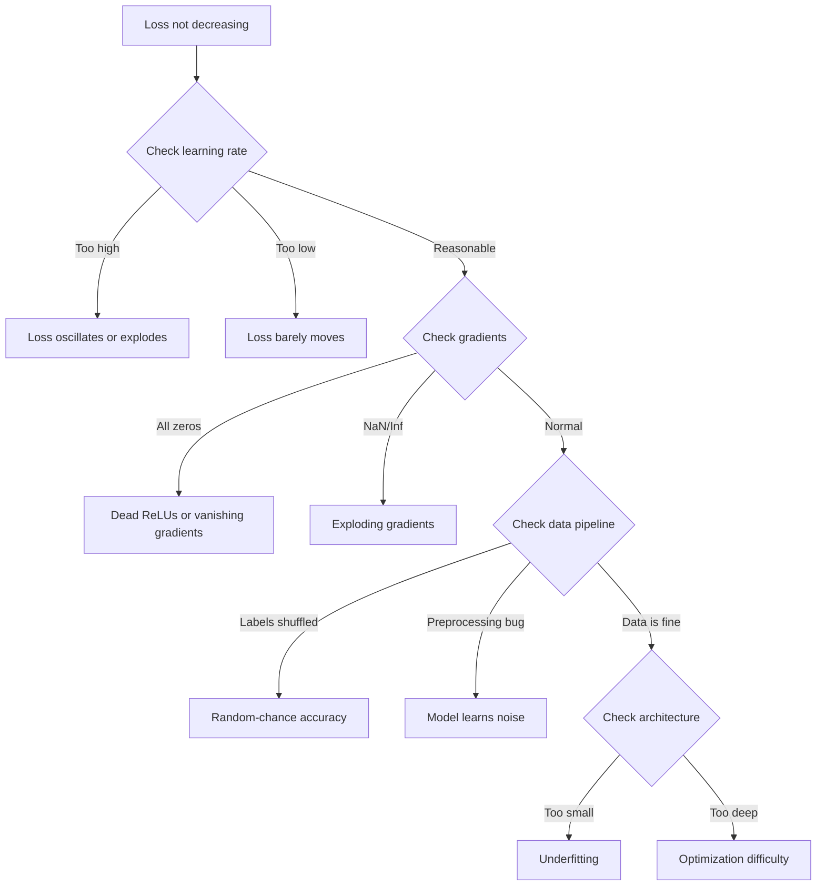
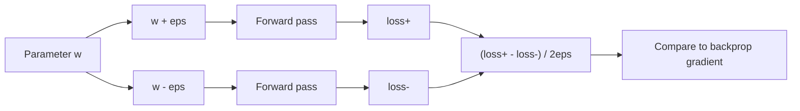
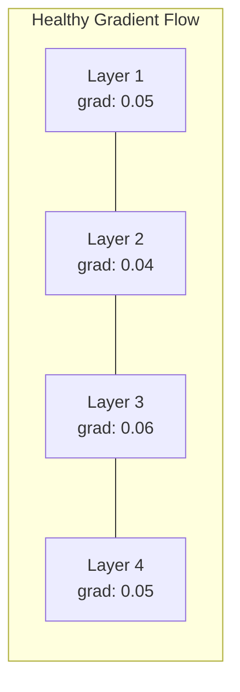
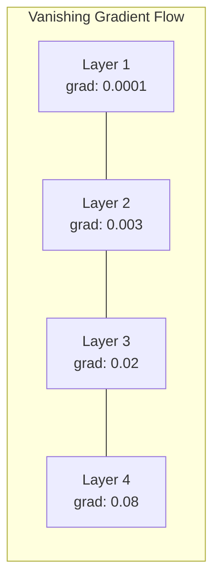
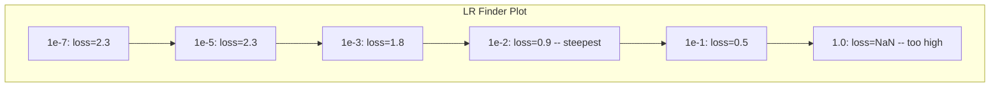

# 神经网络调试

> 你的网络编译通过了。它能运行。它输出了一个数值。数值是错的，但程序没有崩溃。欢迎来到最难的调试类型——没有错误提示的调试。

**类型：** 实践  
**语言：** Python, PyTorch  
**先修课程：** 阶段03 第01-10课（尤其是反向传播、损失函数、优化器）  
**时间：** ~90分钟

## 学习目标

- 运用系统性调试策略诊断常见的神经网络故障（损失为NaN、损失曲线平坦、过拟合、振荡）
- 应用“单批数据过拟合”技术来验证模型架构和训练循环是否正确
- 检查梯度大小、激活分布和权重范数，以识别梯度消失/爆炸问题
- 构建一个覆盖数据管道、模型架构、损失函数、优化器和学习率问题的调试清单

## 问题所在

传统软件在出错时会崩溃。空指针会抛出异常。类型不匹配在编译时就会失败。索引错误会产生明显错误的输出。

神经网络不会给你这种便利。

一个有问题的神经网络会完整运行，打印损失值，并输出预测结果。损失可能会下降。预测看起来可能合理。但模型正在静默地犯错——学习捷径、记忆噪声，或收敛到一个无用的局部最小值。谷歌研究人员估计，60-70%的机器学习调试时间都花在那些不产生错误但降低模型质量的“静默”缺陷上。

一个有效模型和一个损坏模型之间的区别，往往只是一行代码的错位：一个缺失的 `zero_grad()`，一个转置的维度，一个错误10倍的学习率。经典的“神经网络训练配方”（2019）开篇就写道：“最常见的神经网络错误是那些不会导致崩溃的缺陷。”

本课将教你如何找到这些缺陷。

## 核心概念

### 调试心态

忘记“打印然后祈祷”式的调试。神经网络调试需要系统性的方法，因为反馈循环很慢（每次训练运行需要几分钟到几小时），并且症状很模糊（坏的损失值可能意味着20种不同的问题）。

黄金法则：**从简单开始，一次只增加一部分复杂性，并独立验证每一部分。**



### 症状1：损失不下降

这是最常见的抱怨。训练循环在运行，epoch在流逝，但损失保持平坦或剧烈振荡。

**学习率错误。** 太高：损失振荡或跳跃到NaN。太低：损失下降极其缓慢，看起来像是平的。对于Adam，从1e-3开始。对于SGD，从1e-1或1e-2开始。在断定是其他问题之前，总是先尝试3个跨度10倍的学习率（例如，1e-2, 1e-3, 1e-4）。

**死亡ReLU。** 如果一个ReLU神经元接收到大的负输入，它会输出0，且其梯度为0。它将永远不再激活。如果足够多的神经元死亡，网络将无法学习。检查：在每个ReLU层之后，打印激活值恰好为0的比例。如果>50%是死亡的，切换到LeakyReLU或降低学习率。

**梯度消失。** 在具有sigmoid或tanh激活的深度网络中，梯度在反向传播过程中会指数级收缩。当到达第一层时，它们已经接近~0。第一层停止学习。修复：使用ReLU/GELU，添加残差连接，或使用批归一化。

**梯度爆炸。** 相反的问题——梯度指数级增长。在RNN和非常深的网络中很常见。损失跳跃到NaN。修复：梯度裁剪 (`torch.nn.utils.clip_grad_norm_`)，降低学习率，或添加归一化。

### 症状2：损失下降但模型不好

损失在下降。训练准确率达到99%。但测试准确率只有55%。或者模型在真实数据上产生无意义的输出。

**过拟合。** 模型记忆了训练数据，而不是学习规律。训练损失和验证损失之间的差距随时间增长。修复：更多数据、Dropout、权重衰减、早停、数据增强。

**数据泄露。** 测试数据泄露到了训练中。准确率高得可疑。常见原因：在划分前进行混洗、使用全数据集的统计量进行预处理、划分之间存在重复样本。修复：先划分，后预处理，检查重复项。

**标签错误。** 大多数真实数据集中有5-10%的标签是错误的（Northcutt等人，2021——“测试集中普遍存在的标签错误”）。模型学习了这些噪声。修复：使用置信学习来找到并修复错误标记的样本，或使用损失截断来忽略高损失样本。

### 症状3：损失中出现NaN或Inf

损失值变成 `nan` 或 `inf`。训练终止。

**学习率太高。** 梯度更新过大导致权重爆炸。修复：降低10倍。

**log(0) 或 log(负数)。** 交叉熵损失计算 `log(p)`。如果你的模型输出恰好是0或负概率，对数会爆炸。修复：将预测值限制在 `[eps, 1-eps]`，其中 `eps=1e-7`。

**除以零。** 批归一化除以标准差。一个全为常数值的批次，其标准差为0。修复：在分母中添加epsilon（PyTorch默认会这样做，但自定义实现可能不会）。

**数值溢出。** 大的激活值输入 `exp()` 会产生Inf。Softmax尤其容易出现这种情况。修复：在取指数前减去最大值（log-sum-exp技巧）。

### 技巧1：梯度检查

将你的解析梯度（来自反向传播）与数值梯度（来自有限差分）进行比较。如果它们不一致，说明你的反向传播有错误。

参数 `w` 的数值梯度：

```
grad_numerical = (loss(w + eps) - loss(w - eps)) / (2 * eps)
```

一致性度量（相对差异）：

```
rel_diff = |grad_analytical - grad_numerical| / max(|grad_analytical|, |grad_numerical|, 1e-8)
```

如果 `rel_diff < 1e-5`：正确。如果 `rel_diff > 1e-3`：几乎可以确定是bug。



### 技巧2：激活统计

在训练期间监控每一层之后的激活值均值和标准差。健康的网络会保持激活值的均值接近0，标准差接近1（归一化后），或者至少是有界的。

| 健康指标 | 均值 | 标准差 | 诊断 |
|-----------------|------|-----|-----------|
| 健康 | ~0 | ~1 | 网络正常学习 |
| 饱和 | >>0 或 <<0 | ~0 | 激活值卡在极值 |
| 死亡 | 0 | 0 | 神经元死亡（全为零） |
| 爆炸 | >>10 | >>10 | 激活值无界增长 |

### 技巧3：梯度流可视化

绘制每一层的平均梯度大小。在一个健康的网络中，各层的梯度大小应该大致相似。如果早期层的梯度比后期层小1000倍，那么你遇到了梯度消失问题。





### 技巧4：单批数据过拟合测试

深度学习中最重要的调试技巧。

取一个小批量数据（8-32个样本）。在上面训练100次以上。损失应该几乎降到零，训练准确率应该达到100%。如果没有，说明你的模型或训练循环存在根本性缺陷——不要进行完整训练。

这个测试可以发现：
- 损坏的损失函数
- 损坏的反向传播
- 模型太小而无法表示数据
- 优化器未连接到模型参数
- 数据和标签未对齐

运行这个测试只需30秒，却能节省数小时的调试完整训练运行的时间。

### 技巧5：学习率查找器

Leslie Smith (2017) 提出在一个epoch内将学习率从非常小（1e-7）扫描到非常大（10），同时记录损失。绘制损失 vs 学习率的曲线。最优学习率大约是损失开始下降最快的速率之前的10倍左右。



在此示例中最佳学习率：~1e-3（最陡峭点之前一个数量级）。

### 常见的PyTorch错误

这些是PyTorch社区中浪费最多集体时间的错误：

| 错误 | 症状 | 修复方法 |
|-----|---------|-----|
| 忘记 `optimizer.zero_grad()` | 梯度跨批次累积，损失振荡 | 在 `loss.backward()` 之前添加 `optimizer.zero_grad()` |
| 测试时忘记 `model.eval()` | Dropout和批归一化行为不同，测试准确率在不同运行间变化 | 添加 `model.eval()` 和 `torch.no_grad()` |
| 张量形状错误 | 静默广播产生错误结果，无报错 | 调试期间在每次操作后打印形状 |
| CPU/GPU不匹配 | `RuntimeError: expected CUDA tensor` | 对模型和数据都使用 `.to(device)` |
| 未分离张量 | 计算图无限增长，内存溢出 | 使用 `.detach()` 或 `with torch.no_grad()` |
| 原地操作破坏自动微分 | `RuntimeError: modified by in-place operation` | 将 `x += 1` 替换为 `x = x + 1` |
| 数据未归一化 | 损失卡在随机猜测水平 | 将输入归一化至均值=0，标准差=1 |
| 标签数据类型错误 | 交叉熵期望 `Long`，得到 `Float` | 转换标签：`labels.long()` |

### 主调试表

| 症状 | 可能原因 | 首先尝试 |
|---------|-------------|-------------------|
| 损失卡在 -log(1/类别数) | 模型预测均匀分布 | 检查数据管道，验证标签与输入匹配 |
| 几步后损失变为NaN | 学习率太高 | 将学习率降低10倍 |
| 损失立即变为NaN | log(0) 或除以零 | 在log/除法操作中添加epsilon |
| 损失剧烈振荡 | 学习率太高或批大小太小 | 降低学习率，增加批大小 |
| 损失下降后进入平台期 | 微调阶段学习率太高 | 添加学习率调度（余弦或阶梯衰减） |
| 训练准确率高，测试准确率低 | 过拟合 | 添加Dropout、权重衰减、更多数据 |
| 训练准确率 = 测试准确率 = 随机猜测 | 模型什么都没学到 | 运行单批数据过拟合测试 |
| 训练准确率 = 测试准确率 但两者都低 | 欠拟合 | 更大的模型、更多层、更多特征 |
| 梯度全为零 | 死亡ReLU或计算图断开 | 切换到LeakyReLU，检查 `.requires_grad` |
| 训练期间内存溢出 | 批太大或计算图未释放 | 减小批大小，评估时使用 `torch.no_grad()` |

## 动手构建

一个监控激活、梯度和损失曲线的诊断工具包。你将故意破坏一个网络，并使用该工具包诊断每个问题。

### 步骤1：NetworkDebugger 类

挂接到PyTorch模型，以记录每一层的激活和梯度统计信息。

```python
import torch
import torch.nn as nn
import math


class NetworkDebugger:
    def __init__(self, model):
        self.model = model
        self.activation_stats = {}
        self.gradient_stats = {}
        self.loss_history = []
        self.lr_losses = []
        self.hooks = []
        self._register_hooks()

    def _register_hooks(self):
        for name, module in self.model.named_modules():
            if isinstance(module, (nn.Linear, nn.Conv2d, nn.ReLU, nn.LeakyReLU)):
                hook = module.register_forward_hook(self._make_activation_hook(name))
                self.hooks.append(hook)
                hook = module.register_full_backward_hook(self._make_gradient_hook(name))
                self.hooks.append(hook)

    def _make_activation_hook(self, name):
        def hook(module, input, output):
            with torch.no_grad():
                out = output.detach().float()
                self.activation_stats[name] = {
                    "mean": out.mean().item(),
                    "std": out.std().item(),
                    "fraction_zero": (out == 0).float().mean().item(),
                    "min": out.min().item(),
                    "max": out.max().item(),
                }
        return hook

    def _make_gradient_hook(self, name):
        def hook(module, grad_input, grad_output):
            if grad_output[0] is not None:
                with torch.no_grad():
                    grad = grad_output[0].detach().float()
                    self.gradient_stats[name] = {
                        "mean": grad.mean().item(),
                        "std": grad.std().item(),
                        "abs_mean": grad.abs().mean().item(),
                        "max": grad.abs().max().item(),
                    }
        return hook

    def record_loss(self, loss_value):
        self.loss_history.append(loss_value)

    def check_loss_health(self):
        if len(self.loss_history) < 2:
            return "NOT_ENOUGH_DATA"
        recent = self.loss_history[-10:]
        if any(math.isnan(v) or math.isinf(v) for v in recent):
            return "NAN_OR_INF"
        if len(self.loss_history) >= 20:
            first_half = sum(self.loss_history[:10]) / 10
            second_half = sum(self.loss_history[-10:]) / 10
            if second_half >= first_half * 0.99:
                return "NOT_DECREASING"
        if len(recent) >= 5:
            diffs = [recent[i+1] - recent[i] for i in range(len(recent)-1)]
            if max(diffs) - min(diffs) > 2 * abs(sum(diffs) / len(diffs)):
                return "OSCILLATING"
        return "HEALTHY"

    def check_activations(self):
        issues = []
        for name, stats in self.activation_stats.items():
            if stats["fraction_zero"] > 0.5:
                issues.append(f"DEAD_NEURONS: {name} has {stats['fraction_zero']:.0%} zero activations")
            if abs(stats["mean"]) > 10:
                issues.append(f"EXPLODING_ACTIVATIONS: {name} mean={stats['mean']:.2f}")
            if stats["std"] < 1e-6:
                issues.append(f"COLLAPSED_ACTIVATIONS: {name} std={stats['std']:.2e}")
        return issues if issues else ["HEALTHY"]

    def check_gradients(self):
        issues = []
        grad_magnitudes = []
        for name, stats in self.gradient_stats.items():
            grad_magnitudes.append((name, stats["abs_mean"]))
            if stats["abs_mean"] < 1e-7:
                issues.append(f"VANISHING_GRADIENT: {name} abs_mean={stats['abs_mean']:.2e}")
            if stats["abs_mean"] > 100:
                issues.append(f"EXPLODING_GRADIENT: {name} abs_mean={stats['abs_mean']:.2e}")
        if len(grad_magnitudes) >= 2:
            first_mag = grad_magnitudes[0][1]
            last_mag = grad_magnitudes[-1][1]
            if last_mag > 0 and first_mag / last_mag > 100:
                issues.append(f"GRADIENT_RATIO: first/last = {first_mag/last_mag:.0f}x (vanishing)")
        return issues if issues else ["HEALTHY"]

    def print_report(self):
        print("\n=== NETWORK DEBUGGER REPORT ===")
        print(f"\nLoss health: {self.check_loss_health()}")
        if self.loss_history:
            print(f"  Last 5 losses: {[f'{v:.4f}' for v in self.loss_history[-5:]]}")
        print("\nActivation diagnostics:")
        for item in self.check_activations():
            print(f"  {item}")
        print("\nGradient diagnostics:")
        for item in self.check_gradients():
            print(f"  {item}")
        print("\nPer-layer activation stats:")
        for name, stats in self.activation_stats.items():
            print(f"  {name}: mean={stats['mean']:.4f} std={stats['std']:.4f} zero={stats['fraction_zero']:.1%}")
        print("\nPer-layer gradient stats:")
        for name, stats in self.gradient_stats.items():
            print(f"  {name}: abs_mean={stats['abs_mean']:.2e} max={stats['max']:.2e}")

    def remove_hooks(self):
        for hook in self.hooks:
            hook.remove()
        self.hooks.clear()
```

### 步骤2：单批数据过拟合测试

```python
def overfit_one_batch(model, x_batch, y_batch, criterion, lr=0.01, steps=200):
    optimizer = torch.optim.Adam(model.parameters(), lr=lr)
    model.train()
    print("\n=== OVERFIT ONE BATCH TEST ===")
    print(f"Batch size: {x_batch.shape[0]}, Steps: {steps}")

    for step in range(steps):
        optimizer.zero_grad()
        output = model(x_batch)
        loss = criterion(output, y_batch)
        loss.backward()
        optimizer.step()

        if step % 50 == 0 or step == steps - 1:
            with torch.no_grad():
                preds = (output > 0).float() if output.shape[-1] == 1 else output.argmax(dim=1)
                targets = y_batch if y_batch.dim() == 1 else y_batch.squeeze()
                acc = (preds.squeeze() == targets).float().mean().item()
            print(f"  Step {step:3d} | Loss: {loss.item():.6f} | Accuracy: {acc:.1%}")

    final_loss = loss.item()
    if final_loss > 0.1:
        print(f"\n  FAIL: Loss did not converge ({final_loss:.4f}). Model or training loop is broken.")
        return False
    print(f"\n  PASS: Loss converged to {final_loss:.6f}")
    return True
```

### 步骤3：学习率查找器

```python
def find_learning_rate(model, x_data, y_data, criterion, start_lr=1e-7, end_lr=10, steps=100):
    import copy
    original_state = copy.deepcopy(model.state_dict())
    optimizer = torch.optim.SGD(model.parameters(), lr=start_lr)
    lr_mult = (end_lr / start_lr) ** (1 / steps)

    model.train()
    results = []
    best_loss = float("inf")
    current_lr = start_lr

    print("\n=== LEARNING RATE FINDER ===")

    for step in range(steps):
        optimizer.zero_grad()
        output = model(x_data)
        loss = criterion(output, y_data)

        if math.isnan(loss.item()) or loss.item() > best_loss * 10:
            break

        best_loss = min(best_loss, loss.item())
        results.append((current_lr, loss.item()))

        loss.backward()
        optimizer.step()

        current_lr *= lr_mult
        for param_group in optimizer.param_groups:
            param_group["lr"] = current_lr

    model.load_state_dict(original_state)

    if len(results) < 10:
        print("  Could not complete LR sweep -- loss diverged too quickly")
        return results

    min_loss_idx = min(range(len(results)), key=lambda i: results[i][1])
    suggested_lr = results[max(0, min_loss_idx - 10)][0]

    print(f"  Swept {len(results)} steps from {start_lr:.0e} to {results[-1][0]:.0e}")
    print(f"  Minimum loss {results[min_loss_idx][1]:.4f} at lr={results[min_loss_idx][0]:.2e}")
    print(f"  Suggested learning rate: {suggested_lr:.2e}")

    return results
```

### 步骤4：梯度检查器

```python
def _flat_to_multi_index(flat_idx, shape):
    multi_idx = []
    remaining = flat_idx
    for dim in reversed(shape):
        multi_idx.insert(0, remaining % dim)
        remaining //= dim
    return tuple(multi_idx)


def gradient_check(model, x, y, criterion, eps=1e-4):
    model.train()
    x_double = x.double()
    y_double = y.double()
    model_double = model.double()

    print("\n=== GRADIENT CHECK ===")
    overall_max_diff = 0
    checked = 0

    for name, param in model_double.named_parameters():
        if not param.requires_grad:
            continue

        layer_max_diff = 0

        model_double.zero_grad()
        output = model_double(x_double)
        loss = criterion(output, y_double)
        loss.backward()
        analytical_grad = param.grad.clone()

        num_checks = min(5, param.numel())
        for i in range(num_checks):
            idx = _flat_to_multi_index(i, param.shape)
            original = param.data[idx].item()

            param.data[idx] = original + eps
            with torch.no_grad():
                loss_plus = criterion(model_double(x_double), y_double).item()

            param.data[idx] = original - eps
            with torch.no_grad():
                loss_minus = criterion(model_double(x_double), y_double).item()

            param.data[idx] = original

            numerical = (loss_plus - loss_minus) / (2 * eps)
            analytical = analytical_grad[idx].item()

            denom = max(abs(numerical), abs(analytical), 1e-8)
            rel_diff = abs(numerical - analytical) / denom

            layer_max_diff = max(layer_max_diff, rel_diff)
            checked += 1

        overall_max_diff = max(overall_max_diff, layer_max_diff)
        status = "OK" if layer_max_diff < 1e-5 else "MISMATCH"
        print(f"  {name}: max_rel_diff={layer_max_diff:.2e} [{status}]")

    model.float()

    print(f"\n  Checked {checked} parameters")
    if overall_max_diff < 1e-5:
        print("  PASS: Gradients match (rel_diff < 1e-5)")
    elif overall_max_diff < 1e-3:
        print("  WARN: Small differences (1e-5 < rel_diff < 1e-3)")
    else:
        print("  FAIL: Gradient mismatch detected (rel_diff > 1e-3)")
    return overall_max_diff
```

### 步骤5：故意损坏的网络

现在将工具包应用于损坏的网络并诊断每一个问题。

```python
def demo_broken_networks():
    torch.manual_seed(42)
    x = torch.randn(64, 10)
    y = (x[:, 0] > 0).long()

    print("\n" + "=" * 60)
    print("BUG 1: Learning rate too high (lr=10)")
    print("=" * 60)
    model1 = nn.Sequential(nn.Linear(10, 32), nn.ReLU(), nn.Linear(32, 2))
    debugger1 = NetworkDebugger(model1)
    optimizer1 = torch.optim.SGD(model1.parameters(), lr=10.0)
    criterion = nn.CrossEntropyLoss()
    for step in range(20):
        optimizer1.zero_grad()
        out = model1(x)
        loss = criterion(out, y)
        debugger1.record_loss(loss.item())
        loss.backward()
        optimizer1.step()
    debugger1.print_report()
    debugger1.remove_hooks()

    print("\n" + "=" * 60)
    print("BUG 2: Dead ReLUs from bad initialization")
    print("=" * 60)
    model2 = nn.Sequential(nn.Linear(10, 32), nn.ReLU(), nn.Linear(32, 32), nn.ReLU(), nn.Linear(32, 2))
    with torch.no_grad():
        for m in model2.modules():
            if isinstance(m, nn.Linear):
                m.weight.fill_(-1.0)
                m.bias.fill_(-5.0)
    debugger2 = NetworkDebugger(model2)
    optimizer2 = torch.optim.Adam(model2.parameters(), lr=1e-3)
    for step in range(50):
        optimizer2.zero_grad()
        out = model2(x)
        loss = criterion(out, y)
        debugger2.record_loss(loss.item())
        loss.backward()
        optimizer2.step()
    debugger2.print_report()
    debugger2.remove_hooks()

    print("\n" + "=" * 60)
    print("BUG 3: Missing zero_grad (gradients accumulate)")
    print("=" * 60)
    model3 = nn.Sequential(nn.Linear(10, 32), nn.ReLU(), nn.Linear(32, 2))
    debugger3 = NetworkDebugger(model3)
    optimizer3 = torch.optim.SGD(model3.parameters(), lr=0.01)
    for step in range(50):
        out = model3(x)
        loss = criterion(out, y)
        debugger3.record_loss(loss.item())
        loss.backward()
        optimizer3.step()
    debugger3.print_report()
    debugger3.remove_hooks()

    print("\n" + "=" * 60)
    print("HEALTHY NETWORK: Correct setup for comparison")
    print("=" * 60)
    model_good = nn.Sequential(nn.Linear(10, 32), nn.ReLU(), nn.Linear(32, 2))
    debugger_good = NetworkDebugger(model_good)
    optimizer_good = torch.optim.Adam(model_good.parameters(), lr=1e-3)
    for step in range(50):
        optimizer_good.zero_grad()
        out = model_good(x)
        loss = criterion(out, y)
        debugger_good.record_loss(loss.item())
        loss.backward()
        optimizer_good.step()
    debugger_good.print_report()
    debugger_good.remove_hooks()

    print("\n" + "=" * 60)
    print("OVERFIT-ONE-BATCH TEST (healthy model)")
    print("=" * 60)
    model_test = nn.Sequential(nn.Linear(10, 32), nn.ReLU(), nn.Linear(32, 2))
    overfit_one_batch(model_test, x[:8], y[:8], criterion)

    print("\n" + "=" * 60)
    print("LEARNING RATE FINDER")
    print("=" * 60)
    model_lr = nn.Sequential(nn.Linear(10, 32), nn.ReLU(), nn.Linear(32, 2))
    find_learning_rate(model_lr, x, y, criterion)

    print("\n" + "=" * 60)
    print("GRADIENT CHECK")
    print("=" * 60)
    model_grad = nn.Sequential(nn.Linear(10, 8), nn.ReLU(), nn.Linear(8, 2))
    gradient_check(model_grad, x[:4], y[:4], criterion)
```

## 实际使用

### PyTorch内置工具

```python
import torch
import torch.nn as nn

model = nn.Sequential(
    nn.Linear(768, 256),
    nn.ReLU(),
    nn.Linear(256, 10),
)

with torch.autograd.detect_anomaly():
    output = model(input_tensor)
    loss = criterion(output, target)
    loss.backward()

for name, param in model.named_parameters():
    if param.grad is not None:
        print(f"{name}: grad_mean={param.grad.abs().mean():.2e}")
```

### Weights & Biases 集成

```python
import wandb

wandb.init(project="debug-training")

for epoch in range(100):
    loss = train_one_epoch()
    wandb.log({
        "loss": loss,
        "lr": optimizer.param_groups[0]["lr"],
        "grad_norm": torch.nn.utils.clip_grad_norm_(model.parameters(), float("inf")),
    })

    for name, param in model.named_parameters():
        if param.grad is not None:
            wandb.log({f"grad/{name}": wandb.Histogram(param.grad.cpu().numpy())})
```

### TensorBoard

```python
from torch.utils.tensorboard import SummaryWriter

writer = SummaryWriter("runs/debug_experiment")

for epoch in range(100):
    loss = train_one_epoch()
    writer.add_scalar("Loss/train", loss, epoch)

    for name, param in model.named_parameters():
        writer.add_histogram(f"weights/{name}", param, epoch)
        if param.grad is not None:
            writer.add_histogram(f"gradients/{name}", param.grad, epoch)
```

### 调试清单（完整训练前）

1.  运行单批数据过拟合测试。如果失败，停止。
2.  打印模型摘要——验证参数数量合理。
3.  使用随机数据运行单次前向传播——检查输出形状。
4.  训练5个epoch——验证损失下降。
5.  检查激活统计——无死层，无爆炸。
6.  检查梯度流——无消失，无爆炸。
7.  验证数据管道——打印5个带标签的随机样本。

## 部署产出

本课产出：
- `outputs/prompt-nn-debugger.md` -- 一个用于诊断神经网络训练失败的提示词
- `outputs/skill-debug-checklist.md` -- 一个用于调试训练问题的决策树清单

用于调试的关键部署模式：
- 在生产训练脚本中添加监控钩子
- 每隔N步将激活和梯度统计信息记录到W&B或TensorBoard
- 实现针对NaN损失、死亡神经元（>80%为零）或梯度爆炸的自动警报
- 更改架构或数据管道时，始终运行单批数据过拟合测试

## 练习

1.  **添加梯度爆炸检测器。** 修改 `NetworkDebugger` 以检测梯度何时超过阈值，并自动建议一个梯度裁剪值。在一个没有归一化的20层网络上进行测试。

2.  **构建死亡神经元复活器。** 编写一个函数，识别死亡的ReLU神经元（始终输出0），并用Kaiming初始化重新初始化它们的输入权重。证明这可以恢复一个>70%神经元死亡的网络。

3.  **实现带绘图的学习率查找器。** 扩展 `find_learning_rate` 以将结果保存为CSV，并编写一个单独的脚本，读取CSV并使用matplotlib显示LR vs 损失曲线。确定ResNet-18在CIFAR-10上的最优学习率。

4.  **创建数据管道验证器。** 编写一个函数，检查以下问题：训练/测试划分之间存在重复样本、标签分布不平衡（比例>10:1）、输入归一化（均值接近0，标准差接近1），以及数据中的NaN/Inf值。在一个故意损坏的数据集上运行它。

5.  **调试一个真实的失败。** 采用第10课的微型框架，引入一个微妙的错误（例如，在反向传播中转置权重矩阵），并使用梯度检查来精确定位哪个参数的梯度不正确。记录调试过程。

## 关键术语

| 术语 | 人们通常怎么说 | 实际含义 |
|------|----------------|----------------------|
| 静默缺陷 | “它运行了但结果不好” | 产生错误但降低模型质量的缺陷——机器学习中的主要失败模式 |
| 死亡ReLU | “神经元死了” | 一个ReLU神经元，其输入总是负数，因此它输出0并永久接收0梯度 |
| 梯度消失 | “早期层停止学习” | 梯度在层间指数级收缩，导致早期层的权重实际上被冻结 |
| 梯度爆炸 | “损失变成了NaN” | 梯度在层间指数级增长，导致权重更新过大而溢出 |
| 梯度检查 | “验证反向传播是否正确” | 将反向传播的解析梯度与有限差分的数值梯度进行比较 |
| 单批数据过拟合 | “最重要的调试测试” | 在单个极小批次上训练以验证模型是否*能*学习——如果不能，说明存在根本性问题 |
| 学习率查找器 | “扫描找到合适的学习率” | 在一个epoch内指数级增加学习率，并选择损失开始发散前的速率 |
| 数据泄露 | “测试数据泄露到了训练中” | 当来自测试集的信息污染了训练，导致准确率人为偏高 |
| 激活统计 | “监控层健康状况” | 跟踪每层输出的均值、标准差和零值比例，以检测死亡、饱和或爆炸的神经元 |
| 梯度裁剪 | “限制梯度大小” | 当梯度的范数超过阈值时，按比例缩小梯度，防止梯度爆炸更新 |

## 延伸阅读

- Smith, "Cyclical Learning Rates for Training Neural Networks" (2017) —— 介绍学习率范围测试（LR查找器）的论文
- Northcutt et al., "Pervasive Label Errors in Test Sets Destabilize Machine Learning Benchmarks" (2021) —— 证明ImageNet、CIFAR-10和其他主要基准中3-6%的标签是错误的
- Zhang et al., "Understanding Deep Learning Requires Rethinking Generalization" (2017) —— 证明神经网络可以记忆随机标签的论文，这也是单批数据过拟合测试有效的原理
- PyTorch关于 `torch.autograd.detect_anomaly` 和 `torch.autograd.set_detect_anomaly` 的文档，用于内置的NaN/Inf检测