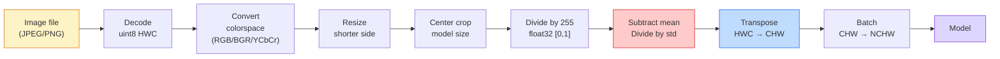
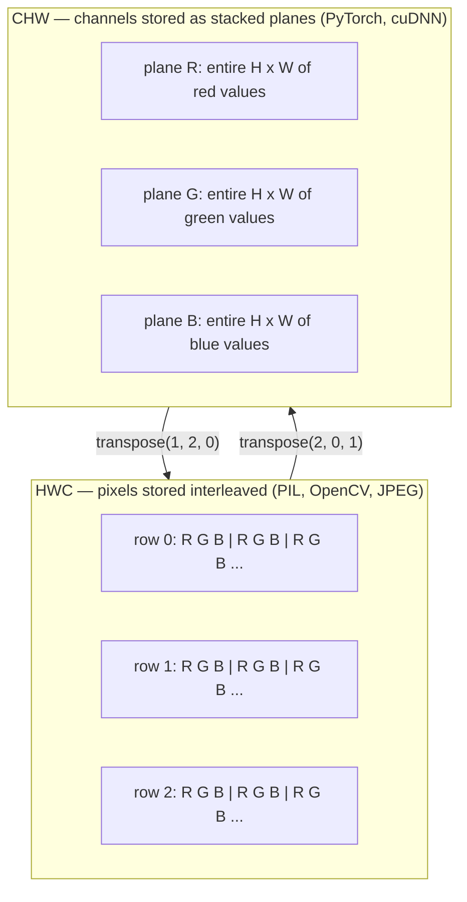

# 图像基础 — 像素、通道与颜色空间

> 图像是一个光采样张量。你使用的每个视觉模型都始于这一事实。

**类型:** 实战
**语言:** Python
**先决条件:** 第1阶段第12课（张量操作），第3阶段第11课（PyTorch入门）
**时间:** 约45分钟

## 学习目标

- 解释连续场景如何被离散化为像素，以及采样/量化决策为何会设定所有下游模型的上限
- 将图像作为NumPy数组进行读取、切片和检查，并能在HWC和CHW布局之间灵活切换
- 在RGB、灰度、HSV和YCbCr之间进行转换，并说明每种颜色空间存在的理由
- 精确应用torchvision所需的逐像素预处理（归一化、标准化、调整大小、通道优先）

## 问题陈述

你将阅读的每篇论文、下载的每个预训练权重、调用的每个视觉API都假定输入具有特定编码。如果模型期望`float32`但你传入了`uint8`的图像，程序仍会运行——但会静默生成无意义的结果。将BGR输入训练于RGB的网络，精度会下降十个百分点。当模型期望通道优先时输入通道滞后的数据，第一个卷积层会将高度视为特征通道。这些都不会抛出错误，只会毁掉你的指标，然后你花一周时间追踪一个存在于文件加载方式中的错误。

卷积操作本身并不复杂，难的是"一张图像"对相机、JPEG解码器、PIL、OpenCV、torchvision和CUDA内核来说意味着不同的东西。每个技术栈都有自己的轴顺序、字节范围和通道约定。一个无法理清这些差异的视觉工程师会交付有缺陷的管线。

本课将奠定基础，以便本阶段的其余课程可以在此基础上构建。学完后，你将了解像素是什么、为什么每个像素有三个数字而不是一个、"使用ImageNet统计量进行标准化"到底做了什么，以及如何在本阶段后续课程都会假设的两种或三种布局之间转换。

## 核心概念

### 预处理管线一览

每个生产视觉系统都是同一系列可逆变换的组合。其中一步出错，模型看到的输入就与训练时不同。



红蓝方框标出的步骤是80%静默错误发生的地方：缺少标准化和错误的布局。

### 像素是采样点，不是小方块

相机传感器计数落在微小探测器网格上的光子。每个探测器在极短时间内积分光，并发出与光子数量成正比的电压。然后传感器将该电压离散化为一个整数。一个探测器成为一个像素。

```
Continuous scene                 Sensor grid                     Digital image
(infinite detail)                (H x W detectors)               (H x W integers)

    ~~~~~                        +--+--+--+--+--+                 210 198 180 155 120
   ~   ~   ~                     |  |  |  |  |  |                 205 195 178 152 118
  ~ light ~      ---->           +--+--+--+--+--+     ---->       200 190 175 150 115
   ~~~~~                         |  |  |  |  |  |                 195 185 170 148 112
                                 +--+--+--+--+--+                 188 180 165 145 108
```

在此步骤中有两个选择，它们决定了后续所有环节的上限：

- **空间采样** 决定了场景中每度角对应多少个探测器。太少会导致边缘锯齿化（混叠）。太多会导致存储和计算量爆炸。
- **强度量化** 决定了电压被划分为多少档。8位给出256级，是显示的标准。10、12、16位提供更平滑的梯度，对医学成像、HDR和原始传感器管线很重要。

像素不是有面积的彩色方块。它是一次单独的测量。当你调整大小或旋转时，你是在重新采样这个测量网格。

### 为什么有三个通道

一个探测器计数整个可见光谱的光子——这就是灰度。为了获得颜色，传感器用红、绿、蓝滤光片马赛克覆盖网格。去马赛克后，每个空间位置有三个整数：邻近的红光滤波探测器、绿光滤波探测器和蓝光滤波探测器的响应值。这三个整数就是像素的RGB三元组。

```
One pixel in memory:

    (R, G, B) = (210, 140, 30)   <- reddish-orange

An H x W RGB image:

    shape (H, W, 3)     stored as   H rows of W pixels of 3 values
                                    each in [0, 255] for uint8
```

"三"不是魔法。深度相机增加Z通道。卫星增加红外和紫外波段。医学扫描通常只有一个通道（X光、CT）或许多个（高光谱）。通道数是最后一个轴；卷积层学习在该轴上混合信息。

### 两种布局约定：HWC和CHW

相同的张量，两种排列顺序。每个库选择一种。

```
HWC (height, width, channels)           CHW (channels, height, width)

   W ->                                    H ->
  +-----+-----+-----+                     +-----+-----+
H |R G B|R G B|R G B|                   C |R R R R R R|
| +-----+-----+-----+                   | +-----+-----+
v |R G B|R G B|R G B|                   v |G G G G G G|
  +-----+-----+-----+                     +-----+-----+
                                          |B B B B B B|
                                          +-----+-----+

   PIL, OpenCV, matplotlib,              PyTorch, most deep learning
   almost every image file on disk       frameworks, cuDNN kernels
```

CHW的存在是因为卷积核在H和W维度上滑动。将通道轴放在最前意味着每个核在每个通道上看到连续的2D平面，便于向量化。磁盘格式保留HWC，因为这与传感器输出扫描线的方式一致。

你会输入一千次的单行转换代码：

```
img_chw = img_hwc.transpose(2, 0, 1)      # NumPy
img_chw = img_hwc.permute(2, 0, 1)        # PyTorch tensor
```

内存布局可视化：



### 字节范围与数据类型

三种主流约定：

| 约定 | 数据类型 | 范围 | 使用场景 |
|------------|-------|-------|------------------|
| 原始 | `uint8` | [0, 255] | 磁盘文件、PIL、OpenCV输出 |
| 归一化 | `float32` | [0.0, 1.0] | 经过`img.astype('float32') / 255`后 |
| 标准化 | `float32` | 大约[-2, +2] | 减去均值并除以标准差后 |

卷积网络在标准化输入上进行训练。ImageNet统计量`mean=[0.485, 0.456, 0.406]`、`std=[0.229, 0.224, 0.225]`是在整个ImageNet训练集上，对[0, 1]归一化像素计算出的三个通道的算术平均值和标准差。将原始的`uint8`输入期望标准化浮点数据的模型，是应用视觉中最常见的静默错误。

### 颜色空间及其存在理由

RGB是捕获格式，但对模型来说并非总是最有用的表示。

```
 RGB               HSV                       YCbCr / YUV

 R red             H hue (angle 0-360)       Y luminance (brightness)
 G green           S saturation (0-1)        Cb chroma blue-yellow
 B blue            V value/brightness (0-1)  Cr chroma red-green

 Linear to         Separates color from      Separates brightness from
 sensor output     brightness. Useful for    color. JPEG and most video
                   color thresholding, UI    codecs compress the chroma
                   sliders, simple filters   channels harder because the
                                             human eye is less sensitive
                                             to chroma detail than to Y.
```

对于大多数现代CNN，你输入RGB。你会在以下情况遇到其他空间：

- **HSV** — 经典计算机视觉代码、基于颜色的分割、白平衡。
- **YCbCr** — 读取JPEG内部数据、视频管线、仅在Y通道上操作的超分辨率模型。
- **灰度** — OCR、文档模型、任何颜色是干扰变量而非信号的情况。

从RGB转换到灰度是一个加权和，而非平均值，因为人眼对绿色比对红色或蓝色更敏感：

```
Y = 0.299 R + 0.587 G + 0.114 B       (ITU-R BT.601, the classic weights)
```

### 宽高比、调整大小与插值

每个模型都有固定输入尺寸（大多数ImageNet分类器为224x224，现代检测器为384x384或512x512）。你的图像很少与之匹配。三种重要的调整大小选择：

- **调整短边尺寸，然后中心裁剪** — 标准的ImageNet方法。保留宽高比，丢弃边缘像素条带。
- **调整大小并填充** — 保留宽高比和每个像素，添加黑边。检测和OCR的标准做法。
- **直接调整到目标尺寸** — 拉伸图像。成本低，扭曲几何形状，对许多分类任务足够。

插值方法决定了当新网格与旧网格不对齐时，如何计算中间像素：

```
Nearest neighbour     fastest, blocky, only choice for masks/labels
Bilinear              fast, smooth, default for most image resizing
Bicubic               slower, sharper on upscaling
Lanczos               slowest, best quality, used for final display
```

经验法则：训练用双线性，用于查看的资源用双三次或Lanczos，包含整数类别ID的任何图像用最近邻。

## 实战构建

### 步骤1：加载图像并检查其形状

使用Pillow加载任意JPEG或PNG，转换为NumPy，并打印结果。为了得到确定性的、可离线运行的示例，可以合成一个。

```python
import numpy as np
from PIL import Image

def synthetic_rgb(h=128, w=192, seed=0):
    rng = np.random.default_rng(seed)
    yy, xx = np.meshgrid(np.linspace(0, 1, h), np.linspace(0, 1, w), indexing="ij")
    r = (np.sin(xx * 6) * 0.5 + 0.5) * 255
    g = yy * 255
    b = (1 - yy) * xx * 255
    rgb = np.stack([r, g, b], axis=-1) + rng.normal(0, 6, (h, w, 3))
    return np.clip(rgb, 0, 255).astype(np.uint8)

arr = synthetic_rgb()
# Or load from disk:
# arr = np.asarray(Image.open("your_image.jpg").convert("RGB"))

print(f"type:   {type(arr).__name__}")
print(f"dtype:  {arr.dtype}")
print(f"shape:  {arr.shape}     # (H, W, C)")
print(f"min:    {arr.min()}")
print(f"max:    {arr.max()}")
print(f"pixel at (0, 0): {arr[0, 0]}")
```

预期输出：`shape: (H, W, 3)`，`dtype: uint8`，范围`[0, 255]`。这就是规范的磁盘表示，无论字节来自相机、JPEG解码器还是合成生成器。

### 步骤2：分离通道并重新排序布局

分别提取R、G、B，然后为PyTorch将HWC转换为CHW。

```python
R = arr[:, :, 0]
G = arr[:, :, 1]
B = arr[:, :, 2]
print(f"R shape: {R.shape}, mean: {R.mean():.1f}")
print(f"G shape: {G.shape}, mean: {G.mean():.1f}")
print(f"B shape: {B.shape}, mean: {B.mean():.1f}")

arr_chw = arr.transpose(2, 0, 1)
print(f"\nHWC shape: {arr.shape}")
print(f"CHW shape: {arr_chw.shape}")
```

三个灰度平面，每个通道一个。CHW只是重新排列轴；当内存布局允许时，严格来说并不需要复制数据。

### 步骤3：灰度和HSV转换

加权和灰度转换，然后是手动RGB到HSV。

```python
def rgb_to_grayscale(rgb):
    weights = np.array([0.299, 0.587, 0.114], dtype=np.float32)
    return (rgb.astype(np.float32) @ weights).astype(np.uint8)

def rgb_to_hsv(rgb):
    rgb_f = rgb.astype(np.float32) / 255.0
    r, g, b = rgb_f[..., 0], rgb_f[..., 1], rgb_f[..., 2]
    cmax = np.max(rgb_f, axis=-1)
    cmin = np.min(rgb_f, axis=-1)
    delta = cmax - cmin

    h = np.zeros_like(cmax)
    mask = delta > 0
    rmax = mask & (cmax == r)
    gmax = mask & (cmax == g)
    bmax = mask & (cmax == b)
    h[rmax] = ((g[rmax] - b[rmax]) / delta[rmax]) % 6
    h[gmax] = ((b[gmax] - r[gmax]) / delta[gmax]) + 2
    h[bmax] = ((r[bmax] - g[bmax]) / delta[bmax]) + 4
    h = h * 60.0

    s = np.where(cmax > 0, delta / cmax, 0)
    v = cmax
    return np.stack([h, s, v], axis=-1)

gray = rgb_to_grayscale(arr)
hsv = rgb_to_hsv(arr)
print(f"gray shape: {gray.shape}, range: [{gray.min()}, {gray.max()}]")
print(f"hsv   shape: {hsv.shape}")
print(f"hue range: [{hsv[..., 0].min():.1f}, {hsv[..., 0].max():.1f}] degrees")
print(f"sat range: [{hsv[..., 1].min():.2f}, {hsv[..., 1].max():.2f}]")
print(f"val range: [{hsv[..., 2].min():.2f}, {hsv[..., 2].max():.2f}]")
```

色相以度为单位，饱和度和明度在[0, 1]范围内。这与OpenCV`hsv_full`的约定一致。

### 步骤4：归一化、标准化及其逆操作

从原始字节转换到预训练ImageNet模型期望的精确张量，然后再转换回来。

```python
mean = np.array([0.485, 0.456, 0.406], dtype=np.float32)
std = np.array([0.229, 0.224, 0.225], dtype=np.float32)

def preprocess_imagenet(rgb_uint8):
    x = rgb_uint8.astype(np.float32) / 255.0
    x = (x - mean) / std
    x = x.transpose(2, 0, 1)
    return x

def deprocess_imagenet(chw_float32):
    x = chw_float32.transpose(1, 2, 0)
    x = x * std + mean
    x = np.clip(x * 255.0, 0, 255).astype(np.uint8)
    return x

x = preprocess_imagenet(arr)
print(f"preprocessed shape: {x.shape}     # (C, H, W)")
print(f"preprocessed dtype: {x.dtype}")
print(f"preprocessed mean per channel:  {x.mean(axis=(1, 2)).round(3)}")
print(f"preprocessed std  per channel:  {x.std(axis=(1, 2)).round(3)}")

roundtrip = deprocess_imagenet(x)
max_diff = np.abs(roundtrip.astype(int) - arr.astype(int)).max()
print(f"roundtrip max pixel diff: {max_diff}    # should be 0 or 1")
```

每个通道的均值应接近零，标准差接近一。预处理/后处理操作对正是每个torchvision`transforms.Normalize`调用底层所做的事情。

### 步骤5：使用三种插值方法调整大小

在放大场景中比较最近邻、双线性和双三次插值，以使差异可见。

```python
target = (arr.shape[0] * 3, arr.shape[1] * 3)

nearest = np.asarray(Image.fromarray(arr).resize(target[::-1], Image.NEAREST))
bilinear = np.asarray(Image.fromarray(arr).resize(target[::-1], Image.BILINEAR))
bicubic = np.asarray(Image.fromarray(arr).resize(target[::-1], Image.BICUBIC))

def local_roughness(x):
    gy = np.diff(x.astype(float), axis=0)
    gx = np.diff(x.astype(float), axis=1)
    return float(np.abs(gy).mean() + np.abs(gx).mean())

for name, out in [("nearest", nearest), ("bilinear", bilinear), ("bicubic", bicubic)]:
    print(f"{name:>8}  shape={out.shape}  roughness={local_roughness(out):6.2f}")
```

最近邻在粗糙度上得分最高，因为它保留了硬边缘。双线性最平滑。双三次介于两者之间，在保持感知锐度的同时没有阶梯状伪影。

## 综合应用

`torchvision.transforms`将上述所有内容打包成一个可组合的管线。下面的代码精确重现了`preprocess_imagenet`所做的，外加调整大小和裁剪。

```python
import torch
from torchvision import transforms
from PIL import Image

img = Image.fromarray(synthetic_rgb(256, 256))

pipeline = transforms.Compose([
    transforms.Resize(256),
    transforms.CenterCrop(224),
    transforms.ToTensor(),
    transforms.Normalize(mean=[0.485, 0.456, 0.406], std=[0.229, 0.224, 0.225]),
])

x = pipeline(img)
print(f"tensor type:  {type(x).__name__}")
print(f"tensor dtype: {x.dtype}")
print(f"tensor shape: {tuple(x.shape)}      # (C, H, W)")
print(f"per-channel mean: {x.mean(dim=(1, 2)).tolist()}")
print(f"per-channel std:  {x.std(dim=(1, 2)).tolist()}")

batch = x.unsqueeze(0)
print(f"\nbatched shape: {tuple(batch.shape)}   # (N, C, H, W) — ready for a model")
```

四个步骤，严格按此顺序：`Resize(256)`将短边缩放到256；`CenterCrop(224)`从中间取224x224的块；`ToTensor()`除以255并将HWC转为CHW；`Normalize`减去ImageNet均值并除以标准差。颠倒这个顺序会静默改变输入到模型的内容。

## 交付物

本课产出：

- `outputs/prompt-vision-preprocessing-audit.md` — 一个提示词，能将任何模型卡或数据集卡转换为团队必须遵守的精确预处理不变量检查清单。
- `outputs/skill-image-tensor-inspector.md` — 一个技能，给定任何图像形状的张量或数组，报告数据类型、布局、范围，以及它看起来是原始的、归一化的还是标准化的。

## 练习

1.  **(简单)** 分别使用OpenCV (`cv2.imread`) 和 Pillow 加载一个JPEG。打印两者形状以及`(0, 0)`处的像素。解释通道顺序差异，然后写一行代码使OpenCV数组与Pillow数组相同。
2.  **(中等)** 编写`standardize(img, mean, std)`及其逆函数，使其共同在任何uint8图像上通过`roundtrip_max_diff <= 1`测试。你的函数必须能在HWC格式的单张图像和NCHW格式的批量图像上使用相同的调用。
3.  **(困难)** 取一个经过ImageNet标准化的3通道张量，通过一个1x1卷积层，该卷积学习将RGB加权混合成单个灰度通道。将权重初始化为`[0.299, 0.587, 0.114]`，冻结它们，并验证输出与你的手动`rgb_to_grayscale`在浮点误差范围内匹配。还有哪些经典的颜色空间变换可以写成1x1卷积？

## 关键术语

| 术语 | 人们常说的 | 它的实际含义 |
|------|----------------|----------------------|
| 像素 | "一个彩色方块" | 某个网格位置处的一次光强度采样——彩色图像是三个数字，灰度图像为一个数字 |
| 通道 | "颜色" | 堆叠到图像张量中的并行空间网格之一；HWC格式中的最后一个轴，CHW格式中的第一个轴 |
| HWC / CHW | "形状" | 图像张量的轴排列顺序；磁盘和PIL使用HWC，PyTorch和cuDNN使用CHW |
| 归一化 | "缩放图像" | 除以255使像素值落在[0, 1]区间——必要但不充分 |
| 标准化 | "零中心化" | 每个通道减去均值并除以标准差，使输入分布与模型训练时匹配 |
| 灰度转换 | "通道取平均" | 使用系数0.299/0.587/0.114的加权和，匹配人眼对亮度的感知 |
| 插值 | "调整大小时如何选像素" | 当新网格与旧网格不对齐时，决定输出值的规则——标签用最近邻，训练用双线性，显示用双三次 |
| 宽高比 | "宽度除以高度" | 区分“调整大小并填充”与“调整大小并拉伸”的比例 |

## 延伸阅读

- [Charles Poynton — 颜色空间导览](https://poynton.ca/PDFs/Guided_tour.pdf) — 关于为何存在这么多颜色空间以及每种何时重要的最清晰的技术阐述
- [PyTorch 视觉变换文档](https://pytorch.org/vision/stable/transforms.html) — 你将在生产中实际组合使用的完整变换管线
- [JPEG工作原理 (Colt McAnlis)](https://www.youtube.com/watch?v=F1kYBnY6mwg) — 关于色度子采样、DCT以及为何JPEG编码YCbCr而非RGB的精炼视觉导览
- [ImageNet预处理约定 (torchvision模型)](https://pytorch.org/vision/stable/models.html) — `mean=[0.485, 0.456, 0.406]`的来源，以及为何模型库中的每个模型都期望它