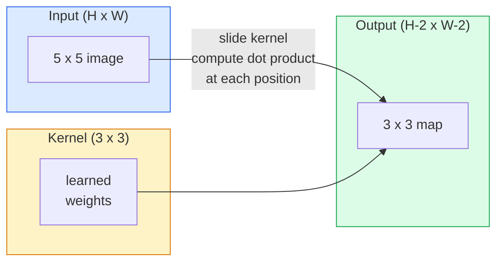
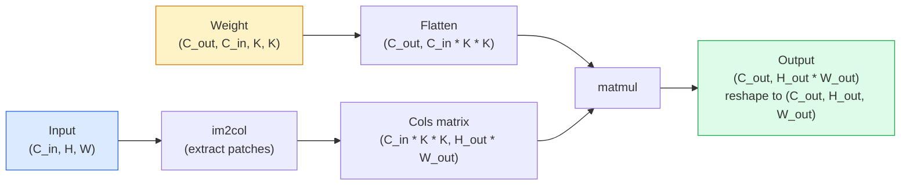

# 从零开始理解卷积

> 卷积是一个微型全连接层，可以在图像上滑动，在每个位置共享相同的权重。

**类型：** 构建
**语言：** Python
**前置知识：** 第三阶段（深度学习核心）、第四阶段课程01（图像基础）
**时间：** 约75分钟

## 学习目标

- 仅使用NumPy从零实现二维卷积，包括嵌套循环版本和向量化的 `im2col` 版本
- 计算任意输入尺寸、卷积核尺寸、填充和步长组合下的输出空间尺寸，并推导 `(H - K + 2P) / S + 1` 公式
- 手动设计卷积核（边缘、模糊、锐化、Sobel），并解释每个卷积核产生特定激活模式的原因
- 将卷积堆叠成特征提取器，并解释堆叠深度与感受野大小的关系

## 问题所在

对一个224x224的RGB图像使用全连接层，每个神经元需要224 * 224 * 3 = 150,528个输入权重。仅一个包含1000个单元的隐藏层就有1.5亿参数——而这还没学到任何有用的东西。更糟的是，该层无法识别左上角和右下角的狗是同一模式。它将每个像素位置视为独立，这对图像来说是完全错误的：将一只猫平移三个像素不应该迫使网络重新学习这个概念。

图像模型需要的两个关键特性是**平移等变性**（输入平移时输出也平移）和**参数共享**（相同的特征检测器在所有位置运行）。全连接层两者都不提供。卷积则免费提供了这两个特性。

卷积并非为深度学习而发明。它与驱动JPEG压缩、Photoshop中的高斯模糊、工业视觉中的边缘检测以及所有音频滤波器的是同一种操作。CNN从2012年到2020年在ImageNet上占据主导地位的原因，就是卷积是针对邻近值相关且相同模式可能出现在任何位置的数据的正确先验。

## 核心概念

### 单个卷积核的滑动

二维卷积使用一个称为卷积核（或滤波器）的小权重矩阵，在输入上滑动，并在每个位置计算逐元素乘积的和。这个和成为一个输出像素。



在5x5输入上的一个具体3x3示例（无填充，步长为1）：

```
Input X (5 x 5):                Kernel W (3 x 3):

  1  2  0  1  2                   1  0 -1
  0  1  3  1  0                   2  0 -2
  2  1  0  2  1                   1  0 -1
  1  0  2  1  3
  2  1  1  0  1

The kernel slides across every valid 3 x 3 window. Output Y is 3 x 3:

 Y[0,0] = sum( W * X[0:3, 0:3] )
 Y[0,1] = sum( W * X[0:3, 1:4] )
 Y[0,2] = sum( W * X[0:3, 2:5] )
 Y[1,0] = sum( W * X[1:4, 0:3] )
 ... and so on
```

这个公式——**共享权重、局部性、滑动窗口**——就是整个思想。其他所有内容都是记账工作。

### 输出尺寸公式

给定输入空间尺寸 `H`，卷积核尺寸 `K`，填充 `P`，步长 `S`：

```
H_out = floor( (H - K + 2P) / S ) + 1
```

请牢记此公式。在每个架构设计中，你都会多次计算它。

| 场景 | H | K | P | S | H_out |
|------|---|---|---|---|-------|
| 有效卷积，无填充 | 32 | 3 | 0 | 1 | 30 |
| 相同卷积（保持尺寸） | 32 | 3 | 1 | 1 | 32 |
| 下采样2倍 | 32 | 3 | 1 | 2 | 16 |
| 2x2 池化 | 32 | 2 | 0 | 2 | 16 |
| 大感受野 | 32 | 7 | 3 | 2 | 16 |

"相同填充"意味着选择P使得当S == 1时，H_out == H。对于奇数K，公式为 P = (K - 1) / 2。这就是3x3卷积核占主导地位的原因——它们是具有中心点的最小奇数尺寸卷积核。

### 填充

如果没有填充，每次卷积都会缩小特征图。堆叠20层后，你的224x224图像会变成184x184，这会在边界浪费计算，并使需要形状匹配的残差连接复杂化。

```
Zero padding (P = 1) on a 5 x 5 input:

  0  0  0  0  0  0  0
  0  1  2  0  1  2  0
  0  0  1  3  1  0  0
  0  2  1  0  2  1  0       Now the kernel can centre on pixel
  0  1  0  2  1  3  0       (0, 0) and still have three rows and
  0  2  1  1  0  1  0       three columns of values to multiply.
  0  0  0  0  0  0  0
```

实践中常见的模式：`zero`（最常见），`reflect`（镜像边缘，在生成模型中避免硬边界），`replicate`（复制边缘），`circular`（环绕，用于环形问题）。

### 步长

步长是滑动的步长大小。`stride=1`是默认值。`stride=2`将空间尺寸减半，这是CNN内部下采样的经典方法，无需单独的池化层——每个现代架构（ResNet, ConvNeXt, MobileNet）都在某个地方使用带步长的卷积代替最大池化。

```
Stride 1 on a 5 x 5 input, 3 x 3 kernel:

  starts: (0,0) (0,1) (0,2)        -> output row 0
          (1,0) (1,1) (1,2)        -> output row 1
          (2,0) (2,1) (2,2)        -> output row 2

  Output: 3 x 3

Stride 2 on the same input:

  starts: (0,0) (0,2)              -> output row 0
          (2,0) (2,2)              -> output row 1

  Output: 2 x 2
```

### 多输入通道

实际图像有三个通道。对RGB输入的3x3卷积实际上是一个3x3x3的体积：每个输入通道一个3x3切片。在每个空间位置，你需要跨所有三个切片进行乘法和求和，并加上一个偏置。

```
Input:   (C_in,  H,  W)        3 x 5 x 5
Kernel:  (C_in,  K,  K)        3 x 3 x 3 (one kernel)
Output:  (1,     H', W')       2D map

For a layer that produces C_out output channels, you stack C_out kernels:

Weight:  (C_out, C_in, K, K)   e.g. 64 x 3 x 3 x 3
Output:  (C_out, H', W')       64 x 3 x 3

Parameter count: C_out * C_in * K * K + C_out   (the + C_out is biases)
```

最后一行是你规划模型时将要计算的。一个在3通道输入上的64通道3x3卷积有 `64 * 3 * 3 * 3 + 64 = 1,792` 个参数。计算量很小。

### im2col 技巧

嵌套循环易于阅读但速度慢。GPU需要大型矩阵乘法。技巧是：将输入的每个感受野窗口展平成一个大矩阵的一列，将卷积核展平成一行，这样整个卷积就变成了一个矩阵乘法。



每个生产级卷积实现都是此方法的一些变体，加上缓存分块技巧（直接卷积、Winograd、用于大卷积核的FFT卷积）。理解im2col就理解了核心。

### 感受野

单个3x3卷积查看9个输入像素。堆叠两个3x3卷积，第二层的一个神经元查看5x5的输入像素。三个3x3卷积给出7x7的感受野。一般来说：

```
RF after L stacked K x K convs (stride 1) = 1 + L * (K - 1)

With strides:   RF grows multiplicatively with stride along each layer.
```

"全部使用3x3"之所以有效（VGG, ResNet, ConvNeXt），根本原因在于两个3x3卷积与一个5x5卷积看到相同的输入区域，但参数更少，并且中间多了一个非线性激活。

## 动手实现

### 步骤1：数组填充

从最小的单元开始：一个在H x W数组周围用零填充的函数。

```python
import numpy as np

def pad2d(x, p):
    if p == 0:
        return x
    h, w = x.shape[-2:]
    out = np.zeros(x.shape[:-2] + (h + 2 * p, w + 2 * p), dtype=x.dtype)
    out[..., p:p + h, p:p + w] = x
    return out

x = np.arange(9).reshape(3, 3)
print(x)
print()
print(pad2d(x, 1))
```

尾部轴技巧 `x.shape[:-2]` 意味着同一个函数可以在 `(H, W)`、`(C, H, W)` 或 `(N, C, H, W)` 上工作，无需修改。

### 步骤2：使用嵌套循环实现二维卷积

参考实现——速度慢，但清晰无误。这就是 `torch.nn.functional.conv2d` 原则上所做的。

```python
def conv2d_naive(x, w, b=None, stride=1, padding=0):
    c_in, h, w_in = x.shape
    c_out, c_in_w, kh, kw = w.shape
    assert c_in == c_in_w

    x_pad = pad2d(x, padding)
    h_out = (h + 2 * padding - kh) // stride + 1
    w_out = (w_in + 2 * padding - kw) // stride + 1

    out = np.zeros((c_out, h_out, w_out), dtype=np.float32)
    for oc in range(c_out):
        for i in range(h_out):
            for j in range(w_out):
                hs = i * stride
                ws = j * stride
                patch = x_pad[:, hs:hs + kh, ws:ws + kw]
                out[oc, i, j] = np.sum(patch * w[oc])
        if b is not None:
            out[oc] += b[oc]
    return out
```

四层嵌套循环（输出通道、行、列，加上对C_in, kh, kw的隐式求和）。这是你将用来验证每个更快实现的基本事实。

### 步骤3：使用手动设计的卷积核进行验证

构建一个垂直Sobel卷积核，将其应用于合成阶跃图像，观察垂直边缘如何亮起。

```python
def synthetic_step_image():
    img = np.zeros((1, 16, 16), dtype=np.float32)
    img[:, :, 8:] = 1.0
    return img

sobel_x = np.array([
    [[-1, 0, 1],
     [-2, 0, 2],
     [-1, 0, 1]]
], dtype=np.float32)[None]

x = synthetic_step_image()
y = conv2d_naive(x, sobel_x, padding=1)
print(y[0].round(1))
```

预期在第7列（亮度从左到右增加）出现大的正值，其他地方为零。这个单一的打印输出是你验证数学正确性的健全性检查。

### 步骤4：im2col

将输入中每个卷积核大小的窗口转换成矩阵的一列。对于 `C_in=3, K=3`，每列是27个数字。

```python
def im2col(x, kh, kw, stride=1, padding=0):
    c_in, h, w = x.shape
    x_pad = pad2d(x, padding)
    h_out = (h + 2 * padding - kh) // stride + 1
    w_out = (w + 2 * padding - kw) // stride + 1

    cols = np.zeros((c_in * kh * kw, h_out * w_out), dtype=x.dtype)
    col = 0
    for i in range(h_out):
        for j in range(w_out):
            hs = i * stride
            ws = j * stride
            patch = x_pad[:, hs:hs + kh, ws:ws + kw]
            cols[:, col] = patch.reshape(-1)
            col += 1
    return cols, h_out, w_out
```

这仍然是一个Python循环，但现在繁重的工作将由一个向量化的矩阵乘法完成。

### 步骤5：通过im2col + matmul实现快速卷积

用一次矩阵乘法替换四层循环。

```python
def conv2d_im2col(x, w, b=None, stride=1, padding=0):
    c_out, c_in, kh, kw = w.shape
    cols, h_out, w_out = im2col(x, kh, kw, stride, padding)
    w_flat = w.reshape(c_out, -1)
    out = w_flat @ cols
    if b is not None:
        out += b[:, None]
    return out.reshape(c_out, h_out, w_out)
```

正确性检查：运行两种实现并进行比较。

```python
rng = np.random.default_rng(0)
x = rng.normal(0, 1, (3, 16, 16)).astype(np.float32)
w = rng.normal(0, 1, (8, 3, 3, 3)).astype(np.float32)
b = rng.normal(0, 1, (8,)).astype(np.float32)

y_naive = conv2d_naive(x, w, b, padding=1)
y_im2col = conv2d_im2col(x, w, b, padding=1)

print(f"max abs diff: {np.max(np.abs(y_naive - y_im2col)):.2e}")
```

`max abs diff` 应该约为 `1e-5`——差异是由于浮点累加顺序，而非错误。

### 步骤6：一组手动设计的卷积核

五个滤波器，展示了单个卷积层在没有任何训练的情况下能表达什么。

```python
KERNELS = {
    "identity": np.array([[0, 0, 0], [0, 1, 0], [0, 0, 0]], dtype=np.float32),
    "blur_3x3": np.ones((3, 3), dtype=np.float32) / 9.0,
    "sharpen": np.array([[0, -1, 0], [-1, 5, -1], [0, -1, 0]], dtype=np.float32),
    "sobel_x": np.array([[-1, 0, 1], [-2, 0, 2], [-1, 0, 1]], dtype=np.float32),
    "sobel_y": np.array([[-1, -2, -1], [0, 0, 0], [1, 2, 1]], dtype=np.float32),
}

def apply_kernel(img2d, kernel):
    x = img2d[None].astype(np.float32)
    w = kernel[None, None]
    return conv2d_im2col(x, w, padding=1)[0]
```

应用于任何灰度图像，模糊会使其变柔和，锐化会使边缘更清晰，Sobel-x会突出垂直边缘，Sobel-y会突出水平边缘。这些正是AlexNet和VGG中*第一个*训练好的卷积层最终学到的模式——因为无论后续任务是什么，一个好的图像模型都需要边缘和斑点检测器。

## 使用它

PyTorch的 `nn.Conv2d` 用自动微分、CUDA内核和cuDNN优化包装了相同的操作。形状语义是相同的。

```python
import torch
import torch.nn as nn

conv = nn.Conv2d(in_channels=3, out_channels=64, kernel_size=3, stride=1, padding=1)
print(conv)
print(f"weight shape: {tuple(conv.weight.shape)}   # (C_out, C_in, K, K)")
print(f"bias shape:   {tuple(conv.bias.shape)}")
print(f"param count:  {sum(p.numel() for p in conv.parameters())}")

x = torch.randn(8, 3, 224, 224)
y = conv(x)
print(f"\ninput  shape: {tuple(x.shape)}")
print(f"output shape: {tuple(y.shape)}")
```

将 `padding=1` 换成 `padding=0`，输出就降为222x222。将 `stride=1` 换成 `stride=2`，输出降为112x112。和你上面记住的公式一样。

## 成果产出

本课程将产出：

- `outputs/prompt-cnn-architect.md` — 一个提示，给定输入大小、参数预算和目标感受野，设计一个在每一步都有正确K/S/P的 `Conv2d` 层堆叠。
- `outputs/skill-conv-shape-calculator.md` — 一个技能，能逐层遍历网络规格，并为每个块返回输出形状、感受野和参数数量。

## 练习

1.  **(简单)** 给定一个128x128灰度输入和一个 `[Conv3x3(s=1,p=1), Conv3x3(s=2,p=1), Conv3x3(s=1,p=1), Conv3x3(s=2,p=1)]` 堆叠，手动计算每层的输出空间尺寸和感受野。使用一个包含虚拟卷积的PyTorch `nn.Sequential` 进行验证。
2.  **(中等)** 扩展 `conv2d_naive` 和 `conv2d_im2col` 以接受一个 `groups` 参数。证明 `groups=C_in=C_out` 可以重现一个深度可分离卷积，并且其参数数量是 `C * K * K` 而非 `C * C * K * K`。
3.  **(困难)** 手动实现 `conv2d_im2col` 的反向传播：给定输出的梯度，计算 `x` 和 `w` 的梯度。在相同输入和权重下与 `torch.autograd.grad` 验证。技巧：im2col的梯度是 `col2im`，并且必须累加重叠的窗口。

## 关键术语

| 术语 | 人们常说 | 实际含义 |
|------|----------|----------|
| 卷积 | “滑动一个滤波器” | 一个可学习的点积，在每个空间位置应用，权重共享；数学上是互相关，但所有人都称其为卷积 |
| 卷积核 / 滤波器 | “特征检测器” | 形状为 (C_in, K, K) 的小权重张量，其与输入窗口的点积产生一个输出像素 |
| 步长 | “你跳多远” | 连续卷积核放置之间的步长；步长为2将每个空间尺寸减半 |
| 填充 | “边缘补零” | 围绕输入添加的额外值，以便卷积核可以居中于边界像素；`same` 填充保持输出尺寸等于输入尺寸 |
| 感受野 | “神经元看到多少” | 给定输出激活所依赖的原始输入区域，随深度和步长增长 |
| im2col | “GEMM技巧” | 将每个感受野窗口重排成列，使卷积变成一次大型矩阵乘法——每个快速卷积内核的核心 |
| 深度可分离卷积 | “每通道一个卷积核” | 一个 `groups == C_in` 的卷积，每个输出通道仅从其匹配的输入通道计算；MobileNet和ConvNeXt的骨干 |
| 平移等变性 | “输入平移，输出也平移” | 将输入平移k个像素会将输出也平移k个像素的特性；通过共享权重免费获得 |

## 扩展阅读

- [深度学习卷积算术指南 (Dumoulin & Visin, 2016)](https://arxiv.org/abs/1603.07285) — 每门课程都默默借鉴的填充/步长/膨胀的权威图表
- [CS231n：视觉识别的卷积神经网络](https://cs231n.github.io/convolutional-networks/) — 标准课程笔记，包括原始的im2col解释
- [带注释的卷积神经网络 (fast.ai)](https://nbviewer.org/github/fastai/fastbook/blob/master/13_convolutions.ipynb) — 一个从手动卷积到训练好数字分类器的笔记本
- [CNN感受野算术 (Dang Ha The Hien)](https://distill.pub/2019/computing-receptive-fields/) — 关于感受野计算的论文级交互式解释器