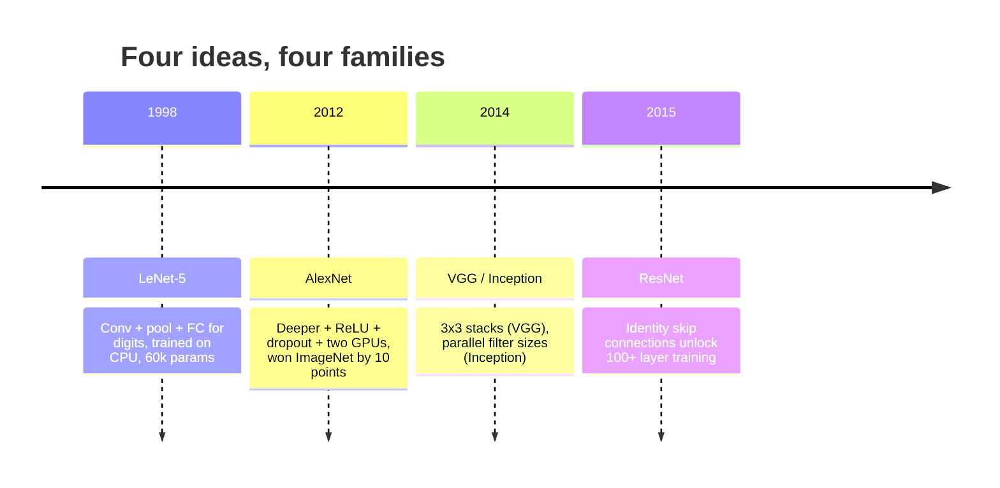
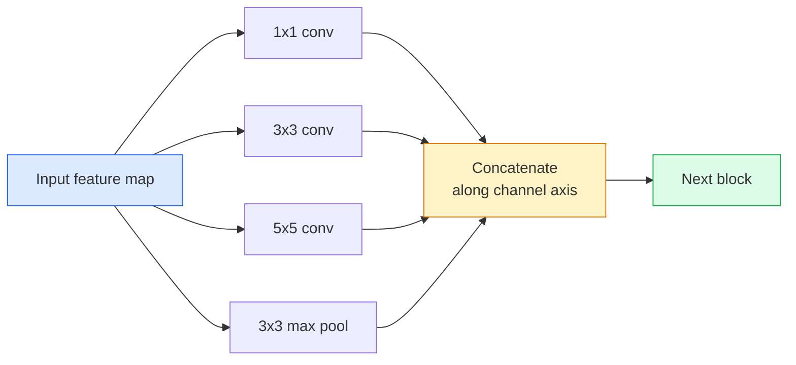
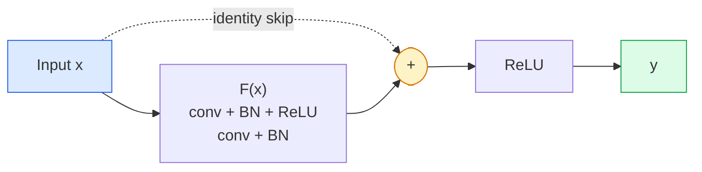

# CNNs — 从LeNet到ResNet

> 过去三十年所有主要CNN都遵循相同的“卷积-非线性-下采样”范式，只是各自加入了一个新思想。按时间顺序学习这些思想。

**类型:** 学习 + 实践
**语言:** Python
**前置课程:** 阶段3 第11课 (PyTorch), 阶段4 第01课 (图像基础), 阶段4 第02课 (从零实现卷积)
**时间:** ~75分钟

## 学习目标

- 追溯架构谱系 LeNet-5 -> AlexNet -> VGG -> Inception -> ResNet，并说明每个系列贡献的核心新思想
- 在PyTorch中实现LeNet-5、一个VGG风格块和一个ResNet BasicBlock，每个实现不超过40行代码
- 解释残差连接如何将1000层网络从不可训练变为最优解
- 阅读现代骨干网络（如ResNet-18，ResNet-50）并在查看源码前预测其输出形状、感受野和参数数量

## 问题背景

2011年，最佳的ImageNet分类器Top-5准确率约为74%。2012年，AlexNet达到85%。2015年，ResNet达到96%。没有新数据，没有新GPU代际。所有提升都来自架构思想。一个合格的视觉工程师必须知道哪个思想来自哪篇论文，因为2026年你部署的每一个生产骨干网络都是这些相同组件的重新组合——并且因为这些思想仍在持续迁移：分组卷积从CNN迁移到Transformer，残差连接从ResNet迁移到现存的每一个大语言模型，批归一化则存在于扩散模型中。

按顺序学习这些网络还能让你避免一个常见错误：在问题只需要一个LeNet规模的网络就能解决时，却去选用最大的可用模型。MNIST不需要ResNet。了解每个系列的性能扩展曲线能告诉你应该选择哪个点。

## 核心概念

### 改变视觉领域的四大思想



在经典视觉领域，没有什么比这四次飞跃更重要。

### LeNet-5 (1998)

Yann LeCun的数字识别器。6万个参数。两个卷积-池化块，两个全连接层，tanh激活函数。它定义了每个CNN都继承的模板：

```
input (1, 32, 32)
  conv 5x5 -> (6, 28, 28)
  avg pool 2x2 -> (6, 14, 14)
  conv 5x5 -> (16, 10, 10)
  avg pool 2x2 -> (16, 5, 5)
  flatten -> 400
  dense -> 120
  dense -> 84
  dense -> 10
```

现代世界所称的CNN——交替进行卷积和下采样，最后接一个小型分类头——其实就是拥有更多层、更宽通道和更好激活函数的LeNet。

### AlexNet (2012)

三项共同打破了ImageNet纪录的改变：

1. **ReLU** 替代 tanh。梯度停止消失。训练速度提升六倍。
2. **Dropout** 用于全连接头。正则化变成一个层，而不是一个小技巧。
3. **深度与宽度**。五个卷积层，三个全连接层，6000万参数，在两个GPU上训练，模型被分割分布其中。

该论文的图2至今仍显示GPU分割为两个并行流。这种并行性是硬件限制的变通方案，并非架构洞见——但上述三个思想至今仍在你使用的每一个模型中。

### VGG (2014)

VGG提出一个问题：如果只使用3x3卷积并且做得很深，会发生什么？

```
stack:   conv 3x3 -> conv 3x3 -> pool 2x2
repeat:  16 or 19 conv layers
```

两个3x3卷积感受的输入区域与一个5x5卷积相同，但参数更少（2*9*C^2 = 18C^2 vs 25*C^2），并且中间多了一次ReLU。VGG将这个观察变成了一个完整的架构。其简洁性——一种块类型，重复堆叠——使其成为之后所有工作的参照点。

代价：1.38亿参数，训练慢，推理昂贵。

### Inception (2014, 同年)

Google对“应该使用什么卷积核大小？”的回答是：所有大小，并行使用。



每个分支专攻不同方面——1x1用于通道混合，3x3用于局部纹理，5x5用于更大模式，池化用于平移不变特征——而拼接操作让下一层可以选择任何有用的分支。Inception v1在每个分支内部使用1x1卷积作为瓶颈，以保持参数数量在合理范围。

### 退化问题

到2015年，VGG-19能工作，但VGG-32不行。深度本应有益，但超过约20层后，训练损失和测试损失都会变差。这不是过拟合。这是优化器因梯度在每一层都乘性衰减而无法找到有用权重。

```
Plain deep network:
  y = f_L( f_{L-1}( ... f_1(x) ... ) )

Gradient wrt early layer:
  dL/dW_1 = dL/dy * df_L/df_{L-1} * ... * df_2/df_1 * df_1/dW_1

Each multiplicative term has magnitude roughly (weight magnitude) * (activation gain).
Stack 100 of them with gains < 1 and the gradient is effectively zero.
```

VGG在19层时能工作，是因为批归一化（同时期发表）保持了激活值的良好缩放。但即使批归一化也无法拯救超过30层左右的深度。

### ResNet (2015)

何恺明、张祥雨、任少卿、孙剑提出了一个修复一切的改变：

```
standard block:   y = F(x)
residual block:   y = F(x) + x
```

`+ x` 意味着该层可以通过将 `F(x)` 驱动为零来选择“什么都不做”。一个1000层的ResNet现在最多和一个1层网络一样差，因为每个额外的块都有一个简单的逃生通道。有了这个保证，优化器就愿意让每个块都变得“稍微有用”——而“稍微有用”堆叠100次，就是最先进的性能。



该块有两种变体随处可见：

- **BasicBlock** (ResNet-18, ResNet-34)：两个3x3卷积，跳跃连接跨越两者。
- **Bottleneck** (ResNet-50, -101, -152)：1x1降维，3x3中间处理，1x1升维，跳跃连接跨越这三个层。当通道数很高时更节省计算。

当跳跃连接需要跨越下采样（步幅=2）时，恒等映射路径会被替换为一个1x1、步幅=2的卷积以匹配形状。

### 残差连接超越视觉的意义

这个思想并非真正关于图像分类。它是关于如何将深度网络从“只能祈祷梯度能存活”转变为可靠、可扩展的工程工具。你将在下一阶段读到的每一个Transformer，在每个块中都有完全相同的跳跃连接。没有ResNet，就没有GPT。

## 动手实现

### 步骤 1: LeNet-5

一个最小化、忠实复现的LeNet。使用tanh激活，平均池化。唯一顺应现代的做法是我们使用 `nn.CrossEntropyLoss` 下游，而非原始的全连接。

```python
import torch
import torch.nn as nn
import torch.nn.functional as F

class LeNet5(nn.Module):
    def __init__(self, num_classes=10):
        super().__init__()
        self.conv1 = nn.Conv2d(1, 6, kernel_size=5)
        self.conv2 = nn.Conv2d(6, 16, kernel_size=5)
        self.pool = nn.AvgPool2d(2)
        self.fc1 = nn.Linear(16 * 5 * 5, 120)
        self.fc2 = nn.Linear(120, 84)
        self.fc3 = nn.Linear(84, num_classes)

    def forward(self, x):
        x = self.pool(torch.tanh(self.conv1(x)))
        x = self.pool(torch.tanh(self.conv2(x)))
        x = torch.flatten(x, 1)
        x = torch.tanh(self.fc1(x))
        x = torch.tanh(self.fc2(x))
        return self.fc3(x)

net = LeNet5()
x = torch.randn(1, 1, 32, 32)
print(f"output: {net(x).shape}")
print(f"params: {sum(p.numel() for p in net.parameters()):,}")
```

预期输出：`output: torch.Size([1, 10])`，`params: 61,706`。这就是开启现代视觉的整个数字分类器。

### 步骤 2: 一个VGG块

一个可复用的块：两个3x3卷积，ReLU，批归一化，最大池化。

```python
class VGGBlock(nn.Module):
    def __init__(self, in_c, out_c):
        super().__init__()
        self.conv1 = nn.Conv2d(in_c, out_c, kernel_size=3, padding=1)
        self.bn1 = nn.BatchNorm2d(out_c)
        self.conv2 = nn.Conv2d(out_c, out_c, kernel_size=3, padding=1)
        self.bn2 = nn.BatchNorm2d(out_c)
        self.pool = nn.MaxPool2d(2)

    def forward(self, x):
        x = F.relu(self.bn1(self.conv1(x)))
        x = F.relu(self.bn2(self.conv2(x)))
        return self.pool(x)

class MiniVGG(nn.Module):
    def __init__(self, num_classes=10):
        super().__init__()
        self.stack = nn.Sequential(
            VGGBlock(3, 32),
            VGGBlock(32, 64),
            VGGBlock(64, 128),
        )
        self.head = nn.Sequential(
            nn.AdaptiveAvgPool2d(1),
            nn.Flatten(),
            nn.Linear(128, num_classes),
        )

    def forward(self, x):
        return self.head(self.stack(x))

net = MiniVGG()
x = torch.randn(1, 3, 32, 32)
print(f"output: {net(x).shape}")
print(f"params: {sum(p.numel() for p in net.parameters()):,}")
```

三个VGG块作用于CIFAR尺寸的输入，接一个自适应池化，一个线性层。约29万参数。对于CIFAR-10足够。

### 步骤 3: 一个ResNet BasicBlock

ResNet-18和ResNet-34的核心构建块。

```python
class BasicBlock(nn.Module):
    def __init__(self, in_c, out_c, stride=1):
        super().__init__()
        self.conv1 = nn.Conv2d(in_c, out_c, kernel_size=3, stride=stride, padding=1, bias=False)
        self.bn1 = nn.BatchNorm2d(out_c)
        self.conv2 = nn.Conv2d(out_c, out_c, kernel_size=3, stride=1, padding=1, bias=False)
        self.bn2 = nn.BatchNorm2d(out_c)
        if stride != 1 or in_c != out_c:
            self.shortcut = nn.Sequential(
                nn.Conv2d(in_c, out_c, kernel_size=1, stride=stride, bias=False),
                nn.BatchNorm2d(out_c),
            )
        else:
            self.shortcut = nn.Identity()

    def forward(self, x):
        out = F.relu(self.bn1(self.conv1(x)))
        out = self.bn2(self.conv2(out))
        out = out + self.shortcut(x)
        return F.relu(out)
```

卷积层上的 `bias=False` 是批归一化的惯例——BN的beta参数已经处理了偏置，因此再携带卷积偏置是浪费。`shortcut` 只在步幅或通道数改变时才需要真正的卷积；否则它就是空操作恒等映射。

### 步骤 4: 一个微型ResNet

堆叠四组BasicBlock，得到一个适用于CIFAR尺寸输入的可工作ResNet。

```python
class TinyResNet(nn.Module):
    def __init__(self, num_classes=10):
        super().__init__()
        self.stem = nn.Sequential(
            nn.Conv2d(3, 32, kernel_size=3, stride=1, padding=1, bias=False),
            nn.BatchNorm2d(32),
            nn.ReLU(inplace=True),
        )
        self.layer1 = self._make_group(32, 32, num_blocks=2, stride=1)
        self.layer2 = self._make_group(32, 64, num_blocks=2, stride=2)
        self.layer3 = self._make_group(64, 128, num_blocks=2, stride=2)
        self.layer4 = self._make_group(128, 256, num_blocks=2, stride=2)
        self.head = nn.Sequential(
            nn.AdaptiveAvgPool2d(1),
            nn.Flatten(),
            nn.Linear(256, num_classes),
        )

    def _make_group(self, in_c, out_c, num_blocks, stride):
        blocks = [BasicBlock(in_c, out_c, stride=stride)]
        for _ in range(num_blocks - 1):
            blocks.append(BasicBlock(out_c, out_c, stride=1))
        return nn.Sequential(*blocks)

    def forward(self, x):
        x = self.stem(x)
        x = self.layer1(x)
        x = self.layer2(x)
        x = self.layer3(x)
        x = self.layer4(x)
        return self.head(x)

net = TinyResNet()
x = torch.randn(1, 3, 32, 32)
print(f"output: {net(x).shape}")
print(f"params: {sum(p.numel() for p in net.parameters()):,}")
```

四组，每组两个块。在第2、3、4组的开头使用步幅2。每次下采样时通道数加倍。大约280万参数。这就是能平稳扩展到ResNet-152的标准配方。

### 步骤 5: 比较参数到特征的效率

用相同的输入通过所有三个网络，并比较参数数量。

```python
def summary(name, net, x):
    y = net(x)
    params = sum(p.numel() for p in net.parameters())
    print(f"{name:12s}  input {tuple(x.shape)} -> output {tuple(y.shape)}  params {params:>10,}")

x = torch.randn(1, 3, 32, 32)
summary("LeNet5",     LeNet5(),       torch.randn(1, 1, 32, 32))
summary("MiniVGG",    MiniVGG(),      x)
summary("TinyResNet", TinyResNet(),   x)
```

三个模型，三个时代，三个数量级的参数差异。对于CIFAR-10准确率，经过几个周期的训练，大致需要：LeNet 60%，MiniVGG 89%，TinyResNet 93%。

## 使用它

`torchvision.models` 为你提供上述所有模型的预训练版本。不同系列的调用签名完全相同，这正是骨干网络抽象的意义所在。

```python
from torchvision.models import resnet18, ResNet18_Weights, vgg16, VGG16_Weights

r18 = resnet18(weights=ResNet18_Weights.IMAGENET1K_V1)
r18.eval()

print(f"ResNet-18 params: {sum(p.numel() for p in r18.parameters()):,}")
print(r18.layer1[0])
print()

v16 = vgg16(weights=VGG16_Weights.IMAGENET1K_V1)
v16.eval()
print(f"VGG-16   params: {sum(p.numel() for p in v16.parameters()):,}")
```

ResNet-18有1170万参数。VGG-16有1.38亿参数。两者在ImageNet上的Top-1准确率相近（69.8% vs 71.6%）。残差连接为你赢得了12倍的参数效率优势。这就是为什么从2016年到2021年ViT出现之前，ResNet变体一直占据主导地位——并且在计算资源受限的现实部署中仍然占主导。

对于迁移学习，方法总是一样：加载预训练模型，冻结骨干网络，替换分类头。

```python
for p in r18.parameters():
    p.requires_grad = False
r18.fc = nn.Linear(r18.fc.in_features, 10)
```

三行代码。你现在拥有一个继承了ImageNet所学习表征的10类CIFAR分类器。

## 部署它

本课产出：

- `outputs/prompt-backbone-selector.md` — 一个提示词，根据任务、数据集大小和计算预算选择合适的CNN系列（LeNet/VGG/ResNet/MobileNet/ConvNeXt）。
- `outputs/skill-residual-block-reviewer.md` — 一项技能，能够阅读PyTorch模块并标记跳跃连接错误（如步幅改变时缺失快捷连接、快捷连接激活顺序错误、BN相对于加法的位置错误）。

## 练习

1. **（简单）** 手动逐层计算 `TinyResNet` 的参数数量。与 `sum(p.numel() for p in net.parameters())` 对比。参数预算主要用在哪里——卷积、BN，还是分类头？
2. **（中等）** 实现Bottleneck块（1x1 -> 3x3 -> 1x1，带跳跃连接）并用它为CIFAR构建一个ResNet-50风格的网络。与 `TinyResNet` 比较参数数量。
3. **（困难）** 从 `BasicBlock` 中移除跳跃连接，在CIFAR-10上分别训练一个34层的“朴素”网络和一个34层的ResNet，各10个周期。绘制两者训练损失随周期变化的曲线。复现何恺明等人图1的结果：朴素深层网络收敛到的损失比其更浅的兄弟网络更高。

## 关键术语

| 术语 | 人们常说 | 实际含义 |
|------|----------|----------|
| 骨干网络 (Backbone) | “模型” | 产生特征图以供任务头使用的卷积块堆栈 |
| 残差连接 (Residual connection) | “跳跃连接” | `y = F(x) + x`；让优化器通过将F设为零来学习恒等映射，这使得任意深度都可训练 |
| BasicBlock | “带跳跃的两个3x3卷积” | ResNet-18/34的构建块：卷积-BN-ReLU-卷积-BN-加-ReLU |
| Bottleneck | “1x1降维，3x3，1x1升维” | ResNet-50/101/152的块；在高通道数时效率高，因为3x3卷积在较窄的宽度上运行 |
| 退化问题 (Degradation problem) | “更深反而更差” | 超过约20层朴素卷积层后，训练和测试误差都会增加；通过残差连接而非更多数据解决 |
| 茎部 (Stem) | “第一层” | 将3通道输入转换为基础特征宽度的初始卷积；对于ImageNet通常是7x7步幅2，对于CIFAR是3x3步幅1 |
| 头部 (Head) | “分类器” | 骨干网络最终块之后的层：自适应池化、展平、线性层 |
| 迁移学习 (Transfer learning) | “预训练权重” | 加载在ImageNet上训练好的骨干网络，并仅在你的任务上微调头部 |

## 扩展阅读

- [Deep Residual Learning for Image Recognition (He et al., 2015)](https://arxiv.org/abs/1512.03385) — ResNet论文；每一幅图都值得研究
- [Very Deep Convolutional Networks (Simonyan & Zisserman, 2014)](https://arxiv.org/abs/1409.1556) — VGG论文；至今仍是关于“为什么用3x3”的最佳参考
- [ImageNet Classification with Deep CNNs (Krizhevsky et al., 2012)](https://papers.nips.cc/paper_files/paper/2012/hash/c399862d3b9d6b76c8436e924a68c45b-Abstract.html) — AlexNet；这篇论文终结了手工设计特征的时代
- [Going Deeper with Convolutions (Szegedy et al., 2014)](https://arxiv.org/abs/1409.4842) — Inception v1；并行滤波器思想至今仍出现在视觉Transformer中