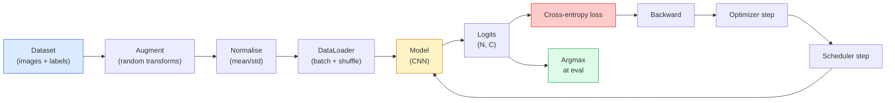

# 图像分类

> 分类器是一个将像素映射为类别概率分布的函数。其余所有部分都只是管道工程。

**类型：** 构建  
**语言：** Python  
**前提课程：** 阶段2第09课（模型评估），阶段3第10课（迷你框架），阶段4第03课（卷积神经网络）  
**时间：** 约75分钟

## 学习目标

- 在CIFAR-10上构建一个端到端的图像分类管道：数据集、数据增强、模型、训练循环、评估
- 解释每个组件（数据加载器、损失函数、优化器、学习率调度器、数据增强）的作用，并能预测当任何一个组件失效时，损失曲线会如何表现
- 从零实现混合增强（mixup）、随机擦除（cutout）和标签平滑（label smoothing），并能论证在何种情况下值得添加它们
- 阅读混淆矩阵和每类精确率/召回率表格，以诊断超越整体准确率的数据集和模型失败问题

## 问题所在

每一个上线的计算机视觉任务，在某种程度上都可以归结为图像分类。目标检测是对区域进行分类。语义分割是对像素进行分类。图像检索是根据与类中心的相似度进行排序。做好分类——包括数据集循环、数据增强策略、损失函数、评估——是这个阶段能迁移到所有其他任务的核心技能。

大多数分类错误并不在模型本身，它们潜伏在管道中：一个错误的标准化、一个未打乱的训练集、扭曲了标签的数据增强、一个被训练数据污染的验证集拆分、一个在30个epoch后悄然发散的学习率。一个在正确设置下能在CIFAR-10上达到93%准确率的CNN，在错误设置下通常只能达到70-75%，而整个过程中的损失曲线看起来却似乎合理。

本课将手动连接整个管道，使每个部分都可检查。你不会使用`torchvision.datasets`中任何可能隐藏bug的东西。

## 概念

### 分类管道



这个循环的每一行都可能隐藏一个bug。交叉熵接收原始logits，而不是softmax输出，因此在损失函数前的任何`model(x).softmax()`操作都会悄悄计算出错误的梯度。数据增强只应用于输入，而不应用于标签——除了混合增强（mixup），它同时混合两者。`optimizer.zero_grad()`必须在每个步骤执行一次；跳过它会导致梯度累积，看起来像是学习率极其不稳定。这些错误中的每一个都会使学习曲线变平，而不会抛出错误。

### 交叉熵、logits和softmax

分类器为每张图像生成`C`个数字，称为logits。应用softmax将其转换为概率分布：

```
softmax(z)_i = exp(z_i) / sum_j exp(z_j)
```

交叉熵衡量正确类别的负对数概率：

```
CE(z, y) = -log( softmax(z)_y )
        = -z_y + log( sum_j exp(z_j) )
```

右侧形式是数值稳定的形式（log-sum-exp）。PyTorch的`nn.CrossEntropyLoss`将softmax和负对数似然损失（NLL）融合在一个操作中，并直接接收原始logits。自己先应用softmax几乎总是一个bug——你计算的是log(softmax(softmax(z)))，一个毫无意义的量。

### 为什么数据增强有效

CNN对平移具有归纳偏置（来自权重共享），但对裁剪、翻转、颜色抖动或遮挡没有内置的不变性。教授它这些不变性的唯一方法是向它展示锻炼这些能力的像素。训练期间的每一次随机变换都是在说：“这两张图像具有相同的标签；学习那些忽略差异的特征。”

```
Original crop:  "dog facing left"
Flip:           "dog facing right"       <- same label, different pixels
Rotate(+15):    "dog, slight tilt"
Colour jitter:  "dog in warmer light"
RandomErasing:  "dog with patch missing"
```

规则：数据增强必须保持标签不变。对数字进行随机擦除和旋转可能会把“6”变成“9”；对于那样的数据集，你需要使用更小的旋转角度，并选择尊重数字特定不变性的增强方法。

### 混合增强和剪切混合增强

普通的数据增强变换像素但保持标签为one-hot编码。**混合增强（Mixup）** 和 **剪切混合增强（Cutmix）** 打破了这一点，它们同时对两者进行插值。

```
Mixup:
  lambda ~ Beta(a, a)
  x = lambda * x_i + (1 - lambda) * x_j
  y = lambda * y_i + (1 - lambda) * y_j

Cutmix:
  paste a random rectangle of x_j into x_i
  y = area-weighted mix of y_i and y_j
```

为什么有效：模型停止记忆尖锐的one-hot目标，并学习在类别之间进行插值。训练损失上升，测试准确率上升。对于任何分类器来说，这是最廉价的鲁棒性提升方法。

### 标签平滑

混合增强的近亲。不再针对`[0, 0, 1, 0, 0]`进行训练，而是针对一个更平滑的标签分布`[eps/C, eps/C, 1-eps, eps/C, eps/C]`（其中`eps`是一个小数，如0.1）进行训练。这阻止模型产生任意尖锐的logits，并以几乎零成本改善校准度。自PyTorch 1.10起已内置在`nn.CrossEntropyLoss(label_smoothing=0.1)`中。

### 超越准确率的评估

整体准确率会掩盖类别不平衡问题。一个总是预测多数类的90-10二元分类器，准确率也是90%。真正告诉你发生了什么的工具：

- **每类准确率** —— 每个类别一个数字；能立即暴露表现不佳的类别。
- **混淆矩阵** —— C x C 网格，第i行第j列的值表示真实类别为i但被预测为j的样本数量；对角线是正确的，非对角线是你的模型出错的地方。
- **Top-1 / Top-5** —— 正确类别是否出现在前1或前5个预测中；Top-5对ImageNet很重要，因为像“诺里奇梗”和“诺福克梗”这样的类别确实是模糊的。
- **校准度（ECE）** —— 置信度为0.8的预测，是否真的有80%的正确率？现代网络普遍存在过度自信；可以通过温度缩放或标签平滑来修复。

## 动手构建

### 步骤1：确定性的合成数据集

CIFAR-10数据集存储在磁盘上。为了让本课可复现且快速，我们构建一个看起来像CIFAR的合成数据集——32x32的RGB图像，带有模型必须学习的类特定结构。完全相同的管道可以直接用于真实的CIFAR-10。

```python
import numpy as np
import torch
from torch.utils.data import Dataset


def synthetic_cifar(num_per_class=1000, num_classes=10, seed=0):
    rng = np.random.default_rng(seed)
    X = []
    Y = []
    for c in range(num_classes):
        centre = rng.uniform(0, 1, (3,))
        freq = 2 + c
        for _ in range(num_per_class):
            yy, xx = np.meshgrid(np.linspace(0, 1, 32), np.linspace(0, 1, 32), indexing="ij")
            r = np.sin(xx * freq) * 0.5 + centre[0]
            g = np.cos(yy * freq) * 0.5 + centre[1]
            b = (xx + yy) * 0.5 * centre[2]
            img = np.stack([r, g, b], axis=-1)
            img += rng.normal(0, 0.08, img.shape)
            img = np.clip(img, 0, 1)
            X.append(img.astype(np.float32))
            Y.append(c)
    X = np.stack(X)
    Y = np.array(Y)
    idx = rng.permutation(len(X))
    return X[idx], Y[idx]


class ArrayDataset(Dataset):
    def __init__(self, X, Y, transform=None):
        self.X = X
        self.Y = Y
        self.transform = transform

    def __len__(self):
        return len(self.X)

    def __getitem__(self, i):
        img = self.X[i]
        if self.transform is not None:
            img = self.transform(img)
        img = torch.from_numpy(img).permute(2, 0, 1)
        return img, int(self.Y[i])
```

每个类别有自己的调色板和频率模式，加上高斯噪声，迫使模型学习信号而非记忆像素。十个类别，每个类别一千张图像，随机打乱。

### 步骤2：标准化与数据增强

每个视觉管道都有的两种变换。

```python
def standardize(mean, std):
    mean = np.array(mean, dtype=np.float32)
    std = np.array(std, dtype=np.float32)
    def _fn(img):
        return (img - mean) / std
    return _fn


def random_hflip(p=0.5):
    def _fn(img):
        if np.random.random() < p:
            return img[:, ::-1, :].copy()
        return img
    return _fn


def random_crop(pad=4):
    def _fn(img):
        h, w = img.shape[:2]
        padded = np.pad(img, ((pad, pad), (pad, pad), (0, 0)), mode="reflect")
        y = np.random.randint(0, 2 * pad)
        x = np.random.randint(0, 2 * pad)
        return padded[y:y + h, x:x + w, :]
    return _fn


def compose(*fns):
    def _fn(img):
        for fn in fns:
            img = fn(img)
        return img
    return _fn
```

在裁剪前使用反射填充，而不是零填充，因为黑色边框是模型会学到的一种无用信号。

### 步骤3：混合增强

在训练步骤内混合两张图像和两个标签。作为批处理变换实现，使其与前向传播相邻，而不是在数据集内部。

```python
def mixup_batch(x, y, num_classes, alpha=0.2):
    if alpha <= 0:
        return x, torch.nn.functional.one_hot(y, num_classes).float()
    lam = float(np.random.beta(alpha, alpha))
    idx = torch.randperm(x.size(0), device=x.device)
    x_mixed = lam * x + (1 - lam) * x[idx]
    y_onehot = torch.nn.functional.one_hot(y, num_classes).float()
    y_mixed = lam * y_onehot + (1 - lam) * y_onehot[idx]
    return x_mixed, y_mixed


def soft_cross_entropy(logits, soft_targets):
    log_probs = torch.log_softmax(logits, dim=-1)
    return -(soft_targets * log_probs).sum(dim=-1).mean()
```

`soft_cross_entropy`是针对软标签分布的交叉熵。当目标恰好是one-hot时，它简化为通常的一热情况。

### 步骤4：训练循环

完整的配方：数据遍历一次，每个批次计算一次梯度，每个epoch调整一次学习率。

```python
import torch
import torch.nn as nn
from torch.utils.data import DataLoader
from torch.optim import SGD
from torch.optim.lr_scheduler import CosineAnnealingLR

def train_one_epoch(model, loader, optimizer, device, num_classes, use_mixup=True):
    model.train()
    total, correct, loss_sum = 0, 0, 0.0
    for x, y in loader:
        x, y = x.to(device), y.to(device)
        if use_mixup:
            x_m, y_soft = mixup_batch(x, y, num_classes)
            logits = model(x_m)
            loss = soft_cross_entropy(logits, y_soft)
        else:
            logits = model(x)
            loss = nn.functional.cross_entropy(logits, y, label_smoothing=0.1)
        optimizer.zero_grad()
        loss.backward()
        optimizer.step()
        loss_sum += loss.item() * x.size(0)
        total += x.size(0)
        # Training accuracy vs the un-mixed labels `y` is only an approximation
        # when mixup is on (the model saw soft targets, not y). Treat it as a
        # rough progress signal; rely on val accuracy for real performance.
        with torch.no_grad():
            pred = logits.argmax(dim=-1)
            correct += (pred == y).sum().item()
    return loss_sum / total, correct / total


@torch.no_grad()
def evaluate(model, loader, device, num_classes):
    model.eval()
    total, correct = 0, 0
    loss_sum = 0.0
    cm = torch.zeros(num_classes, num_classes, dtype=torch.long)
    for x, y in loader:
        x, y = x.to(device), y.to(device)
        logits = model(x)
        loss = nn.functional.cross_entropy(logits, y)
        pred = logits.argmax(dim=-1)
        for t, p in zip(y.cpu(), pred.cpu()):
            cm[t, p] += 1
        loss_sum += loss.item() * x.size(0)
        total += x.size(0)
        correct += (pred == y).sum().item()
    return loss_sum / total, correct / total, cm
```

每次编写训练循环时都要检查的五个不变性：

1. 训练前调用`model.train()`，评估前调用`model.eval()`——切换dropout和批归一化的行为。
2. 在`.backward()`之前调用`.zero_grad()`。
3. 累积指标时使用`.item()`，这样可以释放计算图，避免内存泄漏。
4. 评估时使用`@torch.no_grad()`——节省内存和时间，防止微妙的意外。
5. 对原始logits进行argmax，而不是对softmax输出——结果相同，但少一个操作。

### 步骤5：整合所有部分

使用上一课的`TinyResNet`，训练几个epoch，然后评估。

```python
from main import synthetic_cifar, ArrayDataset
from main import standardize, random_hflip, random_crop, compose
from main import mixup_batch, soft_cross_entropy
from main import train_one_epoch, evaluate
# TinyResNet comes from the previous lesson (03-cnns-lenet-to-resnet).
# Adjust the import path to wherever you stored the previous lesson's code.
from cnns_lenet_to_resnet import TinyResNet  # example placeholder

X, Y = synthetic_cifar(num_per_class=500)
split = int(0.9 * len(X))
X_train, Y_train = X[:split], Y[:split]
X_val, Y_val = X[split:], Y[split:]

mean = [0.5, 0.5, 0.5]
std = [0.25, 0.25, 0.25]
train_tf = compose(random_hflip(), random_crop(pad=4), standardize(mean, std))
eval_tf = standardize(mean, std)

train_ds = ArrayDataset(X_train, Y_train, transform=train_tf)
val_ds = ArrayDataset(X_val, Y_val, transform=eval_tf)

train_loader = DataLoader(train_ds, batch_size=128, shuffle=True, num_workers=0)
val_loader = DataLoader(val_ds, batch_size=256, shuffle=False, num_workers=0)

device = "cuda" if torch.cuda.is_available() else "cpu"
model = TinyResNet(num_classes=10).to(device)
optimizer = SGD(model.parameters(), lr=0.1, momentum=0.9, weight_decay=5e-4, nesterov=True)
scheduler = CosineAnnealingLR(optimizer, T_max=10)

for epoch in range(10):
    tr_loss, tr_acc = train_one_epoch(model, train_loader, optimizer, device, 10, use_mixup=True)
    va_loss, va_acc, _ = evaluate(model, val_loader, device, 10)
    scheduler.step()
    print(f"epoch {epoch:2d}  lr {scheduler.get_last_lr()[0]:.4f}  "
          f"train {tr_loss:.3f}/{tr_acc:.3f}  val {va_loss:.3f}/{va_acc:.3f}")
```

在合成数据集上，这能在五个epoch内达到近乎完美的验证准确率，这就是重点：管道是正确的，模型能学到它能学到的东西。将数据集换成真实的CIFAR-10，同样的循环无需改动就能训练到约90%的准确率。

### 步骤6：阅读混淆矩阵

仅凭准确率永远无法告诉你模型在哪里失败。混淆矩阵可以。

```python
def print_confusion(cm, labels=None):
    c = cm.shape[0]
    labels = labels or [str(i) for i in range(c)]
    print(f"{'':>6}" + "".join(f"{l:>5}" for l in labels))
    for i in range(c):
        row = cm[i].tolist()
        print(f"{labels[i]:>6}" + "".join(f"{v:>5}" for v in row))
    print()
    tp = cm.diag().float()
    fp = cm.sum(dim=0).float() - tp
    fn = cm.sum(dim=1).float() - tp
    prec = tp / (tp + fp).clamp_min(1)
    rec = tp / (tp + fn).clamp_min(1)
    f1 = 2 * prec * rec / (prec + rec).clamp_min(1e-9)
    for i in range(c):
        print(f"{labels[i]:>6}  prec {prec[i]:.3f}  rec {rec[i]:.3f}  f1 {f1[i]:.3f}")

_, _, cm = evaluate(model, val_loader, device, 10)
print_confusion(cm)
```

行是真实类别，列是预测。类别3和5之间聚集的非对角线计数意味着模型混淆了这两者，为你针对性地收集数据或进行类别特定增强提供了起点。

## 实际应用

`torchvision`将上述所有内容封装成了惯用组件。对于真实的CIFAR-10，整个管道只需四行代码加上一个训练循环。

```python
from torchvision.datasets import CIFAR10
from torchvision.transforms import Compose, RandomCrop, RandomHorizontalFlip, ToTensor, Normalize

mean = (0.4914, 0.4822, 0.4465)
std = (0.2470, 0.2435, 0.2616)
train_tf = Compose([
    RandomCrop(32, padding=4, padding_mode="reflect"),
    RandomHorizontalFlip(),
    ToTensor(),
    Normalize(mean, std),
])
eval_tf = Compose([ToTensor(), Normalize(mean, std)])

train_ds = CIFAR10(root="./data", train=True,  download=True, transform=train_tf)
val_ds   = CIFAR10(root="./data", train=False, download=True, transform=eval_tf)
```

需要注意两点：均值和标准差是**数据集特定的**——是在CIFAR-10训练集上计算的，而不是ImageNet；反射填充是社区默认的裁剪策略。在这里直接复制粘贴ImageNet的统计值会导致约1%的准确率损失，而直到有人剖析模型前，通常没人会发现这个问题。

## 交付产出

本课将产出：

- `outputs/prompt-classifier-pipeline-auditor.md` —— 一个提示，用于审计训练脚本是否符合上述五个不变性，并指出第一个违反之处。
- `outputs/skill-classification-diagnostics.md` —— 一项技能，给定一个混淆矩阵和类别名称列表，总结每类的失败情况，并提出最具影响力的单一改进方案。

## 练习

1.  **(简单)** 在合成数据集上，分别使用和不使用混合增强训练同一个模型五个epoch。绘制两者的训练和验证损失曲线。解释为什么使用混合增强时训练损失更高，但验证准确率相似或更好。
2.  **(中等)** 实现随机擦除（Cutout）——在每张训练图像中随机擦除一个8x8的方块——并进行消融实验，对比无增强、水平翻转+裁剪、水平翻转+裁剪+随机擦除、水平翻转+裁剪+混合增强。报告每种情况的验证准确率。
3.  **(困难)** 构建一个CIFAR-100管道（100个类别，相同的输入尺寸），复现一个ResNet-34的训练过程，使其准确率在已发表结果的1%误差范围内。额外要求：搜索三个学习率和两个权重衰减参数，将结果记录到本地CSV文件，并生成最终的混淆矩阵-主要混淆类别表格。

## 关键术语

| 术语 | 人们怎么说 | 它的实际含义 |
|------|------------|--------------|
| Logits | “原始输出” | 每张图像的C个数字的预softmax向量；交叉熵需要这些，而不是softmax后的值 |
| 交叉熵 | “那个损失函数” | 正确类别的负对数概率；在一个稳定的操作中融合了log-softmax和负对数似然损失 |
| DataLoader | “批量加载器” | 封装了数据集，并提供打乱、分批和（可选）多工作进程加载功能；一半的训练bug都会归咎于它 |
| 数据增强 | “随机变换” | 训练时任何保持标签不变的像素级变换；教授CNN本身不具备的不变性 |
| 混合增强/剪切混合增强 | “混合两张图” | 同时混合输入和标签，使分类器学习平滑的插值，而不是硬边界 |
| 标签平滑 | “更软的目标” | 用(1-eps, eps/(C-1), ...)替代one-hot；改善校准度并略微提升准确率 |
| Top-k准确率 | “Top-5” | 正确类别出现在k个最高概率的预测中；用于类别本身具有模糊性的数据集 |
| 混淆矩阵 | “错误发生的地方” | C x C的表格，其中第(i, j)项表示真实类别i被预测为j的图像数量；对角线正确，非对角线告诉你需要修复什么 |

## 延伸阅读

- [CS231n：训练神经网络](https://cs231n.github.io/neural-networks-3/) —— 至今仍是单页面上对训练管道最清晰的讲解
- [图像分类技巧集锦（何恺明等，2019）](https://arxiv.org/abs/1812.01187) —— 每一个小技巧共同为ResNet在ImageNet上的准确率提升了3-4%
- [mixup: 超越经验风险最小化（张宏毅等，2017）](https://arxiv.org/abs/1710.09412) —— 混合增强的原始论文；三页理论加上令人信服的实验
- [为什么温度缩放很重要（Guo等，2017）](https://arxiv.org/abs/1706.04599) —— 证明现代网络存在校准偏差并用一个标量参数修复了它的论文