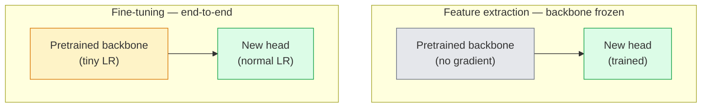

# 迁移学习与微调

> 别人花费了数百万GPU小时教会网络什么是边缘、纹理和物体部件。在训练自己的模型前，你应借用这些特征。

**类型：** 构建
**语言：** Python
**前提知识：** 第四阶段课程03（CNN），第四阶段课程04（图像分类）
**时间：** ~75分钟

## 学习目标

- 区分特征提取与微调，并根据数据集大小、领域距离和计算预算选择正确的方法
- 加载一个预训练的骨干网络，替换其分类头，并在20行代码内仅训练头部使其达到可用的基线水平
- 使用判别式学习率渐进解冻层，使得早期通用特征获得的更新小于后期特定任务的特征
- 诊断三种常见失败情况：解冻块上学习率过高导致特征漂移、小数据集上BN统计量崩溃，以及灾难性遗忘

## 问题所在

在ImageNet上训练ResNet-50需要约2000个GPU小时。很少有团队能在每个任务上都有这样的预算。实际上，每个团队部署的几乎都是使用预训练骨干网络，并用几百或几千张特定任务图像训练一个新头部的方式。

这并非捷径。任何ImageNet训练的CNN的第一个卷积块学习边缘和类Gabor滤波器。接下来的几个块学习纹理和简单图案。中间的块学习物体部件。最后的块学习开始像ImageNet的1000个类别的组合。该层次结构的前90%几乎原封不动地转移到医学成像、工业检测、卫星数据和所有其他视觉任务——因为自然界对边缘和词汇的词表是有限的。最后的10%才是你实际需要训练的。

正确进行迁移学习有三个潜在问题：过高的学习率破坏预训练特征、冻结过多导致模型信息匮乏，以及让BatchNorm的运行统计量向网络其余部分从未学习过的微小数据集漂移。本课程将主动引导你经历每一个问题。

## 核心概念

### 特征提取 vs 微调

两种模式，根据你对预训练特征的信任程度以及拥有的数据量来选择。



经验法则：

| 数据集大小 | 领域距离 | 方案 |
|--------------|-----------------|--------|
| < 1k 张图像 | 接近 ImageNet | 冻结骨干，仅训练头部 |
| 1k-10k | 接近 | 冻结前2-3个阶段，微调其余部分 |
| 10k-100k | 任意 | 使用判别式学习率进行端到端微调 |
| 100k+ | 远 | 微调所有层；如果领域足够远，考虑从头训练 |

"接近ImageNet"大致意味着具有类物体内容的自然RGB照片。医学CT扫描、卫星俯视图像和显微镜图像属于远领域——特征仍然有帮助，但你需要让更多的层适应。

### 为什么冻结会有效

CNN在ImageNet上学到的特征并非专门针对那1000个类别。它们专门针对自然图像的统计特性：特定方向的边缘、纹理、对比度模式、形状基元。这些统计特性在人类能命名的几乎所有视觉领域中都是稳定的。这就是为什么在ImageNet上训练的模型，仅使用新的线性头（不微调骨干）在CIFAR-10上零样本评估能达到80%以上的准确率。头部是在学习如何为当前任务对已学到的特征进行加权。

### 判别式学习率

当你解冻层时，早期层应比后期层训练得更慢。早期层编码你想要保留的通用特征；后期层编码你需要大幅调整的特定任务结构。

```
Typical recipe:

  stage 0 (stem + first group): lr = base_lr / 100    (mostly fixed)
  stage 1:                       lr = base_lr / 10
  stage 2:                       lr = base_lr / 3
  stage 3 (last backbone group): lr = base_lr
  head:                          lr = base_lr  (or slightly higher)
```

在PyTorch中，这只是传递给优化器的一个参数组列表。一个模型，五个学习率，零额外代码。

### BatchNorm问题

BN层保存在ImageNet上计算得到的 `running_mean` 和 `running_var` 缓冲区。如果你的任务具有不同的像素分布——不同的光照、不同的传感器、不同的颜色空间——这些缓冲区就是错误的。按优先顺序有三个选项：

1. **在训练模式下微调BN。** 让BN像其他参数一样更新其运行统计量。当任务数据集为中等大小（>= 5k 样本）时的默认选择。
2. **在评估模式下冻结BN。** 保留ImageNet的统计量，仅训练权重。当你的数据集足够小，以至于BN的移动平均会有噪声时，这是正确的做法。
3. **用GroupNorm替换BN。** 完全消除移动平均问题。用于检测和分割骨干网络，其中每个GPU的批量大小很小。

处理不当会悄无声息地导致准确率下降5-15%。

### 头部设计

分类器头部是1-3个线性层加上一个可选的dropout层。每个torchvision骨干都附带一个默认头部供你替换：

```
backbone.fc = nn.Linear(backbone.fc.in_features, num_classes)          # ResNet
backbone.classifier[1] = nn.Linear(..., num_classes)                    # EfficientNet, MobileNet
backbone.heads.head = nn.Linear(..., num_classes)                       # torchvision ViT
```

对于小数据集，通常一个线性层就足够了。当任务分布与骨干网络的训练分布相距较远时，添加一个隐藏层（Linear -> ReLU -> Dropout -> Linear）会有所帮助。

### 逐层学习率衰减

这是现代微调（如BEiT, DINOv2, ViT-B微调）中使用的更平滑的判别式学习率版本。不是将层分组到阶段，而是给每个层一个比上一层稍小的学习率：

```
lr_layer_k = base_lr * decay^(L - k)
```

当衰减率 = 0.75 且 L = 12个transformer块时，第一个块以 `0.75^11 ≈ 0.04x` 倍头部的学习率进行训练。这对transformer微调比对CNN更重要，对于CNN，按阶段分组的学习率通常就足够了。

### 评估指标

迁移学习的运行需要两个在从头训练时不会跟踪的指标：

- **仅预训练准确率** —— 骨干网络冻结时头部的准确率。这是你的下限。
- **微调后准确率** —— 同一模型在端到端训练后的准确率。这是你的上限。

如果微调后的准确率低于仅预训练的准确率，说明存在学习率或BN错误。务必打印两者。

## 动手构建

### 步骤1：加载预训练骨干并检查

```python
import torch
import torch.nn as nn
from torchvision.models import resnet18, ResNet18_Weights

backbone = resnet18(weights=ResNet18_Weights.IMAGENET1K_V1)
print(backbone)
print()
print("classifier head:", backbone.fc)
print("feature dim:", backbone.fc.in_features)
```

`ResNet18` 有四个阶段 (`layer1..layer4`) 加上一个stem和一个 `fc` 头部。每个torchvision分类骨干都有类似的结构。

### 步骤2：特征提取——冻结所有层，替换头部

```python
def make_feature_extractor(num_classes=10):
    model = resnet18(weights=ResNet18_Weights.IMAGENET1K_V1)
    for p in model.parameters():
        p.requires_grad = False
    model.fc = nn.Linear(model.fc.in_features, num_classes)
    return model

model = make_feature_extractor(num_classes=10)
trainable = sum(p.numel() for p in model.parameters() if p.requires_grad)
frozen = sum(p.numel() for p in model.parameters() if not p.requires_grad)
print(f"trainable: {trainable:>10,}")
print(f"frozen:    {frozen:>10,}")
```

只有 `model.fc` 是可训练的。骨干网络是一个冻结的特征提取器。

### 步骤3：判别式微调

一个构建参数组的工具函数，用于为不同阶段设置特定的学习率。

```python
def discriminative_param_groups(model, base_lr=1e-3, decay=0.3):
    stages = [
        ["conv1", "bn1"],
        ["layer1"],
        ["layer2"],
        ["layer3"],
        ["layer4"],
        ["fc"],
    ]
    groups = []
    for i, names in enumerate(stages):
        lr = base_lr * (decay ** (len(stages) - 1 - i))
        params = [p for n, p in model.named_parameters()
                  if any(n.startswith(k) for k in names)]
        if params:
            groups.append({"params": params, "lr": lr, "name": "_".join(names)})
    return groups

model = resnet18(weights=ResNet18_Weights.IMAGENET1K_V1)
model.fc = nn.Linear(model.fc.in_features, 10)
for p in model.parameters():
    p.requires_grad = True

groups = discriminative_param_groups(model)
for g in groups:
    print(f"{g['name']:>10s}  lr={g['lr']:.2e}  params={sum(p.numel() for p in g['params']):>8,}")
```

`decay=0.3` 意味着每个阶段以比下一阶段慢30%的速率进行训练。`fc` 获得 `base_lr`，`layer4` 获得 `0.3 * base_lr`，`conv1` 获得 `0.3^5 * base_lr ≈ 0.00243 * base_lr`。听起来极端；实验证明有效。

### 步骤4：BatchNorm处理

一个辅助函数，用于冻结BN的运行统计量而不冻结其权重。

```python
def freeze_bn_stats(model):
    for m in model.modules():
        if isinstance(m, (nn.BatchNorm1d, nn.BatchNorm2d, nn.BatchNorm3d)):
            m.eval()
            for p in m.parameters():
                p.requires_grad = False
    return model
```

在每个epoch开始时设置 `model.train()` 后调用它。`model.train()` 会将所有内容切换到训练模式；这个函数只对BN层进行反向操作。

### 步骤5：一个最小化的端到端微调循环

```python
from torch.optim import SGD
from torch.utils.data import DataLoader
from torch.optim.lr_scheduler import CosineAnnealingLR
import torch.nn.functional as F

def fine_tune(model, train_loader, val_loader, device, epochs=5, base_lr=1e-3, freeze_bn=False):
    model = model.to(device)
    groups = discriminative_param_groups(model, base_lr=base_lr)
    optimizer = SGD(groups, momentum=0.9, weight_decay=1e-4, nesterov=True)
    scheduler = CosineAnnealingLR(optimizer, T_max=epochs)

    for epoch in range(epochs):
        model.train()
        if freeze_bn:
            freeze_bn_stats(model)
        tr_loss, tr_correct, tr_total = 0.0, 0, 0
        for x, y in train_loader:
            x, y = x.to(device), y.to(device)
            logits = model(x)
            loss = F.cross_entropy(logits, y, label_smoothing=0.1)
            optimizer.zero_grad()
            loss.backward()
            optimizer.step()
            tr_loss += loss.item() * x.size(0)
            tr_total += x.size(0)
            tr_correct += (logits.argmax(-1) == y).sum().item()
        scheduler.step()

        model.eval()
        va_total, va_correct = 0, 0
        with torch.no_grad():
            for x, y in val_loader:
                x, y = x.to(device), y.to(device)
                pred = model(x).argmax(-1)
                va_total += x.size(0)
                va_correct += (pred == y).sum().item()
        print(f"epoch {epoch}  train {tr_loss/tr_total:.3f}/{tr_correct/tr_total:.3f}  "
              f"val {va_correct/va_total:.3f}")
    return model
```

在CIFAR-10上使用上述方案训练五个epoch，将零样本线性探测的准确率从约70%提升到约93%的微调准确率。如果仅训练头部，准确率会在约86%左右停滞，并且永远不会触及骨干网络。

### 步骤6：渐进式解冻

一种调度策略，每个epoch从末尾向前解冻一个阶段。以一些额外的epoch为代价来减轻特征漂移。

```python
def progressive_unfreeze_schedule(model):
    stages = ["layer4", "layer3", "layer2", "layer1"]
    yielded = set()

    def start():
        for p in model.parameters():
            p.requires_grad = False
        for p in model.fc.parameters():
            p.requires_grad = True

    def unfreeze(epoch):
        if epoch < len(stages):
            name = stages[epoch]
            yielded.add(name)
            for n, p in model.named_parameters():
                if n.startswith(name):
                    p.requires_grad = True
            return name
        return None

    return start, unfreeze
```

在第一个epoch之前调用 `start()`。在每个epoch开始时调用 `unfreeze(epoch)`。每当可训练参数集发生变化时，都要重新构建优化器，否则冻结的参数仍然持有缓存的动量，这会混淆优化器。

## 实际应用

对于大多数实际任务，`torchvision.models` 加三行代码就足够了。当你遇到库默认设置无法解决的问题时，上面更复杂的机制才变得重要。

```python
from torchvision.models import resnet50, ResNet50_Weights

model = resnet50(weights=ResNet50_Weights.IMAGENET1K_V2)
model.fc = nn.Linear(model.fc.in_features, num_classes)
optimizer = torch.optim.AdamW(model.parameters(), lr=1e-4, weight_decay=1e-4)
```

另外两个生产级的默认选项：

- `timm` 提供了约800个预训练的视觉骨干，具有统一的API（`timm.create_model("resnet50", pretrained=True, num_classes=10)`）。对于任何超出torchvision库的微调任务，它是标准选择。
- 对于transformer，`transformers.AutoModelForImageClassification.from_pretrained(name, num_labels=N)` 为你提供ViT / BEiT / DeiT，其加载语义与文本模型相同。

## 交付成果

本课程产出：

- `outputs/prompt-fine-tune-planner.md` —— 一个提示，根据数据集大小、领域距离和计算预算，选择特征提取、渐进式还是端到端微调。
- `outputs/skill-freeze-inspector.md` —— 一项技能，给定一个PyTorch模型，可以报告哪些参数是可训练的，哪些BatchNorm层处于评估模式，以及优化器是否实际接收到可训练参数。

## 练习

1.  **（简单）** 在同一个合成CIFAR数据集上，将 `ResNet18` 训练为线性探测（骨干冻结）和完整微调。并列报告两个准确率。解释哪个差距表明特征迁移效果好，哪个表明效果不佳。
2.  **（中等）** 故意引入一个bug：在骨干阶段而不是头部设置 `base_lr = 1e-1`。展示训练损失如何爆炸，然后通过应用 `discriminative_param_groups` 辅助函数恢复。记录每个阶段开始发散时的学习率。
3.  **（困难）** 拿一个医学影像数据集（例如CheXpert-small, PatchCamelyon, 或HAM10000），比较三种模式：(a) ImageNet预训练的冻结骨干 + 线性头部；(b) ImageNet预训练的端到端微调；(c) 从头训练。报告每种情况的准确率和计算成本。在什么数据集大小下，从头训练变得具有竞争力？

## 关键术语

| 术语 | 人们怎么说 | 实际含义 |
|------|----------------|----------------------|
| 特征提取 | "冻结并训练头部" | 骨干网络参数被冻结，只有新的分类器头部接收梯度 |
| 微调 | "重新进行端到端训练" | 所有参数可训练，通常使用比从头训练小得多的学习率 |
| 判别式学习率 | "早期层使用更小的学习率" | 优化器参数组中，早期阶段的学习率是后期阶段学习率的一小部分 |
| 逐层学习率衰减 | "平滑的学习率梯度" | 每层的学习率乘以 decay^(L - k)；常见于transformer微调 |
| 灾难性遗忘 | "模型忘记了ImageNet" | 过高的学习率在新的任务信号被学习之前覆盖了预训练特征 |
| BN统计量漂移 | "运行均值不对" | BatchNorm的 running_mean/var 是在与当前任务不同的分布上计算的，悄无声息地损害准确率 |
| 线性探测 | "冻结的骨干 + 线性头部" | 预训练特征的评估——在冻结表示之上最佳线性分类器的准确率 |
| 灾难性崩溃 | "所有预测都归为一类" | 当微调使用的学习率高到足以在来自头部的梯度稳定下来之前就破坏特征时发生 |

## 延伸阅读

- [深度神经网络中的特征可迁移性如何？ (Yosinski et al., 2014)](https://arxiv.org/abs/1411.1792) —— 量化层间特征可迁移性的论文
- [通用语言模型微调 (ULMFiT, Howard & Ruder, 2018)](https://arxiv.org/abs/1801.06146) —— 原始的判别式学习率/渐进式解冻方案；这些思想直接迁移到视觉领域
- [timm 文档](https://huggingface.co/docs/timm) —— 现代视觉骨干及其训练时精确微调默认设置的参考
- [线性探测评估的简单框架 (Kornblith et al., 2019)](https://arxiv.org/abs/1805.08974) —— 为什么线性探测准确率重要以及如何正确报告