# 从零构建目标检测 —— YOLO

> 检测是分类加上回归，在特征图的每个位置运行，然后通过非极大值抑制进行清理。

**类型：** 构建
**语言：** Python
**先决条件：** 第四阶段 课程03（CNNs），第四阶段 课程04（图像分类），第四阶段 课程05（迁移学习）
**时间：** 约75分钟

## 学习目标

- 解释将检测转变为密集预测问题的网格与锚框设计，并说明输出张量中每个数字的含义
- 计算边界框之间的交并比，并从零实现非极大值抑制
- 在预训练主干网络上构建一个最小化的YOLO风格头部，包括分类、目标性得分和边界框回归损失
- 读懂检测指标行（precision@0.5, recall, mAP@0.5, mAP@0.5:0.95）并确定下一个要调整的参数

## 问题描述

分类器说：“这张图是狗。” 检测器说：“在像素坐标 (112, 40, 280, 210) 处有一只狗，在 (400, 180, 560, 310) 处有一只猫，画面中没有其他东西。” 这一结构上的变化——预测数量可变的带标签边界框，而不是每张图一个标签——是每个自主系统、每个监控产品、每个文档布局解析器以及每条工厂视觉检测线所依赖的核心。

检测也是视觉领域中所有工程权衡同时显现的地方。你需要边界框是准确的（回归头部），你需要每个框的类别是正确的（分类头部），你需要模型知道何时没有东西可检测（目标性得分），并且你需要每个真实物体只有一个预测（非极大值抑制）。忽视其中任何一点，整个流程要么漏检物体，要么报告虚假的框，要么以略微不同的位置预测同一个物体十五次。

YOLO（You Only Look Once，Redmon等人 2016）通过单次卷积网络前向传播实现了这一切实时运行，其相同的设计决策至今仍是现代检测器（YOLOv8, YOLOv9, YOLO-NAS, RT-DETR）的骨干。掌握了核心，每个变体都只是相同部件的重新排列。

## 核心概念

### 检测即密集预测

分类器为每张图像输出 C 个数字。YOLO风格的检测器为每张图像输出 `(S x S x (5 + C))` 个数字，其中 S 是空间网格尺寸。

```mermaid
flowchart LR
    IMG["Input 416x416 RGB"] --> BB["Backbone<br/>(ResNet, DarkNet, ...)"]
    BB --> FM["Feature map<br/>(C_feat, 13, 13)"]
    FM --> HEAD["Detection head<br/>(1x1 convs)"]
    HEAD --> OUT["Output tensor<br/>(13, 13, B * (5 + C))"]
    OUT --> DEC["Decode<br/>(grid + sigmoid + exp)"]
    DEC --> NMS["Non-max suppression"]
    NMS --> RESULT["Final boxes"]

    style IMG fill:#dbeafe,stroke:#2563eb
    style HEAD fill:#fef3c7,stroke:#d97706
    style NMS fill:#fecaca,stroke:#dc2626
    style RESULT fill:#dcfce7,stroke:#16a34a
```



每个 `S * S` 网格单元预测 `B` 个边界框。对于每个框：
- 4 个数字描述几何位置：`tx, ty, tw, th`。
- 1 个数字是目标性得分：“这个单元的中心附近是否有物体？”
- C 个数字是类别概率。

每个单元总计：`B * (5 + C)`。对于具有 `S=13, B=2, C=20` 的 VOC 数据集，每个单元有 50 个数字。

### 为什么需要网格和锚框

普通回归会为每个物体预测绝对的 `(x, y, w, h)` 坐标。这对于卷积网络来说很困难，因为平移图像不应使所有预测都平移相同的量——每个物体在空间上是有锚定的。网格通过将每个真实框分配给其中心落入的网格单元来解决这个问题；只有该单元负责该物体。

锚框解决了第二个问题。一个 3x3 卷积核难以从一个 16 像素感受野的特征单元回归出 500 像素宽的边界框。相反，我们为每个单元预定义 `B` 种先验框形状（锚框），并预测相对于每个锚框的小偏移量。模型学习选择正确的锚框并微调它，而不是从零开始回归。

```
Anchor box priors (example for 416x416 input):

  small:   (30,  60)
  medium:  (75,  170)
  large:   (200, 380)

At each grid cell, every anchor emits (tx, ty, tw, th, obj, c_1, ..., c_C).
```

现代检测器通常使用FPN，并在不同分辨率上使用不同的锚框集——在浅层高分辨率图上使用小锚框，在深层低分辨率图上使用大锚框。思路相同，只是应用到更多尺度。

### 解码预测

原始的 `tx, ty, tw, th` 不是框坐标；它们是需要转换后才能绘图的回归目标：

```
centre x  = (sigmoid(tx) + cell_x) * stride
centre y  = (sigmoid(ty) + cell_y) * stride
width     = anchor_w * exp(tw)
height    = anchor_h * exp(th)
```

`sigmoid` 保持中心偏移在单元格内。`exp` 允许宽度相对于锚框自由缩放而无符号反转。`stride` 将网格坐标缩放回像素坐标。这个解码步骤自YOLOv2以来在每个YOLO版本中都是相同的。

### 交并比 (IoU)

检测中两个边界框之间的通用相似性度量：

```
IoU(A, B) = area(A intersect B) / area(A union B)
```

IoU = 1 表示完全重合；IoU = 0 表示没有重叠。预测框与真实框之间的IoU决定了预测是否算作真正例（通常 IoU >= 0.5）。两个预测框之间的IoU是NMS用于去重的基础。

### 非极大值抑制

在相邻锚框上训练的卷积网络通常会为同一个物体重叠地预测多个框。NMS保留置信度最高的预测，并删除其他IoU高于某个阈值的预测。

```
NMS(boxes, scores, iou_threshold):
    sort boxes by score descending
    keep = []
    while boxes not empty:
        pick the top-scoring box, add to keep
        remove every box with IoU > iou_threshold to the picked box
    return keep
```

典型阈值：对于目标检测，通常为0.45。最近的检测器用`soft-NMS`、`DIoU-NMS`或直接学习抑制（RT-DETR）取代了标准NMS，但其结构目的相同。

### 损失函数

YOLO损失是三项损失的加权和：

```
L = lambda_coord * L_box(pred, target, where obj=1)
  + lambda_obj   * L_obj(pred, 1,     where obj=1)
  + lambda_noobj * L_obj(pred, 0,     where obj=0)
  + lambda_cls   * L_cls(pred, target, where obj=1)
```

只有包含物体的单元才对边界框回归和分类损失有贡献。没有物体的单元仅对目标性损失有贡献（教会模型保持沉默）。`lambda_noobj` 通常较小（约0.5），因为绝大多数单元是空的，否则它们会主导总损失。

现代变体将MSE框损失换成CIoU / DIoU（直接优化IoU），使用focal loss处理类别不平衡，并用quality focal loss平衡目标性。三组件结构保持不变。

### 检测指标

准确率不能直接迁移到检测。以下四个数字可以：

- **Precision@IoU=0.5** — 在被计为正样本的预测中，实际正确的有多少。
- **Recall@IoU=0.5** — 在真实物体中，我们找到了多少。
- **AP@0.5** — IoU阈值为0.5时的精确率-召回率曲线下的面积；每个类别一个数字。
- **mAP@0.5:0.95** — AP在IoU阈值0.5, 0.55, ..., 0.95上的平均值。这是COCO指标；最严格且信息量最大。

报告所有四个指标。一个在mAP@0.5上很强但mAP@0.5:0.95上弱的检测器，其定位是大致正确但不够紧密；需要通过改进边界框回归损失来解决。一个精确率高但召回率低的检测器过于保守；需要降低置信度阈值或增加目标性损失的权重。

## 动手实现

### 步骤1: 交并比

本课程的主力函数。适用于 `(x1, y1, x2, y2)` 格式的两个边界框数组。

```python
import numpy as np

def box_iou(boxes_a, boxes_b):
    ax1, ay1, ax2, ay2 = boxes_a[:, 0], boxes_a[:, 1], boxes_a[:, 2], boxes_a[:, 3]
    bx1, by1, bx2, by2 = boxes_b[:, 0], boxes_b[:, 1], boxes_b[:, 2], boxes_b[:, 3]

    inter_x1 = np.maximum(ax1[:, None], bx1[None, :])
    inter_y1 = np.maximum(ay1[:, None], by1[None, :])
    inter_x2 = np.minimum(ax2[:, None], bx2[None, :])
    inter_y2 = np.minimum(ay2[:, None], by2[None, :])

    inter_w = np.clip(inter_x2 - inter_x1, 0, None)
    inter_h = np.clip(inter_y2 - inter_y1, 0, None)
    inter = inter_w * inter_h

    area_a = (ax2 - ax1) * (ay2 - ay1)
    area_b = (bx2 - bx1) * (by2 - by1)
    union = area_a[:, None] + area_b[None, :] - inter
    return inter / np.clip(union, 1e-8, None)
```

返回一个成对IoU的 `(N_a, N_b)` 矩阵。通过将一个数组形状设为 `(1, 4)`，可以将其用于与单个真实框计算IoU。

### 步骤2: 非极大值抑制

```python
def nms(boxes, scores, iou_threshold=0.45):
    order = np.argsort(-scores)
    keep = []
    while len(order) > 0:
        i = order[0]
        keep.append(i)
        if len(order) == 1:
            break
        rest = order[1:]
        ious = box_iou(boxes[[i]], boxes[rest])[0]
        order = rest[ious <= iou_threshold]
    return np.array(keep, dtype=np.int64)
```

确定性算法，`O(N log N)` 来自排序操作，并且在相同输入上的行为与 `torchvision.ops.nms` 一致。

### 步骤3: 框编码与解码

在像素坐标和网络实际回归的 `(tx, ty, tw, th)` 目标之间进行转换。

```python
def encode(box_xyxy, cell_x, cell_y, stride, anchor_wh):
    x1, y1, x2, y2 = box_xyxy
    cx = 0.5 * (x1 + x2)
    cy = 0.5 * (y1 + y2)
    w = x2 - x1
    h = y2 - y1
    tx = cx / stride - cell_x
    ty = cy / stride - cell_y
    tw = np.log(w / anchor_wh[0] + 1e-8)
    th = np.log(h / anchor_wh[1] + 1e-8)
    return np.array([tx, ty, tw, th])


def decode(tx_ty_tw_th, cell_x, cell_y, stride, anchor_wh):
    tx, ty, tw, th = tx_ty_tw_th
    cx = (sigmoid(tx) + cell_x) * stride
    cy = (sigmoid(ty) + cell_y) * stride
    w = anchor_wh[0] * np.exp(tw)
    h = anchor_wh[1] * np.exp(th)
    return np.array([cx - w / 2, cy - h / 2, cx + w / 2, cy + h / 2])


def sigmoid(x):
    return 1.0 / (1.0 + np.exp(-x))
```

测试：编码一个框然后解码——你应该得到一个与原始值非常接近的结果（除了当 `tx` 不在sigmoid后的范围内时，sigmoid逆变换不是完全可逆的）。

### 步骤4: 一个最小的YOLO头

在特征图上进行一个1x1卷积，并重塑为 `(B, S, S, num_anchors, 5 + C)`。

```python
import torch
import torch.nn as nn

class YOLOHead(nn.Module):
    def __init__(self, in_c, num_anchors, num_classes):
        super().__init__()
        self.num_anchors = num_anchors
        self.num_classes = num_classes
        self.conv = nn.Conv2d(in_c, num_anchors * (5 + num_classes), kernel_size=1)

    def forward(self, x):
        n, _, h, w = x.shape
        y = self.conv(x)
        y = y.view(n, self.num_anchors, 5 + self.num_classes, h, w)
        y = y.permute(0, 3, 4, 1, 2).contiguous()
        return y
```

输出形状：`(N, H, W, num_anchors, 5 + C)`。最后一个维度包含 `[tx, ty, tw, th, obj, cls_0, ..., cls_{C-1}]`。

### 步骤5: 真实框分配

对于每个真实框，决定由哪个 `(cell, anchor)` 负责。

```python
def assign_targets(boxes_xyxy, classes, anchors, stride, grid_size, num_classes):
    num_anchors = len(anchors)
    target = np.zeros((grid_size, grid_size, num_anchors, 5 + num_classes), dtype=np.float32)
    has_obj = np.zeros((grid_size, grid_size, num_anchors), dtype=bool)

    for box, cls in zip(boxes_xyxy, classes):
        x1, y1, x2, y2 = box
        cx, cy = 0.5 * (x1 + x2), 0.5 * (y1 + y2)
        gx, gy = int(cx / stride), int(cy / stride)
        bw, bh = x2 - x1, y2 - y1

        ious = np.array([
            (min(bw, aw) * min(bh, ah)) / (bw * bh + aw * ah - min(bw, aw) * min(bh, ah))
            for aw, ah in anchors
        ])
        best = int(np.argmax(ious))
        aw, ah = anchors[best]

        target[gy, gx, best, 0] = cx / stride - gx
        target[gy, gx, best, 1] = cy / stride - gy
        target[gy, gx, best, 2] = np.log(bw / aw + 1e-8)
        target[gy, gx, best, 3] = np.log(bh / ah + 1e-8)
        target[gy, gx, best, 4] = 1.0
        target[gy, gx, best, 5 + cls] = 1.0
        has_obj[gy, gx, best] = True
    return target, has_obj
```

锚框选择是“与真实框形状IoU最大”——这是一个廉价的代理，与YOLOv2/v3的分配策略一致。v5及以后版本使用更复杂的策略（任务对齐匹配、动态k）来改进相同的思想。

### 步骤6: 三项损失

```python
def yolo_loss(pred, target, has_obj, lambda_coord=5.0, lambda_obj=1.0, lambda_noobj=0.5, lambda_cls=1.0):
    has_obj_t = torch.from_numpy(has_obj).bool()
    target_t = torch.from_numpy(target).float()

    # box-regression loss: only on cells with objects
    box_pred = pred[..., :4][has_obj_t]
    box_true = target_t[..., :4][has_obj_t]
    loss_box = torch.nn.functional.mse_loss(box_pred, box_true, reduction="sum")

    # objectness loss
    obj_pred = pred[..., 4]
    obj_true = target_t[..., 4]
    loss_obj_pos = torch.nn.functional.binary_cross_entropy_with_logits(
        obj_pred[has_obj_t], obj_true[has_obj_t], reduction="sum")
    loss_obj_neg = torch.nn.functional.binary_cross_entropy_with_logits(
        obj_pred[~has_obj_t], obj_true[~has_obj_t], reduction="sum")

    # classification loss on cells with objects
    cls_pred = pred[..., 5:][has_obj_t]
    cls_true = target_t[..., 5:][has_obj_t]
    loss_cls = torch.nn.functional.binary_cross_entropy_with_logits(
        cls_pred, cls_true, reduction="sum")

    total = (lambda_coord * loss_box
             + lambda_obj * loss_obj_pos
             + lambda_noobj * loss_obj_neg
             + lambda_cls * loss_cls)
    return total, {"box": loss_box.item(), "obj_pos": loss_obj_pos.item(),
                   "obj_neg": loss_obj_neg.item(), "cls": loss_cls.item()}
```

每个YOLO教程要么硬编码、要么进行超参搜索的五个超参数。比例很重要：`lambda_coord=5, lambda_noobj=0.5` 反映了原始YOLOv1论文，作为一个合理的默认值仍然有效。

### 步骤7: 推理流水线

解码原始头部输出，应用sigmoid/exp，对目标性得分进行阈值处理，然后进行NMS。

```python
def postprocess(pred_tensor, anchors, stride, img_size, conf_threshold=0.25, iou_threshold=0.45):
    pred = pred_tensor.detach().cpu().numpy()
    grid_h, grid_w = pred.shape[1], pred.shape[2]
    num_anchors = len(anchors)

    boxes, scores, classes = [], [], []
    for gy in range(grid_h):
        for gx in range(grid_w):
            for a in range(num_anchors):
                tx, ty, tw, th, obj, *cls = pred[0, gy, gx, a]
                score = sigmoid(obj) * sigmoid(np.array(cls)).max()
                if score < conf_threshold:
                    continue
                cls_idx = int(np.argmax(cls))
                cx = (sigmoid(tx) + gx) * stride
                cy = (sigmoid(ty) + gy) * stride
                w = anchors[a][0] * np.exp(tw)
                h = anchors[a][1] * np.exp(th)
                boxes.append([cx - w / 2, cy - h / 2, cx + w / 2, cy + h / 2])
                scores.append(float(score))
                classes.append(cls_idx)

    if not boxes:
        return np.zeros((0, 4)), np.zeros((0,)), np.zeros((0,), dtype=int)
    boxes = np.array(boxes)
    scores = np.array(scores)
    classes = np.array(classes)
    keep = nms(boxes, scores, iou_threshold)
    return boxes[keep], scores[keep], classes[keep]
```

这就是完整的评估路径：头部 -> 解码 -> 阈值处理 -> NMS。

## 使用它

`torchvision.models.detection` 提供的生产检测器具有相同的概念结构。加载预训练模型只需三行代码。

```python
import torch
from torchvision.models.detection import fasterrcnn_resnet50_fpn_v2

model = fasterrcnn_resnet50_fpn_v2(weights="DEFAULT")
model.eval()
with torch.no_grad():
    predictions = model([torch.randn(3, 400, 600)])
print(predictions[0].keys())
print(f"boxes:  {predictions[0]['boxes'].shape}")
print(f"scores: {predictions[0]['scores'].shape}")
print(f"labels: {predictions[0]['labels'].shape}")
```

对于实时推理流水线，`ultralytics`（YOLOv8/v9）是标准选择：`from ultralytics import YOLO; model = YOLO('yolov8n.pt'); model(img)`。模型内部处理解码和NMS，并返回与你上面构建的相同的 `boxes / scores / labels` 三元组。

## 部署它

本课程产出：

- `outputs/prompt-detection-metric-reader.md` — 一个提示，将 `precision, recall, AP, mAP@0.5:0.95` 行转化为一行诊断和最有用的下一步实验。
- `outputs/skill-anchor-designer.md` — 一项技能，给定一个包含真实框的数据集，对 `(w, h)` 运行k-means，返回每个FPN层级的锚框集以及选择正确锚框数量所需的覆盖统计数据。

## 练习

1.  **(简单)** 实现 `box_iou` 并在1000对随机框上运行它，与 `torchvision.ops.box_iou` 进行比较。验证最大绝对差低于 `1e-6`。
2.  **(中等)** 将 `yolo_loss` 移植到使用 `CIoU` 框损失而不是MSE的版本。在一个100张图像的合成数据集上证明，在相同epoch数内，CIoU收敛到比MSE更好的最终mAP@0.5:0.95。
3.  **(困难)** 实现多尺度推理：将同一张图像以三种分辨率输入模型，合并框预测，最后运行一次NMS。在留出集上测量相对于单尺度推理的mAP提升。

## 关键术语

| 术语 | 常见说法 | 实际含义 |
|------|----------|----------|
| 锚框 | “框先验” | 在每个网格单元上预定义的边界框形状，网络预测相对于它的偏移量，而非绝对坐标 |
| 交并比 (IoU) | “重叠度” | 两个边界框的交集与并集之比；检测中的通用相似性度量 |
| 非极大值抑制 (NMS) | “去重” | 一种贪心算法，保留得分最高的预测，并移除与其他预测IoU超过阈值的重叠预测 |
| 目标性得分 | “这里有没有东西” | 每个锚框、每个单元的标量值，预测该单元中心附近是否有物体 |
| 网格步长 | “下采样因子” | 每个网格单元对应的像素数；对于416像素输入和13网格的头部，步长是32 |
| 平均精度均值 (mAP) | “平均精度均值” | 精确率-召回率曲线下面积的平均值，在类别上平均，并且（对于COCO）在IoU阈值上平均 |
| AP@0.5 | “PASCAL VOC AP” | IoU阈值为0.5时的平均精度；该指标的宽松版本 |
| mAP@0.5:0.95 | “COCO AP” | 在IoU阈值0.5到0.95（步长0.05）上平均；严格版本，是当前的社区标准 |

## 扩展阅读

- [YOLOv1: You Only Look Once (Redmon et al., 2016)](https://arxiv.org/abs/1506.02640) — 开创性论文；之后的每个YOLO都是对该结构的改进
- [YOLOv3 (Redmon & Farhadi, 2018)](https://arxiv.org/abs/1804.02767) — 引入了多尺度FPN风格头部的论文；其图表至今仍是最清晰的
- [Ultralytics YOLOv8 文档](https://docs.ultralytics.com) — 当前的生产参考；涵盖数据集格式、增强方法、训练配方
- [The Illustrated Guide to Object Detection (Jonathan Hui)](https://jonathan-hui.medium.com/object-detection-series-24d03a12f904) — 关于检测器家族的最佳英文通俗解读；对于理解DETR、RetinaNet、FCOS和YOLO之间的关系非常有价值