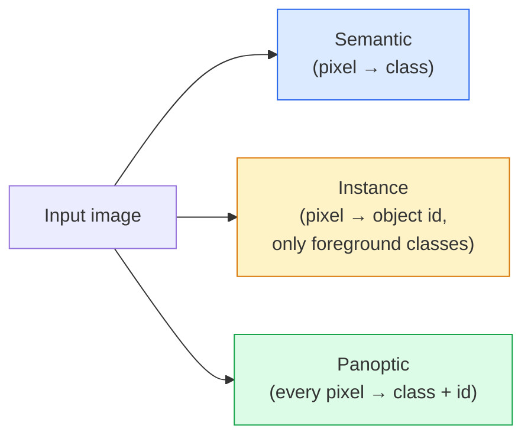
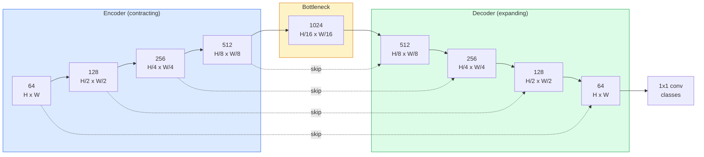

# 语义分割 — U-Net

> 分割是像素级别的分类。U-Net通过将下采样编码器与上采样解码器配对，并在它们之间建立跳跃连接，使其得以实现。

**类型：** 构建
**语言：** Python
**前置课程：** 第4阶段第3课 (卷积神经网络), 第4阶段第4课 (图像分类)
**时间：** 约75分钟

## 学习目标

- 区分语义分割、实例分割和全景分割，并为给定问题选择正确的任务
- 使用PyTorch从头构建一个U-Net，包含编码器模块、瓶颈层、带转置卷积的解码器和跳跃连接
- 实现像素级交叉熵损失、Dice损失以及当前医学和工业分割中默认使用的组合损失
- 理解每个类别的IoU和Dice指标，并诊断低分是由小物体召回率、边界精度还是类别不平衡导致的

## 问题描述

分类每张图像输出一个标签。检测每张图像输出少量边界框。分割每张图像每个像素输出一个标签。对于尺寸为`H x W`的输入，输出是形状为`H x W`（语义）或`H x W x N_instances`（实例）的张量。这意味着每张图像有数百万次预测，而非一次。

分割的结构是它驱动几乎所有密集预测视觉产品的原因：医学成像（肿瘤掩码）、自动驾驶（道路、车道、障碍物）、卫星图像（建筑足迹、作物边界）、文档解析（版面区域）、机器人技术（可抓取区域）。这些任务都无法通过给物体画一个框来解决；它们需要精确的轮廓。

架构问题表述简单但解决不易：你需要网络同时看到图像的全局上下文（这是什么场景）和局部像素细节（哪个像素是道路，哪个是人行道）。标准CNN通过压缩空间来获取上下文，这会丢弃细节。U-Net的设计两者兼顾。

## 核心概念

### 语义 vs 实例 vs 全景分割



- **语义分割** 说：“这个像素是道路，那个像素是汽车。”相邻的两辆汽车会融合成一个整体。
- **实例分割** 说：“这个像素是汽车 #3，那个像素是汽车 #5。”忽略背景物体（“stuff” = 天空、道路、草地）。
- **全景分割** 统一两者：每个像素获得一个类别标签，每个实例获得一个唯一ID，背景和物体都被分割。

本课涵盖语义分割。下一课（Mask R-CNN）涵盖实例分割。

### U-Net 的形状



编码器将空间分辨率减半四次，通道数加倍。解码器反向操作：将空间分辨率加倍四次，通道数减半。跳跃连接在每个分辨率级别将匹配的编码器特征与解码器特征进行拼接。最后的1x1卷积在全分辨率下将`64 -> num_classes`映射输出。

为什么需要跳跃连接：当解码器尝试输出像素级预测时，它只见过较小的特征图。如果没有跳跃连接，它无法准确定位边界，因为这些信息在编码器中已被压缩掉。跳跃连接将编码器在下采样过程中计算出的高分辨率特征图传递给解码器。

### 转置卷积 vs 双线性上采样

解码器需要扩大空间维度。有两种选择：

- **转置卷积** (`nn.ConvTranspose2d`) — 可学习的上采样。历史U-Net的默认选择。如果步长和核大小不能整除，可能会产生棋盘格伪影。
- **双线性上采样 + 3x3卷积** — 平滑上采样后接一个卷积。伪影更少，参数更少，现在是现代默认选择。

两者在实践中都存在。对于第一个U-Net，双线性上采样更安全。

### 像素网格上的交叉熵

对于有C个类别的语义分割，模型输出为`(N, C, H, W)`。目标为`(N, H, W)`，包含整数类别ID。交叉熵与分类情况完全相同，只是应用于每个空间位置：

```
Loss = mean over (n, h, w) of -log( softmax(logits[n, :, h, w])[target[n, h, w]] )
```

PyTorch中的`F.cross_entropy`原生支持此形状，无需重塑。

### Dice损失及其必要性

交叉熵将每个像素平等对待。当某一类别占据图像主导地位时（例如医学影像：99%背景，1%肿瘤），这是不正确的。网络通过预测所有位置都是背景就能获得99%的准确率，但仍然毫无用处。

Dice损失通过直接优化预测掩码与真实掩码之间的重叠来解决此问题：

```
Dice(p, y) = 2 * sum(p * y) / (sum(p) + sum(y) + epsilon)
Dice_loss = 1 - Dice
```

其中，`p`是某个类别的sigmoid/softmax概率图，`y`是二值的真实掩码。仅当重叠完美时，损失才为零。因为它是基于比率的，所以类别不平衡无关紧要。

实际中，使用**组合损失**：

```
L = L_cross_entropy + lambda * L_dice       (lambda ~ 1)
```

交叉熵在训练早期提供稳定的梯度；Dice损失则在训练后期专注于实际匹配掩码形状。这种组合是医学影像的默认选择，在任何类别不平衡的数据集上都难以被超越。

### 评估指标

- **像素准确率** — 正确预测的像素百分比。计算简单。在不平衡数据上会失效，原因与分类中的准确率相同。
- **每类IoU** — 每个类别掩码的交并比；各类别的平均值称为mIoU。
- **Dice (像素级F1)** — 与IoU类似；`Dice = 2 * IoU / (1 + IoU)`。医学影像偏好Dice，自动驾驶社区偏好IoU；两者单调相关。
- **边界F1** — 测量预测边界与真实边界的接近程度，即使微小偏移也会受到惩罚。对于半导体检测等高精度任务很重要。

报告每类IoU，而不仅仅是mIoU。当九个类别达到85%而有一个类别只有15%时，平均IoU会掩盖这个低分类别。

### 输入分辨率权衡

U-Net的编码器将分辨率减半四次，因此输入必须能被16整除。医学图像通常是512x512或1024x1024。自动驾驶图像裁剪为2048x1024。U-Net的内存成本与`H * W * C_max`成正比，在1024x1024输入、1024瓶颈通道的情况下，前向传播已需要数GB显存。

两种标准解决方法：
1. **分块处理输入** — 处理带有重叠的256x256图块并进行拼接。
2. **用空洞卷积替换瓶颈层** — 保持较高的空间分辨率同时扩大感受野（DeepLab系列）。

对于第一个模型，使用64通道基础U-Net处理256x256输入，可以在8GB显存上轻松训练。

## 动手构建

### 步骤1：编码器模块

两个带有批归一化和ReLU的3x3卷积层。第一个卷积改变通道数；第二个卷积保持通道数不变。

```python
import torch
import torch.nn as nn
import torch.nn.functional as F

class DoubleConv(nn.Module):
    def __init__(self, in_c, out_c):
        super().__init__()
        self.net = nn.Sequential(
            nn.Conv2d(in_c, out_c, kernel_size=3, padding=1, bias=False),
            nn.BatchNorm2d(out_c),
            nn.ReLU(inplace=True),
            nn.Conv2d(out_c, out_c, kernel_size=3, padding=1, bias=False),
            nn.BatchNorm2d(out_c),
            nn.ReLU(inplace=True),
        )

    def forward(self, x):
        return self.net(x)
```

此模块被重复使用。`bias=False`因为BN的beta参数处理了偏置。

### 步骤2：下采样和上采样模块

```python
class Down(nn.Module):
    def __init__(self, in_c, out_c):
        super().__init__()
        self.net = nn.Sequential(
            nn.MaxPool2d(2),
            DoubleConv(in_c, out_c),
        )

    def forward(self, x):
        return self.net(x)


class Up(nn.Module):
    def __init__(self, in_c, out_c):
        super().__init__()
        self.up = nn.Upsample(scale_factor=2, mode="bilinear", align_corners=False)
        self.conv = DoubleConv(in_c, out_c)

    def forward(self, x, skip):
        x = self.up(x)
        if x.shape[-2:] != skip.shape[-2:]:
            x = F.interpolate(x, size=skip.shape[-2:], mode="bilinear", align_corners=False)
        x = torch.cat([skip, x], dim=1)
        return self.conv(x)
```

仅检查空间维度的形状（`shape[-2:]`）处理了输入维度不能被16整除的情况；安全的`F.interpolate`在拼接前对齐张量。比较完整形状也会在通道数不匹配时触发错误，这应该是一个明确的错误，而不是静默的插值。

### 步骤3：构建U-Net

```python
class UNet(nn.Module):
    def __init__(self, in_channels=3, num_classes=2, base=64):
        super().__init__()
        self.inc = DoubleConv(in_channels, base)
        self.d1 = Down(base, base * 2)
        self.d2 = Down(base * 2, base * 4)
        self.d3 = Down(base * 4, base * 8)
        self.d4 = Down(base * 8, base * 16)
        self.u1 = Up(base * 16 + base * 8, base * 8)
        self.u2 = Up(base * 8 + base * 4, base * 4)
        self.u3 = Up(base * 4 + base * 2, base * 2)
        self.u4 = Up(base * 2 + base, base)
        self.outc = nn.Conv2d(base, num_classes, kernel_size=1)

    def forward(self, x):
        x1 = self.inc(x)
        x2 = self.d1(x1)
        x3 = self.d2(x2)
        x4 = self.d3(x3)
        x5 = self.d4(x4)
        x = self.u1(x5, x4)
        x = self.u2(x, x3)
        x = self.u3(x, x2)
        x = self.u4(x, x1)
        return self.outc(x)

net = UNet(in_channels=3, num_classes=2, base=32)
x = torch.randn(1, 3, 256, 256)
print(f"output: {net(x).shape}")
print(f"params: {sum(p.numel() for p in net.parameters()):,}")
```

输出形状为`(1, 2, 256, 256)` — 空间尺寸与输入相同，通道数为`num_classes`。在`base=32`配置下约有770万参数。

### 步骤4：损失函数

```python
def dice_loss(logits, targets, num_classes, eps=1e-6):
    probs = F.softmax(logits, dim=1)
    targets_one_hot = F.one_hot(targets, num_classes).permute(0, 3, 1, 2).float()
    dims = (0, 2, 3)
    intersection = (probs * targets_one_hot).sum(dim=dims)
    denom = probs.sum(dim=dims) + targets_one_hot.sum(dim=dims)
    dice = (2 * intersection + eps) / (denom + eps)
    return 1 - dice.mean()


def combined_loss(logits, targets, num_classes, lam=1.0):
    ce = F.cross_entropy(logits, targets)
    dc = dice_loss(logits, targets, num_classes)
    return ce + lam * dc, {"ce": ce.item(), "dice": dc.item()}
```

Dice损失按类别计算后取平均（宏平均Dice）。`eps`防止在批次中缺失的类别上出现除以零的情况。

### 步骤5：IoU指标

```python
@torch.no_grad()
def iou_per_class(logits, targets, num_classes):
    preds = logits.argmax(dim=1)
    ious = torch.zeros(num_classes)
    for c in range(num_classes):
        pred_c = (preds == c)
        true_c = (targets == c)
        inter = (pred_c & true_c).sum().float()
        union = (pred_c | true_c).sum().float()
        ious[c] = (inter / union) if union > 0 else torch.tensor(float("nan"))
    return ious
```

返回长度为C的向量。`nan`标记批次中缺失的类别 — 在计算mIoU时不要对这些类别取平均。

### 步骤6：用于端到端验证的合成数据集

在彩色背景上生成形状，迫使网络学习形状而非像素颜色。

```python
import numpy as np
from torch.utils.data import Dataset, DataLoader

def synthetic_segmentation(num_samples=200, size=64, seed=0):
    rng = np.random.default_rng(seed)
    images = np.zeros((num_samples, size, size, 3), dtype=np.float32)
    masks = np.zeros((num_samples, size, size), dtype=np.int64)
    for i in range(num_samples):
        bg = rng.uniform(0, 1, (3,))
        images[i] = bg
        masks[i] = 0
        num_shapes = rng.integers(1, 4)
        for _ in range(num_shapes):
            cls = int(rng.integers(1, 3))
            color = rng.uniform(0, 1, (3,))
            cx, cy = rng.integers(10, size - 10, size=2)
            r = int(rng.integers(4, 12))
            yy, xx = np.meshgrid(np.arange(size), np.arange(size), indexing="ij")
            if cls == 1:
                mask = (xx - cx) ** 2 + (yy - cy) ** 2 < r ** 2
            else:
                mask = (np.abs(xx - cx) < r) & (np.abs(yy - cy) < r)
            images[i][mask] = color
            masks[i][mask] = cls
        images[i] += rng.normal(0, 0.02, images[i].shape)
        images[i] = np.clip(images[i], 0, 1)
    return images, masks


class SegDataset(Dataset):
    def __init__(self, images, masks):
        self.images = images
        self.masks = masks

    def __len__(self):
        return len(self.images)

    def __getitem__(self, i):
        img = torch.from_numpy(self.images[i]).permute(2, 0, 1).float()
        mask = torch.from_numpy(self.masks[i]).long()
        return img, mask
```

三个类别：背景(0)、圆形(1)、方形(2)。网络必须学会区分形状。

### 步骤7：训练循环

```python
def train_one_epoch(model, loader, optimizer, device, num_classes):
    model.train()
    loss_sum, total = 0.0, 0
    iou_sum = torch.zeros(num_classes)
    for x, y in loader:
        x, y = x.to(device), y.to(device)
        logits = model(x)
        loss, _ = combined_loss(logits, y, num_classes)
        optimizer.zero_grad()
        loss.backward()
        optimizer.step()
        loss_sum += loss.item() * x.size(0)
        total += x.size(0)
        iou_sum += iou_per_class(logits, y, num_classes).nan_to_num(0)
    return loss_sum / total, iou_sum / len(loader)
```

在合成数据集上运行此代码10-30个epoch，观察形状类别的mIoU上升超过0.9。注意`nan_to_num(0)`将批次中缺失的类别视为零；为了获得准确的每类IoU，在评估时应根据类别存在性进行掩码，并跨批次使用`torch.nanmean`，而不是在这里取平均。

## 实际应用

对于生产环境，`segmentation_models_pytorch` ("smp")封装了每一种标准分割架构，可与任何torchvision或timm主干网络配合。只需三行代码：

```python
import segmentation_models_pytorch as smp

model = smp.Unet(
    encoder_name="resnet34",
    encoder_weights="imagenet",
    in_channels=3,
    classes=3,
)
```

实际工作中也值得了解：
- **DeepLabV3+** 用空洞卷积替代基于最大池化的下采样，使瓶颈层保持分辨率；在卫星和驾驶数据上能更快得到边界。
- **SegFormer** 将卷积编码器替换为分层Transformer；目前在多项基准测试中处于SOTA水平。
- **Mask2Former** / **OneFormer** 在单一架构中统一了语义、实例和全景分割。

这三者都可以在`smp`或`transformers`中作为即插即用的替代方案，使用相同的数据加载器。

## 成果产出

本课将产出：

- `outputs/prompt-segmentation-task-picker.md` — 一个提示词，能在语义、实例和全景分割之间选择，并为给定任务命名架构。
- `outputs/skill-segmentation-mask-inspector.md` — 一项技能，报告类别分布、预测掩码统计信息以及被低估或边界模糊的类别。

## 练习题

1. **(简单)** 为二元分割任务（前景 vs 背景）实现`bce_dice_loss`。在一个前景占5%像素的合成二元数据集上验证，组合损失是否比单独的BCE收敛更快。
2. **(中等)** 将`nn.Upsample + conv`上采样模块替换为`nn.ConvTranspose2d`上采样模块。在合成数据集上训练两者并比较mIoU。观察转置卷积版本中出现的棋盘格伪影。
3. **(困难)** 选取一个真实的分割数据集（Oxford-IIIT Pets、Cityscapes mini split或医学子集），训练U-Net使其IoU达到`smp.Unet`参考值的2个点以内。报告每类IoU，并识别哪些类别从向损失函数添加Dice中受益最大。

## 关键术语

| 术语 | 常见说法 | 实际含义 |
|------|----------|----------|
| 语义分割 | "给每个像素打标签" | 将每个像素分类到C个类别；同一类别的实例合并 |
| 实例分割 | "给每个物体打标签" | 区分同一类别的不同实例；仅针对前景物体 |
| 全景分割 | "语义分割 + 实例分割" | 每个像素获得类别标签；每个物体实例还获得一个唯一ID |
| 跳跃连接 | "U-Net桥接" | 将编码器特征拼接到匹配分辨率的解码器特征中；保留高频细节 |
| 转置卷积 | "反卷积" | 可学习的上采样；可能产生棋盘格伪影 |
| Dice损失 | "重叠损失" | 1 - 2|A ∩ B| / (|A| + |B|)；直接优化掩码重叠度，对类别不平衡鲁棒 |
| mIoU | "平均交并比" | 各类IoU的平均值；分割任务的社区标准指标 |
| 边界F1 | "边界精度" | 仅在边界像素上计算的F1分数；对精度要求高的任务很重要 |

## 延伸阅读

- [U-Net: Convolutional Networks for Biomedical Image Segmentation (Ronneberger et al., 2015)](https://arxiv.org/abs/1505.04597) — 原始论文；大家常引用的图在第2页
- [Fully Convolutional Networks (Long et al., 2015)](https://arxiv.org/abs/1411.4038) — 首次将分割转化为端到端卷积问题的论文
- [segmentation_models_pytorch](https://github.com/qubvel/segmentation_models.pytorch) — 生产级分割的参考实现；包含所有标准架构和所有标准损失函数
- [Lessons learned from training SOTA segmentation (kaggle.com competitions)](https://www.kaggle.com/code/iafoss/carvana-unet-pytorch) — 讲解为什么在真实数据上测试时数据增强、伪标签和类别权重很重要的实战指南