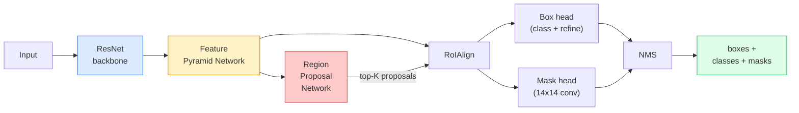

# 实例分割 — Mask R-CNN

> 给一个 Faster R-CNN 检测器添加一个小的掩码分支，你就得到了实例分割。难点在于 RoIAlign，而且它比看起来要难。

**类型：** 构建 + 学习
**语言：** Python
**先修课程：** 第四阶段 第六课 (YOLO)，第四阶段 第七课 (U-Net)
**时间：** 约 75 分钟

## 学习目标

- 端到端追踪 Mask R-CNN 的架构：骨干网络、FPN、RPN、RoIAlign、框头、掩码头
- 从零实现 RoIAlign 并解释为什么不再使用 RoIPool
- 使用 torchvision `maskrcnn_resnet50_fpn_v2` 预训练模型生成生产质量的实例掩码，并正确读取其输出格式
- 通过替换框头和掩码头并冻结骨干网络，在小型自定义数据集上微调 Mask R-CNN

## 问题所在

语义分割为每个类别提供一个掩码。实例分割为每个对象提供一个掩码，即使两个对象属于同一个类别。个体计数、跨帧跟踪以及测量物体（如墙上每块砖的边界框、显微镜图像中每个细胞的边界框）都需要实例分割。

Mask R-CNN (He 等, 2017) 通过将实例分割重构为检测加掩码解决了这个问题。其设计非常简洁，以至于在接下来的五年里，几乎每篇实例分割论文都是 Mask R-CNN 的变体，而 torchvision 的实现至今仍是中小型数据集生产的默认选择。

棘手的工程问题是采样：如何从一个边界与像素不对齐的建议框中裁剪出固定大小的特征区域？这个问题处理不好，会让 mAP 损失零点几个百分点。RoIAlign 就是答案。

## 概念

### 架构



需要理解的五个部分：

1.  **骨干网络** — 在 ImageNet 上训练的 ResNet-50 或 ResNet-101。产生步长为 4, 8, 16, 32 的多级特征图。
2.  **FPN (特征金字塔网络)** — 自上而下 + 横向连接，为每一级提供 C 通道的语义丰富特征。检测时，查询与目标大小匹配的 FPN 层级。
3.  **RPN (区域建议网络)** — 一个小型卷积头，在每个锚点位置预测“这里是否有物体？”以及“如何优化边界框？”。为每张图像生成约 1000 个建议框。
4.  **RoIAlign** — 从任何 FPN 层级上的任何框中采样一个固定大小（例如 7x7）的特征块。使用双线性插值，无量化。
5.  **头** — 两层框头，用于优化边界框并选择类别；加上一个小型卷积头，为每个建议框输出一个 `28x28` 二进制掩码。

### 为什么是 RoIAlign，而不是 RoIPool

最初的 Fast R-CNN 使用 RoIPool，它将建议框划分为一个网格，在每个单元格中取最大特征值，并将所有坐标四舍五入为整数。这种四舍五入会使特征图与输入像素坐标错位最多一个特征图像素——在 224x224 的图像上影响很小，但当特征图步长为 32 时则是灾难性的。

```
RoIPool:
  box (34.7, 51.3, 98.2, 142.9)
  round -> (34, 51, 98, 142)
  split grid -> round each cell boundary
  misalignment accumulates at every step

RoIAlign:
  box (34.7, 51.3, 98.2, 142.9)
  sample at exact float coordinates using bilinear interpolation
  no rounding anywhere
```

RoIAlign 在 COCO 上免费提升了 3-4 个百分点的掩码 AP。现在，每一个注重定位的检测器都使用它——无论是 YOLOv7 seg、RT-DETR 还是 Mask2Former。

### 一文读懂 RPN

在特征图的每个位置，放置 K 个不同大小和形状的锚框。为每个锚框预测一个物体性得分和一个回归偏移量，以将锚框转变为更贴合的框。按得分保留前约 1,000 个框，在 IoU 0.7 下应用 NMS，然后将幸存者交给头部。RPN 用自己的小损失函数训练——结构与第六课的 YOLO 损失相同，只是有两个类别（物体 / 非物体）。

### 掩码头

对于每个建议框（经过 RoIAlign 后），掩码头是一个小型 FCN：四个 3x3 卷积，一个 2 倍反卷积，一个最终的 1x1 卷积，在 `28x28` 分辨率下产生 `num_classes` 个输出通道。仅保留与预测类别对应的通道；忽略其他通道。这使得掩码预测与分类解耦。

将 28x28 的掩码上采样到建议框的原始像素大小，生成最终的二进制掩码。

### 损失函数

Mask R-CNN 有四个损失函数相加：

```
L = L_rpn_cls + L_rpn_box + L_box_cls + L_box_reg + L_mask
```

-   `L_rpn_cls`, `L_rpn_box` — 用于 RPN 建议框的物体性 + 框回归。
-   `L_box_cls` — 头部分类器上对 (C+1) 个类别（包括背景）的交叉熵。
-   `L_box_reg` — 头部框优化上的平滑 L1 损失。
-   `L_mask` — 28x28 掩码输出上的逐像素二元交叉熵。

每个损失都有自己的默认权重；torchvision 的实现将它们作为构造函数参数暴露出来。

### 输出格式

`torchvision.models.detection.maskrcnn_resnet50_fpn_v2` 返回一个字典列表，每个字典对应一张图像：

```
{
    "boxes":  (N, 4) in (x1, y1, x2, y2) pixel coordinates,
    "labels": (N,) class IDs, 0 = background so indices are 1-based,
    "scores": (N,) confidence scores,
    "masks":  (N, 1, H, W) float masks in [0, 1] — threshold at 0.5 for binary,
}
```

掩码已经是完整图像分辨率了。28x28 的头部输出已在内部被上采样。

## 构建它

### 第一步：从零实现 RoIAlign

这是 Mask R-CNN 中用代码比用文字更容易理解的一个组件。

```python
import torch
import torch.nn.functional as F

def roi_align_single(feature, box, output_size=7, spatial_scale=1 / 16.0):
    """
    feature: (C, H, W) single-image feature map
    box: (x1, y1, x2, y2) in original image pixel coordinates
    output_size: side of the output grid (7 for box head, 14 for mask head)
    spatial_scale: reciprocal of the feature map stride
    """
    C, H, W = feature.shape
    x1, y1, x2, y2 = [c * spatial_scale - 0.5 for c in box]
    bin_w = (x2 - x1) / output_size
    bin_h = (y2 - y1) / output_size

    grid_y = torch.linspace(y1 + bin_h / 2, y2 - bin_h / 2, output_size)
    grid_x = torch.linspace(x1 + bin_w / 2, x2 - bin_w / 2, output_size)
    yy, xx = torch.meshgrid(grid_y, grid_x, indexing="ij")

    gx = 2 * (xx + 0.5) / W - 1
    gy = 2 * (yy + 0.5) / H - 1
    grid = torch.stack([gx, gy], dim=-1).unsqueeze(0)
    sampled = F.grid_sample(feature.unsqueeze(0), grid, mode="bilinear",
                            align_corners=False)
    return sampled.squeeze(0)
```

每个数值都位于双线性插值的位置。无四舍五入，无量化，无梯度丢失。

### 第二步：与 torchvision 的 RoIAlign 对比

```python
from torchvision.ops import roi_align

feature = torch.randn(1, 16, 50, 50)
boxes = torch.tensor([[0, 10, 20, 100, 90]], dtype=torch.float32)  # (batch_idx, x1, y1, x2, y2)

ours = roi_align_single(feature[0], boxes[0, 1:].tolist(), output_size=7, spatial_scale=1/4)
theirs = roi_align(feature, boxes, output_size=(7, 7), spatial_scale=1/4, sampling_ratio=1, aligned=True)[0]

print(f"shape ours:   {tuple(ours.shape)}")
print(f"shape theirs: {tuple(theirs.shape)}")
print(f"max|diff|:    {(ours - theirs).abs().max().item():.3e}")
```

在 `sampling_ratio=1` 和 `aligned=True` 下，两者匹配度在 `1e-5` 以内。

### 第三步：加载预训练的 Mask R-CNN

```python
import torch
from torchvision.models.detection import maskrcnn_resnet50_fpn_v2, MaskRCNN_ResNet50_FPN_V2_Weights

model = maskrcnn_resnet50_fpn_v2(weights=MaskRCNN_ResNet50_FPN_V2_Weights.DEFAULT)
model.eval()
print(f"params: {sum(p.numel() for p in model.parameters()):,}")
print(f"classes (including background): {len(model.roi_heads.box_predictor.cls_score.out_features * [0])}")
```

4600 万参数，91 个类别（COCO）。第一个类别（id 0）是背景；模型实际检测的所有物体类别从 id 1 开始。

### 第四步：运行推理

```python
with torch.no_grad():
    x = torch.randn(3, 400, 600)
    predictions = model([x])
p = predictions[0]
print(f"boxes:  {tuple(p['boxes'].shape)}")
print(f"labels: {tuple(p['labels'].shape)}")
print(f"scores: {tuple(p['scores'].shape)}")
print(f"masks:  {tuple(p['masks'].shape)}")
```

掩码张量的形状为 `(N, 1, H, W)`。以 0.5 为阈值，得到每个物体的二进制掩码：

```python
binary_masks = (p['masks'] > 0.5).squeeze(1)  # (N, H, W) boolean
```

### 第五步：为自定义类别数更换头部

常见的微调配方：复用骨干网络、FPN 和 RPN；替换两个分类头。

```python
from torchvision.models.detection.faster_rcnn import FastRCNNPredictor
from torchvision.models.detection.mask_rcnn import MaskRCNNPredictor

def build_custom_maskrcnn(num_classes):
    model = maskrcnn_resnet50_fpn_v2(weights=MaskRCNN_ResNet50_FPN_V2_Weights.DEFAULT)
    in_features = model.roi_heads.box_predictor.cls_score.in_features
    model.roi_heads.box_predictor = FastRCNNPredictor(in_features, num_classes)
    in_features_mask = model.roi_heads.mask_predictor.conv5_mask.in_channels
    hidden_layer = 256
    model.roi_heads.mask_predictor = MaskRCNNPredictor(in_features_mask, hidden_layer, num_classes)
    return model

custom = build_custom_maskrcnn(num_classes=5)
print(f"custom cls_score.out_features: {custom.roi_heads.box_predictor.cls_score.out_features}")
```

`num_classes` 必须包含背景类别，所以有 4 个物体类别的数据集使用 `num_classes=5`。

### 第六步：冻结不需要训练的部分

在小型数据集上，冻结骨干网络和 FPN。只有 RPN 的物体性 + 回归和两个头部参与学习。

```python
def freeze_backbone_and_fpn(model):
    # torchvision Mask R-CNN packs the FPN inside `model.backbone` (as
    # `model.backbone.fpn`), so iterating `model.backbone.parameters()` covers
    # both the ResNet feature layers and the FPN lateral/output convs.
    for p in model.backbone.parameters():
        p.requires_grad = False
    return model

custom = freeze_backbone_and_fpn(custom)
trainable = sum(p.numel() for p in custom.parameters() if p.requires_grad)
print(f"trainable after freeze: {trainable:,}")
```

在 500 张图像的数据集上，这决定了是能收敛还是会过拟合。

## 使用它

torchvision 中 Mask R-CNN 的完整训练循环仅需 40 行代码，并且在任务之间没有显著变化——更换数据集即可开始。

```python
def train_step(model, images, targets, optimizer):
    model.train()
    loss_dict = model(images, targets)
    losses = sum(loss for loss in loss_dict.values())
    optimizer.zero_grad()
    losses.backward()
    optimizer.step()
    return {k: v.item() for k, v in loss_dict.items()}
```

`targets` 列表必须包含每个图像的字典，字典需有 `boxes`、`labels` 和 `masks`（作为 `(num_instances, H, W)` 二进制张量）。模型在训练时返回一个包含四个损失的字典，在评估时返回一个预测列表，以 `model.training` 为键。

`pycocotools` 评估器为框和掩码都生成 mAP@IoU=0.5:0.95；你需要这两个数字来知道是框头还是掩码头是瓶颈。

## 部署它

本课产出：

-   `outputs/prompt-instance-vs-semantic-router.md` — 一个提示，询问三个问题，并在实例、语义或全景分割以及要使用的确切模型之间做出选择。
-   `outputs/skill-mask-rcnn-head-swapper.md` — 一个技能，给定新的 `num_classes`，可生成在任何 torchvision 检测模型上更换头部的 10 行代码。

## 练习

1.  **(简单)** 用 100 个随机框验证你的 RoIAlign 与 `torchvision.ops.roi_align` 的结果。报告最大绝对误差。同时运行 RoIPool（2017 年前的行为），并展示其在靠近边界的框上会有约 1-2 个特征图像素的偏差。
2.  **(中等)** 在一个 50 张图像的自定义数据集上微调 `maskrcnn_resnet50_fpn_v2`（任意两类：气球、鱼、坑洞、标识）。冻结骨干网络，训练 20 个轮次，报告 mask AP@0.5。
3.  **(困难)** 将 Mask R-CNN 的掩码头替换为预测 56x56 而非 28x28 的掩码头。测量前后 mAP@IoU=0.75 的变化。解释其提升（或缺乏提升）是否与预期的边界精度/内存权衡相符。

## 关键术语

| 术语 | 人们怎么说 | 实际含义 |
|------|------------|----------|
| Mask R-CNN | "检测加掩码" | Faster R-CNN + 一个小型 FCN 头部，为每个建议框、每个类别预测一个 28x28 掩码 |
| FPN | "特征金字塔" | 自上而下 + 横向连接，为每个步长层级提供 C 通道的语义丰富特征 |
| RPN | "区域建议器" | 一个小型卷积头，为每张图像生成约 1000 个物体/非物体建议框 |
| RoIAlign | "无裁剪四舍五入" | 从任何浮点坐标的框中双线性采样一个固定大小的特征网格 |
| RoIPool | "2017年前的裁剪" | 与 RoIAlign 目的相同，但对框坐标四舍五入；已过时 |
| Mask AP | "实例 mAP" | 使用掩码 IoU 而非框 IoU 计算的平均精度；COCO 的实例分割度量 |
| 二进制掩码头 | "按类别掩码" | 为每个建议框、每个类别预测一个二进制掩码；仅保留预测类别的通道 |
| 背景类别 | "类别 0" | 兜底的“无物体”类别；真实类别的索引从 1 开始 |

## 扩展阅读

-   [Mask R-CNN (He 等, 2017)](https://arxiv.org/abs/1703.06870) — 原论文；第 3 节关于 RoIAlign 的内容是关键阅读材料
-   [FPN: Feature Pyramid Networks (Lin 等, 2017)](https://arxiv.org/abs/1612.03144) — FPN 论文；每个现代检测器都使用它
-   [torchvision Mask R-CNN 教程](https://pytorch.org/tutorials/intermediate/torchvision_tutorial.html) — 微调循环的参考
-   [Detectron2 模型库](https://github.com/facebookresearch/detectron2/blob/main/MODEL_ZOO.md) — 几乎涵盖所有检测和分割变体的生产实现及训练权重