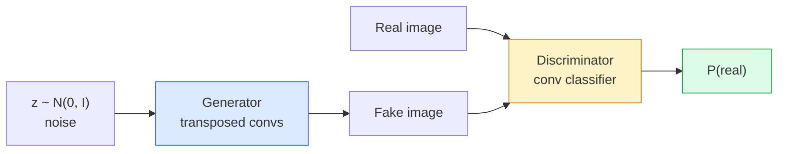
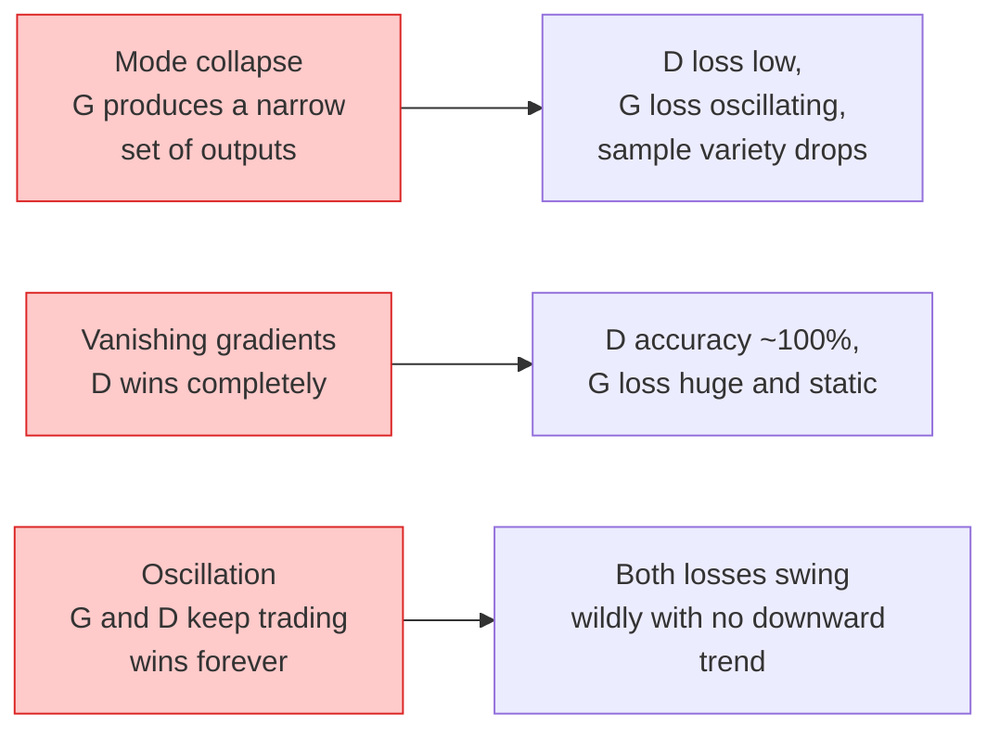

# 图像生成 — GANs

> GAN是两个神经网络在一个固定博弈中的对抗。一个负责绘制，一个负责评判。它们共同进步，直到绘制者的作品能骗过评判者。

**类型：** 实践构建
**语言：** Python
**先决知识：** 第4阶段第3课（CNNs），第3阶段第6课（优化器），第3阶段第7课（正则化）
**时间：** ~75分钟

## 学习目标

- 解释生成器与鉴别器之间的极小极大博弈，以及为什么平衡点对应于 p_model = p_data
- 在PyTorch中实现一个DCGAN，并用不到60行代码使其生成连贯的32x32合成图像
- 使用三个标准技巧稳定GAN训练：非饱和损失、谱归一化、TTUR（双时间尺度更新规则）
- 能够阅读训练曲线，区分健康收敛、模式崩溃、振荡和鉴别器完全获胜的情况

## 问题

分类任务教会网络将图像映射到标签。生成则逆转了这个问题：采样看起来来自同一分布的新图像。没有可以与之比较的“正确”输出；只有一个你想要模仿的分布。

标准的损失函数（MSE、交叉熵）无法衡量“这个样本是否来自真实分布”。最小化逐像素误差产生的是模糊的平均值，而不是逼真的样本。突破在于学习损失函数：训练第二个网络来区分真假，并用它的判断来推动生成器。

GANs（Goodfellow等人，2014）定义了这个框架。到2018年，StyleGAN已经能生成1024x1024、与照片无法区分的人脸。扩散模型此后在质量和可控性上占据了王座，但使扩散模型实用的每一个技巧——归一化选择、潜空间、特征损失——最初都是在GANs上被理解的。

## 概念

### 两个网络



**生成器** G 接收一个噪声向量 `z` 并输出一张图像。**鉴别器** D 接收一张图像并输出一个标量：该图像为真的概率。

### 博弈

G 想让 D 犯错。D 想要保持正确。形式化表示为：

```
min_G max_D  E_x[log D(x)] + E_z[log(1 - D(G(z)))]
```

从右向左解读：D 最大化其对真实 (`log D(real)`) 和伪造 (`log (1 - D(fake))`) 图像的判别准确率。G 最小化 D 对伪造品的判别准确率——它希望 `D(G(z))` 的值高。

Goodfellow 证明了这个极小极大博弈存在一个全局平衡点，此时 `p_G = p_data`，D 在任何地方都输出 0.5，并且生成分布与真实分布之间的詹森-香农散度为零。难点在于达到这个平衡点。

### 非饱和损失

上述形式在数值上是不稳定的。在训练初期，`D(G(z))` 对每个伪造样本都接近零，因此 `log(1 - D(G(z)))` 关于 G 的梯度会消失。解决方法是：翻转 G 的损失。

```
L_D = -E_x[log D(x)] - E_z[log(1 - D(G(z)))]
L_G = -E_z[log D(G(z))]                          # non-saturating
```

现在，当 `D(G(z))` 接近零时，G 的损失很大，其梯度具有信息量。每个现代 GAN 都使用这种变体进行训练。

### DCGAN 架构规则

Radford, Metz, Chintala (2015) 将多年失败的实验提炼成五条规则，使 GAN 训练稳定：

1. 用步进卷积替代池化（两个网络都如此）。
2. 在生成器和鉴别器中都使用批归一化，但 G 的输出层和 D 的输入层除外。
3. 在更深的架构中移除全连接层。
4. G 在所有层使用 ReLU，输出层除外（输出层使用 tanh 以限制在 [-1, 1]）。
5. D 在所有层使用 LeakyReLU (negative_slope=0.2)。

每个现代的基于卷积的 GAN（StyleGAN, BigGAN, GigaGAN）仍然从这些规则出发，并逐个替换部件。

### 失败模式及其特征



- **模式崩溃**：G 找到一张能骗过 D 的图像，并只生成那一张。解决方法：添加小批量判别、谱归一化或标签条件化。
- **鉴别器获胜**：D 变得过强过快，G 的梯度消失。解决方法：使用更小的 D、降低 D 的学习率，或对真实标签应用标签平滑。
- **振荡**：两个网络轮流获胜，但从不接近平衡点。解决方法：TTUR（D 的学习率比 G 快 2-4 倍），或切换到 Wasserstein 损失。

### 评估

GAN 没有真实标签，那么你怎么知道它们工作正常呢？

- **样本检查** — 在每个 epoch 结束时查看 64 个样本。这是必须的。
- **FID（Fréchet Inception Distance）** — 真实集和生成集的 Inception-v3 特征分布之间的距离。越低越好。社区标准。
- **Inception Score** — 更旧，更脆弱；优先选择 FID。
- **生成模型的精确率/召回率** — 分别衡量质量（精确率）和覆盖度（召回率）。比单独使用 FID 提供更多信息。

对于小规模的合成数据运行，样本检查就足够了。

## 动手构建

### 步骤 1：生成器

一个小型 DCGAN 生成器，接收 64 维噪声并生成 32x32 图像。

```python
import torch
import torch.nn as nn

class Generator(nn.Module):
    def __init__(self, z_dim=64, img_channels=3, feat=64):
        super().__init__()
        self.net = nn.Sequential(
            nn.ConvTranspose2d(z_dim, feat * 4, kernel_size=4, stride=1, padding=0, bias=False),
            nn.BatchNorm2d(feat * 4),
            nn.ReLU(inplace=True),
            nn.ConvTranspose2d(feat * 4, feat * 2, kernel_size=4, stride=2, padding=1, bias=False),
            nn.BatchNorm2d(feat * 2),
            nn.ReLU(inplace=True),
            nn.ConvTranspose2d(feat * 2, feat, kernel_size=4, stride=2, padding=1, bias=False),
            nn.BatchNorm2d(feat),
            nn.ReLU(inplace=True),
            nn.ConvTranspose2d(feat, img_channels, kernel_size=4, stride=2, padding=1, bias=False),
            nn.Tanh(),
        )

    def forward(self, z):
        return self.net(z.view(z.size(0), -1, 1, 1))
```

四个转置卷积，每个都带有 `kernel_size=4, stride=2, padding=1`，因此它们能清晰地将空间尺寸翻倍。通过 tanh 将输出激活限制在 [-1, 1]。

### 步骤 2：鉴别器

与生成器对称。使用 LeakyReLU，步进卷积，以标量 logit 结尾。

```python
class Discriminator(nn.Module):
    def __init__(self, img_channels=3, feat=64):
        super().__init__()
        self.net = nn.Sequential(
            nn.Conv2d(img_channels, feat, kernel_size=4, stride=2, padding=1),
            nn.LeakyReLU(0.2, inplace=True),
            nn.Conv2d(feat, feat * 2, kernel_size=4, stride=2, padding=1, bias=False),
            nn.BatchNorm2d(feat * 2),
            nn.LeakyReLU(0.2, inplace=True),
            nn.Conv2d(feat * 2, feat * 4, kernel_size=4, stride=2, padding=1, bias=False),
            nn.BatchNorm2d(feat * 4),
            nn.LeakyReLU(0.2, inplace=True),
            nn.Conv2d(feat * 4, 1, kernel_size=4, stride=1, padding=0),
        )

    def forward(self, x):
        return self.net(x).view(-1)
```

最后一个卷积将 `4x4` 的特征图缩小到 `1x1`。输出是每张图像一个标量；仅在损失计算期间应用 sigmoid。

### 步骤 3：训练步骤

交替进行：每批数据先更新 D 一次，然后更新 G 一次。

```python
import torch.nn.functional as F

def train_step(G, D, real, z, opt_g, opt_d, device):
    real = real.to(device)
    bs = real.size(0)

    # D step
    opt_d.zero_grad()
    d_real = D(real)
    d_fake = D(G(z).detach())
    loss_d = (F.binary_cross_entropy_with_logits(d_real, torch.ones_like(d_real))
              + F.binary_cross_entropy_with_logits(d_fake, torch.zeros_like(d_fake)))
    loss_d.backward()
    opt_d.step()

    # G step
    opt_g.zero_grad()
    d_fake = D(G(z))
    loss_g = F.binary_cross_entropy_with_logits(d_fake, torch.ones_like(d_fake))
    loss_g.backward()
    opt_g.step()

    return loss_d.item(), loss_g.item()
```

D 步骤中的 `G(z).detach()` 至关重要：我们不希望梯度在 D 更新期间流入 G。忘记这一点是典型的初学者错误。

### 步骤 4：在合成形状上的完整训练循环

```python
from torch.utils.data import DataLoader, TensorDataset
import numpy as np

def synthetic_images(num=2000, size=32, seed=0):
    rng = np.random.default_rng(seed)
    imgs = np.zeros((num, 3, size, size), dtype=np.float32) - 1.0
    for i in range(num):
        r = rng.uniform(6, 12)
        cx, cy = rng.uniform(r, size - r, size=2)
        yy, xx = np.meshgrid(np.arange(size), np.arange(size), indexing="ij")
        mask = (xx - cx) ** 2 + (yy - cy) ** 2 < r ** 2
        color = rng.uniform(-0.5, 1.0, size=3)
        for c in range(3):
            imgs[i, c][mask] = color[c]
    return torch.from_numpy(imgs)

device = "cuda" if torch.cuda.is_available() else "cpu"
data = synthetic_images()
loader = DataLoader(TensorDataset(data), batch_size=64, shuffle=True)

G = Generator(z_dim=64, img_channels=3, feat=32).to(device)
D = Discriminator(img_channels=3, feat=32).to(device)
opt_g = torch.optim.Adam(G.parameters(), lr=2e-4, betas=(0.5, 0.999))
opt_d = torch.optim.Adam(D.parameters(), lr=2e-4, betas=(0.5, 0.999))

for epoch in range(10):
    for (batch,) in loader:
        z = torch.randn(batch.size(0), 64, device=device)
        ld, lg = train_step(G, D, batch, z, opt_g, opt_d, device)
    print(f"epoch {epoch}  D {ld:.3f}  G {lg:.3f}")
```

`Adam(lr=2e-4, betas=(0.5, 0.999))` 是 DCGAN 的默认设置——较低的 beta1 可以防止动量项过于稳定对抗性博弈。

### 步骤 5：采样

```python
@torch.no_grad()
def sample(G, n=16, z_dim=64, device="cpu"):
    G.eval()
    z = torch.randn(n, z_dim, device=device)
    imgs = G(z)
    imgs = (imgs + 1) / 2
    return imgs.clamp(0, 1)
```

采样前务必切换到评估模式。对于 DCGAN 这很重要，因为会使用批归一化的运行统计量，而不是当前批次的统计量。

### 步骤 6：谱归一化

鉴别器中 BN 的一个替代方案，可保证网络是 1-Lipschitz 的。修复了大多数“D 赢得太轻松”的失败情况。

```python
from torch.nn.utils import spectral_norm

def build_sn_discriminator(img_channels=3, feat=64):
    return nn.Sequential(
        spectral_norm(nn.Conv2d(img_channels, feat, 4, 2, 1)),
        nn.LeakyReLU(0.2, inplace=True),
        spectral_norm(nn.Conv2d(feat, feat * 2, 4, 2, 1)),
        nn.LeakyReLU(0.2, inplace=True),
        spectral_norm(nn.Conv2d(feat * 2, feat * 4, 4, 2, 1)),
        nn.LeakyReLU(0.2, inplace=True),
        spectral_norm(nn.Conv2d(feat * 4, 1, 4, 1, 0)),
    )
```

将 `Discriminator` 替换为 `build_sn_discriminator()`，你通常就不需要 TTUR 技巧了。谱归一化是你能应用的最简单的单个鲁棒性升级。

## 如何使用

对于严肃的生成任务，请使用权重预训练或切换到扩散模型。两个标准库：

- `torch_fidelity` 无需编写自定义评估代码即可计算你的生成器的 FID / IS。
- `pytorch-gan-zoo`（旧版）和 `StudioGAN` 提供了 DCGAN、WGAN-GP、SN-GAN、StyleGAN 和 BigGAN 的经过测试的实现。

在 2026 年，GANs 仍然是以下情况的最佳选择：实时图像生成（延迟 <10 毫秒）、风格迁移、具有精确控制的图像到图像转换（Pix2Pix, CycleGAN）。扩散模型在照片真实感和文本条件控制上胜出。

## 产出

本课程将产出：

- `outputs/prompt-gan-training-triage.md` — 一个提示词，读取训练曲线描述，识别失败模式（模式崩溃、D-获胜、振荡）以及单一推荐修复方法。
- `outputs/skill-dcgan-scaffold.md` — 一个技能，根据 `z_dim`、目标 `image_size` 和 `num_channels` 编写 DCGAN 脚手架，包括训练循环和样本保存器。

## 练习

1. **（简单）** 在合成圆形数据集上训练上述 DCGAN，并在每个 epoch 结束时保存一个 16 样本的网格。在哪个 epoch 生成的圆形变得明显是圆的？
2. **（中等）** 将鉴别器的批归一化替换为谱归一化。并行训练两个版本。哪个收敛更快？哪个在三个随机种子下具有更低的方差？
3. **（困难）** 实现一个条件 DCGAN：将类别标签同时输入给 G 和 D（在 G 中将独热编码与噪声拼接，在 D 中将类别嵌入通道拼接）。在第 7 课的合成“圆形与方形”数据集上进行训练，并通过使用特定标签采样来展示类别条件化是有效的。

## 关键术语

| 术语 | 人们常说 | 其实际含义 |
|------|----------|------------|
| 生成器 (G) | “画东西的网络” | 将噪声映射到图像；训练以欺骗鉴别器 |
| 鉴别器 (D) | “评判者” | 二元分类器；训练以区分真实图像和生成图像 |
| 极小极大 | “那个博弈” | 对对抗性损失的 min over G, max over D；平衡点是 p_G = p_data |
| 非饱和损失 | “数值稳定的版本” | G 的损失是 -log(D(G(z))) 而不是 log(1 - D(G(z)))，以避免训练初期梯度消失 |
| 模式崩溃 | “生成器只生成一种东西” | G 只生成数据分布的一个小子集；通过谱归一化、小批量判别或更大的批次来修复 |
| TTUR | “两种学习率” | D 的学习速度比 G 快，通常快 2-4 倍；稳定训练 |
| 谱归一化 | “1-Lipschitz 层” | 一种权重归一化，限制每层的 Lipschitz 常数；阻止 D 变得任意陡峭 |
| FID | “Fréchet Inception Distance” | 真实集和生成集的 Inception-v3 特征分布之间的距离；标准评估指标 |

## 延伸阅读

- [《生成对抗网络》（Goodfellow 等人，2014）](https://arxiv.org/abs/1406.2661) — 开启一切的论文
- [《DCGAN》（Radford, Metz, Chintala, 2015）](https://arxiv.org/abs/1511.06434) — 使 GANs 可训练的架构规则
- [《用于 GANs 的谱归一化》（Miyato 等人，2018）](https://arxiv.org/abs/1802.05957) — 最有用的单一稳定技巧
- [《StyleGAN3》（Karras 等人，2021）](https://arxiv.org/abs/2106.12423) — 当前最先进的 GAN；读起来像是过去十年所有技巧的精华合辑