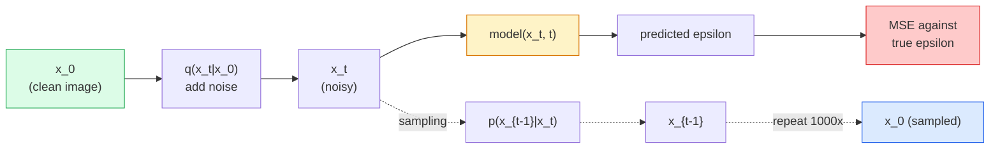

# 图像生成 — 扩散模型

> 扩散模型学习去噪。训练它从带噪图像中去除一点噪声，逆向重复这个过程上千次，你就得到了一个图像生成器。

**类型：** 构建
**语言：** Python
**前提知识：** 第4阶段第07课（U-Net），第1阶段第06课（概率），第3阶段第06课（优化器）
**时间：** 约75分钟

## 学习目标

- 推导正向加噪过程 `x_0 -> x_1 -> ... -> x_T` 并解释为什么闭式解 `q(x_t | x_0)` 对任意 t 成立
- 实现一个 DDPM 风格的训练目标，它回归每一步添加的噪声，以及一个从纯噪声回溯到图像的采样器
- 构建一个时间条件化的 U-Net（小到可以在 CPU 上训练），用于预测任意时间步的噪声
- 解释 DDPM 和 DDIM 采样的区别，以及各自适用的场景（第23课将深入讲解流匹配和修正流）

## 问题所在

GAN 生成是一步到位的：噪声进，图像出，一次前向传播。它们速度快但难训练。扩散模型是迭代生成：从纯噪声开始，小步去噪，图像逐渐显现。它们速度慢但易训练。过去五年，后一个特性占据了主导：任何小团队都能训练扩散模型并获得合理的样本；而 GAN 训练则是一门你需要通过多年失败运行才能学会的技艺。

除了训练稳定性，扩散模型的迭代结构解锁了现代图像生成的所有功能：文本条件化、图像修复、图像编辑、超分辨率、可控风格。采样循环的每一步都是注入新约束的切入点。这个钩子解释了为什么 Stable Diffusion、Imagen、DALL-E 3、Midjourney 以及你将使用的每一个可控图像模型都基于扩散模型。

本课构建最简 DDPM：正向加噪、反向去噪、训练循环。下一课（Stable Diffusion）将把它接入一个生产系统，包含 VAE、文本编码器和无分类器引导。

## 概念解析

### 正向过程

取一张图像 `x_0`。添加少量高斯噪声得到 `x_1`。再添加少量噪声得到 `x_2`。如此重复 T 步，直到 `x_T` 与纯高斯噪声几乎无法区分。

```
q(x_t | x_{t-1}) = N(x_t; sqrt(1 - beta_t) * x_{t-1},  beta_t * I)
```

`beta_t` 是一个小的方差调度，通常在 T=1000 步内从 0.0001 线性增长到 0.02。每一步都略微减弱信号并注入新的噪声。

### 闭式跳跃

逐步加噪是一个马尔可夫链，但数学上可以折叠：你可以从 `x_0` 一步直接采样 `x_t`。

```
Define alpha_t = 1 - beta_t
Define alpha_bar_t = prod_{s=1..t} alpha_s

Then:
  q(x_t | x_0) = N(x_t; sqrt(alpha_bar_t) * x_0,  (1 - alpha_bar_t) * I)

Equivalently:
  x_t = sqrt(alpha_bar_t) * x_0 + sqrt(1 - alpha_bar_t) * epsilon
  where epsilon ~ N(0, I)
```

这个单一方程是扩散模型得以实用的全部原因。训练时，你随机选择一个 `t`，直接从 `x_0` 采样 `x_t`，并一步完成训练——无需模拟整个马尔可夫链。

### 反向过程

正向过程是固定的。反向过程 `p(x_{t-1} | x_t)` 是神经网络要学习的。扩散模型不直接预测 `x_{t-1}`；它们预测在步骤 t 添加的噪声 `epsilon`，然后数学推导出 `x_{t-1}`。



### 训练损失

每个训练步骤：

1.  采样一张真实图像 `x_0`。
2.  从 [1, T] 均匀采样一个时间步 `t`。
3.  采样噪声 `epsilon ~ N(0, I)`。
4.  计算 `x_t = sqrt(alpha_bar_t) * x_0 + sqrt(1 - alpha_bar_t) * epsilon`。
5.  用网络预测 `epsilon_theta(x_t, t)`。
6.  最小化 `|| epsilon - epsilon_theta(x_t, t) ||^2`。

就这样。神经网络学习预测任意时间步的噪声。损失是 MSE。没有对抗博弈，没有崩塌，没有振荡。

### 采样器 (DDPM)

生成过程：从 `x_T ~ N(0, I)` 开始，一次回溯一步。

```
for t = T, T-1, ..., 1:
    eps = model(x_t, t)
    x_{t-1} = (1 / sqrt(alpha_t)) * (x_t - (beta_t / sqrt(1 - alpha_bar_t)) * eps) + sqrt(beta_t) * z
    where z ~ N(0, I) if t > 1, else 0
return x_0
```

关键在于，尽管一般的反向条件分布没有闭式解，但对于这个特定的高斯正向过程，它是有的。那些看起来复杂的系数是贝叶斯规则给出的。

### 为何是 1000 步

正向噪声调度被选择为每一步添加足够的噪声，使得反向步骤近似高斯。步数太少，反向步骤远离高斯分布，网络难以很好地建模。步数太多，采样成本变高而收益递减。T=1000 和线性调度是 DDPM 的默认设置。

### DDIM：快 20 倍的采样

训练不变。采样方式改变。DDIM (Song et al., 2020) 定义了一个确定性的反向过程，可以跳过时间步而无需重新训练。使用 DDIM 在 50 步内采样，质量接近 1000 步的 DDPM。每个生产系统都使用 DDIM 或更快的变体 (DPM-Solver, Euler ancestral)。

### 时间条件化

网络 `epsilon_theta(x_t, t)` 需要知道它正在对哪个时间步进行去噪。现代扩散模型通过正弦时间嵌入（与 Transformer 中的位置编码思路相同）注入 `t`，这些嵌入被添加到 U-Net 每一层的特征图中。

```
t_embedding = sinusoidal(t)
feature_map += MLP(t_embedding)
```

没有时间条件化，网络必须从图像本身猜测噪声水平，这虽然可行但样本效率低得多。

## 动手构建

### 步骤 1：噪声调度

```python
import torch

def linear_beta_schedule(T=1000, beta_start=1e-4, beta_end=2e-2):
    return torch.linspace(beta_start, beta_end, T)


def precompute_schedule(betas):
    alphas = 1.0 - betas
    alphas_cumprod = torch.cumprod(alphas, dim=0)
    return {
        "betas": betas,
        "alphas": alphas,
        "alphas_cumprod": alphas_cumprod,
        "sqrt_alphas_cumprod": torch.sqrt(alphas_cumprod),
        "sqrt_one_minus_alphas_cumprod": torch.sqrt(1.0 - alphas_cumprod),
        "sqrt_recip_alphas": torch.sqrt(1.0 / alphas),
    }

schedule = precompute_schedule(linear_beta_schedule(T=1000))
```

预先计算一次，在训练和采样时按索引收集。

### 步骤 2：正向扩散 (q_sample)

```python
def q_sample(x0, t, noise, schedule):
    sqrt_a = schedule["sqrt_alphas_cumprod"][t].view(-1, 1, 1, 1)
    sqrt_one_minus_a = schedule["sqrt_one_minus_alphas_cumprod"][t].view(-1, 1, 1, 1)
    return sqrt_a * x0 + sqrt_one_minus_a * noise
```

一行闭式解。`t` 是一个时间步批次，每个图像对应一个时间步。

### 步骤 3：一个小型时间条件化 U-Net

```python
import torch.nn as nn
import torch.nn.functional as F
import math

def timestep_embedding(t, dim=64):
    half = dim // 2
    freqs = torch.exp(-math.log(10000) * torch.arange(half, device=t.device) / half)
    args = t[:, None].float() * freqs[None]
    emb = torch.cat([args.sin(), args.cos()], dim=-1)
    return emb


class TinyUNet(nn.Module):
    def __init__(self, img_channels=3, base=32, t_dim=64):
        super().__init__()
        self.t_mlp = nn.Sequential(
            nn.Linear(t_dim, base * 4),
            nn.SiLU(),
            nn.Linear(base * 4, base * 4),
        )
        self.t_dim = t_dim
        self.enc1 = nn.Conv2d(img_channels, base, 3, padding=1)
        self.enc2 = nn.Conv2d(base, base * 2, 4, stride=2, padding=1)
        self.mid = nn.Conv2d(base * 2, base * 2, 3, padding=1)
        self.dec1 = nn.ConvTranspose2d(base * 2, base, 4, stride=2, padding=1)
        self.dec2 = nn.Conv2d(base * 2, img_channels, 3, padding=1)
        self.time_proj = nn.Linear(base * 4, base * 2)

    def forward(self, x, t):
        t_emb = timestep_embedding(t, self.t_dim)
        t_emb = self.t_mlp(t_emb)
        t_proj = self.time_proj(t_emb)[:, :, None, None]

        h1 = F.silu(self.enc1(x))
        h2 = F.silu(self.enc2(h1)) + t_proj
        h3 = F.silu(self.mid(h2))
        d1 = F.silu(self.dec1(h3))
        d2 = torch.cat([d1, h1], dim=1)
        return self.dec2(d2)
```

两级 U-Net，在瓶颈层注入时间条件化。对于真实图像，请增加深度和宽度。

### 步骤 4：训练循环

```python
def train_step(model, x0, schedule, optimizer, device, T=1000):
    model.train()
    x0 = x0.to(device)
    bs = x0.size(0)
    t = torch.randint(0, T, (bs,), device=device)
    noise = torch.randn_like(x0)
    x_t = q_sample(x0, t, noise, schedule)
    pred = model(x_t, t)
    loss = F.mse_loss(pred, noise)
    optimizer.zero_grad()
    loss.backward()
    optimizer.step()
    return loss.item()
```

这就是整个训练循环。没有 GAN 博弈，没有专门的损失，只有一个 MSE 计算。

### 步骤 5：采样器 (DDPM)

```python
@torch.no_grad()
def sample(model, schedule, shape, T=1000, device="cpu"):
    model.eval()
    x = torch.randn(shape, device=device)
    betas = schedule["betas"].to(device)
    sqrt_one_minus_a = schedule["sqrt_one_minus_alphas_cumprod"].to(device)
    sqrt_recip_alphas = schedule["sqrt_recip_alphas"].to(device)

    for t in reversed(range(T)):
        t_batch = torch.full((shape[0],), t, dtype=torch.long, device=device)
        eps = model(x, t_batch)
        coef = betas[t] / sqrt_one_minus_a[t]
        mean = sqrt_recip_alphas[t] * (x - coef * eps)
        if t > 0:
            x = mean + torch.sqrt(betas[t]) * torch.randn_like(x)
        else:
            x = mean
    return x
```

1000 次前向传播生成一批样本。在真实代码中，你会将其替换为 DDIM 的 50 步采样器。

### 步骤 6：DDIM 采样器（确定性，快约 20 倍）

```python
@torch.no_grad()
def sample_ddim(model, schedule, shape, steps=50, T=1000, device="cpu", eta=0.0):
    model.eval()
    x = torch.randn(shape, device=device)
    alphas_cumprod = schedule["alphas_cumprod"].to(device)

    ts = torch.linspace(T - 1, 0, steps + 1).long()
    for i in range(steps):
        t = ts[i]
        t_prev = ts[i + 1]
        t_batch = torch.full((shape[0],), t, dtype=torch.long, device=device)
        eps = model(x, t_batch)
        a_t = alphas_cumprod[t]
        a_prev = alphas_cumprod[t_prev] if t_prev >= 0 else torch.tensor(1.0, device=device)
        x0_pred = (x - torch.sqrt(1 - a_t) * eps) / torch.sqrt(a_t)
        sigma = eta * torch.sqrt((1 - a_prev) / (1 - a_t) * (1 - a_t / a_prev))
        dir_xt = torch.sqrt(1 - a_prev - sigma ** 2) * eps
        noise = sigma * torch.randn_like(x) if eta > 0 else 0
        x = torch.sqrt(a_prev) * x0_pred + dir_xt + noise
    return x
```

`eta=0` 是完全确定性的（相同的噪声输入总产生相同的输出）。`eta=1` 恢复为 DDPM。

## 投入使用

进行生产工作，请使用 `diffusers`：

```python
from diffusers import DDPMScheduler, UNet2DModel

unet = UNet2DModel(sample_size=32, in_channels=3, out_channels=3, layers_per_block=2)
scheduler = DDPMScheduler(num_train_timesteps=1000)
```

该库提供了现成的调度器 (DDPM, DDIM, DPM-Solver, Euler, Heun)、可配置的 U-Net、文生图和图生图的管线，以及 LoRA 微调助手。

用于研究，`k-diffusion` (Katherine Crowson) 拥有最忠实的参考实现和最佳的采样变体。

## 部署产出

本课产出：

- `outputs/prompt-diffusion-sampler-picker.md` — 一个提示，根据质量目标、延迟预算和条件类型选择 DDPM / DDIM / DPM-Solver / Euler。
- `outputs/skill-noise-schedule-designer.md` — 一项技能，根据 T 和目标污染程度生成线性、余弦或 S 形 beta 调度，以及信号随时间变化的信噪比诊断图。

## 练习

1.  **（简单）** 可视化正向过程：取一张图像并绘制 `x_t` 在 `t in [0, 100, 250, 500, 750, 1000]` 处的图像。验证 `x_1000` 看起来像纯高斯噪声。
2.  **（中等）** 在合成圆数据集上训练 TinyUNet 20 个 epoch，并采样 16 个圆。比较 DDPM（1000 步）和 DDIM（50 步）采样——它们从相同的噪声种子生成的图像相似吗？
3.  **（困难）** 实现一个余弦噪声调度 (Nichol & Dhariwal, 2021)：`alpha_bar_t = cos^2((t/T + s) / (1 + s) * pi / 2)`。分别用线性和余弦调度训练相同的模型，并证明在低步数下余弦调度能产生更好的样本。

## 关键术语

| 术语 | 人们常说 | 实际含义 |
|------|----------|----------|
| 正向过程 | “随时间添加噪声” | 固定的马尔可夫链，将图像在 T 步内损坏为高斯噪声 |
| 反向过程 | “逐步去噪” | 学到的分布，从噪声回溯到图像 |
| 预测 ε | “预测噪声” | 训练目标：`epsilon_theta(x_t, t)` 预测在步骤 t 添加的噪声 |
| Beta 调度 | “噪声量” | T 个小方差的序列，定义每步注入多少噪声 |
| alpha_bar_t | “累积保留因子” | (1 - beta_s) 到时间 t 的乘积；t 越大，剩余信号越少 |
| DDPM 采样器 | “祖先式、随机” | 从其条件高斯分布采样每个 x_{t-1}；1000 步 |
| DDIM 采样器 | “确定性、快速” | 将采样重写为确定性 ODE；20-100 步，质量相似 |
| 时间条件化 | “告知模型是哪个 t” | t 的正弦嵌入注入 U-Net，使其知晓噪声水平 |

## 扩展阅读

- [去噪扩散概率模型 (Ho et al., 2020)](https://arxiv.org/abs/2006.11239) — 使扩散模型实用化并在 FID 上击败 GAN 的论文
- [改进的 DDPM (Nichol & Dhariwal, 2021)](https://arxiv.org/abs/2102.09672) — 余弦调度和 v 参数化
- [DDIM (Song, Meng, Ermon, 2020)](https://arxiv.org/abs/2010.02502) — 使实时推理成为可能的确定性采样器
- [阐明扩散模型的设计空间 (Karras et al., 2022)](https://arxiv.org/abs/2206.00364) — 对所有扩散设计选择的统一视角；当前最佳参考