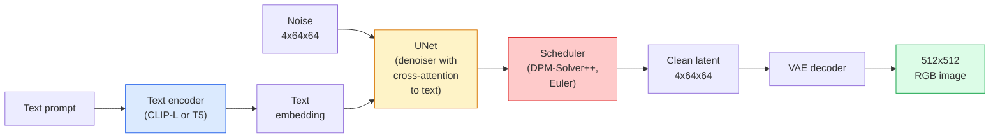

# Stable Diffusion — 架构与微调

> Stable Diffusion 是一个在预训练 VAE 潜在空间中运行的 DDPM 模型，通过交叉注意力机制进行文本条件控制，使用快速确定性 ODE 求解器进行采样，并由无分类器引导进行操控。

**类型：** 学习 + 使用
**语言：** Python
**前提课程：** 第 4 阶段第 10 课（扩散），第 7 阶段第 02 课（自注意力）
**预计时间：** ~75 分钟

## 学习目标

- 追踪 Stable Diffusion 流水线的五个组成部分：VAE、文本编码器、U-Net、调度器、安全检查器——以及它们各自的实际功能
- 解释潜在扩散，以及为什么在 4x64x64 的潜在空间（而非 3x512x512 的图像空间）中进行训练可以在不损失质量的情况下将计算量减少 48 倍
- 使用 `diffusers` 生成图像，运行图像到图像转换、修复和 ControlNet 引导生成
- 在小型自定义数据集上使用 LoRA 微调 Stable Diffusion，并在推理时加载 LoRA 适配器

## 问题所在

直接在 512x512 RGB 图像上训练 DDPM 代价高昂。每个训练步骤都需要反向传播通过一个处理 3x512x512 = 786,432 个输入值的 U-Net，而采样需要对该 U-Net 进行 50 多次前向传播。以 Stable Diffusion 1.5（发布于 2022 年）的质量水平计算，像素空间扩散大约需要 256 个 GPU 月的训练时间，并且在消费级 GPU 上每张图像需要 10-30 秒。

使开源权重文本到图像模型变得实用的诀窍是 **潜在扩散**（Rombach 等人，CVPR 2022）。训练一个 VAE，将 3x512x512 的图像映射到 4x64x64 的潜在张量，然后再映射回来，然后在该潜在空间中进行扩散。计算量减少了 `(3*512*512)/(4*64*64) = 48x`。在同一 GPU 上，采样时间从几十秒缩短到两秒以内。

几乎每个现代图像生成模型——SDXL、SD3、FLUX、HunyuanDiT、Wan-Video——都是潜在扩散模型，其变体在于自编码器、去噪器（U-Net 或 DiT）和文本条件处理。学习 Stable Diffusion，你就掌握了这一范式。

## 概念

### 流水线



- **VAE** — 冻结的自编码器。编码器将图像转换为潜在表示（用于 img2img 和训练）。解码器将潜在表示转回图像。
- **文本编码器** — CLIP 文本编码器（SD 1.x/2.x）、CLIP-L + CLIP-G（SDXL）或 T5-XXL（SD3/FLUX）。生成 token 嵌入序列。
- **U-Net** — 去噪器。在每个分辨率级别都有交叉注意力层，从潜在表示指向文本嵌入。
- **调度器** — 采样算法（DDIM、Euler、DPM-Solver++）。选择 sigma 值，将预测的噪声混合回潜在表示。
- **安全检查器** — 对输出图像进行的可选 NSFW / 非法内容过滤。

### 无分类器引导（CFG）

普通文本条件学习的是每个提示 `c` 对应的 `epsilon_theta(x_t, t, c)`。CFG 训练时，10% 的时间会丢弃 `c`（替换为空嵌入），从而得到一个既能预测条件噪声又能预测无条件噪声的单一模型。在推理时：

```
eps = eps_uncond + w * (eps_cond - eps_uncond)
```

`w` 是引导尺度。`w=0` 是无条件预测，`w=1` 是普通条件预测，`w>1` 推动输出更"受提示条件影响"，但代价是降低多样性。SD 的默认值是 `w=7.5`。

CFG 是文本到图像在生产质量下能够工作的关键原因。没有它，提示对输出的影响很弱；有了它，提示起主导作用。

### 潜在空间几何

VAE 的 4 通道潜在表示不仅仅是压缩后的图像。它是一个流形，其中的算术运算大致对应于语义编辑（提示工程和插值都发生在这里），也是扩散 U-Net 投入其全部建模能力进行训练的地方。解码一个随机的 4x64x64 潜在表示不会产生看起来随机的图像——它会产生垃圾，因为只有潜在表示的一个特定子流形才能解码成有效的图像。

两个推论：

1. **图像到图像** = 将图像编码到潜在表示，添加部分噪声，运行解码器，解码。图像结构得以保留，因为编码是近似可逆的；内容根据提示改变。
2. **修复** = 与图像到图像相同，但解码器只更新被遮罩的区域；未遮罩的区域保留编码后的潜在表示。

### U-Net 架构

SD 的 U-Net 是第 10 课中 TinyUNet 的放大版本，增加了三个部分：

- **Transformer 块** 在每个空间分辨率上，包含自注意力和指向文本嵌入的交叉注意力。
- **时间嵌入**，通过 MLP 处理正弦编码。
- **跳跃连接** 在匹配的分辨率之间连接编码器和解码器。

SD 1.5 的总参数量：约 8.6 亿。SDXL：约 26 亿。FLUX：约 120 亿。参数量的跃升主要在注意力层。

### LoRA 微调

完整微调 Stable Diffusion 需要 20GB 以上的显存，并更新 8.6 亿个参数。LoRA（低秩自适应）保持基础模型冻结，只向注意力层注入小的秩分解矩阵。用于 SD 的 LoRA 适配器通常为 10-50 MB，在单个消费级 GPU 上训练 10-60 分钟，并在推理时作为即插即用的修改进行加载。

```
Original: W_q : (d_in, d_out)   frozen
LoRA:     W_q + alpha * (A @ B)   where A : (d_in, r), B : (r, d_out)

r is typically 4-32.
```

LoRA 是几乎所有社区微调模型分发的方式。CivitAI 和 Hugging Face 上托管着数百万个 LoRA 模型。

### 你将接触到的调度器

- **DDIM** — 确定性，约 50 步，简单。
- **Euler ancestral** — 随机性，30-50 步，样本稍显创意。
- **DPM-Solver++ 2M Karras** — 确定性，20-30 步，生产环境默认。
- **LCM / TCD / Turbo** — 一致性模型和蒸馏变体；1-4 步，但牺牲一些质量。

更换调度器只需在 `diffusers` 中修改一行代码，有时无需重新训练即可解决样本问题。

## 动手实现

本课将端到端使用 `diffusers`，而不是从头重建 Stable Diffusion。你需要重建的部分（VAE、文本编码器、U-Net、调度器）是各自独立课程的主题；此处的目标是熟练使用生产级 API。

### 第 1 步：文本到图像

```python
import torch
from diffusers import StableDiffusionPipeline

pipe = StableDiffusionPipeline.from_pretrained(
    "runwayml/stable-diffusion-v1-5",
    torch_dtype=torch.float16,
).to("cuda")

image = pipe(
    prompt="a dog riding a skateboard in tokyo, studio ghibli style",
    guidance_scale=7.5,
    num_inference_steps=25,
    generator=torch.Generator("cuda").manual_seed(42),
).images[0]
image.save("dog.png")
```

`float16` 在没有明显质量损失的情况下将显存使用减半。`num_inference_steps=25` 使用默认的 DPM-Solver++ 的效果与使用 DDIM 的 `num_inference_steps=50` 相当。

### 第 2 步：更换调度器

```python
from diffusers import DPMSolverMultistepScheduler, EulerAncestralDiscreteScheduler

pipe.scheduler = DPMSolverMultistepScheduler.from_config(pipe.scheduler.config)
pipe.scheduler = EulerAncestralDiscreteScheduler.from_config(pipe.scheduler.config)
```

调度器状态与 U-Net 权重解耦。你可以在 DDPM 上训练，并使用任何调度器进行采样。

### 第 3 步：图像到图像

```python
from diffusers import StableDiffusionImg2ImgPipeline
from PIL import Image

img2img = StableDiffusionImg2ImgPipeline.from_pretrained(
    "runwayml/stable-diffusion-v1-5",
    torch_dtype=torch.float16,
).to("cuda")

init_image = Image.open("dog.png").convert("RGB").resize((512, 512))
out = img2img(
    prompt="a dog riding a skateboard, oil painting",
    image=init_image,
    strength=0.6,
    guidance_scale=7.5,
).images[0]
```

`strength` 是去噪前要添加的噪声量（0.0 = 不变，1.0 = 完全重新生成）。0.5-0.7 是风格转换的标准范围。

### 第 4 步：修复

```python
from diffusers import StableDiffusionInpaintPipeline

inpaint = StableDiffusionInpaintPipeline.from_pretrained(
    "runwayml/stable-diffusion-inpainting",
    torch_dtype=torch.float16,
).to("cuda")

image = Image.open("dog.png").convert("RGB").resize((512, 512))
mask = Image.open("dog_mask.png").convert("L").resize((512, 512))

out = inpaint(
    prompt="a cat",
    image=image,
    mask_image=mask,
    guidance_scale=7.5,
).images[0]
```

遮罩中的白色像素是要重新生成的区域。黑色像素将被保留。

### 第 5 步：加载 LoRA

```python
pipe.load_lora_weights("sayakpaul/sd-lora-ghibli")
pipe.fuse_lora(lora_scale=0.8)

image = pipe(prompt="a village square in ghibli style").images[0]
```

`lora_scale` 控制强度；0.0 = 无效果，1.0 = 完全效果。`fuse_lora` 为了速度会就地将适配器烘焙到权重中，但这会阻止更换适配器。在加载不同的适配器之前调用 `pipe.unfuse_lora()`。

### 第 6 步：LoRA 训练（概要）

真正的 LoRA 训练在 `peft` 或 `diffusers.training` 中进行。大纲如下：

```python
# Pseudocode
for step, batch in enumerate(dataloader):
    images, prompts = batch
    latents = vae.encode(images).latent_dist.sample() * 0.18215

    t = torch.randint(0, num_train_timesteps, (batch_size,))
    noise = torch.randn_like(latents)
    noisy_latents = scheduler.add_noise(latents, noise, t)

    text_emb = text_encoder(tokenizer(prompts))

    pred_noise = unet(noisy_latents, t, text_emb)  # LoRA weights injected here

    loss = F.mse_loss(pred_noise, noise)
    loss.backward()
    optimizer.step()
```

只有 LoRA 矩阵接收梯度；基础 U-Net、VAE 和文本编码器是冻结的。使用批大小为 1 和梯度检查点，这可以适配 8GB 显存。

## 实际应用

在生产环境中，你实际需要做出的决策：

- **模型家族**：SD 1.5 用于开源社区微调模型，SDXL 用于更高保真度，SD3 / FLUX 用于最先进水平且有严格许可要求。
- **调度器**：DPM-Solver++ 2M Karras 用于 20-30 步，LCM-LoRA 用于延迟低于 1 秒的场景。
- **精度**：`float16` 用于 4080/4090，`bfloat16` 用于 A100 及更新型号，当显存紧张时使用 `int8`（通过 `bitsandbytes` 或 `compel`）。
- **条件控制**：纯文本有效；为了更强控制，可在基础流水线上添加 ControlNet（边缘、深度、姿态）。

对于批量生成，`AUTO1111` / `ComfyUI` 是社区工具；对于生产 API，`diffusers` + `accelerate` 或 `optimum-nvidia` 搭配 TensorRT 编译。

## 交付成果

本课将产出：

- `outputs/prompt-sd-pipeline-planner.md` — 一个给定延迟预算、保真度目标和许可约束的提示，用于选择 SD 1.5 / SDXL / SD3 / FLUX、调度器和精度。
- `outputs/skill-lora-training-setup.md` — 一项技能，能为包含字幕、秩、批大小和学习率的自定义数据集编写完整的 LoRA 训练配置。

## 练习

1.  **（简单）** 使用 `[1, 3, 5, 7.5, 10, 15]` 中的 `guidance_scale` 生成相同的提示。描述图像如何变化。在哪个引导值下会出现伪影？
2.  **（中等）** 取任意一张真实照片，在 `[0.2, 0.4, 0.6, 0.8, 1.0]` 中使用 `StableDiffusionImg2ImgPipeline`，强度设置为 `strength`。哪种强度能在改变风格的同时保留构图？为什么 1.0 会完全忽略输入？
3.  **（困难）** 在 10-20 张单一主体（宠物、logo、角色）的图像上训练一个 LoRA，并生成包含该主体的新场景。报告能实现最佳身份保持而不过拟合输入图像的 LoRA 秩和训练步数。

## 关键术语

| 术语 | 人们常说 | 实际含义 |
|------|----------|----------|
| 潜在扩散 | "在潜在空间扩散" | 在 VAE 潜在空间（4x64x64）而非像素空间（3x512x512）运行整个 DDPM；计算节省 48 倍 |
| VAE 缩放因子 | "0.18215" | 用于将 VAE 的原始潜在表示缩放到大致单位方差的常数；硬编码在每个 SD 流水线中 |
| 无分类器引导 | "CFG" | 混合条件和无条件噪声预测；推理时最有影响力的旋钮 |
| 调度器 | "采样器" | 将噪声和模型预测转换为去噪潜在轨迹的算法 |
| LoRA | "低秩适配器" | 在不触碰基础权重的情况下微调注意力层的小型秩分解矩阵 |
| 交叉注意力 | "文本-图像注意力" | 从潜在 token 到文本 token 的注意力；在 U-Net 的每个层级注入提示信息 |
| ControlNet | "结构条件" | 一个单独训练的适配器，通过额外输入（边缘、深度、姿态、分割）引导 SD |
| DPM-Solver++ | "默认调度器" | 二阶确定性 ODE 求解器；在 2026 年，是低步数（20-30）下质量最佳的求解器 |

## 延伸阅读

- [使用潜在扩散进行高分辨率图像合成（Rombach 等人，2022）](https://arxiv.org/abs/2112.10752) — Stable Diffusion 论文；包含所有证明设计合理性的消融实验
- [无分类器扩散引导（Ho & Salimans，2022）](https://arxiv.org/abs/2207.12598) — CFG 论文
- [LoRA: 大型语言模型的低秩自适应（Hu 等人，2021）](https://arxiv.org/abs/2106.09685) — LoRA 最初为 NLP 设计；几乎未经修改就迁移到了 SD
- [diffusers 文档](https://huggingface.co/docs/diffusers) — 所有 SD / SDXL / SD3 / FLUX 流水线的参考文档