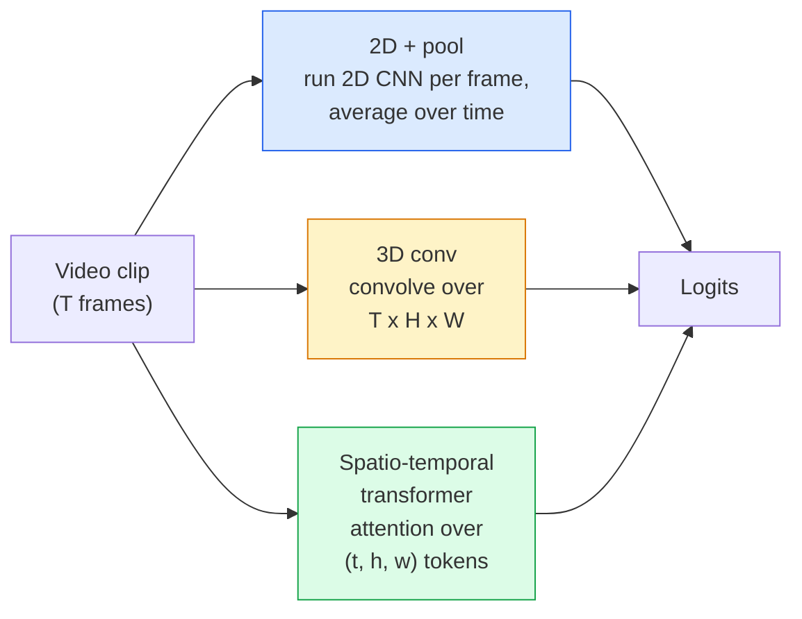

# 视频理解 — 时序建模

> 视频是一系列图像序列加上连接它们的物理运动。每个视频模型要么将时间视为一个额外维度（3D卷积），要么视为一个需要关注的序列（Transformer），要么视为一个提取后进行池化的特征（2D+池化）。

**类型：** 学习 + 构建
**语言：** Python
**前置课程：** 阶段4课程03（卷积神经网络）、阶段4课程04（图像分类）
**时间：** 约45分钟

## 学习目标

- 区分三种主要的视频建模方法（2D+池化、3D卷积、时空Transformer）并预测它们的成本与准确率权衡
- 在PyTorch中实现帧采样、时间池化和一个2D+池化基线分类器
- 解释I3D的"膨胀"3D核为何能良好地从ImageNet权重迁移，以及分解式(2+1)D卷积有何不同
- 阅读标准的动作识别数据集和指标：Kinetics-400/600、UCF101、Something-Something V2；在片段和视频层面的top-1准确率

## 问题描述

一个30fps的30秒视频包含900帧图像。简单地，视频分类就是运行900次图像分类，然后进行某种聚合。当动作在几乎每一帧中都可见时（如运动、烹饪、健身视频），这种方法可行；但当动作本身由运动定义时，就会彻底失败："将某物从左推到右"在每一帧中看起来都像是两个静止的物体。

每个视频架构的核心问题是：时序结构在何时被建模，以及如何被建模？这个问题的答案驱动着其他一切——计算成本、预训练策略、是否能复用ImageNet权重、模型在哪些数据集上训练。

本课比静态图像课程更简短。核心的图像处理机制已经就位，视频理解主要关乎时序的故事：采样、建模和聚合。

## 核心概念

### 三大架构家族



### 2D + 池化

采用一个2D卷积神经网络（ResNet、EfficientNet、ViT）。在每个采样帧上独立运行。对每帧的嵌入向量进行平均（或最大池化、注意力池化）。将池化后的向量输入分类器。

优点：
- ImageNet预训练可直接迁移。
- 实现最简单。
- 计算成本低：T帧 * 单帧推理成本。

缺点：
- 无法建模运动。动作=外观的聚合。
- 时间池化是顺序无关的；"开门"和"关门"看起来一样。

适用场景：外观主导的任务、小型视频数据集上的迁移学习、初始基线。

### 3D卷积

用3D (T, H, W)卷积核替换2D (H, W)卷积核。网络同时在空间和时间上进行卷积。早期代表：C3D、I3D、SlowFast。

I3D技巧：取一个预训练的2D ImageNet模型，通过沿新的时间轴复制，将每个2D卷积核"膨胀"为3D卷积核。一个3x3的2D卷积核变成一个3x3x3的3D卷积核。这使3D模型拥有强大的预训练权重，而非从头训练。

优点：
- 直接建模运动。
- I3D膨胀法提供了免费的迁移学习。

缺点：
- 计算量（FLOPs）是2D对应模型的T/8倍（对于时间核为3，堆叠3次的情况）。
- 时间卷积核较小；长距离运动需要金字塔或双流方法。

适用场景：以运动为信号的动作识别（Something-Something V2、包含大量运动类别的Kinetics）。

### 时空Transformer

将视频标记化为一个时空图块网格，并在其所有部分间进行注意力计算。TimeSformer、ViViT、Video Swin、VideoMAE。

重要的注意力模式：
- **联合注意力** — 在 (t, h, w) 上进行一次大规模注意力。计算复杂度相对于`T*H*W`是二次的；开销大。
- **分离注意力** — 每个注意力块包含两次注意力：一次在时间维度，一次在空间维度。近似线性扩展。
- **分解注意力** — 时间注意力和空间注意力在不同块间交替进行。

优点：
- 在所有主要基准测试上达到最先进精度。
- 可通过图块膨胀从图像Transformer（ViT）迁移。
- 支持通过稀疏注意力处理长上下文视频。

缺点：
- 计算开销大。
- 需要谨慎选择注意力模式，否则运行时间会急剧增加。

适用场景：大规模数据集、高保真视频理解、多模态视频+文本任务。

### 帧采样

一个30fps的10秒片段有300帧；将所有300帧输入任何模型都是浪费。标准策略：

- **均匀采样** — 在片段中均匀选取T帧。2D+池化的默认策略。
- **密集采样** — 随机选取一个连续的T帧窗口。常用于3D卷积，因为运动需要相邻帧。
- **多片段** — 从同一视频中采样多个T帧窗口，分别分类，在测试时对预测结果取平均。

T通常是8、16、32或64。更高的T = 以更多计算为代价获得更丰富的时序信号。

### 评估

两个层面：
- **片段级准确率** — 模型看到一个T帧片段，报告top-k。
- **视频级准确率** — 对每个视频的多个片段的片段级预测取平均；结果更高且更稳定。

两者都需要报告。一个模型在片段上得分78%，在视频上得分82%，意味着它严重依赖测试时的平均；而另一个在片段上得分80%，在视频上得分81%，则意味着其每个片段的预测更稳健。

### 你会遇到的数据集

- **Kinetics-400 / 600 / 700** — 通用动作数据集。40万片段；YouTube网址（许多现已失效）。
- **Something-Something V2** — 由运动定义的动作（"将X从左移到右"）。无法用2D+池化解决。
- **UCF-101**、**HMDB-51** — 更早、更小，但仍被报告。
- **AVA** — 时空中的动作*定位*；比分类更难。

## 动手构建

### 步骤1：帧采样器

适用于帧列表（或视频张量）的均匀采样器和密集采样器。

```python
import numpy as np

def sample_uniform(num_frames_total, T):
    if num_frames_total <= T:
        return list(range(num_frames_total)) + [num_frames_total - 1] * (T - num_frames_total)
    step = num_frames_total / T
    return [int(i * step) for i in range(T)]


def sample_dense(num_frames_total, T, rng=None):
    rng = rng or np.random.default_rng()
    if num_frames_total <= T:
        return list(range(num_frames_total)) + [num_frames_total - 1] * (T - num_frames_total)
    start = int(rng.integers(0, num_frames_total - T + 1))
    return list(range(start, start + T))
```

两者都返回`T`索引，你可用其来切片视频张量。

### 步骤2：2D+池化基线

在每一帧上运行2D ResNet-18，对特征进行平均池化，然后分类。

```python
import torch
import torch.nn as nn
from torchvision.models import resnet18, ResNet18_Weights

class FramePool(nn.Module):
    def __init__(self, num_classes=400, pretrained=True):
        super().__init__()
        weights = ResNet18_Weights.IMAGENET1K_V1 if pretrained else None
        backbone = resnet18(weights=weights)
        self.features = nn.Sequential(*(list(backbone.children())[:-1]))  # global avg pool kept
        self.head = nn.Linear(512, num_classes)

    def forward(self, x):
        # x: (N, T, 3, H, W)
        N, T = x.shape[:2]
        x = x.view(N * T, *x.shape[2:])
        feats = self.features(x).view(N, T, -1)
        pooled = feats.mean(dim=1)
        return self.head(pooled)

model = FramePool(num_classes=10)
x = torch.randn(2, 8, 3, 224, 224)
print(f"output: {model(x).shape}")
print(f"params: {sum(p.numel() for p in model.parameters()):,}")
```

参数量一千一百万，ImageNet预训练，逐帧运行，取平均，分类。在外观主导的任务上，这个基线通常只比正确的3D模型低5-10个百分点——有时甚至更好，因为它复用了更强大的ImageNet骨干网络。

### 步骤3：I3D风格的膨胀3D卷积

通过沿新的时间轴复制权重，将单个2D卷积核变为3D卷积核。

```python
def inflate_2d_to_3d(conv2d, time_kernel=3):
    out_c, in_c, kh, kw = conv2d.weight.shape
    weight_3d = conv2d.weight.data.unsqueeze(2)  # (out, in, 1, kh, kw)
    weight_3d = weight_3d.repeat(1, 1, time_kernel, 1, 1) / time_kernel
    conv3d = nn.Conv3d(in_c, out_c, kernel_size=(time_kernel, kh, kw),
                        padding=(time_kernel // 2, conv2d.padding[0], conv2d.padding[1]),
                        stride=(1, conv2d.stride[0], conv2d.stride[1]),
                        bias=False)
    conv3d.weight.data = weight_3d
    return conv3d

conv2d = nn.Conv2d(3, 64, kernel_size=3, padding=1, bias=False)
conv3d = inflate_2d_to_3d(conv2d, time_kernel=3)
print(f"2D weight shape:  {tuple(conv2d.weight.shape)}")
print(f"3D weight shape:  {tuple(conv3d.weight.shape)}")
x = torch.randn(1, 3, 8, 56, 56)
print(f"3D output shape:  {tuple(conv3d(x).shape)}")
```

除以`time_kernel`是为了保持激活幅度大致恒定——这对于首次运行时不破坏批归一化统计量很重要。

### 步骤4：分解式(2+1)D卷积

将3D卷积分解为一个2D（空间）卷积和一个1D（时间）卷积。相同的感受野，更少的参数，在某些基准上准确率更高。

```python
class Conv2Plus1D(nn.Module):
    def __init__(self, in_c, out_c, kernel_size=3):
        super().__init__()
        mid_c = (in_c * out_c * kernel_size * kernel_size * kernel_size) \
                // (in_c * kernel_size * kernel_size + out_c * kernel_size)
        self.spatial = nn.Conv3d(in_c, mid_c, kernel_size=(1, kernel_size, kernel_size),
                                 padding=(0, kernel_size // 2, kernel_size // 2), bias=False)
        self.bn = nn.BatchNorm3d(mid_c)
        self.act = nn.ReLU(inplace=True)
        self.temporal = nn.Conv3d(mid_c, out_c, kernel_size=(kernel_size, 1, 1),
                                  padding=(kernel_size // 2, 0, 0), bias=False)

    def forward(self, x):
        return self.temporal(self.act(self.bn(self.spatial(x))))

c = Conv2Plus1D(3, 64)
x = torch.randn(1, 3, 8, 56, 56)
print(f"(2+1)D output: {tuple(c(x).shape)}")
```

完整的R(2+1)D网络与ResNet-18相同，只是将每个3x3卷积替换为`Conv2Plus1D`。

## 实际应用

两个库覆盖了生产环境的视频工作：

- `torchvision.models.video` — 提供R(2+1)D、MViT、Swin3D，并带有Kinetics预训练权重。API与图像模型一致。
- `pytorchvideo` (Meta) — 模型库，Kinetics/SSv2/AVA的数据加载器，标准数据变换。

对于视觉-语言视频模型（视频描述、视频问答），请使用`transformers` (`VideoMAE`, `VideoLLaMA`, `InternVideo`)。

## 部署提示

本课提供：

- `outputs/prompt-video-architecture-picker.md` — 一个提示，根据外观与运动的侧重、数据集大小和计算预算，选择2D+池化 / I3D / (2+1)D / Transformer。
- `outputs/skill-frame-sampler-auditor.md` — 一项检查视频处理管线采样器并标记常见错误的技能：索引偏移一位、当`num_frames < T`时采样不均匀、缺少保持宽高比的裁剪等。

## 练习

1.  **（简单）** 计算FramePool（T=8）与I3D风格的3D ResNet（T=8）的近似计算量（FLOPs）。解释为什么2D+池化便宜3-5倍。
2.  **（中等）** 生成一个合成视频数据集：随机方向移动的随机小球，按运动方向（"从左到右"、"从右到左"、"向上对角线"）标记。在其上训练FramePool。证明其准确率接近随机猜测，表明仅凭外观不足以处理运动任务。
3.  **（困难）** 通过将ResNet-18中的每个Conv2d替换为`Conv2Plus1D`，构建一个R(2+1)D-18。将第一个卷积层的权重从ImageNet预训练的ResNet-18膨胀过来。在练习2的运动数据集上进行训练，并超越FramePool。

## 关键术语

| 术语 | 人们常说 | 实际含义 |
|------|---------|---------|
| 2D + 池化 | "逐帧分类器" | 在每个采样帧上运行2D CNN，跨时间对特征进行平均池化，然后分类 |
| 3D卷积 | "时空卷积核" | 在 (T, H, W) 上进行卷积的核；能原生建模运动 |
| 膨胀 | "将2D权重提升到3D" | 通过沿新的时间轴复制2D卷积核的权重来初始化3D卷积权重，然后除以kernel_T以保持激活尺度 |
| (2+1)D | "分解卷积" | 将3D卷积分解为2D空间卷积 + 1D时间卷积；参数更少，两者之间增加非线性 |
| 分离注意力 | "先时间后空间" | 每个Transformer层包含两次注意力：一次在相同帧的token间，一次在相同位置的token间 |
| 片段 | "T帧窗口" | 一个采样的T帧子序列；视频模型处理的基本单位 |
| 片段 vs 视频准确率 | "两种评估设置" | 片段 = 每个视频一个样本，视频 = 对多个采样片段取平均 |
| Kinetics | "视频领域的ImageNet" | 400-700个动作类别，30万+YouTube片段，标准的视频预训练语料库 |

## 扩展阅读

- [I3D: Quo Vadis, Action Recognition (Carreira & Zisserman, 2017)](https://arxiv.org/abs/1705.07750) — 介绍了膨胀法和Kinetics数据集
- [R(2+1)D: A Closer Look at Spatiotemporal Convolutions (Tran et al., 2018)](https://arxiv.org/abs/1711.11248) — 分解卷积，至今仍是强基线
- [TimeSformer: Is Space-Time Attention All You Need? (Bertasius et al., 2021)](https://arxiv.org/abs/2102.05095) — 首个强大的视频Transformer
- [VideoMAE (Tong et al., 2022)](https://arxiv.org/abs/2203.12602) — 视频的掩码自编码器预训练；当前主导的预训练方案