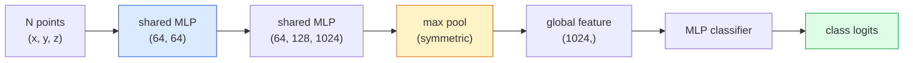

# 3D视觉 — 点云与NeRF

> 3D视觉有两种主要形式。点云是传感器的原始输出。NeRF是学习得到的体积场。两者都回答"空间中有什么以及在哪里"的问题。

**类型：** 学习 + 动手
**语言：** Python
**前置课程：** 第四阶段 课程03 (CNNs)，第一阶段 课程12 (张量操作)
**时间：** 约45分钟

## 学习目标

- 区分显式（点云、网格、体素）和隐式（符号距离场、NeRF）3D表示法及其适用场景
- 理解PointNet的对称函数技巧，该技巧使神经网络在无序点集上具有排列不变性
- 追踪NeRF的前向过程：光线投射、体积渲染、位置编码、MLP密度+颜色头
- 使用 `nerfstudio` 或 `instant-ngp` 从少量已知位姿图像进行预训练3D重建

## 问题所在

相机产生2D图像。激光雷达产生一组无序的3D点。运动恢复结构流程产生稀疏的3D关键点云。NeRF从少量已知位姿图像中重建整个3D场景。这些都是"视觉"，但没有一个看起来像CNN想要的稠密张量。

3D视觉至关重要，因为几乎所有高价值的机器人任务都在3D环境中运行：抓取、避障、导航、AR遮挡、3D内容捕获。只理解2D图像的视觉工程师被排除在该领域增长最快的部分之外（AR/VR内容、机器人、自动驾驶技术栈、基于NeRF的房地产或建筑3D重建）。

两种表示法因不同原因占据主导地位。点云是传感器免费提供给你的。NeRF及其后继者（3D高斯溅射、神经SDF）是你要求神经网络学习场景时得到的结果。

## 核心概念

### 点云

点云是R^3空间中一组无序的N个点，每个点可选择性地带有特征（颜色、强度、法线）。

```
cloud = [
  (x1, y1, z1, r1, g1, b1),
  (x2, y2, z2, r2, g2, b2),
  ...
  (xN, yN, zN, rN, gN, bN),
]
```

没有网格，没有连接性。两个特性使得这难以被神经网络处理：

- **排列不变性** — 输出不应依赖于点的顺序。
- **可变的N** — 单个模型必须处理不同大小的点云。

PointNet（Qi et al., 2017）用一个想法解决了这两个问题：对每个点应用一个共享的MLP，然后用对称函数（最大池化）进行聚合。结果是一个不依赖于顺序的固定大小向量。

```
f(P) = max_{p in P} MLP(p)
```

这就是PointNet的整个核心。更深的变体（PointNet++, Point Transformer）增加了层次化采样和局部聚合，但对称函数技巧保持不变。

### PointNet架构



"共享MLP"意味着相同的MLP独立运行于每个点。为了实现效率，将其作为在点维度上的1x1卷积来实现。

### 神经辐射场 (NeRF)

NeRF（Mildenhall et al., 2020）提出了"我们能否从N张照片重建3D场景？"这个问题，并用一个就是场景本身的神经网络给出了答案。该网络将 `(x, y, z, viewing_direction)` 映射到 `(density, colour)`。渲染新视图是在此网络上进行光线投射循环。

```
NeRF MLP:  (x, y, z, theta, phi) -> (sigma, r, g, b)

To render a pixel (u, v) of a new view:
  1. Cast a ray from the camera through pixel (u, v)
  2. Sample points along the ray at distances t_1, t_2, ..., t_N
  3. Query the MLP at each point
  4. Composite the colours weighted by (1 - exp(-sigma * dt))
  5. The sum is the rendered pixel colour
```

损失函数将渲染出的像素与训练照片中的真实像素进行比较。通过渲染步骤的反向传播更新MLP。没有3D真实数据，没有显式几何 — 场景存储在MLP的权重中。

### NeRF中的位置编码

一个在 `(x, y, z)` 上的普通MLP无法表示高频细节，因为MLP在频谱上偏向于低频。NeRF通过将每个坐标编码成傅里叶特征向量后再输入MLP来解决这个问题：

```
gamma(p) = (sin(2^0 pi p), cos(2^0 pi p), sin(2^1 pi p), cos(2^1 pi p), ...)
```

最高达到L=10个频率级别。这与Transformer用于位置编码的技巧相同，并且在扩散模型的时间条件中（第10课）再次出现。没有它，NeRF看起来会模糊。

### 体积渲染

```
C(r) = sum_i T_i * (1 - exp(-sigma_i * delta_i)) * c_i

T_i  = exp(- sum_{j<i} sigma_j * delta_j)
delta_i = t_{i+1} - t_i
```

`T_i` 是透射率 — 到达点i的光线存活了多少。`(1 - exp(-sigma_i * delta_i))` 是点i处的不透明度。`c_i` 是颜色。最终像素是沿光线的加权和。

### NeRF的替代者

纯NeRF训练慢（数小时）且渲染慢（每张图数秒）。其后的演进：

- **Instant-NGP** (2022) — 哈希网格编码替代了MLP的位置输入；可在几秒内完成训练。
- **Mip-NeRF 360** — 处理无界场景和抗锯齿。
- **3D高斯溅射** (2023) — 用数百万个3D高斯体替代体积场；几分钟内完成训练，实时渲染。当前生产环境的默认选择。

在2026年，几乎每个实际的NeRF产品实际上都是3D高斯溅射。其思维模型仍然是NeRF。

### 数据集与基准

- **ShapeNet** — 作为点云的3D CAD模型的分类和分割。
- **ScanNet** — 用于分割的真实室内扫描数据。
- **KITTI** — 用于自动驾驶的室外激光雷达点云。
- **NeRF Synthetic** / **Blended MVS** — 用于视图合成的已知位姿图像数据集。
- **Mip-NeRF 360** 数据集 — 无界的真实场景。

## 动手构建

### 步骤1：PointNet分类器

```python
import torch
import torch.nn as nn

class PointNet(nn.Module):
    def __init__(self, num_classes=10):
        super().__init__()
        self.mlp1 = nn.Sequential(
            nn.Conv1d(3, 64, 1),    nn.BatchNorm1d(64),   nn.ReLU(inplace=True),
            nn.Conv1d(64, 64, 1),   nn.BatchNorm1d(64),   nn.ReLU(inplace=True),
        )
        self.mlp2 = nn.Sequential(
            nn.Conv1d(64, 128, 1),  nn.BatchNorm1d(128),  nn.ReLU(inplace=True),
            nn.Conv1d(128, 1024, 1), nn.BatchNorm1d(1024), nn.ReLU(inplace=True),
        )
        self.head = nn.Sequential(
            nn.Linear(1024, 512),   nn.BatchNorm1d(512),  nn.ReLU(inplace=True),
            nn.Dropout(0.3),
            nn.Linear(512, 256),    nn.BatchNorm1d(256),  nn.ReLU(inplace=True),
            nn.Dropout(0.3),
            nn.Linear(256, num_classes),
        )

    def forward(self, x):
        # x: (N, 3, num_points) — transposed for Conv1d
        x = self.mlp1(x)
        x = self.mlp2(x)
        x = torch.max(x, dim=-1)[0]       # (N, 1024)
        return self.head(x)

pts = torch.randn(4, 3, 1024)
net = PointNet(num_classes=10)
print(f"output: {net(pts).shape}")
print(f"params: {sum(p.numel() for p in net.parameters()):,}")
```

约1.6M参数。每个点云运行1,024个点。

### 步骤2：位置编码

```python
def positional_encoding(x, L=10):
    """
    x: (..., D) -> (..., D * 2 * L)
    """
    freqs = 2.0 ** torch.arange(L, dtype=x.dtype, device=x.device)
    args = x.unsqueeze(-1) * freqs * 3.141592653589793
    sinc = torch.cat([args.sin(), args.cos()], dim=-1)
    return sinc.reshape(*x.shape[:-1], -1)

x = torch.randn(5, 3)
y = positional_encoding(x, L=10)
print(f"input:  {x.shape}")
print(f"encoded: {y.shape}     # (5, 60)")
```

乘以 `2^l * pi` 产生逐渐升高的频率。

### 步骤3：微型NeRF MLP

```python
class TinyNeRF(nn.Module):
    def __init__(self, L_pos=10, L_dir=4, hidden=128):
        super().__init__()
        self.L_pos = L_pos
        self.L_dir = L_dir
        pos_dim = 3 * 2 * L_pos
        dir_dim = 3 * 2 * L_dir
        self.trunk = nn.Sequential(
            nn.Linear(pos_dim, hidden), nn.ReLU(inplace=True),
            nn.Linear(hidden, hidden),  nn.ReLU(inplace=True),
            nn.Linear(hidden, hidden),  nn.ReLU(inplace=True),
            nn.Linear(hidden, hidden),  nn.ReLU(inplace=True),
        )
        self.sigma = nn.Linear(hidden, 1)
        self.color = nn.Sequential(
            nn.Linear(hidden + dir_dim, hidden // 2), nn.ReLU(inplace=True),
            nn.Linear(hidden // 2, 3), nn.Sigmoid(),
        )

    def forward(self, x, d):
        x_enc = positional_encoding(x, self.L_pos)
        d_enc = positional_encoding(d, self.L_dir)
        h = self.trunk(x_enc)
        sigma = torch.relu(self.sigma(h)).squeeze(-1)
        rgb = self.color(torch.cat([h, d_enc], dim=-1))
        return sigma, rgb

nerf = TinyNeRF()
x = torch.randn(128, 3)
d = torch.randn(128, 3)
s, c = nerf(x, d)
print(f"sigma: {s.shape}   rgb: {c.shape}")
```

与原始NeRF（拥有两个深度为8的MLP分支）相比非常微小。足以演示该架构。

### 步骤4：沿光线进行体积渲染

```python
def volumetric_render(sigma, rgb, t_vals):
    """
    sigma: (..., N_samples)
    rgb:   (..., N_samples, 3)
    t_vals: (N_samples,) distances along the ray
    """
    delta = torch.cat([t_vals[1:] - t_vals[:-1], torch.full_like(t_vals[:1], 1e10)])
    alpha = 1.0 - torch.exp(-sigma * delta)
    trans = torch.cumprod(torch.cat([torch.ones_like(alpha[..., :1]), 1.0 - alpha + 1e-10], dim=-1), dim=-1)[..., :-1]
    weights = alpha * trans
    rendered = (weights.unsqueeze(-1) * rgb).sum(dim=-2)
    depth = (weights * t_vals).sum(dim=-1)
    return rendered, depth, weights


N = 64
t_vals = torch.linspace(2.0, 6.0, N)
sigma = torch.rand(N) * 0.5
rgb = torch.rand(N, 3)
rendered, depth, weights = volumetric_render(sigma, rgb, t_vals)
print(f"rendered colour: {rendered.tolist()}")
print(f"depth:           {depth.item():.2f}")
```

一条光线，64个采样点，合成到一个RGB像素和一个深度值。

## 实际应用

对于实际工作：

- `nerfstudio` (Tancik et al.) — 当前用于NeRF / Instant-NGP / 高斯溅射的参考库。命令行工具加网页查看器。
- `pytorch3d` (Meta) — 可微渲染、点云工具、网格操作。
- `open3d` — 点云处理、配准、可视化。

在部署方面，3D高斯溅射已在很大程度上取代了纯NeRF，因为它渲染速度快100倍。重建质量相当。

## 产出

本课程将产生：

- `outputs/prompt-3d-task-router.md` — 一个提示词，能够根据任务和输入数据路由到正确的3D表示法（点云、网格、体素、NeRF、高斯溅射）。
- `outputs/skill-point-cloud-loader.md` — 一项技能，用于编写一个PyTorch `Dataset` 来处理 .ply / .pcd / .xyz 文件，具备正确的归一化、居中和点采样功能。

## 练习

1. **（简单）** 证明PointNet具有排列不变性：将同一个点云运行两次，其中一次打乱点顺序。验证输出在浮点噪声范围内是相同的。
2. **（中等）** 实现一个最小的光线生成函数，给定相机内参和位姿，为H x W图像的每个像素生成光线起点和方向。
3. **（困难）** 在一个合成数据集上训练TinyNeRF，该数据集由彩色立方体（通过可微渲染或简单光线追踪生成）的渲染视图组成。报告第1、10和100个周期的渲染损失。模型在哪个周期能产生可识别的视图？

## 关键术语

| 术语 | 常见说法 | 实际含义 |
|------|----------------|----------------------|
| 点云 | "来自激光雷达的3D点" | 无序的(x, y, z)集合 + 每个点可选择性带有特征 |
| PointNet | "第一个用于点云的神经网络" | 每个点的共享MLP + 对称（最大）池化；通过构造实现排列不变性 |
| NeRF | "MLP即场景" | 将(x, y, z, dir)映射到(density, colour)的网络；通过光线投射渲染 |
| 位置编码 | "傅里叶特征" | 将每个坐标编码为多个频率的sin/cos，以克服MLP的低频偏差 |
| 体积渲染 | "光线积分" | 沿一条光线使用透射率和alpha将采样点合成为单个像素 |
| Instant-NGP | "哈希网格NeRF" | 用多分辨率哈希网格替代NeRF的坐标MLP；速度快100-1000倍 |
| 3D高斯溅射 | "数百万个高斯体" | 场景 = 3D高斯体集合；实时渲染，几分钟内完成训练 |
| SDF | "符号距离场" | 返回到最近表面的有符号距离的函数；另一种隐式表示法 |

## 延伸阅读

- [PointNet (Qi et al., 2017)](https://arxiv.org/abs/1612.00593) — 排列不变分类器
- [NeRF (Mildenhall et al., 2020)](https://arxiv.org/abs/2003.08934) — 将照片3D重建变为神经网络问题的论文
- [Instant-NGP (Müller et al., 2022)](https://arxiv.org/abs/2201.05989) — 哈希网格，1000倍加速
- [3D Gaussian Splatting (Kerbl et al., 2023)](https://arxiv.org/abs/2308.04079) — 在生产中取代NeRF的架构