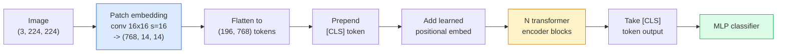

# 视觉Transformer（ViT）

> 将图像切成小块，把每个小块当作一个词，运行标准transformer。别回头。

**类型:** 构建  
**语言:** Python  
**先决知识:** 第7阶段第02课（自注意力），第4阶段第04课（图像分类）  
**时间:** ~45分钟

## 学习目标

- 从零开始实现patch嵌入、可学习位置嵌入、类token和transformer编码器块，构建一个最小的ViT
- 解释为什么在DeiT和MAE证明其可行性之前，ViT被认为需要海量预训练数据
- 从架构先验（无、局部窗口注意力、卷积骨干）的角度比较ViT、Swin和ConvNeXt
- 使用`timm`以及标准的线性探测/微调流程，在小数据集上对预训练的ViT进行微调

## 问题

十年来，卷积是计算机视觉的同义词。CNN拥有强大的归纳偏置——局部性、平移等变性——人们曾认为这是不可替代的。然后，Dosovitskiy等人（2020）表明，一个直接应用于展平图像patch的普通transformer，完全没有卷积机制，在规模上可以匹配甚至超越最好的CNN。

关键在于“规模上”。ViT在ImageNet-1k上输给了ResNet。但在ImageNet-21k或JFT-300M上预训练，然后在ImageNet-1k上微调的ViT，就能击败ResNet。结论是transformer缺乏有用的先验，但可以从足够的数据中学习它们。后续工作（DeiT、MAE、DINO）表明，采用正确的训练方案——强增强、自监督预训练、蒸馏——ViT在小数据上也能训练得很好。

到2026年，纯CNN在边缘设备上仍有竞争力（ConvNeXt是最强的），但transformer主导了其他所有领域：分割（Mask2Former、SegFormer）、检测（DETR、RT-DETR）、多模态（CLIP、SigLIP）、视频（VideoMAE、VJEPA）。ViT的块结构是必须掌握的。

## 概念

### 流水线



七个步骤。Patches -> tokens -> 注意力 -> 分类器。每种变体（DeiT、Swin、ConvNeXt、MAE预训练）都只改变其中的一两个步骤，其余保持不变。

### Patch嵌入

第一个卷积层是关键。核大小16，步长16，这样一张224x224的图像就变成了一个14x14的网格，包含16x16的patch，每个patch被投影到一个768维的嵌入向量。这单个卷积层同时完成了patch化和线性投影。

```
Input:  (3, 224, 224)
Conv (3 -> 768, k=16, s=16, no padding):
Output: (768, 14, 14)
Flatten spatial: (196, 768)
```

196个patch = 196个token。每个token的特征维度是768（ViT-B）、1024（ViT-L）或1280（ViT-H）。

### 类token

一个可学习的向量，被添加到序列的开头：

```
tokens = [CLS; patch_1; patch_2; ...; patch_196]   shape (197, 768)
```

经过N个transformer块后，`[CLS]`的输出就是全局图像表示。分类头只读取这一个向量。

### 位置嵌入

Transformer没有内置的空间位置概念。向每个token添加一个可学习的向量：

```
tokens = tokens + learned_pos_embedding   (also shape (197, 768))
```

该嵌入是模型的一个参数；基于梯度的训练会将其调整为适应2D图像结构。也存在正弦2D的替代方案，但在实践中很少使用。

### Transformer编码器块

标准结构。多头自注意力、MLP、残差连接、前层归一化。

```
x = x + MSA(LN(x))
x = x + MLP(LN(x))

MLP is two-layer with GELU: Linear(d -> 4d) -> GELU -> Linear(4d -> d)
```

ViT-B/16堆叠了12个这样的块，每个块有12个注意力头，总共86M参数。

### 为什么使用前层LN

早期的transformer使用后层LN（`x = LN(x + sublayer(x))`），在不预热的情况下很难训练超过6-8层。前层LN（`x = x + sublayer(LN(x))`）可以在无需预热的情况下稳定地训练更深的网络。每个ViT和每个现代LLM都使用前层LN。

### Patch大小的权衡

- 16x16 patch -> 196个token，标准配置。
- 32x32 patch -> 49个token，更快但分辨率更低。
- 8x8 patch -> 784个token，更精细但O(n^2)的注意力成本扩展性很差。

更大的patch = 更少的token = 更快但空间细节更少。SwinV2在分层窗口中使用4x4的patch。

### DeiT在ImageNet-1k上训练ViT的方案

最初的ViT需要JFT-300M才能击败CNN。DeiT（Touvron等人，2020）通过四个改动，仅在ImageNet-1k上将ViT-B训练到81.8%的top-1准确率：

1. 重度增强：RandAugment、Mixup、CutMix、随机擦除。
2. 随机深度（训练期间随机丢弃整个块）。
3. 重复增强（每批次对同一张图像采样3次）。
4. 从CNN教师模型进行蒸馏（可选，可进一步提升精度）。

所有现代ViT训练方案都源自DeiT。

### Swin vs ConvNeXt

- **Swin**（Liu等人，2021）—— 基于窗口的注意力。每个块在局部窗口内进行注意力计算；交替的块会移动窗口，以混合跨窗口的信息。在保持注意力算子的同时，带回了类似CNN的局部性先验。
- **ConvNeXt**（Liu等人，2022）—— 重新设计的CNN，匹配了Swin的架构选择（深度卷积、LayerNorm、GELU、反向瓶颈）。表明差距不在于“注意力vs卷积”，而在于“现代训练方案+架构”。

到2026年，ConvNeXt-V2和Swin-V2都是生产级的；正确的选择取决于你的推理堆栈（ConvNeXt在边缘设备上编译效果更好）和预训练语料库。

### MAE预训练

掩码自动编码器（He等人，2022）：随机掩码75%的patch，训练编码器仅处理可见的25%，训练一个小型解码器从编码器的输出重建被掩码的patch。预训练后，丢弃解码器并对编码器进行微调。

MAE使得仅在ImageNet-1k上训练ViT成为可能，并达到SOTA水平，是目前默认的自监督预训练方案。

## 动手构建

### 步骤1：Patch嵌入

```python
import torch
import torch.nn as nn

class PatchEmbedding(nn.Module):
    def __init__(self, in_channels=3, patch_size=16, dim=192, image_size=64):
        super().__init__()
        assert image_size % patch_size == 0
        self.proj = nn.Conv2d(in_channels, dim, kernel_size=patch_size, stride=patch_size)
        num_patches = (image_size // patch_size) ** 2
        self.num_patches = num_patches

    def forward(self, x):
        x = self.proj(x)
        return x.flatten(2).transpose(1, 2)
```

一个卷积层，一个展平操作，一个转置。这就是图像到token的全部步骤。

### 步骤2：Transformer块

前层LN、多头自注意力、带GELU的MLP、残差连接。

```python
class Block(nn.Module):
    def __init__(self, dim, num_heads, mlp_ratio=4, dropout=0.0):
        super().__init__()
        self.ln1 = nn.LayerNorm(dim)
        self.attn = nn.MultiheadAttention(dim, num_heads, dropout=dropout, batch_first=True)
        self.ln2 = nn.LayerNorm(dim)
        self.mlp = nn.Sequential(
            nn.Linear(dim, dim * mlp_ratio),
            nn.GELU(),
            nn.Dropout(dropout),
            nn.Linear(dim * mlp_ratio, dim),
            nn.Dropout(dropout),
        )

    def forward(self, x):
        a, _ = self.attn(self.ln1(x), self.ln1(x), self.ln1(x), need_weights=False)
        x = x + a
        x = x + self.mlp(self.ln2(x))
        return x
```

`nn.MultiheadAttention` 处理分头、缩放点积和输出投影。`batch_first=True` 所以形状是 `(N, seq, dim)`。

### 步骤3：ViT

```python
class ViT(nn.Module):
    def __init__(self, image_size=64, patch_size=16, in_channels=3,
                 num_classes=10, dim=192, depth=6, num_heads=3, mlp_ratio=4):
        super().__init__()
        self.patch = PatchEmbedding(in_channels, patch_size, dim, image_size)
        num_patches = self.patch.num_patches
        self.cls_token = nn.Parameter(torch.zeros(1, 1, dim))
        self.pos_embed = nn.Parameter(torch.zeros(1, num_patches + 1, dim))
        self.blocks = nn.ModuleList([
            Block(dim, num_heads, mlp_ratio) for _ in range(depth)
        ])
        self.ln = nn.LayerNorm(dim)
        self.head = nn.Linear(dim, num_classes)
        nn.init.trunc_normal_(self.pos_embed, std=0.02)
        nn.init.trunc_normal_(self.cls_token, std=0.02)

    def forward(self, x):
        x = self.patch(x)
        cls = self.cls_token.expand(x.size(0), -1, -1)
        x = torch.cat([cls, x], dim=1)
        x = x + self.pos_embed
        for blk in self.blocks:
            x = blk(x)
        x = self.ln(x[:, 0])
        return self.head(x)

vit = ViT(image_size=64, patch_size=16, num_classes=10, dim=192, depth=6, num_heads=3)
x = torch.randn(2, 3, 64, 64)
print(f"output: {vit(x).shape}")
print(f"params: {sum(p.numel() for p in vit.parameters()):,}")
```

大约2.8M参数——一个在CPU上可行的小型ViT。真正的ViT-B是86M；相同的类定义，只需使用 `dim=768, depth=12, num_heads=12`。

### 步骤4：健全性检查——单图像推理

```python
logits = vit(torch.randn(1, 3, 64, 64))
print(f"logits: {logits}")
print(f"probs:  {logits.softmax(-1)}")
```

应该能无错误运行。概率和为1。

## 使用

`timm` 提供了每个带ImageNet预训练权重的ViT变体。一行代码：

```python
import timm

model = timm.create_model("vit_base_patch16_224", pretrained=True, num_classes=10)
```

`timm` 是2026年视觉transformer的生产默认选择。支持ViT、DeiT、Swin、Swin-V2、ConvNeXt、ConvNeXt-V2、MaxViT、MViT、EfficientFormer等数十种模型，均使用相同的API。

对于多模态工作（图像+文本），`transformers` 提供了CLIP、SigLIP、BLIP-2、LLaVA。所有这些模型中的图像编码器都是ViT变体。

## 交付

本课产出：

- `outputs/prompt-vit-vs-cnn-picker.md` —— 一个根据数据集大小、计算资源和推理堆栈，在ViT、ConvNeXt或Swin之间进行选择的提示。
- `outputs/skill-vit-patch-and-pos-embed-inspector.md` —— 一个技能，用于验证ViT的patch嵌入和位置嵌入形状是否与模型期望的序列长度匹配，以捕获最常见的移植错误。

## 练习

1. **(简单)** 打印上述小型ViT前向传播过程中每个中间张量的形状。确认：输入 `(N, 3, 64, 64)` -> patches `(N, 16, 192)` -> 带有CLS `(N, 17, 192)` -> 分类器输入 `(N, 192)` -> 输出 `(N, num_classes)`。
2. **(中等)** 使用第4课的synthetic-CIFAR数据集，对预训练的 `timm` ViT-S/16进行微调。与在相同数据上微调的ResNet-18进行比较。报告训练时间和最终准确率。
3. **(困难)** 为小型ViT实现MAE预训练：掩码75%的patch，训练编码器+一个小型解码器来重建被掩码的patch。在预训练前后的合成数据上评估线性探测准确率。

## 关键术语

| 术语 | 常见说法 | 实际含义 |
|------|----------|----------|
| Patch嵌入 | “第一个卷积层” | 一个核大小=步长=patch大小的卷积层；将图像转换为token嵌入的网格 |
| 类token | “[CLS]” | 一个可学习的向量，被添加到token序列的开头；其最终输出是全局图像表示 |
| 位置嵌入 | “可学习的位置编码” | 一个添加到每个token的可学习向量，使transformer知道每个patch的来源位置 |
| 前层LN | “子层前的LayerNorm” | 稳定的transformer变体：`x + sublayer(LN(x))` 而非 `LN(x + sublayer(x))` |
| 多头注意力 | “并行注意力” | 标准的transformer注意力被分成num_heads个独立的子空间，之后再进行拼接 |
| ViT-B/16 | “基础版，patch大小16” | 标准尺寸：dim=768，depth=12，heads=12，patch_size=16，image=224；~86M参数 |
| DeiT | “数据高效的ViT” | 仅使用强增强在ImageNet-1k上训练的ViT；证明了大型预训练数据集并非严格必需 |
| MAE | “掩码自动编码器” | 自监督预训练：掩码75%的patch并进行重建；当前主流的ViT预训练方案 |

## 扩展阅读

- [An Image is Worth 16x16 Words (Dosovitskiy et al., 2020)](https://arxiv.org/abs/2010.11929) —— ViT论文
- [DeiT: Data-efficient Image Transformers (Touvron et al., 2020)](https://arxiv.org/abs/2012.12877) —— 如何仅在ImageNet-1k上训练ViT
- [Masked Autoencoders are Scalable Vision Learners (He et al., 2022)](https://arxiv.org/abs/2111.06377) —— MAE预训练
- [timm documentation](https://huggingface.co/docs/timm) —— 你在生产中会用到的每个视觉transformer的参考文档