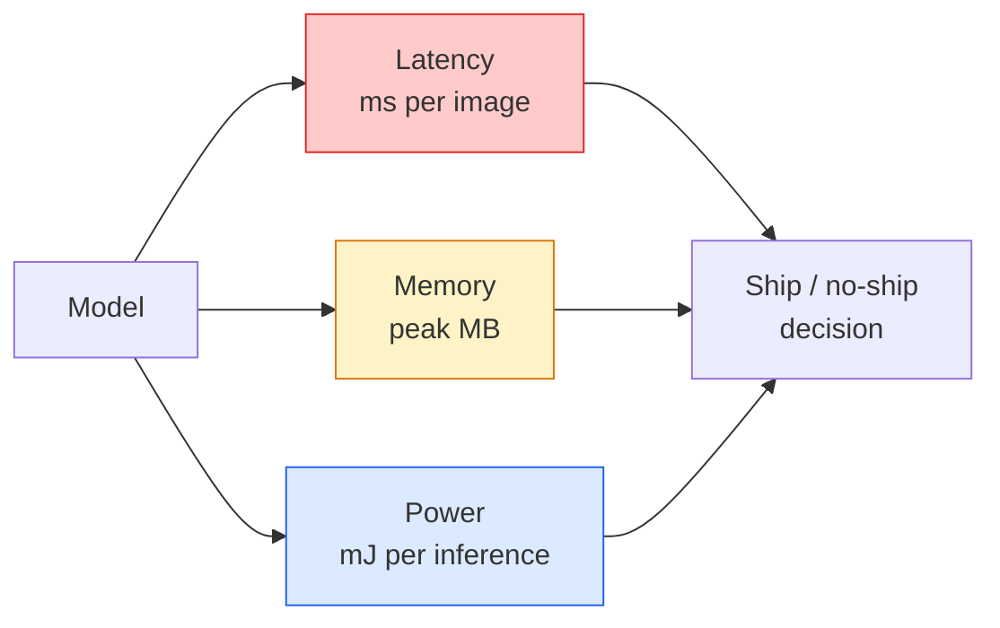

# 实时视觉 — 边缘部署

> 边缘推理是一门在只有2GB RAM的设备上，让一个90%精度的模型以每秒30帧运行的学问。精度的每一个百分点都必须与毫秒级的延迟进行权衡。

**类型：** 学习 + 实践
**语言：** Python
**前提条件：** 第4阶段第04课（图像分类），第10阶段第11课（量化）
**时长：** ~75分钟

## 学习目标

- 为任何PyTorch模型测量推理延迟、峰值内存和吞吐量，并解读FLOPs / 参数量 / 延迟的权衡
- 使用PyTorch的训练后量化将视觉模型量化为INT8，并验证精度损失 < 1%
- 导出为ONNX格式，并使用ONNX Runtime或TensorRT进行编译；指出三种最常见的导出失败及其修复方法
- 解释在边缘设备约束下，何时选择MobileNetV3、EfficientNet-Lite、ConvNeXt-Tiny或MobileViT

## 问题所在

训练时的视觉模型是一个浮点数庞然大物。1亿参数，每次前向传播10 GFLOPs，需要2GB显存。这些都无法适配手机、汽车信息娱乐系统、工业相机或无人机。部署一个视觉系统意味着将同样的预测能力装进一个缩小100倍的预算里。

有三个旋钮负责大部分工作：模型选择（使用相同训练方案的更小架构）、量化（使用INT8代替FP32）和推理运行时（ONNX Runtime、TensorRT、Core ML、TFLite）。正确配置它们，就是能在工作站上运行的演示，与能在30美元摄像头模块上出货的产品之间的区别。

本课首先建立测量规范（无法测量，就无法优化），然后逐一讲解这三个旋钮。目标不是学习每一个边缘运行时，而是了解存在哪些杠杆，以及如何验证每个杠杆是否如预期般工作。

## 概念理解

### 三个预算



- **延迟**：p50、p95、p99。只计算p50平均值会隐藏对实时系统很重要的尾部行为。
- **峰值内存**：设备所见过的最大内存值，而非稳态平均值。这很重要，因为在嵌入式目标上内存溢出是致命的。
- **功耗/能耗**：在电池供电设备上，每次推理消耗的毫焦耳能量。通常用CPU/GPU利用率 * 时间来近似。

一个包含（模型、延迟、内存、精度）的表格是做出边缘决策的依据。每一格的数值都必须在目标设备上测量，而不是在工作站上。

### 测量规范

每个边缘性能剖析都应遵循的三条规则：

1.  在开始测量前，用5-10次虚拟前向传播**预热**模型。冷缓存和JIT编译会产生不具代表性的初始数据。
2.  在计时代码块前后使用 `torch.cuda.synchronize()` **同步**GPU工作负载。否则，你测量到的是内核调度时间，而非内核执行时间。
3.  将**输入尺寸固定**为生产环境分辨率。224x224下的延迟与512x512下的延迟不同。

### FLOPs作为代理指标

FLOPs（每次推理的浮点运算次数）是一个廉价、与设备无关的延迟代理指标。它对于架构比较很有用，但作为绝对的壁钟时间则具有误导性。一个FLOPs高10%的模型，实际运行速度可能快2倍，因为它使用了对硬件友好的操作（深度卷积编译效果好，而大的7x7卷积则不然）。

规则：使用FLOPs进行架构搜索，使用设备上的实测延迟进行部署决策。

### 一分钟了解量化

用INT8替换FP32权重和激活值。模型大小缩小4倍，内存带宽需求降低4倍，在具有INT8内核的硬件上（所有现代移动SoC、所有配备Tensor Cores的NVIDIA GPU）计算量降低2-4倍。在视觉任务上，通过训练后静态量化，精度损失通常在0.1-1个百分点之间。

类型：

- **动态量化** — 将权重量化为INT8，激活值以FP计算。简单，加速有限。
- **静态量化（训练后）** — 量化权重 + 在小型校准集上校准激活值范围。比动态量化快得多。
- **量化感知训练（QAT）** — 在训练过程中模拟量化，使模型学会适应它。精度最高，但需要带标签的数据。

对于视觉任务，训练后静态量化能用5%的工作量获得95%的收益。仅当PTQ的精度损失不可接受时，才使用QAT。

### 剪枝与蒸馏

- **剪枝** — 移除不重要的权重（基于幅值）或通道（结构化）。在过参数化模型上效果好；对于本身已紧凑的架构，用处较小。
- **蒸馏** — 训练一个小型学生模型来模仿大型教师模型的logits。通常能恢复因模型缩小而损失的大部分精度。这是生产环境边缘模型的标准做法。

### 推理运行时

- **PyTorch eager** — 慢，不适合部署。仅用于开发。
- **TorchScript** — 已过时。已被 `torch.compile` 和ONNX导出取代。
- **ONNX Runtime** — 中立的运行时。CPU、CUDA、CoreML、TensorRT、OpenVINO都提供ONNX支持。从此开始。
- **TensorRT** — NVIDIA的编译器。在NVIDIA GPU（工作站和Jetson）上延迟最低。可与ONNX Runtime集成或独立使用。
- **Core ML** — Apple为iOS/macOS提供的运行时。需要 `.mlmodel` 或 `.mlpackage`。
- **TFLite** — Google为Android/ARM提供的运行时。需要 `.tflite`。
- **OpenVINO** — Intel为CPU/VPU提供的运行时。需要 `.xml` + `.bin`。

实践中：将PyTorch导出为ONNX -> 然后为目标设备选择运行时。ONNX是通用语言。

### 边缘架构选择器

| 预算 | 模型 | 理由 |
|--------|-------|-----|
| < 300万参数 | MobileNetV3-Small | 到处都能编译，良好的基线 |
| 3-1000万 | EfficientNet-Lite-B0 | 在TFLite上每参数精度最高 |
| 10-2000万 | ConvNeXt-Tiny | 每参数精度最高，对CPU友好 |
| 20-3000万 | MobileViT-S 或 EfficientViT | 具有ImageNet精度的Transformer |
| 30-8000万 | Swin-V2-Tiny | 如果技术栈支持窗口注意力 |

除非有特定原因，否则将所有这些模型量化为INT8。

## 动手实践

### 步骤1：正确测量延迟

```python
import time
import torch

def measure_latency(model, input_shape, device="cpu", warmup=10, iters=50):
    model = model.to(device).eval()
    x = torch.randn(input_shape, device=device)
    with torch.no_grad():
        for _ in range(warmup):
            model(x)
        if device == "cuda":
            torch.cuda.synchronize()
        times = []
        for _ in range(iters):
            if device == "cuda":
                torch.cuda.synchronize()
            t0 = time.perf_counter()
            model(x)
            if device == "cuda":
                torch.cuda.synchronize()
            times.append((time.perf_counter() - t0) * 1000)
    times.sort()
    return {
        "p50_ms": times[len(times) // 2],
        "p95_ms": times[int(len(times) * 0.95)],
        "p99_ms": times[int(len(times) * 0.99)],
        "mean_ms": sum(times) / len(times),
    }
```

预热、同步、使用 `time.perf_counter()`。报告百分位数，而非仅报告平均值。

### 步骤2：参数量和FLOP计数

```python
def parameter_count(model):
    return sum(p.numel() for p in model.parameters())

def flops_estimate(model, input_shape):
    """
    Rough FLOP count for a conv/linear-only model. For production use `fvcore` or `ptflops`.
    """
    total = 0
    def conv_hook(m, inp, out):
        nonlocal total
        c_out, c_in, kh, kw = m.weight.shape
        h, w = out.shape[-2:]
        total += 2 * c_in * c_out * kh * kw * h * w
    def linear_hook(m, inp, out):
        nonlocal total
        total += 2 * m.in_features * m.out_features
    hooks = []
    for m in model.modules():
        if isinstance(m, torch.nn.Conv2d):
            hooks.append(m.register_forward_hook(conv_hook))
        elif isinstance(m, torch.nn.Linear):
            hooks.append(m.register_forward_hook(linear_hook))
    model.eval()
    with torch.no_grad():
        model(torch.randn(input_shape))
    for h in hooks:
        h.remove()
    return total
```

对于实际项目，使用 `fvcore.nn.FlopCountAnalysis` 或 `ptflops`；它们能正确处理所有模块类型。

### 步骤3：训练后静态量化

```python
def quantise_ptq(model, calibration_loader, backend="x86"):
    import torch.ao.quantization as tq
    model = model.eval().cpu()
    model.qconfig = tq.get_default_qconfig(backend)
    tq.prepare(model, inplace=True)
    with torch.no_grad():
        for x, _ in calibration_loader:
            model(x)
    tq.convert(model, inplace=True)
    return model
```

三个步骤：配置、准备（插入观察者）、使用真实数据校准、转换（融合 + 量化）。需要模型被融合（`Conv -> BN -> ReLU` -> `ConvBnReLU`），`torch.ao.quantization.fuse_modules` 会处理这个。

### 步骤4：导出为ONNX

```python
def export_onnx(model, sample_input, path="model.onnx"):
    model = model.eval()
    torch.onnx.export(
        model,
        sample_input,
        path,
        input_names=["input"],
        output_names=["output"],
        dynamic_axes={"input": {0: "batch"}, "output": {0: "batch"}},
        opset_version=17,
    )
    return path
```

`opset_version=17` 在2026年是安全的默认选项。`dynamic_axes` 让你可以用任意批大小运行ONNX模型。

### 步骤5：基准测试并比较不同方案

```python
import torch.nn as nn
from torchvision.models import mobilenet_v3_small

def compare_regimes():
    model = mobilenet_v3_small(weights=None, num_classes=10)
    params = parameter_count(model)
    flops = flops_estimate(model, (1, 3, 224, 224))
    lat_fp32 = measure_latency(model, (1, 3, 224, 224), device="cpu")
    print(f"FP32 MobileNetV3-Small: {params:,} params  {flops/1e9:.2f} GFLOPs  "
          f"p50={lat_fp32['p50_ms']:.2f}ms  p95={lat_fp32['p95_ms']:.2f}ms")
```

对 `resnet50`、`efficientnet_v2_s` 和 `convnext_tiny` 运行相同的函数，你就能得到做出部署决策所需的比较表格。

## 实际应用

生产技术栈通常会收敛到以下三种路径之一：

- **Web / 无服务器**：PyTorch -> ONNX -> ONNX Runtime（CPU或CUDA提供程序）。最简单，对大多数情况足够好。
- **NVIDIA边缘（Jetson，GPU服务器）**：PyTorch -> ONNX -> TensorRT。延迟最低，工程量最大。
- **移动端**：PyTorch -> ONNX -> Core ML（iOS）或 TFLite（Android）。导出前先量化。

对于性能测量，`torch-tb-profiler`、`nvprof` / `nsys` 以及macOS上的Instruments可以提供逐层分析。`benchmark_app`（OpenVINO）和 `trtexec`（TensorRT）提供独立的CLI数据。

## 成果交付

本课将产出：

- `outputs/prompt-edge-deployment-planner.md` — 一个提示词，可根据目标设备和延迟SLA，选择骨干网络、量化策略和运行时。
- `outputs/skill-latency-profiler.md` — 一项技能，可编写一个完整的延迟基准测试脚本，包含预热、同步、百分位数和内存追踪。

## 练习

1.  **（简单）** 在CPU上测量 `resnet18`、`mobilenet_v3_small`、`efficientnet_v2_s` 和 `convnext_tiny` 在224x224分辨率下的p50延迟。报告表格，并指出哪种架构的每毫秒精度最高。
2.  **（中等）** 对 `mobilenet_v3_small` 应用训练后静态量化。报告FP32与INT8的延迟以及在CIFAR-10或类似数据集的留出子集上的精度损失。
3.  **（困难）** 将 `convnext_tiny` 导出为ONNX，使用 `onnxruntime` 和 `CPUExecutionProvider` 运行它，并与PyTorch eager基线比较延迟。指出ONNX Runtime更快的第一层，并解释原因。

## 关键术语

| 术语 | 人们怎么说 | 它的实际含义 |
|------|----------------|----------------------|
| 延迟 | "多快" | 从输入到输出的时间；p50/p95/p99百分位数，而非平均值 |
| FLOPs | "模型大小" | 每次前向传播的浮点运算数；计算成本的粗略代理 |
| INT8量化 | "8位" | 用8位整数替换FP32权重/激活值；缩小约4倍，快2-4倍 |
| PTQ | "训练后量化" | 量化一个已训练模型而无需重新训练；简单，通常足够 |
| QAT | "量化感知训练" | 在训练过程中模拟量化；精度最高，需要带标签数据 |
| ONNX | "中立格式" | 所有主流推理运行时支持的模型交换格式 |
| TensorRT | "NVIDIA编译器" | 将ONNX编译为针对NVIDIA GPU优化的引擎 |
| 蒸馏 | "教师 -> 学生" | 训练小模型模仿大模型的logits；恢复大部分损失的精度 |

## 扩展阅读

- [EfficientNet (Tan & Le, 2019)](https://arxiv.org/abs/1905.11946) — 高效架构的复合缩放
- [MobileNetV3 (Howard et al., 2019)](https://arxiv.org/abs/1905.02244) — 移动优先的架构，采用h-swish和squeeze-excite
- [TensorRT优化实践指南 (NVIDIA)](https://developer.nvidia.com/blog/accelerating-model-inference-with-tensorrt-tips-and-best-practices-for-pytorch-users/) — 如何实际获得论文中提到的吞吐量数字
- [ONNX Runtime文档](https://onnxruntime.ai/docs/) — 量化、图优化、提供程序选择