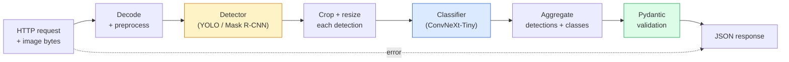

# 构建完整视觉处理流程 — 毕业项目

> 生产环境视觉系统是一系列通过数据契约串联的模型和规则。此阶段已包含所有组件；毕业项目将它们端到端连接起来。

**类型：** 实践构建
**语言：** Python
**先决条件：** 第四阶段 课程01-15
**时长：** 约120分钟

## 学习目标

- 设计一个生产级视觉处理流程，实现物体检测、分类并输出结构化JSON，同时处理所有失败路径
- 将检测器（Mask R-CNN或YOLO）、分类器（ConvNeXt-Tiny）和数据契约（Pydantic）集成到单一服务中
- 对端到端流程进行基准测试，识别首个性能瓶颈（通常是预处理，然后是检测器）
- 部署一个最小化FastAPI服务，接受图像上传，运行处理流程，并返回带分类结果的检测信息

## 问题所在

单个视觉模型虽有用，但视觉产品是多个模型的组合。零售货架审计是检测器加产品分类器加价格OCR流水线。自动驾驶是2D检测器加3D检测器加分割器加跟踪器加规划器。医学预筛是分割器加区域分类器加医生界面。

将这些模型串联起来，正是区分机器学习原型与成熟产品的关键。模型间的每个接口都可能滋生缺陷。每个坐标变换、每个标准化操作、每个掩码尺寸调整都可能导致静默失败。流水线的强度取决于其最薄弱的接口。

本毕业项目搭建最小可行流水线：检测 + 分类 + 结构化输出 + 服务层。第四阶段的所有其他内容都可嵌入此骨架：将Mask R-CNN换成YOLOv8、添加OCR头、添加分割分支、添加跟踪器。架构稳定，各组件可插拔。

## 核心概念

### 处理流水线



七个阶段。两个模型阶段消耗资源最多；另外五个阶段是缺陷高发区。

### 使用Pydantic的数据契约

每个模型边界都定义为类型化对象，将静默失败转化为明确错误。

```
Detection(
    box: tuple[float, float, float, float],   # (x1, y1, x2, y2), absolute pixels
    score: float,                              # [0, 1]
    class_id: int,                             # from detector's label map
    mask: Optional[list[list[int]]],           # RLE-encoded if present
)

PipelineResult(
    image_id: str,
    detections: list[Detection],
    classifications: list[Classification],
    inference_ms: float,
)
```

当检测器返回的边界框坐标为`(cx, cy, w, h)`而非`(x1, y1, x2, y2)`时，Pydantic验证会在边界处失败，让你立即发现问题，而不是调试下游裁剪操作返回的空区域。

### 延迟分布规律

几乎所有视觉流程都遵循三个规律：

1. **预处理通常是最耗时的单一模块。** JPEG解码、色彩空间转换、尺寸调整——这些是CPU密集型操作且容易被忽略。
2. **检测器主导GPU时间。** 70-90%的GPU时间消耗在检测前向传播。
3. **后处理（NMS、RLE编解码）在GPU上成本低，在CPU上成本高。** 务必针对实际目标环境进行性能分析。

了解延迟分布才能将优化工作转化为优先级列表。

### 失败模式处理

- **空检测结果** — 返回空列表，不崩溃。记录日志。
- **越界边界框** — 裁剪前先将坐标限制在图像尺寸范围内。
- **微小裁剪区域** — 对小于分类器最小输入尺寸的边界框跳过分类。
- **损坏的上传文件** — 返回400响应及特定错误码，而非500。
- **模型加载失败** — 在服务启动时失败，而非首次请求时。

生产级流程需处理每种情况，避免使用掩盖失败的通用`try/except`。每类失败都应有命名代码和相应响应。

### 批处理机制

生产服务需应对多个客户端。跨请求批处理检测和分类可倍增吞吐量。权衡代价是：等待批次填充带来的额外延迟。典型配置：收集请求最多20毫秒，批量处理，然后分发响应。`torchserve`和`triton`原生支持此功能；负载可预测的小型服务可自建微批处理器。

## 构建步骤

### 第一步：定义数据契约

```python
from pydantic import BaseModel, Field
from typing import List, Optional, Tuple

class Detection(BaseModel):
    box: Tuple[float, float, float, float]
    score: float = Field(ge=0, le=1)
    class_id: int = Field(ge=0)
    mask_rle: Optional[str] = None


class Classification(BaseModel):
    detection_index: int
    class_id: int
    class_name: str
    score: float = Field(ge=0, le=1)


class PipelineResult(BaseModel):
    image_id: str
    detections: List[Detection]
    classifications: List[Classification]
    inference_ms: float
```

五行代码能在任何严肃流水线上节省一小时调试时间。

### 第二步：创建最小化流水线类

```python
import time
import numpy as np
import torch
from PIL import Image

class VisionPipeline:
    def __init__(self, detector, classifier, class_names,
                 device="cpu", min_crop=32):
        self.detector = detector.to(device).eval()
        self.classifier = classifier.to(device).eval()
        self.class_names = class_names
        self.device = device
        self.min_crop = min_crop

    def preprocess(self, image):
        """
        image: PIL.Image or np.ndarray (H, W, 3) uint8
        returns: CHW float tensor on device
        """
        if isinstance(image, Image.Image):
            image = np.asarray(image.convert("RGB"))
        tensor = torch.from_numpy(image).permute(2, 0, 1).float() / 255.0
        return tensor.to(self.device)

    @torch.no_grad()
    def detect(self, image_tensor):
        return self.detector([image_tensor])[0]

    @torch.no_grad()
    def classify(self, crops):
        if len(crops) == 0:
            return []
        batch = torch.stack(crops).to(self.device)
        logits = self.classifier(batch)
        probs = logits.softmax(-1)
        scores, cls = probs.max(-1)
        return list(zip(cls.tolist(), scores.tolist()))

    def run(self, image, image_id="anonymous"):
        t0 = time.perf_counter()
        tensor = self.preprocess(image)
        det = self.detect(tensor)

        crops = []
        detections = []
        valid_indices = []
        for i, (box, score, cls) in enumerate(zip(det["boxes"], det["scores"], det["labels"])):
            x1, y1, x2, y2 = [max(0, int(b)) for b in box.tolist()]
            x2 = min(x2, tensor.shape[-1])
            y2 = min(y2, tensor.shape[-2])
            detections.append(Detection(
                box=(x1, y1, x2, y2),
                score=float(score),
                class_id=int(cls),
            ))
            if (x2 - x1) < self.min_crop or (y2 - y1) < self.min_crop:
                continue
            crop = tensor[:, y1:y2, x1:x2]
            crop = torch.nn.functional.interpolate(
                crop.unsqueeze(0),
                size=(224, 224),
                mode="bilinear",
                align_corners=False,
            )[0]
            crops.append(crop)
            valid_indices.append(i)

        class_preds = self.classify(crops)

        classifications = []
        for valid_idx, (cls_id, cls_score) in zip(valid_indices, class_preds):
            classifications.append(Classification(
                detection_index=valid_idx,
                class_id=int(cls_id),
                class_name=self.class_names[cls_id],
                score=float(cls_score),
            ))

        return PipelineResult(
            image_id=image_id,
            detections=detections,
            classifications=classifications,
            inference_ms=(time.perf_counter() - t0) * 1000,
        )
```

每个接口都有类型定义。每个失败路径都有具体处理策略。

### 第三步：集成检测器与分类器

```python
from torchvision.models.detection import maskrcnn_resnet50_fpn_v2
from torchvision.models import convnext_tiny

# Use ImageNet-pretrained weights for a realistic pipeline without training
detector = maskrcnn_resnet50_fpn_v2(weights="DEFAULT")
classifier = convnext_tiny(weights="DEFAULT")
class_names = [f"imagenet_class_{i}" for i in range(1000)]

pipe = VisionPipeline(detector, classifier, class_names)

# Smoke test with a synthetic image
test_image = (np.random.rand(400, 600, 3) * 255).astype(np.uint8)
result = pipe.run(test_image, image_id="demo")
print(result.model_dump_json(indent=2)[:500])
```

### 第四步：FastAPI服务实现

```python
from fastapi import FastAPI, UploadFile, HTTPException
from io import BytesIO

app = FastAPI()
pipe = None  # initialised on startup

@app.on_event("startup")
def load():
    global pipe
    detector = maskrcnn_resnet50_fpn_v2(weights="DEFAULT").eval()
    classifier = convnext_tiny(weights="DEFAULT").eval()
    pipe = VisionPipeline(detector, classifier, class_names=[f"c{i}" for i in range(1000)])

@app.post("/detect")
async def detect_endpoint(file: UploadFile):
    if file.content_type not in {"image/jpeg", "image/png", "image/webp"}:
        raise HTTPException(status_code=400, detail="unsupported image type")
    data = await file.read()
    try:
        img = Image.open(BytesIO(data)).convert("RGB")
    except Exception:
        raise HTTPException(status_code=400, detail="cannot decode image")
    result = pipe.run(img, image_id=file.filename or "upload")
    return result.model_dump()
```

使用`uvicorn main:app --host 0.0.0.0 --port 8000`运行。用`curl -F 'file=@dog.jpg' http://localhost:8000/detect`测试。

### 第五步：流水线性能基准测试

```python
import time

def benchmark(pipe, num_runs=20, image_size=(400, 600)):
    img = (np.random.rand(*image_size, 3) * 255).astype(np.uint8)
    pipe.run(img)  # warm up

    stages = {"preprocess": [], "detect": [], "classify": [], "total": []}
    for _ in range(num_runs):
        t0 = time.perf_counter()
        tensor = pipe.preprocess(img)
        t1 = time.perf_counter()
        det = pipe.detect(tensor)
        t2 = time.perf_counter()
        crops = []
        for box in det["boxes"]:
            x1, y1, x2, y2 = [max(0, int(b)) for b in box.tolist()]
            x2 = min(x2, tensor.shape[-1])
            y2 = min(y2, tensor.shape[-2])
            if (x2 - x1) >= pipe.min_crop and (y2 - y1) >= pipe.min_crop:
                crop = tensor[:, y1:y2, x1:x2]
                crop = torch.nn.functional.interpolate(
                    crop.unsqueeze(0), size=(224, 224), mode="bilinear", align_corners=False
                )[0]
                crops.append(crop)
        pipe.classify(crops)
        t3 = time.perf_counter()
        stages["preprocess"].append((t1 - t0) * 1000)
        stages["detect"].append((t2 - t1) * 1000)
        stages["classify"].append((t3 - t2) * 1000)
        stages["total"].append((t3 - t0) * 1000)

    for stage, times in stages.items():
        times.sort()
        print(f"{stage:12s}  p50={times[len(times)//2]:7.1f} ms  p95={times[int(len(times)*0.95)]:7.1f} ms")
```

CPU典型输出：预处理~3毫秒，检测300-500毫秒，分类20-40毫秒，总计350-550毫秒。在GPU上检测仅需20-40毫秒，预处理+分类的相对重要性将显著增加。

## 实际应用

生产环境模板通常趋同以下结构，并扩展：

- **模型版本控制** — 始终在响应中记录模型名称和权重哈希值
- **每请求追踪ID** — 记录每个请求各阶段耗时，便于关联慢请求与具体阶段
- **降级路径** — 若分类超时，返回未分类的检测结果而非整个请求失败
- **安全过滤器** — NSFW/PII过滤器在分类后、响应离开服务前运行
- **批量端点** — 提供接受图像URL列表的`/detect_batch`用于批量处理

生产环境部署时，`torchserve`、`Triton Inference Server`和`BentoML`可原生处理批处理、版本控制、指标监控和健康检查。原型和小规模产品直接运行`FastAPI`即可。

## 交付成果

本课程产出：

- `outputs/prompt-vision-service-shape-reviewer.md` — 审查视觉服务代码是否存在契约/响应格式违规，并指出首个破坏性缺陷的提示词
- `outputs/skill-pipeline-budget-planner.md` — 根据目标延迟和吞吐量，为流水线各阶段分配时间预算并识别最先超支阶段的技能

## 实践练习

1. **（简单）** 在任意开放数据集的10张图像上运行流水线。报告各阶段平均耗时及每张图像的检测数量分布。
2. **（中等）** 向`Detection`添加掩码输出字段并用RLE编码。验证即使包含10个物体的图像，JSON大小仍低于1MB。
3. **（困难）** 在分类器前添加微批处理器：收集裁剪区域最多10毫秒，在一次GPU调用中完成所有分类，按请求返回结果。测量每秒5个并发请求下的吞吐量增益和增加的延迟。

## 关键术语

| 术语 | 常见说法 | 实际含义 |
|------|----------|----------|
| 流水线（Pipeline） | "系统" | 预处理、推理和后处理的有序链路，各阶段间通过类型化接口连接 |
| 数据契约（Data contract） | "模式" | Pydantic/dataclass定义，确保各阶段输入输出符合规范；在边界捕获集成缺陷 |
| 预处理（Preprocessing） | "模型前处理" | 解码、色彩转换、尺寸调整、标准化；通常是最大的CPU时间消耗源 |
| 后处理（Postprocessing） | "模型后处理" | NMS、掩码尺寸调整、阈值处理、RLE编码；在GPU上成本低，在CPU上成本高 |
| 微批处理器（Microbatcher） | "收集后转发" | 等待固定时间窗口收集多个请求，执行单次批量化前向传播的聚合器 |
| 追踪ID（Trace ID） | "请求ID" | 每个请求在每阶段记录的标识符，用于端到端追踪慢请求 |
| 失败代码（Failure code） | "命名错误" | 针对每类失败的具体错误码，替代通用500错误；支持客户端重试逻辑 |
| 健康检查（Health check） | "就绪探针" | 报告服务能否响应的低成本端点；负载均衡器依赖此机制 |

## 延伸阅读

- [全栈深度学习 — 模型部署](https://fullstackdeeplearning.com/course/2022/lecture-5-deployment/) — 生产环境机器学习部署的权威概述
- [BentoML文档](https://docs.bentoml.com) — 支持批处理、版本控制和指标监控的服务框架
- [torchserve文档](https://pytorch.org/serve/) — PyTorch官方服务库
- [NVIDIA Triton推理服务器](https://developer.nvidia.com/triton-inference-server) — 支持批处理和多模型的高吞吐量服务