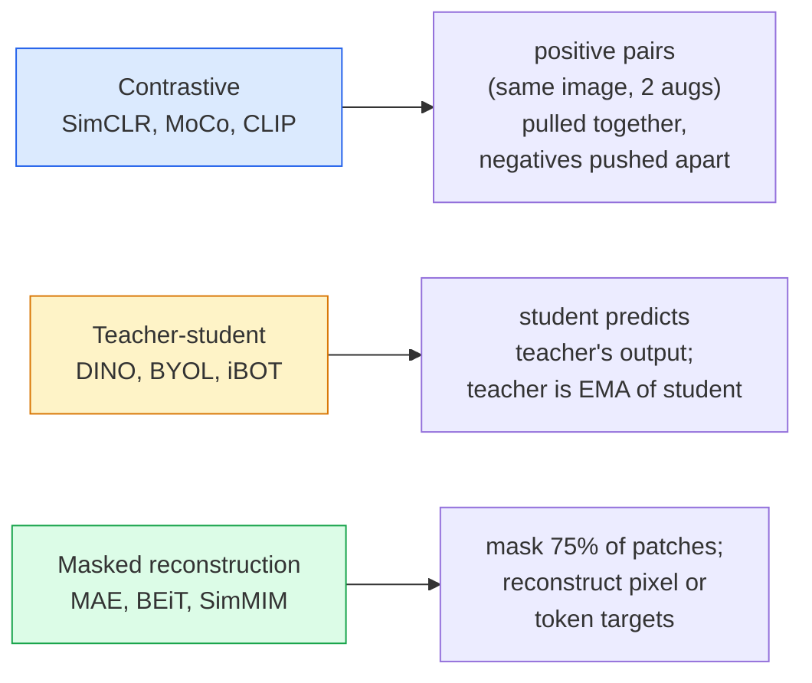

# 自监督视觉 — SimCLR、DINO、MAE

> 标签是监督视觉的瓶颈。自监督预训练移除了它们：从1亿无标签图像中学习视觉特征，在1万张有标签图像上进行微调。

**类型：** 学习 + 实践
**语言：** Python
**前置课程：** 第4阶段 第04课（图像分类），第4阶段 第14课（ViT）
**时长：** ~75分钟

## 学习目标

- 追溯三大自监督学习家族——对比学习（SimCLR）、教师-学生（DINO）、掩码重建（MAE）——并阐述各自优化目标
- 从零实现InfoNCE损失，并解释为何批量大小512有效而32无效
- 解释MAE的75%掩码比例并非随意设定，及其与BERT文本15%掩码的差异
- 使用DINOv2或MAE ImageNet检查点进行线性探测和零样本检索

## 问题所在

监督学习下的ImageNet包含130万张带标签图像，标注成本估计高达1000万美元。医学和工业数据集更小，标注成本却更高。每个视觉团队都在问：能否先用廉价的无标签数据（YouTube视频帧、网络爬取图像、摄像头画面、卫星扫描图）进行预训练，再用小型带标签集进行微调？

自监督学习给出了答案。现代自监督ViT在LAION或JFT上训练后，微调时能达到甚至超越监督学习在ImageNet上的准确率。相比监督预训练，它在下游任务（检测、分割、深度估计）上迁移效果更好。DINOv2（Meta, 2023）和MAE（Meta, 2022）是当前生产环境中迁移性视觉特征的默认选择。

概念上的转变在于：前置任务——模型被训练执行的任务——不必与下游任务相同。关键在于它迫使模型学习有用的特征。预测灰度图像的颜色、旋转图像并让模型分类旋转角度、遮盖图像块并重建它们——这些都已被证明有效。三种可规模化的方法是：对比学习、教师-学生蒸馏和掩码重建。

## 核心概念

### 三大家族



### 对比学习（SimCLR）

取一张图像，施加两种随机增强，获得两个视图。将两者输入同一个编码器加上一个投影头。最小化一个损失函数，该损失要求"这两个嵌入应靠近"且"该嵌入应远离批次中其他所有图像的嵌入"。

```
Loss for positive pair (z_i, z_j) among 2N views per batch:

   L_ij = -log( exp(sim(z_i, z_j) / tau) / sum_k in batch \ {i} exp(sim(z_i, z_k) / tau) )

sim = cosine similarity
tau = temperature (0.1 standard)
```

这就是InfoNCE损失。它要求每个正样本对应大量负样本，因此批量大小至关重要——SimCLR需要512-8192。MoCo引入了历史批次的动量队列，将负样本数量与批量大小解耦。

### 教师-学生（DINO）

两个结构相同的网络：学生和教师。教师权重是学生权重的指数移动平均（EMA）。两者都看到图像的增强视图。学生的输出被训练来匹配教师的输出——无需显式负样本。

```
loss = CE( student_output(view_1),  teacher_output(view_2) )
     + CE( student_output(view_2),  teacher_output(view_1) )

teacher_weights = m * teacher_weights + (1 - m) * student_weights   (m ≈ 0.996)
```

为何不会坍缩为"预测常数"：教师的输出经过中心化（减去各维度的均值）和锐化（除以较小的温度参数）。中心化防止某一维度主导；锐化防止输出坍缩为均匀分布。

DINO是DINOv2的规模化版本，使用了1.42亿张精选图像。其产出的特征是当前零样本视觉检索和密集预测的SOTA。

### 掩码重建（MAE）

遮盖ViT输入中75%的图像块。仅将可见的25%输入编码器。一个小型解码器接收编码器的输出以及掩码位置的掩码token，并被训练来重建被遮盖图像块的像素。

```
Encoder:  visible 25% of patches -> features
Decoder:  features + mask tokens at masked positions -> reconstructed pixels
Loss:     MSE between reconstructed and original pixels on masked patches only
```

使MAE工作的关键设计选择：

- **75%的掩码比例** — 很高。迫使编码器学习语义特征；重建25%几乎轻而易举（相邻像素相关性极强，CNN都能轻松处理）。
- **非对称的编码器/解码器** — 大型ViT编码器仅看到可见图像块；小型解码器（8层，512维）负责重建。预训练速度比朴素BEiT快3倍。
- **像素空间重建目标** — 比BEiT的token化目标更简单，在ViT上效果更好。

预训练后，丢弃解码器。编码器即为特征提取器。

### 为何是75%而非15%

BERT遮盖15%的token。MAE遮盖75%。差异在于信息密度。

- 自然语言每个token的熵较高。预测15%的token仍很困难，因为每个被遮盖位置都有多种合理的补全方式。
- 图像块的熵较低——一个未被遮盖的邻域通常能几乎精确确定被遮盖块的像素。为了使预测需要语义理解，必须大幅遮盖。

75%的比例足够高，使得简单的空间外推无法解决问题；编码器必须表征图像内容。

### 线性探测评估

自监督预训练后，标准评估方法是**线性探测**：冻结编码器，在其顶部训练一个线性分类器（基于ImageNet标签）。报告Top-1准确率。

- SimCLR ResNet-50: ~71% (2020)
- DINO ViT-S/16: ~77% (2021)
- MAE ViT-L/16: ~76% (2022)
- DINOv2 ViT-g/14: ~86% (2023)

线性探测是特征质量的纯粹度量；微调通常能再提升2-5个点，但也会混入头部重训练的效果。

## 动手实现

### 步骤1：双视图增强流水线

```python
import torch
import torchvision.transforms as T

two_view_train = lambda: T.Compose([
    T.RandomResizedCrop(96, scale=(0.2, 1.0)),
    T.RandomHorizontalFlip(),
    T.ColorJitter(0.4, 0.4, 0.4, 0.1),
    T.RandomGrayscale(p=0.2),
    T.ToTensor(),
])


class TwoViewDataset(torch.utils.data.Dataset):
    def __init__(self, base):
        self.base = base
        self.aug = two_view_train()

    def __len__(self):
        return len(self.base)

    def __getitem__(self, i):
        img, _ = self.base[i]
        v1 = self.aug(img)
        v2 = self.aug(img)
        return v1, v2
```

每个__getitem__返回同一张图像的两个增强视图；不需要标签。

### 步骤2：InfoNCE损失

```python
import torch.nn.functional as F

def info_nce(z1, z2, tau=0.1):
    """
    z1, z2: (N, D) L2-normalised embeddings of paired views
    """
    N, D = z1.shape
    z = torch.cat([z1, z2], dim=0)  # (2N, D)
    sim = z @ z.T / tau              # (2N, 2N)

    mask = torch.eye(2 * N, dtype=torch.bool, device=z.device)
    sim = sim.masked_fill(mask, float("-inf"))

    targets = torch.cat([torch.arange(N, 2 * N), torch.arange(0, N)]).to(z.device)
    return F.cross_entropy(sim, targets)
```

调用前需对嵌入进行L2归一化。`tau=0.1`是SimCLR的默认值；值越低损失越锐利，需要更多负样本。

### 步骤3：InfoNCE一致性检查

```python
z1 = F.normalize(torch.randn(16, 32), dim=-1)
z2 = z1.clone()
loss_same = info_nce(z1, z2, tau=0.1).item()
z2_random = F.normalize(torch.randn(16, 32), dim=-1)
loss_random = info_nce(z1, z2_random, tau=0.1).item()
print(f"InfoNCE with identical pairs:  {loss_same:.3f}")
print(f"InfoNCE with random pairs:     {loss_random:.3f}")
```

相同的配对应给出低损失（对于大批量和冷温度，接近0）。随机配对应给出log(2N-1) ≈ log(31) ≈ 3.4（对于16对样本的批量）。

### 步骤4：MAE式掩码

```python
def random_mask_indices(num_patches, mask_ratio=0.75, seed=0):
    g = torch.Generator().manual_seed(seed)
    n_keep = int(num_patches * (1 - mask_ratio))
    perm = torch.randperm(num_patches, generator=g)
    visible = perm[:n_keep]
    masked = perm[n_keep:]
    return visible.sort().values, masked.sort().values


num_patches = 196
visible, masked = random_mask_indices(num_patches, mask_ratio=0.75)
print(f"visible: {len(visible)} / {num_patches}")
print(f"masked:  {len(masked)} / {num_patches}")
```

简单、快速，且对于给定种子是确定性的。真正的MAE实现会对批量进行此操作并保持每样本的掩码。

## 使用它

DINOv2是2026年的生产标准：

```python
import torch
from transformers import AutoImageProcessor, AutoModel

processor = AutoImageProcessor.from_pretrained("facebook/dinov2-base")
model = AutoModel.from_pretrained("facebook/dinov2-base")
model.eval()

# Per-image embeddings for zero-shot retrieval
with torch.no_grad():
    inputs = processor(images=[pil_image], return_tensors="pt")
    outputs = model(**inputs)
    embedding = outputs.last_hidden_state[:, 0]  # CLS token
```

生成的768维嵌入是现代图像检索、密集对应和零样本迁移流水线的骨干。在下游任务上微调通常只需一个线性头部。

对于图像-文本嵌入，SigLIP或OpenCLIP是等价选择；对于MAE式微调，`timm`仓库提供了所有MAE检查点。

## 交付它

本课程产出：

- `outputs/prompt-ssl-pretraining-picker.md` — 一个提示词，根据数据集大小、计算资源和下游任务选择SimCLR/MAE/DINOv2。
- `outputs/skill-linear-probe-runner.md` — 一个技能，为任何冻结编码器+带标签数据集编写线性探测评估代码。

## 练习

1. **（简单）** 验证当降低温度时，对于对齐良好的嵌入InfoNCE损失下降，而对于随机嵌入则上升。绘制`tau in [0.05, 0.1, 0.2, 0.5]`与损失的关系图。
2. **（中等）** 实现一个DINO风格的中心缓冲区。展示若不进行中心化，学生将在几个周期内坍缩为常数向量。
3. **（困难）** 使用第10课的TinyUNet作为骨干，在CIFAR-100上训练MAE。报告在10、50和200个周期时的线性探测准确率。展示MAE预训练的线性探测在相同的1000张图像子集上优于从零开始的监督线性探测。

## 关键术语

| 术语 | 人们常说 | 其实际含义 |
|------|----------|------------|
| 自监督 | "无标签" | 一种从无标签数据中产生有用表征的前置任务 |
| 前置任务 | "假任务" | SSL期间使用的目标（重建图像块、匹配视图）；预训练后被丢弃 |
| 线性探测 | "冻结编码器+线性头部" | 标准SSL评估：仅在冻结特征顶部训练线性分类器 |
| InfoNCE | "对比损失" | 基于余弦相似度的softmax；正样本对为目标类别，其余均为负样本 |
| EMA教师 | "移动平均教师" | 教师权重是学生权重的指数移动平均；用于BYOL、MoCo、DINO |
| 掩码比例 | "被隐藏的图像块百分比" | MAE期间被遮盖的图像块比例；视觉任务中为75%，文本任务中为15% |
| 表征坍缩 | "常数输出" | SSL失败模式，编码器对所有输入输出常数向量；通过中心化、锐化或负样本防止 |
| DINOv2 | "生产级SSL骨干" | Meta的2023年自监督ViT；2026年最强的通用图像特征 |

## 扩展阅读

- [SimCLR (Chen et al., 2020)](https://arxiv.org/abs/2002.05709) — 对比学习参考
- [DINO (Caron et al., 2021)](https://arxiv.org/abs/2104.14294) — 带动量、中心化、锐化的教师-学生
- [MAE (He et al., 2022)](https://arxiv.org/abs/2111.06377) — ViT的掩码自编码器预训练
- [DINOv2 (Oquab et al., 2023)](https://arxiv.org/abs/2304.07193) — 将自监督ViT扩展为生产级特征