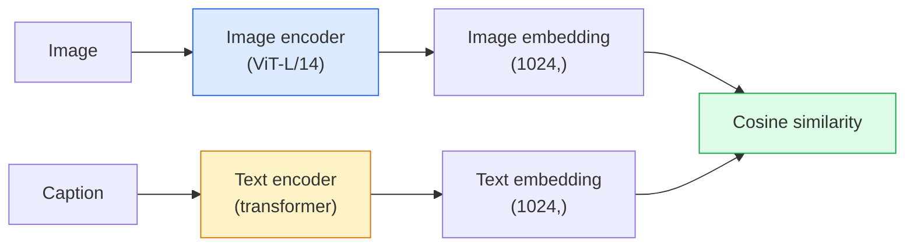

# 开放词汇视觉 — CLIP

> 将图像编码器和文本编码器一起训练，使得匹配的（图像，标题）对在共享空间中落在同一点。这就是全部诀窍。

**类型：** 构建 + 使用
**语言：** Python
**前提知识：** 阶段4 第14课（ViT），阶段4 第17课（自监督）
**时间：** 约45分钟

## 学习目标

- 解释CLIP的双塔架构和对比学习目标
- 使用预训练的CLIP（或SigLIP）进行零样本分类，无需任何特定任务训练
- 从头实现零样本分类：编码类别提示，计算余弦相似度，取最大值
- 区分CLIP、SigLIP、OpenCLIP和LLaVA/LLaMA-vision模型——它们在2026年各自的用途

## 问题所在

传统分类器是封闭词汇的：一个1000类的ImageNet模型只能预测1000个标签。每个新类别都需要标注数据和重新训练的头部。

CLIP（Radford等人，OpenAI 2021）表明，在从网络抓取的4亿（图像，标题）对上进行训练，可以产生一个在推理时能够分类任何类别集的模型，这些类别完全用自然语言描述。你只需写一个句子就能给它一个新类别。

这种能力——零样本迁移——是每个现代视觉系统都从CLIP系列检查点开始的原因。检测（Grounding DINO，OWL-ViT）、分割（CLIPSeg，SAM）、检索、内容审核、VLM以及文本到图像生成都建立在CLIP风格的联合嵌入之上。

## 核心概念

### 双塔结构



两个编码器都以线性投影结束，输出到相同的嵌入维度（CLIP-B/32为512，CLIP-L/14为1024）。进行L2归一化并计算余弦相似度。

### 训练目标

给定一批N个（图像，标题）对，构建一个N×N的相似度矩阵。训练两个编码器，使得对角线（匹配对）具有高相似度，非对角线（不匹配对）具有低相似度。

```
sim_matrix = image_embeddings @ text_embeddings.T / tau

loss_i2t = cross_entropy(sim_matrix,       targets=arange(N))
loss_t2i = cross_entropy(sim_matrix.T,     targets=arange(N))
loss = (loss_i2t + loss_t2i) / 2
```

对称是因为图像到文本和文本到图像的检索都应该有效。`tau`（温度）通常作为一个标量参数学习，初始化为0.07。

### SigLIP：更优的损失函数

SigLIP（Zhai等人，2023）用逐对sigmoid替换了softmax：

```
loss = mean over pairs of log(1 + exp(-y_ij * sim_ij))
y_ij = +1 if matching, -1 otherwise
```

逐对损失移除了CLIP所需的批处理级归一化。SigLIP在小批量大小下训练效果更好，在相同数据下匹配或超越CLIP。

### 零样本分类

给定一个训练好的CLIP：

1.  对于每个类别，构造一个提示："a photo of a {class}"。
2.  使用文本编码器编码所有类别提示 -> `T` 形状 (C, d)。
3.  编码测试图像 -> `I` 形状 (1, d)。
4.  相似度 = `I @ T.T` 形状 (1, C)。
5.  取最大值 -> 预测类别。

提示工程很重要。OpenAI为ImageNet发布了80个提示模板（"a photo of a {}"，"a blurry photo of a {}"，"a sketch of a {}"，...）。对每个类别的所有模板嵌入进行平均，可额外提升1-3%的top-1准确率。

### CLIP风格模型在2026年的应用

- **零样本分类** — 直接使用。
- **图像检索** — 对所有图像进行一次编码，在推理时嵌入查询。
- **文本条件检测** — Grounding DINO、OWL-ViT在检测器周围包裹CLIP文本塔。
- **文本条件分割** — CLIPSeg；SAM通过CLIP使用文本提示输入。
- **视觉语言模型（VLMs）** — LLaVA、Qwen-VL、InternVL将CLIP系列视觉编码器连接到大语言模型（LLM）。
- **文本到图像生成** — Stable Diffusion、DALL-E 3基于CLIP文本嵌入进行条件生成。

一旦你有了一个共享的嵌入空间，每个视觉+语言任务都变成了一个距离计算问题。

## 动手构建

### 步骤1：一个小型双塔模型

真正的CLIP是ViT + Transformer。本课程中，塔是在预提取特征上的小型MLP，以便在CPU上也能看到训练信号。

```python
import torch
import torch.nn as nn
import torch.nn.functional as F


class TwoTower(nn.Module):
    def __init__(self, img_in=128, txt_in=64, emb=64):
        super().__init__()
        self.image_proj = nn.Sequential(nn.Linear(img_in, 128), nn.ReLU(), nn.Linear(128, emb))
        self.text_proj = nn.Sequential(nn.Linear(txt_in, 128), nn.ReLU(), nn.Linear(128, emb))
        self.logit_scale = nn.Parameter(torch.ones([]) * 2.6592)  # ln(1/0.07)

    def forward(self, img_feats, txt_feats):
        i = F.normalize(self.image_proj(img_feats), dim=-1)
        t = F.normalize(self.text_proj(txt_feats), dim=-1)
        return i, t, self.logit_scale.exp()
```

两个投影，共享维度输出，可学习的温度参数。形状与真实CLIP API相同。

### 步骤2：对比损失

```python
def clip_loss(image_emb, text_emb, logit_scale):
    N = image_emb.size(0)
    sim = logit_scale * image_emb @ text_emb.T
    targets = torch.arange(N, device=sim.device)
    l_i = F.cross_entropy(sim, targets)
    l_t = F.cross_entropy(sim.T, targets)
    return (l_i + l_t) / 2
```

对称的。更高的logit_scale = 更尖锐的softmax = 更自信，但存在不稳定风险。

### 步骤3：零样本分类器

```python
@torch.no_grad()
def zero_shot_classify(model, image_feats, class_text_feats, class_names):
    """
    image_feats:      (N, img_in)
    class_text_feats: (C, txt_in)   one averaged embedding per class
    """
    i = F.normalize(model.image_proj(image_feats), dim=-1)
    t = F.normalize(model.text_proj(class_text_feats), dim=-1)
    sim = i @ t.T
    pred = sim.argmax(dim=-1)
    return [class_names[p] for p in pred.tolist()]
```

每一步一行。这是使用生产环境CLIP检查点时的确切零样本流程。

### 步骤4：健全性检查

```python
torch.manual_seed(0)
model = TwoTower()

img = torch.randn(8, 128)
txt = torch.randn(8, 64)
i, t, scale = model(img, txt)
loss = clip_loss(i, t, scale)
print(f"batch size: {i.size(0)}   loss: {loss.item():.3f}")
```

对于随机初始化的模型，损失应接近`log(N) = log(8) = 2.08`——当尚未学习到任何结构时的对称交叉熵目标。

## 使用它

OpenCLIP是2026年的社区默认选择：

```python
import open_clip
import torch
from PIL import Image

model, _, preprocess = open_clip.create_model_and_transforms("ViT-B-32", pretrained="laion2b_s34b_b79k")
tokenizer = open_clip.get_tokenizer("ViT-B-32")

image = preprocess(Image.open("dog.jpg")).unsqueeze(0)
text = tokenizer(["a photo of a dog", "a photo of a cat", "a photo of a car"])

with torch.no_grad():
    image_features = model.encode_image(image)
    text_features = model.encode_text(text)
    image_features = image_features / image_features.norm(dim=-1, keepdim=True)
    text_features = text_features / text_features.norm(dim=-1, keepdim=True)
    probs = (100.0 * image_features @ text_features.T).softmax(dim=-1)

print(probs)
```

SigLIP更新，在小规模下训练效果更好，是新工作的首选：`google/siglip-base-patch16-224`。Hugging Face同时提供两者。

## 部署它

本课程产出：

- `outputs/prompt-zero-shot-class-picker.md` — 一个提示，用于为给定类别列表和领域的零样本CLIP设计类别模板。
- `outputs/skill-image-text-retriever.md` — 一个技能，使用任何CLIP检查点构建图像嵌入索引，支持按文本和按图像查询。

## 练习

1.  **（简单）** 使用预训练的OpenCLIP ViT-B/32，在CIFAR-10上使用80个模板提示集进行零样本分类。报告top-1准确率；应该在85-90%左右。
2.  **（中等）** 在相同的CIFAR-10任务上，比较单模板（"a photo of a {}"）与80模板平均嵌入的效果。量化差距并解释为什么模板有帮助。
3.  **（困难）** 构建一个零样本图像检索索引：使用CLIP嵌入1000张图像，构建一个FAISS索引，用自然语言描述进行查询。报告你手工编写的20个待查查询的检索recall@5。

## 关键术语

| 术语 | 常见说法 | 实际含义 |
|------|----------|----------|
| 双塔 | "双编码器" | 独立的图像和文本编码器，以一个共享维度的投影头结束 |
| 零样本 | "无特定任务训练" | 在推理时仅通过文本描述的类别进行分类；不触及任何标签 |
| 温度 / logit_scale | "tau" | 可学习的标量，在softmax前缩放相似度矩阵 |
| 提示模板 | "A photo of a {}" | 包装类别名称的自然语言句子；平均多个模板可提升零样本准确率 |
| CLIP | "图像+文本模型" | 2021年的OpenAI模型；2026年该领域的通用词汇 |
| SigLIP | "Sigmoid CLIP" | 用逐对sigmoid替代softmax；在小批量下训练效果更好 |
| OpenCLIP | "开放复现" | 在LAION上由社区训练的CLIP变体；开源流水线的生产默认模型 |
| VLM | "视觉语言模型" | 一个CLIP系列编码器加上一个LLM，训练用于回答关于图像的问题 |

## 扩展阅读

- [CLIP: Learning Transferable Visual Models from Natural Language Supervision (Radford et al., 2021)](https://arxiv.org/abs/2103.00020)
- [SigLIP: Sigmoid Loss for Language-Image Pre-Training (Zhai et al., 2023)](https://arxiv.org/abs/2303.15343)
- [OpenCLIP](https://github.com/mlfoundations/open_clip) — 社区代码库
- [DINOv2 vs CLIP vs MAE: a features comparison](https://huggingface.co/blog/dinov2) — HF指南，包含并排用例