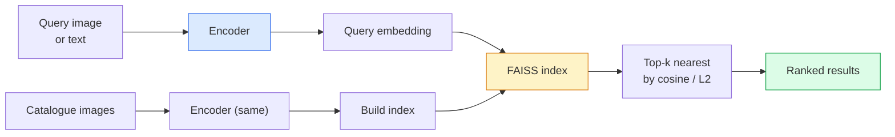

# 图像检索与度量学习

> 检索系统通过嵌入空间中的距离对候选项进行排序。度量学习是塑造该空间的学科，使得距离能反映您期望的语义。

**类型：** 构建  
**语言：** Python  
**先决条件：** 阶段4第14课（ViT），阶段4第18课（CLIP）  
**时间：** 约45分钟

## 学习目标

- 解释三元组损失、对比损失和基于代理的度量学习损失，并能为给定数据集选择合适的方法
- 正确实现L2归一化和余弦相似度，并能区分"相同物品"与"相同类别"检索的差异
- 构建FAISS索引，支持文本和图像查询，并在保留查询集上报告recall@K
- 使用DINOv2、CLIP和SigLIP作为现成嵌入骨干网络，并了解各自的最佳应用场景

## 问题背景

检索在生产级视觉应用中无处不在：重复检测、反向图像搜索、视觉搜索（"查找相似商品"）、人脸重识别、监控场景中的行人重识别、电商实例级匹配。产品需求的核心始终一致："给定查询图像，对我的商品目录进行排序。"

两个关键设计决策决定整个系统架构：**嵌入**——由什么模型生成向量；**索引**——如何大规模查找最近邻。这两者在2026年都已成熟（嵌入用DINOv2，索引用FAISS），这反而提高了门槛：难点在于定义*您的应用场景中何为相似*，进而塑造嵌入空间使距离匹配这种相似性定义。

这个塑造过程就是度量学习。它是一个小而关键的学科。

## 核心概念

### 检索系统概览



### 四大损失函数族

| 损失函数 | 所需输入 | 优点 | 缺点 |
|---------|---------|------|------|
| **对比损失** | (锚点, 正样本) + 负样本 | 简单，适用于任何配对标签 | 缺乏足够负样本时收敛慢 |
| **三元组损失** | (锚点, 正样本, 负样本) | 直观；可直接控制间隔 | 困难三元组挖掘成本高 |
| **NT-Xent / InfoNCE** | 配对 + 批次挖掘负样本 | 可扩展至大批量 | 需要大批量或动量队列 |
| **基于代理损失 (ProxyNCA)** | 仅需类别标签 | 快速稳定，无需挖掘 | 小数据集上易过拟合代理点 |

对于大多数生产场景，建议先使用预训练骨干网络，仅当现成嵌入在测试集上表现不佳时再添加度量学习微调。

### 三元组损失公式化定义

```
L = max(0, ||f(a) - f(p)||^2 - ||f(a) - f(n)||^2 + margin)
```

将锚点`a`拉近正样本`p`，推离负样本`n`，通过`margin`确保间隔。这种三元结构可推广至任何相似性排序。

挖掘策略至关重要：简单三元组（`n`已远离`a`）贡献零损失；只有困难三元组能有效训练网络。半硬挖掘（`n`比`p`远但在间隔内）是2016年FaceNet提出的方法，至今仍为主流。

### 余弦相似度与L2距离

两种度量，两种惯例：

- **余弦相似度**：向量夹角。要求L2归一化的嵌入。
- **L2距离**：欧氏距离。适用于原始或归一化嵌入，但通常与L2归一化+平方L2距离配合使用。

对于大多数现代网络，两者等价：当`||a|| = ||b|| = 1`时`||a - b||^2 = 2 - 2 cos(a, b)`。请遵循嵌入训练时的惯例；混用会悄然改变"最近邻"的语义。

### Recall@K

标准检索指标：

```
recall@K = fraction of queries where at least one correct match is in the top K results
```

同时报告recall@1、@5、@10。若recall@10超过0.95而recall@1低于0.5，说明嵌入空间结构正确但排序存在噪声——可尝试更长微调或添加重排序步骤。

对于重复检测，precision@K更重要，因为每个误报都是用户可见的错误。对于视觉搜索，recall@K才是产品关键指标。

### FAISS简介

Facebook AI相似度搜索。最近邻搜索的事实标准库。三种索引选择：

- `IndexFlatIP` / `IndexFlatL2` —— 暴力搜索，精确无训练。适用于约100万向量。
- `IndexIVFFlat` —— 划分为K个单元，仅搜索最近邻单元。近似快速，需要训练数据。
- `IndexHNSW` —— 基于图结构，多查询场景最快，索引体积较大。

对于10万向量，推荐使用基于余弦相似度的`IndexFlatIP`。100万向量推荐`IndexIVFFlat`。超过100万向量需结合乘积量化（`IndexIVFPQ`）。

### 实例级与类别级检索

两个同名但本质不同的问题：

- **类别级** —— "在我的目录中找猫。"类条件相似性；现成CLIP/DINOv2嵌入效果良好。
- **实例级** —— "在我的目录中找*这个具体商品*。"需要细粒度区分同类视觉相似对象；现成嵌入表现欠佳；需使用度量学习进行微调。

选择模型前务必明确要解决哪类问题。

## 动手实现

### 步骤1：三元组损失

```python
import torch
import torch.nn.functional as F

def triplet_loss(anchor, positive, negative, margin=0.2):
    d_ap = F.pairwise_distance(anchor, positive, p=2)
    d_an = F.pairwise_distance(anchor, negative, p=2)
    return F.relu(d_ap - d_an + margin).mean()
```

单行实现。适用于L2归一化或原始嵌入。

### 步骤2：半硬挖掘

给定一批嵌入和标签，为每个锚点寻找最困难的半硬负样本。

```python
def semi_hard_negatives(emb, labels, margin=0.2):
    dist = torch.cdist(emb, emb)
    same_class = labels[:, None] == labels[None, :]
    diff_class = ~same_class
    N = emb.size(0)

    positives = dist.clone()
    positives[~same_class] = float("-inf")
    positives.fill_diagonal_(float("-inf"))
    pos_idx = positives.argmax(dim=1)

    semi_hard = dist.clone()
    semi_hard[same_class] = float("inf")
    d_ap = dist[torch.arange(N), pos_idx].unsqueeze(1)
    semi_hard[dist <= d_ap] = float("inf")
    neg_idx = semi_hard.argmin(dim=1)

    fallback_mask = semi_hard[torch.arange(N), neg_idx] == float("inf")
    if fallback_mask.any():
        hardest = dist.clone()
        hardest[same_class] = float("inf")
        neg_idx = torch.where(fallback_mask, hardest.argmin(dim=1), neg_idx)
    return pos_idx, neg_idx
```

每个锚点获得同类中最困难的正样本，以及一个比正样本远但在间隔内的半硬负样本。

### 步骤3：Recall@K

```python
def recall_at_k(query_emb, gallery_emb, query_labels, gallery_labels, k=1):
    sim = query_emb @ gallery_emb.T
    _, top_k = sim.topk(k, dim=-1)
    matches = (gallery_labels[top_k] == query_labels[:, None]).any(dim=-1)
    return matches.float().mean().item()
```

基于L2归一化嵌入的内积排序等价于余弦相似度排序。报告查询集中至少有一个正确邻居的平均比例。

### 步骤4：整合流程

```python
import torch
import torch.nn as nn
from torch.optim import Adam

class Encoder(nn.Module):
    def __init__(self, in_dim=128, emb_dim=64):
        super().__init__()
        self.net = nn.Sequential(
            nn.Linear(in_dim, 128), nn.ReLU(),
            nn.Linear(128, emb_dim),
        )

    def forward(self, x):
        return F.normalize(self.net(x), dim=-1)

torch.manual_seed(0)
num_classes = 6
protos = F.normalize(torch.randn(num_classes, 128), dim=-1)

def sample_batch(bs=32):
    labels = torch.randint(0, num_classes, (bs,))
    x = protos[labels] + 0.15 * torch.randn(bs, 128)
    return x, labels

enc = Encoder()
opt = Adam(enc.parameters(), lr=3e-3)

for step in range(200):
    x, y = sample_batch(32)
    emb = enc(x)
    pos_idx, neg_idx = semi_hard_negatives(emb, y)
    loss = triplet_loss(emb, emb[pos_idx], emb[neg_idx])
    opt.zero_grad(); loss.backward(); opt.step()
```

经过数百步训练后，嵌入聚类会形成每类一个独立簇。

## 实际应用

2026年生产技术栈：

- **DINOv2 + FAISS** —— 通用视觉检索。开箱即用。
- **CLIP + FAISS** —— 当查询为文本时使用。
- **微调DINOv2 + FAISS** —— 实例级检索、人脸重识别、时尚、电商。
- **Milvus / Weaviate / Qdrant** —— 围绕FAISS或HNSW构建的托管向量数据库。

对于最先进的实例检索，标准方案是：使用DINOv2骨干网络，添加嵌入头，在实例标注配对上使用三元组或InfoNCE损失微调，最终建立FAISS索引。

## 产出成果

本课程将产出：

- `outputs/prompt-retrieval-loss-picker.md` —— 一个提示模板，可根据检索问题选择三元组/InfoNCE/ProxyNCA损失。
- `outputs/skill-recall-at-k-runner.md` —— 一项编写清晰评估框架的技能，实现带训练/验证/图库划分及规范数据接口的recall@K评估。

## 练习题

1. **（简单）** 运行上述示例。在训练前后用PCA可视化嵌入，观察六个聚类的形成过程。
2. **（中等）** 实现ProxyNCA损失：每个类别一个可学习"代理"，基于余弦相似度的标准交叉熵。与三元组损失在示例数据上比较收敛速度。
3. **（困难）** 取1000张ImageNet验证集图像，使用HuggingFace的DINOv2提取嵌入，构建FAISS平面索引，报告以相同图像为查询时（应为1.0）和以留出分割（使用ImageNet标签作为真值）为查询时的recall@{1, 5, 10}。

## 关键术语

| 术语 | 常见说法 | 实际含义 |
|------|---------|----------|
| 度量学习 | "塑造空间" | 训练编码器使其输出空间的距离反映目标相似性 |
| 三元组损失 | "推拉学习" | L = max(0, d(a, p) - d(a, n) + margin)；经典度量学习损失 |
| 半硬挖掘 | "有效负样本" | 比锚点远于正样本但仍在间隔内的负样本；经验证明最具信息量 |
| 基于代理的损失 | "类别原型" | 每个类别一个可学习代理；基于相似度的交叉熵；无需配对挖掘 |
| Recall@K | "Top-K命中率" | 查询中至少有一个正确结果出现在前K个的比例 |
| 实例检索 | "找这个具体物品" | 细粒度匹配；现成特征通常表现不佳 |
| FAISS | "最近邻库" | Facebook的最近邻库；支持精确和近似索引 |
| HNSW | "图索引" | 分层可导航小世界；快速近似最近邻，内存开销小 |

## 延伸阅读

- [FaceNet: A Unified Embedding for Face Recognition (Schroff et al., 2015)](https://arxiv.org/abs/1503.03832) —— 三元组损失/半硬挖掘奠基论文
- [In Defense of the Triplet Loss for Person Re-Identification (Hermans et al., 2017)](https://arxiv.org/abs/1703.07737) —— 三元组微调实用指南
- [FAISS documentation](https://github.com/facebookresearch/faiss/wiki) —— 所有索引类型与权衡详解
- [SMoT: Metric Learning Taxonomy (Kim et al., 2021)](https://arxiv.org/abs/2010.06927) —— 现代损失函数综述及其关联