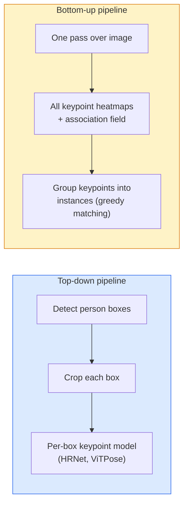

# 关键点检测与姿态估计

> 姿态是一组有序的关键点。关键点检测器是一个热图回归器。其他所有工作都是辅助性的。

**类型：** 构建
**语言：** Python
**前置课程：** 第4阶段 课程06（检测），第4阶段 课程07（U-Net）
**时间：** 约45分钟

## 学习目标

- 区分自上而下和自下而上的姿态估计，并说明各自的适用场景
- 使用以每个关键点为中心的高斯目标热图对K个关键点进行回归，并在推理阶段提取关键点坐标
- 解释部位亲和场（PAFs）以及自下而上的流程如何将关键点关联到实例
- 使用MediaPipe Pose或MMPose进行生产级关键点估计，并理解其输出格式

## 问题描述

关键点任务隐藏在许多名称之下：人体姿态（17个身体关节）、面部标志点（68或478个点）、手部（21个点）、动物姿态、机器人物体姿态、医学解剖标志点。它们都共享相同的结构：检测物体上的K个离散点并输出其(x, y)坐标。

姿态估计是动作捕捉、健身应用、体育分析、手势控制、动画、AR试穿和机器人抓取的基础。二维情况已成熟；三维姿态（从单个相机估计世界坐标系中的关节位置）是当前的研究前沿。

工程问题在于规模。单张图像、单人的姿态估计是一个20毫秒的问题。在人群中以30fps进行多人姿态估计则是另一个问题，需要不同的架构。

## 核心概念

### 自上而下 vs 自下而上



- **自上而下** — 先检测人，然后对每个人物裁剪区域运行关键点模型。准确率最高；时间复杂度与人数成线性关系。
- **自下而下** — 一次前向传播预测所有关键点加上关联场；然后对它们进行分组。处理时间恒定，与人群规模无关。

自上而下（HRNet, ViTPose）是准确率领先者；自下而下（OpenPose, HigherHRNet）在密集场景中吞吐量领先。

### 热图回归

不是直接回归 `(x, y)`，而是为每个关键点预测一个 `H x W` 热图，其中心为真实位置的高斯斑点。

```
target[k, y, x] = exp(-((x - cx_k)^2 + (y - cy_k)^2) / (2 sigma^2))
```

在推理时，每个热图的argmax即为预测的关键点位置。

为什么热图比直接回归效果更好：网络的空间结构（卷积特征图）与空间输出自然对齐。高斯目标也具有正则化作用——小的定位误差会产生小的损失，而不是零。

### 亚像素定位

Argmax给出的是整数坐标。要达到亚像素精度，可以通过在argmax点及其邻域拟合抛物线来细化，或者使用已知的偏移量 `(dx, dy) = 0.25 * (heatmap[y, x+1] - heatmap[y, x-1], ...)` 方向。

### 部位亲和场（PAFs）

OpenPose用于自下而上关联的技巧。对于每对连接的关键点（例如左肩到左肘），预测一个2通道的场，该场编码了从一个关键点指向另一个关键点的单位向量。为了将肩膀与其肘部关联，沿着连接候选点对的线积分PAF；积分值最高的点对即为匹配结果。

```
For each connection (limb):
  PAF channels: 2 (unit vector x, y)
  Line integral: sum over sample points of (PAF . line_direction)
  Higher integral = stronger match
```

优雅且可扩展到任意人群规模，无需进行逐人裁剪。

### COCO关键点

标准的人体姿态数据集：每人17个关键点，使用PCK（正确关键点百分比）和OKS（物体关键点相似度）作为指标。OKS是IoU在关键点上的类比，是COCO mAP@OKS所报告的内容。

### 2D vs 3D

- **2D姿态** — 图像坐标；已达到生产质量（MediaPipe, HRNet, ViTPose）。
- **3D姿态** — 世界/相机坐标；仍是活跃的研究领域。常见方法：
  - 使用小型MLP将2D预测提升到3D（VideoPose3D）。
  - 从图像直接回归3D（PyMAF, MHFormer）。
  - 多视图设置（CMU Panoptic）用于获取真值。

## 动手实现

### 步骤1：高斯热图目标

```python
import numpy as np
import torch

def gaussian_heatmap(size, cx, cy, sigma=2.0):
    yy, xx = np.meshgrid(np.arange(size), np.arange(size), indexing="ij")
    return np.exp(-((xx - cx) ** 2 + (yy - cy) ** 2) / (2 * sigma ** 2)).astype(np.float32)

hm = gaussian_heatmap(64, 32, 32, sigma=2.0)
print(f"peak: {hm.max():.3f} at ({hm.argmax() % 64}, {hm.argmax() // 64})")
```

每个关键点的热图沿通道维度堆叠，得到完整的目标张量。

### 步骤2：微型关键点头

一个U-Net风格的模型，输出K个热图通道。

```python
import torch.nn as nn
import torch.nn.functional as F

class TinyKeypointNet(nn.Module):
    def __init__(self, num_keypoints=4, base=16):
        super().__init__()
        self.down1 = nn.Sequential(nn.Conv2d(3, base, 3, 2, 1), nn.ReLU(inplace=True))
        self.down2 = nn.Sequential(nn.Conv2d(base, base * 2, 3, 2, 1), nn.ReLU(inplace=True))
        self.mid = nn.Sequential(nn.Conv2d(base * 2, base * 2, 3, 1, 1), nn.ReLU(inplace=True))
        self.up1 = nn.ConvTranspose2d(base * 2, base, 2, 2)
        self.up2 = nn.ConvTranspose2d(base, num_keypoints, 2, 2)

    def forward(self, x):
        h1 = self.down1(x)
        h2 = self.down2(h1)
        h3 = self.mid(h2)
        u1 = self.up1(h3)
        return self.up2(u1)
```

输入 `(N, 3, H, W)`，输出 `(N, K, H, W)`。损失函数是针对高斯目标的逐像素均方误差。

### 步骤3：推理 — 提取关键点坐标

```python
def heatmap_to_coords(heatmaps):
    """
    heatmaps: (N, K, H, W)
    returns:  (N, K, 2) float coordinates in image pixels
    """
    N, K, H, W = heatmaps.shape
    hm = heatmaps.reshape(N, K, -1)
    idx = hm.argmax(dim=-1)
    ys = (idx // W).float()
    xs = (idx % W).float()
    return torch.stack([xs, ys], dim=-1)

coords = heatmap_to_coords(torch.randn(2, 4, 32, 32))
print(f"coords: {coords.shape}")  # (2, 4, 2)
```

推理时一行代码。要进行亚像素细化，需在argmax点周围进行插值。

### 步骤4：合成关键点数据集

很简单：在白色画布上绘制四个点，并学习预测它们。

```python
def make_synthetic_sample(size=64):
    img = np.ones((3, size, size), dtype=np.float32)
    rng = np.random.default_rng()
    kps = rng.integers(8, size - 8, size=(4, 2))
    for cx, cy in kps:
        img[:, cy - 2:cy + 2, cx - 2:cx + 2] = 0.0
    hms = np.stack([gaussian_heatmap(size, cx, cy) for cx, cy in kps])
    return img, hms, kps
```

足够简单，微型模型可以在一分钟内学会。

### 步骤5：训练

```python
model = TinyKeypointNet(num_keypoints=4)
opt = torch.optim.Adam(model.parameters(), lr=3e-3)

for step in range(200):
    batch = [make_synthetic_sample() for _ in range(16)]
    imgs = torch.from_numpy(np.stack([b[0] for b in batch]))
    hms = torch.from_numpy(np.stack([b[1] for b in batch]))
    pred = model(imgs)
    # Upsample pred to full resolution
    pred = F.interpolate(pred, size=hms.shape[-2:], mode="bilinear", align_corners=False)
    loss = F.mse_loss(pred, hms)
    opt.zero_grad(); loss.backward(); opt.step()
```

## 应用实践

- **MediaPipe Pose** — 谷歌的生产级姿态估计器；提供WebGL和移动端运行时，延迟低于10毫秒。
- **MMPose** (OpenMMLab) — 综合性的研究代码库；包含所有SOTA架构及预训练权重。
- **YOLOv8-pose** — 最快的实时多人姿态估计，单次前向传播。
- **transformers HumanDPT / PoseAnything** — 用于开放词汇姿态（任意物体、任意关键点集）的较新视觉语言方法。

## 成果产出

本课程将产出：

- `outputs/prompt-pose-stack-picker.md` — 一个根据延迟、人群大小和2D/3D需求，推荐使用MediaPipe / YOLOv8-pose / HRNet / ViTPose的提示词。
- `outputs/skill-heatmap-to-coords.md` — 一项编写子像素热图到坐标转换例程的技能，该例程被所有生产级姿态模型使用。

## 练习

1.  **（简单）** 在合成4点数据集上训练微型关键点模型。报告200步训练后，预测关键点与真实关键点之间的平均L2误差。
2.  **（中等）** 添加亚像素细化：给定argmax位置，沿x和y方向使用邻域像素拟合一维抛物线。报告相比整数argmax的精度提升。
3.  **（困难）** 构建一个2人合成数据集，每张图像显示两个4关键点模式的实例。训练一个使用PAFs预测关键点所属实例的自下而上流程，并评估OKS。

## 关键术语

| 术语 | 常见说法 | 实际含义 |
|------|----------|----------|
| 关键点 | "标志点" | 物体上特定的有序点（关节、角点、特征点） |
| 姿态 | "骨架" | 属于一个实例的一组有序关键点 |
| 自上而下 | "先检测，后估计姿态" | 两阶段流程：人体检测器 + 逐裁剪区域关键点模型；准确率最高 |
| 自下而上 | "先估计姿态，后分组" | 单次所有关键点预测 + 分组；处理时间恒定，与人群规模无关 |
| 热图 | "高斯目标" | 每个关键点对应一个H x W的张量，峰值位于真实位置；首选的回归目标 |
| PAF | "部位亲和场" | 2通道的单位向量场，编码肢体方向；用于将关键点分组到实例 |
| OKS | "关键点IoU" | 物体关键点相似度；COCO用于评估姿态的指标 |
| HRNet | "高分辨率网络" | 主流的自上而下关键点架构；在整个网络中保持高分辨率特征 |

## 延伸阅读

- [OpenPose (Cao et al., 2017)](https://arxiv.org/abs/1812.08008) — 使用PAFs的自下而上方法；关于该方法的最佳论文解读
- [HRNet (Sun et al., 2019)](https://arxiv.org/abs/1902.09212) — 自上而下的参考架构
- [ViTPose (Xu et al., 2022)](https://arxiv.org/abs/2204.12484) — 用普通ViT作为姿态骨干网络；目前在多个基准上达到SOTA
- [MediaPipe Pose](https://developers.google.com/mediapipe/solutions/vision/pose_landmarker) — 生产级实时姿态估计；2026年最快的部署技术栈