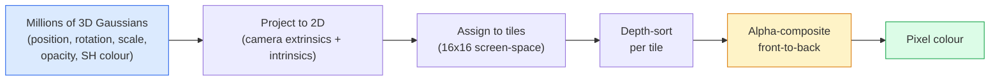

# 从零开始构建3D高斯溅射

> 一个场景由数百万个3D高斯组成的点云构成。每个高斯都具有位置、方向、尺度、透明度和一个依赖于观察方向的颜色。将其进行光栅化，通过光栅化过程进行反向传播，完成。

**类型:** 构建
**语言:** Python
**先决条件:** 阶段4 课程13 (3D视觉与NeRF)，阶段1 课程12 (张量操作)，阶段4 课程10 (扩散基础，可选)
**时间:** 约90分钟

## 学习目标

- 解释为何3D高斯溅射在2026年取代了NeRF，成为照片级真实感3D重建的行业默认标准
- 列出每个高斯的六项参数（位置、旋转四元数、尺度、透明度、球谐函数颜色、可选特征）及其各自贡献的浮点数
- 从零开始使用 `alpha` 合成实现一个2D高斯溅射光栅化器，然后展示3D情况如何投影到相同的循环中
- 使用 `nerfstudio`、`gsplat` 或 `SuperSplat` 从20-50张照片重建场景，并导出到 `KHR_gaussian_splatting` glTF扩展或OpenUSD 26.03 `UsdVolParticleField3DGaussianSplat` 模式

## 问题所在

NeRF将场景存储为一个MLP（多层感知机）的权重。渲染的每个像素都需要沿射线进行数百次MLP查询。训练需要数小时，渲染需要数秒，并且权重无法编辑——如果你想移动场景中的一把椅子，你必须重新训练。

3D高斯溅射（Kerbl, Kopanas, Leimkühler, Drettakis, SIGGRAPH 2023）取代了这一切。一个场景是一组显式的3D高斯集合。渲染是GPU光栅化，速度超过100 fps。训练只需几分钟。编辑是直接的：移动一部分高斯，你就移动了椅子。到2026年，Khronos Group已经批准了用于高斯溅射的glTF扩展，OpenUSD 26.03发布了高斯溅射模式，Zillow和Apartments.com使用它们渲染房地产，大多数关于3D重建的新研究论文都是核心3DGS思想的变体。

其概念模型很简单，但数学细节足够复杂，以至于大多数介绍都直接从光栅化开始，略过了投影和球谐函数部分。本课程将构建整个过程——先从2D版本开始，然后扩展到3D。

## 概念

### 高斯携带的信息

一个3D高斯是空间中的一个参数化斑点，具有以下属性：

```
position         mu         (3,)    centre in world coordinates
rotation         q          (4,)    unit quaternion encoding orientation
scale            s          (3,)    log-scales per axis (exponentiated at render time)
opacity          alpha      (1,)    post-sigmoid opacity [0, 1]
SH coefficients  c_lm       (3 * (L+1)^2,)   view-dependent colour
```

旋转+尺度构成一个3x3协方差矩阵：`Sigma = R S S^T R^T`。这就是高斯在3D空间中的形状。球谐函数使得颜色可以随观察方向变化——镜面高光、微妙光泽、视角相关发光——而无需存储每个视角的纹理。使用3阶球谐函数，每个颜色通道有16个系数，仅颜色一项每个高斯就有48个浮点数。

一个场景通常有1-5百万个高斯。每个大约存储60个浮点数（3 + 4 + 3 + 1 + 48 + 其他）。对于一个五百万高斯的场景，这是240MB——远小于带逐点纹理的等效点云，并且比NeRF在高分辨率下重新渲染的MLP权重小一个数量级。

### 光栅化而非光线行进



五个步骤，全部对GPU友好。无需逐像素查询MLP。单个RTX 3080 Ti可以以147 fps渲染600万个高斯点。

### 投影步骤

位于世界坐标 `mu`、具有3D协方差 `Sigma` 的3D高斯，投影到屏幕坐标 `mu'`、具有2D协方差 `Sigma'` 的2D高斯：

```
mu' = project(mu)
Sigma' = J W Sigma W^T J^T          (2 x 2)

W = viewing transform (rotation + translation of camera)
J = Jacobian of the perspective projection at mu'
```

2D高斯的足迹是一个椭圆，其轴是 `Sigma'` 的特征向量。该椭圆内的每个像素都接收到该高斯的贡献，并以 `exp(-0.5 * (p - mu')^T Sigma'^-1 (p - mu'))` 为权重。

### Alpha合成规则

对于一个像素，覆盖它的高斯按从后往前排序（或等效地，从前向后排序并使用反转公式）。颜色合成使用自1980年代以来所有半透明光栅化器使用的相同方程：

```
C_pixel = sum_i alpha_i * T_i * c_i

T_i = prod_{j < i} (1 - alpha_j)       transmittance up to i
alpha_i = opacity_i * exp(-0.5 * d^T Sigma'^-1 d)   local contribution
c_i = eval_SH(SH_i, view_direction)    view-dependent colour
```

这**与NeRF的体积渲染方程相同**，只是现在是在一组显式稀疏高斯上操作，而不是沿射线的密集采样。这种一致性正是渲染质量匹配NeRF的原因——两者都在积分同一个辐射场方程。

### 为什么这是可微的

每一步——投影、分块分配、alpha合成、球谐函数求值——对于高斯参数都是可微的。给定真实图像，计算渲染像素损失，通过光栅化器反向传播，通过梯度下降更新所有 `(mu, q, s, alpha, c_lm)`。经过约30,000次迭代，高斯会找到它们正确的位置、尺度和颜色。

### 密化与剪枝

固定数量的高斯无法覆盖复杂场景。训练包括两种自适应机制：

- **克隆**：当一个高斯的梯度幅度很大但其尺度很小时，在其当前位置克隆它——重建在此处需要更多细节。
- **分裂**：当一个大尺度高斯的梯度很高时，将其分裂为两个更小的高斯——一个过大的高斯过于平滑，无法拟合该区域。
- **剪枝**：剪掉透明度低于阈值的高斯——它们没有贡献。

密化每N次迭代运行一次。一个场景通常从约10万个初始高斯（由SfM点云种子生成）增长到训练结束时的1-5百万个。

### 一段话讲清球谐函数

视角相关的颜色是单位球上的一个函数 `c(direction)`。球谐函数是球体的傅里叶基。截断到 `L` 阶，每个通道你得到 `(L+1)^2` 个基函数。为一个新视角求值颜色，就是学习到的SH系数与在观察方向上求值的基函数之间的点积。0阶 = 1个系数 = 恒定颜色。3阶 = 16个系数 = 足以捕获朗伯体着色、镜面反射和轻微反射。SD高斯溅射论文默认使用3阶。

### 2026年生产技术栈

```
1. Capture         smartphone / DJI drone / handheld scanner
2. SfM / MVS       COLMAP or GLOMAP derives camera poses + sparse points
3. Train 3DGS      nerfstudio / gsplat / inria official / PostShot (~10-30 min on RTX 4090)
4. Edit            SuperSplat / SplatForge (clean floaters, segment)
5. Export          .ply -> glTF KHR_gaussian_splatting or .usd (OpenUSD 26.03)
6. View            Cesium / Unreal / Babylon.js / Three.js / Vision Pro
```

### 4D与生成式变体

- **4D高斯溅射**——高斯是时间的函数；用于体积视频（《超人》2026，A$AP Rocky的《Helicopter》）。
- **生成式高斯溅射**——文本到高斯溅射模型（World Labs的Marble），能够凭空生成整个场景。
- **3D高斯无迹变换**——NVIDIA NuRec用于自动驾驶仿真的变体。

## 构建它

### 步骤1：2D高斯

我们首先构建一个2D光栅化器。3D情况在投影后可以归结为它。

```python
import torch
import torch.nn as nn
import torch.nn.functional as F


def eval_2d_gaussian(means, covs, points):
    """
    means:  (G, 2)      centres
    covs:   (G, 2, 2)   covariance matrices
    points: (H, W, 2)   pixel coordinates
    returns: (G, H, W)  density at every pixel for every Gaussian
    """
    G = means.size(0)
    H, W, _ = points.shape
    flat = points.view(-1, 2)
    inv = torch.linalg.inv(covs)
    diff = flat[None, :, :] - means[:, None, :]
    d = torch.einsum("gpi,gij,gpj->gp", diff, inv, diff)
    density = torch.exp(-0.5 * d)
    return density.view(G, H, W)
```

`einsum` 为每个（高斯，像素）对计算二次型 `diff^T Sigma^-1 diff`。

### 步骤2：2D高斯溅射光栅化器

从前向后进行Alpha合成。2D中的深度没有意义，因此我们使用一个学习到的每高斯标量来决定顺序。

```python
def rasterise_2d(means, covs, colours, opacities, depths, image_size):
    """
    means:     (G, 2)
    covs:      (G, 2, 2)
    colours:   (G, 3)
    opacities: (G,)     in [0, 1]
    depths:    (G,)     per-Gaussian scalar used for ordering
    image_size: (H, W)
    returns:   (H, W, 3) rendered image
    """
    H, W = image_size
    yy, xx = torch.meshgrid(
        torch.arange(H, dtype=torch.float32, device=means.device),
        torch.arange(W, dtype=torch.float32, device=means.device),
        indexing="ij",
    )
    points = torch.stack([xx, yy], dim=-1)

    densities = eval_2d_gaussian(means, covs, points)
    alphas = opacities[:, None, None] * densities
    alphas = alphas.clamp(0.0, 0.99)

    order = torch.argsort(depths)
    alphas = alphas[order]
    colours_sorted = colours[order]

    T = torch.ones(H, W, device=means.device)
    out = torch.zeros(H, W, 3, device=means.device)
    for i in range(means.size(0)):
        a = alphas[i]
        out += (T * a)[..., None] * colours_sorted[i][None, None, :]
        T = T * (1.0 - a)
    return out
```

不快——真正的实现使用基于分块的CUDA内核——但数学完全正确且完全可微。

### 步骤3：可训练的2D高斯溅射场景

```python
class Splats2D(nn.Module):
    def __init__(self, num_splats=128, image_size=64, seed=0):
        super().__init__()
        g = torch.Generator().manual_seed(seed)
        H, W = image_size, image_size
        self.means = nn.Parameter(torch.rand(num_splats, 2, generator=g) * torch.tensor([W, H]))
        self.log_scale = nn.Parameter(torch.ones(num_splats, 2) * math.log(2.0))
        self.rot = nn.Parameter(torch.zeros(num_splats))  # single angle in 2D
        self.colour_logits = nn.Parameter(torch.randn(num_splats, 3, generator=g) * 0.5)
        self.opacity_logit = nn.Parameter(torch.zeros(num_splats))
        self.depth = nn.Parameter(torch.rand(num_splats, generator=g))

    def covs(self):
        s = torch.exp(self.log_scale)
        c, si = torch.cos(self.rot), torch.sin(self.rot)
        R = torch.stack([
            torch.stack([c, -si], dim=-1),
            torch.stack([si, c], dim=-1),
        ], dim=-2)
        S = torch.diag_embed(s ** 2)
        return R @ S @ R.transpose(-1, -2)

    def forward(self, image_size):
        covs = self.covs()
        colours = torch.sigmoid(self.colour_logits)
        opacities = torch.sigmoid(self.opacity_logit)
        return rasterise_2d(self.means, covs, colours, opacities, self.depth, image_size)
```

`log_scale`、`opacity_logit` 和 `colour_logits` 都是无约束的参数，在渲染时通过正确的激活函数映射。这是每个3DGS实现的标准模式。

### 步骤4：将2D高斯拟合到目标图像

```python
import math
import numpy as np

def make_target(size=64):
    yy, xx = np.meshgrid(np.arange(size), np.arange(size), indexing="ij")
    img = np.zeros((size, size, 3), dtype=np.float32)
    # Red circle
    mask = (xx - 20) ** 2 + (yy - 20) ** 2 < 10 ** 2
    img[mask] = [1.0, 0.2, 0.2]
    # Blue square
    mask = (np.abs(xx - 45) < 8) & (np.abs(yy - 40) < 8)
    img[mask] = [0.2, 0.3, 1.0]
    return torch.from_numpy(img)


target = make_target(64)
model = Splats2D(num_splats=64, image_size=64)
opt = torch.optim.Adam(model.parameters(), lr=0.05)

for step in range(200):
    pred = model((64, 64))
    loss = F.mse_loss(pred, target)
    opt.zero_grad(); loss.backward(); opt.step()
    if step % 40 == 0:
        print(f"step {step:3d}  mse {loss.item():.4f}")
```

经过200步，64个高斯稳定成两个形状。这就是整个思路——对显式几何基元进行梯度下降。

### 步骤5：从2D到3D

3D扩展保持相同的循环。新增内容：

1. 每个高斯的旋转是四元数，而非单一角度。
2. 协方差是 `R S S^T R^T`，其中 `R` 由四元数和 `S = diag(exp(log_scale))` 构建。
3. 投影 `(mu, Sigma) -> (mu', Sigma')` 使用相机外参和透视投影在 `mu` 处的雅可比矩阵。
4. 颜色变为球谐函数展开；在观察方向上求值。
5. 深度排序使用实际的相机空间z坐标，而非学习到的标量。

每个生产实现（`gsplat`、`inria/gaussian-splatting`、`nerfstudio`）都在GPU上使用基于分块的CUDA内核精确地执行此操作。

### 步骤6：球谐函数求值

高达3阶的球谐函数基，每个通道有16个项。求值：

```python
def eval_sh_degree_3(sh_coeffs, dirs):
    """
    sh_coeffs: (..., 16, 3)   last dim is RGB channels
    dirs:      (..., 3)       unit vectors
    returns:   (..., 3)
    """
    C0 = 0.282094791773878
    C1 = 0.488602511902920
    C2 = [1.092548430592079, 1.092548430592079,
          0.315391565252520, 1.092548430592079,
          0.546274215296039]
    x, y, z = dirs[..., 0], dirs[..., 1], dirs[..., 2]
    x2, y2, z2 = x * x, y * y, z * z
    xy, yz, xz = x * y, y * z, x * z

    result = C0 * sh_coeffs[..., 0, :]
    result = result - C1 * y[..., None] * sh_coeffs[..., 1, :]
    result = result + C1 * z[..., None] * sh_coeffs[..., 2, :]
    result = result - C1 * x[..., None] * sh_coeffs[..., 3, :]

    result = result + C2[0] * xy[..., None] * sh_coeffs[..., 4, :]
    result = result + C2[1] * yz[..., None] * sh_coeffs[..., 5, :]
    result = result + C2[2] * (2.0 * z2 - x2 - y2)[..., None] * sh_coeffs[..., 6, :]
    result = result + C2[3] * xz[..., None] * sh_coeffs[..., 7, :]
    result = result + C2[4] * (x2 - y2)[..., None] * sh_coeffs[..., 8, :]

    # degree 3 terms omitted here for brevity; full 16-coefficient version in the code file
    return result
```

学习到的 `sh_coeffs` 存储了该高斯“每个方向的颜色”。在渲染时，你根据当前的观察方向求值，得到一个RGB三维向量。

## 使用它

进行实际的3DGS工作，请使用 `gsplat`（Meta）或 `nerfstudio`：

```bash
pip install nerfstudio gsplat
ns-download-data example
ns-train splatfacto --data path/to/data
```

`splatfacto` 是nerfstudio的3DGS训练器。在RTX 4090上，对于一个典型场景，运行需要10-30分钟。

2026年重要的导出选项：

- `.ply` — 原始高斯点云（便携，文件最大）。
- `.splat` — PlayCanvas / SuperSplat 量化格式。
- glTF `KHR_gaussian_splatting` — Khronos标准，跨查看器便携（2026年2月RC版）。
- OpenUSD `UsdVolParticleField3DGaussianSplat` — USD原生格式，用于NVIDIA Omniverse和Vision Pro流程。

对于4D/动态场景，`4DGS` 和 `Deformable-3DGS` 通过时变均值和透明度扩展了相同的机制。

## 交付它

本课程产出：

- `outputs/prompt-3dgs-capture-planner.md` — 一个提示，用于为给定场景类型规划拍摄会话（照片数量、相机路径、照明）。
- `outputs/skill-3dgs-export-router.md` — 一项技能，根据下游查看器或引擎选择正确的导出格式（`.ply` / `.splat` / glTF / USD）。

## 练习

1.  **（简单）** 在另一张合成图像上运行上面的2D高斯溅射训练器。在 `[16, 64, 256]` 中改变 `num_splats`，并为每个值绘制MSE与训练步数的关系图。找出收益递减的点。
2.  **（中等）** 扩展2D光栅化器，以支持通过2阶球谐函数依赖于标量“视角”的每高斯RGB颜色。在一对目标图像上进行训练，并验证模型能重建两者。
3.  **（困难）** 克隆 `nerfstudio` 并在你拥有的任何场景（书桌、植物、人脸、房间）的20张照片捕获上训练 `splatfacto`。导出到glTF `KHR_gaussian_splatting` 并在查看器（Three.js `GaussianSplats3D`、SuperSplat、Babylon.js V9）中打开它。报告训练时间、高斯数量和渲染帧率。

## 关键术语

| 术语 | 人们怎么说 | 实际含义 |
|------|----------|---------|
| 3DGS | “高斯溅射” | 将场景显式表示为数百万个3D高斯，每个高斯具有位置、旋转、尺度、透明度、球谐函数颜色 |
| 协方差 | “高斯的形状” | `Sigma = R S S^T R^T`；一个高斯的方向和各向异性尺度 |
| Alpha合成 | “从后往前混合” | 与NeRF体积渲染相同的方程，现在是在一组显式稀疏集上操作 |
| 密化 | “克隆与分裂” | 在重建拟合不足的区域自适应添加新高斯 |
| 剪枝 | “删除低透明度” | 移除在训练期间透明度坍缩到接近零的高斯 |
| 球谐函数 | “视角相关颜色” | 球体上的傅里叶基；将颜色存储为观察方向的函数 |
| Splatfacto | “nerfstudio的3DGS” | 2026年训练3DGS的最简路径 |
| `KHR_gaussian_splatting` | “glTF标准” | Khronos 2026扩展，使3DGS能在不同查看器和引擎间便携 |

## 延伸阅读

- [用于实时辐射场渲染的3D高斯溅射（Kerbl等，SIGGRAPH 2023）](https://repo-sam.inria.fr/fungraph/3d-gaussian-splatting/) — 原始论文
- [gsplat (Meta/nerfstudio)](https://github.com/nerfstudio-project/gsplat) — 生产级CUDA光栅化器
- [nerfstudio Splatfacto](https://docs.nerf.studio/nerfology/methods/splat.html) — 参考训练方案
- [Khronos KHR_gaussian_splatting扩展](https://github.com/KhronosGroup/glTF/blob/main/extensions/2.0/Khronos/KHR_gaussian_splatting/README.md) — 2026便携格式
- [OpenUSD 26.03发布说明](https://openusd.org/release/) — `UsdVolParticleField3DGaussianSplat` 模式
- [2026年3D高斯溅射现状与未来](https://www.thefuture3d.com/blog-0/2026/4/4/state-of-gaussian-splatting-2026) — 行业概述