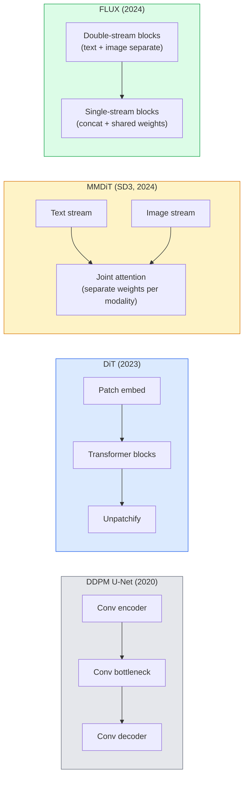

# 扩散变压器与整流流

> U-Net并非扩散模型的秘诀。将其替换为变压器，将噪声调度替换为直线流，你就能得到SD3、FLUX以及所有2026年的文生图模型。

**类型：** 学习 + 构建
**语言：** Python
**前置课程：** 阶段4第10课（扩散DDPM），阶段4第14课（ViT），阶段7第02课（自注意力）
**时间：** ~75分钟

## 学习目标

- 追溯从U-Net DDPM（第10课）到扩散变压器（DiT）、MMDiT（SD3）以及单流+双流DiT（FLUX）的演进过程
- 解释整流流：为什么噪声与数据之间的直线轨迹能让模型在20步而非1000步内完成采样
- 实现一个微小的DiT模块和一个整流流训练循环，两者均少于100行代码
- 通过架构、参数量和许可协议区分模型变体（SD3、FLUX.1-dev、FLUX.1-schnell、Z-Image、Qwen-Image）

## 问题所在

第10课构建了一个使用U-Net去噪器的DDPM。这个配方在2020-2023年占据主导地位：U-Net + beta调度 + 噪声预测损失。它产出了Stable Diffusion 1.5、2.1和DALL-E 2。

而2026年所有最先进的文生图模型都已超越它。Stable Diffusion 3、FLUX、SD4、Z-Image、Qwen-Image、Hunyuan-Image——没有一个使用U-Net。它们都使用扩散变压器（DiT）。SD3和FLUX还将DDPM噪声调度替换为整流流，这拉直了从噪声到数据的路径，并使得借助一致性或蒸馏变体进行1-4步推理成为可能。

这一转变至关重要，因为它是基于扩散的图像生成变得可控、提示词准确（SD3/SD4解决了文本渲染问题）以及生产速度快的原因。理解DiT + 整流流就是理解2026年的生成图像技术栈。

## 核心概念

### 从U-Net到变压器



- **DiT** (Peebles & Xie, 2023) — 用类ViT的变压器替代U-Net，处理潜空间图块。通过自适应层归一化进行条件化。
- **MMDiT** (SD3, Esser et al., 2024) — 两个流，为文本和图像token设置独立权重，并通过联合注意力共享。
- **FLUX** (Black Forest Labs, 2024) — 前N个模块采用类似SD3的双流结构，后续模块连接并共享权重（单流），以在更深模型中提高效率。
- **Z-Image** (2025) — 一个高效的6B参数单流DiT，挑战了“不惜一切代价扩大规模”的理念。

### 一段话讲清整流流

DDPM将前向过程定义为一个嘈杂的随机微分方程（SDE），其中`x_t`逐渐被破坏。学习到的反向过程是第二个SDE，需要1000个小步骤求解。

整流流定义了干净数据与纯噪声之间的**直线**插值：

```
x_t = (1 - t) * x_0 + t * epsilon,     t in [0, 1]
```

训练一个网络来预测速度`v_theta(x_t, t) = epsilon - x_0`——即从干净数据到噪声的直线路径方向（`dx_t/dt`）。采样时，你向后积分该速度，从噪声向数据前进。最终得到的常微分方程（ODE）更接近一条直线，因此采样所需的积分步数大大减少。

SD3称此为**整流流匹配**。FLUX、Z-Image和大多数2026年模型使用相同的目标函数。典型推理：20-30个欧拉步骤（确定性）对比旧DDPM方案中的50多个DDIM步骤。蒸馏/极速/schnell/LCM变体可将此降至1-4步。

### AdaLN条件化

DiT通过**自适应层归一化**根据时间步和类别/文本进行条件化：从条件向量预测`scale`和`shift`，并在LayerNorm之后应用。比U-Net中的FiLM风格调制要简洁得多，是所有现代DiT的默认方法。

```
cond -> MLP -> (scale, shift, gate)
norm(x) * (1 + scale) + shift, then residual add * gate
```

### SD3和FLUX中的文本编码器

- **SD3** 使用三个文本编码器：两个CLIP模型 + T5-XXL。嵌入向量被拼接后作为文本条件馈入图像流。
- **FLUX** 使用一个CLIP-L + T5-XXL。
- **Qwen-Image / Z-Image** 变体使用与其基础大语言模型对齐的自有文本编码器。

文本编码器是SD3/FLUX比SD1.5更好地理解提示词的一个重要原因。仅T5-XXL就有47亿参数。

### 无分类器指导依然有效

整流流改变了采样器，而非条件化方式。无分类器指导（训练时10%概率丢弃文本，推理时混合有条件和无条件预测）与整流流的工作原理完全相同。大多数2026年模型使用3.5-5的引导比例——低于SD1.5的7.5，因为整流流模型默认就更紧密地遵循提示词。

### 一致性、Turbo、Schnell、LCM

四个名称，同一个理念：将缓慢的多步模型蒸馏成快速的少步模型。

- **LCM (潜在一致性模型)** — 训练一个学生模型，能从任意中间`x_t`一步预测最终`x_0`。
- **SDXL Turbo / FLUX schnell** — 使用对抗性扩散蒸馏训练的1-4步模型。
- **SD Turbo** — 适应了潜在扩散的OpenAI风格一致性模型。

任何新模型的生产部署都会同时提供一个“全质量”检查点和一个“turbo/schnell”变体。Schnell（德语“快速”，Black Forest Labs的命名惯例）可在1-4步内运行，适用于实时管道。

### 2026年模型版图

| 模型 | 参数量 | 架构 | 许可协议 |
|-------|------|--------------|---------|
| Stable Diffusion 3 Medium | 20亿 | MMDiT | SAI 社区 |
| Stable Diffusion 3.5 Large | 80亿 | MMDiT | SAI 社区 |
| FLUX.1-dev | 120亿 | 双流 + 单流 DiT | 非商用 |
| FLUX.1-schnell | 120亿 | 同上，蒸馏版 | Apache 2.0 |
| FLUX.2 | — | FLUX.1的迭代版 | 混合 |
| Z-Image | 60亿 | S3-DiT（可扩展单流） | 宽松许可 |
| Qwen-Image | ~200亿 | DiT + Qwen 文本塔 | Apache 2.0 |
| Hunyuan-Image-3.0 | ~800亿 | DiT | 研究用途 |
| SD4 Turbo | 30亿 | DiT + 蒸馏 | SAI 商用 |

FLUX.1-schnell是2026年开源项目的默认选择。Z-Image是效率的领导者。FLUX.2和SD4是当前的质量巅峰。

### 为何这次范式转变如此重要

DDPM + U-Net 有效。DiT + 整流流 **效果更好、更快、扩展更清晰**。这一转变类似于自然语言处理中从RNN到变压器的演进：两种架构都解决了相同的问题，但变压器实现了规模扩展并如今占据主导。2026年每一篇关于图像、视频或3D生成的论文都使用DiT形式的去噪器，并通常采用整流流目标函数。U-Net DDPM现在主要用于教学（第10课）。

## 动手构建

### 第一步：带AdaLN的DiT模块

```python
import torch
import torch.nn as nn


class AdaLNZero(nn.Module):
    """
    Adaptive LayerNorm with a gate. Predicts (scale, shift, gate) from the conditioning.
    Init such that the whole block starts as identity ("zero init").
    """

    def __init__(self, dim, cond_dim):
        super().__init__()
        self.norm = nn.LayerNorm(dim, elementwise_affine=False)
        self.mlp = nn.Linear(cond_dim, dim * 3)
        nn.init.zeros_(self.mlp.weight)
        nn.init.zeros_(self.mlp.bias)

    def forward(self, x, cond):
        scale, shift, gate = self.mlp(cond).chunk(3, dim=-1)
        h = self.norm(x) * (1 + scale.unsqueeze(1)) + shift.unsqueeze(1)
        return h, gate.unsqueeze(1)


class DiTBlock(nn.Module):
    def __init__(self, dim=192, heads=3, mlp_ratio=4, cond_dim=192):
        super().__init__()
        self.adaln1 = AdaLNZero(dim, cond_dim)
        self.attn = nn.MultiheadAttention(dim, heads, batch_first=True)
        self.adaln2 = AdaLNZero(dim, cond_dim)
        self.mlp = nn.Sequential(
            nn.Linear(dim, dim * mlp_ratio),
            nn.GELU(),
            nn.Linear(dim * mlp_ratio, dim),
        )

    def forward(self, x, cond):
        h, gate1 = self.adaln1(x, cond)
        a, _ = self.attn(h, h, h, need_weights=False)
        x = x + gate1 * a
        h, gate2 = self.adaln2(x, cond)
        x = x + gate2 * self.mlp(h)
        return x
```

`AdaLNZero` 初始时是一个恒等映射，因为其MLP权重初始化为零。训练会将该模块推离恒等状态；这极大地稳定了深层变压器扩散模型。

### 第二步：一个微小的DiT

```python
def timestep_embedding(t, dim):
    import math
    half = dim // 2
    freqs = torch.exp(-math.log(10000) * torch.arange(half, device=t.device) / half)
    args = t[:, None].float() * freqs[None]
    return torch.cat([args.sin(), args.cos()], dim=-1)


class TinyDiT(nn.Module):
    def __init__(self, image_size=16, patch_size=2, in_channels=3, dim=96, depth=4, heads=3):
        super().__init__()
        self.patch_size = patch_size
        self.num_patches = (image_size // patch_size) ** 2
        self.patch = nn.Conv2d(in_channels, dim, kernel_size=patch_size, stride=patch_size)
        self.pos = nn.Parameter(torch.zeros(1, self.num_patches, dim))
        self.time_mlp = nn.Sequential(
            nn.Linear(dim, dim * 2),
            nn.SiLU(),
            nn.Linear(dim * 2, dim),
        )
        self.blocks = nn.ModuleList([DiTBlock(dim, heads, cond_dim=dim) for _ in range(depth)])
        self.norm_out = nn.LayerNorm(dim, elementwise_affine=False)
        self.head = nn.Linear(dim, patch_size * patch_size * in_channels)

    def forward(self, x, t):
        n = x.size(0)
        x = self.patch(x)
        x = x.flatten(2).transpose(1, 2) + self.pos
        t_emb = self.time_mlp(timestep_embedding(t, self.pos.size(-1)))
        for blk in self.blocks:
            x = blk(x, t_emb)
        x = self.norm_out(x)
        x = self.head(x)
        return self._unpatchify(x, n)

    def _unpatchify(self, x, n):
        p = self.patch_size
        h = w = int(self.num_patches ** 0.5)
        x = x.view(n, h, w, p, p, -1).permute(0, 5, 1, 3, 2, 4).reshape(n, -1, h * p, w * p)
        return x
```

### 第三步：整流流训练

```python
import torch.nn.functional as F

def rectified_flow_train_step(model, x0, optimizer, device):
    model.train()
    x0 = x0.to(device)
    n = x0.size(0)
    t = torch.rand(n, device=device)
    epsilon = torch.randn_like(x0)
    x_t = (1 - t[:, None, None, None]) * x0 + t[:, None, None, None] * epsilon

    target_velocity = epsilon - x0
    pred_velocity = model(x_t, t)

    loss = F.mse_loss(pred_velocity, target_velocity)
    optimizer.zero_grad()
    loss.backward()
    optimizer.step()
    return loss.item()
```

对比DDPM的噪声预测损失（第10课）：结构相同，目标不同。我们不是预测噪声`epsilon`，而是预测**速度**`epsilon - x_0`，它指向沿直线插值从数据到噪声的方向。

### 第四步：欧拉采样器

整流流是一个常微分方程。欧拉法是最简单的方法，对于训练良好的整流流模型，在20步以上时，其精度几乎与高阶求解器相当。

```python
@torch.no_grad()
def rectified_flow_sample(model, shape, steps=20, device="cpu"):
    model.eval()
    x = torch.randn(shape, device=device)
    dt = 1.0 / steps
    t = torch.ones(shape[0], device=device)
    for _ in range(steps):
        v = model(x, t)
        x = x - dt * v
        t = t - dt
    return x
```

20步。在一个训练好的模型上，这能产生与1000步DDPM相媲美的样本。

### 第五步：端到端快速测试

```python
import numpy as np

def synthetic_blobs(num=200, size=16, seed=0):
    rng = np.random.default_rng(seed)
    out = np.zeros((num, 3, size, size), dtype=np.float32)
    yy, xx = np.meshgrid(np.arange(size), np.arange(size), indexing="ij")
    for i in range(num):
        cx, cy = rng.uniform(4, size - 4, size=2)
        r = rng.uniform(2, 4)
        mask = (xx - cx) ** 2 + (yy - cy) ** 2 < r ** 2
        colour = rng.uniform(-1, 1, size=3)
        for c in range(3):
            out[i, c][mask] = colour[c]
    return torch.from_numpy(out)
```

用整流流训练一个`TinyDiT`模型。500步后，采样输出应看起来像模糊的彩色斑点。

## 实际应用

要使用FLUX / SD3 / Z-Image进行真实的图像生成，`diffusers`提供了一个统一的API：

```python
from diffusers import FluxPipeline, StableDiffusion3Pipeline
import torch

pipe = FluxPipeline.from_pretrained(
    "black-forest-labs/FLUX.1-schnell",
    torch_dtype=torch.bfloat16,
).to("cuda")

out = pipe(
    prompt="a golden retriever surfing a tsunami, hyperrealistic, studio lighting",
    guidance_scale=0.0,           # schnell was trained without CFG
    num_inference_steps=4,
    max_sequence_length=256,
).images[0]
out.save("surf.png")
```

三行代码。`FLUX.1-schnell` 四步完成。若想获得更高画质，可将模型ID换成`black-forest-labs/FLUX.1-dev`，配合CFG在20-30步内生成。

对于SD3：

```python
pipe = StableDiffusion3Pipeline.from_pretrained(
    "stabilityai/stable-diffusion-3.5-large",
    torch_dtype=torch.bfloat16,
).to("cuda")
out = pipe(prompt, guidance_scale=3.5, num_inference_steps=28).images[0]
```

## 交付成果

本课程将产出：

- `outputs/prompt-dit-model-picker.md` — 根据画质、延迟和许可约束，在SD3、FLUX.1-dev、FLUX.1-schnell、Z-Image、SD4 Turbo中做出选择。
- `outputs/skill-rectified-flow-trainer.md` — 编写一个完整的整流流训练循环，包含AdaLN DiT和欧拉采样。

## 练习

1.  **（简单）** 在上述合成斑点数据集上训练TinyDiT 500步。比较用10、20和50个欧拉步骤生成的样本。
2.  **（中等）** 通过将一个可学习的类别嵌入拼接到时间嵌入上，来添加文本条件化（10种颜色的“斑点类别”）。使用类别0、5和9进行采样，验证颜色是否匹配。
3.  **（困难）** 计算在相同数据上训练相同步数的相同规模网络，其整流流版本和DDPM版本生成的样本之间的弗雷歇距离（FID代理）。报告哪种收敛更快。

## 关键术语

| 术语 | 常用说法 | 实际含义 |
|------|----------------|----------------------|
| DiT | “扩散变压器” | 替代U-Net作为扩散去噪器的变压器；操作于图块化的潜变量 |
| AdaLN | “自适应层归一化” | 通过学习的缩放、偏移、门控在LayerNorm之后应用的时间步/文本条件化；所有现代DiT的标准方法 |
| MMDiT | “多模态DiT (SD3)” | 文本和图像token的独立权重流，通过联合自注意力共享 |
| 单流 / 双流 | “FLUX的技巧” | 前N个模块双流（每种模态独立权重），后续模块单流（拼接+共享权重）以提高效率 |
| 整流流 | “直线噪声到数据” | 数据与噪声之间的线性插值；网络预测速度；推理时所需的ODE步骤更少 |
| 速度目标 | “epsilon - x_0” | 整流流中的回归目标；指向从干净数据到噪声的方向 |
| CFG引导 | “无分类器引导” | 混合有条件和无条件预测；在整流流模型中仍然使用 |
| Schnell / turbo / LCM | “1-4步蒸馏” | 从全质量模型蒸馏得到的小步变体；用于生产环境的实时推理 |

## 延伸阅读

- [Scalable Diffusion Models with Transformers (Peebles & Xie, 2023)](https://arxiv.org/abs/2212.09748) — DiT论文
- [Scaling Rectified Flow Transformers (Esser et al., SD3 paper)](https://arxiv.org/abs/2403.03206) — 大规模MMDiT与整流流
- [FLUX.1 model card and technical report (Black Forest Labs)](https://huggingface.co/black-forest-labs/FLUX.1-dev) — 双流 + 单流细节
- [Z-Image: Efficient Image Generation Foundation Model (2025)](https://arxiv.org/html/2511.22699v1) — 6B参数的单流DiT
- [Elucidating the Design Space of Diffusion (Karras et al., 2022)](https://arxiv.org/abs/2206.00364) — 所有扩散设计权衡的参考
- [Latent Consistency Models (Luo et al., 2023)](https://arxiv.org/abs/2310.04378) — LCM-LoRA如何实现4步推理