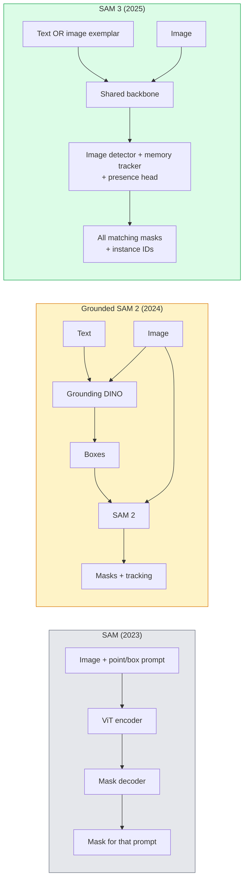

# SAM 3 与开放词汇分割

> 给模型一个文本提示和一张图像，即可获取每个匹配对象的掩码。SAM 3 将此过程压缩为单次前向传播。

**类型：** 使用 + 构建
**语言：** Python
**先修课程：** 第四阶段第 07 课（U-Net）、第四阶段第 08 课（Mask R-CNN）、第四阶段第 18 课（CLIP）
**时长：** 约 60 分钟

## 学习目标

- 区分 SAM（仅视觉提示）、Grounded SAM / SAM 2（检测器 + SAM）和 SAM 3（通过可提示概念分割实现原生文本提示）
- 解释 SAM 3 的架构：共享主干网络 + 图像检测器 + 基于记忆的视频追踪器 + 存在性头 + 解耦的检测器-追踪器设计
- 使用 Hugging Face `transformers` 集成进行文本提示的检测、分割和视频追踪
- 根据延迟、概念复杂度和部署目标，在 SAM 3、Grounded SAM 2、YOLO-World 和 SAM-MI 之间进行选择

## 问题所在

2023 年的 SAM 是一个仅限视觉提示的模型：你点击一个点或画一个框，它返回一个掩码。对于“给我这张照片里的所有橙子”这类需求，你需要一个检测器（Grounding DINO）来生成框，然后用 SAM 对每个框进行分割。Grounded SAM 将此转变为一个流程，但这是两个冻结模型的级联，不可避免地会导致误差累积。

SAM 3（Meta，2025 年 11 月，ICLR 2026）消除了这种级联。它接受一个简短的名词短语或一个图像范例作为提示，并在一次前向传播中返回所有匹配的掩码和实例 ID。这就是**可提示概念分割（PCS）**。结合 2026 年 3 月的物体多重更新（SAM 3.1），它能高效地在视频中追踪同一概念的多个实例。

本课将探讨这一转变所代表的结构性变化。二维分割、检测和文本-图像 grounding 已融合到一个模型中。生产中的问题不再是“我该串联哪个流程”，而是“哪个可提示模型能端到端地处理我的用例。”

## 核心概念

### 三代演进



### 可提示概念分割

“概念提示”是一个简短的名词短语（`"yellow school bus"`、`"striped red umbrella"`、`"hand holding a mug"`）或一个图像范例。模型返回图像中每个匹配该概念的实例的分割掩码，并为每个匹配项提供一个唯一的实例 ID。

这与经典视觉提示 SAM 的区别体现在三个方面：

1.  无需逐实例提示 —— 一个文本提示即可返回所有匹配项。
2.  开放词汇 —— 概念可以是自然语言可描述的任何事物。
3.  一次返回多个实例，而不是每个提示只返回一个掩码。

### 关键架构组件

- **共享主干网络** —— 单个 ViT 处理图像。检测头和基于记忆的追踪器都从中读取特征。
- **存在性头** —— 预测图像中是否存在该概念。将“这里有没有？”与“在哪里？”解耦。减少了对不存在概念的误报。
- **解耦的检测器-追踪器** —— 图像级别的检测和视频级别的追踪拥有独立的头，因此它们互不干扰。
- **记忆库** —— 跨帧存储每个实例的特征，用于视频追踪（与 SAM 2 使用的机制相同）。

### 大规模训练

SAM 3 在一个数据引擎生成的 **400 万个独特概念** 上进行训练，该引擎通过 AI + 人工审查进行迭代标注和修正。新的 **SA-CO 基准测试** 包含 27 万个独特概念，比之前的基准测试大 50 倍。SAM 3 在 SA-CO 上达到人类表现的 75-80%，并在图像 + 视频 PCS 上比现有系统性能提升一倍。

### SAM 3.1 物体多重

2026 年 3 月更新：**物体多重** 引入了共享内存机制，用于一次性联合追踪同一概念的许多实例。以前，追踪 N 个实例意味着需要 N 个独立的记忆库。多重更新将其压缩为一个带有逐实例查询的共享内存。结果：在不牺牲精度的情况下，多物体追踪速度大幅提升。

### Grounded SAM 在 2026 年仍然重要的场景

- 当你需要换入特定的开放词汇检测器（DINO-X、Florence-2）时。
- 当 SAM 3 的许可证（在 Hugging Face 上有访问限制）成为阻碍时。
- 当你需要比 SAM 3 提供的更多对检测器阈值的控制时。
- 用于检测器组件的研究/消融工作。

模块化流程仍有其用武之地。对于大多数生产工作，SAM 3 是更简单的答案。

### YOLO-World 对比 SAM 3

- **YOLO-World** —— 仅开放词汇检测器（无掩码）。实时。适用于需要高帧率边界框的场景。
- **SAM 3** —— 完整分割 + 追踪。较慢但输出更丰富。

生产划分：YOLO-World 用于快速仅检测的流程（机器人导航、快速仪表盘），SAM 3 用于任何需要掩码或追踪的场景。

### SAM-MI 的效率

SAM-MI (2025-2026) 解决了 SAM 解码器的瓶颈。关键思想：

- **稀疏点提示** —— 使用少量精心选择的点而不是密集提示；将解码器调用减少 96%。
- **浅层掩码聚合** —— 将粗糙的掩码预测合并为一个更清晰的掩码。
- **解耦的掩码注入** —— 解码器接收预计算的掩码特征，而不是重新运行。

结果：在开放词汇基准测试上，比 Grounded-SAM 速度提升约 1.6 倍。

### 三种模型的输出格式

所有模型都返回相同通用结构（边界框 + 标签 + 分数 + 掩码 + ID），这很有帮助 —— 你的下游流程无需因运行模型的不同而分支。

## 动手构建

### 第一步：构建提示

构建一个辅助函数，将用户输入的句子转换为 SAM 3 概念提示列表。这是“用户输入内容”与“模型所需输入”相遇的边界。

```python
def split_concepts(sentence):
    """
    Heuristic splitter for multi-concept prompts.
    Returns list of short noun phrases.
    """
    for sep in [",", ";", "and", "or", "&"]:
        if sep in sentence:
            parts = [p.strip() for p in sentence.replace("and ", ",").split(",")]
            return [p for p in parts if p]
    return [sentence.strip()]

print(split_concepts("cats, dogs and balloons"))
```

SAM 3 每次前向传播接受一个概念；对于多概念查询，需要循环或批量处理。

### 第二步：后处理辅助函数

将 SAM 3 的原始输出转换为干净的检测列表，使其符合我们第四阶段第 16 课的流程规范。

```python
from dataclasses import dataclass
from typing import List

@dataclass
class ConceptDetection:
    concept: str
    instance_id: int
    box: tuple          # (x1, y1, x2, y2)
    score: float
    mask_rle: str       # run-length encoded


def rle_encode(binary_mask):
    flat = binary_mask.flatten().astype("uint8")
    runs = []
    prev, count = flat[0], 0
    for v in flat:
        if v == prev:
            count += 1
        else:
            runs.append((int(prev), count))
            prev, count = v, 1
    runs.append((int(prev), count))
    return ";".join(f"{v}x{c}" for v, c in runs)
```

RLE 即使面对许多高分辨率掩码也能保持响应负载较小。相同的格式适用于 SAM 2、SAM 3、Grounded SAM 2。

### 第三步：统一的开放词汇分割接口

将你拥有的任何后端（SAM 3、Grounded SAM 2、YOLO-World + SAM 2）包装在单个方法之后。当后端更换时，你的下游代码无需更改。

```python
from abc import ABC, abstractmethod
import numpy as np

class OpenVocabSeg(ABC):
    @abstractmethod
    def detect(self, image: np.ndarray, concept: str) -> List[ConceptDetection]:
        ...


class StubOpenVocabSeg(OpenVocabSeg):
    """
    Deterministic stub used for pipeline testing when real models are not loaded.
    """
    def detect(self, image, concept):
        h, w = image.shape[:2]
        return [
            ConceptDetection(
                concept=concept,
                instance_id=0,
                box=(w * 0.2, h * 0.3, w * 0.5, h * 0.8),
                score=0.89,
                mask_rle="0x100;1x50;0x200",
            ),
            ConceptDetection(
                concept=concept,
                instance_id=1,
                box=(w * 0.55, h * 0.25, w * 0.85, h * 0.75),
                score=0.74,
                mask_rle="0x80;1x40;0x220",
            ),
        ]
```

实际的 `SAM3OpenVocabSeg` 子类将包装 `transformers.Sam3Model` 和 `Sam3Processor`。

### 第四步：Hugging Face SAM 3 用法（参考）

对于实际模型，`transformers` 集成：

```python
from transformers import Sam3Processor, Sam3Model
import torch

processor = Sam3Processor.from_pretrained("facebook/sam3")
model = Sam3Model.from_pretrained("facebook/sam3").eval()

inputs = processor(images=pil_image, return_tensors="pt")
inputs = processor.set_text_prompt(inputs, "yellow school bus")

with torch.no_grad():
    outputs = model(**inputs)

masks = processor.post_process_masks(
    outputs.masks, inputs.original_sizes, inputs.reshaped_input_sizes
)
boxes = outputs.boxes
scores = outputs.scores
```

一个提示，所有匹配项在一次调用中返回。

### 第五步：衡量 Grounded SAM 2 为你带来的免费功能

一个诚实的基准测试：在真实流程中，用 SAM 3 替换 Grounded SAM 2 会发生什么？

- 延迟：SAM 3 节省了一次前向传播（无需单独的检测器），但模型本身更重；通常净结果是中性或略有加速。
- 准确性：SAM 3 在稀有或组合概念（“条纹红伞”）上表现明显更好。在常见的单词概念上表现相似。
- 灵活性：Grounded SAM 2 允许你更换检测器（DINO-X、Florence-2、Grounding DINO 1.5）；SAM 3 是单体模型。

结论：SAM 3 是 2026 年开放词汇分割的默认选择。当你需要检测器灵活性或不同的许可证条款时，Grounded SAM 2 仍然是正确答案。

## 实际应用

生产部署模式：

- **实时标注** —— SAM 3 + CVAT 的“将标签作为文本提示”功能。标注员选择一个标签名称；SAM 3 预标注每个匹配的实例。然后审核和修正。
- **视频分析** —— SAM 3.1 物体多重用于多物体追踪；将帧输入基于记忆的追踪器。
- **机器人** —— SAM 3 用于开放词汇操作（“捡起红色杯子”）；作为规划原语运行。
- **医学影像** —— SAM 3 在医学概念上进行微调；需要在 Hugging Face 上申请访问。

Ultralytics 在其 Python 包中封装了 SAM 3：

```python
from ultralytics import SAM

model = SAM("sam3.pt")
results = model(image_path, prompts="yellow school bus")
```

与 YOLO 和 SAM 2 的接口相同。

## 部署上线

本课程将产出：

- `outputs/prompt-open-vocab-stack-picker.md` —— 一个根据延迟、概念复杂度和许可证选择 SAM 3 / Grounded SAM 2 / YOLO-World / SAM-MI 的提示。
- `outputs/skill-concept-prompt-designer.md` —— 一项将用户话语转换为格式规范的 SAM 3 概念提示的技能（拆分、消歧、回退）。

## 练习

1.  **（简单）** 用你选择的十个图像概念提示运行 SAM 3。与 SAM 2 + Grounding DINO 1.5 在相同图像上的表现进行对比。报告每个模型遗漏了哪些概念。
2.  **（中等）** 在 SAM 3 之上构建一个“点击包含 / 点击排除”的用户界面：一个文本提示返回候选实例；用户点击保留哪些计为正样本。将最终的概念集合输出为 JSON。
3.  **（困难）** 在一个自定义概念集（例如，5 种电子元件）上微调 SAM 3，每个概念 20 张带标签的图像。与相同测试集上的零样本 SAM 3 进行比较；衡量掩码 IoU 的改进。

## 关键术语

| 术语 | 人们怎么说 | 实际含义 |
|------|----------|--------|
| 开放词汇分割 | “按文本分割” | 为自然语言描述的对象生成掩码，而非针对固定标签集 |
| PCS | “可提示概念分割” | SAM 3 的核心任务 —— 给定一个名词短语或图像范例，分割所有匹配的实例 |
| 概念提示 | “文本输入” | 简短的名词短语或图像范例；不是完整的句子 |
| 存在性头 | “它在吗？” | SAM 3 中决定图像中是否存在该概念再进行定位的模块 |
| SA-CO | “SAM 3 基准测试” | 包含 27 万个概念的开放词汇分割基准测试；比之前的开放词汇基准测试大 50 倍 |
| 物体多重 | “SAM 3.1 更新” | 共享内存多物体追踪；快速联合追踪许多实例 |
| Grounded SAM 2 | “模块化流程” | 检测器 + SAM 2 级联；在检测器更换很重要时仍然适用 |
| SAM-MI | “高效 SAM 变体” | 通过掩码注入实现比 Grounded-SAM 1.6 倍加速 |

## 扩展阅读

- [SAM 3: Segment Anything with Concepts (arXiv 2511.16719)](https://arxiv.org/abs/2511.16719)
- [SAM 3.1 Object Multiplex (Meta AI, March 2026)](https://ai.meta.com/blog/segment-anything-model-3/)
- [SAM 3 model page on Hugging Face](https://huggingface.co/facebook/sam3)
- [Grounded SAM 2 tutorial (PyImageSearch)](https://pyimagesearch.com/2026/01/19/grounded-sam-2-from-open-set-detection-to-segmentation-and-tracking/)
- [Ultralytics SAM 3 docs](https://docs.ultralytics.com/models/sam-3/)
- [SAM3-I: Instruction-aware SAM (arXiv 2512.04585)](https://arxiv.org/abs/2512.04585)