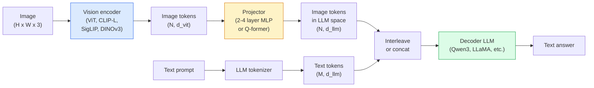

# 视觉语言模型 —— ViT-MLP-LLM 架构模式

> 一个视觉编码器将图像转换为token。一个MLP投影器将这些token映射到LLM的嵌入空间。剩下的工作交给语言模型完成。这个模式——ViT-MLP-LLM——是2026年所有生产级VLM的标配。

**类型：** 学习 + 实践
**语言：** Python
**先修课程：** 第四阶段 第14课（ViT），第四阶段 第18课（CLIP），第七阶段 第02课（自注意力）
**时间：** 约75分钟

## 学习目标

- 陈述 ViT-MLP-LLM 架构并解释三个组件各自的作用
- 在参数量、上下文长度和基准性能方面比较 Qwen3-VL、InternVL3.5、LLaVA-Next 和 GLM-4.6V
- 解释 DeepStack：为什么多层ViT特征比单一的最后层特征能更好地实现视觉-语言对齐
- 使用跨模态错误率 (CMER) 衡量生产环境中VLM的幻觉问题，并根据该指标采取行动

## 问题所在

CLIP（第四阶段 第18课）为你提供了一个图像和文本的共享嵌入空间，这足以实现零样本分类和检索。但它无法回答“这张图片中有多少辆红色汽车？”因为CLIP不会生成文本——它只计算相似度。

视觉语言模型（VLMs）——Qwen3-VL、InternVL3.5、LLaVA-Next、GLM-4.6V——将CLIP家族的图像编码器附加到一个完整的语言模型上。模型接收一张图片和一个问题，然后生成答案。在2026年，开源VLM在多模态基准（MMMU、MMBench、DocVQA、ChartQA、MathVista、OSWorld）上可媲美或超越GPT-5和Gemini-2.5-Pro。

组件三件套（ViT、投影器、LLM）是标准配置。模型之间的区别在于使用哪个ViT、哪个投影器、哪个LLM、训练数据以及对齐方法。一旦你理解了这个模式，更换任何组件都是机械操作。

## 核心概念

### ViT-MLP-LLM 架构



1.  **视觉编码器** —— 一个预训练的ViT（CLIP-L/14、SigLIP、DINOv3 或其微调变体）。输出 patch token。
2.  **投影器** —— 一个小型模块（2-4层MLP或Q-former），用于将视觉token映射到LLM的嵌入维度。这是微调的主要发生地。
3.  **LLM** —— 一个纯解码器语言模型（Qwen3、Llama、Mistral、GLM、InternLM）。按顺序读取视觉和文本token，并生成文本。

理论上，这三个组件都是可训练的。实际上，在训练投影器时，视觉编码器和LLM大多保持冻结——用极少的参数传递大量信号，成本低廉。

### DeepStack

普通的投影仅使用ViT的最后一层。DeepStack（来自Qwen3-VL）从多个ViT深度采样特征并堆叠起来。更深的层承载高层语义；较浅的层承载细粒度的空间和纹理信息。将两者同时输入LLM，可以弥合“图像包含什么”（语义）与“具体在哪里”（空间定位）之间的差距。

### 三个训练阶段

现代VLM分阶段训练：

1.  **对齐** —— 冻结ViT和LLM。仅使用图像-描述对训练投影器。教会投影器将视觉空间映射到语言空间。
2.  **预训练** —— 解冻所有组件。在大规模交错图像-文本数据（5亿+对）上训练。构建模型的视觉知识。
3.  **指令微调** —— 在精心策划的（图像、问题、答案）三元组上进行微调。教会模型对话行为和任务格式。这能将“具备视觉感知能力的语言模型”转变为可用的助手。

大多数LoRA微调针对第3阶段，使用小型带标签数据集。

### 模型家族对比（2026年初）

| 模型 | 参数量 | 视觉编码器 | LLM | 上下文长度 | 优势 |
|-------|--------|----------------|-----|---------|-----------|
| Qwen3-VL-235B-A22B (MoE) | 235B (22B 活跃) | 定制 ViT + DeepStack | Qwen3 | 256K | 综合最优，GUI智能体 |
| Qwen3-VL-30B-A3B (MoE) | 30B (3B 活跃) | 定制 ViT + DeepStack | Qwen3 | 256K | 更小的 MoE 替代方案 |
| Qwen3-VL-8B (稠密) | 8B | 定制 ViT | Qwen3 | 128K | 生产环境稠密模型默认选择 |
| InternVL3.5-38B | 38B | InternViT-6B | Qwen3 + GPT-OSS | 128K | MMBench / MMVet 性能强劲 |
| InternVL3.5-241B-A28B | 241B (28B 活跃) | InternViT-6B | Qwen3 | 128K | 与 GPT-4o 竞争力相当 |
| LLaVA-Next 72B | 72B | SigLIP | Llama-3 | 32K | 开源，易于微调 |
| GLM-4.6V | ~70B | 定制 | GLM | 64K | 开源，OCR能力强 |
| MiniCPM-V-2.6 | 8B | SigLIP | MiniCPM | 32K | 适合边缘设备 |

### 视觉智能体

Qwen3-VL-235B 在 OSWorld 上达到了全球顶尖性能——这是一个用于**视觉智能体**的基准测试，这些智能体操作图形用户界面（桌面、移动、网页）。模型查看截图，理解用户界面，并发出动作（点击、输入、滚动）。结合工具，它能完成常见的桌面任务闭环。这就是2026年大多数“AI PC”演示背后的原理。

### 智能体能力 + RoPE 变体

VLM需要知道视频中的帧发生在**何时**。Qwen3-VL 从 T-RoPE（时间旋转位置嵌入）发展到**基于文本的时间对齐**——将显式的时间戳文本token与视频帧交错。模型看到“`<timestamp 00:32>` 帧，提示”，并能推理时间关系。

### 对齐问题

一个爬取数据集中有12%的图像-文本对包含不完全基于图像的描述。在此数据上训练的VLM会悄悄学会产生幻觉——捏造物体、误读数字、编造关系。在生产环境中，这是主要的失败模式。

Skywork.ai 引入了**跨模态错误率**来跟踪它：

```
CMER = fraction of outputs where the text confidence is high but the image-text similarity (via a CLIP-family checker) is low
```

高CMER意味着模型自信地说出的某些内容在图像中没有依据。将CMER作为生产关键绩效指标进行监控，并在其部署中将幻觉率降低了约35%。技巧不在于“修复模型”，而在于“将高CMER输出路由到人工审核”。

### 使用 LoRA / QLoRA 进行微调

对70B的VLM进行全面微调对大多数团队来说不现实。对注意力层和投影器层应用LoRA（秩16-64），或使用QLoRA（4位基础权重），可以在单个A100/H100上运行。成本：5,000到50,000个样本，100到5,000美元的计算费用，2到10小时的训练时间。

### 空间推理仍然薄弱

当前VLM在空间推理基准测试（上下、左右、计数、距离）上的得分在50-60%之间。如果你的用例依赖于“哪个物体在哪个物体上方”，请务必严格验证——通用VLM的性能低于人类。对于纯空间任务，优于VLM的替代方案包括：专门的关键点/姿态估计器、深度模型，或带有边界盒几何后处理的检测模型。

## 构建它

### 第一步：投影器

这是你最常训练的部分。带GELU激活的2-4层MLP。

```python
import torch
import torch.nn as nn


class Projector(nn.Module):
    def __init__(self, vit_dim=768, llm_dim=4096, hidden=4096):
        super().__init__()
        self.net = nn.Sequential(
            nn.Linear(vit_dim, hidden),
            nn.GELU(),
            nn.Linear(hidden, llm_dim),
        )

    def forward(self, x):
        return self.net(x)
```

输入是一个 `(N_patches, d_vit)` 的token张量。输出是 `(N_patches, d_llm)`。LLM将每一行输出都视为又一个token。

### 第二步：端到端组装 ViT-MLP-LLM

一个最小化VLM的前向传播骨架。实际代码使用 `transformers`；这是概念性布局。

```python
class MinimalVLM(nn.Module):
    def __init__(self, vit, projector, llm, image_token_id):
        super().__init__()
        self.vit = vit
        self.projector = projector
        self.llm = llm
        self.image_token_id = image_token_id  # placeholder token in text prompt

    def forward(self, image, input_ids, attention_mask):
        # 1. vision features
        vision_tokens = self.vit(image)                     # (B, N_patches, d_vit)
        vision_embeds = self.projector(vision_tokens)       # (B, N_patches, d_llm)

        # 2. text embeddings
        text_embeds = self.llm.get_input_embeddings()(input_ids)  # (B, M, d_llm)

        # 3. replace image placeholder tokens with vision embeds
        merged = self._merge(text_embeds, vision_embeds, input_ids)

        # 4. run LLM
        return self.llm(inputs_embeds=merged, attention_mask=attention_mask)

    def _merge(self, text_embeds, vision_embeds, input_ids):
        out = text_embeds.clone()
        expected = vision_embeds.size(1)
        for b in range(input_ids.size(0)):
            positions = (input_ids[b] == self.image_token_id).nonzero(as_tuple=True)[0]
            if len(positions) != expected:
                raise ValueError(
                    f"batch item {b} has {len(positions)} image tokens but vision_embeds has {expected} patches."
                    " Every sample in the batch must be pre-padded to the same number of image placeholder tokens.")
            out[b, positions] = vision_embeds[b]
        return out
```

文本中的 `<image>` 占位符token会被真实的图像嵌入替换——LLaVA、Qwen-VL和InternVL都使用相同的模式。

### 第三步：CMER 计算

一个轻量级的运行时检查。

```python
import torch.nn.functional as F


def cross_modal_error_rate(image_emb, text_emb, text_confidence, sim_threshold=0.25, conf_threshold=0.8):
    """
    image_emb, text_emb: embeddings of image and generated text (normalised internally)
    text_confidence:     mean per-token probability in [0, 1]
    Returns:             fraction of high-confidence outputs with low image-text alignment
    """
    image_emb = F.normalize(image_emb, dim=-1)
    text_emb = F.normalize(text_emb, dim=-1)
    sim = (image_emb * text_emb).sum(dim=-1)        # cosine similarity
    high_conf_low_sim = (text_confidence > conf_threshold) & (sim < sim_threshold)
    return high_conf_low_sim.float().mean().item()
```

将CMER作为生产KPI。按端点、提示类型和客户进行监控。CMER上升表明模型在某些输入分布上开始产生幻觉。

### 第四步：玩具VLM分类器（可运行）

演示投影器的训练过程。输入伪造的“ViT特征”；一个微小的类LLM token预测一个类别。

```python
class ToyVLM(nn.Module):
    def __init__(self, vit_dim=32, llm_dim=64, num_classes=5):
        super().__init__()
        self.projector = Projector(vit_dim, llm_dim, hidden=64)
        self.head = nn.Linear(llm_dim, num_classes)

    def forward(self, vision_tokens):
        projected = self.projector(vision_tokens)
        pooled = projected.mean(dim=1)
        return self.head(pooled)
```

可以在合成（特征，类别）对上用不到200步拟合——足以展示投影器模式的工作原理。

## 使用它

2026年生产团队使用VLM的三种方式：

- **托管API** —— OpenAI Vision、Anthropic Claude Vision、Google Gemini Vision。零基础设施投入，但存在供应商风险。
- **开源自托管** —— 通过 `transformers` 和 `vllm` 使用 Qwen3-VL 或 InternVL3.5。完全控制，前期投入较高。
- **在特定领域微调** —— 加载 Qwen2.5-VL-7B 或 LLaVA-1.6-7B，在5k到50k自定义样本上应用LoRA，使用 `vllm` 或 `TGI` 提供服务。

```python
from transformers import AutoProcessor, AutoModelForVision2Seq
import torch
from PIL import Image

model_id = "Qwen/Qwen3-VL-8B-Instruct"
processor = AutoProcessor.from_pretrained(model_id)
model = AutoModelForVision2Seq.from_pretrained(model_id, torch_dtype=torch.bfloat16, device_map="auto")

messages = [{
    "role": "user",
    "content": [
        {"type": "image", "image": Image.open("plot.png")},
        {"type": "text", "text": "What does this chart show?"},
    ],
}]
inputs = processor.apply_chat_template(messages, add_generation_prompt=True, tokenize=True, return_dict=True, return_tensors="pt").to("cuda")
generated = model.generate(**inputs, max_new_tokens=256)
answer = processor.decode(generated[0][inputs["input_ids"].shape[1]:], skip_special_tokens=True)
```

`apply_chat_template` 隐藏了 `<image>` 占位符的分词过程；模型内部会处理合并。

## 部署它

本课产出：

- `outputs/prompt-vlm-selector.md` —— 根据准确性、延迟、上下文长度和预算，选择 Qwen3-VL / InternVL3.5 / LLaVA-Next / API。
- `outputs/skill-cmer-monitor.md` —— 生成代码，为生产VLM端点添加跨模态错误率监控、按端点仪表盘和告警阈值。

## 练习

1.  **（简单）** 对任意开源VLM使用五张图像，运行三个提示（“这是什么？”，“数物体”，“描述场景”）。手动评分每个答案为正确/部分正确/幻觉。计算一个初步的类CMER率。
2.  **（中等）** 使用LoRA（秩16），在500张目标域图像及其描述上微调Qwen2.5-VL-3B或LLaVA-1.6-7B。比较零样本与微调后的MMBench风格准确率。
3.  **（困难）** 将VLM的图像编码器替换为DINOv3（而非默认的SigLIP/CLIP）。仅重新训练投影器（冻结LLM + 冻结DINOv3）。衡量密集预测任务（计数、空间推理）是否有所改善。

## 关键术语

| 术语 | 人们常说什么 | 它的实际含义 |
|------|----------------|----------------------|
| ViT-MLP-LLM | “VLM模式” | 视觉编码器 + 投影器 + 语言模型；2026年所有VLM |
| 投影器 | “桥梁” | 2-4层MLP（或Q-former），将视觉token映射到LLM嵌入空间 |
| DeepStack | “Qwen3-VL的特征技巧” | 多层ViT特征堆叠，而非仅使用最后一层 |
| 图像token | “<image>占位符” | 文本流中被投影后的视觉嵌入替换的特殊token |
| CMER | “幻觉KPI” | 跨模态错误率；当文本置信度高但图文相似度低时，CMER升高 |
| 视觉智能体 | “会点击的VLM” | 操作GUI（OSWorld、移动端、网页）并进行工具调用的VLM |
| Q-former | “固定数量token的桥梁” | BLIP-2风格的投影器，产生固定数量的视觉查询token |
| 对齐 / 预训练 / 指令微调 | “三个阶段” | 标准VLM训练流程 |

## 扩展阅读

- [Qwen3-VL 技术报告 (arXiv 2511.21631)](https://arxiv.org/abs/2511.21631)
- [InternVL3.5 推进开源多模态模型 (arXiv 2508.18265)](https://arxiv.org/html/2508.18265v1)
- [LLaVA-Next 系列](https://llava-vl.github.io/blog/2024-05-10-llava-next-stronger-llms/)
- [BentoML：2026年最佳开源VLM](https://www.bentoml.com/blog/multimodal-ai-a-guide-to-open-source-vision-language-models)
- [MMMU：多学科多模态理解基准](https://mmmu-benchmark.github.io/)
- [制造业中的VLM（Robotics Tomorrow，2026年3月）](https://www.roboticstomorrow.com/story/2026/03/when-machines-learn-to-see-like-experts-the-rise-of-vision-language-models-in-manufacturing/26335/)