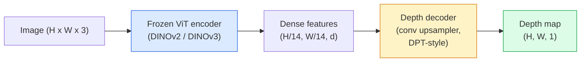

# 单目深度与几何估计

> 深度图是单通道图像，每个像素表示与相机的距离。在2026年之前，仅凭单张RGB图像预测深度通常需要立体视觉或激光雷达数据。如今，经过冻结的ViT编码器加上轻量级头网络，预测精度已能逼近真实值几个百分点。

**类型:** 构建 + 应用
**语言:** Python
**前置课程:** 第4阶段课程14（ViT）、第4阶段课程17（自监督视觉）、第4阶段课程07（U-Net）
**学习时间:** 约60分钟

## 学习目标

- 区分相对深度与度量深度，并说明每个生产模型（MiDaS、Marigold、Depth Anything V3、ZoeDepth）分别解决哪种类型
- 使用Depth Anything V3（DINOv2骨干网络）为任意单张图像预测深度，无需标定
- 解释单张图像为何能推断深度（透视线索、纹理梯度、学习先验）及其无法恢复的内容（绝对尺度、遮挡几何）
- 利用深度图和针孔相机内参将2D检测提升为3D点

## 问题本质

深度是二维计算机视觉中缺失的维度。给定RGB图像，你仅知物体在图像平面的位置；却不知其距离远近。深度传感器（立体视觉系统、激光雷达、飞行时间相机）能直接解决此问题，但价格昂贵、易损坏且测量范围有限。

单目深度估计——从单张RGB图像预测深度——以往常产生模糊且不可靠的结果。至2026年，大型预训练编码器改变了这一现状：Depth Anything V3使用冻结的DINOv2骨干网络，能在室内、室外、医疗及卫星等领域生成具有泛化能力的深度图。Marigold将深度重构为条件扩散问题。ZoeDepth则直接回归真实度量距离。

深度也是连接2D检测与3D理解的桥梁：将检测框的像素与深度相乘，即可将2D物体提升至3D点云空间。这正是所有AR遮挡系统、障碍物避让流水线以及"拿起杯子"机器人指令的核心基础。

## 核心概念

### 相对深度与度量深度

- **相对深度** —— 有序的`z`值，无现实世界单位。"像素A比像素B更近，但距离比例未锚定到米制单位。"
- **度量深度** —— 相机至物体的绝对距离（以米为单位）。要求模型学习图像线索与真实距离间的统计关系。

MiDaS和Depth Anything V3生成相对深度。Marigold生成相对深度。ZoeDepth、UniDepth和Metric3D生成度量深度。度量模型对相机内参敏感；相对模型则不敏感。

### 编码器-解码器架构



Depth Anything V3冻结编码器，仅训练DPT风格的解码器。编码器提供丰富特征；解码器将其插值回图像分辨率并回归深度。

### 单张图像为何能推断深度

二维图像包含许多与深度相关的单目线索：

- **透视** —— 三维空间中的平行线在二维投影中会聚。
- **纹理梯度** —— 远处表面的纹理更密集、更细小。
- **遮挡顺序** —— 较近物体遮挡较远物体。
- **尺寸恒常性** —— 已知物体（如汽车、人体）提供近似尺度参考。
- **大气透视** —— 室外场景中，远处物体显得更朦胧、更偏蓝。

在数十亿图像上训练的ViT能内化这些线索。凭借足够数据和强大骨干网络，无需显式3D监督即可实现合理的单目深度预测精度。

### 单目深度的局限性

- **无绝对度量尺度**：缺乏相机内参或场景中已知物体时，网络只能预测"杯子比勺子远两倍"，却无法确定杯子具体距离是1米还是10米。
- **遮挡几何** —— 椅子背面不可见，无法可靠推断。
- **真正无纹理/反光表面** —— 镜面、玻璃、均匀墙壁。网络会输出看似合理但错误的深度值。

### 2026年的Depth Anything V3

- 采用标准DINOv2 ViT-L/14作为编码器（已冻结）。
- 配备DPT解码器。
- 基于多源成对姿态图像训练（仅需光度一致性，无需显式深度监督）。
- 可从**任意数量视觉输入（是否已知相机姿态均可）**预测空间一致的几何结构。
- 在单目深度、任意视角几何、视觉渲染、相机姿态估计等任务中达到SOTA水平。

这是2026年需要深度信息时即用即调的首选模型。

### Marigold —— 基于扩散的深度估计

Marigold（Ke等人，CVPR 2024）将深度估计重构为条件图像到图像的扩散任务。条件输入：RGB图像。目标输出：深度图。采用预训练Stable Diffusion 2 U-Net作为骨干网络。输出深度图在物体边界处异常清晰。权衡代价：推理速度慢于前馈模型（需10-50步去噪）。

### 相机内参与针孔模型

将像素`(u, v)`与深度`d`提升为相机坐标系下的3D点`(X, Y, Z)`：

```
fx, fy, cx, cy = camera intrinsics
X = (u - cx) * d / fx
Y = (v - cy) * d / fy
Z = d
```

内参可从EXIF元数据、标定图案或单目内参估计器（Perspective Fields、UniDepth）获得。若无内参，可假设60-70°视场角和适中分辨率的主点进行点云渲染——适用于可视化，但不适用于精确测量。

### 评估指标

两个标准指标：

- **AbsRel**（绝对相对误差）：`mean(|d_pred - d_gt| / d_gt)`。越低越好。生产模型通常在0.05-0.1区间。
- **delta < 1.25**（阈值精度）：满足`max(d_pred/d_gt, d_gt/d_pred) < 1.25`的像素比例。越高越好。SOTA模型可达0.9以上。

对于相对深度模型（如Depth Anything V3、MiDaS），评估时需使用对缩放和平移不敏感的指标变体。

## 实践构建

### 第1步：深度评估指标

```python
import torch

def abs_rel_error(pred, target, mask=None):
    if mask is not None:
        pred = pred[mask]
        target = target[mask]
    return (torch.abs(pred - target) / target.clamp(min=1e-6)).mean().item()


def delta_accuracy(pred, target, threshold=1.25, mask=None):
    if mask is not None:
        pred = pred[mask]
        target = target[mask]
    ratio = torch.maximum(pred / target.clamp(min=1e-6), target / pred.clamp(min=1e-6))
    return (ratio < threshold).float().mean().item()
```

评估前必须掩蔽无效深度像素（零值、NaN、饱和值）。

### 第2步：缩放-平移对齐

对于相对深度模型，计算指标前需将预测值对齐真实值。通过最小二乘法拟合`a * pred + b = target`：

```python
def align_scale_shift(pred, target, mask=None):
    if mask is not None:
        p = pred[mask]
        t = target[mask]
    else:
        p = pred.flatten()
        t = target.flatten()
    A = torch.stack([p, torch.ones_like(p)], dim=1)
    coeffs, *_ = torch.linalg.lstsq(A, t.unsqueeze(-1))
    a, b = coeffs[:2, 0]
    return a * pred + b
```

评估MiDaS / Depth Anything模型时，需在`abs_rel_error`前运行`align_scale_shift`。

### 第3步：深度提升为点云

```python
import numpy as np

def depth_to_point_cloud(depth, intrinsics):
    H, W = depth.shape
    fx, fy, cx, cy = intrinsics
    v, u = np.meshgrid(np.arange(H), np.arange(W), indexing="ij")
    z = depth
    x = (u - cx) * z / fx
    y = (v - cy) * z / fy
    return np.stack([x, y, z], axis=-1)


depth = np.random.uniform(0.5, 4.0, (240, 320))
intr = (320.0, 320.0, 160.0, 120.0)
pc = depth_to_point_cloud(depth, intr)
print(f"point cloud shape: {pc.shape}  (H, W, 3)")
```

一个函数即可实现所有3D提升应用。将点云导出至`.ply`，使用MeshLab或CloudCompare打开查看。

### 第4步：合成深度场景测试

```python
def synthetic_depth(size=96):
    yy, xx = np.meshgrid(np.arange(size), np.arange(size), indexing="ij")
    # Floor: linear gradient from near (top) to far (bottom)
    depth = 1.0 + (yy / size) * 4.0
    # Box in the middle: closer
    mask = (np.abs(xx - size / 2) < size / 6) & (np.abs(yy - size * 0.6) < size / 6)
    depth[mask] = 2.0
    return depth.astype(np.float32)


gt = torch.from_numpy(synthetic_depth(96))
pred = gt + 0.3 * torch.randn_like(gt)  # simulated prediction
aligned = align_scale_shift(pred, gt)
print(f"before align  absRel = {abs_rel_error(pred, gt):.3f}")
print(f"after align   absRel = {abs_rel_error(aligned, gt):.3f}")
```

### 第5步：Depth Anything V3使用示例（参考）

```python
import torch
from transformers import pipeline
from PIL import Image

pipe = pipeline(task="depth-estimation", model="LiheYoung/depth-anything-v2-large")

image = Image.open("street.jpg").convert("RGB")
out = pipe(image)
depth_np = np.array(out["depth"])
```

仅需三行代码。`out["depth"]`是PIL灰度图；进行数学运算前需转换为numpy数组。针对Depth Anything V3，发布后替换模型ID即可；API保持不变。

## 实际应用

- **Depth Anything V3**（Meta AI / 字节跳动，2024-2026）—— 相对深度默认选择。生产环境中ViT大型骨干网络模型中速度最快。
- **Marigold**（苏黎世联邦理工，2024）—— 最高视觉质量，推理速度较慢。
- **UniDepth**（苏黎世联邦理工，2024）—— 支持相机内参估计的度量深度模型。
- **ZoeDepth**（英特尔，2023）—— 度量深度模型；发布时间较早但仍可靠。
- **MiDaS v3.1** —— 经典稳定版本；良好的对比基准。

典型集成模式：

1. 输入RGB帧。
2. 深度模型生成深度图。
3. 检测器输出边界框。
4. 通过深度信息将框中心提升至3D；如有可用点云则进行融合。
5. 下游应用：AR遮挡、路径规划、物体尺寸估计、立体视觉替代。

实时应用中，量化为INT8的Depth Anything V2 Small模型在消费级GPU上处理518x518图像可达约30fps。

## 交付成果

本课程将产出：

- `outputs/prompt-depth-model-picker.md` —— 根据延迟需求、度量/相对深度选择及场景类型，在Depth Anything V3、Marigold、UniDepth、MiDaS间智能选择。
- `outputs/skill-depth-to-pointcloud.md` —— 掌握使用正确内参处理从深度图构建点云并导出至`.ply`的技能。

## 练习题

1. **(简单)** 在书桌任意10张图像上运行Depth Anything V2。将深度保存为灰度PNG并检查。找出一个预测深度明显错误的物体，解释单目线索为何失效。
2. **(中等)** 给定RGB图像及Depth Anything V2深度图，提升为点云并用`open3d`渲染。对比室内/室外两个场景，说明哪个场景更真实可信。
3. **(困难)** 拍摄五组仅改变已知物体位置的图像对（如瓶子移近30厘米）。使用UniDepth预测两组图像的度量深度，报告预测距离差与真实30厘米的偏差。

## 关键术语

| 术语 | 常见表述 | 准确含义 |
|------|----------|----------|
| 单目深度 | "单图深度" | 从单张RGB图像估计深度，无需立体视觉或激光雷达 |
| 相对深度 | "有序深度" | 无现实世界单位的有序z值 |
| 度量深度 | "绝对距离" | 以米为单位的深度；需要标定或通过度量监督训练的模型 |
| AbsRel | "绝对相对误差" | \|d_pred - d_gt\| / d_gt的平均值；标准深度评估指标 |
| delta精度 | "delta < 1.25" | 预测值与真实值相差25%以内的像素比例 |
| 针孔相机 | "fx, fy, cx, cy" | 将(u, v, d)提升为(X, Y, Z)的相机模型 |
| DPT | "密集预测Transformer" | 冻结ViT编码器之上使用的基于卷积的深度解码器 |
| DINOv2骨干 | "核心工作原理" | 跨领域泛化的自监督特征，无需深度标签 |

## 延伸阅读

- [Depth Anything V3论文页面](https://depth-anything.github.io/) —— 使用DINOv2编码器的SOTA单目深度模型
- [Marigold（Ke等人，CVPR 2024）](https://marigoldmonodepth.github.io/) —— 基于扩散的深度估计
- [UniDepth（Piccinelli等人，2024）](https://arxiv.org/abs/2403.18913) —— 支持内参估计的度量深度
- [MiDaS v3.1（英特尔ISL）](https://github.com/isl-org/MiDaS) —— 经典相对深度基准
- [DINOv3博客文章（Meta）](https://ai.meta.com/blog/dinov3-self-supervised-vision-model/) —— 提升深度精度的编码器家族