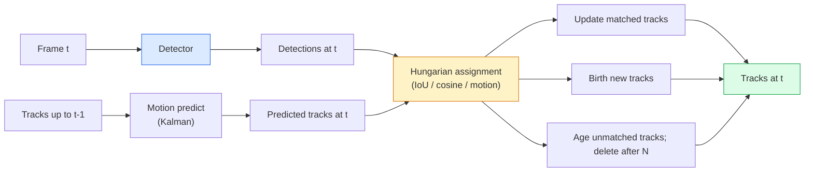

# 多目标跟踪与视频记忆

> 跟踪即检测加关联。逐帧检测，通过ID将本帧检测结果与上一帧跟踪轨迹进行匹配。

**类型:** 构建
**语言:** Python
**先决条件:** 第4阶段课程06（YOLO检测），第4阶段课程08（Mask R-CNN），第4阶段课程24（SAM 3）
**时间:** 约60分钟

## 学习目标

- 区分基于检测的跟踪和基于查询的跟踪，并列举算法家族（SORT, DeepSORT, ByteTrack, BoT-SORT, SAM 2 记忆跟踪器，SAM 3.1 对象复用）
- 从零实现经典检测跟踪中的IoU+匈牙利分配
- 解释SAM 2的记忆库及其为何比基于IoU的关联更好地处理遮挡
- 理解三项跟踪指标（MOTA, IDF1, HOTA），并能根据具体用例选择最相关的指标

## 问题

检测器告诉你单帧中物体的位置。跟踪器告诉你第`t`帧中的哪个检测结果与第`t-1`帧中的检测结果属于同一物体。没有跟踪，你就无法统计过线物体数量、在遮挡中跟踪球的轨迹，或知道“4号车已在车道上行驶8秒”。

跟踪是所有面向视频产品的核心：体育分析、监控、自动驾驶、医疗视频分析、野生动物监测、词频统计。其核心构件是共享的：逐帧检测器、运动模型（卡尔曼滤波器或更复杂的）、关联步骤（基于IoU/余弦/学习特征的匈牙利算法），以及轨迹生命周期（诞生、更新、消亡）。

2026年出现了两种新模式：**基于SAM 2记忆的跟踪**（使用特征记忆而非运动模型关联）和**SAM 3.1 对象复用**（为同一概念的多个实例共享记忆）。本课先讲解经典技术栈，再介绍基于记忆的方法。

## 概念

### 基于检测的跟踪



你在2026年遇到的每个跟踪器都是此循环的变体。区别在于：

- **SORT**（2016）：卡尔曼滤波器 + IoU匈牙利算法。简单、快速，无外观模型。
- **DeepSORT**（2017）：SORT + 每个轨迹的CNN外观特征（ReID嵌入）。能更好地处理交叉。
- **ByteTrack**（2021）：第二阶段关联低置信度检测；无需外观特征但在MOT17上表现最佳。
- **BoT-SORT**（2022）：Byte + 摄像头运动补偿 + ReID。
- **StrongSORT / OC-SORT** —— ByteTrack的改进版，具有更好的运动和外观模型。

### 一段话理解卡尔曼滤波器

卡尔曼滤波器维护每个轨迹的状态`(x, y, w, h, dx, dy, dw, dh)`及其协方差。在每一帧，使用恒速模型**预测**状态，然后用匹配的检测结果**更新**。当预测不确定性高时，更新更信任检测结果。这能产生平滑轨迹，并能在短时遮挡（1-5帧）中持续跟踪。

每个经典跟踪器都在运动预测步骤中使用卡尔曼滤波器。

### 匈牙利算法

给定一个`M x N`代价矩阵（轨迹 x 检测），找到最小化总代价的一对一匹配。代价通常是`1 - IoU(track_bbox, detection_bbox)`或外观特征的负余弦相似度。运行时间复杂度为O((M+N)^3)；对于M、N不超过~1000的情况，通过`scipy.optimize.linear_sum_assignment`在Python中足够快。

### ByteTrack的关键思想

标准跟踪器会丢弃低置信度检测（< 0.5）。ByteTrack将它们保留为**第二阶段候选**：在将轨迹与高置信度检测匹配后，未匹配的轨迹会尝试用稍宽松的IoU阈值与低置信度检测匹配。可恢复短时遮挡和拥挤场景中的ID切换。

### 基于SAM 2记忆的跟踪

SAM 2通过维护一个包含每个实例时空特征的**记忆库**来处理视频。给定一帧上的提示（点击、框、文本），它将该实例编码到记忆中。在后续帧中，记忆与新帧的特征进行交叉注意力操作，解码器为新帧中的同一实例生成掩码。

无需卡尔曼滤波器，无需匈牙利分配。关联隐含在记忆-注意力操作中。

优点：
- 对大范围遮挡具有鲁棒性（记忆在多帧间携带实例身份）。
- 结合SAM 3的文本提示时支持开放词汇。
- 无需单独的运动模型。

缺点：
- 在多目标跟踪中比ByteTrack慢。
- 记忆库会增长；限制上下文窗口。

### SAM 3.1 对象复用

之前的SAM 2 / SAM 3跟踪为每个实例维护单独的记忆库。对于50个物体，就需要50个记忆库。对象复用（2026年3月）将它们合并为一个共享记忆，并使用**每个实例的查询token**。成本随实例数量呈次线性扩展。

复用是2026年群体跟踪的新默认方案：演唱会人群、仓库工人、交通路口。

### 三个需要了解的指标

- **MOTA（多目标跟踪准确率）** —— 1 - (FN + FP + ID切换次数) / GT。按错误类型加权；一个融合了检测和关联失败的单一指标。
- **IDF1（ID F1分数）** —— ID精确率和召回率的调和平均值。特别关注每个真实轨迹随时间保持其ID的能力。对于ID切换敏感的任务，比MOTA更好。
- **HOTA（高阶跟踪准确率）** —— 分解为检测准确率（DetA）和关联准确率（AssA）。自2020年以来的社区标准；最全面。

对于监控（谁是谁）：你报告IDF1。对于体育分析（统计传球）：HOTA。用于通用学术比较：HOTA。

## 动手构建

### 步骤1：基于IoU的代价矩阵

```python
import numpy as np


def bbox_iou(a, b):
    """
    a, b: (N, 4) arrays of [x1, y1, x2, y2].
    Returns (N_a, N_b) IoU matrix.
    """
    ax1, ay1, ax2, ay2 = a[:, 0], a[:, 1], a[:, 2], a[:, 3]
    bx1, by1, bx2, by2 = b[:, 0], b[:, 1], b[:, 2], b[:, 3]
    inter_x1 = np.maximum(ax1[:, None], bx1[None, :])
    inter_y1 = np.maximum(ay1[:, None], by1[None, :])
    inter_x2 = np.minimum(ax2[:, None], bx2[None, :])
    inter_y2 = np.minimum(ay2[:, None], by2[None, :])
    inter = np.clip(inter_x2 - inter_x1, 0, None) * np.clip(inter_y2 - inter_y1, 0, None)
    area_a = (ax2 - ax1) * (ay2 - ay1)
    area_b = (bx2 - bx1) * (by2 - by1)
    union = area_a[:, None] + area_b[None, :] - inter
    return inter / np.clip(union, 1e-8, None)
```

### 步骤2：最小化SORT风格的跟踪器

为简洁起见省略了固定恒速卡尔曼滤波器——此处我们使用简单的IoU关联；在实际生产中，卡尔曼预测是必不可少的。`sort` Python包提供了完整版本。

```python
from scipy.optimize import linear_sum_assignment


class Track:
    def __init__(self, tid, bbox, frame):
        self.id = tid
        self.bbox = bbox
        self.last_frame = frame
        self.hits = 1

    def update(self, bbox, frame):
        self.bbox = bbox
        self.last_frame = frame
        self.hits += 1


class SimpleTracker:
    def __init__(self, iou_threshold=0.3, max_age=5):
        self.tracks = []
        self.next_id = 1
        self.iou_threshold = iou_threshold
        self.max_age = max_age

    def step(self, detections, frame):
        if not self.tracks:
            for d in detections:
                self.tracks.append(Track(self.next_id, d, frame))
                self.next_id += 1
            return [(t.id, t.bbox) for t in self.tracks]

        track_boxes = np.array([t.bbox for t in self.tracks])
        det_boxes = np.array(detections) if len(detections) else np.empty((0, 4))

        iou = bbox_iou(track_boxes, det_boxes) if len(det_boxes) else np.zeros((len(track_boxes), 0))
        cost = 1 - iou
        cost[iou < self.iou_threshold] = 1e6

        matched_track = set()
        matched_det = set()
        if cost.size > 0:
            row, col = linear_sum_assignment(cost)
            for r, c in zip(row, col):
                if cost[r, c] < 1.0:
                    self.tracks[r].update(det_boxes[c], frame)
                    matched_track.add(r); matched_det.add(c)

        for i, d in enumerate(det_boxes):
            if i not in matched_det:
                self.tracks.append(Track(self.next_id, d, frame))
                self.next_id += 1

        self.tracks = [t for t in self.tracks if frame - t.last_frame <= self.max_age]
        return [(t.id, t.bbox) for t in self.tracks]
```

60行代码。接收逐帧检测结果，返回逐帧轨迹ID。真实系统会添加卡尔曼预测、ByteTrack的第二阶段重匹配和外观特征。

### 步骤3：合成轨迹测试

```python
def synthetic_frames(num_frames=20, num_objects=3, H=240, W=320, seed=0):
    rng = np.random.default_rng(seed)
    starts = rng.uniform(20, 200, size=(num_objects, 2))
    velocities = rng.uniform(-5, 5, size=(num_objects, 2))
    frames = []
    for f in range(num_frames):
        dets = []
        for i in range(num_objects):
            cx, cy = starts[i] + f * velocities[i]
            dets.append([cx - 10, cy - 10, cx + 10, cy + 10])
        frames.append(dets)
    return frames


tracker = SimpleTracker()
for f, dets in enumerate(synthetic_frames()):
    tracks = tracker.step(dets, f)
```

三个直线运动的物体应在所有20帧中保持其ID。

### 步骤4：ID切换指标

```python
def count_id_switches(tracks_per_frame, gt_per_frame):
    """
    tracks_per_frame:  list of list of (track_id, bbox)
    gt_per_frame:      list of list of (gt_id, bbox)
    Returns number of ID switches.
    """
    prev_assignment = {}
    switches = 0
    for tracks, gts in zip(tracks_per_frame, gt_per_frame):
        if not tracks or not gts:
            continue
        t_boxes = np.array([b for _, b in tracks])
        g_boxes = np.array([b for _, b in gts])
        iou = bbox_iou(g_boxes, t_boxes)
        for g_idx, (gt_id, _) in enumerate(gts):
            j = iou[g_idx].argmax()
            if iou[g_idx, j] > 0.5:
                t_id = tracks[j][0]
                if gt_id in prev_assignment and prev_assignment[gt_id] != t_id:
                    switches += 1
                prev_assignment[gt_id] = t_id
    return switches
```

这是一个简化的IDF1相关指标：统计真实物体其预测轨迹ID改变的次数。真实的MOTA / IDF1 / HOTA工具在`py-motmetrics`和`TrackEval`中。

## 实际使用

2026年的生产级跟踪器：

- `ultralytics` —— 内置YOLOv8 + ByteTrack / BoT-SORT。`results = model.track(source, tracker="bytetrack.yaml")`。默认选择。
- `supervision` (Roboflow) —— ByteTrack封装器加标注工具。
- SAM 2 / SAM 3.1 —— 通过`processor.track()`进行基于记忆的跟踪。
- 自定义技术栈：检测器（YOLOv8 / RT-DETR） + `sort-tracker` / `OC-SORT` / `StrongSORT`。

选择指南：

- 30+ fps下的行人/车辆/箱体：**使用ultralytics的ByteTrack**。
- 拥挤场景中同一类别的多个实例：**SAM 3.1 对象复用**。
- 具有可识别外观特征的严重遮挡：**DeepSORT / StrongSORT**（ReID特征）。
- 体育/复杂交互：**BoT-SORT** 或学习型跟踪器（MOTRv3）。

## 交付成果

本课产出：

- `outputs/prompt-tracker-picker.md` —— 根据场景类型、遮挡模式和延迟预算，选择SORT / ByteTrack / BoT-SORT / SAM 2 / SAM 3.1。
- `outputs/skill-mot-evaluator.md` —— 编写一个完整的评估工具，用于对真实轨迹计算MOTA / IDF1 / HOTA。

## 练习

1.  **（简单）** 用3、10和30个物体运行上面的合成跟踪器。报告每种情况下的ID切换次数。识别简单的仅IoU关联在何处开始失效。
2.  **（中等）** 在关联前添加一个恒速卡尔曼预测步骤。证明短时（2-3帧）遮挡不再导致ID切换。
3.  **（困难）** 集成SAM 2的基于记忆的跟踪器（通过`transformers`）作为替代的跟踪器后端。在30秒的拥挤人群视频片段上同时运行SimpleTracker和SAM 2，比较ID切换次数，并为5个显著人员手动标注真实ID。

## 关键术语

| 术语 | 人们常说 | 实际含义 |
|------|----------|----------|
| 检测跟踪 | “先检测后关联” | 逐帧检测器 + 基于IoU / 外观的匈牙利算法 |
| 卡尔曼滤波器 | “运动预测” | 线性动力学 + 协方差，用于平滑轨迹预测和遮挡处理 |
| 匈牙利算法 | “最优分配” | 解决最小代价二部匹配问题；`scipy.optimize.linear_sum_assignment` |
| ByteTrack | “低置信度第二遍” | 将未匹配轨迹与低置信度检测重匹配以恢复短时遮挡 |
| DeepSORT | “SORT + 外观” | 添加ReID特征用于跨帧匹配；更利于ID保持 |
| 记忆库 | “SAM 2的技巧” | 跨帧存储的每个实例时空特征；交叉注意力取代显式关联 |
| 对象复用 | “SAM 3.1共享记忆” | 单一共享记忆配合每个实例的查询，实现快速多目标跟踪 |
| HOTA | “现代跟踪指标” | 分解为检测和关联准确率；社区标准 |

## 延伸阅读

- [SORT (Bewley et al., 2016)](https://arxiv.org/abs/1602.00763) —— 最小化检测跟踪论文
- [DeepSORT (Wojke et al., 2017)](https://arxiv.org/abs/1703.07402) —— 添加外观特征
- [ByteTrack (Zhang et al., 2022)](https://arxiv.org/abs/2110.06864) —— 低置信度第二遍
- [BoT-SORT (Aharon et al., 2022)](https://arxiv.org/abs/2206.14651) —— 摄像头运动补偿
- [HOTA (Luiten et al., 2020)](https://arxiv.org/abs/2009.07736) —— 分解式跟踪指标
- [SAM 2 视频分割 (Meta, 2024)](https://ai.meta.com/sam2/) —— 基于记忆的跟踪器
- [SAM 3.1 对象复用 (Meta, 2026年3月)](https://ai.meta.com/blog/segment-anything-model-3/)