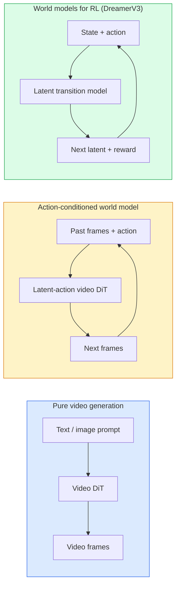

# 世界模型与视频扩散

> 能够预测场景未来几秒发展的视频模型就是一个世界模拟器。若将该预测基于动作进行条件化，你就得到了一个习得的游戏引擎。

**类型：** 学习 + 构建
**语言：** Python
**前置要求：** 第四阶段 课程10 (扩散), 第四阶段 课程12 (视频理解), 第四阶段 课程23 (DiT + 整流流)
**时间：** ~75分钟

## 学习目标

- 解释纯视频生成模型 (Sora 2) 与动作条件化世界模型 (Genie 3, DreamerV3) 之间的区别
- 描述一个视频 DiT：时空 patch、3D 位置编码、跨 (T, H, W) token 的联合注意力
- 追踪世界模型如何融入机器人技术栈：VLM 规划 → 视频模型模拟 → 逆动力学输出动作
- 针对特定用例 (创意视频、交互式模拟、自动驾驶合成) 在 Sora 2、Genie 3、Runway GWM-1 Worlds、Wan-Video 和 HunyuanVideo 之间做出选择

## 问题所在

视频生成与世界建模在2026年趋同。一个能生成连贯一分钟视频的模型，在某种意义上已经学会了世界的运动方式：物体恒常性、重力、因果关系、风格。如果将这个预测基于动作 (向左走、开门) 进行条件化，视频模型就变成了一个可学习的模拟器，可以取代游戏引擎、驾驶模拟器或机器人环境。

影响是具体的。Genie 3 可以从单张图像生成可玩环境。Runway GWM-1 Worlds 合成无限的可探索场景。Sora 2 能生成带同步音频和物理建模的一分钟长视频。NVIDIA Cosmos-Drive、Wayve Gaia-2 和 Tesla DrivingWorld 生成用于自动驾驶车辆训练数据的真实感驾驶视频。世界模型范式正在悄然接管机器人技术的 sim-to-real 流程。

本课是第四阶段的“大局观”课程。它将图像生成、视频理解和智能体推理连接成当前主流研究正在转向的架构模式。

## 核心概念

### 三类世界建模



- **Sora 2** 是基于提示词的纯视频生成。没有动作接口。你无法在生成过程中“操控”它。
- **Genie 3**、**GWM-1 Worlds**、**Mirage / Magica** 是动作条件化世界模型。从观测到的视频中推断潜在动作，然后基于该动作预测未来帧。具有交互性——你按键或移动摄像机，场景会做出响应。
- **DreamerV3** 及经典的强化学习世界模型家族在潜在空间中进行预测，并具有显式动作条件化，基于奖励信号训练。视觉内容较少；更适用于样本高效的强化学习。

### 视频 DiT 架构

```
Video latent:          (C, T, H, W)
Patchify (spatial):    grid of P_h x P_w patches per frame
Patchify (temporal):   group P_t frames into a temporal patch
Resulting tokens:      (T / P_t) * (H / P_h) * (W / P_w) tokens
```

位置编码是3D的：每个 (t, h, w) 坐标对应一个旋转或可学习的嵌入。注意力机制可以是：

- **完全联合** — 所有 token 关注所有 token。计算复杂度为 O(N^2) (N为 token 数量)。对于长视频来说是不可接受的。
- **分割式** — 交替进行时间注意力 (相同空间位置，跨时间：`(H*W) * T^2`) 和空间注意力 (相同时间步，跨空间：`T * (H*W)^2`)。TimeSformer 和大多数视频 DiT 使用此方法。
- **窗口式** — 在 (t, h, w) 上使用局部窗口。Video Swin 使用此方法。

2026年每个视频扩散模型都使用这三种模式之一，并辅以 AdaLN 条件化 (课程23) 和整流流。

### 基于动作的条件化：潜在动作模型

Genie 通过判别性地预测一对连续帧之间的动作，来学习每帧的**潜在动作**。然后模型的解码器基于推断出的潜在动作进行条件化——而非基于显式的键盘按键。在推理时，用户可以指定一个潜在动作 (或从一个全新先验中采样一个)，模型将生成与该动作一致的下一帧。

Sora 完全跳过了动作接口。它的解码器根据过去的时空 token 预测未来的时空 token。提示词条件化初始状态；生成过程中没有任何东西可以引导它。

### 物理合理性

Sora 2 的 2026 年版本明确宣传了**物理合理性**：重量、平衡、物体恒常性、因果关系。该团队通过人工评分的合理性分数进行衡量；与 Sora 1 相比，该模型在物体掉落、角色碰撞以及故意失败 (如跳跃失误) 等方面表现出明显改进。

物理合理性仍然是主要的失败模式。2024-2025 年的“人们吃意大利面”或“用玻璃杯喝水”视频揭示了模型缺乏持久的物体表征。2026 年的模型 (Sora 2、Runway Gen-5、HunyuanVideo) 减少了但未消除这些问题。

### 自动驾驶世界模型

驾驶世界模型根据轨迹、边界框或导航图生成真实感的道路场景。用途：

- **Cosmos-Drive-Dreams** (NVIDIA) — 为强化学习训练生成数分钟的驾驶视频。
- **Gaia-2** (Wayve) — 用于策略评估的轨迹条件化场景合成。
- **DrivingWorld** (Tesla) — 模拟多变天气、时段、交通状况。
- **Vista** (字节跳动) — 具有反应性的驾驶场景合成。

它们取代了为极端情况 (夜间行人闯红灯、结冰路口、罕见车辆类型) 而进行的昂贵现实世界数据收集，否则这些情况需要数百万英里的驾驶里程。

### 机器人技术栈：VLM + 视频模型 + 逆动力学

新兴的三组件机器人循环：

1. **VLM** 解析目标 (“拿起红色杯子”)，规划高层动作序列。
2. **视频生成模型** 模拟执行每个动作会是什么样子 — 预测未来 N 帧的观测。
3. **逆动力学模型** 提取能产生这些观测的具体电机指令。

这取代了奖励塑形和样本密集的强化学习。世界模型负责“想象”；逆动力学在执行层面闭合循环。Genie Envisioner 是其中一个实例；许多研究小组正在向此结构靠拢。

### 评估

- **视觉质量** — FVD (Fréchet Video Distance)、用户研究。
- **提示词对齐** — 每帧的 CLIPScore、VQA 风格评估。
- **物理合理性** — 在基准测试套件 (Sora 2 的内部基准、VBench) 上进行人工评分。
- **可控性** (用于交互式世界模型) — 动作 → 观测的一致性；能否回到先前状态？

### 2026年模型格局

| 模型 | 用途 | 参数 | 输出 | 许可 |
|-------|-----|------------|--------|---------|
| Sora 2 | 文本到视频, 音频 | — | 1分钟 1080p + 音频 | 仅 API |
| Runway Gen-5 | 文本/图像到视频 | — | 10秒片段 | API |
| Runway GWM-1 Worlds | 交互式世界 | — | 无限 3D 展开 | API |
| Genie 3 | 从图像生成交互式世界 | 11B+ | 可玩帧 | 研究预览 |
| Wan-Video 2.1 | 开源文本到视频 | 14B | 高质量片段 | 非商业 |
| HunyuanVideo | 开源文本到视频 | 13B | 10秒片段 | 宽松许可 |
| Cosmos / Cosmos-Drive | 自动驾驶模拟 | 7-14B | 驾驶场景 | NVIDIA 开源 |
| Magica / Mirage 2 | AI原生游戏引擎 | — | 可修改世界 | 产品 |

## 动手构建

### 步骤 1: 3D patch 化视频

```python
import torch
import torch.nn as nn


class VideoPatch3D(nn.Module):
    def __init__(self, in_channels=4, dim=64, patch_t=2, patch_h=2, patch_w=2):
        super().__init__()
        self.proj = nn.Conv3d(
            in_channels, dim,
            kernel_size=(patch_t, patch_h, patch_w),
            stride=(patch_t, patch_h, patch_w),
        )
        self.patch_t = patch_t
        self.patch_h = patch_h
        self.patch_w = patch_w

    def forward(self, x):
        # x: (N, C, T, H, W)
        x = self.proj(x)
        n, c, t, h, w = x.shape
        tokens = x.reshape(n, c, t * h * w).transpose(1, 2)
        return tokens, (t, h, w)
```

步长等于核大小的3D卷积充当时空 patch 化器。生成 `(T, H, W) -> (T/2, H/2, W/2)` 的 token 网格。

### 步骤 2: 3D 旋转位置编码

旋转位置编码 (RoPE) 分别应用于 `t`、`h`、`w` 轴：

```python
def rope_3d(tokens, t_dim, h_dim, w_dim, grid):
    """
    tokens: (N, T*H*W, D)
    grid: (T, H, W) sizes
    t_dim + h_dim + w_dim == D
    """
    T, H, W = grid
    n, seq, d = tokens.shape
    if t_dim + h_dim + w_dim != d:
        raise ValueError(f"t_dim+h_dim+w_dim ({t_dim}+{h_dim}+{w_dim}) must equal D={d}")
    assert seq == T * H * W
    t_idx = torch.arange(T, device=tokens.device).repeat_interleave(H * W)
    h_idx = torch.arange(H, device=tokens.device).repeat_interleave(W).repeat(T)
    w_idx = torch.arange(W, device=tokens.device).repeat(T * H)
    # Simplified: just scale channels by frequencies. Real RoPE rotates pairs.
    freqs_t = torch.exp(-torch.log(torch.tensor(10000.0)) * torch.arange(t_dim // 2, device=tokens.device) / (t_dim // 2))
    freqs_h = torch.exp(-torch.log(torch.tensor(10000.0)) * torch.arange(h_dim // 2, device=tokens.device) / (h_dim // 2))
    freqs_w = torch.exp(-torch.log(torch.tensor(10000.0)) * torch.arange(w_dim // 2, device=tokens.device) / (w_dim // 2))
    emb_t = torch.cat([torch.sin(t_idx[:, None] * freqs_t), torch.cos(t_idx[:, None] * freqs_t)], dim=-1)
    emb_h = torch.cat([torch.sin(h_idx[:, None] * freqs_h), torch.cos(h_idx[:, None] * freqs_h)], dim=-1)
    emb_w = torch.cat([torch.sin(w_idx[:, None] * freqs_w), torch.cos(w_idx[:, None] * freqs_w)], dim=-1)
    return tokens + torch.cat([emb_t, emb_h, emb_w], dim=-1)
```

简化的加法形式。实际的 RoPE 在不同频率上旋转通道对；位置信息是相同的。

### 步骤 3: 分割注意力块

```python
class DividedAttentionBlock(nn.Module):
    def __init__(self, dim=64, heads=2):
        super().__init__()
        self.time_attn = nn.MultiheadAttention(dim, heads, batch_first=True)
        self.space_attn = nn.MultiheadAttention(dim, heads, batch_first=True)
        self.ln1 = nn.LayerNorm(dim)
        self.ln2 = nn.LayerNorm(dim)
        self.ln3 = nn.LayerNorm(dim)
        self.mlp = nn.Sequential(nn.Linear(dim, 4 * dim), nn.GELU(), nn.Linear(4 * dim, dim))

    def forward(self, x, grid):
        T, H, W = grid
        n, seq, d = x.shape
        # time attention: same (h, w), across t
        xt = x.view(n, T, H * W, d).permute(0, 2, 1, 3).reshape(n * H * W, T, d)
        a, _ = self.time_attn(self.ln1(xt), self.ln1(xt), self.ln1(xt), need_weights=False)
        xt = (xt + a).reshape(n, H * W, T, d).permute(0, 2, 1, 3).reshape(n, seq, d)
        # space attention: same t, across (h, w)
        xs = xt.view(n, T, H * W, d).reshape(n * T, H * W, d)
        a, _ = self.space_attn(self.ln2(xs), self.ln2(xs), self.ln2(xs), need_weights=False)
        xs = (xs + a).reshape(n, T, H * W, d).reshape(n, seq, d)
        xs = xs + self.mlp(self.ln3(xs))
        return xs
```

时间注意力在每个空间位置内跨时间进行；空间注意力在每帧内跨位置进行。两个 O(T^2 + (HW)^2) 的操作取代了一个 O((THW)^2) 的操作。这是 TimeSformer 及每个现代视频 DiT 的核心。

### 步骤 4: 组成一个微型视频 DiT

```python
class TinyVideoDiT(nn.Module):
    def __init__(self, in_channels=4, dim=64, depth=2, heads=2):
        super().__init__()
        self.patch = VideoPatch3D(in_channels=in_channels, dim=dim, patch_t=2, patch_h=2, patch_w=2)
        self.blocks = nn.ModuleList([DividedAttentionBlock(dim, heads) for _ in range(depth)])
        self.out = nn.Linear(dim, in_channels * 2 * 2 * 2)

    def forward(self, x):
        tokens, grid = self.patch(x)
        for blk in self.blocks:
            tokens = blk(tokens, grid)
        return self.out(tokens), grid
```

不是一个可工作的视频生成器；是一个结构演示，证明每个部分形状正确。

### 步骤 5: 检查形状

```python
vid = torch.randn(1, 4, 8, 16, 16)  # (N, C, T, H, W)
model = TinyVideoDiT()
out, grid = model(vid)
print(f"input  {tuple(vid.shape)}")
print(f"tokens grid {grid}")
print(f"output {tuple(out.shape)}")
```

预期在 patch 化后得到 `grid = (4, 8, 8)` 和 `out = (1, 256, 32)`；然后头部将每个 token 投影到时空 patch，准备反 patch 化回视频。

## 实际应用

2026年的生产访问模式：

- **Sora 2 API** (OpenAI) — 文本到视频，同步音频。高级定价。
- **Runway Gen-5 / GWM-1** (Runway) — 图像到视频，交互式世界。
- **Wan-Video 2.1 / HunyuanVideo** — 开源自托管。
- **Cosmos / Cosmos-Drive** (NVIDIA) — 开放权重的驾驶模拟。
- **Genie 3** — 研究预览，需申请访问。

构建交互式世界模型演示：从 Wan-Video 开始以确保质量，叠加一个潜在动作适配器以实现交互性。对于自动驾驶模拟：Cosmos-Drive 是 2026 年的开源参考。

对于机器人技术，实际应用中的技术栈：

1. 语言目标 -> VLM (Qwen3-VL) -> 高层计划。
2. 计划 -> 潜在动作视频模型 -> 想象的推演。
3. 推演 -> 逆动力学模型 -> 底层动作。
4. 执行动作 -> 观测反馈到步骤 1。

## 交付产出

本课产出：

- `outputs/prompt-video-model-picker.md` — 根据任务、许可证和延迟，在 Sora 2 / Runway / Wan / HunyuanVideo / Cosmos 之间做出选择。
- `outputs/skill-physical-plausibility-checks.md` — 一项技能，定义自动化检查 (物体恒常性、重力、连续性)，在发布前应用于任何生成的视频。

## 练习

1. **(简单)** 计算一段 5 秒 360p 视频在 patch-t=2, patch-h=8, patch-w=8 下的 token 数量。推理在此规模下注意力机制的内存占用。
2. **(中等)** 将上面的分割注意力块替换为完全联合注意力块，并测量形状和参数数量。解释为什么分割注意力对真实视频模型是必要的。
3. **(困难)** 构建一个最小的潜在动作视频模型：取一个包含 (frame_t, action_t, frame_{t+1}) 三元组的数据集 (任何简单的2D游戏)，训练一个基于动作嵌入条件化的小型视频 DiT，并展示不同的动作产生不同的下一帧。

## 关键术语

| 术语 | 人们怎么说 | 它的实际含义 |
|------|----------------|----------------------|
| 世界模型 | "习得的模拟器" | 一种根据状态和动作预测未来观测的模型 |
| 视频 DiT | "时空 Transformer" | 具有 3D patch 化和分割注意力的扩散 Transformer |
| 潜在动作 | "推断的控制" | 从帧对推断出的离散或连续动作潜变量；用于条件化下一帧生成 |
| 分割注意力 | "先时间后空间" | 每块两个注意力操作 — 跨时间然后跨空间 — 以保持 O(N^2) 可管理 |
| 物体恒常性 | "物体保持真实" | 视频模型必须学习的场景属性；在食物、玻璃器皿上是经典失败模式 |
| FVD | "Fréchet Video Distance" | FID 的视频等价物；主要的视觉质量指标 |
| 逆动力学模型 | "观测到动作" | 给定 (状态, 下一状态)，输出连接它们的动作；闭合机器人循环 |
| Cosmos-Drive | "NVIDIA 驾驶模拟" | 用于强化学习和评估的开放权重自动驾驶世界模型 |

## 扩展阅读

- [Sora 技术报告 (OpenAI)](https://openai.com/index/video-generation-models-as-world-simulators/)
- [Genie: 生成式交互环境 (Bruce 等, 2024)](https://arxiv.org/abs/2402.15391) — 潜在动作世界模型
- [TimeSformer (Bertasius 等, 2021)](https://arxiv.org/abs/2102.05095) — 用于视频 Transformer 的分割注意力
- [DreamerV3 (Hafner 等, 2023)](https://arxiv.org/abs/2301.04104) — 用于强化学习的世界模型
- [Cosmos-Drive-Dreams (NVIDIA, 2025)](https://research.nvidia.com/labs/toronto-ai/cosmos-drive-dreams/) — 驾驶世界模型
- [2026年十大视频生成模型 (DataCamp)](https://www.datacamp.com/blog/top-video-generation-models)
- [从视频生成到世界模型 — 调查仓库](https://github.com/ziqihuangg/Awesome-From-Video-Generation-to-World-Model/)