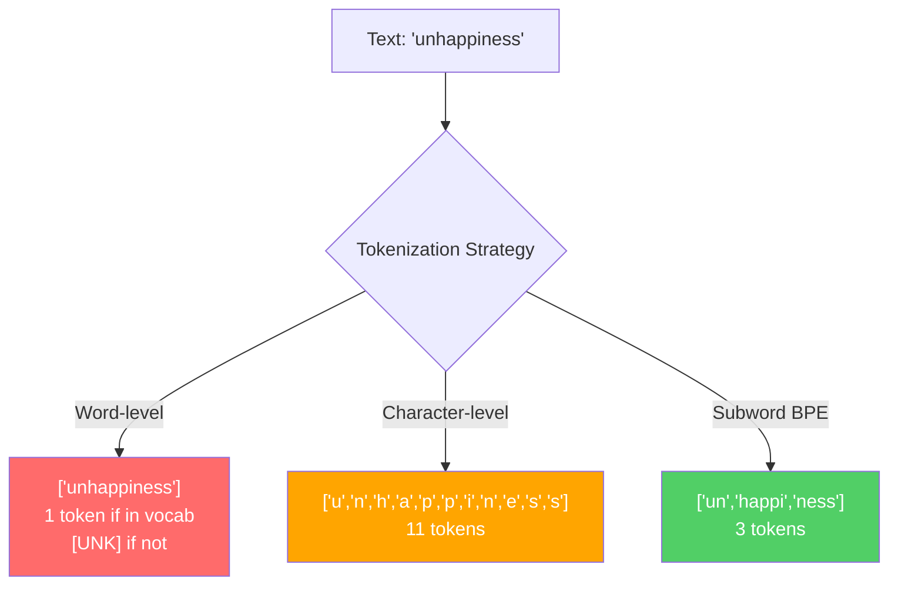
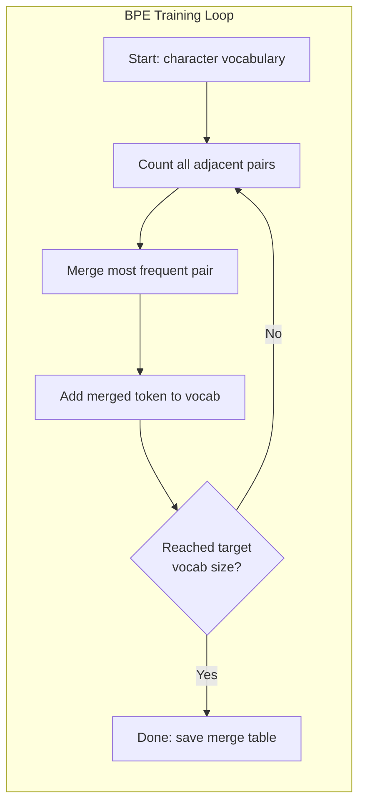
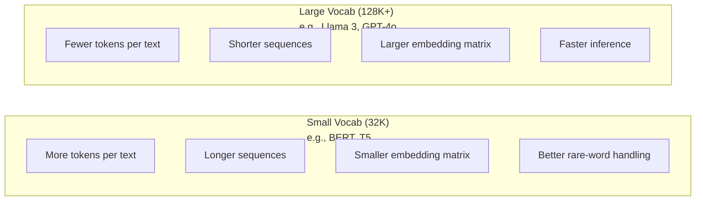

# 分词器：BPE、WordPiece、SentencePiece

> 你的大语言模型读不懂英文。它读的是整数。分词器决定了这些整数是承载意义，还是浪费空间。

**类型：** 实践构建
**语言：** Python
**前置要求：** 第五阶段（NLP基础）
**时间：** 约90分钟

## 学习目标

- 从零实现BPE、WordPiece和Unigram分词算法，并比较它们的合并策略
- 解释词汇表大小如何影响模型效率：太小会生成长序列，太大会浪费嵌入参数
- 分析跨语言和代码的分词伪影，识别特定分词器失效的场景
- 使用tiktoken和sentencepiece库对文本进行分词，并检查生成的token ID

## 问题所在

你的大语言模型读不懂英文。它读不懂任何语言。它读的是数字。

"Hello, world!"和[15496, 11, 995, 0]之间的差距就是分词器。每个单词、每个空格、每个标点符号都必须转换成整数，模型才能处理。这种转换并非中立的，它将无法撤销的假设烘焙进了模型中。

如果搞错了，你的模型就会浪费容量，用多个token编码常见单词。"unfortunately"变成了四个token而不是一个。对于多音节词密集的文本，你的128K上下文窗口刚刚缩小了75%。如果搞对了，同样的上下文窗口可以承载两倍的信息。"这个模型擅长处理代码"和"这个模型遇到Python就卡壳"之间的区别，往往取决于分词器是如何训练的。

你每次对GPT-4或Claude的API调用都是按token计价的。你的模型生成的每个token都会消耗计算资源。表示输出所需的token越少，端到端推理就越快。分词不是预处理，它是架构。

## 核心概念

### 三种失败的方法（以及一种成功的方法）

将文本转换为数字有三种显而易见的方法。其中两种无法大规模应用。

**词级分词**按空格和标点符号进行拆分。"The cat sat"变成了["The", "cat", "sat"]。简单。但"tokenization"怎么办？或者"GPT-4o"呢？或者像德语复合词"Geschwindigkeitsbegrenzung"？词级分词需要庞大的词汇表来覆盖每种语言的每个单词。漏掉一个词，你就会得到可怕的`[UNK]` token——模型表示"我完全不知道这是什么"的方式。仅英语就有超过百万种词形变化。再加上代码、URL、科学记数法和另外100种语言，你需要一个无限大的词汇表。

**字符级分词**走向了另一个极端。"hello"变成了["h", "e", "l", "l", "o"]。词汇表很小（几百个字符）。永远没有未知token。但序列会变得非常长。一个在词级分词下是10个token的句子，在字符级分词下会变成50个token。模型必须学习"t"、"h"、"e"合在一起表示"the"——把注意力容量浪费在一个人类三岁就学会的事情上。

**子词分词**找到了最佳平衡点。常见单词保持完整："the"是一个token。罕见单词分解成有意义的部分："unhappiness"变成["un", "happi", "ness"]。词汇表保持可管理的大小（30K到128K token）。序列保持较短。未知token基本上消失了，因为任何单词都可以由子词部件构建出来。

每个现代大语言模型都使用子词分词。GPT-2、GPT-4、BERT、Llama 3、Claude——无一例外。问题在于使用哪种算法。



### BPE：字节对编码

BPE是一种贪心压缩算法，被重新用于分词。其思想简单到可以写在一张索引卡上。

从单个字符开始。统计训练语料库中所有相邻的配对。将出现频率最高的配对合并成一个新token。重复此过程，直到达到目标词汇表大小。

以下是在包含"lower"、"lowest"和"newest"这几个词的小型语料库上运行BPE的过程：

```
Corpus (with word frequencies):
  "lower"  x5
  "lowest" x2
  "newest" x6

Step 0 -- Start with characters:
  l o w e r       (x5)
  l o w e s t     (x2)
  n e w e s t     (x6)

Step 1 -- Count adjacent pairs:
  (e,s): 8    (s,t): 8    (l,o): 7    (o,w): 7
  (w,e): 13   (e,r): 5    (n,e): 6    ...

Step 2 -- Merge most frequent pair (w,e) -> "we":
  l o we r        (x5)
  l o we s t      (x2)
  n e we s t      (x6)

Step 3 -- Recount and merge (e,s) -> "es":
  l o we r        (x5)
  l o we s t      (x2)    <- 'es' only forms from 'e'+'s', not 'we'+'s'
  n e we s t      (x6)    <- wait, the 'e' before 'we' and 's' after 'we'

Actually tracking this precisely:
  After "we" merge, remaining pairs:
  (l,o): 7   (o,we): 7   (we,r): 5   (we,s): 8
  (s,t): 8   (n,e): 6    (e,we): 6

Step 3 -- Merge (we,s) -> "wes" or (s,t) -> "st" (tied at 8, pick first):
  Merge (we,s) -> "wes":
  l o we r        (x5)
  l o wes t       (x2)
  n e wes t       (x6)

Step 4 -- Merge (wes,t) -> "west":
  l o we r        (x5)
  l o west        (x2)
  n e west        (x6)

...continue until target vocab size reached.
```

合并表就是分词器。要编码新文本，按照学到的顺序应用合并操作。训练语料库决定了哪些合并操作存在，而这种选择永久性地塑造了模型所看到的内容。



### 字节级BPE（GPT-2、GPT-3、GPT-4）

标准BPE基于Unicode字符操作。字节级BPE基于原始字节（0-255）操作。这为你提供了正好256个基础词汇，能处理任何语言或编码，并且永远不会产生未知token。

GPT-2引入了这种方法。基础词汇表覆盖了每一个可能的字节。BPE合并在此基础上进行构建。OpenAI的tiktoken库实现了字节级BPE，词汇表大小如下：

- GPT-2：50,257个token
- GPT-3.5/GPT-4：约100,256个token（cl100k_base编码）
- GPT-4o：200,019个token（o200k_base编码）

### WordPiece（BERT）

WordPiece看起来与BPE相似，但选择合并的方式不同。它不是基于原始频率，而是最大化训练数据的似然性：

```
BPE merge criterion:      count(A, B)
WordPiece merge criterion: count(AB) / (count(A) * count(B))
```

BPE问："哪一对出现得最频繁？" WordPiece问："哪一对共同出现的频率比你随机预期的要高？" 这种微妙的差异产生了不同的词汇表。WordPiece偏爱那些共现令人惊讶（而不仅仅是频繁）的合并操作。

WordPiece还使用"##"前缀来表示续接的子词：

```
"unhappiness" -> ["un", "##happi", "##ness"]
"embedding"   -> ["em", "##bed", "##ding"]
```

"##"前缀告诉你这个部分续接了前一个token。BERT使用WordPiece，词汇表大小为30,522个token。每个BERT变体——DistilBERT、RoBERTa的分词器实际上是BPE，但BERT本身是WordPiece。

### SentencePiece（Llama, T5）

SentencePiece将输入视为原始的Unicode字符流，包括空白字符。没有预分词步骤。没有关于单词边界的特定语言规则。这使得它真正与语言无关——它适用于中文、日文、泰语以及其他空格不用于分隔单词的语言。

SentencePiece支持两种算法：
- **BPE模式**：与标准BPE相同的合并逻辑，应用于原始字符序列
- **Unigram模式**：从一个大词汇表开始，迭代地移除对整体似然性影响最小的token。是BPE的逆过程——修剪而非合并。

Llama 2使用SentencePiece BPE，词汇表大小为32,000个token。T5使用SentencePiece Unigram，词汇表大小为32,000个token。注意：Llama 3切换到了基于tiktoken的字节级BPE分词器，词汇表大小为128,256个token。

### 词汇表大小的权衡

这是一个具有可衡量后果的真实工程决策。



具体数字。对于拥有4,096维嵌入的128K词汇表，仅嵌入矩阵就有128,000 x 4,096 = 5.24亿个参数。对于32K词汇表，则是1.31亿个参数。仅分词器的选择就造成了4亿参数的差异。

但更大的词汇表能更积极地压缩文本。同样一段英文，在32K词汇表下可能需要100个token，在128K词汇表下可能只需要70个token。这意味着在生成过程中前向传播次数减少了30%。对于一个服务数百万请求的模型来说，这直接降低了计算成本。

趋势很明显：词汇表大小正在增长。GPT-2使用50,257。GPT-4使用约100K。Llama 3使用128K。GPT-4o使用200K。

| 模型 | 词汇表大小 | 分词器类型 | 每英文单词平均token数 |
|-------|-----------|----------------|---------------------------|
| BERT | 30,522 | WordPiece | ~1.4 |
| GPT-2 | 50,257 | 字节级BPE | ~1.3 |
| Llama 2 | 32,000 | SentencePiece BPE | ~1.4 |
| GPT-4 | ~100,256 | 字节级BPE | ~1.2 |
| Llama 3 | 128,256 | 字节级BPE (tiktoken) | ~1.1 |
| GPT-4o | 200,019 | 字节级BPE | ~1.0 |

### 多语言税收

主要基于英语训练的分词器对其他语言是残酷的。GPT-2的分词器对韩语文本平均每单词产生2-3个token。中文可能更糟。这意味着韩国用户的有效上下文窗口大小只有英语用户的一半——支付相同的价格，获得更低的信息密度。

这就是Llama 3将其词汇表从32K增加到128K（四倍）的原因。更多token专门用于非英语脚本，意味着跨语言的压缩更公平。

## 动手构建

### 步骤1：字符级分词器

从基础开始。字符级分词器将每个字符映射到其Unicode码点。不需要训练。没有未知token。只是一个直接的映射。

```python
class CharTokenizer:
    def encode(self, text):
        return [ord(c) for c in text]

    def decode(self, tokens):
        return "".join(chr(t) for t in tokens)
```

"hello"变成了[104, 101, 108, 108, 111]。每个字符都是自己的token。这是我们改进的基准线。

### 步骤2：从零实现BPE分词器

真正的实现。我们在原始字节上训练（像GPT-2那样），统计配对，合并出现频率最高的配对，并按顺序记录每一次合并。合并表就是分词器。

```python
from collections import Counter

class BPETokenizer:
    def __init__(self):
        self.merges = {}
        self.vocab = {}

    def _get_pairs(self, tokens):
        pairs = Counter()
        for i in range(len(tokens) - 1):
            pairs[(tokens[i], tokens[i + 1])] += 1
        return pairs

    def _merge_pair(self, tokens, pair, new_token):
        merged = []
        i = 0
        while i < len(tokens):
            if i < len(tokens) - 1 and tokens[i] == pair[0] and tokens[i + 1] == pair[1]:
                merged.append(new_token)
                i += 2
            else:
                merged.append(tokens[i])
                i += 1
        return merged

    def train(self, text, num_merges):
        tokens = list(text.encode("utf-8"))
        self.vocab = {i: bytes([i]) for i in range(256)}

        for i in range(num_merges):
            pairs = self._get_pairs(tokens)
            if not pairs:
                break
            best_pair = max(pairs, key=pairs.get)
            new_token = 256 + i
            tokens = self._merge_pair(tokens, best_pair, new_token)
            self.merges[best_pair] = new_token
            self.vocab[new_token] = self.vocab[best_pair[0]] + self.vocab[best_pair[1]]

        return self

    def encode(self, text):
        tokens = list(text.encode("utf-8"))
        for pair, new_token in self.merges.items():
            tokens = self._merge_pair(tokens, pair, new_token)
        return tokens

    def decode(self, tokens):
        byte_sequence = b"".join(self.vocab[t] for t in tokens)
        return byte_sequence.decode("utf-8", errors="replace")
```

训练循环是BPE的核心：统计配对，合并赢家，重复。每次合并都会减少总token数。经过`num_merges`轮后，词汇表从256（基础字节）增长到256 + 合并次数。

编码按照学到的精确顺序应用合并操作。这很重要。如果合并1创建了"th"，合并5创建了"the"，编码必须先应用合并1，这样"the"才能在合并5中从"th" + "e"形成。

解码是逆过程：在词汇表中查找每个token ID，拼接字节，解码为UTF-8。

### 步骤3：编码解码往返测试

```python
corpus = (
    "The cat sat on the mat. The cat ate the rat. "
    "The dog sat on the log. The dog ate the frog. "
    "Natural language processing is the study of how computers "
    "understand and generate human language. "
    "Tokenization is the first step in any NLP pipeline."
)

tokenizer = BPETokenizer()
tokenizer.train(corpus, num_merges=40)

test_sentences = [
    "The cat sat on the mat.",
    "Natural language processing",
    "tokenization pipeline",
    "unhappiness",
]

for sentence in test_sentences:
    encoded = tokenizer.encode(sentence)
    decoded = tokenizer.decode(encoded)
    raw_bytes = len(sentence.encode("utf-8"))
    ratio = len(encoded) / raw_bytes
    print(f"'{sentence}'")
    print(f"  Tokens: {len(encoded)} (from {raw_bytes} bytes) -- ratio: {ratio:.2f}")
    print(f"  Roundtrip: {'PASS' if decoded == sentence else 'FAIL'}")
```

压缩比告诉你分词器的有效性。0.50的压缩比分词器将文本压缩到了原始字节数的一半。越低越好。在训练语料库上，压缩比会很好。在分布外文本上，如"unhappiness"（该词未出现在语料库中），压缩比会更差——分词器对未见过的模式回退到字符级编码。

### 步骤4：与tiktoken比较

```python
import tiktoken

enc = tiktoken.get_encoding("cl100k_base")

texts = [
    "The cat sat on the mat.",
    "unhappiness",
    "Hello, world!",
    "def fibonacci(n): return n if n < 2 else fibonacci(n-1) + fibonacci(n-2)",
    "Geschwindigkeitsbegrenzung",
]

for text in texts:
    our_tokens = tokenizer.encode(text)
    tiktoken_tokens = enc.encode(text)
    tiktoken_pieces = [enc.decode([t]) for t in tiktoken_tokens]
    print(f"'{text}'")
    print(f"  Our BPE:   {len(our_tokens)} tokens")
    print(f"  tiktoken:  {len(tiktoken_tokens)} tokens -> {tiktoken_pieces}")
```

tiktoken使用完全相同的算法，但在数百GB的文本上训练，进行了100,000次合并。算法是相同的。区别在于训练数据和合并次数。你在一个段落上用40次合并训练的分词器，无法与tiktoken在大规模语料库上进行的100K次合并相竞争。但机制是相同的。

### 步骤5：词汇表分析

```python
def analyze_vocabulary(tokenizer, test_texts):
    total_tokens = 0
    total_chars = 0
    token_usage = Counter()

    for text in test_texts:
        encoded = tokenizer.encode(text)
        total_tokens += len(encoded)
        total_chars += len(text)
        for t in encoded:
            token_usage[t] += 1

    print(f"Vocabulary size: {len(tokenizer.vocab)}")
    print(f"Total tokens across all texts: {total_tokens}")
    print(f"Total characters: {total_chars}")
    print(f"Avg tokens per character: {total_tokens / total_chars:.2f}")

    print(f"\nMost used tokens:")
    for token_id, count in token_usage.most_common(10):
        token_bytes = tokenizer.vocab[token_id]
        display = token_bytes.decode("utf-8", errors="replace")
        print(f"  Token {token_id:4d}: '{display}' (used {count} times)")

    unused = [t for t in tokenizer.vocab if t not in token_usage]
    print(f"\nUnused tokens: {len(unused)} out of {len(tokenizer.vocab)}")
```

这揭示了你词汇表中的齐夫分布。少数token占主导地位（空格、"the"、"e"）。大多数token很少被使用。生产环境的分词器针对这种分布进行了优化——常见模式获得短token ID，罕见模式获得更长的表示。

## 实际应用

你从零实现的BPE可以工作了。现在看看生产工具是什么样的。

### tiktoken (OpenAI)

```python
import tiktoken

enc = tiktoken.get_encoding("cl100k_base")

text = "Tokenizers convert text to integers"
tokens = enc.encode(text)
print(f"Tokens: {tokens}")
print(f"Pieces: {[enc.decode([t]) for t in tokens]}")
print(f"Roundtrip: {enc.decode(tokens)}")
```

tiktoken用Rust编写，提供Python绑定。它每秒可以编码数百万个token。同样的BPE算法，工业级强度的实现。

### Hugging Face tokenizers

```python
from tokenizers import Tokenizer
from tokenizers.models import BPE
from tokenizers.trainers import BpeTrainer
from tokenizers.pre_tokenizers import ByteLevel

tokenizer = Tokenizer(BPE())
tokenizer.pre_tokenizer = ByteLevel()

trainer = BpeTrainer(vocab_size=1000, special_tokens=["<pad>", "<eos>", "<unk>"])
tokenizer.train(["corpus.txt"], trainer)

output = tokenizer.encode("The cat sat on the mat.")
print(f"Tokens: {output.tokens}")
print(f"IDs: {output.ids}")
```

Hugging Face的tokenizers库底层也是Rust。它可以在几秒内在GB规模的语料库上训练BPE。这是训练你自己的模型时所使用的工具。

### 加载Llama的分词器

```python
from transformers import AutoTokenizer

tokenizer = AutoTokenizer.from_pretrained("meta-llama/Llama-3.1-8B")

text = "Tokenizers are the unsung heroes of LLMs"
tokens = tokenizer.encode(text)
print(f"Token IDs: {tokens}")
print(f"Tokens: {tokenizer.convert_ids_to_tokens(tokens)}")
print(f"Vocab size: {tokenizer.vocab_size}")

multilingual = ["Hello world", "Hola mundo", "Bonjour le monde"]
for text in multilingual:
    ids = tokenizer.encode(text)
    print(f"'{text}' -> {len(ids)} tokens")
```

Llama 3的128K词汇表在非英语文本上的压缩效果显著优于GPT-2的50K词汇表。你可以亲自验证——用多种语言编码同一个句子并计算token数量。

## 产出成果

本课将产出`outputs/prompt-tokenizer-analyzer.md`——一个可重用的提示，用于分析任意文本和模型组合的分词效率。提供一个文本样本，它会告诉你哪个模型的分词器处理得最好。

## 练习题

1. 修改BPE分词器，使其在每个合并步骤打印词汇表。观察"t" + "h"如何变成"th"，然后"th" + "e"如何变成"the"。追踪常见英语单词是如何被逐步组装起来的。

2. 向BPE分词器添加特殊token（`<pad>`, `<eos>`, `<unk>`）。将它们分配为ID 0, 1, 2，并相应地移动所有其他token。实现一个预分词步骤，在运行BPE之前按空格分割文本。

3. 实现WordPiece合并标准（似然比而非频率）。在相同的语料库上，用相同的合并次数训练BPE和WordPiece。比较生成的词汇表——哪一个产生了更具语言学意义的子词？

4. 构建一个多语言分词效率基准测试。选取英语、西班牙语、中文、韩语和阿拉伯语的10个句子。使用tiktoken (cl100k_base) 对每个句子进行分词，并测量每个字符的平均token数。量化每种语言的"多语言税收"。

5. 在更大的语料库上训练你的BPE分词器（下载一篇维基百科文章）。调整合并次数，使压缩比在该文本上与tiktoken的压缩比差距在10%以内。这迫使你理解语料库大小、合并次数和压缩质量之间的关系。

## 关键术语

| 术语 | 人们常说 | 其实际含义 |
|------|----------------|----------------------|
| Token | "一个词" | 模型词汇表中的一个单元——可以是字符、子词、单词或多词词块 |
| BPE | "某种压缩技术" | 字节对编码——迭代合并出现频率最高的相邻token对，直到达到目标词汇表大小 |
| WordPiece | "BERT的分词器" | 类似BPE，但合并操作最大化似然比 `count(AB)/(count(A)*count(B))` 而非原始频率 |
| SentencePiece | "一个分词器库" | 一种与语言无关的分词器，直接处理原始Unicode而不进行预分词，支持BPE和Unigram算法 |
| 词汇表大小 | "它知道多少词" | 唯一token的总数：GPT-2有50,257个，BERT有30,522个，Llama 3有128,256个 |
| Fertility（生育率） | "不是一个分词器术语" | 每个单词的平均token数——衡量跨语言分词器效率（1.0表示完美，3.0表示模型需要付出三倍的努力） |
| 字节级BPE | "GPT的分词器" | 基于原始字节（0-255）而非Unicode字符的BPE，保证对任何输入都不会产生未知token |
| 合并表 | "分词器文件" | 训练过程中学到的有序配对合并列表——**这就是分词器本身**，顺序很重要 |
| 预分词 | "按空格分割" | 在子词分词之前应用的规则：按空白分割、分离数字、处理标点符号 |
| 压缩比 | "分词器的效率" | 生成的token数除以输入字节数——越低表示压缩效果越好，推理速度越快 |

## 扩展阅读

- [Sennrich 等人，2016 -- "用子词单元进行罕见词的神经机器翻译"](https://arxiv.org/abs/1508.07909) -- 这篇论文将BPE引入NLP，将一种1994年的压缩算法转变为现代分词的基石。
- [Kudo & Richardson，2018 -- "SentencePiece: 一个简单且与语言无关的子词分词器"](https://arxiv.org/abs/1808.06226) -- 使得多语言模型变得实用的、与语言无关的分词方法。
- [OpenAI tiktoken 仓库](https://github.com/openai/tiktoken) -- 用Rust实现的生产级BPE，提供Python绑定，被GPT-3.5/4/4o使用。
- [Hugging Face Tokenizers 文档](https://huggingface.co/docs/tokenizers) -- 具有Rust性能的生产级分词器训练。