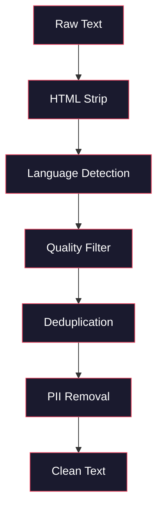
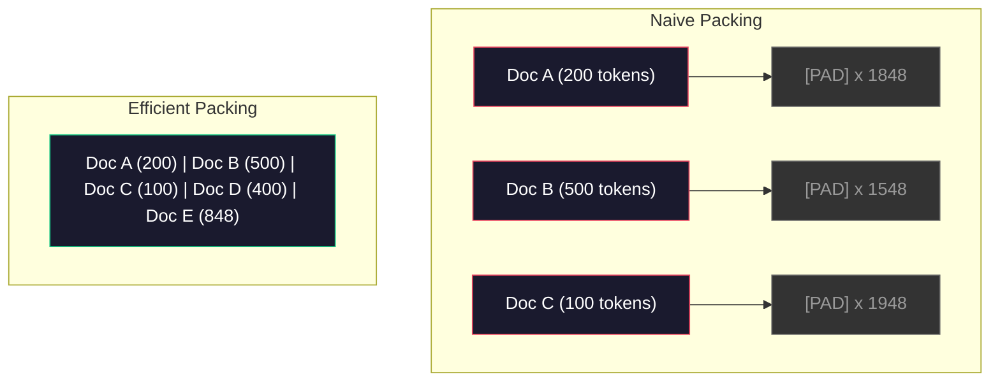

# 预训练数据管道

> 模型是一面镜子，反映你喂给它的数据。喂它垃圾，它就会完美流畅地反射垃圾。

**类型：** 构建
**语言：** Python
**先修知识：** 第10阶段，第01-02课（分词器，构建分词器）
**时间：** 约90分钟

## 学习目标

- 构建一个流式数据管道，对TB级文本进行分词、分块、打乱和批处理，而无需全部加载到内存中
- 实现真实预训练管道中使用的数据质量过滤器（去重、语言检测、内容过滤）
- 创建具有正确注意力掩码和文档边界处理的定长训练序列
- 分析管道吞吐量，确保数据加载器能跟上GPU的训练速度

## 问题所在

你有一个分词器。现在你需要数据。

不是一个数据集。不是CSV文件。而是TB级的文本——清理过的、去重过的、经过质量过滤的、被分词成固定长度序列的，并且能够以随机批次快速提供服务，快到你的8-GPU集群永远不需要等待下一批数据。

大多数人认为训练大语言模型（LLM）是关于模型架构的事情。并非如此。Llama 3 使用了15.6万亿个token。GPT-3 使用了3000亿个。DeepSeek-V2 使用了8.1万亿个。这三者的架构大体相同：堆叠的Transformer块，带有注意力层和前馈层。输出质量的差异绝大多数来自数据。

DeepMind的Chinchilla论文精确地说明了这一点。对于给定的计算预算（以FLOPs衡量），存在最优的模型参数量与训练token数量的比率。Chinchilla表明，2022年的大多数模型都严重训练不足——对于它们看到的数据量来说，它们的参数太多了。一个70B参数的模型，如果训练1.4万亿个token（Chinchilla最优），其性能会优于一个在3000亿个token上训练的280B参数模型（Gopher）。

你的数据管道决定了你的模型是学习语言还是学习噪声。

## 核心概念

### 数据来源

每个大语言模型都是在多种来源的混合数据上训练的。对于大多数实验室来说，确切的成分组合是严格保密的，但我们已足够了解其类别。

| 来源 | 规模 | 质量 | 使用者 |
|--------|------|---------|---------|
| Common Crawl | 原始数据约250 TB | 低（需要大量过滤） | GPT-3, Llama, 大多数开源模型 |
| Wikipedia | 约20 GB | 高 | 所有主要大语言模型 |
| GitHub代码 | 1 TB+ | 中（存在大量重复、废弃代码） | StarCoder, CodeLlama, DeepSeek-Coder |
| 书籍（BookCorpus, Pile） | 约100 GB | 高 | GPT-2, GPT-3, 早期模型 |
| 学术论文（arXiv, S2ORC） | 约100 GB | STEM领域高 | Llama, Galactica |
| StackOverflow, Reddit | 约100 GB | 中 | Llama, Falcon |
| 策划的网页（C4, RefinedWeb） | 约5 TB | 中高（预先过滤过） | T5, Falcon |

Llama 3 公开了其数据混合比例：大约50%网页数据，25%代码，13%书籍和学术论文，8%数学数据，以及4%多语言网页数据。总量为15.6万亿个token，来源于超过5TB的原始文本。

比例与总量同样重要。网页数据过多，模型会变成Reddit的复读机。代码太少，它就无法编程。数学太少，它在推理上就会失败。将这个混合比例调整好是训练大语言模型最困难的部分之一，并且没有公式可循——它需要实验和评估。

### 数据清理

原始的网页数据是脏乱的。一个典型的Common Crawl转储包含：

- HTML标签和JavaScript
- 模板化的页眉、页脚、导航菜单
- 重复页面（完全重复和近似重复）
- 机器生成的垃圾信息
- 个人身份信息（PII）
- 低质量文本（关键词列表、SEO垃圾）
- 编码为文本的非文本内容

清理这些不是可选项。这是区分模型是生成连贯段落还是输出混合着商品列表的HTML标签的关键。



每个步骤消除一类噪声：

**HTML剥离：** 移除所有标记。只保留可见的文本内容。像 `trafilatura` 或 `readability` 这样的库在提取文章内容的同时，会丢弃导航、广告和模板内容。

**语言检测：** 使用fastText的语言识别模型（lid.176.bin）对每个文档进行分类。过滤到你的目标语言。一个被分类为英语但置信度低于0.8的文档很可能不是干净的英文。

**质量过滤：** 这是变得有趣的地方。RefinedWeb（Falcon背后的数据集）使用基于困惑度的过滤器：在维基百科上训练一个小的语言模型，然后对每个文档进行评分。高困惑度意味着该文档不像维基百科——可能是垃圾信息、关键词列表或机器生成的内容。困惑度高于阈值的文档会被移除。

**去重：** 最具影响力的清理步骤。Common Crawl包含大量重复的页面——法律免责声明、Cookie通知、服务条款。在重复数据上训练会浪费计算资源，并可能导致模型死记硬背并逐字重复特定段落。

**PII移除：** 姓名、电子邮件地址、电话号码、社会安全号码。使用基于正则表达式的方法检测结构化的PII，使用命名实体识别模型检测上下文中的姓名。

### 使用MinHash进行去重

完全重复的去重很简单：对每个文档进行哈希，移除重复项。但近似重复才是真正的问题。两份相同的新闻文章，周围广告略有不同，就是近似重复。内容有95%是相同的，但逐字节来看又存在差异。

MinHash + 局部敏感哈希（LSH）可以高效地解决这个问题。


思路如下：

1.  **Shingling：** 将每个文档转换为一个n-gram集合（例如，单词或字符的5-gram）。"the quick brown fox" 使用3词shingle变成 {"the quick brown", "quick brown fox"}。

2.  **MinHash：** 对于每个文档的shingle集合，计算k个哈希值。每个哈希值是在不同哈希函数下，所有shingle中的最小哈希值。这创建了一个固定大小的“签名”，近似表示任意两个文档之间的Jaccard相似度。

3.  **LSH：** 根据MinHash签名的分段将文档分组到桶中。同一桶中的文档是候选近似重复项。这避免了每对文档都要比较——你只比较候选者。

4.  **验证：** 对于每个候选对，计算精确的Jaccard相似度。如果相似度超过阈值（通常为0.8），则移除一份副本。

Llama团队报告称，通过去重移除了大约38%的网页数据。这不是一个小数字。Common Crawl中超过三分之一是重复或近似重复内容。

### 序列打包

你的模型期望固定长度的输入序列。而你的文档长度是可变的。有些是50个token，有些是50,000个token。

朴素方法：将每个文档填充到最大序列长度。这会在填充token上浪费大量计算，而填充token对学习没有任何贡献。

更好的方法：将多个文档打包到单个序列中，用序列结束token分隔。一个2048个token的序列可能包含三个用[EOS] token连接起来的短文档。



注意力掩码必须正确设置。来自文档A的token不应该在同一个打包序列中关注来自文档B的token。这需要一个分块对角注意力掩码。

长文档会被截断或在序列边界处分割。分割点很重要：在句子中间分割会迫使模型看到不完整的思路。一些管道在可能的情况下，会将分割点对齐到段落或句子的边界。

### Chinchilla缩放定律

对于固定的计算预算C（以FLOPs衡量），最优的模型大小N和数据集大小D满足：

```
N_opt ~ C^0.5
D_opt ~ C^0.5
```

在实践中，这意味着你应该大致同等地扩展模型大小和数据集大小。一个参数多10倍的模型需要大约10倍多的训练token才能达到相同的损失。

| 模型 | 参数量 | 训练token数 | Chinchilla最优？ |
|-------|-----------|----------------|-------------------|
| GPT-3 | 175B | 300B | 否（训练不足3-4倍） |
| Chinchilla | 70B | 1.4T | 是（设计如此） |
| Llama 2 | 70B | 2T | 过度训练（有意为之） |
| Llama 3 | 70B | 15T | 严重过度训练 |

Llama 3 有意违反了Chinchilla定律。Meta发现，在更多数据上过度训练——远超出计算最优比例——可以为推理产生更好的模型。额外的训练成本只需支付一次，但更小的模型将永远更便宜地提供服务。这有时被称为“推理最优”的缩放方法，并且自2024年以来已成为行业标准。

## 构建它

### 第1步：文本清理

剥离HTML，规范化空白字符，移除非文本内容。我们将使用一个公有领域的文本（古腾堡计划）作为我们的小型语料库。

```python
import re

def clean_text(text):
    text = re.sub(r"<[^>]+>", "", text)
    text = re.sub(r"http\S+", "", text)
    text = re.sub(r"[^\x20-\x7E\n]", "", text)
    text = re.sub(r"\n{3,}", "\n\n", text)
    text = re.sub(r" {2,}", " ", text)
    return text.strip()

def quality_filter(text, min_words=50, max_ratio_caps=0.3, max_ratio_special=0.1):
    words = text.split()
    if len(words) < min_words:
        return False
    caps_ratio = sum(1 for w in words if w.isupper()) / len(words)
    if caps_ratio > max_ratio_caps:
        return False
    special_chars = sum(1 for c in text if not c.isalnum() and not c.isspace())
    if special_chars / max(len(text), 1) > max_ratio_special:
        return False
    return True
```

质量过滤器可以捕获SEO垃圾（全大写）、机器生成的噪声（高特殊字符比例）和存根页面（过短）。仅这三项检查就能从网络爬取中移除大量垃圾。

### 第2步：MinHash去重

从头实现MinHash。不需要外部库——只需要 `hashlib`。

```python
import hashlib
from collections import defaultdict

def get_shingles(text, k=5):
    words = text.lower().split()
    if len(words) < k:
        return set()
    return {" ".join(words[i:i+k]) for i in range(len(words) - k + 1)}

def minhash_signature(shingles, num_hashes=128):
    signature = []
    for i in range(num_hashes):
        min_hash = float("inf")
        for shingle in shingles:
            h = int(hashlib.sha256(f"{i}:{shingle}".encode()).hexdigest(), 16)
            min_hash = min(min_hash, h)
        signature.append(min_hash)
    return signature

def lsh_buckets(signature, bands=16):
    rows_per_band = len(signature) // bands
    buckets = []
    for b in range(bands):
        start = b * rows_per_band
        band_data = tuple(signature[start:start + rows_per_band])
        bucket_hash = hashlib.md5(str(band_data).encode()).hexdigest()
        buckets.append((b, bucket_hash))
    return buckets

def deduplicate(documents, threshold=0.8, num_hashes=128, bands=16):
    signatures = []
    shingle_sets = []
    for doc in documents:
        shingles = get_shingles(doc)
        shingle_sets.append(shingles)
        signatures.append(minhash_signature(shingles, num_hashes))

    bucket_map = defaultdict(list)
    for doc_idx, sig in enumerate(signatures):
        for band_id, bucket_hash in lsh_buckets(sig, bands):
            bucket_map[(band_id, bucket_hash)].append(doc_idx)

    duplicate_pairs = set()
    for bucket_docs in bucket_map.values():
        if len(bucket_docs) < 2:
            continue
        for i in range(len(bucket_docs)):
            for j in range(i + 1, len(bucket_docs)):
                duplicate_pairs.add((bucket_docs[i], bucket_docs[j]))

    removed = set()
    for i, j in duplicate_pairs:
        if i in removed or j in removed:
            continue
        s1, s2 = shingle_sets[i], shingle_sets[j]
        if not s1 or not s2:
            continue
        jaccard = len(s1 & s2) / len(s1 | s2)
        if jaccard >= threshold:
            removed.add(j)

    return [doc for idx, doc in enumerate(documents) if idx not in removed], len(removed)
```

`num_hashes=128` 和 `bands=16` 参数控制精确率-召回率的权衡。更多的哈希值能给出更准确的相似度估计。更多的分段（bands）会提高召回率（捕获更多重复项），但代价是更多的误报。这些值对于典型的网页文本效果良好。

### 第3步：分词和打包序列

获取清理、去重后的文本，进行分词，并打包成固定长度的训练序列。

```python
def tokenize_corpus(documents, tokenizer):
    all_tokens = []
    for doc in documents:
        tokens = tokenizer.encode(doc)
        all_tokens.extend(tokens)
        all_tokens.append(tokenizer.eos_id)
    return all_tokens

def pack_sequences(token_ids, seq_length, pad_id=0):
    sequences = []
    attention_masks = []
    for i in range(0, len(token_ids), seq_length):
        seq = token_ids[i:i + seq_length]
        mask = [1] * len(seq)
        if len(seq) < seq_length:
            pad_count = seq_length - len(seq)
            seq = seq + [pad_id] * pad_count
            mask = mask + [0] * pad_count
        sequences.append(seq)
        attention_masks.append(mask)
    return sequences, attention_masks
```

### 第4步：用于训练的DataLoader

生成随机批次打包序列。这是训练循环所消耗的内容。

```python
import random

class PreTrainingDataLoader:
    def __init__(self, sequences, attention_masks, batch_size, shuffle=True):
        self.sequences = sequences
        self.attention_masks = attention_masks
        self.batch_size = batch_size
        self.shuffle = shuffle

    def __len__(self):
        return (len(self.sequences) + self.batch_size - 1) // self.batch_size

    def __iter__(self):
        indices = list(range(len(self.sequences)))
        if self.shuffle:
            random.shuffle(indices)
        for start in range(0, len(indices), self.batch_size):
            batch_idx = indices[start:start + self.batch_size]
            batch_seqs = [self.sequences[i] for i in batch_idx]
            batch_masks = [self.attention_masks[i] for i in batch_idx]
            yield batch_seqs, batch_masks
```

### 第5步：数据集统计

计算重要的数字：总token数、唯一token数、压缩比、文档长度分布。

```python
from collections import Counter

def compute_statistics(documents, token_ids, sequences, tokenizer_vocab_size):
    total_chars = sum(len(d) for d in documents)
    total_tokens = len(token_ids)
    unique_tokens = len(set(token_ids))
    compression_ratio = total_chars / total_tokens

    doc_lengths = [len(d.split()) for d in documents]
    avg_doc_length = sum(doc_lengths) / max(len(doc_lengths), 1)
    max_doc_length = max(doc_lengths) if doc_lengths else 0
    min_doc_length = min(doc_lengths) if doc_lengths else 0

    token_counts = Counter(token_ids)
    top_tokens = token_counts.most_common(10)

    non_pad_tokens = sum(sum(1 for t in seq if t != 0) for seq in sequences)
    total_positions = sum(len(seq) for seq in sequences)
    utilization = non_pad_tokens / max(total_positions, 1)

    stats = {
        "total_documents": len(documents),
        "total_characters": total_chars,
        "total_tokens": total_tokens,
        "unique_tokens": unique_tokens,
        "vocab_utilization": unique_tokens / tokenizer_vocab_size,
        "compression_ratio": compression_ratio,
        "avg_doc_length_words": avg_doc_length,
        "max_doc_length_words": max_doc_length,
        "min_doc_length_words": min_doc_length,
        "num_sequences": len(sequences),
        "sequence_utilization": utilization,
        "top_10_tokens": top_tokens,
    }
    return stats
```

压缩比告诉你分词器在这个语料库上的效率。英文文本通常压缩到每个token约3-4个字符。如果你看到每个token 1.5个字符，说明你的分词器分割得太激进了。如果你看到8+，说明它学习到了非常领域特定的合并规则。

序列利用率告诉你打包序列中有多少是真实数据，多少是填充。低于90%意味着你的打包效率低下——你在填充token上浪费了计算资源。

## 使用它

### 与HuggingFace Datasets比较

通过HuggingFace的datasets库加载同一个语料库，并比较管道速度。

```python
from datasets import load_dataset
from transformers import AutoTokenizer

ds = load_dataset("wikitext", "wikitext-2-raw-v1", split="train")
tokenizer = AutoTokenizer.from_pretrained("meta-llama/Meta-Llama-3-8B")

import time

start = time.time()
tokenized = ds.map(
    lambda x: tokenizer(x["text"], truncation=True, max_length=2048),
    batched=True,
    num_proc=4,
)
hf_time = time.time() - start
total_tokens = sum(len(t) for t in tokenized["input_ids"])
print(f"HuggingFace: {total_tokens:,} tokens in {hf_time:.2f}s ({total_tokens/hf_time:,.0f} tokens/sec)")
```

HuggingFace管道底层使用Rust分词器，并在4个核心上进行并行处理。你的纯Python管道会慢10-50倍。这个差距正是为什么生产团队使用编译过的分词器。算法是相同的。实现语言是差异所在。

## 部署它

本课程产生了一个用于验证和调试大语言模型训练管道数据质量的提示。参见 `outputs/prompt-data-quality-checker.md`。

## 练习

1.  **简单：** 使用简单启发式方法（字符集分析）在清理管道中添加语言检测。仅过滤英文文档，并测量被移除的文档数量。
2.  **中等：** 在MinHash近似去重的同时，使用SHA-256哈希实现精确去重。在一个网络抓取的语料库上，比较每种方法捕获的重复项数量。
3.  **困难：** 构建一个基于困惑度的质量过滤器。在维基百科文本上训练一个小型的二元语法语言模型，按困惑度对每个文档评分，并移除底部20%的文档。比较在过滤后与未过滤数据上训练时模型的输出质量。

## 关键术语

| 术语 | 人们怎么说 | 它的实际含义 |
|------|----------------|----------------------|
| Common Crawl | "互联网" | 一个每月爬取网络的非营利组织——原始数据约250TB，是大多数大语言模型训练数据的起点 |
| MinHash | "某种哈希技巧" | 一种使用固定大小签名估算集合间Jaccard相似度的技术——能够实现大规模近似重复检测 |
| LSH | "局部敏感哈希" | 一种将相似项目分组到同一桶中的方法——将成对比较从O(n^2)降低到近似线性 |
| 序列打包 | "连接文档" | 将多个文档装入固定长度序列并配备正确的注意力掩码——消除填充浪费 |
| Chinchilla缩放 | "在更多数据上训练" | 对于固定的计算预算，最优性能需要模型大小和训练token数量大致等比例扩展 |
| 生育率 | "每词token数" | 每个单词的平均token数——GPT-4的英文是1.3，非拉丁文字系统更高 |
| 数据混合 | "选择训练数据" | 代码vs文本vs数学vs多语言数据的比率——没有公式，需要实验 |
| 困惑度过滤器 | "质量评分" | 使用一个小型语言模型对文档评分——高困惑度意味着文本不像干净的参考数据 |
| 去重 | "移除副本" | 消除完全重复和近似重复的文档——通常移除原始网络数据的30-40% |
| 注意力掩码 | "关注哪些token" | 一个二进制掩码，防止在打包序列中跨越文档边界进行注意力计算 |

## 延伸阅读

- [Hoffmann et al., 2022 -- 训练计算最优的大型语言模型（Chinchilla）](https://arxiv.org/abs/2203.15556) —— 这篇论文改变了我们对数据规模的思考方式
- [Penedo et al., 2023 -- 用于Falcon LLM的RefinedWeb数据集](https://arxiv.org/abs/2306.01116) —— 如何将Common Crawl过滤成高质量数据
- [Touvron et al., 2023 -- Llama 2：开源基础与微调聊天模型](https://arxiv.org/abs/2307.09288) —— Llama 2的数据管道细节
- [Lee et al., 2022 -- 去重训练数据使语言模型更好](https://arxiv.org/abs/2107.06499) —— 为什么去重比你想象的更重要
- [Broder, 1997 -- 论文档的相似性与包含关系](https://ieeexplore.ieee.org/document/666900) —— 原始的MinHash论文
- [Meta, 2024 -- Llama 3 技术报告](https://arxiv.org/abs/2407.21783) —— 15.6T tokens，数据混合比例，过滤管道