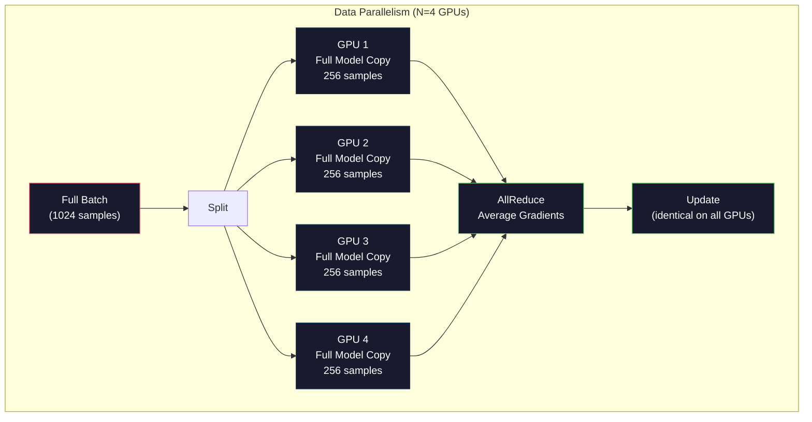
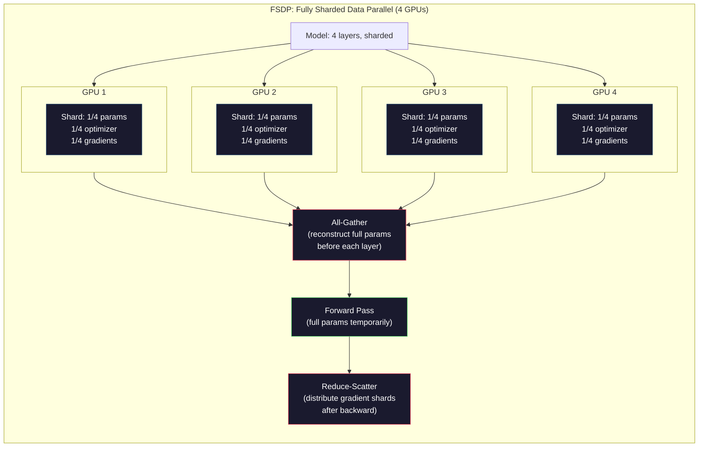
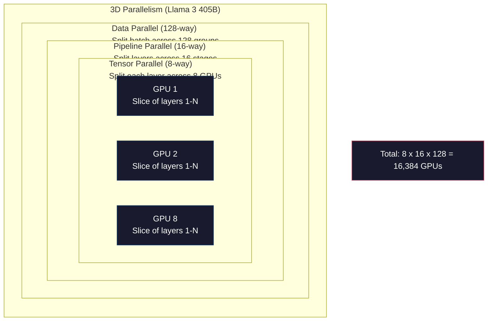

# 缩放：分布式训练、FSDP 与 DeepSpeed

> 你的 1.24 亿参数模型在单 GPU 上训练。现在试试 70 亿参数。模型无法放入内存。在单机上处理数据需要数周时间。在规模上，分布式训练不是可选项，而是唯一的前进道路。

**类型：** 构建
**语言：** Python
**先决条件：** 第 10 阶段，第 04 课（预训练一个迷你 GPT）
**时间：** 约 120 分钟

## 学习目标

- 解释三种并行类型（数据、张量、流水线），并根据模型和集群规模说明每种的必要性
- 使用 PyTorch DDP 在多个 GPU 间实现梯度同步，实现数据并行训练
- 计算给定模型大小（权重 + 优化器状态 + 梯度 + 激活）的内存预算，以确定最低硬件需求
- 配置 FSDP 或 DeepSpeed ZeRO 阶段，以便在 GPU 间分片模型状态，并适配超出单 GPU 内存的模型

## 问题所在

一个 70 亿参数的 FP16 模型，仅权重就需要 14GB。Adam 优化器为每个参数额外存储两个副本（一阶矩和二阶矩估计）。这又是 28GB。反向传播期间的梯度再增加 14GB。在存储任何一个激活值之前，你就已经用掉了 56GB。

一块 NVIDIA A100 有 80GB 内存。

56GB 占用了 80GB 中的大部分。剩下 24GB 给激活值——即在前向传播期间计算的、必须保持存活以供反向传播使用的中间值。对于一个 2048 token 序列和 4096 维模型，单层激活大约使用 64MB。有 32 层，每个样本需要 2GB。批大小为 8 时需要 16GB。你有 24GB。批大小为 12 就会溢出。

现在试试 700 亿参数。仅权重：FP16 下 140GB。无法放入一块 GPU。你需要至少 2 块 A100（2 x 80GB = 160GB）才能放下权重。加上优化器状态和梯度，你需要的远不止这些：根据分片策略，最低需要 3+ 块 GPU，实际上需要 8-16 块。

Llama 3 405B 在 16,384 块 NVIDIA H100 GPU 上训练。训练运行估计计算成本为 1 亿美元。DeepSeek V3 通过巧妙设计架构（混合专家意味着每个 token 只激活一小部分参数）和训练效率，以大约 560 万美元训练了一个可比的模型。

本课程涵盖使大规模训练成为可能的四种策略：数据并行、张量并行、流水线并行和全分片数据并行。你将在纯 Python 中模拟每一种策略，以便在接触分布式训练框架之前理解其机制。

## 概念

### 为什么需要分布式

以下是真实模型的内存计算。每个数字都是计算出来的，而非估计。

| 模型 | 参数量 | 权重 (FP16) | Adam 状态 | 梯度 (FP16) | 总计（不含激活） |
|-------|--------|----------------|-------------|------------------|----------------------|
| GPT-2 Small | 124M | 248 MB | 992 MB | 248 MB | 1.5 GB |
| Llama 3 8B | 8B | 16 GB | 64 GB | 16 GB | 96 GB |
| Llama 3 70B | 70B | 140 GB | 560 GB | 140 GB | 840 GB |
| Llama 3 405B | 405B | 810 GB | 3,240 GB | 810 GB | 4,860 GB |

“Adam 状态”列是内存杀手。Adam 为每个参数存储一个移动平均值（m）和一个移动方差（v），两者都是 FP32。对于 700 亿模型，那是 700 亿 x 4 字节 x 2 = 560GB。仅优化器就需要七块 A100。

一块 H100 有 80GB。Llama 3 405B 需要至少 61 块 H100 来存放权重、优化器和梯度。加上激活值，数量还会增长。Meta 使用 16,384 块 GPU，不是因为他们想——而是因为他们必须。

### 数据并行

最简单的分布式策略。将整个模型复制到 N 个 GPU。将每个训练批次分成 N 等份。每个 GPU 在其数据分片上前向和反向传播。反向传播后，对所有 GPU 的梯度取平均。每个 GPU 用相同的平均梯度更新其模型副本的权重，保持所有副本同步。

**优点：** 线性吞吐量扩展。N 个 GPU 每步处理 N 倍的数据。通信仅限于梯度平均，并可与计算重叠。

**缺点：** 每个 GPU 持有模型、优化器状态和梯度的完整副本。对于 700 亿模型，每个 GPU 需要 840GB。数据并行不会减少每 GPU 的内存。它只减少训练时间。

**数学原理：** 有效批大小 = 每 GPU 批大小 x N。对于 N=64 个 GPU，每 GPU 批大小为 16，有效批大小为 1,024。Llama 3 每步使用了 1600 万 token 的有效批大小。



### 张量并行

在 GPU 间拆分单个层。一个矩阵乘法被分配给多个 GPU，每个 GPU 计算结果的一部分。

考虑一个前馈层中形状为 (8192, 8192) 的权重矩阵。使用 4 路张量并行，每个 GPU 持有一个 (8192, 2048) 的分片。每个 GPU 将输入乘以它的分片，产生部分结果。部分结果被组合（通过 all-reduce 或 all-gather）以产生完整输出。

**优点：** 减少模型权重的每 GPU 内存。将 700 亿模型拆分到 8 个 GPU 上，意味着每个 GPU 持有约 87.5 亿参数的权重。

**缺点：** 每层之后都需要快速的 GPU 间通信。每次矩阵乘法后的 all-reduce 会增加延迟。这在 NVLink（同一节点上 GPU 之间 900 GB/s）上效果很好，但在通过 InfiniBand（400 Gb/s，约 50 GB/s）连接的节点间效果不佳。张量并行几乎总是限制在单个节点（8 个 GPU）内。

**实际使用：** Megatron-LM 开创了张量并行。Llama 3 405B 在每个节点内使用 8 路张量并行。

### 流水线并行

按层拆分模型。GPU 1 运行层 1-8。GPU 2 运行层 9-16。GPU 3 运行层 17-24。GPU 4 运行层 25-32。数据流经流水线：GPU 1 计算它的层并将激活发送给 GPU 2，GPU 2 计算它的层并发送给 GPU 3，依此类推。

**优点：** GPU 间通信最小化——仅层边界处的激活，与梯度或权重相比很小。由于带宽要求低，可跨节点工作。

**缺点：** 流水线气泡。当 GPU 4 对微批次 1 进行前向传播计算时，GPU 1、2 和 3 处于空闲状态（它们已经转发了它们的部分）。在反向传播期间，模式反转。使用朴素流水线时，对于 N 个流水线阶段，GPU 利用率仅为 1/N。

**GPipe 和 PipeDream** 通过将批次拆分为微批次来解决气泡问题。GPU 1 在转发完微批次 1 后立即开始处理微批次 2。这重叠了跨流水线阶段的计算。对于 M 个微批次和 N 个阶段，气泡比例降至 (N-1)/M。使用 M=16 个微批次和 N=4 个阶段，气泡为 3/16 = 18.75% 的空闲时间。

### FSDP：全分片数据并行

FSDP 结合了数据并行的可扩展性和分片的内存效率。每个 GPU 不再持有模型的完整副本，而只持有参数、梯度和优化器状态的 1/N。

在某一层进行前向传播之前，FSDP 运行 **all-gather** 从所有 GPU 收集完整参数到每个 GPU 的内存中。前向传播后，每个 GPU 丢弃非本地参数。在反向传播期间，再次运行 all-gather 以重建用于梯度计算的参数。反向传播后，**reduce-scatter** 分发梯度分片，使得每个 GPU 只存储 1/N 的梯度。

**8 个 GPU 上 700 亿模型的计算：**

| 组件 | 无 FSDP | 有 FSDP |
|-----------|-------------|-----------|
| 权重 (FP16) | 每 GPU 140 GB | 每 GPU 17.5 GB |
| Adam 状态 (FP32) | 每 GPU 560 GB | 每 GPU 70 GB |
| 梯度 (FP16) | 每 GPU 140 GB | 每 GPU 17.5 GB |
| **总计** | **每 GPU 840 GB** | **每 GPU 105 GB** |

没有 FSDP，你无法将 700 亿模型放入单块 80GB 的 GPU。在 8 个 GPU 上使用 FSDP，每个 GPU 使用 105GB——等等，那仍然放不下。你需要至少 16 个 GPU 才能让每 GPU 低于 80GB，或者将 FSDP 与激活检查点（在反向传播期间重新计算激活，而不是存储它们）结合使用。

通信成本高于普通数据并行，因为每层前都需要 all-gather。但内存节省使得以前不可能的训练运行成为可能。



### DeepSpeed ZeRO

DeepSpeed 的 ZeRO（零冗余优化器）在概念上与 FSDP 相同，但由 Microsoft 独立开发。它定义了三个阶段，每个阶段分片更激进：

| 阶段 | 分片内容 | 内存节省 | 通信 |
|-------|--------|---------------|---------------|
| ZeRO-1 | 仅优化器状态 | ~4 倍减少 | 与数据并行相同 |
| ZeRO-2 | + 梯度 | ~8 倍减少 | 略多 |
| ZeRO-3 | + 参数 | ~N 倍减少（N 个 GPU） | 每层 all-gather |

ZeRO-3 等同于 FSDP。命名不同，机制相同。PyTorch 在 DeepSpeed 证明概念后，将 FSDP 作为原生实现添加进来。

DeepSpeed 还引入了 ZeRO-Offload（将优化器状态卸载到 CPU RAM，它更便宜且更大）和 ZeRO-Infinity（卸载到 NVMe SSD）。这些是以计算速度换取内存容量——卸载的操作更慢，但释放了 GPU 内存。

### 混合精度训练

现代训练同时使用多种浮点格式：

- **前向传播**：FP16 或 BF16（16 位）。内存是 FP32 的一半。矩阵乘法在张量核心上运行速度提升 2 倍。
- **主权重**：FP32（32 位）。由优化器维护，用于权重更新期间的数值精度。
- **损失缩放**：在反向传播前将损失乘以一个大常数，以防止 FP16 梯度下溢为零。在优化器步骤前除以相同的常数。

BF16（脑浮点 16）的指数范围与 FP32 相同（8 个指数位），但精度降低（7 个尾数位，而 FP32 是 23 个）。它很少需要损失缩放，因为它可以表示相同范围的值。FP16 有 5 个指数位和 10 个尾数位——它可以表示细粒度值，但在极端大小时会溢出/下溢。

Google 的 TPU 原生使用 BF16。NVIDIA 的 A100 和 H100 同时支持 FP16 和 BF16。行业已基本转向 BF16，因为它消除了损失缩放的麻烦。

**70 亿模型的内存比较：**

| 精度 | 权重 | 优化器 | 梯度 | 总计 |
|-----------|---------|-----------|-----------|-------|
| 全部 FP32 | 28 GB | 56 GB | 28 GB | 112 GB |
| 混合 (BF16 + FP32 主权重) | 14 GB | 56 GB | 14 GB | 84 GB |

混合精度在这个模型上节省了 28GB。优化器状态无论精度如何都保持 FP32——这是大部分内存的去处。

### Megatron-LM 与 3D 并行

真正的大规模训练结合了所有三种并行：

- **数据并行**跨节点组（扩大批大小）
- **张量并行**在节点内（将层拆分到 8 个 GPU 上）
- **流水线并行**跨节点（将层组拆分到不同机器上）

16,384 块 H100 上的 Llama 3 405B：
- 每个节点内 8 路张量并行（每节点 8 个 GPU）
- 跨节点 16 路流水线并行（16 个流水线阶段）
- 跨剩余维度 128 路数据并行（16,384 / 8 / 16 = 128）

这种 3D 分解（8 x 16 x 128 = 16,384）是你扩展到数千个 GPU 的方式。每个 GPU 看到不同的数据分片（数据并行），持有每层的一个切片（张量并行），并计算不同的层集（流水线并行）。

DeepSeek V3 采取了不同的方法。他们的混合专家架构每个 token 仅激活 6710 亿参数中的 370 亿。这意味着每个 GPU 只需要计算（并存储激活）活动参数。他们在 2,048 块 H800 GPU 上训练——少于 Meta GPU 数量的 1/8——成本 560 万美元，而 Meta 估计为 1 亿美元。



## 动手构建

### 步骤 1：模拟数据并行

将一个批次分配到模拟的 GPU。每个 GPU 在其分片上执行前向传播。平均“梯度”（我们用损失值来模拟）。

```python
import numpy as np

def simulate_data_parallelism(data, num_gpus, model_fn):
    batch_size = len(data)
    shard_size = batch_size // num_gpus
    remainder = batch_size % num_gpus

    gpu_losses = []
    gpu_gradients = []

    offset = 0
    for gpu_id in range(num_gpus):
        extra = 1 if gpu_id < remainder else 0
        shard = data[offset:offset + shard_size + extra]
        offset += shard_size + extra

        loss, grad = model_fn(shard)
        gpu_losses.append(loss)
        gpu_gradients.append(grad)

    avg_loss = np.mean(gpu_losses)
    avg_gradient = np.mean(gpu_gradients, axis=0)

    return avg_loss, avg_gradient
```

All-reduce 操作（平均梯度）是数据并行中唯一的通信。在实践中，这使用 NVIDIA GPU 上的 NCCL 库，该库实现了环状 all-reduce：每个 GPU 将其 1/N 的梯度发送给其邻居，从另一个邻居接收 1/N，经过 N-1 步后，每个 GPU 都有了完整的平均值。总通信量：2 x 梯度大小 x (N-1)/N，对于大 N，接近梯度大小的 2 倍。

### 步骤 2：模拟张量并行

在 GPU 间拆分一个权重矩阵。每个 GPU 计算部分矩阵乘法。组合结果。

```python
def simulate_tensor_parallelism(input_data, weight_matrix, num_gpus):
    d_in, d_out = weight_matrix.shape
    assert d_out % num_gpus == 0, f"d_out {d_out} not divisible by num_gpus {num_gpus}"
    shard_size = d_out // num_gpus

    partial_results = []
    for gpu_id in range(num_gpus):
        start = gpu_id * shard_size
        end = start + shard_size
        weight_shard = weight_matrix[:, start:end]

        partial = input_data @ weight_shard
        partial_results.append(partial)

    full_output = np.concatenate(partial_results, axis=-1)

    direct_output = input_data @ weight_matrix
    error = np.abs(full_output - direct_output).max()

    return full_output, error
```

误差应恰好为零（或机器 epsilon）。张量并行在数学上是精确的——它产生与在单 GPU 上计算完整矩阵乘法相同的结果。拆分沿输出维度进行，因此每个 GPU 产生不同列块，而拼接重建完整结果。

对于列并行线性层（拆分输出维度），你进行拼接。对于行并行（拆分输入维度），你进行求和。在 Transformer FFN 中，第一个线性（扩展）使用列并行，第二个线性（收缩）使用行并行。这避免了两层之间的 all-reduce。

### 步骤 3：模拟流水线并行

将模型的层拆分到虚拟 GPU。展示气泡问题，即早期阶段空闲而后期阶段在计算。

```python
def simulate_pipeline_parallelism(num_layers, num_stages, num_microbatches):
    layers_per_stage = num_layers // num_stages

    timeline = {}
    clock = 0

    for mb in range(num_microbatches):
        for stage in range(num_stages):
            start_time = max(
                timeline.get((stage, mb - 1, "fwd"), (0, 0))[1] if mb > 0 else 0,
                timeline.get((stage - 1, mb, "fwd"), (0, 0))[1] if stage > 0 else 0,
            )
            end_time = start_time + layers_per_stage
            timeline[(stage, mb, "fwd")] = (start_time, end_time)

    last_fwd_end = max(v[1] for v in timeline.values())

    for mb in range(num_microbatches - 1, -1, -1):
        for stage in range(num_stages - 1, -1, -1):
            deps = [last_fwd_end]
            if mb < num_microbatches - 1 and (stage, mb + 1, "bwd") in timeline:
                deps.append(timeline[(stage, mb + 1, "bwd")][1])
            if stage < num_stages - 1 and (stage + 1, mb, "bwd") in timeline:
                deps.append(timeline[(stage + 1, mb, "bwd")][1])
            start_time = max(deps)
            end_time = start_time + layers_per_stage
            timeline[(stage, mb, "bwd")] = (start_time, end_time)

    total_time = max(v[1] for v in timeline.values())
    compute_time = num_microbatches * num_stages * layers_per_stage * 2
    bubble_fraction = 1.0 - compute_time / (total_time * num_stages)

    return timeline, total_time, bubble_fraction
```

对于 4 个阶段和 1 个微批次，气泡比例为 75%——四个 GPU 中有三个在任何时候都空闲。对于 16 个微批次，它降至约 19%。消除气泡的代价是内存：你必须同时存储所有进行中的微批次的激活。

### 步骤 4：内存计算器

计算训练任意模型大小的精确内存需求。

```python
def memory_calculator(
    params_billions,
    precision_bytes=2,
    optimizer="adam",
    num_gpus=1,
    sharding="none",
    sequence_length=2048,
    batch_size_per_gpu=1,
    hidden_dim=None,
    num_layers=None,
):
    params = params_billions * 1e9

    weight_memory = params * precision_bytes

    if optimizer == "adam":
        optimizer_memory = params * 4 * 2
    elif optimizer == "sgd":
        optimizer_memory = params * 4
    else:
        optimizer_memory = 0

    gradient_memory = params * precision_bytes

    total_no_activation = weight_memory + optimizer_memory + gradient_memory

    if hidden_dim and num_layers:
        activation_per_layer = (
            sequence_length * batch_size_per_gpu * hidden_dim * precision_bytes * 4
        )
        activation_memory = activation_per_layer * num_layers
    else:
        activation_memory = params * precision_bytes * 0.5

    if sharding == "fsdp" or sharding == "zero3":
        weight_memory /= num_gpus
        optimizer_memory /= num_gpus
        gradient_memory /= num_gpus
    elif sharding == "zero2":
        optimizer_memory /= num_gpus
        gradient_memory /= num_gpus
    elif sharding == "zero1":
        optimizer_memory /= num_gpus

    per_gpu_total = weight_memory + optimizer_memory + gradient_memory + activation_memory

    return {
        "params_billions": params_billions,
        "weights_gb": weight_memory / 1e9,
        "optimizer_gb": optimizer_memory / 1e9,
        "gradients_gb": gradient_memory / 1e9,
        "activations_gb": activation_memory / 1e9,
        "per_gpu_total_gb": per_gpu_total / 1e9,
        "total_across_gpus_gb": per_gpu_total * num_gpus / 1e9,
        "fits_on_80gb": per_gpu_total / 1e9 <= 80,
        "num_gpus": num_gpus,
        "sharding": sharding,
    }
```

这个计算器回答了每个 ML 工程师都会问的问题：“我需要多少 GPU？”输入模型大小，看看它是否放得下。调整分片策略，直到每 GPU 总量低于 80GB。

### 步骤 5：混合精度模拟

比较 FP32、FP16 和混合精度训练之间的内存使用。

```python
def mixed_precision_comparison(params_billions):
    params = params_billions * 1e9

    fp32_weights = params * 4
    fp32_optimizer = params * 4 * 2
    fp32_gradients = params * 4
    fp32_total = fp32_weights + fp32_optimizer + fp32_gradients

    fp16_weights = params * 2
    fp16_master = params * 4
    fp16_optimizer = params * 4 * 2
    fp16_gradients = params * 2
    fp16_total = fp16_weights + fp16_master + fp16_optimizer + fp16_gradients

    mixed_weights = params * 2
    mixed_optimizer = params * 4 * 2
    mixed_gradients = params * 2
    mixed_total = mixed_weights + mixed_optimizer + mixed_gradients

    return {
        "fp32_total_gb": fp32_total / 1e9,
        "fp16_with_master_gb": fp16_total / 1e9,
        "mixed_bf16_gb": mixed_total / 1e9,
        "savings_vs_fp32": 1 - mixed_total / fp32_total,
    }
```

对大多数人来说最大的惊讶：混合精度不会将内存减半。优化器状态（Adam 的 m 和 v）无论精度如何都保持 FP32。对于一个 70 亿模型，FP32 训练使用 112GB。混合精度使用 84GB。那是 25% 的减少，而不是 50%。优化器占主导地位。

## 使用它

### 运行所有模拟

```python
def run_all_demos():
    print("=" * 70)
    print("DATA PARALLELISM SIMULATION")
    print("=" * 70)

    np.random.seed(42)
    data = np.random.randn(64, 32)
    weight = np.random.randn(32, 16)

    def model_fn(batch):
        output = batch @ weight
        loss = np.mean(output ** 2)
        grad = 2 * batch.T @ (batch @ weight) / len(batch)
        return loss, grad

    for n_gpus in [1, 2, 4, 8]:
        loss, grad = simulate_data_parallelism(data, n_gpus, model_fn)
        print(f"  {n_gpus} GPUs: loss={loss:.4f}, grad_norm={np.linalg.norm(grad):.4f}")

    print()
    print("=" * 70)
    print("TENSOR PARALLELISM SIMULATION")
    print("=" * 70)

    x = np.random.randn(4, 8192)
    W = np.random.randn(8192, 8192)

    for n_gpus in [1, 2, 4, 8]:
        output, error = simulate_tensor_parallelism(x, W, n_gpus)
        print(f"  {n_gpus} GPUs: output_shape={output.shape}, max_error={error:.2e}")

    print()
    print("=" * 70)
    print("PIPELINE PARALLELISM SIMULATION")
    print("=" * 70)

    for n_mb in [1, 4, 8, 16, 32]:
        _, total_t, bubble = simulate_pipeline_parallelism(32, 4, n_mb)
        print(f"  {n_mb:2d} micro-batches: total_time={total_t:4d}, bubble={bubble:.1%}")

    print()
    print("=" * 70)
    print("MEMORY CALCULATOR")
    print("=" * 70)

    configs = [
        (7, "none", 1),
        (7, "fsdp", 8),
        (70, "none", 1),
        (70, "fsdp", 8),
        (70, "fsdp", 16),
        (405, "fsdp", 64),
        (405, "fsdp", 128),
    ]

    print(f"  {'Model':>8} {'Sharding':>8} {'GPUs':>5} {'Per-GPU':>10} {'Fits 80GB':>10}")
    print("  " + "-" * 50)
    for params, shard, gpus in configs:
        result = memory_calculator(params, num_gpus=gpus, sharding=shard)
        fits = "Yes" if result["fits_on_80gb"] else "No"
        print(f"  {params:>6}B {shard:>8} {gpus:>5} {result['per_gpu_total_gb']:>8.1f}GB {fits:>10}")

    print()
    print("=" * 70)
    print("MIXED PRECISION COMPARISON")
    print("=" * 70)

    for params_b in [7, 13, 70, 405]:
        result = mixed_precision_comparison(params_b)
        print(f"  {params_b}B: FP32={result['fp32_total_gb']:.0f}GB, "
              f"Mixed BF16={result['mixed_bf16_gb']:.0f}GB, "
              f"Savings={result['savings_vs_fp32']:.0%}")
```

## 交付

本课程产出 `outputs/prompt-distributed-training-planner.md` —— 一个提示，它接收模型大小和可用硬件，然后生成一个完整的分布式训练计划：并行策略、内存预算、通信开销和预期吞吐量。

## 练习

1.  修改内存计算器以包含激活检查点。使用检查点时，仅在每 K 层存储激活（典型 K=1，意味着全部重新计算）。展示内存-计算权衡：检查点节省了多少内存，以及它使训练减慢了多少（完全检查点大约增加 33% 的计算）？

2.  扩展流水线并行模拟，以实现 PipeDream 使用的 1F1B（一次前向，一次反向）调度。比较 4 个阶段和 8 个微批次下，与朴素调度的气泡比例。1F1B 调度的峰值内存应该更小，因为它更早开始反向传播。

3.  实现一个梯度累积模拟器。不在每个微批次后都进行 all-reduce，而是局部累积梯度 K 步，然后 all-reduce。展示这如何将通信减少 K 倍，但产生相同的最终梯度（从而产生相同的训练）。

4.  构建一个成本估算器。给定模型大小、目标 token 数、GPU 类型（A100 每小时 2 美元，H100 每小时 3.50 美元）和并行策略，估算总训练成本（美元）。根据已知成本进行验证：据报道 Llama 3 405B 成本约 1 亿美元，DeepSeek V3 成本约 560 万美元。

5.  将 ZeRO-Offload 添加到内存计算器。假设每节点 CPU RAM 为 512GB，NVMe 为 2TB。展示将优化器状态卸载到 CPU 如何允许 700 亿模型在 4 个 GPU 上训练，而不是 16 个，代价是优化器步骤慢 30-50%。

## 关键术语

| 术语 | 人们常说 | 实际含义 |
|------|----------------|----------------------|
| 数据并行 | “将模型复制到每个 GPU” | 每个 GPU 处理不同的数据分片；每一步后通过 all-reduce 平均梯度 |
| 张量并行 | “将一层拆分到多个 GPU” | 划分权重矩阵，使每个 GPU 计算矩阵乘法的一部分；需要快速的 NVLink 互连 |
| 流水线并行 | “将层拆分到多个 GPU” | 每个 GPU 运行不同的层组；数据通过流水线传递，使用微批次以减少气泡 |
| FSDP | “分片一切” | 全分片数据并行——每个 GPU 持有权重、梯度和优化器状态的 1/N；计算前 all-gather |
| ZeRO | “DeepSpeed 的 FSDP 版本” | 零冗余优化器，分 3 个阶段：分片优化器（阶段 1），+ 梯度（阶段 2），+ 参数（阶段 3） |
| All-reduce | “跨 GPU 平均” | 集合操作，每个 GPU 最终获得所有 GPU 输入的和（或平均）——通常实现为环状 all-reduce |
| All-gather | “从所有 GPU 收集” | 集合操作，每个 GPU 最终获得所有 GPU 数据的拼接——在 FSDP 中用于重建完整参数 |
| Reduce-scatter | “求和并分发” | 集合操作，归约（求和）数据并将不同块分发给不同 GPU——在 FSDP 中用于梯度分片 |
| 混合精度 | “用半精度训练” | 对前向/反向传播使用 FP16/BF16，对优化器状态使用 FP32——节省约 25% 内存，而非 50%，因为优化器占主导 |
| 流水线气泡 | “流水线中的空闲时间” | GPU 等待前一阶段数据而空闲的时间比例——通过使用更多微批次来减少 |

## 扩展阅读

- [Rajbhandari et al., 2020 -- "ZeRO: Memory Optimizations Toward Training Trillion Parameter Models"](https://arxiv.org/abs/1910.02054) -- 定义了三个分片阶段的 DeepSpeed ZeRO 论文
- [Shoeybi et al., 2020 -- "Megatron-LM: Training Multi-Billion Parameter Language Models Using Model Parallelism"](https://arxiv.org/abs/1909.08053) -- NVIDIA 用于 Transformer 的张量并行
- [Narayanan et al., 2021 -- "Efficient Large-Scale Language Model Training on GPU Clusters Using Megatron-LM"](https://arxiv.org/abs/2104.04473) -- 结合数据、张量和流水线的 3D 并行
- [Zhao et al., 2023 -- "PyTorch FSDP: Experiences on Scaling Fully Sharded Data Parallel"](https://arxiv.org/abs/2304.11277) -- PyTorch 的原生 FSDP 实现
- [Llama 3 Technical Report](https://arxiv.org/abs/2407.21783) -- 使用 3D 并行的 16,384 GPU 训练细节
- [DeepSeek-V3 Technical Report](https://arxiv.org/abs/2412.19437) -- MoE 架构如何将训练成本降低一个数量级