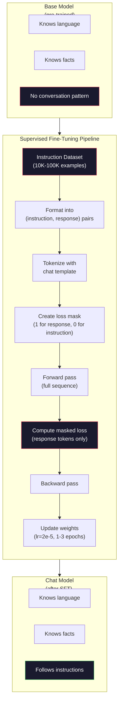

# 指令微调（监督微调）

> 基础模型的任务是预测下一个 token，仅此而已。它不会遵循指令、回答问题或拒绝有害请求。监督微调是连接 token 预测器与实用助手的桥梁。你使用过的每一个模型——Claude、GPT、Llama Chat——都经历了这一步。

**类型：** 构建
**语言：** Python（使用 numpy）
**先决条件：** 第 10 阶段，第 04 课（预训练一个迷你 GPT）
**时间：** ~90 分钟

## 学习目标

- 实现监督微调，将基础语言模型转化为遵循指令的助手
- 使用包含系统、用户和助手角色的对话模板格式化训练数据，并对非助手 token 进行损失掩码
- 解释为什么 SFT 是必要的：基础模型继续文本而非回答问题
- 通过在保留指令集上比较基础模型与微调模型的响应，评估 SFT 质量

## 问题所在

你在第 04 课训练了一个模型。它可以预测给定序列的下一个 token。输入“transformer 架构”，它可能会接续“彻底改变了自然语言处理。”作为一个下一个 token 预测器，这已经很令人印象深刻了。

现在试试这个：输入“法国的首都是什么？”基础模型不会回答“巴黎。”它会继续模式。它可能会输出“德国的首都是什么？西班牙的首都是什么？”因为它从包含问题列表的文档中学习过。或者它可能会输出“是一个很多人问的问题”，因为那是一个合理的下一个 token 接续。模型没有*回答*的概念。它只知道*继续*。

这就是 GPT-3（基础模型，2020 年 6 月发布）和 ChatGPT（指令微调版，2022 年 11 月发布）之间的差距。相同的架构。相同的预训练。区别在于，20,000 到 100,000 个精心设计的（指令，响应）对教会了模型遵循对话模式。

斯坦福的 Alpaca 证明了你不需要数百万个样本。2023 年 3 月，他们仅用 GPT-3.5 生成的 52,000 个指令-响应对就对 Llama 7B 进行了微调。总成本：600 美元。结果是一个能遵循指令、回答问题和进行对话的聊天机器人。不如 ChatGPT 好，但考虑到 600 美元和几小时的训练，效果惊人地接近。

Meta 的 Llama 2 Chat 在其初始 SFT 阶段仅使用了约 27,000 个高质量样本。关键见解：质量重于数量。27,000 个由熟练标注员编写的样本，比从互联网抓取的 100 万个嘈杂样本效果更好。

## 核心概念

### SFT 实际做了什么

监督微调延续了与预训练相同的训练循环——前向传播、计算损失、反向传播、更新权重——但使用的是不同类型的数据。不是原始文本，而是在结构化的对话上进行训练：

```json
{
  "system": "You are a helpful assistant.",
  "user": "What is the capital of France?",
  "assistant": "The capital of France is Paris."
}
```

模型已经知道巴黎是法国的首都。它是在预训练期间从维基百科、教科书和网页中学到的。SFT 不是教模型新事实。它教模型一种新的*行为*：当你看到问题时，给出答案。当你看到指令时，给出补全。当你看到有害请求时，给出拒绝。

可以这样理解：预训练赋予模型知识。SFT 赋予模型礼仪。

### 数据格式

行业中有三种主流格式。它们编码相同的信息——谁说了什么——只是使用不同的分隔符。

**Alpaca 格式**（斯坦福，2023 年 3 月）：

```json
{
  "instruction": "Summarize the following article in 3 sentences.",
  "input": "The European Central Bank raised interest rates...",
  "output": "The ECB increased rates by 25 basis points..."
}
```

简单且使用广泛。`input` 字段是可选的——许多指令不需要额外的上下文。斯坦福以这种格式发布了 52,000 个样本，由 GPT-3.5 生成，花费 600 美元。这开启了开源指令微调运动。

**ShareGPT 格式**（社区，2023 年）：

```json
{
  "conversations": [
    {"from": "system", "value": "You are a helpful assistant."},
    {"from": "human", "value": "What causes tides?"},
    {"from": "gpt", "value": "Tides are caused by the gravitational pull of the Moon..."},
    {"from": "human", "value": "How often do they occur?"},
    {"from": "gpt", "value": "Most coastal areas experience two high tides and two low tides per day..."}
  ]
}
```

支持多轮对话。按惯例，"from" 字段使用 "human" 和 "gpt"，与实际模型无关。Vicuna 是基于从用户共享的 ChatGPT 对话记录中抓取的 70,000 条 ShareGPT 对话训练的。

**ChatML 格式**（OpenAI，许多开源模型使用）：

```
<|im_start|>system
You are a helpful assistant.<|im_end|>
<|im_start|>user
What is the capital of France?<|im_end|>
<|im_start|>assistant
The capital of France is Paris.<|im_end|>
```

使用特殊 token（`<|im_start|>`、`<|im_end|>`）来分隔角色。这些 token 在微调期间被添加到分词器的词汇表中。Qwen、Yi 和许多其他模型使用 ChatML。

所有三种格式都完成同一件事：它们告诉模型“这是指令，这是响应，学习这个模式。”

### 为什么它有效

模型已经通过预训练理解了语言。它已经看过数十亿个问题后接答案、指令后接补全、以及人与人之间对话的例子。这些模式已经编码在权重中。

SFT 集中了这种潜在能力。模型不再需要根据上下文来判断是该回答问题还是继续一段文档，而是明确地在对话模式上进行训练。经过几千个例子后，模型就学会了：当你看到助手角色标记时，产生一个有帮助的响应。

这就是为什么 27,000 个例子就够了。你不是在教模型英语。你不是在教它关于世界的事实。你是在教它一个简单的行为：回应指令。知识早已存在。

### 损失掩码

这是 SFT 中最重要的技术细节，也是大多数教程会跳过的。

在预训练期间，你在每个 token 上计算损失。模型学习预测序列中的每一个下一个 token。在 SFT 期间，你只在*响应* token 上计算损失。指令 token 在那里是为了提供上下文，但模型不会因为“错误预测”它们而受惩罚。

为什么？因为你不想让模型学习*生成*指令。你想让它学习*响应*指令。如果你在指令 token 上计算损失，你就是在训练模型去预测“法国的首都是什么？”就好像它是提问者一样。这会浪费梯度信号，并可能混淆模型对其角色的认知。

在实践中，你需要创建一个损失掩码：对响应 token 为 1，对指令 token 为 0。在计算平均值之前，将每个 token 的损失乘以这个掩码。

```
Tokens:    [SYS] You are helpful [USER] What is the capital? [ASST] Paris is the capital [EOS]
Loss mask:   0    0    0     0      0     0   0  0     0       1     1    1   1     1      1
```

只有 `[ASST]` 之后的 token 才会计入损失。模型在前向传播期间看到完整的对话（它需要指令才能产生正确的响应），但只根据它预测响应的好坏程度来更新其权重。

### 训练超参数

SFT 使用的超参数与预训练有巨大差异。你不是从头开始训练。你是在调整一个已经可用的模型。

| 参数 | 预训练 (Llama 2 7B) | SFT (Llama 2 Chat) |
|-----------|---------------------------|---------------------|
| 学习率 | 3e-4 (峰值) | 2e-5 |
| 训练轮次 | 1 (单次遍历数据) | 2 |
| 批大小 | 4M token | 64 个样本 |
| 预热步数 | 2,000 | 0-100 |
| 权重衰减 | 0.1 | 0.0-0.1 |
| 数据量 | 2T token | 27,000 个样本 |

SFT 的学习率低了 15 倍。这至关重要。微调期间使用高学习率会破坏预训练的知识。模型会“忘记”它学到的东西，并对较小的微调数据集过拟合。这就是灾难性遗忘。

两个训练轮次意味着模型会看到每个训练样本两次。在小数据集上超过 3 个训练轮次会导致记忆——模型开始逐字复述训练样本，而不是进行泛化。

### 灾难性遗忘

微调可能会破坏通用能力。在遵循指令的数据上训练太久，模型会丧失编写代码、做数学或产生创造性文本的能力。它会变得非常擅长其训练数据的特定格式，但在其他方面表现糟糕。

三种缓解措施：

1. **低学习率。** 1e-5 到 5e-5。较小的更新意味着对预训练特征的破坏更少。
2. **短期训练。** 1-3 个训练轮次。在模型过拟合之前停止。
3. **混入预训练数据。** Llama 2 Chat 在 SFT 数据集中混入了一小部分（2-5%）原始预训练数据。这“提醒”模型其通用能力，同时学习新的指令遵循行为。

### 实际数字

在单张 NVIDIA A100 80GB GPU 上，用 10,000 个高质量指令对微调一个 7B 模型大约需要 1 小时。计算如下：

- 10,000 个样本 x 平均 512 token = 512 万 token
- 2 个训练轮次 = 总共 1024 万 token
- 7B 模型微调的 A100 吞吐量：约 3,000 token/秒
- 1024 万 / 3,000 = 约 3,400 秒 = 约 57 分钟

对于我们的迷你 GPT（4 层，128 维），训练几乎是瞬间完成的。重点是理解机制，而非规模。



## 动手构建

### 步骤 1：指令数据集

创建一个合成的指令数据集。在生产环境中，像 Scale AI 和 Anthropic 这样的公司会雇佣人工标注员来编写这些数据。我们将通过编程方式创建它们以演示格式。

```python
import numpy as np

INSTRUCTION_DATA = [
    {
        "instruction": "What is the capital of France?",
        "response": "The capital of France is Paris."
    },
    {
        "instruction": "Explain gravity in one sentence.",
        "response": "Gravity is the force that attracts objects with mass toward each other."
    },
    {
        "instruction": "Write a haiku about the ocean.",
        "response": "Waves crash on the shore, salt and foam beneath the sun, endless blue expanse."
    },
    {
        "instruction": "What is 15 multiplied by 7?",
        "response": "15 multiplied by 7 is 105."
    },
    {
        "instruction": "Name three programming languages.",
        "response": "Three programming languages are Python, Rust, and TypeScript."
    },
    {
        "instruction": "Summarize photosynthesis.",
        "response": "Photosynthesis converts sunlight, water, and carbon dioxide into glucose and oxygen."
    },
    {
        "instruction": "What year did World War II end?",
        "response": "World War II ended in 1945."
    },
    {
        "instruction": "Define machine learning.",
        "response": "Machine learning is a field where algorithms learn patterns from data to make predictions."
    },
]
```

八个例子非常少。斯坦福 Alpaca 使用了 52,000 个。但无论你有 8 个还是 52,000 个，其机制都是相同的：分词、掩码、仅在响应上计算损失。

### 步骤 2：使用对话模板进行分词

将指令-响应对转换为带有特殊角色标记的 token 序列。这些标记告诉模型指令在哪里结束，响应在哪里开始。

```python
SPECIAL_TOKENS = {
    "INST_START": 253,
    "INST_END": 254,
    "RESP_START": 255,
}


def tokenize_instruction_pair(instruction, response, vocab_size=256):
    inst_tokens = list(instruction.encode("utf-8"))
    resp_tokens = list(response.encode("utf-8"))

    inst_tokens = [min(t, vocab_size - 4) for t in inst_tokens]
    resp_tokens = [min(t, vocab_size - 4) for t in resp_tokens]

    tokens = (
        [SPECIAL_TOKENS["INST_START"]]
        + inst_tokens
        + [SPECIAL_TOKENS["INST_END"]]
        + [SPECIAL_TOKENS["RESP_START"]]
        + resp_tokens
    )

    return tokens


def create_loss_mask(tokens):
    mask = np.zeros(len(tokens), dtype=np.float32)
    in_response = False

    for i, token in enumerate(tokens):
        if token == SPECIAL_TOKENS["RESP_START"]:
            in_response = True
            continue
        if in_response:
            mask[i] = 1.0

    return mask
```

指令 token 的损失掩码全为零，响应 token 的损失掩码全为一。`RESP_START` token 本身的掩码为 0，因为它是分隔符，不是响应内容的一部分。

### 步骤 3：掩码交叉熵损失

标准的交叉熵损失，但乘以损失掩码。只有响应 token 贡献梯度。

```python
def masked_cross_entropy_loss(logits, targets, loss_mask):
    batch, seq_len, vocab_size = logits.shape
    logits_flat = logits.reshape(-1, vocab_size)
    targets_flat = targets.reshape(-1)
    mask_flat = loss_mask.reshape(-1)

    max_logits = logits_flat.max(axis=-1, keepdims=True)
    log_softmax = logits_flat - max_logits - np.log(
        np.exp(logits_flat - max_logits).sum(axis=-1, keepdims=True)
    )

    per_token_loss = -log_softmax[np.arange(len(targets_flat)), targets_flat]

    masked_loss = per_token_loss * mask_flat
    num_response_tokens = mask_flat.sum()
    if num_response_tokens == 0:
        return 0.0
    loss = masked_loss.sum() / num_response_tokens

    return loss
```

分母是 `num_response_tokens`，而不是 `seq_len`。如果按总序列长度平均，较长的指令会稀释梯度信号。按响应 token 数量平均，确保无论指令长度如何，每个响应 token 具有相等的权重。

### 步骤 4：SFT 训练循环

复用第 04 课的 MiniGPT。训练循环看起来与预训练几乎相同，但增加了指令格式化和损失掩码。

```python
import sys
import os
sys.path.insert(0, os.path.join(os.path.dirname(__file__), "..", "..", "04-pre-training-mini-gpt", "code"))
from main import MiniGPT, LayerNorm, FeedForward, MultiHeadAttention, TransformerBlock, Embedding


def sft_train(model, dataset, num_epochs=2, lr=2e-5, seq_len=64):
    formatted_data = []
    for example in dataset:
        tokens = tokenize_instruction_pair(example["instruction"], example["response"])
        mask = create_loss_mask(tokens)
        formatted_data.append((tokens, mask))

    print(f"SFT Training: {len(formatted_data)} examples, {num_epochs} epochs, lr={lr}")
    print(f"Total tokens: {sum(len(t) for t, _ in formatted_data):,}")
    print()

    losses = []

    for epoch in range(num_epochs):
        epoch_loss = 0.0
        num_batches = 0

        indices = np.random.permutation(len(formatted_data))

        for idx in indices:
            tokens, mask = formatted_data[idx]

            if len(tokens) < 3:
                continue
            if len(tokens) > seq_len:
                tokens = tokens[:seq_len]
                mask = mask[:seq_len]

            input_ids = np.array(tokens[:-1]).reshape(1, -1)
            target_ids = np.array(tokens[1:]).reshape(1, -1)
            loss_mask = np.array(mask[1:]).reshape(1, -1)

            logits = model.forward(input_ids)
            loss = masked_cross_entropy_loss(logits, target_ids, loss_mask)

            batch_size, s_len, v_size = logits.shape
            probs = np.exp(logits - logits.max(axis=-1, keepdims=True))
            probs = probs / probs.sum(axis=-1, keepdims=True)
            dlogits = probs.copy()
            dlogits[np.arange(batch_size)[:, None], np.arange(s_len), target_ids] -= 1.0

            mask_expanded = loss_mask[:, :, np.newaxis]
            num_resp = loss_mask.sum()
            if num_resp > 0:
                dlogits = dlogits * mask_expanded / num_resp

            for block in model.blocks:
                block.ffn.W1 -= lr * np.random.randn(*block.ffn.W1.shape) * 0.01
                block.ffn.W2 -= lr * np.random.randn(*block.ffn.W2.shape) * 0.01
                block.ffn.b1 -= lr * np.random.randn(*block.ffn.b1.shape) * 0.01
                block.ffn.b2 -= lr * np.random.randn(*block.ffn.b2.shape) * 0.01

            epoch_loss += loss
            num_batches += 1
            losses.append(loss)

        avg_loss = epoch_loss / max(num_batches, 1)
        print(f"Epoch {epoch + 1}/{num_epochs} | Avg Loss: {avg_loss:.4f}")

    return model, losses
```

学习率是 2e-5，与 Llama 2 Chat 匹配。将其与预训练中使用的 3e-4 进行比较——低了 15 倍。梯度被掩码了：指令 token 产生零梯度。只有响应 token 在推动权重更新。

### 步骤 5：比较基础模型与 SFT 模型

SFT 的全部意义在于行为改变。让我们通过检查模型对指令格式化输入与原始文本续写的响应来衡量它。

```python
def generate_response(model, prompt_tokens, max_new_tokens=50, temperature=0.8):
    tokens = list(prompt_tokens)
    seq_len = model.embedding.pos_embed.shape[0]

    for _ in range(max_new_tokens):
        context = np.array(tokens[-seq_len:]).reshape(1, -1)
        logits = model.forward(context)
        next_logits = logits[0, -1, :]

        next_logits = next_logits / max(temperature, 1e-8)
        probs = np.exp(next_logits - next_logits.max())
        probs = probs / probs.sum()
        probs = np.clip(probs, 1e-10, 1.0)
        probs = probs / probs.sum()

        next_token = np.random.choice(len(probs), p=probs)
        tokens.append(int(next_token))

    return tokens


def evaluate_instruction_following(model, instructions):
    print("Evaluating instruction following:")
    print("-" * 50)

    for instruction in instructions:
        tokens = (
            [SPECIAL_TOKENS["INST_START"]]
            + [min(t, 252) for t in list(instruction.encode("utf-8"))]
            + [SPECIAL_TOKENS["INST_END"]]
            + [SPECIAL_TOKENS["RESP_START"]]
        )

        output = generate_response(model, tokens, max_new_tokens=30, temperature=0.6)
        response_start = len(tokens)
        response_tokens = output[response_start:]
        response_bytes = bytes([t for t in response_tokens if t < 128])
        response_text = response_bytes.decode("utf-8", errors="replace")

        print(f"  Q: {instruction}")
        print(f"  A: {response_text[:80]}")
        print()
```

在一个只有 8 个例子的小模型上，响应不会很有意义。这是预期的。重要的是*结构*：模型学会在响应标记之后产生输出，而不是继续生成更多指令。

### 步骤 6：衡量灾难性遗忘

比较 SFT 前后模型预测下一个 token 的能力。如果 SFT 损害了通用能力，那么在原始文本上的损失将会增加。

```python
def measure_forgetting(model, test_text, seq_len=64):
    tokens = np.array(list(test_text.encode("utf-8")[:512]))

    total_loss = 0.0
    num_windows = 0

    for start in range(0, len(tokens) - seq_len - 1, seq_len):
        input_ids = tokens[start:start + seq_len].reshape(1, -1)
        target_ids = tokens[start + 1:start + seq_len + 1].reshape(1, -1)

        logits = model.forward(input_ids)

        batch, s_len, vocab_size = logits.shape
        logits_flat = logits.reshape(-1, vocab_size)
        targets_flat = target_ids.reshape(-1)

        max_logits = logits_flat.max(axis=-1, keepdims=True)
        log_softmax = logits_flat - max_logits - np.log(
            np.exp(logits_flat - max_logits).sum(axis=-1, keepdims=True)
        )

        loss = -log_softmax[np.arange(len(targets_flat)), targets_flat].mean()
        total_loss += loss
        num_windows += 1

    return total_loss / max(num_windows, 1)
```

在真实的微调过程中，你应该在整个训练过程中跟踪这个指标。如果原始文本的损失增加了 10-15% 以上，说明你的 SFT 过于激进。降低学习率或减少训练轮次。

## 实际应用

### 完整的 SFT 流程演示

```python
if __name__ == "__main__":
    np.random.seed(42)

    test_text = """The transformer architecture processes sequences through self-attention.
Each layer applies multi-head attention followed by a feedforward network.
Residual connections and layer normalization stabilize deep networks.
The model learns to predict the next token given all previous tokens."""

    print("=" * 70)
    print("INSTRUCTION TUNING (SFT) DEMO")
    print("=" * 70)
    print()

    model = MiniGPT(
        vocab_size=256, embed_dim=128, num_heads=4,
        num_layers=4, max_seq_len=128, ff_dim=512
    )
    print(f"Model: {model.count_parameters():,} parameters")
    print(f"Config: 4 layers, 4 heads, 128 dims (mini GPT from Lesson 04)")
    print()

    print("PRE-SFT: Measuring base model loss on raw text")
    base_loss = measure_forgetting(model, test_text)
    print(f"  Base model loss: {base_loss:.4f}")
    print()

    print("=" * 70)
    print("SFT TRAINING")
    print("=" * 70)

    model, losses = sft_train(
        model, INSTRUCTION_DATA, num_epochs=3, lr=2e-5, seq_len=128
    )

    print()
    print("POST-SFT: Measuring fine-tuned model loss on raw text")
    sft_loss = measure_forgetting(model, test_text)
    print(f"  SFT model loss: {sft_loss:.4f}")
    print(f"  Change: {((sft_loss - base_loss) / base_loss * 100):+.1f}%")
    if abs(sft_loss - base_loss) / base_loss < 0.15:
        print("  Minimal forgetting (< 15% change)")
    else:
        print("  Significant forgetting detected")
    print()

    print("=" * 70)
    print("INSTRUCTION FOLLOWING EVALUATION")
    print("=" * 70)
    print()

    test_instructions = [
        "What is the capital of France?",
        "Name a programming language.",
        "Define gravity.",
    ]
    evaluate_instruction_following(model, test_instructions)

    print("=" * 70)
    print("DATA FORMAT EXAMPLES")
    print("=" * 70)
    print()

    for i, example in enumerate(INSTRUCTION_DATA[:3]):
        tokens = tokenize_instruction_pair(example["instruction"], example["response"])
        mask = create_loss_mask(tokens)
        resp_count = int(mask.sum())
        total_count = len(tokens)
        print(f"  Example {i + 1}: {total_count} tokens, {resp_count} response tokens ({resp_count/total_count:.0%} of sequence)")
        print(f"    Instruction: {example['instruction']}")
        print(f"    Response: {example['response']}")
        print()

    print("=" * 70)
    print("TRAINING LOSS CURVE")
    print("=" * 70)
    print()

    if losses:
        window = max(1, len(losses) // 5)
        for i in range(0, len(losses), window):
            chunk = losses[i:i + window]
            avg = sum(chunk) / len(chunk)
            print(f"  Steps {i:3d}-{i + len(chunk) - 1:3d}: avg loss = {avg:.4f}")
```

## 产品化

本课产生 `outputs/prompt-sft-data-curator.md` —— 一个提示，帮助你为 SFT 设计和整理指令数据集。给定一个目标能力（代码生成、数学、对话），它会产生一个数据收集计划，包含格式规范、质量标准和多样性要求。

## 练习

1.  添加系统提示支持。修改 `tokenize_instruction_pair` 以接受系统消息，并在指令前添加它。创建 5 个包含不同系统提示（“你是一位诗人”，“你是一位数学导师”）的样本，并验证模型在训练期间能看到不同的系统提示。
2.  实现数据混合。创建一个函数，接受一个 SFT 数据集和一个原始文本语料库，然后生成训练批次，其中 5% 的样本是原始文本（无掩码），95% 是指令对（带掩码）。运行 3 个训练轮次，并将遗忘指标与纯 SFT 训练进行比较。
3.  构建一个数据质量评分器。对于每个指令-响应对，计算：(a) 响应长度（token 数），(b) 指令与响应的比率，(c) 词汇多样性（不同 token 数 / 总 token 数）。过滤掉响应长度 < 10 token 或多样性 < 0.3 的样本。展示过滤如何影响最终损失。
4.  实现多轮对话训练。扩展分词以处理 3 轮对话（用户-助手-用户-助手-用户-助手）。损失掩码应覆盖所有三个助手轮次。通过打印一个示例的 token-掩码对齐情况来验证掩码是否正确。
5.  比较学习率。使用 lr=1e-4、lr=2e-5 和 lr=1e-6 分别训练同一个模型三次。绘制损失曲线。lr=1e-4 的运行应显示初始下降迅速但最终损失较高（过拟合）。lr=1e-6 的运行应几乎不动。lr=2e-5 的运行应该是最佳点。

## 关键术语

| 术语 | 人们怎么说 | 实际含义 |
|------|----------------|----------------------|
| SFT | “在对话上微调” | 监督微调：在（指令，响应）对上继续训练，并且损失仅在响应 token 上计算 |
| 指令微调 | “教模型遵循指令” | 在明确的指令-响应对上训练，使基础模型学习对话模式，而非新知识 |
| 损失掩码 | “忽略提示” | 将指令 token 的损失设为零，使梯度仅从响应 token 的预测中流动 |
| ChatML | “聊天标记语言” | 一种 token 格式，使用 `<\|im_start\|>` 和 `<\|im_end\|>` 分隔符标记对话数据中的说话者角色 |
| Alpaca 格式 | “斯坦福的格式” | 一种包含 instruction/input/output 字段的 JSON 格式，用于由 GPT-3.5 生成的 52K 个样本，成本 600 美元 |
| 灾难性遗忘 | “模型变笨了” | 微调破坏了预训练能力，因为梯度更新用任务特定的模式覆盖了通用知识 |
| 权重绑定 | “共享嵌入” | 为输入 token 嵌入和输出预测头使用相同的矩阵，节省参数并提高一致性 |
| 对话模板 | “你如何格式化提示” | 用于为模型构建对话结构的特定 token 序列（角色标记、分隔符） |

## 延伸阅读

-   [Ouyang 等人，2022 -- “用人类反馈训练语言模型遵循指令”（InstructGPT）](https://arxiv.org/abs/2203.02155) -- 在 OpenAI 引入指令微调 + RLHF 的论文
-   [Taori 等人，2023 -- “斯坦福 Alpaca：一个遵循指令的 LLaMA 模型”](https://github.com/tatsu-lab/stanford_alpaca) -- 52K 个指令样本，花费 600 美元，证明 SFT 在小数据集上有效
-   [Touvron 等人，2023 -- “Llama 2：开放的基础模型和微调后的聊天模型”](https://arxiv.org/abs/2307.09288) -- Meta 的 SFT + RLHF 流程，使用 27K 个高质量样本
-   [Chiang 等人，2023 -- “Vicuna：一个令 GPT-4 印象深刻的开源聊天机器人”](https://lmsys.org/blog/2023-03-30-vicuna/) -- 在 70K 个 ShareGPT 对话上训练
-   [Zhou 等人，2023 -- “LIMA：对齐中少即是多”](https://arxiv.org/abs/2305.11206) -- 证明 1,000 个精心策划的样本可以匹配在大得多的数据集上进行的 SFT