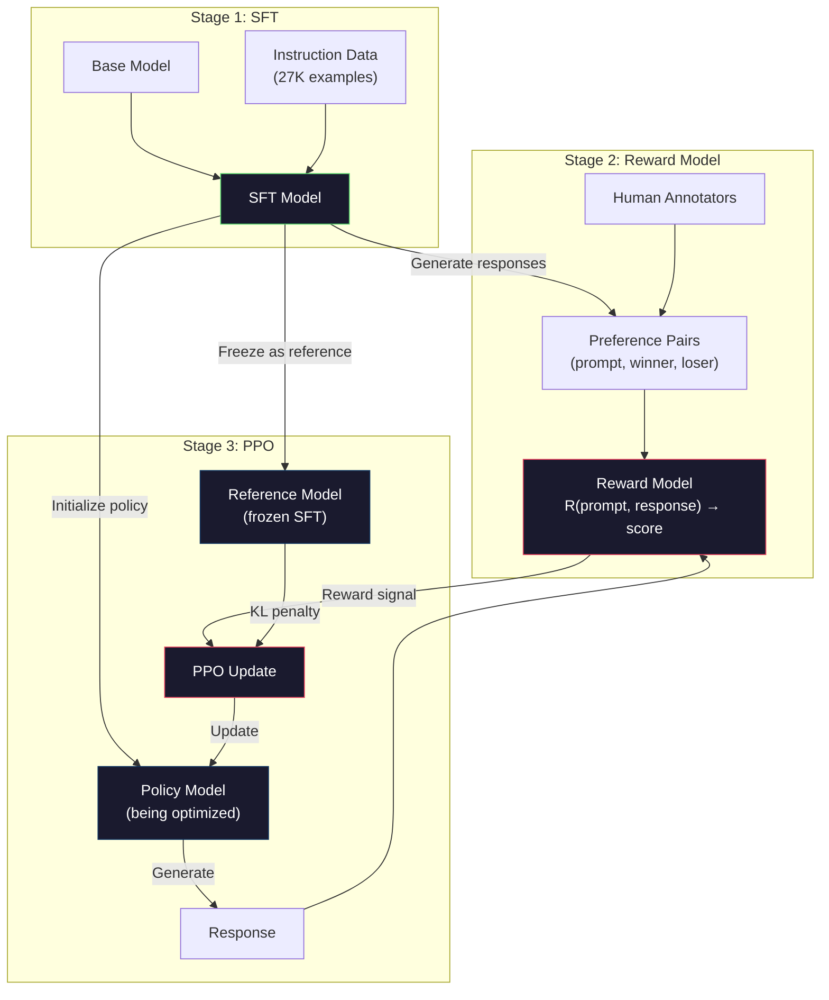
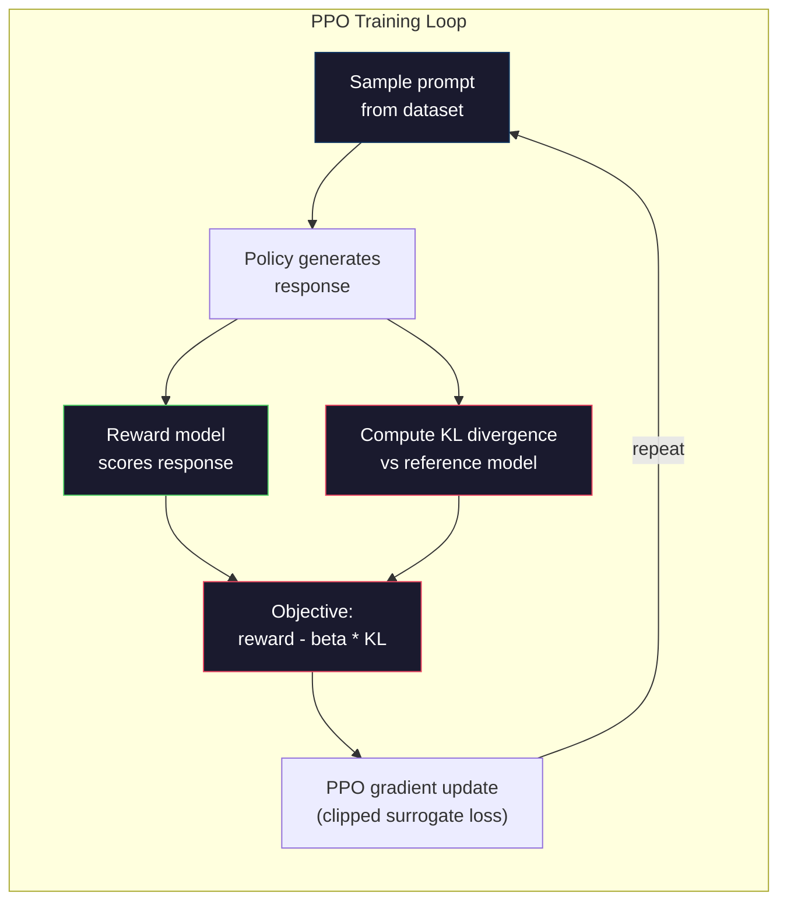

# RLHF：奖励模型 + PPO

> SFT 教会模型遵循指令，但并未教会它哪种响应更好。两个语法正确、事实准确的回答在有用性上可能存在巨大差异。RLHF 将人类判断编码到模型行为中。正是它让 Claude 变得有用，让 GPT 变得礼貌。

**类型：** 构建
**语言：** Python（配合 numpy）
**前置要求：** 第10阶段第06课（指令微调 / SFT）
**时间：** 约90分钟

## 学习目标

- 构建一个奖励模型，从人类偏好数据对（选择 vs 拒绝）中对响应质量进行评分
- 实现 PPO 训练循环，利用 KL 惩罚优化语言模型策略以匹配奖励模型
- 解释为何 RLHF 需要三个模型（SFT、奖励、策略）以及 KL 约束如何防止奖励黑客
- 通过比较偏好优化前后的响应质量，评估 RLHF 的效果

## 问题所在

让模型“解释量子计算”，它可能会生成：

**响应A：** “量子计算使用可以处于叠加态的量子比特，这意味着它们可以同时是0、1或两者。这使得量子计算机能以指数级速度处理某些特定计算。关键算法包括用于分解大整数的 Shor 算法和用于搜索未排序数据库的 Grover 算法。”

**响应B：** “量子计算是一种利用量子力学现象的计算类型。它在20世纪80年代首次被提出。Richard Feynman 提出量子计算机可以模拟量子系统。自那时起该领域发展显著。许多公司现在都在研究量子计算机。IBM、谷歌等都取得了进展。谷歌在2019年宣称实现了量子优越性。”

两个响应都事实正确，语法通顺，且遵循指令。但响应A明显更好：更简洁、信息量更大、结构更优。人类每次都会选择A。

SFT 无法捕捉这种区别。它在“正确”响应上训练模型，但没有机制区分“这个响应比那个更好”。它将每个训练样本视为同等重要。如果A和B都出现在 SFT 数据集中，模型会从两者中学到相同内容。

RLHF 解决了这个问题。它训练一个奖励模型来预测人类偏好哪个响应，然后用该奖励信号推动语言模型产生更高质量的输出。InstructGPT（ChatGPT 的前身）使用 RLHF 显著提升了 GPT-3 的有用性、真实性和无害性。OpenAI 的内部评估员在85%的情况下更喜欢 InstructGPT 的输出而非 GPT-3 的输出，尽管 InstructGPT 的参数量只有 GPT-3 的1/135（13亿 vs 1750亿参数）。

## 概念解析

### 三个阶段

RLHF 并非一次单独的训练运行，而是一个包含三个连续阶段的流程，每个阶段都建立在前一个基础上。

**阶段1：SFT。** 在指令-响应对上训练基础模型（第06课）。这给你一个能遵循指令但不知道哪些响应更好的模型。

**阶段2：奖励模型。** 收集人类偏好数据：向标注员展示同一提示下的两个响应，询问“哪个更好？”训练一个模型来预测这些偏好。奖励模型以（提示，响应）为输入，输出一个标量分数。

**阶段3：PPO。** 利用奖励模型为语言模型生成训练信号。语言模型生成响应，奖励模型为其评分，PPO 更新语言模型以产生更高评分的响应。KL 散度惩罚防止语言模型偏离 SFT 检查点过远。



### 奖励模型

奖励模型是被重新用作评分器的语言模型。取 SFT 模型，将语言建模头（输出词汇表上的分布）替换为标量头（输出单个数字）。架构在最终层之前完全相同。

输入：提示与响应拼接。输出：单个标量奖励分数。

训练数据是人类偏好数据对。对于每个提示，标注员查看两个响应并选择更好的一个。这构成训练三元组：（提示，优选响应，拒绝响应）。

损失函数使用 Bradley-Terry 成对偏好模型：

```
loss = -log(sigmoid(reward(preferred) - reward(rejected)))
```

这是关键方程。`sigmoid(reward(A) - reward(B))` 给出响应A优于响应B的概率。损失推动奖励模型给优选响应分配更高分数。

为什么使用成对比较而非绝对分数？因为人类很不擅长给出绝对质量分数（“这个响应是10分中的7.3分还是7.5分？”），但非常擅长相对比较（“A是否比B好？”）。Bradley-Terry 模型将相对比较转换为一致的绝对评分系统。

**InstructGPT 数据：** OpenAI 从40名承包商处收集了33,000个比较对。每次比较耗时约5分钟。奖励模型训练数据耗费了2,750小时的人工。

### PPO：近端策略优化

PPO 是一种强化学习算法。在 RLHF 中，“环境”是奖励模型，“智能体”是语言模型，“动作”是生成一个 token。

目标函数：

```
maximize: E[R(prompt, response)] - beta * KL(policy || reference)
```

第一项推动模型生成高奖励响应。第二项（KL 散度惩罚）防止模型偏离 SFT 检查点过远。

为什么需要 KL 惩罚？没有它，模型会找到退化解。奖励模型是在有限的人类偏好数据集上训练的，存在盲点。语言模型会利用这些盲点——找到在奖励模型上得分高但实际上荒谬的输出。典型例子：

- 重复“我非常有帮助且无害！”在有用性/无害性奖励模型上得分很高
- 产生冗长、听起来正式但空洞的响应，这些响应模式匹配“高质量”
- 利用训练数据中偶然与高奖励相关的特定短语

KL 惩罚说：你可以改进，但不能成为一个完全不同的模型。保持接近已经合理的 SFT 版本。偏离太远，KL 成本会主导奖励。

**InstructGPT 数据：** PPO 训练使用学习率=1.5e-5，KL 系数 beta=0.02，256K 个 episode（提示-响应对），每个批次进行4次 PPO epoch。整个 RLHF 流程在 GPU 集群上耗时数天。



### PPO 目标详解

PPO 使用“截断替代目标”来防止过大的更新。新策略与旧策略概率的比率被截断到 [1 - epsilon, 1 + epsilon] 范围内，其中 epsilon 通常为0.2。

```
ratio = pi_new(action | state) / pi_old(action | state)
clipped_ratio = clip(ratio, 1 - epsilon, 1 + epsilon)
loss = -min(ratio * advantage, clipped_ratio * advantage)
```

优势函数估计当前响应比预期质量好多少。在 RLHF 中：

```
advantage = reward(prompt, response) - baseline
```

基线通常是最近响应的平均奖励。正优势意味着响应优于平均水平；负优势意味着低于平均水平。PPO 增加优于平均水平响应的概率，降低低于平均水平响应的概率。

截断防止灾难性更新。如果单个响应获得异常高的奖励，未截断的比率可能非常大，导致模型戏剧性地向该响应偏移。截断限制了更新，维持训练稳定性。

### 奖励黑客

RLHF 的阴暗面。语言模型针对奖励模型进行优化，而奖励模型是人类偏好的不完美代理。随着语言模型越来越擅长最大化奖励，它开始利用奖励模型的弱点。

常见失败模式：

| 失败模式 | 发生情况 | 原因 |
|---------|-------------|-----|
| 冗长 | 模型产生越来越长的响应 | 人类标注员通常偏好更长、更详细的响应，因此奖励模型给长度分配更高分数 |
| 谄媚 | 模型同意用户说的一切 | 标注员偏好同意问题前提的响应 |
| 模棱两可 | 模型拒绝承诺回答 | 模棱两可的响应（“这是一个有多种视角的复杂话题...”）很少被标记为错误 |
| 格式游戏 | 模型过度使用项目符号和标题 | 格式化的响应在标注员看来更“精致” |

缓解策略：更强的 KL 惩罚（防止模型偏离足够远以利用弱点），在对抗性示例上训练奖励模型（修补已知失败模式），以及使用不同架构的多个奖励模型（更难同时黑掉所有模型）。

### 真实 RLHF 流程

| 模型 | 比较对数量 | 标注员数量 | 奖励模型大小 | PPO 步数 | KL 系数 |
|-------|-----------------|------------|---------|-----------|----------|
| InstructGPT | 33K | 40 | 6B | 256K | 0.02 |
| Llama 2 Chat | ~1M | 未公开 | 70B | 未公开 | 0.01 |
| Claude | 未公开 | 未公开 | 未公开 | 未公开 | 未公开 |
| Anthropic RLHF 论文 | 22K | 20 | 52B | 50K | 0.001 |

Anthropic 的2022年论文在22,000个比较上训练了一个52B的奖励模型。更大的奖励模型产生更可靠的信号，使 PPO 训练更稳定。用小奖励模型训练大语言模型是危险的——奖励模型没有足够的容量来捕捉好响应与坏响应的细微差别。

## 动手构建

### 步骤1：合成偏好数据

在生产中，人类标注员创建偏好数据。我们将创建合成数据对，其中“优选”响应客观上更好（更简洁、更准确、更有帮助）。

```python
import numpy as np

PREFERENCE_DATA = [
    {
        "prompt": "What is the capital of France?",
        "preferred": "The capital of France is Paris.",
        "rejected": "France is a country in Europe. It has many cities. The capital is Paris. Paris is known for the Eiffel Tower.",
    },
    {
        "prompt": "Explain gravity in one sentence.",
        "preferred": "Gravity is the force that attracts objects with mass toward each other.",
        "rejected": "Gravity is something that makes things fall down when you drop them.",
    },
    {
        "prompt": "What is 15 times 7?",
        "preferred": "15 times 7 is 105.",
        "rejected": "Let me think about this. 15 times 7. Well, 10 times 7 is 70, and 5 times 7 is 35, so the answer might be around 105.",
    },
    {
        "prompt": "Name three programming languages.",
        "preferred": "Python, Rust, and TypeScript.",
        "rejected": "There are many programming languages. Some popular ones include various languages like Python and others.",
    },
    {
        "prompt": "What year did World War II end?",
        "preferred": "World War II ended in 1945.",
        "rejected": "World War II was a major global conflict. It involved many countries. The war ended in the mid-1940s, specifically in 1945.",
    },
    {
        "prompt": "Define machine learning.",
        "preferred": "Machine learning is a field where algorithms learn patterns from data to make predictions without being explicitly programmed.",
        "rejected": "Machine learning is a type of AI. AI stands for artificial intelligence. Machine learning uses data to learn.",
    },
]
```

优选响应简洁直接。拒绝响应展现了常见的失败模式：不必要的填充、模棱两可、冗余解释和不精确。这正是 SFT 无法捕捉但 RLHF 可以捕捉的区别类型。

### 步骤2：奖励模型架构

奖励模型复用 mini GPT 的 Transformer 架构，但将词汇大小的输出头替换为单个标量投影。

```python
import sys
import os
sys.path.insert(0, os.path.join(os.path.dirname(__file__), "..", "..", "04-pre-training-mini-gpt", "code"))
from main import MiniGPT, LayerNorm, Embedding, TransformerBlock


class RewardModel:
    def __init__(self, vocab_size=256, embed_dim=128, num_heads=4,
                 num_layers=4, max_seq_len=128, ff_dim=512):
        self.embedding = Embedding(vocab_size, embed_dim, max_seq_len)
        self.blocks = [
            TransformerBlock(embed_dim, num_heads, ff_dim)
            for _ in range(num_layers)
        ]
        self.ln_f = LayerNorm(embed_dim)
        self.reward_head = np.random.randn(embed_dim) * 0.02

    def forward(self, token_ids):
        seq_len = token_ids.shape[-1]
        mask = np.triu(np.full((seq_len, seq_len), -1e9), k=1)

        x = self.embedding.forward(token_ids)
        for block in self.blocks:
            x = block.forward(x, mask)
        x = self.ln_f.forward(x)

        last_hidden = x[:, -1, :]
        reward = last_hidden @ self.reward_head

        return reward
```

奖励模型取*最后*一个 token 位置的隐藏状态并将其投影为标量。为什么是最后一个 token？因为因果注意力掩码意味着最后一个位置已经注意到了之前的每个 token。它拥有整个（提示，响应）序列最完整的表示。

### 步骤3：Bradley-Terry 损失

使用 Bradley-Terry 成对损失在偏好数据对上训练奖励模型。

```python
def tokenize_for_reward(prompt, response, vocab_size=256):
    prompt_tokens = [min(t, vocab_size - 1) for t in list(prompt.encode("utf-8"))]
    response_tokens = [min(t, vocab_size - 1) for t in list(response.encode("utf-8"))]
    return prompt_tokens + [0] + response_tokens


def sigmoid(x):
    return np.where(
        x >= 0,
        1.0 / (1.0 + np.exp(-x)),
        np.exp(x) / (1.0 + np.exp(x))
    )


def bradley_terry_loss(reward_preferred, reward_rejected):
    diff = reward_preferred - reward_rejected
    loss = -np.log(sigmoid(diff) + 1e-8)
    return loss


def train_reward_model(rm, preference_data, num_epochs=10, lr=1e-4, max_seq_len=128):
    print(f"Training Reward Model: {len(preference_data)} preference pairs, {num_epochs} epochs")
    print()

    losses = []
    accuracies = []

    for epoch in range(num_epochs):
        epoch_loss = 0.0
        epoch_correct = 0
        num_pairs = 0

        indices = np.random.permutation(len(preference_data))

        for idx in indices:
            pair = preference_data[idx]

            preferred_tokens = tokenize_for_reward(pair["prompt"], pair["preferred"])
            rejected_tokens = tokenize_for_reward(pair["prompt"], pair["rejected"])

            preferred_tokens = preferred_tokens[:max_seq_len]
            rejected_tokens = rejected_tokens[:max_seq_len]

            preferred_ids = np.array(preferred_tokens).reshape(1, -1)
            rejected_ids = np.array(rejected_tokens).reshape(1, -1)

            r_preferred = rm.forward(preferred_ids)[0]
            r_rejected = rm.forward(rejected_ids)[0]

            loss = bradley_terry_loss(r_preferred, r_rejected)

            if r_preferred > r_rejected:
                epoch_correct += 1

            diff = r_preferred - r_rejected
            grad = sigmoid(diff) - 1.0

            rm.reward_head -= lr * grad * rm.ln_f.forward(
                rm.embedding.forward(preferred_ids)
            )[:, -1, :].flatten()

            epoch_loss += loss
            num_pairs += 1

        avg_loss = epoch_loss / max(num_pairs, 1)
        accuracy = epoch_correct / max(num_pairs, 1)
        losses.append(avg_loss)
        accuracies.append(accuracy)

        if epoch % 2 == 0:
            print(f"  Epoch {epoch + 1:3d} | Loss: {avg_loss:.4f} | Accuracy: {accuracy:.1%}")

    return rm, losses, accuracies
```

准确率指标很简单：奖励模型正确排序了多少比例的偏好对？随机模型得分为50%。在干净数据上训练良好的奖励模型应超过70%。InstructGPT 的奖励模型在保留的比较上达到了约72%的准确率，这听起来低但实际上不错——许多偏好对即使对人类也是模糊的（标注员间一致率约为73%）。

### 步骤4：简化 PPO 循环

完整的 PPO 很复杂。此实现捕获了核心机制：生成响应、评分、计算优势、并用 KL 惩罚更新策略。

```python
def compute_kl_divergence(policy_logits, reference_logits):
    policy_probs = np.exp(policy_logits - policy_logits.max(axis=-1, keepdims=True))
    policy_probs = policy_probs / policy_probs.sum(axis=-1, keepdims=True)
    policy_probs = np.clip(policy_probs, 1e-10, 1.0)

    ref_probs = np.exp(reference_logits - reference_logits.max(axis=-1, keepdims=True))
    ref_probs = ref_probs / ref_probs.sum(axis=-1, keepdims=True)
    ref_probs = np.clip(ref_probs, 1e-10, 1.0)

    kl = np.sum(policy_probs * np.log(policy_probs / ref_probs), axis=-1)
    return kl.mean()


def generate_response(model, prompt_tokens, max_new_tokens=30, temperature=0.8, max_seq_len=128):
    tokens = list(prompt_tokens)

    for _ in range(max_new_tokens):
        context = np.array(tokens[-max_seq_len:]).reshape(1, -1)
        logits = model.forward(context)
        next_logits = logits[0, -1, :]

        next_logits = next_logits / max(temperature, 1e-8)
        probs = np.exp(next_logits - next_logits.max())
        probs = probs / probs.sum()
        probs = np.clip(probs, 1e-10, 1.0)
        probs = probs / probs.sum()

        next_token = np.random.choice(len(probs), p=probs)
        tokens.append(int(next_token))

    return tokens


def copy_model_weights(source, target):
    target.embedding.token_embed = source.embedding.token_embed.copy()
    target.embedding.pos_embed = source.embedding.pos_embed.copy()
    target.ln_f.gamma = source.ln_f.gamma.copy()
    target.ln_f.beta = source.ln_f.beta.copy()
    for s_block, t_block in zip(source.blocks, target.blocks):
        t_block.attn.W_q = s_block.attn.W_q.copy()
        t_block.attn.W_k = s_block.attn.W_k.copy()
        t_block.attn.W_v = s_block.attn.W_v.copy()
        t_block.attn.W_out = s_block.attn.W_out.copy()
        t_block.ffn.W1 = s_block.ffn.W1.copy()
        t_block.ffn.W2 = s_block.ffn.W2.copy()
        t_block.ffn.b1 = s_block.ffn.b1.copy()
        t_block.ffn.b2 = s_block.ffn.b2.copy()
        t_block.ln1.gamma = s_block.ln1.gamma.copy()
        t_block.ln1.beta = s_block.ln1.beta.copy()
        t_block.ln2.gamma = s_block.ln2.gamma.copy()
        t_block.ln2.beta = s_block.ln2.beta.copy()


def ppo_training(policy_model, reference_model, reward_model, prompts,
                 num_episodes=20, lr=1.5e-5, kl_coeff=0.02, max_seq_len=128):
    print(f"PPO Training: {num_episodes} episodes, lr={lr}, KL coeff={kl_coeff}")
    print()

    rewards_history = []
    kl_history = []

    for episode in range(num_episodes):
        prompt_text = prompts[episode % len(prompts)]
        prompt_tokens = [min(t, 252) for t in list(prompt_text.encode("utf-8"))]

        response_tokens = generate_response(
            policy_model, prompt_tokens,
            max_new_tokens=20, temperature=0.8, max_seq_len=max_seq_len
        )

        response_ids = np.array(response_tokens[:max_seq_len]).reshape(1, -1)
        reward = reward_model.forward(response_ids)[0]

        policy_logits = policy_model.forward(response_ids)
        ref_logits = reference_model.forward(response_ids)
        kl = compute_kl_divergence(policy_logits, ref_logits)

        total_reward = reward - kl_coeff * kl

        rewards_history.append(float(reward))
        kl_history.append(float(kl))

        for block in policy_model.blocks:
            update_scale = lr * total_reward
            block.ffn.W1 += update_scale * np.random.randn(*block.ffn.W1.shape) * 0.01
            block.ffn.W2 += update_scale * np.random.randn(*block.ffn.W2.shape) * 0.01

        if episode % 5 == 0:
            avg_reward = np.mean(rewards_history[-5:]) if rewards_history else 0
            avg_kl = np.mean(kl_history[-5:]) if kl_history else 0
            print(f"  Episode {episode:3d} | Reward: {reward:.4f} | KL: {kl:.4f} | "
                  f"Avg Reward: {avg_reward:.4f}")

    return policy_model, rewards_history, kl_history
```

核心循环：(1) 采样一个提示，(2) 生成响应，(3) 用奖励模型评分，(4) 对比冻结的参考模型计算 KL 散度，(5) 计算调整后的奖励（奖励减去 KL 惩罚），(6) 更新策略。随着策略偏离参考模型，KL 惩罚会自动增大，防止奖励黑客。

### 步骤5：奖励分数比较

RLHF 后，策略模型的响应在奖励模型上的评分应高于原始 SFT 模型的响应。

```python
def compare_models(sft_model, rlhf_model, reward_model, prompts, max_seq_len=128):
    print("Model Comparison (reward scores)")
    print("-" * 60)
    print(f"  {'Prompt':<35} {'SFT':>10} {'RLHF':>10}")
    print("  " + "-" * 55)

    sft_total = 0.0
    rlhf_total = 0.0

    for prompt in prompts:
        prompt_tokens = [min(t, 252) for t in list(prompt.encode("utf-8"))]

        sft_response = generate_response(
            sft_model, prompt_tokens,
            max_new_tokens=20, temperature=0.6, max_seq_len=max_seq_len
        )
        rlhf_response = generate_response(
            rlhf_model, prompt_tokens,
            max_new_tokens=20, temperature=0.6, max_seq_len=max_seq_len
        )

        sft_ids = np.array(sft_response[:max_seq_len]).reshape(1, -1)
        rlhf_ids = np.array(rlhf_response[:max_seq_len]).reshape(1, -1)

        sft_reward = reward_model.forward(sft_ids)[0]
        rlhf_reward = reward_model.forward(rlhf_ids)[0]

        sft_total += sft_reward
        rlhf_total += rlhf_reward

        truncated_prompt = prompt[:33] + ".." if len(prompt) > 35 else prompt
        print(f"  {truncated_prompt:<35} {sft_reward:>10.4f} {rlhf_reward:>10.4f}")

    n = len(prompts)
    print("  " + "-" * 55)
    print(f"  {'Average':<35} {sft_total/n:>10.4f} {rlhf_total/n:>10.4f}")

    return sft_total / n, rlhf_total / n
```

## 应用示例

### 完整 RLHF 流程演示

```python
if __name__ == "__main__":
    np.random.seed(42)

    print("=" * 70)
    print("RLHF PIPELINE: REWARD MODEL + PPO")
    print("=" * 70)
    print()

    print("STAGE 1: SFT Model (from Lesson 06)")
    print("-" * 40)
    sft_model = MiniGPT(
        vocab_size=256, embed_dim=128, num_heads=4,
        num_layers=4, max_seq_len=128, ff_dim=512
    )
    print(f"  Parameters: {sft_model.count_parameters():,}")
    print()

    print("STAGE 2: Train Reward Model")
    print("-" * 40)
    rm = RewardModel(
        vocab_size=256, embed_dim=128, num_heads=4,
        num_layers=4, max_seq_len=128, ff_dim=512
    )

    rm, rm_losses, rm_accuracies = train_reward_model(rm, PREFERENCE_DATA, num_epochs=10, lr=1e-4)
    print()

    print("Reward Model Evaluation:")
    print("-" * 40)
    correct = 0
    for pair in PREFERENCE_DATA:
        pref_tokens = tokenize_for_reward(pair["prompt"], pair["preferred"])[:128]
        rej_tokens = tokenize_for_reward(pair["prompt"], pair["rejected"])[:128]

        r_pref = rm.forward(np.array(pref_tokens).reshape(1, -1))[0]
        r_rej = rm.forward(np.array(rej_tokens).reshape(1, -1))[0]

        if r_pref > r_rej:
            correct += 1
        print(f"  Preferred: {r_pref:+.4f} | Rejected: {r_rej:+.4f} | {'Correct' if r_pref > r_rej else 'Wrong'}")

    print(f"\n  Accuracy: {correct}/{len(PREFERENCE_DATA)} = {correct/len(PREFERENCE_DATA):.1%}")
    print()

    print("STAGE 3: PPO Training")
    print("-" * 40)

    policy_model = MiniGPT(
        vocab_size=256, embed_dim=128, num_heads=4,
        num_layers=4, max_seq_len=128, ff_dim=512
    )
    reference_model = MiniGPT(
        vocab_size=256, embed_dim=128, num_heads=4,
        num_layers=4, max_seq_len=128, ff_dim=512
    )

    copy_model_weights(sft_model, policy_model)
    copy_model_weights(sft_model, reference_model)

    train_prompts = [pair["prompt"] for pair in PREFERENCE_DATA]

    policy_model, rewards, kls = ppo_training(
        policy_model, reference_model, rm,
        train_prompts, num_episodes=20, lr=1.5e-5, kl_coeff=0.02
    )
    print()

    print("=" * 70)
    print("COMPARISON: SFT vs RLHF")
    print("=" * 70)
    print()

    eval_prompts = [
        "What is the capital of France?",
        "Explain gravity.",
        "Name three programming languages.",
    ]

    sft_avg, rlhf_avg = compare_models(sft_model, policy_model, rm, eval_prompts)
    print()

    print("=" * 70)
    print("KL DIVERGENCE ANALYSIS")
    print("=" * 70)
    print()

    if kls:
        print(f"  Initial KL: {kls[0]:.4f}")
        print(f"  Final KL:   {kls[-1]:.4f}")
        print(f"  Max KL:     {max(kls):.4f}")
        kl_threshold = 0.1
        print(f"  KL > {kl_threshold}: {'Yes (model drifted significantly)' if max(kls) > kl_threshold else 'No (model stayed close to reference)'}")
```

## 部署产出

本课程产出 `outputs/prompt-reward-model-designer.md` —— 一个用于设计奖励模型训练流程的提示。给定目标行为（有用性、编码能力、安全性），它会产生数据收集协议、标注员指南和奖励模型评估标准。

## 练习

1.  修改奖励模型，使用所有隐藏状态的均值而非仅最后一个位置。比较准确率。均值池化方法给予每个 token 相等权重，而后位置方法依赖因果注意力聚合信息。在6个偏好对上测试并报告哪种方法准确率更高。
2.  实现奖励模型校准。训练后，将所有偏好对通过奖励模型并计算：(a) 优选响应的平均奖励，(b) 拒绝响应的平均奖励，(c) 差值（优选减去拒绝）。校准良好的模型应有清晰的差值。然后添加4个新偏好对，检查差值是否在未见数据上保持。
3.  模拟奖励黑客。创建一个给长响应高分的奖励模型（奖励 = 响应长度 / 100）。用这个有缺陷的奖励模型运行 PPO，观察策略模型产生越来越长、重复的输出。然后添加0.1的 KL 惩罚，展示它能防止退化行为。
4.  实现多目标奖励。训练两个奖励模型——一个用于有用性，一个用于简洁性。组合它们为 R = 0.7 * R_helpful + 0.3 * R_concise。展示组合目标产生的响应既有帮助又简洁，避免了单一有用性奖励的冗长陷阱。
5.  比较不同的 KL 系数。分别用 beta=0.001（太低，导致奖励黑客）、beta=0.02（标准）和 beta=0.5（太高，无法学习）运行 PPO。绘制每个的奖励曲线和 KL 曲线。beta=0.02 的运行应显示奖励稳步提升且 KL 有界。

## 关键术语

| 术语 | 人们常说 | 实际含义 |
|------|----------------|----------------------|
| RLHF | “带人类反馈的训练” | 来自人类反馈的强化学习：一个三阶段流程（SFT、奖励模型、PPO），利用人类偏好信号优化语言模型输出 |
| 奖励模型 | “给响应打分的模型” | 一个带标量输出头的 Transformer，使用 Bradley-Terry 损失在成对人类偏好上训练 |
| Bradley-Terry | “比较模型” | 一个概率模型，其中 P(A > B) = sigmoid(分数(A) - 分数(B))，将成对偏好转换为一致的评分函数 |
| PPO | “强化学习算法” | 近端策略优化：更新策略以最大化奖励，同时截断更新幅度以防止不稳定性 |
| KL 散度 | “两个分布有多不同” | 策略模型与参考模型的 token 分布之间差异的度量——用作惩罚以防止奖励黑客 |
| KL 惩罚 | “模型的束缚” | Beta * KL(策略 \|\| 参考) 从奖励信号中减去——防止策略偏离 SFT 检查点过远 |
| 奖励黑客 | “钻奖励的漏洞” | 当策略通过利用奖励模型的弱点找到退化的高奖励输出，而非真正改进时 |
| 偏好对 | “A和B哪个更好？” | 由（提示，优选响应，拒绝响应）组成的训练示例——RLHF 训练数据的基本单元 |
| 参考模型 | “冻结的 SFT 检查点” | SFT 模型权重的副本，其权重永不改变——用作 KL 散度计算的锚点 |

## 扩展阅读

- [Ouyang 等人, 2022 -- “训练语言模型遵循带人类反馈的指令”（InstructGPT）](https://arxiv.org/abs/2203.02155) —— 使 RLHF 在大语言模型上实用的论文
- [Schulman 等人, 2017 -- “近端策略优化算法”](https://arxiv.org/abs/1707.06347) —— 来自 OpenAI 的原始 PPO 论文
- [Bai 等人, 2022 -- “用来自人类反馈的强化学习训练一个有帮助且无害的助手”](https://arxiv.org/abs/2204.05862) —— Anthropic 的 RLHF 论文，详细分析了奖励黑客和 KL 惩罚
- [Stiennon 等人, 2020 -- “用人类反馈学习总结”](https://arxiv.org/abs/2009.01325) —— RLHF 应用于总结任务，展示了奖励模型可以捕捉细微的质量判断
- [Christiano 等人, 2017 -- “来自人类偏好的深度强化学习”](https://arxiv.org/abs/1706.03741) —— 从人类比较中学习奖励函数的奠基性工作