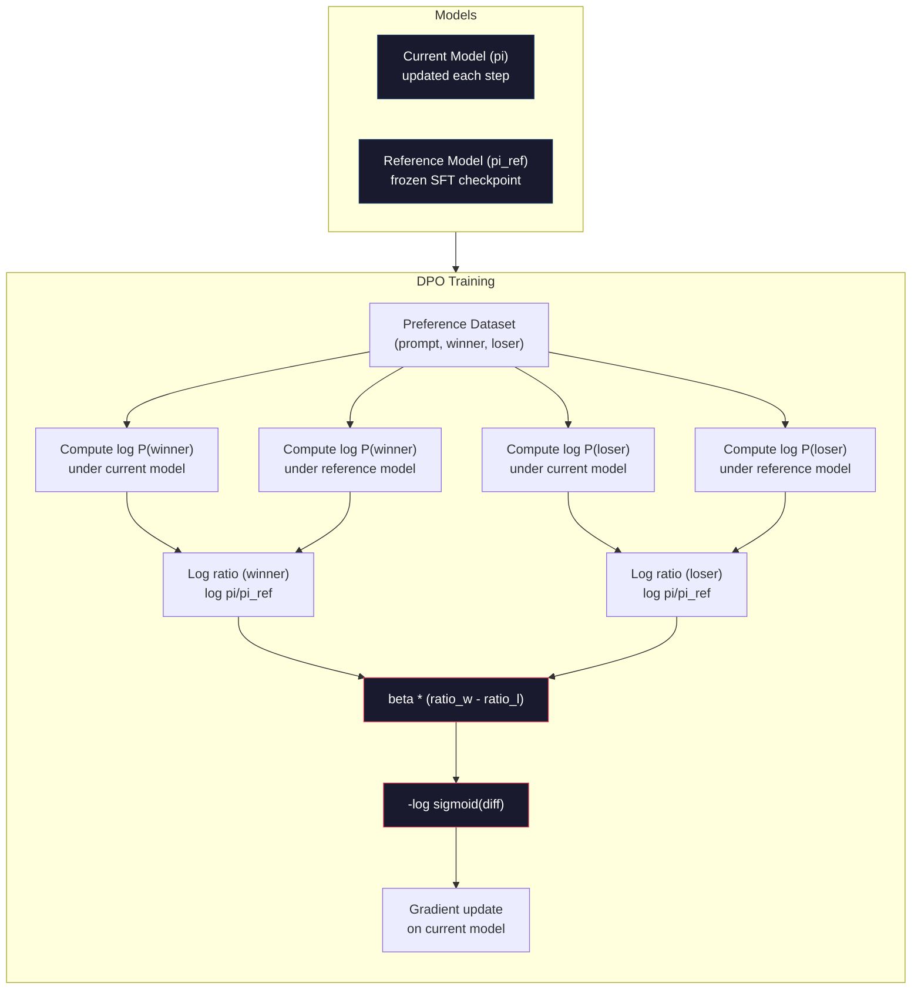

# DPO：直接偏好优化

> 基于人类反馈的强化学习（RLHF）确实有效。但它需要训练三个模型（SFT模型、奖励模型、策略模型），处理PPO的不稳定性，还要调整KL惩罚项。DPO提出：如果能跳过这一切会怎样？DPO直接在偏好对上优化语言模型。无需奖励模型。无需PPO。单次训练循环。同样出色的效果。

**类型：** 构建
**语言：** Python（使用numpy）
**前置要求：** 第10阶段，第07课（RLHF）
**时间：** 约90分钟

## 学习目标

- 实现DPO训练，直接在偏好对上优化语言模型，无需单独的奖励模型
- 推导DPO损失函数，并解释它如何通过策略的对数概率隐式表示奖励模型
- 从训练稳定性、计算成本和所需模型数量等方面比较DPO与RLHF
- 调整beta参数以控制训练策略偏离参考模型的程度

## 问题背景

你在第07课中构建了一个RLHF流程。三个阶段。三个模型。SFT模型、奖励模型，以及用PPO优化的策略模型。仅奖励模型就需要数千个人类偏好对和一个单独的训练循环。PPO则需要精心调整KL系数、学习率、裁剪比例和训练轮数。

在实践中，PPO训练以不稳定著称。微小的超参数变化就会导致训练发散。奖励模型是对人类偏好的不完美近似，而策略模型会找到利用其弱点的方法。KL惩罚有所帮助，但需要单独调整——太低会导致奖励滥用，太高则模型几乎学不到东西。

正是由于这种复杂性，自InstructGPT发布后的数年里，大多数开源模型在RLHF方面举步维艰。这个三阶段流程很脆弱。每个阶段都有其故障模式，错误会累积放大。

2023年5月，斯坦福大学的Rafael Rafailov、Archit Sharma及其同事发表了《直接偏好优化：你的语言模型本质上就是一个奖励模型》。关键见解在于：你不需要单独的奖励模型。最优奖励函数在数学上由语言模型自身的token概率决定。你可以完全跳过奖励模型，直接在偏好对上优化语言模型。

DPO将RLHF简化为一个监督学习步骤。一个模型。一个损失函数。一个训练循环。无需强化学习。Zephyr-7B是首批大规模使用DPO的模型之一，它在多个基准测试上匹配甚至超越了使用完整RLHF训练的模型。Meta在Llama 3的对齐流程中使用了DPO。Anthropic在其对齐研究中也引用了DPO类方法。

## 核心概念

### 关键见解

RLHF优化以下目标：

```
maximize: E[R(x, y)] - beta * KL(pi || pi_ref)
```

其中R是奖励模型，π是策略模型，π_ref是参考模型，beta是KL系数。

DPO论文表明，该目标具有闭式最优解。对于任何奖励函数R，最优策略为：

```
pi*(y | x) = pi_ref(y | x) * exp(R(x, y) / beta) / Z(x)
```

其中Z(x)是归一化常数。重新整理可得：

```
R(x, y) = beta * log(pi*(y | x) / pi_ref(y | x)) + beta * log Z(x)
```

这是突破点。奖励完全用策略模型和参考模型的概率表示。你不需要训练单独的奖励模型。奖励是*隐含*在概率比中的。

将其代入Bradley-Terry偏好模型：

```
P(y_w > y_l | x) = sigmoid(R(x, y_w) - R(x, y_l))
                  = sigmoid(beta * (log pi(y_w|x)/pi_ref(y_w|x) - log pi(y_l|x)/pi_ref(y_l|x)))
```

由于两个响应都以相同的提示x为条件，Z(x)项相互抵消。剩下的仅是策略模型和参考模型在优选响应和拒绝响应上的对数概率的函数。

### DPO损失函数

```
L_DPO = -log(sigmoid(beta * (log pi(y_w|x)/pi_ref(y_w|x) - log pi(y_l|x)/pi_ref(y_l|x))))
```

我们来解析每个部分：

- **y_w** = 优选（获胜）响应
- **y_l** = 被拒绝（失败）响应
- **x** = 提示
- **π** = 当前模型（正在训练）
- **π_ref** = 参考模型（冻结的SFT检查点）
- **beta** = 控制偏离参考模型程度的温度参数（通常为0.1到0.5）

比率 `log pi(y|x) / pi_ref(y|x)` 是对数概率比。当该比率为正时，当前模型给响应y分配的概率高于参考模型。为负时，则低于参考模型。

DPO损失推动模型增加优选响应的对数概率比，并降低被拒绝响应的对数概率比。beta参数控制模型偏离参考模型的激进程度——小的beta允许较大偏离，大的beta使模型保持接近参考模型。



### 为什么DPO更简单

| 方面 | RLHF (PPO) | DPO |
|--------|-----------|-----|
| 需训练模型数 | 3个 (SFT + 奖励模型 + 策略模型) | 1个 (仅策略模型) |
| 训练循环数 | 3个 (SFT, 奖励模型训练, PPO) | 2个 (SFT, DPO) |
| 超参数 | 学习率, KL系数, 裁剪比例, 奖励模型学习率, 各阶段轮数 | 学习率, beta, 训练轮数 |
| 奖励模型 | 需要 (单独训练) | 隐含于模型概率中 |
| 强化学习算法 | PPO (复杂, 不稳定) | 监督学习 (稳定) |
| GPU内存 | PPO期间需3-4个模型在内存中 | 2个模型 (当前模型 + 参考模型) |
| 训练稳定性 | 对超参数敏感 | 鲁棒，类似SFT |

DPO在训练期间需要两个模型在内存中——当前模型和冻结的参考模型。RLHF需要三个或四个：策略模型、参考模型、奖励模型，以及可选的价值函数基线。对于70B模型，每个副本在FP16下占140GB。消除奖励模型带来的内存节省是巨大的。

### DPO优于RLHF的场景

**小数据集。** 使用5,000-20,000个偏好对时，DPO通常能匹配或超越RLHF。RLHF中的奖励模型需要足够数据来泛化——数据有限时，它会过拟合并产生不可靠的奖励信号。DPO通过完全不需要奖励模型来规避这个问题。

**计算资源有限。** DPO所需的计算量大约是完整RLHF的三分之一（一个训练循环而非三个）。对于没有大型GPU集群的团队来说，这是更实际的选择。

**快速迭代。** 想尝试10个不同的偏好数据集以找到最佳模型？DPO让你可以在几小时内运行每个实验。RLHF则需要为每个数据集重新训练奖励模型。

### RLHF优于DPO的场景

**大规模训练。** 在GPT-4或Claude的规模下，RLHF独立的奖励模型可以捕获更细微的偏好信号。奖励模型充当一个学习到的损失函数，能够适应复杂质量标准。

**复杂的奖励信号。** 当"更好"涉及多个维度（有帮助、无害、诚实）时，奖励模型可以学习这种多目标权衡。DPO将每个偏好对视为二元信号——一个更好，一个更差——而不建模原因。

**迭代对齐。** RLHF流程可以生成当前策略的新响应，让人来评分，并在在线循环中重新训练奖励模型。DPO基于固定的偏好对数据集工作。Constitutional AI（Anthropic的方法）大量利用了RLHF的这种迭代特性。

### DPO之外：KTO, ORPO, SimPO

DPO启发了一系列简化的对齐方法。

**KTO（Kahneman-Tversky优化，2024）：** 你甚至不需要成对数据。KTO使用非配对反馈——只需将每个响应标记为"好"或"坏"，而无需与另一个响应比较。这极大地简化了数据收集。不是给标注者看两个响应并问"哪个更好？"，而是展示一个响应并问"这个好吗？"。损失函数应用了前景理论中的损失厌恶：对坏响应的惩罚比对好响应的奖励更重。

**ORPO（优势比偏好优化，2024）：** 在单一步骤中组合SFT和对齐。不再先SFT再DPO，而是修改SFT损失以包含偏好信号。该损失有两个部分：对优选响应的标准下一token预测损失，加上一个优势比项，该项增大优选响应与拒绝响应概率之间的差距。一个训练循环而非两个。

**SimPO（简单偏好优化，2024）：** 完全消除了参考模型。不再计算相对于冻结参考模型的对数概率比，而是使用响应的平均对数概率（按长度归一化）作为隐式奖励。这节省了内存（无需参考模型）并简化了训练。长度归一化防止模型偏爱较短的响应。

| 方法 | 年份 | 内存中模型数 | 需要成对数据？ | 需要参考模型？ | 训练循环数 |
|--------|------|-----------------|-------------|-----------------|----------------|
| RLHF | 2022 | 3-4 | 是 (用于奖励模型) | 是 | 3 |
| DPO | 2023 | 2 | 是 | 是 | 2 |
| KTO | 2024 | 2 | 否 (非配对) | 是 | 2 |
| ORPO | 2024 | 1 | 是 | 否 | 1 |
| SimPO | 2024 | 1 | 是 | 否 | 1 |

趋势很明显：每种方法都消除了另一层复杂性。RLHF需要奖励模型和PPO。DPO消除了两者。KTO消除了成对数据。ORPO消除了单独的SFT阶段。SimPO消除了参考模型。对齐税——从基础模型到对齐模型所需的计算和复杂性成本——在持续下降。

### 实际DPO部署案例

**Zephyr-7B（HuggingFace, 2023年10月）：** 基于Mistral 7B基础模型，在UltraChat（20万样本）上进行SFT，然后在UltraFeedback（6万偏好对）上进行DPO。在MT-Bench上得分为6.47——当时最高的7B模型。作为对比，Llama 2 Chat 70B得分为6.86，意味着Zephyr仅使用DPO对齐，其性能就达到了10倍大小模型的94%。

**Llama 3（Meta, 2024年4月）：** 在初始RLHF阶段之后使用了DPO。这种组合表明DPO和RLHF可以互补——RLHF用于广泛对齐，DPO用于针对性优化。

**Neural Magic / nm-chat (2024)：** 将DPO应用于多个开源模型，在对齐基准测试中相比仅SFT的基线持续显示出5-15%的提升。

## 动手构建

### 步骤1：偏好数据集

格式与RLHF相同——（提示，优选响应，拒绝响应）三元组。DPO直接消费此数据，无需中间奖励模型。

```python
import numpy as np
import sys
import os
sys.path.insert(0, os.path.join(os.path.dirname(__file__), "..", "..", "04-pre-training-mini-gpt", "code"))
from main import MiniGPT, LayerNorm, Embedding, TransformerBlock

PREFERENCE_DATA = [
    {
        "prompt": "What is the capital of France?",
        "preferred": "The capital of France is Paris.",
        "rejected": "France is a country in Europe. It has many cities. The capital is Paris. Paris is known for the Eiffel Tower.",
    },
    {
        "prompt": "Explain gravity in one sentence.",
        "preferred": "Gravity is the force that attracts objects with mass toward each other.",
        "rejected": "Gravity is something that makes things fall down when you drop them.",
    },
    {
        "prompt": "What is 15 times 7?",
        "preferred": "15 times 7 is 105.",
        "rejected": "Let me think about this. 15 times 7. Well, 10 times 7 is 70, and 5 times 7 is 35, so the answer might be around 105.",
    },
    {
        "prompt": "Name three programming languages.",
        "preferred": "Python, Rust, and TypeScript.",
        "rejected": "There are many programming languages. Some popular ones include various languages like Python and others.",
    },
    {
        "prompt": "What year did World War II end?",
        "preferred": "World War II ended in 1945.",
        "rejected": "World War II was a major global conflict. It involved many countries. The war ended in the mid-1940s, specifically in 1945.",
    },
    {
        "prompt": "Define machine learning.",
        "preferred": "Machine learning is a field where algorithms learn patterns from data to make predictions without being explicitly programmed.",
        "rejected": "Machine learning is a type of AI. AI stands for artificial intelligence. Machine learning uses data to learn.",
    },
]
```

### 步骤2：序列对数概率

DPO损失需要计算给定提示下响应的总对数概率。这意味着在完整（提示+响应）序列上运行模型，并对每个响应token的对数概率求和。

```python
def tokenize_sequence(text, vocab_size=256):
    return [min(t, vocab_size - 1) for t in list(text.encode("utf-8"))]


def compute_sequence_log_prob(model, prompt_tokens, response_tokens, max_seq_len=128):
    full_sequence = prompt_tokens + response_tokens
    if len(full_sequence) > max_seq_len:
        full_sequence = full_sequence[:max_seq_len]

    if len(full_sequence) < 2:
        return 0.0

    input_ids = np.array(full_sequence[:-1]).reshape(1, -1)
    target_ids = np.array(full_sequence[1:])

    logits = model.forward(input_ids)
    logits = logits[0]

    max_logits = logits.max(axis=-1, keepdims=True)
    log_probs = logits - max_logits - np.log(
        np.exp(logits - max_logits).sum(axis=-1, keepdims=True)
    )

    prompt_len = len(prompt_tokens)
    response_start = max(0, prompt_len - 1)
    response_end = len(target_ids)

    if response_start >= response_end:
        return 0.0

    response_log_probs = log_probs[response_start:response_end, :]
    response_targets = target_ids[response_start:response_end]

    total_log_prob = 0.0
    for i, target in enumerate(response_targets):
        total_log_prob += response_log_probs[i, target]

    return total_log_prob
```

这个函数是DPO的主力。对于每个偏好对，它运行四次：模型对优选响应、模型对拒绝响应、参考模型对优选响应、参考模型对拒绝响应。每个训练样本需要4次前向传播，而RLHF需要生成+奖励评分+价值估计+PPO更新。更简单、更快、更稳定。

### 步骤3：DPO损失函数

论文核心的代码实现。一个函数。一个损失。无需奖励模型。

```python
def sigmoid(x):
    return np.where(
        x >= 0,
        1.0 / (1.0 + np.exp(-x)),
        np.exp(x) / (1.0 + np.exp(x))
    )


def dpo_loss(policy_logprob_preferred, policy_logprob_rejected,
             ref_logprob_preferred, ref_logprob_rejected, beta=0.1):
    preferred_ratio = policy_logprob_preferred - ref_logprob_preferred
    rejected_ratio = policy_logprob_rejected - ref_logprob_rejected

    logit = beta * (preferred_ratio - rejected_ratio)

    loss = -np.log(sigmoid(logit) + 1e-8)

    preferred_reward = beta * preferred_ratio
    rejected_reward = beta * rejected_ratio

    return loss, {
        "preferred_ratio": float(preferred_ratio),
        "rejected_ratio": float(rejected_ratio),
        "logit": float(logit),
        "implicit_preferred_reward": float(preferred_reward),
        "implicit_rejected_reward": float(rejected_reward),
        "reward_margin": float(preferred_reward - rejected_reward),
    }
```

`preferred_ratio` 和 `rejected_ratio` 是来自DPO推导的对数概率比。当当前模型（相对于参考模型）给优选响应分配更高概率，给拒绝响应分配更低概率时，逻辑值（logit）为正，损失较低。训练信号正是将模型推向这个方向。

`implicit_preferred_reward` 和 `implicit_rejected_reward` 是DPO损失隐式分配的奖励。你可以提取它们来验证训练是否有效——优选响应与拒绝响应之间的奖励差值应随着训练而增加。

### 步骤4：DPO训练循环

标准的监督学习训练循环。没有PPO。没有奖励模型。只有前向传播和梯度更新。

```python
def copy_model_weights(source, target):
    target.embedding.token_embed = source.embedding.token_embed.copy()
    target.embedding.pos_embed = source.embedding.pos_embed.copy()
    target.ln_f.gamma = source.ln_f.gamma.copy()
    target.ln_f.beta = source.ln_f.beta.copy()
    for s_block, t_block in zip(source.blocks, target.blocks):
        t_block.attn.W_q = s_block.attn.W_q.copy()
        t_block.attn.W_k = s_block.attn.W_k.copy()
        t_block.attn.W_v = s_block.attn.W_v.copy()
        t_block.attn.W_out = s_block.attn.W_out.copy()
        t_block.ffn.W1 = s_block.ffn.W1.copy()
        t_block.ffn.W2 = s_block.ffn.W2.copy()
        t_block.ffn.b1 = s_block.ffn.b1.copy()
        t_block.ffn.b2 = s_block.ffn.b2.copy()
        t_block.ln1.gamma = s_block.ln1.gamma.copy()
        t_block.ln1.beta = s_block.ln1.beta.copy()
        t_block.ln2.gamma = s_block.ln2.gamma.copy()
        t_block.ln2.beta = s_block.ln2.beta.copy()


def dpo_train(policy_model, reference_model, preference_data,
              num_epochs=5, lr=5e-6, beta=0.1, max_seq_len=128):
    print(f"DPO Training: {len(preference_data)} pairs, {num_epochs} epochs, "
          f"lr={lr}, beta={beta}")
    print()

    losses = []
    margins = []

    for epoch in range(num_epochs):
        epoch_loss = 0.0
        epoch_margin = 0.0
        num_examples = 0

        indices = np.random.permutation(len(preference_data))

        for idx in indices:
            pair = preference_data[idx]

            prompt_tokens = tokenize_sequence(pair["prompt"])
            preferred_tokens = tokenize_sequence(pair["preferred"])
            rejected_tokens = tokenize_sequence(pair["rejected"])

            pi_logprob_w = compute_sequence_log_prob(
                policy_model, prompt_tokens, preferred_tokens, max_seq_len
            )
            pi_logprob_l = compute_sequence_log_prob(
                policy_model, prompt_tokens, rejected_tokens, max_seq_len
            )
            ref_logprob_w = compute_sequence_log_prob(
                reference_model, prompt_tokens, preferred_tokens, max_seq_len
            )
            ref_logprob_l = compute_sequence_log_prob(
                reference_model, prompt_tokens, rejected_tokens, max_seq_len
            )

            loss, metrics = dpo_loss(
                pi_logprob_w, pi_logprob_l,
                ref_logprob_w, ref_logprob_l, beta
            )

            update_direction = 1.0 if metrics["logit"] < 0 else -0.1
            for block in policy_model.blocks:
                block.ffn.W1 += lr * update_direction * np.random.randn(*block.ffn.W1.shape) * 0.01
                block.ffn.W2 += lr * update_direction * np.random.randn(*block.ffn.W2.shape) * 0.01

            epoch_loss += loss
            epoch_margin += metrics["reward_margin"]
            num_examples += 1
            losses.append(float(loss))
            margins.append(metrics["reward_margin"])

        avg_loss = epoch_loss / max(num_examples, 1)
        avg_margin = epoch_margin / max(num_examples, 1)

        print(f"  Epoch {epoch + 1}/{num_epochs} | Loss: {avg_loss:.4f} | "
              f"Avg Margin: {avg_margin:.4f}")

    return policy_model, losses, margins
```

与RLHF相比，训练循环简洁得令人振奋。对于每个偏好对：计算四个对数概率（两个模型，两个响应），代入DPO损失，计算梯度，更新策略。没有生成步骤。没有奖励模型推理。没有优势估计。没有裁剪。

### 步骤5：比较DPO与RLHF

通过测量隐式奖励差和对数概率变化，将DPO与第07课的RLHF模型进行比较。

```python
def evaluate_preference_accuracy(model, reference_model, preference_data, beta=0.1, max_seq_len=128):
    correct = 0
    total = 0

    for pair in preference_data:
        prompt_tokens = tokenize_sequence(pair["prompt"])
        preferred_tokens = tokenize_sequence(pair["preferred"])
        rejected_tokens = tokenize_sequence(pair["rejected"])

        pi_w = compute_sequence_log_prob(model, prompt_tokens, preferred_tokens, max_seq_len)
        pi_l = compute_sequence_log_prob(model, prompt_tokens, rejected_tokens, max_seq_len)
        ref_w = compute_sequence_log_prob(reference_model, prompt_tokens, preferred_tokens, max_seq_len)
        ref_l = compute_sequence_log_prob(reference_model, prompt_tokens, rejected_tokens, max_seq_len)

        preferred_reward = beta * (pi_w - ref_w)
        rejected_reward = beta * (pi_l - ref_l)

        if preferred_reward > rejected_reward:
            correct += 1
        total += 1

    return correct / max(total, 1)


def analyze_implicit_rewards(model, reference_model, preference_data, beta=0.1, max_seq_len=128):
    print("Implicit Reward Analysis:")
    print("-" * 65)
    print(f"  {'Prompt':<30} {'Pref Reward':>12} {'Rej Reward':>12} {'Margin':>10}")
    print("  " + "-" * 60)

    for pair in preference_data:
        prompt_tokens = tokenize_sequence(pair["prompt"])
        preferred_tokens = tokenize_sequence(pair["preferred"])
        rejected_tokens = tokenize_sequence(pair["rejected"])

        pi_w = compute_sequence_log_prob(model, prompt_tokens, preferred_tokens, max_seq_len)
        pi_l = compute_sequence_log_prob(model, prompt_tokens, rejected_tokens, max_seq_len)
        ref_w = compute_sequence_log_prob(reference_model, prompt_tokens, preferred_tokens, max_seq_len)
        ref_l = compute_sequence_log_prob(reference_model, prompt_tokens, rejected_tokens, max_seq_len)

        pref_reward = beta * (pi_w - ref_w)
        rej_reward = beta * (pi_l - ref_l)
        margin = pref_reward - rej_reward

        truncated = pair["prompt"][:28] + ".." if len(pair["prompt"]) > 30 else pair["prompt"]
        print(f"  {truncated:<30} {pref_reward:>12.4f} {rej_reward:>12.4f} {margin:>10.4f}")

    print()
```

### 步骤6：Beta敏感性分析

Beta参数是DPO中RLHF里KL系数的等价物。它控制模型可以偏离参考模型的程度。本实验展示其效果。

```python
def beta_sensitivity_analysis(sft_model, preference_data, betas, max_seq_len=128):
    print("Beta Sensitivity Analysis")
    print("-" * 60)
    print(f"  {'Beta':>8} {'Final Loss':>12} {'Final Margin':>14} {'Accuracy':>10}")
    print("  " + "-" * 55)

    results = []

    for beta in betas:
        policy = MiniGPT(
            vocab_size=256, embed_dim=128, num_heads=4,
            num_layers=4, max_seq_len=max_seq_len, ff_dim=512
        )
        reference = MiniGPT(
            vocab_size=256, embed_dim=128, num_heads=4,
            num_layers=4, max_seq_len=max_seq_len, ff_dim=512
        )
        copy_model_weights(sft_model, policy)
        copy_model_weights(sft_model, reference)

        policy, losses, margins_list = dpo_train(
            policy, reference, preference_data,
            num_epochs=3, lr=5e-6, beta=beta, max_seq_len=max_seq_len
        )

        accuracy = evaluate_preference_accuracy(
            policy, reference, preference_data, beta, max_seq_len
        )

        final_loss = losses[-1] if losses else 0
        final_margin = margins_list[-1] if margins_list else 0

        print(f"  {beta:>8.3f} {final_loss:>12.4f} {final_margin:>14.4f} {accuracy:>10.1%}")
        results.append({
            "beta": beta,
            "final_loss": final_loss,
            "final_margin": final_margin,
            "accuracy": accuracy,
        })

        print()

    return results
```

小的beta（0.01）让模型自由偏离参考模型——学习速度快，但有退化风险。大的beta（1.0）使模型保持接近参考模型——稳定但学习慢。大多数应用的最佳范围是0.1到0.3。

## 使用它

### 完整DPO流程演示

```python
if __name__ == "__main__":
    np.random.seed(42)

    print("=" * 70)
    print("DPO: DIRECT PREFERENCE OPTIMIZATION")
    print("=" * 70)
    print()

    print("STEP 1: Initialize SFT Model (from Lesson 06)")
    print("-" * 50)
    sft_model = MiniGPT(
        vocab_size=256, embed_dim=128, num_heads=4,
        num_layers=4, max_seq_len=128, ff_dim=512
    )
    print(f"  Parameters: {sft_model.count_parameters():,}")
    print()

    print("STEP 2: DPO Training")
    print("-" * 50)

    policy_model = MiniGPT(
        vocab_size=256, embed_dim=128, num_heads=4,
        num_layers=4, max_seq_len=128, ff_dim=512
    )
    reference_model = MiniGPT(
        vocab_size=256, embed_dim=128, num_heads=4,
        num_layers=4, max_seq_len=128, ff_dim=512
    )
    copy_model_weights(sft_model, policy_model)
    copy_model_weights(sft_model, reference_model)

    policy_model, losses, margins = dpo_train(
        policy_model, reference_model, PREFERENCE_DATA,
        num_epochs=5, lr=5e-6, beta=0.1
    )
    print()

    print("=" * 70)
    print("STEP 3: Evaluate")
    print("=" * 70)
    print()

    pre_accuracy = evaluate_preference_accuracy(
        sft_model, reference_model, PREFERENCE_DATA, beta=0.1
    )
    post_accuracy = evaluate_preference_accuracy(
        policy_model, reference_model, PREFERENCE_DATA, beta=0.1
    )

    print(f"  Preference accuracy (pre-DPO):  {pre_accuracy:.1%}")
    print(f"  Preference accuracy (post-DPO): {post_accuracy:.1%}")
    print()

    analyze_implicit_rewards(policy_model, reference_model, PREFERENCE_DATA, beta=0.1)

    print("=" * 70)
    print("STEP 4: Training Dynamics")
    print("=" * 70)
    print()

    if losses:
        print("  Loss curve:")
        window = max(1, len(losses) // 5)
        for i in range(0, len(losses), window):
            chunk = losses[i:i + window]
            avg = sum(chunk) / len(chunk)
            print(f"    Steps {i:3d}-{i + len(chunk) - 1:3d}: loss = {avg:.4f}")
        print()

    if margins:
        print("  Reward margin curve:")
        window = max(1, len(margins) // 5)
        for i in range(0, len(margins), window):
            chunk = margins[i:i + window]
            avg = sum(chunk) / len(chunk)
            print(f"    Steps {i:3d}-{i + len(chunk) - 1:3d}: margin = {avg:.4f}")
        print()

    print("=" * 70)
    print("STEP 5: Beta Sensitivity")
    print("=" * 70)
    print()

    beta_results = beta_sensitivity_analysis(
        sft_model, PREFERENCE_DATA, betas=[0.01, 0.1, 0.3, 1.0]
    )

    print("=" * 70)
    print("DPO vs RLHF COMPARISON")
    print("=" * 70)
    print()
    print("  DPO advantages:")
    print("    - 1 training loop (vs 3 for RLHF)")
    print("    - 2 models in memory (vs 3-4 for RLHF)")
    print("    - Supervised learning (vs RL, more stable)")
    print("    - No reward model to train or maintain")
    print()
    print("  RLHF advantages:")
    print("    - Separate reward model captures complex preferences")
    print("    - Online learning: generate, rate, retrain")
    print("    - Better for multi-objective alignment")
    print("    - Proven at largest scales (GPT-4, Claude)")
    print()
    print("  Practical guidance:")
    print("    - Start with DPO. It's simpler and often sufficient.")
    print("    - Switch to RLHF if DPO plateaus on your eval metrics.")
    print("    - Many production systems use both: RLHF first, DPO to refine.")
```

## 交付产出

本课程产出 `outputs/prompt-alignment-method-selector.md` —— 一个帮助你根据用例选择正确对齐方法（SFT, RLHF, DPO, KTO, ORPO, SimPO）的提示。根据你的数据可用性、计算预算和对齐目标，它会推荐一种方法和训练计划。

## 练习

1.  实现KTO（Kahneman-Tversky优化）。KTO不需要成对数据——只需将每个响应标记为"好"或"坏"。好响应的损失是 `-log(sigmoid(beta * log_ratio))`，坏响应的损失是 `-log(1 - sigmoid(beta * log_ratio))`，并对坏响应损失应用一个损失厌恶乘数（通常为1.5倍）。在相同数据上训练（将优选响应独立视为"好"，拒绝响应独立视为"坏"），并与DPO的准确率进行比较。

2.  实现长度归一化DPO。不用原始对数概率，而是除以响应token的数量：`normalized_logprob = total_logprob / num_tokens`。这可以防止模型偏爱较短响应（它们的总对数概率更高）。比较有归一化和无归一化时的隐式奖励差。

3.  构建ORPO风格的组合损失。在DPO损失上增加对优选响应的标准下一token预测损失：`L = L_sft(preferred) + alpha * L_dpo`。尝试alpha值为0.1、0.5和1.0。组合损失应产生一个既遵循指令（来自SFT项）又偏好更好响应（来自DPO项）的模型，从而消除单独SFT阶段的需求。

4.  实现迭代DPO。运行DPO 3个epoch，然后从训练好的模型生成新响应，将其与原始优选响应配对作为新的偏好对，然后再次运行DPO。进行两轮这样的"自我对弈"过程。比较第一轮和第二轮后的偏好准确率，看看迭代优化是否有帮助。

5.  使用不同参考模型比较DPO。不使用SFT检查点作为参考，而是尝试：(a) 基础模型（SFT前），(b) DPO第1个epoch的检查点，(c) 策略模型的指数移动平均。报告哪种参考模型产生最高的偏好准确率和最稳定的训练曲线。

## 关键术语

| 术语 | 常见说法 | 实际含义 |
|------|----------------|----------------------|
| DPO | "无RL的RLHF" | 直接偏好优化：一种监督学习算法，直接在偏好对上优化语言模型，绕过奖励模型和PPO |
| 隐式奖励 | "奖励在模型里" | 奖励函数由策略模型与参考模型的对数概率比决定——无需单独的奖励模型 |
| Beta (DPO) | "温度" | 控制策略模型可以偏离参考模型的程度——小的beta允许大的偏离，大的beta使模型保持接近 |
| 对数概率比 | "模型变化了多少" | log π(y\|x) - log π_ref(y\|x) —— 为正表示当前模型分配的概率高于参考模型 |
| 参考模型 | "冻结的检查点" | SFT模型的一个副本，其权重永不变化——作为计算概率比的锚点 |
| KTO | "无成对数据的DPO" | Kahneman-Tversky优化：使用非配对的"好"或"坏"标签，而非要求偏好对 |
| ORPO | "一步对齐" | 优势比偏好优化：通过在SFT损失中增加一个偏好项，将SFT和对齐组合到一个训练循环中 |
| SimPO | "无需参考模型" | 简单偏好优化：通过使用长度归一化的平均对数概率作为隐式奖励来消除参考模型 |
| 对齐税 | "让模型安全的成本" | 从基础模型到对齐模型所需的额外计算、数据和复杂性——DPO显著降低了这一点 |

## 延伸阅读

- [Rafailov 等人, 2023 -- "Direct Preference Optimization: Your Language Model is Secretly a Reward Model"](https://arxiv.org/abs/2305.18290) -- 将对齐从RLHF简化为监督学习的DPO论文
- [Tunstall 等人, 2023 -- "Zephyr: Direct Distillation of LM Alignment"](https://arxiv.org/abs/2310.16944) -- Zephyr-7B，展示在UltraFeedback上的DPO匹配RLHF基准
- [Ethayarajh 等人, 2024 -- "KTO: Model Alignment as Prospect Theoretic Optimization"](https://arxiv.org/abs/2402.01306) -- 消除对成对偏好的需求
- [Hong 等人, 2024 -- "ORPO: Monolithic Preference Optimization without Reference Model"](https://arxiv.org/abs/2403.07691) -- 在一步中组合SFT和对齐
- [Meng 等人, 2024 -- "SimPO: Simple Preference Optimization with a Reference-Free Reward"](https://arxiv.org/abs/2405.14734) -- 完全消除参考模型
- [Llama 3 技术报告](https://arxiv.org/abs/2407.21783) -- Meta组合RLHF和DPO的对齐流程