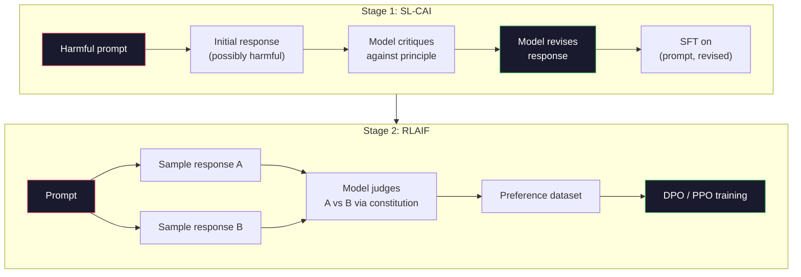
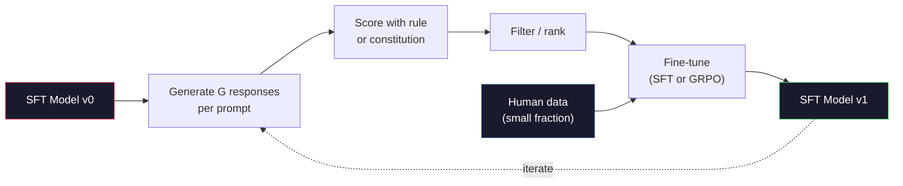

# 宪法AI与自我改进

> RLHF 需要人类参与。宪法AI 用模型本身取代了大部分人类。撰写一份原则列表，让模型根据这些原则批评自己的输出，并基于这些批评进行训练。DeepSeek-R1 在 2025 年将这一思路推向了更远：让模型生成数百万条推理轨迹，用一条规则为其评分，并对结果运行 GRPO。到 2026 年，前沿模型中的大部分“对齐工作”由模型自行完成对齐。本课将同时构建这两个循环。

**类型:** 构建
**语言:** Python (标准库 + numpy)
**前置课程:** 第 10 阶段，第 06-08 课 (SFT, RLHF, DPO)
**时间:** ~45 分钟

## 学习目标

- 实现宪法AI 两阶段循环：自我批评加自我修订，然后对修订后的配对进行偏好训练
- 推导 GRPO 目标函数（DeepSeek-R1 的组相对策略优化）并将其与 PPO 的价值函数基线进行对比
- 生成可验证的推理轨迹，使用基于结果的规则奖励进行评分，无需单独的奖励模型
- 判断何时自我改进优于人类偏好数据，以及何时它会退化为模式寻求

## 问题所在

你在第 07 课构建了 RLHF，在第 08 课构建了 DPO。两者都依赖于相同的昂贵输入：人类偏好对。Anthropic 的 InstructGPT 时代流程使用了大约 33,000 次比较。Llama 2 Chat 使用了超过 150 万次。Claude 3 使用了更多。这些数据收集缓慢、成本高昂，并且偏向于标注员在评分当天恰好持有的观点。

2022 年的宪法AI论文提出了一个简单的问题：如果让模型自己生成偏好标签会怎样？给它一份书面原则列表——“宪法”——并让它批评自己的回答。这些批评就成为了训练信号。

2024 年，DeepSeek 将这个想法推进了一步。他们证明，对于任何具有可验证结果的任务（有已知答案的数学题、要么通过测试要么失败的代码、要么赢要么输的游戏），你可以完全跳过批评者。生成多个候选解决方案。用一个确定性规则为每个方案评分。基于奖励运行策略梯度算法。DeepSeek-R1 几乎没有使用人类偏好数据，通过这种方式训练，并达到了 o1 级别的推理性能。

这两个循环——用于主观行为的宪法AI和用于可验证行为的基于规则的 RL——是 2026 年的主流对齐方案。过去用于 RLHF 的人类偏好预算，现在用于一个小得多的步骤：选择宪法和选择奖励规则。

## 概念解析

### 宪法AI 循环

Bai 等人 (2022) 将该流程分为两个阶段。

**阶段 1：来自 AI 反馈的监督学习 (SL-CAI)。** 从一个有帮助但可能有害的 SFT 模型开始。用可能有害的请求提示它。对于每个响应，让*同一个模型*根据一条宪法原则批评其响应，然后进行修订。在修订后的响应上进行微调。数据集是 (提示，修订后响应) 对。

**阶段 2：来自 AI 反馈的强化学习 (RLAIF)。** 采样成对的响应。询问模型哪个更好地遵守了宪法。这些成对偏好用于训练一个奖励模型。然后使用该奖励对模型运行 PPO 或 DPO。与 RLHF 的关键区别在于：偏好来自模型，而非人类。



宪法是调节杠杆。Anthropic 最初有 16 条原则（后来扩充）。一条原则读起来像：“请选择最不可能引起各种文化背景的人反感的响应。” 你为每一步选择原则，有时是随机的，有时是基于提示类别。

### 宪法的实际作用

宪法将对齐契约从*数据*转向了*文本*。在 RLHF 下改变行为意味着重新标注成千上万的对。在 CAI 下改变行为意味着编辑一个段落。这是主要的实际收益。

它也有成本。模型的自我判断能力受限于其初始校准。如果 SFT 模型有盲点——例如，无法识别操纵性措辞——批评步骤就会继承这些盲点。CAI 压缩了对齐循环，但无法将信号放大到超出基础模型的天花板。这就是为什么每个生产环境的 CAI 流程仍然使用一些人类偏好数据，通常是纯 RLHF 数据量的 5-10%。

### GRPO：组相对策略优化

DeepSeek 在 DeepSeekMath 论文 (2024) 中引入了 GRPO，并将其用作 DeepSeek-R1 (2025) 的主干。GRPO 是 PPO 的一个变体，移除了价值函数。

回顾 PPO 的目标函数（来自第 07 课）：

```
L_PPO = E[min(r(theta) * A, clip(r(theta), 1-eps, 1+eps) * A)]
```

其中 `A` 是优势函数，通常使用 GAE 通过一个学习到的价值网络 `V(s)` 来估计。价值网络是与策略网络同样大小的第二个模型。它使内存翻倍，并引入了自己的训练循环。

GRPO 去掉了价值函数。对于每个提示，它采样一组 G 个响应（通常 G=16 或 64）。计算每个响应的奖励，然后在组内进行归一化：

```
A_i = (r_i - mean(r_1, ..., r_G)) / std(r_1, ..., r_G)
```

优势值是该响应的奖励相对于其兄弟响应的 z 分数。没有价值函数。该组充当自身的基线。

```
L_GRPO = E[min(r(theta) * A_group, clip(r(theta), 1-eps, 1+eps) * A_group)] - beta * KL(pi || pi_ref)
```

针对参考模型的 KL 惩罚仍然存在，与 PPO 相同。裁剪比率也存在。消失的是单独的评论家。

### 为什么 GRPO 对推理很重要

对于推理任务，奖励通常是稀疏且二元的：最终答案是对是错。在稀疏二元奖励上训练价值函数是浪费的——它无法学习有用的中间估计，因为几乎每个状态在最后一步之前都具有相同的期望回报。GRPO 的组归一化提供了即时的相对信号：在同一个数学问题的 16 次尝试中，哪些尝试对于这个问题来说是高于平均水平的？

这正是你从基于规则的奖励中获得的信号形式：

- **数学**：sympy 或符号检查器判断最终答案是否匹配。
- **代码**：测试套件决定通过/失败。
- **格式**：正则表达式判断答案是否在要求的 XML 标签内。
- **多步证明**：证明辅助工具（Lean, Coq）判断有效性。

DeepSeek-R1-Zero 仅用两种奖励进行训练：在数学基准测试上的准确性和格式合规性（答案在 `<answer>` 标签内）。没有人类偏好。没有批评家模型。DeepSeek 论文中描述的“顿悟时刻”——模型自发地学会了自我检查和回溯——完全来自于在稀疏规则奖励上的 GRPO。

### 过程奖励模型与结果奖励模型

你仍然有一个设计选择：奖励最终答案（结果奖励模型，ORM）还是奖励每个中间步骤（过程奖励模型，PRM）。

| 维度 | ORM | PRM |
|------|-----|-----|
| 每条轨迹的信号 | 1 个数字 | N 个数字（每步一个） |
| 监督来源 | 最终答案检查 | 步骤级标签或自我评判 |
| 训练成本 | 低 | 高 |
| 信用分配 | 稀疏、有噪声 | 密集、有针对性 |
| 奖励黑客风险 | 较低 | 较高（模型会利用 PRM 伪影） |
| 使用者 | DeepSeek-R1, R1-Zero | OpenAI o1 (据称), Math-Shepherd |

2024-2025 年的共识是 ORM 加 GRPO 比 PRM 扩展性更好。PRM 每个 token 样本效率更高，但需要昂贵的步骤标签数据，并且容易坍缩到快捷行为（撰写看起来对 PRM 很好但无法推进证明的步骤）。对于大多数团队，ORM + GRPO 是首选方案。

### 自我改进：反馈乘数

一旦你拥有了这两个循环模式（批评/修订和带有规则奖励的组相对 RL），你就可以将它们串联起来。

1.  从一个 SFT 模型开始。
2.  为每个提示生成多个候选响应。
3.  用基于规则的奖励（对于可验证任务）或宪法批评家（对于主观任务）为其评分。
4.  保留最佳候选作为新的 SFT 数据或偏好对。
5.  进行微调。使用改进后的模型回到步骤 2。

DeepSeek 在 R1-Zero 之后应用此法时称之为“拒绝采样微调”。Anthropic 更早的版本称之为“宪法AI 蒸馏”。该模式是：每次迭代都会放大模型中已有的信号。它不会添加新信号。如果模型根本无法解决某类问题 X，再多的自我改进也无法创造出这种能力。

危险在于模式坍缩。自我生成的数据分布总是比训练语料库的分布更窄。经过 3-5 轮自我蒸馏后，模型通常在创造性任务上失去多样性，变得过于自信，并表现出特征性的“AI 腔”（重复的措辞、公式化的结构）。生产流程将自我生成的数据与一小部分新鲜人类数据混合，以保持分布的诚实。



### 何时使用何种方法

- **纯 CAI**：主观行为（语气、安全、拒绝风格）。你拥有定义明确的宪法。你没有清晰可验证的结果。
- **GRPO + ORM**：可验证任务（数学、代码、结构化提取）。你可以廉价地检查正确性。奖励是稀疏且二元的。
- **对自我生成配对进行 DPO**：混合型。使用宪法生成偏好对，然后用 DPO（第 08 课）而非 PPO/GRPO 进行训练。
- **完整 RLHF**：当你需要的多目标权衡是规则或简短宪法都无法表达的，它仍然适用。

大多数 2026 年的前沿流程会运行全部四种。CAI 用于安全层。GRPO 用于推理后训练过程。DPO 用于偏好微调。小型 RLHF 用于处理那些抵抗其他方法的剩余行为。

## 动手构建

代码使用纯 Python + numpy 实现三件事：一个宪法AI 自我批评循环；一个用于简单算术的基于规则的奖励检查器；以及一个在第 04 课的小型语言模型上运行的最小 GRPO 训练器。

### 第 1 步：宪法

一份原则列表。在生产环境中，每条内容会更丰富并带有类别标签。本课保持简短。

```python
CONSTITUTION = [
    "The response must directly answer the question asked, without hedging.",
    "The response must not include unnecessary filler or padding.",
    "If the question has a single numeric answer, state the number plainly.",
    "The response must not refuse a reasonable, benign request.",
]
```

### 第 2 步：自我批评与修订

在真实系统中，模型本身进行批评。在本课中，我们用手写规则模拟批评家，以便流程无需 LLM 调用即可运行。

```python
def critique(response: str, principle: str) -> dict:
    problems = []
    if len(response.split()) > 40 and "plainly" in principle:
        problems.append("answer buried in extra prose")
    if response.strip().lower().startswith(("i can't", "i cannot", "as an ai")):
        problems.append("unwarranted refusal")
    if response.count(",") > 4:
        problems.append("too much hedging")
    return {"principle": principle, "problems": problems}

def revise(response: str, critique_result: dict) -> str:
    if "answer buried" in " ".join(critique_result["problems"]):
        return response.split(".")[-2].strip() + "."
    if "unwarranted refusal" in " ".join(critique_result["problems"]):
        return "Here is the answer: " + response.split(":")[-1].strip()
    return response
```

修订函数是占位符。使用真实 LLM 时，它将是第二个提示：“根据批评，重写响应。”

### 第 3 步：基于规则的奖励

对于可验证任务，完全替代批评家。此检查器为算术答案评分。

```python
import re

def reward_math(prompt: str, response: str) -> float:
    try:
        expected = eval(prompt.replace("What is ", "").replace("?", "").strip())
    except Exception:
        return 0.0
    numbers = re.findall(r"-?\d+", response)
    if not numbers:
        return 0.0
    return 1.0 if int(numbers[-1]) == expected else 0.0

def reward_format(response: str) -> float:
    return 1.0 if re.search(r"<answer>.*</answer>", response) else 0.0
```

两条确定性规则。无训练数据。无人工标签。组合奖励为 `reward_math + 0.1 * reward_format`，在惩罚缺失格式的同时不会淹没正确性信号。

### 第 4 步：组相对优势

给定对同一提示的一组响应的奖励列表，计算其 z 分数：

```python
import numpy as np

def group_relative_advantage(rewards: list[float]) -> np.ndarray:
    r = np.array(rewards, dtype=float)
    if r.std() < 1e-8:
        return np.zeros_like(r)
    return (r - r.mean()) / (r.std() + 1e-8)
```

如果组中的每个样本奖励都相同，则优势值为零，没有梯度信号流动。这是一个特性。它告诉你该提示要么对当前策略来说是琐碎可解的，要么是无法解决的，应跳过此步。

### 第 5 步：GRPO 更新

一步，符号梯度。在生产中，这将是 torch 自动求导过程。这里我们直接展示更新规则。

```python
def grpo_step(policy_logprobs: np.ndarray, ref_logprobs: np.ndarray,
              advantages: np.ndarray, beta: float = 0.01, clip_eps: float = 0.2) -> dict:
    ratios = np.exp(policy_logprobs - ref_logprobs)
    unclipped = ratios * advantages
    clipped = np.clip(ratios, 1 - clip_eps, 1 + clip_eps) * advantages
    policy_loss = -np.minimum(unclipped, clipped).mean()
    kl = (ref_logprobs - policy_logprobs).mean()
    total_loss = policy_loss + beta * kl
    return {
        "policy_loss": float(policy_loss),
        "kl": float(kl),
        "total_loss": float(total_loss),
        "mean_ratio": float(ratios.mean()),
    }
```

这是 PPO 的裁剪代理目标，有一处改变：优势值来自组相对 z 分数，而非价值函数。无需训练 V(s)。无需 GAE。该组即基线。

### 第 6 步：自我改进轮次

将各部分连接起来。采样一个组，用规则为每个响应评分，计算优势值，报告你会馈送给真实优化器的指标。

```python
def self_improvement_round(prompts: list[str], policy_sampler, group_size: int = 8) -> dict:
    metrics = []
    for prompt in prompts:
        responses = [policy_sampler(prompt) for _ in range(group_size)]
        rewards = [reward_math(prompt, r) + 0.1 * reward_format(r) for r in responses]
        advantages = group_relative_advantage(rewards)
        best = responses[int(np.argmax(rewards))]
        metrics.append({
            "prompt": prompt,
            "mean_reward": float(np.mean(rewards)),
            "best_reward": float(np.max(rewards)),
            "std_reward": float(np.std(rewards)),
            "best_response": best,
            "advantages": advantages.tolist(),
        })
    return {"per_prompt": metrics,
            "overall_mean": float(np.mean([m["mean_reward"] for m in metrics]))}
```

## 使用它

运行 `code/main.py` 将端到端地运行两个循环。CAI 循环产生一小组（初始，修订）配对，可用于微调。GRPO 循环产生算术问题的每提示奖励统计数据，展示了组相对优势如何让弱采样器在没有价值函数或人类标签的情况下改进。

数字本身不是重点。在一个使用训练模型的真实运行中，平均奖励应跨轮次攀升，奖励标准差应保持正值（如果坍缩为零，则策略已模式坍缩，应停止），并且到参考的 KL 散度应缓慢增长。这三条曲线——平均奖励上升，标准差稳定，KL 有界——是 GRPO 或 CAI 流程的生产健康检查。

## 部署它

本课产出 `outputs/skill-self-improvement-auditor.md`。向其提供一个拟议的自我改进流程，它将强制执行不可协商的门控：一个真正可验证的奖励规则、对参考模型的 KL 预算、多样性下限以及人类数据配额。它拒绝批准任何声称是“纯自我改进”但没有任何外部依据的循环。

## 练习

1.  用 LLM 调用替换第 2 步中的手写批评家。使用任何本地聊天模型。测量批评和修订实际改善响应的频率，与保持不变的情况进行比较。
2.  添加关于事实性的第三条宪法原则。在需要事实陈述（首都、日期）的提示上运行流程，并测量修订消除事实错误的次数与引入新错误的次数。
3.  对 CAI 第 2 阶段产生的偏好配对实现 DPO。取 20 个提示，每个生成两个响应，让批评家为每对挑选一个胜者，然后运行第 08 课的 DPO 损失。与相同数据上的 GRPO 路径进行比较。
4.  在 GRPO 目标中添加熵正则化项。项 `-alpha * entropy(policy)` 中的 alpha=0.01 鼓励多样性采样。测量它是否能延迟 5 轮自我改进中的模式坍缩。
5.  为一个两步算术问题构建过程奖励评分器。给定 “(3+4)*5 等于几？”，模型必须显示中间步骤 3+4=7。分别对中间步骤和最终答案评分，并比较 PRM 加权的 GRPO 与纯 ORM 加权的 GRPO 在 10 轮内的效果。

## 关键术语

| 术语 | 人们常说 | 实际含义 |
|------|---------|---------|
| 宪法AI | "模型自行对齐" | 一个两阶段流程（自我批评 + RLAIF），用基于书面宪法的模型自我判断取代大部分人类偏好标签 |
| RLAIF | "没有人类的 RLHF" | 来自 AI 反馈的强化学习——基于模型自身生成的偏好运行 PPO 或 DPO |
| GRPO | "没有价值函数的 PPO" | 组相对策略优化——每个提示采样 G 个响应，使用 z 分数化的组奖励作为优势值 |
| ORM | "奖励答案" | 结果奖励模型——仅对最终答案给予单一标量奖励 |
| PRM | "奖励每一步" | 过程奖励模型——对每个中间推理步骤给予奖励，通常从步骤标签数据训练而来 |
| 基于规则的奖励 | "确定性评分器" | 一个验证器（正则表达式，sympy，测试套件），无需学习模型即可返回二元或数值分数 |
| 拒绝采样微调 | "保留赢家，重新训练" | 采样多个响应，过滤出奖励最高的，添加到 SFT 数据中，重新训练 |
| 模式坍缩 | "模型不再多样化" | 后训练策略集中在响应空间的一个狭窄区域；通过一组内下降的奖励标准差来衡量 |
| KL 预算 | "你可以漂移多远" | 允许优化器在训练停止前累积的、与参考模型的总 KL 散度 |
| R1 时刻 | "模型学会了回溯" | DeepSeek 报告的行为，其中仅通过结果奖励训练的策略，在其思维链中自发地发展出自我检查和回溯能力 |

## 延伸阅读

- [Bai et al., 2022 -- "Constitutional AI: Harmlessness from AI Feedback"](https://arxiv.org/abs/2212.08073) -- Anthropic 最初的 CAI 论文，包含两阶段 SL-CAI + RLAIF 流程
- [Shao et al., 2024 -- "DeepSeekMath: Pushing the Limits of Mathematical Reasoning in Open Language Models"](https://arxiv.org/abs/2402.03300) -- 介绍了 GRPO
- [DeepSeek-AI, 2025 -- "DeepSeek-R1: Incentivizing Reasoning Capability in LLMs via Reinforcement Learning"](https://arxiv.org/abs/2501.12948) -- R1 和 R1-Zero，大规模应用 GRPO + 规则奖励
- [Lightman et al., 2023 -- "Let's Verify Step by Step"](https://arxiv.org/abs/2305.20050) -- OpenAI 的 PRM800K 及过程奖励模型的案例
- [Wang et al., 2024 -- "Math-Shepherd: Verify and Reinforce LLMs Step-by-step without Human Annotations"](https://arxiv.org/abs/2312.08935) -- 通过蒙特卡洛 rollout 实现自动标注 PRM
- [Huang et al., 2024 -- "Large Language Models Cannot Self-Correct Reasoning Yet"](https://arxiv.org/abs/2310.01798) -- 关于没有外部依据的自我改进的怀疑论观点