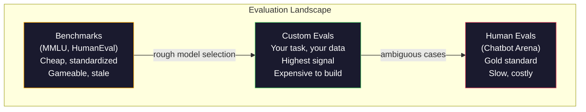
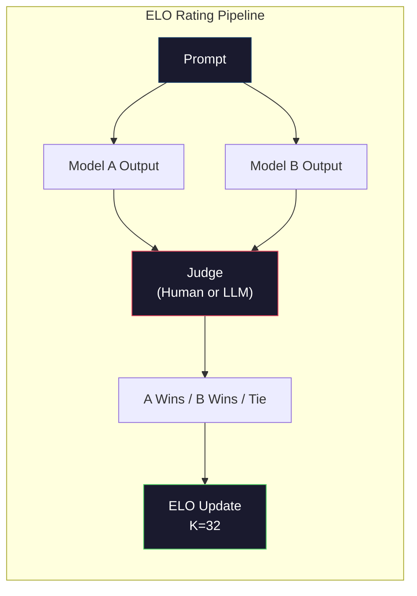

# 评估：基准测试、评估方法与 LM Harness

> 古德哈特定律：当一项指标成为目标时，它就不再是好指标。每个前沿实验室都在游戏化基准测试。MMLU分数在上升，而模型仍然无法可靠地数清"strawberry"中字母R的个数。唯一重要的评估是您自己的评估——针对您的任务、使用您的数据。

**类型：** 构建  
**语言：** Python  
**前置要求：** 第10阶段，第01-05课（从零开始构建LLM）  
**时间：** 约90分钟

## 学习目标

- 构建一个自定义评估工具套件，对语言模型运行多项选择和开放式基准测试
- 解释为何标准基准测试（MMLU、HumanEval）会饱和且无法区分前沿模型
- 使用适当的指标实现任务特定评估：精确匹配、F1、BLEU和LLM-as-judge评分
- 设计针对您具体用例的自定义评估套件，而非仅依赖公开排行榜

## 问题所在

MMLU于2020年发布，包含15,908道问题，涵盖57个学科。三年内，前沿模型已在该基准上达到饱和。GPT-4得分86.4%。Claude 3 Opus得分86.8%。Llama 3 405B得分88.6%。排行榜压缩在一个3分的区间内，其中的差异是统计噪声，而非真正的能力差距。

与此同时，这些模型在10岁孩子不假思索就能完成的任务上失败。Claude 3.5 Sonnet在MMLU上得分88.7%，最初却无法数清"strawberry"中的字母——这项任务不需要任何世界知识或推理能力，只需字符级遍历。HumanEval通过164个问题测试代码生成。模型在该测试上得分超过90%，却仍会生成任何初级开发者都能发现的边缘情况崩溃代码。

基准测试性能与现实世界可靠性之间的差距是LLM评估的核心问题。基准测试告诉你模型在该测试上的表现。它们几乎无法告诉你该模型在您的特定任务、您的特定数据、您的特定故障模式下的表现如何。如果您正在构建客户支持机器人，MMLU无关紧要。如果您正在构建代码助手，HumanEval仅涵盖函数级生成——对于跨文件的调试、重构或代码解释则毫无说明。

您需要自定义评估。并非因为基准测试无用——它们对于粗略选择模型是有用的——而是因为最终评估必须与您的部署条件完全匹配。

## 核心概念

### 评估领域

评估分为三类，每类具有不同的成本和信号质量。

**基准测试**是标准化测试套件。MMLU、HumanEval、SWE-bench、MATH、ARC、HellaSwag。您针对基准测试运行模型并获得分数。优势：每个人使用相同的测试，因此可以比较模型。劣势：模型和训练数据越来越多地污染这些基准。实验室在训练中使用包含基准测试问题的数据。分数上升了。能力可能并未提升。

**自定义评估**是您为特定用例构建的测试套件。您定义输入、预期输出和评分函数。法律文档摘要器在法律文档上进行评估。SQL生成器在您的数据库模式上进行评估。这些创建成本高昂，但它们是唯一能预测生产性能的评估。

**人类评估**使用付费标注员根据有用性、正确性、流畅性和安全性等标准判断模型输出。这是自动化评分失败的开放式任务的黄金标准。Chatbot Arena已收集了100多个模型的200多万人类偏好投票。缺点：成本高（每次判断0.10-2.00美元）且速度慢（需数小时到数天）。



### 基准测试为何失效

三种机制导致基准测试分数不再反映真实能力。

**数据污染。** 训练语料库抓取互联网。基准测试问题存在于互联网上。模型在训练期间看到了答案。这并非传统意义上的作弊——实验室并非有意包含基准测试数据。但网络规模的抓取使得几乎无法排除这些数据。

**应试教育。** 实验室为优化基准测试性能而调整训练混合比例。如果训练混合物的5%是MMLU风格的多项选择题，模型就会学习该格式和答案分布。MMLU是四选一的多项选择题。模型学习到答案分布大致在A/B/C/D之间均匀，即使模型不知道答案，这也有帮助。

**饱和。** 当每个前沿模型在某个基准上得分85-90%时，该基准就停止区分能力。剩下的10-15%的问题可能模糊不清、标签错误或需要冷门领域知识。在MMLU上从87%提高到89%可能意味着模型多记忆了两个冷门问题，而非变得更聪明。

### 困惑度：快速健康检查

困惑度衡量模型对一串token序列的惊讶程度。形式上，它是指数化的平均负对数似然：

```
PPL = exp(-1/N * sum(log P(token_i | context)))
```

困惑度为10意味着模型平均而言，在每个token位置的选择不确定程度相当于从10个选项中均匀选择。越低越好。GPT-2在WikiText-103上的困惑度约为30。GPT-3约为20。Llama 3 8B约为7。

困惑度对于比较相同测试集上的模型很有用，但它存在盲区。一个模型可能通过擅长预测常见模式而获得低困惑度，同时对于罕见但重要的模式表现糟糕。它也无法说明指令遵循、推理或事实准确性。将其作为合理性检查，而非最终判定。

### LLM-as-Judge

使用一个强大的模型来评估较弱模型的输出。想法很简单：要求GPT-4o或Claude Sonnet根据1-5的等级对回答的正确性、有用性和安全性进行评分。使用GPT-4o-mini每次判断成本约为0.01美元，并且与人类判断的相关性出奇地好——在大多数任务上约有80%的一致性。

评分提示比模型更重要。模糊的提示（"对这个回答评分"）会产生噪声评分。带有评分标准的结构化提示（"如果答案事实正确并引用了来源则得5分，正确但未注明来源得4分，部分正确得3分..."）会产生一致、可复现的分数。

故障模式：评判模型表现出位置偏差（在成对比较中偏好第一个回答）、冗长偏好（偏好更长的回答）以及自我偏好（GPT-4对GPT-4输出的评分高于同等质量的Claude输出）。缓解措施：随机化顺序、根据长度标准化、使用不同于被评估模型的评判模型。

### 基于成对比较的ELO评分

Chatbot Arena的方法。向不同模型展示对同一提示的两个回答。人类（或LLM评判）选择更好的一个。从数千次这样的比较中，计算每个模型的ELO评分——与国际象棋使用的系统相同。

ELO优势：相对排名比绝对评分更可靠，能妥善处理平局，并且比独立评分每个输出需要更少的比较次数即可收敛。截至2026年初，Chatbot Arena排名显示GPT-4o、Claude 3.5 Sonnet和Gemini 1.5 Pro在顶端彼此差距在20个ELO点以内。



### 评估框架

**lm-evaluation-harness**（EleutherAI）：标准的开源评估框架。支持200多个基准测试。一条命令即可针对MMLU、HellaSwag、ARC等测试任何Hugging Face模型。被Open LLM排行榜使用。

**RAGAS**：专门为RAG管道设计的评估框架。衡量忠实性（答案是否与检索到的上下文匹配？）、相关性（检索到的上下文与问题相关吗？）和答案正确性。

**promptfoo**：用于提示工程的配置驱动评估。在YAML中定义测试用例，针对多个模型运行，获得通过/失败报告。用于提示的回归测试——确保提示更改不会破坏现有测试用例。

### 构建自定义评估

对生产唯一重要的评估。流程如下：

1. **定义任务。** 模型到底应该做什么？要精确。"回答问题"过于模糊。"给定客户投诉邮件，提取产品名称、问题类别和情绪"是一个可以评估的任务。

2. **创建测试用例。** 原型评估至少50个，生产评估至少200个以上。每个测试用例是一个（输入，预期输出）对。包含边缘情况：空输入、对抗性输入、模糊输入、其他语言的输入。

3. **定义评分。** 结构化输出使用精确匹配。文本相似度使用BLEU/ROUGE。开放式质量使用LLM-as-judge。抽取任务使用F1。使用权重组合多个指标。

4. **自动化。** 每次评估通过一条命令运行。没有手动步骤。以支持随时间比较的格式存储结果。

5. **跟踪趋势。** 单独的评估分数毫无意义。您需要趋势线。分数在上次提示更改后是否提高？更换模型后是否倒退？将您的评估与提示一起进行版本控制。

| 评估类型 | 每次判断成本 | 与人类一致性 | 最适用场景 |
|----------|--------------|--------------|------------|
| 精确匹配 | 约$0 | 100%（适用时） | 结构化输出、分类 |
| BLEU/ROUGE | 约$0 | 约60% | 翻译、摘要 |
| LLM-as-judge | 约$0.01 | 约80% | 开放式生成 |
| 人类评估 | $0.10-$2.00 | 不适用（是黄金标准） | 模糊、高风险任务 |

## 动手构建

### 步骤1：最小评估框架

定义核心抽象概念。一个评估用例包含输入、预期输出和可选的元数据字典。一个评分器接收预测值和参考值，并返回0到1之间的分数。

```python
import json
from collections import Counter

class EvalCase:
    def __init__(self, input_text, expected, metadata=None):
        self.input_text = input_text
        self.expected = expected
        self.metadata = metadata or {}

class EvalSuite:
    def __init__(self, name, cases, scorers):
        self.name = name
        self.cases = cases
        self.scorers = scorers

    def run(self, model_fn):
        results = []
        for case in self.cases:
            prediction = model_fn(case.input_text)
            scores = {}
            for scorer_name, scorer_fn in self.scorers.items():
                scores[scorer_name] = scorer_fn(prediction, case.expected)
            results.append({
                "input": case.input_text,
                "expected": case.expected,
                "prediction": prediction,
                "scores": scores,
            })
        return results
```

### 步骤2：评分函数

构建精确匹配、token F1和一个模拟的LLM-as-judge评分器。

```python
def exact_match(prediction, expected):
    return 1.0 if prediction.strip().lower() == expected.strip().lower() else 0.0

def token_f1(prediction, expected):
    pred_tokens = set(prediction.lower().split())
    exp_tokens = set(expected.lower().split())
    if not pred_tokens or not exp_tokens:
        return 0.0
    common = pred_tokens & exp_tokens
    precision = len(common) / len(pred_tokens)
    recall = len(common) / len(exp_tokens)
    if precision + recall == 0:
        return 0.0
    return 2 * (precision * recall) / (precision + recall)

def llm_judge_simulated(prediction, expected):
    pred_words = set(prediction.lower().split())
    exp_words = set(expected.lower().split())
    if not exp_words:
        return 0.0
    overlap = len(pred_words & exp_words) / len(exp_words)
    length_penalty = min(1.0, len(prediction) / max(len(expected), 1))
    return round(overlap * 0.7 + length_penalty * 0.3, 3)
```

### 步骤3：ELO评分系统

实现带有ELO更新的成对比较。这正是Chatbot Arena用于对模型排名的系统。

```python
class ELOTracker:
    def __init__(self, k=32, initial_rating=1500):
        self.ratings = {}
        self.k = k
        self.initial_rating = initial_rating
        self.history = []

    def _ensure_player(self, name):
        if name not in self.ratings:
            self.ratings[name] = self.initial_rating

    def expected_score(self, rating_a, rating_b):
        return 1 / (1 + 10 ** ((rating_b - rating_a) / 400))

    def record_match(self, player_a, player_b, outcome):
        self._ensure_player(player_a)
        self._ensure_player(player_b)

        ea = self.expected_score(self.ratings[player_a], self.ratings[player_b])
        eb = 1 - ea

        if outcome == "a":
            sa, sb = 1.0, 0.0
        elif outcome == "b":
            sa, sb = 0.0, 1.0
        else:
            sa, sb = 0.5, 0.5

        self.ratings[player_a] += self.k * (sa - ea)
        self.ratings[player_b] += self.k * (sb - eb)

        self.history.append({
            "a": player_a, "b": player_b,
            "outcome": outcome,
            "rating_a": round(self.ratings[player_a], 1),
            "rating_b": round(self.ratings[player_b], 1),
        })

    def leaderboard(self):
        return sorted(self.ratings.items(), key=lambda x: -x[1])
```

### 步骤4：困惑度计算

使用token概率计算困惑度。实际中你会从模型的logits获取这些值。这里我们用概率分布模拟。

```python
import numpy as np

def perplexity(log_probs):
    if not log_probs:
        return float("inf")
    avg_neg_log_prob = -np.mean(log_probs)
    return float(np.exp(avg_neg_log_prob))

def token_log_probs_simulated(text, model_quality=0.8):
    np.random.seed(hash(text) % 2**31)
    tokens = text.split()
    log_probs = []
    for i, token in enumerate(tokens):
        base_prob = model_quality
        if len(token) > 8:
            base_prob *= 0.6
        if i == 0:
            base_prob *= 0.7
        prob = np.clip(base_prob + np.random.normal(0, 0.1), 0.01, 0.99)
        log_probs.append(float(np.log(prob)))
    return log_probs
```

### 步骤5：结果聚合

计算评估运行的汇总统计：均值、中位数、在某个阈值下的通过率，以及按指标细分的统计。

```python
def summarize_results(results, threshold=0.8):
    all_scores = {}
    for r in results:
        for metric, score in r["scores"].items():
            all_scores.setdefault(metric, []).append(score)

    summary = {}
    for metric, scores in all_scores.items():
        arr = np.array(scores)
        summary[metric] = {
            "mean": round(float(np.mean(arr)), 3),
            "median": round(float(np.median(arr)), 3),
            "std": round(float(np.std(arr)), 3),
            "min": round(float(np.min(arr)), 3),
            "max": round(float(np.max(arr)), 3),
            "pass_rate": round(float(np.mean(arr >= threshold)), 3),
            "n": len(scores),
        }
    return summary

def print_summary(summary, suite_name="Eval"):
    print(f"\n{'=' * 60}")
    print(f"  {suite_name} Summary")
    print(f"{'=' * 60}")
    for metric, stats in summary.items():
        print(f"\n  {metric}:")
        print(f"    Mean:      {stats['mean']:.3f}")
        print(f"    Median:    {stats['median']:.3f}")
        print(f"    Std:       {stats['std']:.3f}")
        print(f"    Range:     [{stats['min']:.3f}, {stats['max']:.3f}]")
        print(f"    Pass rate: {stats['pass_rate']:.1%} (threshold >= 0.8)")
        print(f"    N:         {stats['n']}")
```

### 步骤6：运行完整管道

将所有部分连接起来。定义任务、创建测试用例、模拟两个模型、运行评估、从成对比较中计算ELO，并打印排行榜。

```python
def demo_model_good(prompt):
    responses = {
        "What is the capital of France?": "Paris",
        "What is 2 + 2?": "4",
        "Who wrote Hamlet?": "William Shakespeare",
        "What language is PyTorch written in?": "Python and C++",
        "What is the boiling point of water?": "100 degrees Celsius",
    }
    return responses.get(prompt, "I don't know")

def demo_model_bad(prompt):
    responses = {
        "What is the capital of France?": "Paris is the capital city of France",
        "What is 2 + 2?": "The answer is four",
        "Who wrote Hamlet?": "Shakespeare",
        "What language is PyTorch written in?": "Python",
        "What is the boiling point of water?": "212 Fahrenheit",
    }
    return responses.get(prompt, "Unknown")

cases = [
    EvalCase("What is the capital of France?", "Paris"),
    EvalCase("What is 2 + 2?", "4"),
    EvalCase("Who wrote Hamlet?", "William Shakespeare"),
    EvalCase("What language is PyTorch written in?", "Python and C++"),
    EvalCase("What is the boiling point of water?", "100 degrees Celsius"),
]

suite = EvalSuite(
    name="General Knowledge",
    cases=cases,
    scorers={
        "exact_match": exact_match,
        "token_f1": token_f1,
        "llm_judge": llm_judge_simulated,
    },
)

results_good = suite.run(demo_model_good)
results_bad = suite.run(demo_model_bad)

print_summary(summarize_results(results_good), "Model A (concise)")
print_summary(summarize_results(results_bad), "Model B (verbose)")
```

"好"模型给出精确答案。"差"模型给出冗长的同义转述。精确匹配会严重惩罚冗长模型。Token F1和LLM-as-judge则更为宽容。这说明了为何指标选择很重要：同一模型根据评分方式的不同可能看起来很棒或很糟。

### 步骤7：ELO锦标赛

在多轮次中运行模型之间的成对比较。

```python
elo = ELOTracker(k=32)

for case in cases:
    pred_a = demo_model_good(case.input_text)
    pred_b = demo_model_bad(case.input_text)

    score_a = token_f1(pred_a, case.expected)
    score_b = token_f1(pred_b, case.expected)

    if score_a > score_b:
        outcome = "a"
    elif score_b > score_a:
        outcome = "b"
    else:
        outcome = "tie"

    elo.record_match("model_a_concise", "model_b_verbose", outcome)

print("\nELO Leaderboard:")
for name, rating in elo.leaderboard():
    print(f"  {name}: {rating:.0f}")
```

### 步骤8：困惑度比较

比较不同质量水平的"模型"之间的困惑度。

```python
test_text = "The quick brown fox jumps over the lazy dog in the garden"

for quality, label in [(0.9, "Strong model"), (0.7, "Medium model"), (0.4, "Weak model")]:
    log_probs = token_log_probs_simulated(test_text, model_quality=quality)
    ppl = perplexity(log_probs)
    print(f"  {label} (quality={quality}): perplexity = {ppl:.2f}")
```

## 实际应用

### lm-evaluation-harness (EleutherAI)

在任何模型上运行基准测试的标准工具。

```python
# pip install lm-eval
# Command line:
# lm_eval --model hf --model_args pretrained=meta-llama/Llama-3.1-8B --tasks mmlu --batch_size 8

# Python API:
# import lm_eval
# results = lm_eval.simple_evaluate(
#     model="hf",
#     model_args="pretrained=meta-llama/Llama-3.1-8B",
#     tasks=["mmlu", "hellaswag", "arc_easy"],
#     batch_size=8,
# )
# print(results["results"])
```

### promptfoo

用于提示工程的配置驱动评估。在YAML中定义测试并针对多个提供商运行。

```yaml
# promptfoo.yaml
providers:
  - openai:gpt-4o-mini
  - anthropic:claude-3-haiku

prompts:
  - "Answer in one word: {{question}}"

tests:
  - vars:
      question: "What is the capital of France?"
    assert:
      - type: contains
        value: "Paris"
  - vars:
      question: "What is 2 + 2?"
    assert:
      - type: equals
        value: "4"
```

### RAGAS 用于RAG评估

```python
# pip install ragas
# from ragas import evaluate
# from ragas.metrics import faithfulness, answer_relevancy, context_precision
#
# result = evaluate(
#     dataset,
#     metrics=[faithfulness, answer_relevancy, context_precision],
# )
# print(result)
```

RAGAS衡量通用评估所缺失的方面：模型的答案是否基于检索到的上下文，而不仅仅是答案在抽象意义上是否"正确"。

## 交付产出

本课产出 `outputs/prompt-eval-designer.md` —— 一个可复用的提示，用于为任何任务设计自定义评估套件。给它一个任务描述，它就会生成测试用例、评分函数和一个通过/失败阈值建议。

它还产出 `outputs/skill-llm-evaluation.md` —— 一个根据您的任务类型、预算和延迟要求选择合适评估策略的决策框架。

## 练习

1.  添加一个"一致性"评分器，它将同一输入通过模型运行5次，并测量输出匹配的频率。在确定性输入上不一致的答案揭示了脆弱的提示或高温度设置。

2.  扩展ELO跟踪器以支持多个评判函数（精确匹配、F1、LLM-as-judge）并为其赋予权重。比较当您侧重精确匹配权重与侧重F1权重时，排行榜有何变化。

3.  为特定任务构建评估套件：将邮件分类为5个类别。创建100个包含多样化示例的测试用例，包括边缘情况（可能属于多个类别的邮件、空邮件、其他语言的邮件）。测量不同"模型"（基于规则、关键词匹配、模拟LLM）的表现。

4.  实现污染检测：给定一组评估问题和一个训练语料库，检查评估问题（或其近义改写）在训练数据中出现的百分比。这是研究人员审计基准测试有效性的方式。

5.  构建一个"模型差异"工具。给定两个模型版本的评估结果，高亮显示哪些具体测试用例改进了，哪些退化了，哪些保持不变。这是评估版的代码差异——对于理解变更是有益还是有害至关重要。

## 关键术语

| 术语 | 人们常说什么 | 实际含义 |
|------|--------------|----------|
| MMLU | "那个基准测试" | 大规模多任务语言理解 —— 15,908道覆盖57个学科的多选题，到2025年饱和度超过88% |
| HumanEval | "代码评估" | 来自OpenAI的164个Python函数补全问题，仅测试孤立的函数生成 |
| SWE-bench | "真实的编码评估" | 来自12个Python仓库的2,294个GitHub issue，衡量包括测试生成在内的端到端bug修复 |
| 困惑度 | "模型有多困惑" | exp(-avg(log P(给定上下文的token_i))) —— 越低表示模型对实际token分配的概率越高 |
| ELO评分 | "模型的国际象棋排名" | 从成对胜负记录计算出的相对技能评分，Chatbot Arena用于对100多个模型进行排名 |
| LLM-as-judge | "用AI给AI打分" | 一个强大的模型根据评分标准给较弱模型的输出打分，与人类评判的一致性约80%，每次判断成本约$0.01 |
| 数据污染 | "模型看过测试题了" | 训练数据包含基准测试问题，虚增分数但并未提升真实能力 |
| 评估套件 | "一堆测试" | 一个版本化的（输入，预期输出，评分器）三元组集合，用于衡量特定能力 |
| 通过率 | "它答对了百分之多少" | 得分高于某个阈值的评估用例比例——比平均分更可操作，因为它衡量的是可靠性 |
| Chatbot Arena | "模型排名网站" | LMSYS平台，拥有200万+人类偏好投票，通过ELO评分产出最受信任的LLM排行榜 |

## 延伸阅读

-   [Hendrycks 等人, 2021 -- "测量大规模多任务语言理解"](https://arxiv.org/abs/2009.03300) —— MMLU论文，尽管已饱和，仍是被引用最多的LLM基准测试
-   [Chen 等人, 2021 -- "评估在代码上训练的大型语言模型"](https://arxiv.org/abs/2107.03374) —— 来自OpenAI的HumanEval论文，确立了代码生成评估方法论
-   [Zheng 等人, 2023 -- "评判LLM-as-a-Judge"](https://arxiv.org/abs/2306.05685) —— 系统分析了使用LLM评估LLM，包括位置偏差和冗长偏好等发现
-   [LMSYS Chatbot Arena](https://chat.lmsys.org/) —— 拥有200万+投票的众包模型比较平台，产出最受信任的现实世界LLM排名