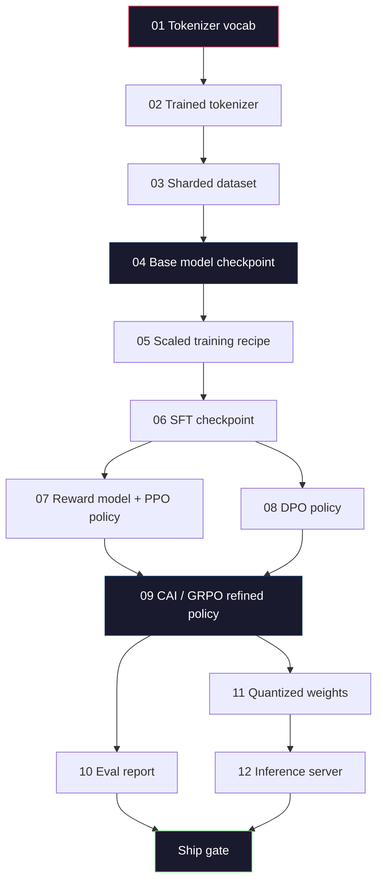

# 构建完整的LLM管道

> 第01到12课构成了单一管道的一个阶段。本课程是将这些阶段整合为单一端到端运行的脚手架：分词、预训练、扩展、监督微调、对齐、评估、量化、部署。你不会在笔记本电脑上训练一个700亿参数的模型。你将构建的是一个2026年前沿团队用来决定产品发布所使用的**编排层**、**清单**、**评估门控**和**回滚计划**。这是毕业设计。

**类型:** 构建
**语言:** Python (标准库)
**前提:** 第10阶段所有课程01-12
**时间:** ~120分钟

## 学习目标

- 将前面的十一课（分词器、数据、预训练、扩展、SFT、RLHF、DPO、CAI、评估、量化、推理）组合成一个可复现的管道规范
- 定义各阶段之间的工件契约：每个阶段消费什么、产出什么，以及下一阶段如何验证输入
- 构建一个协调器来跟踪实验、哈希工件，并根据评估门限决定发布
- 设计回滚计划：哪些工件重新运行成本低，哪些成本高，以及损坏的检查点会造成什么代价

## 问题所在

之前的课程都能独立运行。分词器已训练，小型GPT已预训练，SFT数据集已组装，奖励模型已训练，DPO已运行，评估已测量，量化权重已导出，推理服务器已启动。每个都是一个独立的笔记本。每个都有自己的规范、自己的输出路径、自己的随机种子。

前沿的训练运行不是一个笔记本。Llama 3 405B花费了约3000万H100小时，历时约54天。DeepSeek-V3使用了约280万H800小时。在此期间，一个损坏的检查点、一次数据污染、一次评估回退可能会让团队损失一周的实际时间和一个月的GPU预算。团队能在这类问题中生存下来依靠的是**管道卫生**：每个阶段都有确定性输入、确定性输出、清单、哈希值和门控。

这是毕业设计。你不会在笔记本电脑上端到端运行该管道。你将编写协调各阶段的**协调器**、描述运行的**清单**、决定发布的**验证器**，以及让第三方能够从单个文件重现实验的**重放计划**。代码量不大；但纪律要求很高。

这个模式从1亿到1万亿参数规模都适用。同样的四个组件——清单、协调器、评估门控、工件存储——运行着Llama 3，也运行着你的爱好GPT。区别在于每个阶段配置内部数字的大小，而不是管道的形状。

## 核心概念

### 十二个阶段

第10阶段的每一课都是一个阶段。以下是完整的依赖关系图。

阶段07和08可以并行运行。其他都是硬依赖。阶段02（分词器）的任何更改都会使所有下游工件失效。阶段10（评估）的更改只会使发布决定失效。

### 清单

清单是一个文件，它完整地描述了一次运行，足以使其可重现。管道产生的任何东西都不应依赖于清单之外的状态。这些字段枯燥但必须。

第N阶段的输出哈希是第N+1阶段的输入哈希。任何偏差都会导致管道暂停。这是你早期捕获数据损坏的方式。这也是不同大洲的同事验证他们的重放是否产生了与你相同的工件的方式。

实践中，团队使用一个小的YAML模式和一个清单检查器，该检查器会与上一次成功的运行进行差异比较。任何预期字段（成本、运行时间）之外的差异都是一个危险信号。

### 工件类型化

每个阶段的输出都是一个类型化的工件。不是一个目录块，不是一个pickle文件，而是一个具有已知模式的命名类型。

| 阶段 | 工件类型 | 关键字段 |
|-------|----------|----------|
| 01-02 | 分词器 | vocab.json, merges.txt, config.json, 哈希 |
| 03 | 数据集 | 分片[], 行数, token数, 去重统计 |
| 04-05 | 检查点 | weights.safetensors, config.json, 优化器状态, 步数 |
| 06 | SFT模型 | 检查点 + SFT配方 + 数据混合 |
| 07 | 奖励模型 | RM检查点 + 偏好数据哈希 |
| 08-09 | 策略 | 检查点 + 参考哈希 + beta + 已消耗的KL预算 |
| 10 | 评估报告 | 基准分数 + 回退差异 + 评估数据哈希 |
| 11 | 量化模型 | 量化权重 + 校准数据 + 与FP16的精度差异 |
| 12 | 服务器规范 | 端点 + 模型哈希 + 配置 + 可观测性钩子 |

类型化防止了最常见的故障模式：将阶段08的输出用作阶段06的输入，将DPO训练的模型通过SFT路径发布。类型化的工件和类型化的阶段签名使这些错误成为编译时错误，而不是第五天的错误。

### 评估门控

发布不是“训练完成”。发布是“训练完成且评估门控通过”。门控在运行开始前定义。

每个门控都是一个数值阈值。没有“看起来不错”的门控。没有主观的签字同意。如果每个门控都通过，工件就被标记为可发布。如果任何门控失败，运行将被暂停，等待指定审核员的明确覆盖，覆盖本身会被记录在清单中。

两个门控可以捕获大多数灾难。一个*回退*门控（新模型在核心基准上必须至少和之前的一样好）可以捕获训练错误。一个*KL预算*门控（对齐后的策略相对于其参考不能偏离超过X）可以捕获对齐过拟合。每个生产管道都有这两者。

### 协调器

一小段代码，读取清单，分发阶段，跟踪工件，并在任何契约违反时停止。这不是Airflow，不是Kubeflow。为了管道卫生，你需要一个自己编写的、枯燥的工具。

协调器的职责很窄：
1. 从清单解析DAG。
2. 对于每个阶段，检查预期的输出是否已经以正确的哈希存在（如果存在则跳过）。
3. 运行该阶段，捕获标准输出/错误，测量运行时间和成本。
4. 验证输出哈希是否与下游阶段预期的输入哈希匹配。
5. 如果失败，写入一个包含确切失败阶段的部分清单，并以非零状态退出。

这大约是200行Python代码。它看起来会像本课程中的文件`code/main.py`。在底层，真正的管道使用`torchrun`或`ray`在集群上执行各个阶段，但协调器本身在单个机器上运行。

### 实验跟踪与工件存储

两个外部系统支撑着这个管道。

**实验跟踪器 (wandb, neptune, mlflow)。** 记录每个阶段的损失曲线、评估指标、系统遥测数据。当你需要三周后比较运行A和运行B时，跟踪器就是你要去的地方。团队几乎总是使用托管的跟踪器——自己编写会浪费本该用于训练的时间。

**工件存储 (S3, R2, GCS)。** 用于检查点、数据集、分词器、评估报告的不可变对象存储。工件通过哈希寻址，而不是通过文件名。像`latest.pt`这样的文件名是个隐患；而`ckpt-7b-step-20000-sha256:abc123.safetensors`是一个契约。

协调器会同时向两者写入。跟踪器是给人看图表用的。工件存储是给下一阶段查找输入用的。

### 成本估算

前沿的运行都伴随着一个美元数字。预算纪律体现在两个地方。

**运行前估算。** 根据清单，计算预期FLOPs（对于预训练：6 x 参数量 x token数），预期GPU小时（FLOPs / 峰值吞吐量 / 利用率），以及按当前租赁价格计算的美元成本。如果估算超过预算门控，管道将拒绝启动。

**运行中跟踪。** 逐阶段的运行时间和成本被记录到清单中。每个阶段之后，都会检查剩余预算。如果一个阶段超支，下一个阶段的门控将根据新的剩余预算进行评估。你不会在风投打电话来时才意识到钱花光了。

Llama 3报告的成本是6100万美元。DeepSeek-V3报告其主要预训练运行的成本为560万美元。差异主要是硬件效率加上专家混合——但具体成本是可见的，因为两个团队都是按阶段而不是按整个运行来跟踪成本的。

### 可复现性 vs 确定性

这两者不是一回事。*可复现*意味着相同的清单加上相同的代码加上相同的基础设施产生一个具有等效下游指标的检查点。*确定性*意味着比特级相同的输出。

现代的LLM训练是可复现的，但不是确定性的。分布式训练的reduce顺序、GPU内核的非确定性（cuBLAS、flash-attn）以及混合精度舍入共同作用，导致浮点数在运行之间在1e-5的水平上有所差异。这对于不会变化的最终指标来说是可以接受的。但如果你想用比特级差异进行调试，那就是致命的。解决方法是记录每个阶段的输入哈希、输出哈希和关键指标——如果这些匹配，即使权重不是比特级相同的，运行也被认为是“已复现”的。

### 回滚计划

在运行开始前，写下每个阶段失败时会发生什么。分为三类。

- **重新运行成本低**（几小时）：分词器、评估、量化、推理服务器。直接重新运行。
- **中等**（几天）：SFT、DPO、CAI。保留基础模型；仅重新运行对齐阶段。
- **昂贵**（几周和数百万美元）：预训练。这里的回滚计划不是“重新运行”。而是“使用最后一个好的检查点，并用修订后的数据重新运行较便宜的下游阶段”。

由于阶段依赖关系是类型化和哈希化的，协调器可以自动计算回滚集：使失败的阶段及其所有后续阶段失效。阶段06（SFT）的失败会使06、07、08、09、10、11、12失效。阶段11（量化）的失败只会使11和12失效。事先明确这些，可以避免在团队凌晨4点精疲力竭时临时拼凑方案。

### 2026年观察到的生产配方

大多数前沿团队都收敛到了相同的骨架。

- 分词器：128k BPE带字节回退。在一个小的、平衡的多语言切片上训练。
- 预训练：10-20万亿token，主要是网络、代码和合成数据。Muon或AdamW优化器。FSDP2或DeepSpeed ZeRO-3。梯度检查点。BF16权重，FP32主权重。
- SFT：50万-200万指令对，混合人工和合成数据，并与评估集进行严格去重。
- 对齐：DPO或CAI + GRPO。仅在偏好信号对DPO来说太过多维时才使用RLHF。
- 评估：MMLU-Pro, MATH, HumanEval+, GPQA, SWE-Bench Verified, LiveBench，加上一个公众永远看不到的私有留出集。
- 量化：用于服务的4位GPTQ或AWQ，用于精度差异有影响的安全评估的8位。
- 服务：vLLM, TensorRT-LLM，或自研方案。连续批处理。推测解码。KV缓存淘汰。

数字每六个月变一次。骨架不变。

## 动手构建

本课程的代码是一个协调器和一个清单检查器，而不是十二个训练脚本。每个阶段都用一个占位符模拟，该占位符会生成一个具有正确形状和哈希的输出工件。端到端运行协调器可以证明管道的连接在你为真正的阶段烧掉GPU钱之前就能工作。

完整实现参见`code/main.py`。关键部分：

- `Manifest` 数据类：管道版本、种子、git提交、阶段、门控。
- `Stage` 数据类：名称、类型、输入（哈希）、输出（哈希）、运行时间、成本。
- `Orchestrator.run()`：解析DAG，分发阶段，验证哈希，更新清单。
- `EvalGate.check()`：读取阈值，与最新的评估报告比较，返回通过/失败。
- `ArtifactStore`（内存桩）：按哈希进行存取，模拟S3。
- `CostTracker`：逐阶段和累计，当超出上限时停止。

`main.py`中的管道运行十二个占位符阶段，生成一个清单，并测试一个失败的评估门控，以展示运行被暂停是什么样子。将每个占位符替换为对应课程的真实训练脚本，你就拥有了一个真实前沿管道使用的骨架。

## 如何使用

规范的工作流程包含三个命令。

每次运行`plan`先。大多数管道问题在计划阶段就会显现——缺失的门控阈值、陈旧的哈希、预算超支。运行`plan`是免费的。运行`run`是昂贵的。在便宜的那边抓住错误可以省钱。

`gate`的输出要么是`SHIP`，要么是`HOLD: <reason>`。被暂停的运行不是失败；它是一个决策点。指定的审核员要么覆盖（覆盖会被记录），要么批准回滚。

## 交付

本课程产出`outputs/skill-llm-pipeline-reviewer.md`。给它一个提议的管道清单，它会检查所有契约：阶段类型、哈希链、门控、回滚计划、成本估算。它会拒绝批准一个缺少评估门控、KL预算无限制，或者混合了评估和训练数据的运行清单。

## 练习

1.  扩展协调器以支持阶段07和08的并行执行。使用标准库`concurrent.futures`模块。确认最终清单记录了两个阶段的输出，并且阶段09的输入哈希是两者的确定性组合。
2.  添加一个“污染检查”门控。给定评估数据集哈希和训练数据集分片，计算重叠（精确字符串匹配或13-gram匹配）。如果重叠超过0.1%，门控失败。给它一个被污染的训练集并确认门控能暂停运行。
3.  从基本原理实现一个成本估算器。对于阶段04（预训练），按6 x 参数量 x token数估算FLOPs，假设在H100上使用BF16时，模型FLOPs利用率为40%，算力为989 TFLOPs，价格为每GPU小时2.50美元。报告一个在2万亿token上训练的7B模型的估算结果。与已发布的Llama 2数据进行比较。
4.  构建部分回滚。模拟阶段09（CAI）的失败，然后重新运行阶段09到12，同时保留01-08的缓存。协调器应通过哈希检测到缓存的工件并跳过它们。测量与完全重新运行相比节省的运行时间。
5.  增加可观测性。为每个阶段发射OpenTelemetry跨度，带有关于参数、已见token数、损失和成本的属性。将跨度管道连接到本地收集器。重点不在于仪表盘；重点在于每个阶段的健康状况都可以从单个跟踪ID追溯。

## 关键术语

| 术语 | 人们怎么说 | 它的实际含义 |
|------|------------|--------------|
| 清单 | "配方文件" | YAML或JSON文件，描述管道版本、种子、各阶段配置和门控阈值 — 足以重放一次运行 |
| 内容寻址 | "按哈希而非名称" | 工件按其内容的SHA-256存储，因此你永远不会混淆版本A和版本B |
| 评估门控 | "发布标准" | 基准指标和安全分数上的数值阈值，必须通过才能将工件标记为可发布 |
| KL预算 | "对齐偏移了多远" | 在对齐阶段对累积KL(策略 || 参考)的上限，作为门控强制执行 |
| MFU | "你用了多少GPU" | 模型FLOPs利用率 — 实际达到的FLOPs除以理论峰值。在70B规模时40%是典型的，在7B规模时55% |
| 回滚计划 | "出问题时我们怎么做" | 预先写好的每个阶段在失败时的行动：重新运行、回退、用修订后的输入重新训练 |
| 协调器 | "指挥家" | 读取清单、分发阶段、验证哈希、在任何契约违反时停止的进程 |
| 工件存储 | "带版本的S3用于存储权重" | 不可变的内容寻址对象存储 — 检查点、数据集、评估报告的唯一真实来源 |
| 可复现的 | "重放时指标相同" | 比特级权重不同但下游指标等效 — 分布式LLM训练的现实目标 |
| 成本门控 | "你不能超过X" | 运行前成本估算加上运行中跟踪器 — 如果估算超过预算，管道拒绝启动 |

## 扩展阅读

- [Dubey et al., 2024 -- "The Llama 3 Herd of Models"](https://arxiv.org/abs/2407.21783) -- 对前沿管道最详细的公开描述，包括数据、训练、对齐、评估
- [DeepSeek-AI, 2024 -- "DeepSeek-V3 Technical Report"](https://arxiv.org/abs/2412.19437) -- 效率优先的管道，成本大约是Llama 3类训练的1/10
- [Kaplan et al., 2020 -- "Scaling Laws for Neural Language Models"](https://arxiv.org/abs/2001.08361) -- 最初的计算-数据-参数缩放关系
- [Hoffmann et al., 2022 -- "Training Compute-Optimal Large Language Models (Chinchilla)"](https://arxiv.org/abs/2203.15556) -- 对Kaplan的修正，重新校准了现代数据预算
- [PyTorch FSDP2 documentation](https://pytorch.org/docs/stable/fsdp.html) -- 在PyTorch 2.4+中取代FSDP1的分布式训练原语
- [Weights & Biases LLM Reports](https://wandb.ai/site/llms) -- 开源LLM运行的真实清单和实验跟踪器输出，可作为可借鉴的模板