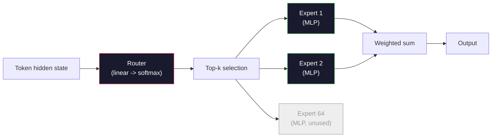

# 开放模型：架构详解

> 你在第04课中从零构建了一个GPT-2 Small。2026年的前沿开放模型与之同属一个家族，只是包含了五到六项具体变化。RMSNorm取代LayerNorm；SwiGLU取代GELU；RoPE取代学习式位置编码；GQA或MLA取代完整MHA；大规模混合专家模型。你已经掌握的数学知识覆盖了其中95%。本课将并排研读Llama 3、DeepSeek-V3、Mixtral、Qwen和Gemma，指出每种架构差异的确切位置。

**类型：** 学习
**语言：** Python（标准库）
**先决条件：** 第10阶段，第04、05、12课（预训练、扩展、推理）
**时长：** ~45分钟

## 学习目标

- 阅读Llama 3、Mistral、Mixtral、Gemma 2、Qwen 2.5和DeepSeek-V3的`config.json`，并解释每个字段
- 说明每个模型相较于GPT-2 Small做出的具体架构改动，并从基本原理出发证明其合理性
- 仅从配置文件计算任何开放模型的参数量、KV缓存大小和激活内存
- 根据延迟、内存和能力限制，为部署目标选择合适的开放模型

## 问题所在

在第04课中，你用350行numpy代码构建了一个GPT-2形状的模型。Llama 3 405B则有一份200页的技术报告。你的直觉可能是，它们是截然不同的物种。但事实并非如此。这200页描述的是同一类对象，只是进行了五到六项动机充分的修改，外加关于扩展的上千个实现细节。骨架结构——嵌入、Transformer块、注意力机制、MLP、归一化、输出头——并未改变。

本课是一份差异对比。针对每个主要的开放模型系列，我们确切列出相对于GPT-2的改动、改动原因及其代价。完成后，你将能够阅读新的模型卡片，并在脑海中将其翻译回GPT-2基线。

实际回报在于，当Meta发布Llama 5或DeepSeek发布V4时，你将不需要新的心智模型。你只需查看配置，看到哪些已知的调节旋钮发生了变动，就能知道其下游影响。2026年的架构是一个有限的工具箱。每个新模型只是选择了不同的子集。

## 核心概念

### 不变的核心

所有自回归开放模型共享：

- Token嵌入矩阵（vocab_size x hidden_dim）。
- N个解码器块的堆叠：归一化、自注意力、残差连接、归一化、MLP、残差连接。
- 最终的归一化和线性输出头（投影到vocab_size，通常与嵌入层权重绑定）。
- 因果掩码，下一个token的交叉熵损失。

这就是形状。其余都是可调的旋钮。

### 真正起作用的六个旋钮

在2024-2026年所有的前沿开放模型中，同样的六个设计选择被反复选用：

1.  **归一化。** LayerNorm -> RMSNorm。
2.  **位置编码。** 学习式绝对位置 -> RoPE（以及变体：YaRN, NTK）。
3.  **激活函数。** GELU -> SwiGLU（或GeGLU）。
4.  **注意力头共享。** MHA -> GQA -> MQA -> MLA。
5.  **稠密 vs 稀疏 MLP。** 稠密 -> 混合专家。
6.  **归一化位置。** Pre-norm保留，Post-norm已弃用。

其他一切（学习率计划、数据混合、批量大小、上下文长度）都属于训练配置，而非架构。六个旋钮。

### 旋钮1：RMSNorm

LayerNorm减去均值，除以标准差，再缩放和平移。RMSNorm只保留缩放：

```
RMSNorm(x) = x / sqrt(mean(x^2) + eps) * gamma
```

不减均值。无偏置。每个token少一次矩阵乘法。Zhang和Sennrich（2019）论证其在机器翻译上性能与LayerNorm相当，且速度快10%。每个现代开放模型都使用它。

代价：无。收益：微小的吞吐量提升，代码更简洁。

### 旋钮2：RoPE

在GPT-2中，学习式位置嵌入是一个1024个槽位的查找表。上下文长度为1025时就超出了表的范围。模型无法外推到训练长度之外。

旋转位置嵌入（RoPE，Su等人2021）通过在注意力点积之前，对每对Q和K向量按位置进行旋转来注入位置信息。旋转角度是位置的确定性函数，因此没有需要学习的内容，也不会耗尽。借助缩放技巧（NTK感知插值，YaRN），一个在8k上下文上训练的模型可以在推理时扩展到128k，且精度损失适中。

```
q_rotated = rotate(q, angle(pos))
k_rotated = rotate(k, angle(pos))
score = q_rotated . k_rotated
```

每个Llama、Mistral、Qwen、DeepSeek和Gemma模型都使用RoPE。Gemma 2使用混合方案（多数层用RoPE，其他层用局部滑动窗口注意力）。

### 旋钮3：SwiGLU

GPT-2的MLP是 `x -> gelu(xW1 + b1) -> (...)W2 + b2`。SwiGLU（Shazeer 2020）用门控乘积替换了激活函数：

```
SwiGLU(x) = (xW1) * sigmoid(xW1) * xV
```

两个投影并行计算，并由Swish激活函数进行门控。经验表明，其每参数困惑度更优。Llama 2采用了它，随后所有人都跟进了。MLP的隐藏层大小通常设置为使总参数量与原始稠密MLP匹配：如果GPT-2使用 `ff_dim = 4 * hidden`，则SwiGLU使用 `ff_dim = (2/3) * 4 * hidden = 8/3 * hidden`。

### 旋钮4：注意力头共享

GPT-2使用**多头注意力（MHA）**：每个头都有自己独立的Q, K, V投影。

**多查询注意力（MQA，Shazeer 2019）** 在所有头之间共享一个K和一个V。将KV缓存减少到原num_heads分之一，这在典型模型上相当于12倍到32倍的缩减。在困难基准测试上精度略有下降。

**分组查询注意力（GQA，Ainslie等人2023）** 是折中方案：G组Q头共享一个K和一个V。Llama 3 8B使用GQA，有32个Q头和8个KV头（G=8），因此与完整MHA相比，KV缓存缩减了4倍。

**多头潜在注意力（MLA，DeepSeek 2024）** 将K和V压缩到一个共享的低秩潜在空间，然后按头解压回来。在保持每头表达能力的同时，进一步减小KV缓存。DeepSeek-V2和V3依赖于此实现其长上下文性能。

| 方案 | KV头数 | KV缓存 | 精度 |
|--------|----------|----------|----------|
| MHA    | num_heads | 完整 | 最佳 |
| GQA    | num_groups (G < num_heads) | 减少 num_heads / G | 接近MHA |
| MQA    | 1 | 减少 num_heads | 略有损失 |
| MLA    | 潜在空间，按头解压 | 小于MQA | 接近MHA |

对于任何超过约13B参数的模型，GQA或MLA实际上是强制性的。大规模下的完整MHA是KV缓存的灾难。

### 旋钮5：混合专家

稠密MLP对每个token激活其所有参数。MoE MLP在每个块中有K个专家和一个路由器，为每个token挑选top-k个专家（通常是top-2）。只有这些专家的权重会为该token经历一次前向传播。

```
router_logits = xW_r
indices, weights = top_k(router_logits, k=2)
output = sum_i weights[i] * expert[indices[i]](x)
```

其吸引力在于：你可以拥有64个大小为7B的专家（因此总参数量巨大），同时每个token只运行其中2个（因此每token计算量与一个稠密7B模型相当）。Mixtral 8x7B有47B总参数，但每token只激活13B。DeepSeek-V3有671B总参数，但每token只激活37B。



优点：相同的计算量，更多的参数，更好的容量。缺点：专家的权重仍然必须存放在某处（因此服务所需的显存多于等效的稠密模型），平衡路由器的负载很困难，并且在对齐过程中微调路由器本身就是一个研究领域。

### 旋钮6：Pre-norm保留

原始Transformer在每个子层之后应用层归一化。自GPT-2以来，每个开放模型都将归一化放在每个子层*之前*。Pre-norm在深层网络中训练起来明显更容易。这一点毫无争议。

### 逐模型差异

下表使所有这些变得具体。

| 模型 | 年份 | 总参数量 | 活跃参数量 | 归一化 | 激活函数 | 位置编码 | 注意力机制 | MoE | 上下文长度 |
|-------|------|-------------|---------------|------|-----------|----------|-----------|-----|---------|
| GPT-2 Small | 2019 | 124M | 124M | LayerNorm | GELU | 学习式 | MHA (12头) | 无 | 1k |
| Llama 3 8B | 2024 | 8B | 8B | RMSNorm | SwiGLU | RoPE | GQA (32/8) | 无 | 128k |
| Llama 3 70B | 2024 | 70B | 70B | RMSNorm | SwiGLU | RoPE | GQA (64/8) | 无 | 128k |
| Llama 3 405B | 2024 | 405B | 405B | RMSNorm | SwiGLU | RoPE | GQA (128/16) | 无 | 128k |
| Mistral 7B | 2023 | 7.2B | 7.2B | RMSNorm | SwiGLU | RoPE | GQA | 无 | 32k |
| Mixtral 8x7B | 2023 | 47B | 13B | RMSNorm | SwiGLU | RoPE | GQA | 是 (8专家，top-2) | 32k |
| Gemma 2 9B | 2024 | 9B | 9B | RMSNorm (pre+post) | GeGLU | RoPE + 滑动窗口 | GQA | 无 | 8k |
| Qwen 2.5 72B | 2024 | 72B | 72B | RMSNorm | SwiGLU | RoPE (YaRN) | GQA (64/8) | 无 | 128k |
| DeepSeek V2 236B | 2024 | 236B | 21B | RMSNorm | SwiGLU | RoPE | MLA | 是 (160专家，top-6) | 128k |
| DeepSeek V3 | 2024 | 671B | 37B | RMSNorm | SwiGLU | RoPE | MLA | 是 (256专家，top-8) | 128k |

浏览各列。RMSNorm是通用的。SwiGLU或其变体GeGLU是通用的。RoPE是通用的。在超过7B参数的模型中，GQA是通用的，除非被MLA取代。MoE是顶级模型的差异化因素。

### 阅读config.json

Llama 3 8B 配置：

```
{
  "hidden_size": 4096,
  "intermediate_size": 14336,
  "num_hidden_layers": 32,
  "num_attention_heads": 32,
  "num_key_value_heads": 8,
  "max_position_embeddings": 131072,
  "rope_theta": 500000.0,
  "rms_norm_eps": 1e-5,
  "vocab_size": 128256
}
```

每个字段都对应你已经实现过的某个部分。

- `hidden_size`: 嵌入维度。
- `intermediate_size`: MLP隐藏层大小（hidden的3.5倍——SwiGLU的数学要求）。
- `num_hidden_layers`: 堆叠深度。
- `num_attention_heads`: Q头数量。
- `num_key_value_heads`: KV头数量（GQA）。
- `max_position_embeddings`: 训练上下文长度。
- `rope_theta`: RoPE基频率。Meta将其从默认的10k缩放到500k以实现长上下文外推。
- `rms_norm_eps`: 数值稳定性。
- `vocab_size`: token数量。

仅从这些参数，你就可以计算总参数量、KV缓存和峰值激活内存。具体公式见 `code/main.py`。

### 激活内存预算

超过几十亿参数后，激活内存主导了训练内存。预训练的经验法则（使用梯度检查点）：

```
activation_mem ~ batch_size * seq_len * hidden_size * num_layers * bytes_per_element
```

对于Llama 3 8B，批量大小为1，序列长度为8192，BF16精度，32层，隐藏维度4096：使用检查点时，仅激活内存就约需8 GB，不使用时则需40 GB。这就是flash-attention和ring-attention至关重要的原因——它们重写了注意力计算，使激活内存得以容纳。

### KV缓存预算

对于最大上下文下的推理：

```
kv_cache = 2 * num_layers * num_kv_heads * head_dim * max_seq_len * bytes_per_element
```

Llama 3 8B在128k上下文，BF16精度，head_dim = hidden / num_heads = 128时：
每个序列的KV缓存为 `2 * 32 * 8 * 128 * 131072 * 2 = 17.2 GB`。

8B模型的权重在BF16下占用16 GB。单个128k序列的KV缓存比模型权重还大。这正是驱动GQA、MLA和KV缓存量化研究的记忆压力。

### 各模型的适用场景

- **单块80GB GPU，无MoE**：Llama 3 8B, Mistral 7B, Gemma 2 9B。易于部署，工具支持广泛。
- **单节点（8x80GB），大容量**：Llama 3 70B, Qwen 2.5 72B。最高的稠密开放模型能力。
- **最大开放能力，接受MoE复杂性**：DeepSeek V3, Mixtral 8x22B。每活跃FLOP的最佳能力。
- **长上下文需求**：Llama 3（通过RoPE缩放实现128k），DeepSeek（MLA优势）。
- **低延迟服务**：Gemma 2 9B（滑动窗口减少了长上下文计算量）。

## 动手实现

本课的代码是一个计算器。给定任何`config.json`，它会打印按组件分类的参数量、最大上下文下的KV缓存、SwiGLU MLP比率，以及一个关于架构（稠密 / GQA / MLA / MoE）的简短结论。

```python
config = {
    "hidden_size": 4096, "intermediate_size": 14336,
    "num_hidden_layers": 32, "num_attention_heads": 32,
    "num_key_value_heads": 8, "vocab_size": 128256,
    "max_position_embeddings": 131072,
}
```

该脚本逐字段遍历架构，计算嵌入层、注意力层（考虑GQA缩减）、MLP（考虑SwiGLU扩展）、层归一化和输出头的参数量。然后计算给定上下文长度下的KV缓存并打印摘要。

实现细节见 `code/main.py`。

## 使用它

对脚本中附带的Llama 3 8B、Mistral 7B、Mixtral 8x7B和DeepSeek V3配置运行计算器。比较参数分解。注意MoE模型的总参数量远超稠密模型，但活跃参数量通常更小。注意DeepSeek V3的KV缓存比Llama 3 405B的还小，尽管总参数量更多——这就是MLA的效果。

然后，为你本地拥有的任何模型插入一个配置，阅读摘要，并判断它是否适合你的GPU。

## 部署应用

本课产出 `outputs/skill-open-model-picker.md`。给定一个部署目标（GPU类型、显存、上下文长度、延迟预算）和一个任务配置（聊天、代码、推理、长上下文），它会推荐一个开放模型、一个来自第11课的量化方案，以及一个来自第12课的推理栈，并明确说明对六个架构旋钮的推理。

## 练习

1.  从HuggingFace读取Qwen 2.5 72B的配置。从头计算总参数量。与HuggingFace报告的值对比，找出任何差异的来源（头维度舍入、KV共享因子等）。

2.  DeepSeek V3使用256个专家和top-8路由。计算激活专家占总专家数的比例，并与Mixtral 8x7B的8选2进行比较。从稀疏（25%）向更稠密稀疏（3%）的转变，对于每FLOP容量意味着什么？

3.  在FP8和BF16精度下，计算Llama 3 405B在128k上下文下的KV缓存。FP8下其大小为BF16的一半。在单个8xH100节点上（每卡80GB，共640GB，减去权重内存），你能服务多少个并行序列？

4.  Gemma 2交替使用全注意力层和滑动窗口注意力层。编写当一半层使用4096 token滑动窗口（而非完整上下文）时，KV缓存的数学公式。在总上下文为8k的情况下，这能节省多少内存？

5.  找到一个在本课编写后发布的近期前沿开放模型。识别它选择了六个旋钮中的哪些，以及是否引入了第七个旋钮。新架构一发布，课程内容就会感觉过时——目标是在不重建你的心智模型的前提下，更新你的表格。

## 关键术语

| 术语 | 常见说法 | 实际含义 |
|------|----------------|----------------------|
| RMSNorm | "不带均值的LayerNorm" | 仅通过均方根进行归一化，并带有可学习缩放——比LayerNorm更廉价且性能相当 |
| RoPE | "旋转位置编码" | 在二维平面上，按对旋转每个Q和K向量，旋转角度取决于位置——通过缩放技巧可外推到训练长度之外 |
| SwiGLU | "新的MLP激活函数" | 带有Swish的门控线性单元：`(xW1) * sigmoid(xW1) * xV` —— 2024年以后每个开放模型的标准配置 |
| GQA | "折中方案注意力" | 分组查询注意力：G组Q头共享一个K和一个V头——在减少KV缓存的同时避免了MQA的精度损失 |
| MLA | "DeepSeek的注意力" | 多头潜在注意力：将K/V压缩到共享的低秩潜在空间，按头解压——大型模型最小的KV缓存 |
| MoE | "稀疏专家" | 混合专家：每个块有N个MLP，路由器为每个token选择top-k个——总参数量巨大，活跃参数量小 |
| Top-k路由 | "为每个token选择k个专家" | 路由器计算每个专家的分数并激活得分最高的k个——典型k值为2（Mixtral）到8（DeepSeek） |
| YaRN | "拉伸RoPE" | 又一种RoPE扩展——在推理时通过插值旋转角度，将上下文从8k扩展到128k+ |
| 滑动窗口注意力 | "不要关注所有内容" | 每个token只关注其前W个token——将注意力成本限制在每token O(W)，用于Gemma 2和早期Mistral |
| 活跃参数 | "每个token运行的参数" | 对于MoE模型，指每个token经历前向传播的参数量（远小于总参数量）——决定每token的FLOP |

## 扩展阅读

- [Dubey et al., 2024 -- "The Llama 3 Herd of Models"](https://arxiv.org/abs/2407.21783) -- 稠密Llama 3系列的架构和训练参考
- [DeepSeek-AI, 2024 -- "DeepSeek-V3 Technical Report"](https://arxiv.org/abs/2412.19437) -- MLA加上无辅助损失负载均衡加上671B MoE
- [Jiang et al., 2024 -- "Mixtral of Experts"](https://arxiv.org/abs/2401.04088) -- 经典的MoE开放模型论文
- [Su et al., 2021 -- "RoFormer: Enhanced Transformer with Rotary Position Embedding"](https://arxiv.org/abs/2104.09864) -- RoPE论文
- [Shazeer, 2020 -- "GLU Variants Improve Transformer"](https://arxiv.org/abs/2002.05202) -- SwiGLU, GeGLU及其同类
- [Ainslie et al., 2023 -- "GQA: Training Generalized Multi-Query Transformer Models"](https://arxiv.org/abs/2305.13245) -- GQA论文
- [Gemma 2 Team, 2024 -- "Gemma 2: Improving Open Language Models at a Practical Size"](https://arxiv.org/abs/2408.00118) -- 混合全注意力+滑动注意力，pre+post归一化
- [Qwen Team, 2024 -- "Qwen 2.5 Technical Report"](https://arxiv.org/abs/2412.15115) -- YaRN上下文扩展和长上下文训练方案