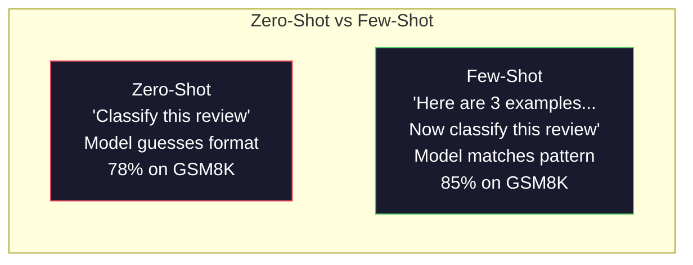
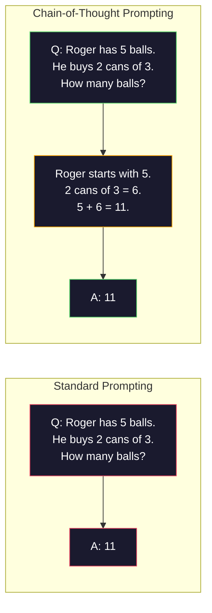
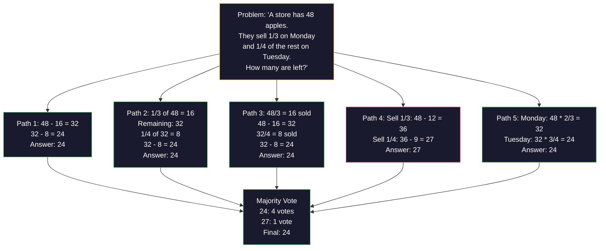
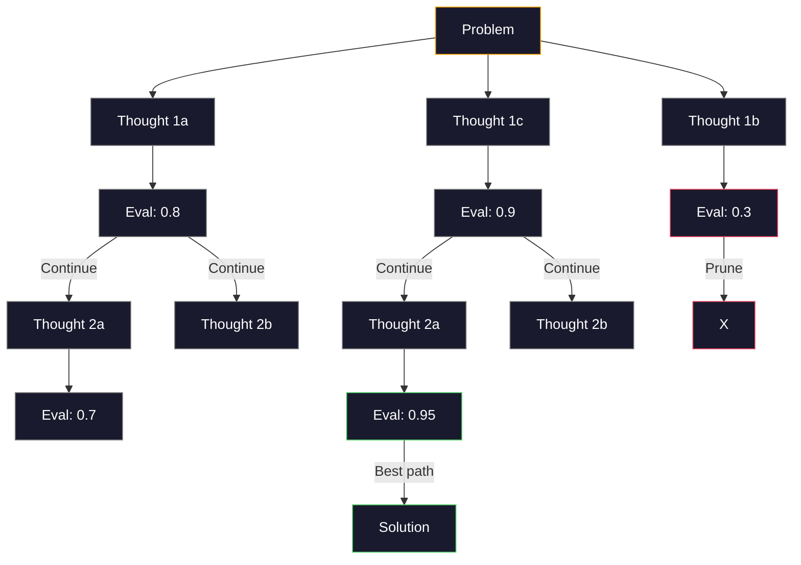
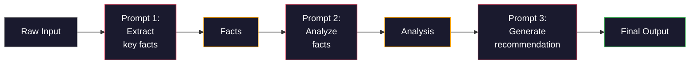

# 小样本、思维链、思维树

> 告诉模型做什么是提示。展示它如何思考才是工程。同一个模型、同一任务、同一数据下78%到91%准确率的差距不是更优模型，而是更优的推理策略。

**类型：** 构建
**语言：** Python
**先修课程：** 第11.01课（提示工程）
**时长：** 约45分钟

## 学习目标

- 通过筛选和格式化示例演示来实现小样本提示，最大化任务准确率
- 应用思维链推理提升数学应用题等多步骤问题的准确率
- 构建思维树提示，探索多条推理路径并选择最优解
- 在标准基准测试中量化零样本、小样本、思维链的准确率提升效果

## 问题场景

假设你正在开发数学辅导应用。你的提示是：“解决这个应用题”。GPT-5在小学数学基准GSM8K上正确率达94%，你以为已达上限——但思维链仍能提升3-4个百分点。

添加五个单词“让我们逐步思考”，准确率跃升至91%；再补充几个分步解题示例，准确率达到95%。模型相同、温度相同、API成本相同，唯一区别是你给了模型草稿纸。

这不是技巧，而是推理的本质。人类解决多步骤问题不会一蹴而就，Transformer模型亦然。当强制模型生成中间token时，这些token会成为下一个token的上下文。每个推理步骤都为下一步提供信息，模型通过计算逐步得出答案。

但“逐步思考”只是起点而非终点。如果采样五条推理路径进行投票呢？如果让模型探索可能性树，评估并剪枝呢？如果将推理与工具使用交替进行呢？这些都是经过验证、效果可测量的技术，本课将带你逐一实现。

## 核心概念

### 零样本与小样本：何时示例胜过指令

零样本提示仅提供任务描述，小样本提示则先展示示例。

Wei等人(2022)在8个基准上测试发现：对于情感分类等简单任务，两者准确率差异在2%以内；对于多步算术等复杂任务，小样本提示可提升10-25%准确率。

直觉解释：示例是压缩版的指令。相比描述输出格式，直接展示格式；相比解释推理过程，直接演示过程。模型对示例的模式匹配比对抽象指令的理解更可靠。



**小样本适用场景：** 格式敏感任务、分类、结构化提取、专业术语密集型任务、需要匹配特定模式的任务。
**零样本适用场景：** 简单事实问答、示例可能限制创造力的任务、编写指令比寻找示例更容易的任务。

### 示例选择：相似优于随机

并非所有示例价值相同。选择与目标输入相似的示例，在分类任务上比随机选择高5-15%(Liu等人，2022)。三大原则：

1. **语义相似性**：选择嵌入空间中最接近输入的示例
2. **标签多样性**：示例需覆盖所有输出类别
3. **难度匹配**：匹配目标问题的复杂度

多数任务最佳示例数为3-5个。少于3个时模型缺乏足够模式信息；超过5个收益递减且浪费上下文窗口。对于多标签分类，每个标签至少提供一个示例。

### 思维链：给模型配备草稿纸

思维链提示由Wei等人(2022)在Google Brain提出。核心思想很简单：不要求模型直接输出答案，而是要求先展示推理步骤。



原理在于：Transformer生成的每个token都成为后续token的上下文。没有思维链时，模型需在单次前向传播中将所有推理压缩至隐藏状态；有了思维链，模型将中间计算外化为token序列。每个推理token都扩展了有效计算深度。

**GSM8K基准测试结果（小学数学，8.5K问题）：**

| 模型 | 零样本 | 零样本思维链 | 小样本思维链 |
|-------|-----------|---------------|--------------|
| GPT-4o | 78% | 91% | 95% |
| GPT-5 | 94% | 97% | 98% |
| o4-mini（推理模型） | 97% | — | — |
| Claude Opus 4.7 | 93% | 97% | 98% |
| Gemini 3 Pro | 92% | 96% | 98% |
| Llama 4 70B | 80% | 89% | 94% |
| DeepSeek-V3.1 | 89% | 94% | 96% |

**关于推理模型：** OpenAI的o系列(o3, o4-mini)和DeepSeek-R1等模型会内部执行思维链。对推理模型添加“让我们逐步思考”是冗余的，有时甚至适得其反。

思维链的两种形式：
- **零样本思维链**：仅在提示末尾添加“让我们逐步思考”。Kojima等人(2022)证明这一句话能提升算术、常识、符号推理任务的准确率。
- **小样本思维链**：提供包含推理步骤的示例。比零样本更有效，因为模型能看到你期望的精确推理格式。

**思维链的局限**：简单事实查询（“法国首都是哪”）、单步分类、速度优先的任务。思维链每个查询增加50-200token的开销，对高吞吐量低复杂度任务会造成成本浪费。

### 自洽性：多次采样，一次投票

Wang等人(2023)提出自洽性技术。核心洞察：单条思维链可能包含推理错误，但若采样N条独立推理路径（温度>0）并对最终答案进行多数投票，错误可相互抵消。



在原始PaLM 540B实验中，自洽性将GSM8K准确率从56.5%（单条思维链）提升至74.4%（N=40）。在GPT-5上提升较小（97%→98%），因为基准准确率已接近饱和。该技术在基础思维链准确率60-85%的模型上效果最显著——此时单路径错误频繁但非系统性。对于推理模型（o系列，R1），自洽性已被内置的内部采样所涵盖。

权衡：N次采样意味着N倍API成本和延迟。实践中N=5能捕获大部分收益，N=3是有效投票的最小值，N>10对多数任务收益递减。

### 思维树：分支探索

Yao等人(2023)提出思维树。思维链遵循线性推理路径，而思维树探索多个分支，评估最具前景的路径后再继续扩展。



思维树包含三个组件：
1. **思维生成**：生成多个候选下一步
2. **状态评估**：为每个候选评分（可使用LLM自身作为评估器）
3. **搜索算法**：BFS或DFS遍历树，剪枝低分分支

在“24点游戏”任务（用4个数字通过算术运算得到24）中，标准提示的GPT-4解决率7.3%，思维链为4.0%（因搜索空间过大反而更差），思维树则达到74%。

思维树成本高昂：每个节点都需要LLM调用。分支因子为3、深度为3的树最多需要39次LLM调用。仅适用于搜索空间大但可评估的问题——如规划、解谜、带约束的创造性问题解决。

### ReAct：思考+行动

Yao等人(2022)将推理轨迹与行动相结合。模型在思考（生成推理）和行动（调用工具、搜索、计算）之间交替进行。

```mermaid
graph LR
    Q["Question:\nWhat is the\npopulation of the\ncountry where\nthe Eiffel Tower\nis located?"]
    T1["Thought: I need to\nfind which country\nhas the Eiffel Tower"]
    A1["Action: search\n'Eiffel Tower location'"]
    O1["Observation:\nParis, France"]
    T2["Thought: Now I need\nFrance's population"]
    A2["Action: search\n'France population 2024'"]
    O2["Observation:\n68.4 million"]
    T3["Thought: I have\nthe answer"]
    F["Answer:\n68.4 million"]

    Q --> T1 --> A1 --> O1 --> T2 --> A2 --> O2 --> T3 --> F

    style Q fill:#1a1a2e,stroke:#ffa500,color:#fff
    style T1 fill:#1a1a2e,stroke:#51cf66,color:#fff
    style A1 fill:#1a1a2e,stroke:#e94560,color:#fff
    style O1 fill:#1a1a2e,stroke:#808080,color:#fff
    style T2 fill:#1a1a2e,stroke:#51cf66,color:#fff
    style A2 fill:#1a1a2e,stroke:#e94560,color:#fff
    style O2 fill:#1a1a2e,stroke:#808080,color:#fff
    style T3 fill:#1a1a2e,stroke:#51cf66,color:#fff
    style F fill:#1a1a2e,stroke:#51cf66,color:#fff
```



在知识密集型任务中，ReAct优于纯思维链，因为它能基于真实数据进行推理。在HotpotQA（多跳问答）上，GPT-4使用ReAct达到35.1%精确匹配率，而纯思维链仅29.4%。其真正优势在于推理错误能通过观察得到修正——模型可在执行中途更新计划。

ReAct是现代AI智能体的基础。所有智能体框架（LangChain, CrewAI, AutoGen）都实现了思维-行动-观察循环的变体。你将在第14阶段构建完整智能体，本课重点讲解提示模式。

### 结构化提示：XML标签、分隔符、标题

随着提示复杂度增加，结构化可防止模型混淆各部分。三种方法：
- **XML标签**（与Claude配合最佳，其他模型也表现良好）：```
<context>
You are reviewing a pull request.
The codebase uses TypeScript and React.
</context>

<task>
Review the following diff for bugs, security issues, and style violations.
</task>

<diff>
{diff_content}
</diff>

<output_format>
List each issue with: file, line, severity (critical/warning/info), description.
</output_format>
```
- **Markdown标题**（通用方案）：```
## Role
Senior security engineer at a fintech company.

## Task
Analyze this API endpoint for vulnerabilities.

## Input
{api_code}

## Rules
- Focus on OWASP Top 10
- Rate each finding: critical, high, medium, low
- Include remediation steps
```
- **分隔符**（简洁有效）：```
---INPUT---
{user_text}
---END INPUT---

---INSTRUCTIONS---
Summarize the above in 3 bullet points.
---END INSTRUCTIONS---
```

### 提示链：顺序分解

某些任务过于复杂，单条提示无法完成。提示链将其分解为多步，前一步输出作为后一步输入。



提示链优于单条提示的三个原因：
1. **步骤更简化**：模型专注于单一子任务
2. **中间输出可检查**：可在步骤间验证和修正
3. **可混合使用不同模型**：用廉价模型提取，昂贵模型推理

### 性能对比

| 技术 | 最佳应用场景 | GSM8K准确率（GPT-5） | API调用 | Token开销 | 复杂度 |
|-----------|----------|------------------------|-----------|----------------|------------|
| 零样本 | 简单任务 | 94% | 1 | 无 | 极低 |
| 小样本 | 格式匹配 | 96% | 1 | 200-500 tokens | 低 |
| 零样本思维链 | 快速推理提升 | 97% | 1 | 50-200 tokens | 极低 |
| 小样本思维链 | 单次调用最高准确率 | 98% | 1 | 300-600 tokens | 低 |
| 自洽性（N=5） | 高风险推理 | 98.5% | 5 | 5倍token成本 | 中等 |
| 推理模型（o4-mini） | 即插即用思维链替代 | 97% | 1 | 隐式（2-10倍内部开销） | 极低 |
| 思维树 | 搜索/规划问题 | 不适用（24点游戏74%） | 10-40+ | 10-40倍token成本 | 高 |
| ReAct | 基于知识的推理 | 不适用（HotpotQA 35.1%） | 3-10+ | 可变 | 高 |
| 提示链 | 复杂多步骤任务 | 96%（流水线） | 2-5 | 2-5倍token成本 | 中等 |

技术选择取决于三个因素：准确率要求、延迟预算和成本容忍度。对于大多数生产系统，小样本思维链配合3样本自洽性回退可覆盖90%场景。

## 实践构建

我们将构建一个结合小样本提示、思维链推理和自洽性投票的数学问题求解器，然后为难题添加思维树功能。

完整实现见`code/advanced_prompting.py`，以下是核心组件：

### 步骤1：小样本示例库

首个组件管理小样本示例，并为给定问题选择最相关的示例。

```python
GSM8K_EXAMPLES = [
    {
        "question": "Janet's ducks lay 16 eggs per day. She eats three for breakfast every morning and bakes muffins for her friends every day with four. She sells every egg at the farmers' market for $2. How much does she make every day at the farmers' market?",
        "reasoning": "Janet's ducks lay 16 eggs per day. She eats 3 and bakes 4, using 3 + 4 = 7 eggs. So she has 16 - 7 = 9 eggs left. She sells each for $2, so she makes 9 * 2 = $18 per day.",
        "answer": "18"
    },
    ...
]
```

每个示例包含三部分：问题、推理链和最终答案。推理链将普通小样本示例转化为思维链示例。

### 步骤2：思维链提示构建器

提示构建器将系统消息、带推理链的小样本示例和目标问题组装成单条提示。

```python
def build_cot_prompt(question, examples, num_examples=3):
    system = (
        "You are a math problem solver. "
        "For each problem, show your step-by-step reasoning, "
        "then give the final numerical answer on the last line "
        "in the format: 'The answer is [number]'."
    )

    example_text = ""
    for ex in examples[:num_examples]:
        example_text += f"Q: {ex['question']}\n"
        example_text += f"A: {ex['reasoning']} The answer is {ex['answer']}.\n\n"

    user = f"{example_text}Q: {question}\nA:"
    return system, user
```

格式约束（“答案是[数字]”）至关重要。没有它，自洽性无法跨样本提取和比较答案。

### 步骤3：自洽性投票

采样N条推理路径并取多数答案。

```python
def self_consistency_solve(question, examples, client, model, n_samples=5):
    system, user = build_cot_prompt(question, examples)

    answers = []
    reasonings = []
    for _ in range(n_samples):
        response = client.chat.completions.create(
            model=model,
            messages=[
                {"role": "system", "content": system},
                {"role": "user", "content": user}
            ],
            temperature=0.7
        )
        text = response.choices[0].message.content
        reasonings.append(text)
        answer = extract_answer(text)
        if answer is not None:
            answers.append(answer)

    vote_counts = Counter(answers)
    best_answer = vote_counts.most_common(1)[0][0] if vote_counts else None
    confidence = vote_counts[best_answer] / len(answers) if best_answer else 0

    return best_answer, confidence, reasonings, vote_counts
```

温度0.7很关键。温度0.0会使所有N次采样结果相同，失去意义。需要足够随机性来获得多样推理路径，但又不能太大导致模型产生乱码。

### 步骤4：思维树求解器

对于线性推理失效的问题，思维树探索多种方法并评估最有前景的方向。

```python
def tree_of_thought_solve(question, client, model, breadth=3, depth=3):
    thoughts = generate_initial_thoughts(question, client, model, breadth)
    scored = [(t, evaluate_thought(t, question, client, model)) for t in thoughts]
    scored.sort(key=lambda x: x[1], reverse=True)

    for current_depth in range(1, depth):
        next_thoughts = []
        for thought, score in scored[:2]:
            extensions = extend_thought(thought, question, client, model, breadth)
            for ext in extensions:
                ext_score = evaluate_thought(ext, question, client, model)
                next_thoughts.append((ext, ext_score))
        scored = sorted(next_thoughts, key=lambda x: x[1], reverse=True)

    best_thought = scored[0][0] if scored else ""
    return extract_answer(best_thought), best_thought
```

评估器本身是LLM调用。你询问模型：“用0.0到1.0评分，这条推理路径解决该问题的前景如何？”这是思维树的关键洞察——模型评估自己的部分解。

### 步骤5：完整流水线

流水线结合所有技术，采用升级策略。

```python
def solve_with_escalation(question, examples, client, model):
    system, user = build_cot_prompt(question, examples)
    single_response = call_llm(client, model, system, user, temperature=0.0)
    single_answer = extract_answer(single_response)

    sc_answer, confidence, _, _ = self_consistency_solve(
        question, examples, client, model, n_samples=5
    )

    if confidence >= 0.8:
        return sc_answer, "self_consistency", confidence

    tot_answer, _ = tree_of_thought_solve(question, client, model)
    return tot_answer, "tree_of_thought", None
```

升级逻辑：先尝试低成本（单条思维链）。如果自洽性置信度低于0.8（5个样本中少于4个一致），升级到思维树。这平衡了成本与准确率——多数问题低成本解决，难题获得更充足的计算资源。

## 实际应用

### 使用LangChain

LangChain为提示模板和输出解析提供内置支持，简化小样本和思维链模式：

```python
from langchain_core.prompts import FewShotPromptTemplate, PromptTemplate
from langchain_openai import ChatOpenAI

example_prompt = PromptTemplate(
    input_variables=["question", "reasoning", "answer"],
    template="Q: {question}\nA: {reasoning} The answer is {answer}."
)

few_shot_prompt = FewShotPromptTemplate(
    examples=examples,
    example_prompt=example_prompt,
    suffix="Q: {input}\nA: Let's think step by step.",
    input_variables=["input"]
)

llm = ChatOpenAI(model="gpt-4o", temperature=0.7)
chain = few_shot_prompt | llm
result = chain.invoke({"input": "If a train travels 120 km in 2 hours..."})
```

LangChain还有用于语义相似度选择的`ExampleSelector`类：

```python
from langchain_core.example_selectors import SemanticSimilarityExampleSelector
from langchain_openai import OpenAIEmbeddings

selector = SemanticSimilarityExampleSelector.from_examples(
    examples,
    OpenAIEmbeddings(),
    k=3
)
```

### 使用DSPy

DSPy将提示策略视为可优化模块。无需手动设计思维链提示，你只需定义签名，让DSPy优化提示：

```python
import dspy

dspy.configure(lm=dspy.LM("openai/gpt-4o", temperature=0.7))

class MathSolver(dspy.Module):
    def __init__(self):
        self.solve = dspy.ChainOfThought("question -> answer")

    def forward(self, question):
        return self.solve(question=question)

solver = MathSolver()
result = solver(question="Janet's ducks lay 16 eggs per day...")
```

DSPy的`ChainOfThought`会自动添加推理轨迹。`dspy.majority`实现自洽性：

```python
result = dspy.majority(
    [solver(question=q) for _ in range(5)],
    field="answer"
)
```

### 对比：从零实现 vs 框架

| 特性 | 从零实现（本课） | LangChain | DSPy |
|---------|--------------------------|-----------|------|
| 提示格式控制 | 完全自主 | 基于模板 | 自动化 |
| 自洽性 | 手动投票 | 手动 | 内置（`dspy.majority`） |
| 示例选择 | 自定义逻辑 | `ExampleSelector` | `dspy.BootstrapFewShot` |
| 思维树 | 自定义树搜索 | 社区链 | 未内置 |
| 提示优化 | 手动迭代 | 手动 | 自动编译 |
| 最佳场景 | 学习、自定义流水线 | 标准工作流 | 研究、优化 |

## 产出物

本课产出两项成果：

**1. 推理链提示模板**（`outputs/prompt-reasoning-chain.md`）：可用于生产环境的小样本思维链提示模板，支持自洽性。插入你的示例和问题领域即可使用。

**2. 思维链模式选择技能**（`outputs/skill-cot-patterns.md`）：基于任务类型、准确率要求和成本约束选择合适推理技术的决策框架。

## 练习

1. **测量差距**：取10道GSM8K问题，分别用零样本、小样本、零样本思维链、小样本思维链求解，记录各自准确率。哪种技术对你的模型提升最大？

2. **示例选择实验**：对同样的10道问题，对比随机示例选择与人工挑选的相似示例，测量准确率差异。示例质量在何时比数量更重要？

3. **自洽性成本曲线**：对20道GSM8K问题运行自洽性（N=1,3,5,7,10），绘制准确率与成本（总token数）曲线。你的模型的拐点在哪里？

4. **构建ReAct循环**：为流水线添加计算器工具。当模型生成数学表达式时，用Python的`eval()`（在沙箱中）执行并将结果反馈。测量基于工具的推理是否优于纯思维链。

5. **用于创作任务的思维树**：将思维树求解器改编用于创作任务：“写一个既有趣又悲伤的6词故事”。使用LLM作为评估器。分支探索是否比单次生成产生更好的创作输出？

## 关键术语

| 术语 | 常见说法 | 实际含义 |
|------|----------------|----------------------|
| 小样本提示 | “给它一些例子” | 在提示中包含输入输出示例，锚定模型的输出格式和行为 |
| 思维链 | “让它逐步思考” | 引出中间推理token，在生成最终答案前扩展模型的有效计算 |
| 自洽性 | “运行多次” | 在温度>0时采样N条不同推理路径，通过多数投票选择最常见的最终答案 |
| 思维树 | “让它探索选项” | 在推理分支上进行结构化搜索，评估每个部分解并仅扩展有前景的路径 |
| ReAct | “思考+工具使用” | 将推理轨迹与外部行动（搜索、计算、API调用）在思维-行动-观察循环中交替进行 |
| 提示链 | “分解为步骤” | 将复杂任务分解为顺序提示，每一步的输出作为下一步的输入 |
| 零样本思维链 | “直接添加‘逐步思考’” | 在提示末尾添加推理触发短语而不提供示例，依赖模型的潜在推理能力 |

## 延伸阅读

- [思维链提示激发大语言模型推理能力](https://arxiv.org/abs/2201.11903) -- Wei等人 2022. Google Brain原始论文，核心结论见第2-3节
- [自洽性改善语言模型的思维链推理](https://arxiv.org/abs/2203.11171) -- Wang等人 2023. 自洽性论文，表1包含所有关键数据
- [思维树：大语言模型的审慎问题解决](https://arxiv.org/abs/2305.10601) -- Yao等人 2023. 思维树论文，第4节24点游戏结果是亮点
- [ReAct：协同语言模型的推理与行动](https://arxiv.org/abs/2210.03629) -- Yao等人 2022. 现代AI智能体基础，第3节解释思维-行动-观察循环
- [大语言模型是零样本推理者](https://arxiv.org/abs/2205.11916) -- Kojima等人 2022. “让我们逐步思考”论文，简单却惊人地有效
- [DSPy：将声明式语言模型调用编译为自改进流水线](https://arxiv.org/abs/2310.03714) -- Khattab等人 2023. 将提示视为编译问题，适合想超越手动提示工程的研究者
- [OpenAI — 推理模型指南](https://platform.openai.com/docs/guides/reasoning) -- 厂商指南：思维链何时成为内部按token计价的“推理”模式vs提示技巧
- [Lightman等人，“让我们逐步验证”(2023)](https://arxiv.org/abs/2305.20050) -- 过程奖励模型(PRM)对思维链每一步评分；优于仅结果奖励的推理监督信号
- [Snell等人，“最优扩展LLM测试时计算”(2024)](https://arxiv.org/abs/2408.03314) -- 系统研究思维链长度、自洽性采样和MCTS；当准确率比延迟更重要时“逐步思考”的演进方向