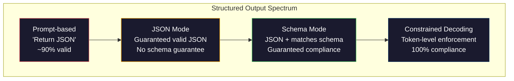
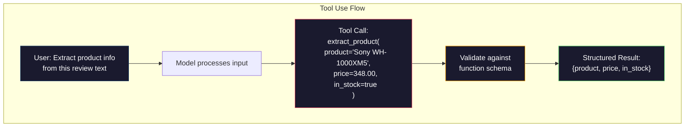

# 结构化输出：JSON、模式验证、约束解码

> 你的LLM返回一个字符串。你的应用需要JSON。这个差距导致生产系统崩溃的次数比任何模型幻觉都多。结构化输出是自然语言和类型化数据之间的桥梁。处理得当，你的LLM就成为一个可靠的API。处理不当，你就得在凌晨3点用正则表达式解析自由文本。

**类型：** 构建
**语言：** Python
**先决条件：** 第10阶段，课程01-05（从零开始构建LLM）
**时间：** ~90分钟
**相关内容：** 第5阶段·第20课（结构化输出与约束解码）涵盖解码器层面的理论（FSM/CFG logit处理器、Outlines、XGrammar）。本课重点关注生产环境下的SDK接口（OpenAI `response_format`、Anthropic工具使用、Instructor）——如果你想了解API背后发生了什么，请先阅读第5阶段·第20课。

## 学习目标

- 使用OpenAI和Anthropic API参数实现JSON模式和模式约束输出
- 构建Pydantic验证层，拒绝格式错误的LLM输出并通过错误反馈重试
- 解释约束解码如何在token级别强制生成有效JSON，无需后处理
- 设计健壮的提取提示，可靠地将非结构化文本转换为类型化数据结构

## 问题所在

你问一个LLM：“从这段文本中提取产品名称、价格和可用性。”它回答：

```
The product is the Sony WH-1000XM5 headphones, which cost $348.00 and are currently in stock.
```

这是一个完全正确的答案。但对你的应用来说，它完全没用。你的库存系统需要 `{"product": "Sony WH-1000XM5", "price": 348.00, "in_stock": true}`。你需要一个具有特定键、特定类型和特定值约束的JSON对象。你不需要一个句子。

简单的解决方案：在提示中添加“以JSON格式回答”。这在90%的情况下有效。另外10%的情况，模型会将JSON包裹在Markdown代码围栏中，或者添加像“这是JSON:”这样的前导语，或者因为过早关闭括号而产生语法无效的JSON。你的JSON解析器崩溃了。你的流程中断了。你添加了try/except和重试循环。重试有时会产生不同的数据。现在你在解析问题之上又有了一个一致性问题。

这不是一个提示工程问题。这是一个解码问题。模型从左到右生成token。在每个位置，它从10万多个选项的词汇表中挑选最可能的下一个token。这些选项中大多数在任何给定位置都会产生无效的JSON。如果模型刚刚生成 `{"price":`，那么下一个token必须是数字、引号（表示字符串）、`null`、`true`、`false`或负号。任何其他东西都会产生无效的JSON。如果没有约束，模型可能会挑选一个完全合理的英语单词，但在语法上却是灾难性的错误。

## 概念

### 结构化输出谱系

有四个层次的结构化输出控制，每一层都比上一层更可靠。



**基于提示**（“用有效的JSON回答”）：没有强制执行。模型通常会遵守，但有时不会。可靠性：~90%。失败模式：Markdown围栏、前导文本、输出被截断、结构错误。

**JSON模式**：API保证输出是有效的JSON。OpenAI的 `response_format: { type: "json_object" }` 启用此功能。输出将无错误地解析。但它可能不符合你预期的模式——多余的键、错误的类型、缺失的字段。

**模式模式**：API接受一个JSON Schema并保证输出符合它。到2026年，每个主要供应商都原生支持这一点：OpenAI的 `response_format: { type: "json_schema", json_schema: {...} }`（也作为 `tool_choice="required"`），Anthropic的工具使用配合 `input_schema`，以及Gemini的 `response_schema` + `response_mime_type: "application/json"`。输出具有你指定的确切键、类型和约束。

**约束解码**：在生成过程中，每个token位置，解码器会屏蔽掉所有将产生无效输出的token。如果模式需要数字而模型即将输出字母，那么该token的概率被设为零。模型只能产生导致有效输出的token。这就是OpenAI的结构化输出模式以及Outlines和Guidance等库在底层实现的方式。

### JSON Schema：契约语言

JSON Schema是你告诉模型（或验证层）输出必须具有何种形状的方式。每个主要的结构化输出系统都使用它。

```json
{
  "type": "object",
  "properties": {
    "product": { "type": "string" },
    "price": { "type": "number", "minimum": 0 },
    "in_stock": { "type": "boolean" },
    "categories": {
      "type": "array",
      "items": { "type": "string" }
    }
  },
  "required": ["product", "price", "in_stock"]
}
```

这个模式表示：输出必须是一个对象，包含一个字符串 `product`、一个非负数 `price`、一个布尔值 `in_stock` 和一个可选的字符串数组 `categories`。任何不匹配的输出都会被拒绝。

模式处理了困难的情况：嵌套对象、带有类型化项目的数组、枚举（将字符串约束到特定值）、模式匹配（字符串上的正则表达式）以及组合子（用于多态输出的oneOf, anyOf, allOf）。

### Pydantic 模式

在Python中，你不需要手动编写JSON Schema。你定义一个Pydantic模型，它会为你生成模式。

```python
from pydantic import BaseModel

class Product(BaseModel):
    product: str
    price: float
    in_stock: bool
    categories: list[str] = []
```

这会生成与上面相同的JSON Schema。Instructor库（以及OpenAI的SDK）直接接受Pydantic模型：传入模型类，返回一个经过验证的实例。如果LLM输出不匹配，Instructor会自动重试。

### 函数调用 / 工具使用

这是解决同一问题的另一种接口。你不是要求模型直接生成JSON，而是定义带有类型化参数的“工具”（函数）。模型输出一个带有结构化参数的函数调用。OpenAI称之为“函数调用”。Anthropic称之为“工具使用”。结果是一样的：结构化数据。



当模型需要选择调用哪个函数，而不仅仅是填充参数时，工具使用是首选。如果你有10种不同的提取模式，并且模型必须根据输入选择正确的那个，工具使用可以同时提供模式选择和结构化输出。

### 常见的失败模式

即使有模式强制，结构化输出也可能以微妙的方式失败。

**幻觉值**：输出匹配模式但包含编造的数据。当文本说$348时，模型生成 `{"price": 299.99}`。模式验证无法捕获这个——类型正确，但值错误。

**枚举混淆**：你将一个字段约束为 `["in_stock", "out_of_stock", "preorder"]`。模型输出 `"available"`——语义上正确，但不在允许的集合内。良好的约束解码可以防止这种情况。基于提示的方法则不能。

**嵌套对象深度**：深度嵌套的模式（4层或更多）会产生更多错误。每一层嵌套都是模型可能丢失结构追踪的地方。

**数组长度**：模型可能在数组中生成过多或过少的项目。模式支持 `minItems` 和 `maxItems`，但并非所有供应商都在解码层面强制执行它们。

**可选字段遗漏**：模型省略了技术上可选、但对你的用例在语义上很重要的字段。即使数据有时缺失，也要在模式中将它们设为必需的——强制模型显式生成 `null`。

## 构建它

### 步骤 1：JSON Schema 验证器

从头开始构建一个验证器，检查Python对象是否匹配JSON Schema。这是运行在输出端以验证合规性的东西。

```python
import json

def validate_schema(data, schema):
    errors = []
    _validate(data, schema, "", errors)
    return errors

def _validate(data, schema, path, errors):
    schema_type = schema.get("type")

    if schema_type == "object":
        if not isinstance(data, dict):
            errors.append(f"{path}: expected object, got {type(data).__name__}")
            return
        for key in schema.get("required", []):
            if key not in data:
                errors.append(f"{path}.{key}: required field missing")
        properties = schema.get("properties", {})
        for key, value in data.items():
            if key in properties:
                _validate(value, properties[key], f"{path}.{key}", errors)

    elif schema_type == "array":
        if not isinstance(data, list):
            errors.append(f"{path}: expected array, got {type(data).__name__}")
            return
        min_items = schema.get("minItems", 0)
        max_items = schema.get("maxItems", float("inf"))
        if len(data) < min_items:
            errors.append(f"{path}: array has {len(data)} items, minimum is {min_items}")
        if len(data) > max_items:
            errors.append(f"{path}: array has {len(data)} items, maximum is {max_items}")
        items_schema = schema.get("items", {})
        for i, item in enumerate(data):
            _validate(item, items_schema, f"{path}[{i}]", errors)

    elif schema_type == "string":
        if not isinstance(data, str):
            errors.append(f"{path}: expected string, got {type(data).__name__}")
            return
        enum_values = schema.get("enum")
        if enum_values and data not in enum_values:
            errors.append(f"{path}: '{data}' not in allowed values {enum_values}")

    elif schema_type == "number":
        if not isinstance(data, (int, float)):
            errors.append(f"{path}: expected number, got {type(data).__name__}")
            return
        minimum = schema.get("minimum")
        maximum = schema.get("maximum")
        if minimum is not None and data < minimum:
            errors.append(f"{path}: {data} is less than minimum {minimum}")
        if maximum is not None and data > maximum:
            errors.append(f"{path}: {data} is greater than maximum {maximum}")

    elif schema_type == "boolean":
        if not isinstance(data, bool):
            errors.append(f"{path}: expected boolean, got {type(data).__name__}")

    elif schema_type == "integer":
        if not isinstance(data, int) or isinstance(data, bool):
            errors.append(f"{path}: expected integer, got {type(data).__name__}")
```

### 步骤 2：Pydantic 风格的模型转 Schema

构建一个最小的类到模式转换器。定义一个Python类并自动生成其JSON Schema。

```python
class SchemaField:
    def __init__(self, field_type, required=True, default=None, enum=None, minimum=None, maximum=None):
        self.field_type = field_type
        self.required = required
        self.default = default
        self.enum = enum
        self.minimum = minimum
        self.maximum = maximum

def python_type_to_schema(field):
    type_map = {
        str: "string",
        int: "integer",
        float: "number",
        bool: "boolean",
    }

    schema = {}

    if field.field_type in type_map:
        schema["type"] = type_map[field.field_type]
    elif field.field_type == list:
        schema["type"] = "array"
        schema["items"] = {"type": "string"}
    elif isinstance(field.field_type, dict):
        schema = field.field_type

    if field.enum:
        schema["enum"] = field.enum
    if field.minimum is not None:
        schema["minimum"] = field.minimum
    if field.maximum is not None:
        schema["maximum"] = field.maximum

    return schema

def model_to_schema(name, fields):
    properties = {}
    required = []

    for field_name, field in fields.items():
        properties[field_name] = python_type_to_schema(field)
        if field.required:
            required.append(field_name)

    return {
        "type": "object",
        "properties": properties,
        "required": required,
    }
```

### 步骤 3：约束 Token 过滤器

模拟约束解码。给定一个部分JSON字符串和一个模式，确定在当前位置哪些token类别是有效的。

```python
def next_valid_tokens(partial_json, schema):
    stripped = partial_json.strip()

    if not stripped:
        return ["{"]

    try:
        json.loads(stripped)
        return ["<EOS>"]
    except json.JSONDecodeError:
        pass

    last_char = stripped[-1] if stripped else ""

    if last_char == "{":
        return ['"', "}"]
    elif last_char == '"':
        if stripped.endswith('":'):
            return ['"', "0-9", "true", "false", "null", "[", "{"]
        return ["a-z", '"']
    elif last_char == ":":
        return [" ", '"', "0-9", "true", "false", "null", "[", "{"]
    elif last_char == ",":
        return [" ", '"', "{", "["]
    elif last_char in "0123456789":
        return ["0-9", ".", ",", "}", "]"]
    elif last_char == "}":
        return [",", "}", "]", "<EOS>"]
    elif last_char == "]":
        return [",", "}", "<EOS>"]
    elif last_char == "[":
        return ['"', "0-9", "true", "false", "null", "{", "[", "]"]
    else:
        return ["any"]

def demonstrate_constrained_decoding():
    partial_states = [
        '',
        '{',
        '{"product"',
        '{"product":',
        '{"product": "Sony"',
        '{"product": "Sony",',
        '{"product": "Sony", "price":',
        '{"product": "Sony", "price": 348',
        '{"product": "Sony", "price": 348}',
    ]

    print(f"{'Partial JSON':<45} {'Valid Next Tokens'}")
    print("-" * 80)
    for state in partial_states:
        valid = next_valid_tokens(state, {})
        display = state if state else "(empty)"
        print(f"{display:<45} {valid}")
```

### 步骤 4：提取管道

将所有部分组合成一个提取管道：定义模式，模拟LLM生成结构化输出，验证输出，并处理重试。

```python
def simulate_llm_extraction(text, schema, attempt=0):
    if "headphones" in text.lower() or "sony" in text.lower():
        if attempt == 0:
            return '{"product": "Sony WH-1000XM5", "price": 348.00, "in_stock": true, "categories": ["audio", "headphones"]}'
        return '{"product": "Sony WH-1000XM5", "price": 348.00, "in_stock": true}'

    if "laptop" in text.lower():
        return '{"product": "MacBook Pro 16", "price": 2499.00, "in_stock": false, "categories": ["computers"]}'

    return '{"product": "Unknown", "price": 0, "in_stock": false}'

def extract_with_retry(text, schema, max_retries=3):
    for attempt in range(max_retries):
        raw = simulate_llm_extraction(text, schema, attempt)

        try:
            data = json.loads(raw)
        except json.JSONDecodeError as e:
            print(f"  Attempt {attempt + 1}: JSON parse error -- {e}")
            continue

        errors = validate_schema(data, schema)
        if not errors:
            return data

        print(f"  Attempt {attempt + 1}: Schema validation errors -- {errors}")

    return None

product_schema = {
    "type": "object",
    "properties": {
        "product": {"type": "string"},
        "price": {"type": "number", "minimum": 0},
        "in_stock": {"type": "boolean"},
        "categories": {"type": "array", "items": {"type": "string"}},
    },
    "required": ["product", "price", "in_stock"],
}
```

### 步骤 5：运行完整管道

```python
def run_demo():
    print("=" * 60)
    print("  Structured Output Pipeline Demo")
    print("=" * 60)

    print("\n--- Schema Definition ---")
    product_fields = {
        "product": SchemaField(str),
        "price": SchemaField(float, minimum=0),
        "in_stock": SchemaField(bool),
        "categories": SchemaField(list, required=False),
    }
    generated_schema = model_to_schema("Product", product_fields)
    print(json.dumps(generated_schema, indent=2))

    print("\n--- Schema Validation ---")
    test_cases = [
        ({"product": "Test", "price": 10.0, "in_stock": True}, "Valid object"),
        ({"product": "Test", "price": -5.0, "in_stock": True}, "Negative price"),
        ({"product": "Test", "in_stock": True}, "Missing price"),
        ({"product": "Test", "price": "ten", "in_stock": True}, "String as price"),
        ("not an object", "String instead of object"),
    ]

    for data, label in test_cases:
        errors = validate_schema(data, product_schema)
        status = "PASS" if not errors else f"FAIL: {errors}"
        print(f"  {label}: {status}")

    print("\n--- Constrained Decoding Simulation ---")
    demonstrate_constrained_decoding()

    print("\n--- Extraction Pipeline ---")
    texts = [
        "The Sony WH-1000XM5 headphones are priced at $348 and currently available.",
        "The new MacBook Pro 16-inch laptop costs $2499 but is sold out.",
        "This is a random sentence with no product info.",
    ]

    for text in texts:
        print(f"\n  Input: {text[:60]}...")
        result = extract_with_retry(text, product_schema)
        if result:
            print(f"  Output: {json.dumps(result)}")
        else:
            print(f"  Output: FAILED after retries")
```

## 使用它

### OpenAI 结构化输出

```python
# from openai import OpenAI
# from pydantic import BaseModel
#
# client = OpenAI()
#
# class Product(BaseModel):
#     product: str
#     price: float
#     in_stock: bool
#
# response = client.beta.chat.completions.parse(
#     model="gpt-5-mini",
#     messages=[
#         {"role": "system", "content": "Extract product information."},
#         {"role": "user", "content": "Sony WH-1000XM5, $348, in stock"},
#     ],
#     response_format=Product,
# )
#
# product = response.choices[0].message.parsed
# print(product.product, product.price, product.in_stock)
```

OpenAI的结构化输出模式在内部使用约束解码。模型生成的每个token都保证产生符合Pydantic模式的输出。无需重试。无需验证。约束被烘焙到解码过程中。

### Anthropic 工具使用

```python
# import anthropic
#
# client = anthropic.Anthropic()
#
# response = client.messages.create(
#     model="claude-opus-4-7",
#     max_tokens=1024,
#     tools=[{
#         "name": "extract_product",
#         "description": "Extract product information from text",
#         "input_schema": {
#             "type": "object",
#             "properties": {
#                 "product": {"type": "string"},
#                 "price": {"type": "number"},
#                 "in_stock": {"type": "boolean"},
#             },
#             "required": ["product", "price", "in_stock"],
#         },
#     }],
#     messages=[{"role": "user", "content": "Extract: Sony WH-1000XM5, $348, in stock"}],
# )
```

Anthropic通过工具使用实现结构化输出。模型发出一个工具调用，其结构化参数匹配 input_schema。结果相同，API表面不同。

### Instructor 库

```python
# pip install instructor
# import instructor
# from openai import OpenAI
# from pydantic import BaseModel
#
# client = instructor.from_openai(OpenAI())
#
# class Product(BaseModel):
#     product: str
#     price: float
#     in_stock: bool
#
# product = client.chat.completions.create(
#     model="gpt-5-mini",
#     response_model=Product,
#     messages=[{"role": "user", "content": "Sony WH-1000XM5, $348, in stock"}],
# )
```

Instructor包装任何LLM客户端并添加带有验证的自动重试。如果第一次尝试验证失败，它会将错误作为上下文发回模型，并要求其修复输出。这适用于任何提供商，不仅仅是OpenAI。

## 部署它

本课产生 `outputs/prompt-structured-extractor.md` ——一个可重用的提示模板，可以根据给定的模式定义从任何文本中提取结构化数据。向其提供JSON Schema和非结构化文本，它将返回经过验证的JSON。

它还产生 `outputs/skill-structured-outputs.md` ——一个根据你的提供商、可靠性要求和模式复杂性选择正确的结构化输出策略的决策框架。

## 练习

1. 扩展模式验证器以支持 `oneOf`（数据必须精确匹配几个模式中的一个）。这处理了多态输出——例如，一个字段可以是 `Product` 或具有不同形状的 `Service` 对象。

2. 构建一个“模式差异”工具，比较两个模式并识别破坏性更改（移除必需字段、更改类型）与非破坏性更改（添加可选字段、放宽约束）。这对于在生产中对你的提取模式进行版本控制至关重要。

3. 实现一个更真实的约束解码模拟器。给定一个JSON Schema和一个包含100个token（字母、数字、标点、关键字）的词汇表，逐步进行生成，在每个位置屏蔽无效token。测量在每一步有多少百分比的词汇是有效的。

4. 构建一个提取评估套件。创建50个带有手工标注JSON输出的产品描述。在所有50个上运行你的提取管道，并测量完全匹配率、字段级准确率和类型合规性。识别哪些字段最难正确提取。

5. 为你的提取管道添加“置信度分数”。对于每个提取的字段，估计模型的置信度（基于token概率，或通过运行提取3次并测量一致性）。标记低置信度字段以供人工审核。

## 关键术语

| 术语 | 人们如何说 | 实际含义 |
|------|------------|----------|
| JSON模式 | “返回JSON” | 保证语法有效JSON输出但不强制任何特定模式的API标志 |
| 结构化输出 | “类型化JSON” | 匹配特定JSON Schema并具有正确键、类型和约束的输出 |
| 约束解码 | “引导生成” | 在每个token位置，屏蔽掉会产生无效输出的token——保证100%模式合规 |
| JSON Schema | “JSON模板” | 描述JSON数据结构、类型和约束的声明性语言（由OpenAPI、JSON Forms等使用） |
| Pydantic | “Python dataclasses+” | 定义带有类型验证的数据模型的Python库，被FastAPI和Instructor用于生成JSON Schema |
| 函数调用 | “工具使用” | LLM输出结构化的函数调用（名称+类型化参数）而非自由文本——OpenAI和Anthropic都支持 |
| Instructor | “LLM的Pydantic” | 包装LLM客户端以返回经过验证的Pydantic实例，并在验证失败时自动重试的Python库 |
| Token屏蔽 | “过滤词汇表” | 在生成期间将特定token的概率设为零，使模型无法产生它们 |
| 模式合规 | “匹配形状” | 输出具有每个必需字段、正确类型、值在约束范围内，并且没有多余的不允许字段 |
| 重试循环 | “反复尝试直到成功” | 将验证错误发回模型并要求其修复输出——Instructor自动执行此操作，直至可配置的最大次数 |

## 进一步阅读

- [OpenAI 结构化输出指南](https://platform.openai.com/docs/guides/structured-outputs) ——OpenAI API中基于JSON Schema的约束解码的官方文档
- [Willard & Louf, 2023 -- "Efficient Guided Generation for Large Language Models"](https://arxiv.org/abs/2307.09702) ——Outlines论文，描述如何将JSON Schema编译成有限状态机以实现token级约束
- [Instructor 文档](https://python.useinstructor.com/) ——从任何LLM获取结构化输出（带Pydantic验证和重试）的标准库
- [Anthropic 工具使用指南](https://docs.anthropic.com/en/docs/tool-use) ——Claude如何通过具有JSON Schema input_schema的工具使用来实现结构化输出
- [JSON Schema 规范](https://json-schema.org/) ——每个主要结构化输出系统使用的模式语言的完整规范
- [Outlines 库](https://github.com/outlines-dev/outlines) ——使用正则表达式和编译为有限状态机的JSON Schema进行开源约束生成
- [Dong et al., "XGrammar: Flexible and Efficient Structured Generation Engine for Large Language Models" (MLSys 2025)](https://arxiv.org/abs/2411.15100) ——当前最先进的语法引擎；下推自动机编译，以~100 ns/token的速度屏蔽token。
- [Beurer-Kellner et al., "Prompting Is Programming: A Query Language for Large Language Models" (LMQL)](https://arxiv.org/abs/2212.06094) ——LMQL论文将约束解码视为一种带有类型和值约束的查询语言。
- [Microsoft Guidance（框架文档）](https://github.com/guidance-ai/guidance) ——模板驱动的约束生成；与Outlines和XGrammar互补且供应商无关的方案。