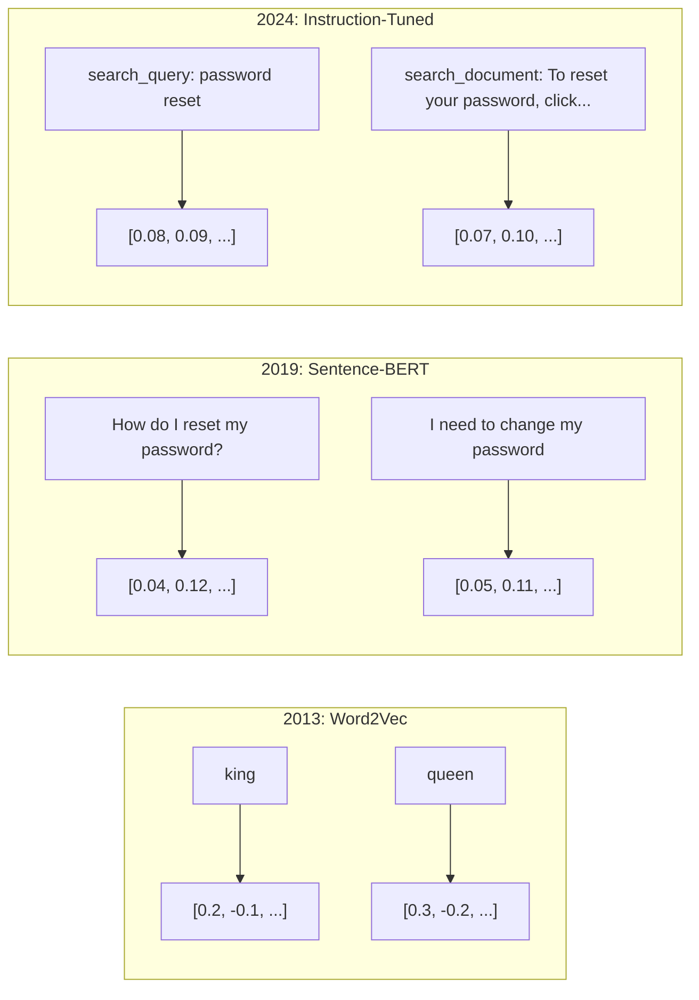
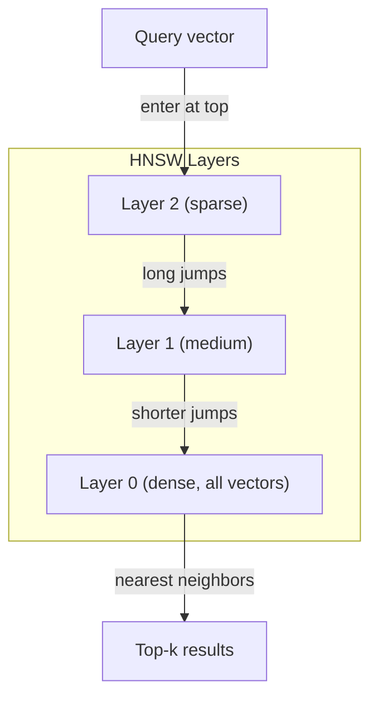
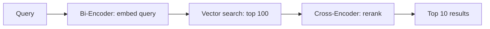

# 嵌入与向量表示

> 文本是离散的。数学是连续的。每次你让大语言模型寻找"相似"文档、比较含义或进行关键词之外的搜索时，你都在依赖连接这两个世界的桥梁。这座桥梁就是嵌入。如果你不理解嵌入，你就不理解现代人工智能。你只是在使用它。

**类型：** 构建
**语言：** Python
**先决条件：** 第11阶段，课程01（提示工程）
**时间：** 约75分钟
**相关：** 第5阶段·第22课（嵌入模型深入）涵盖稠密、稀疏与多向量表示、Matryoshka截断以及逐轴模型选择。本课专注于生产流水线（向量数据库、HNSW、相似度计算）。在选择模型前，请先阅读第5阶段·第22课。

## 学习目标

- 使用API提供商和开源模型生成文本嵌入，并计算它们之间的余弦相似度
- 解释为什么嵌入能解决关键词搜索无法处理的词汇不匹配问题
- 构建语义搜索索引，通过含义而非精确关键词匹配检索文档
- 使用检索基准（precision@k、召回率）评估嵌入质量，并为你的任务选择合适的嵌入模型

## 问题

你有10,000张支持工单。一位客户写道"我的支付没有成功"。你需要找到类似的过去工单。关键词搜索找到包含"支付"和"没有成功"的工单。它会遗漏"交易失败"、"收费被拒绝"和"账单错误"。这些工单用完全不同的词语描述了完全相同的问题。

这就是词汇不匹配问题。人类语言有数十种方式表达同一件事。关键词搜索将每个词视为独立的符号，没有含义。它无法知道"被拒绝"和"没有成功"指的是同一个概念。

你需要一种文本表示方式，其中含义而非拼写决定相似度。你需要一种方法，将"我的支付没有成功"和"交易被拒绝"在某个数学空间中放得很近，同时将"我的支付按时到达"推得很远，尽管它共享了"支付"这个词。

这种表示方式就是嵌入。

## 概念

### 什么是嵌入？

嵌入是一个稠密的浮点数向量，代表文本的含义。"稠密"这个词很重要——每个维度都携带信息，不像稀疏表示（词袋、TF-IDF）那样大部分维度为零。

"The cat sat on the mat" 会变成类似 `[0.023, -0.041, 0.087, ..., 0.012]` 的东西——一个768到3072个数字的列表，取决于模型。这些数字编码了含义。你永远不会直接检查它们。你比较它们。

### Word2Vec的突破

2013年，Tomas Mikolov和他在谷歌的同事发表了Word2Vec。核心见解是：训练一个神经网络从其邻居词预测一个词（或从一个词预测邻居词），隐藏层的权重就变成了有意义的向量表示。

著名的结果：

```
king - man + woman = queen
```

词向量上的向量算术捕捉了语义关系。从"男人"到"女人"的方向大致与从"国王"到"女王"的方向相同。就在这一刻，该领域意识到几何可以编码含义。

Word2Vec生成300维向量。每个词无论上下文如何都得到一个向量。"河岸"中的"银行"和"银行账户"中的"银行"具有相同的嵌入。这一局限性推动了下一个十年的研究。

### 从词到句子

词嵌入表示单个token。生产系统需要嵌入整个句子、段落或文档。出现了四种方法：

**平均法**：取句子中所有词向量的平均值。成本低、有损，对短文本效果出奇地好。完全丢失了词序——"狗咬人"和"人咬狗"得到相同的嵌入。

**CLS token**：Transformer模型（BERT，2018）输出一个特殊的[CLS] token嵌入来代表整个输入。比平均法好，但[CLS] token是为下一句预测训练的，而不是相似度。

**对比学习**：明确训练模型将相似对推近，将不相似对推远。Sentence-BERT（Reimers & Gurevych, 2019）使用了这种方法，成为现代嵌入模型的基础。给定"我如何重置我的密码？"和"我需要更改我的密码"，模型学习到这两者应该有几乎相同的向量。

**指令调优嵌入**：最新的方法。像E5和GTE这样的模型接受任务前缀（"search_query:"、"search_document:"），告诉模型要生成什么类型的嵌入。这使得一个模型可以服务多个任务。



### 现代嵌入模型

市场已确定了几个生产级选项（截至2026年初的MTEB得分，MTEB v2）：

| 模型 | 提供商 | 维度 | MTEB | 上下文 | 每百万token成本 |
|-------|----------|-----------|------|---------|------------------|
| Gemini Embedding 2 | Google | 3072 (Matryoshka) | 67.7 (检索) | 8192 | $0.15 |
| embed-v4 | Cohere | 1024 (Matryoshka) | 65.2 | 128K | $0.12 |
| voyage-4 | Voyage AI | 1024/2048 (Matryoshka) | 66.8 | 32K | $0.12 |
| text-embedding-3-large | OpenAI | 3072 (Matryoshka) | 64.6 | 8192 | $0.13 |
| text-embedding-3-small | OpenAI | 1536 (Matryoshka) | 62.3 | 8192 | $0.02 |
| BGE-M3 | BAAI | 1024 (稠密+稀疏+ColBERT) | 63.0 多语言 | 8192 | 开放权重 |
| Qwen3-Embedding | Alibaba | 4096 (Matryoshka) | 66.9 | 32K | 开放权重 |
| Nomic-embed-v2 | Nomic | 768 (Matryoshka) | 63.1 | 8192 | 开放权重 |

MTEB（大规模文本嵌入基准）v2涵盖了100多项任务，涵盖检索、分类、聚类、重排和摘要。分数越高越好。到2026年，开放权重模型（Qwen3-Embedding、BGE-M3）在大多数维度上匹配或超越了封闭的托管模型。Gemini Embedding 2在纯检索方面领先；Voyage/Cohere在特定领域（金融、法律、代码）领先。在承诺之前，请务必在你自己的查询上进行基准测试。

### 相似度度量

给定两个嵌入向量，有三种方法来衡量它们的相似程度：

**余弦相似度**：两个向量夹角的余弦值。范围从-1（相反）到1（相同方向）。忽略幅度——如果方向相同，一个10词的句子和一个500词的文档可以得分1.0。这是90%用例的默认选择。

```
cosine_sim(a, b) = dot(a, b) / (||a|| * ||b||)
```

**点积**：两个向量的原始内积。当向量被归一化（单位长度）时，与余弦相似度相同。计算速度更快。OpenAI的嵌入是归一化的，因此点积和余弦给出相同的排序。

```
dot(a, b) = sum(a_i * b_i)
```

**欧氏距离（L2）**：向量空间中的直线距离。越小越相似。对幅度差异敏感。当空间中的绝对位置重要而不仅仅是方向时使用。

```
L2(a, b) = sqrt(sum((a_i - b_i)^2))
```

何时使用哪种：

| 度量 | 适用场景 | 避免场景 |
|--------|----------|------------|
| 余弦相似度 | 比较不同长度的文本；大多数检索任务 | 幅度携带信息 |
| 点积 | 嵌入已归一化；需要最大速度 | 向量幅度不同 |
| 欧氏距离 | 聚类；空间最近邻问题 | 比较长度差异巨大的文档 |

### 向量数据库与HNSW

暴力相似度搜索将查询与每个存储的向量进行比较。对于100万个1536维的向量，每个查询需要15亿次乘加运算。太慢了。

向量数据库通过近似最近邻（ANN）算法解决这个问题。主导算法是HNSW（层次化可导航小世界）：

1.  构建一个向量的多层图
2.  顶层稀疏——远距离簇之间的长程连接
3.  底层稠密——附近向量之间的细粒度连接
4.  搜索从顶层开始，贪婪地向下细化
5.  以O(log n)时间返回近似的top-k结果，而不是O(n)

HNSW用极小的精度损失（通常95-99%的召回率）换取巨大的速度提升。在1000万个向量的情况下，暴力搜索需要几秒。HNSW需要几毫秒。



生产选项：

| 数据库 | 类型 | 最适合 | 最大规模 |
|----------|------|----------|-----------|
| Pinecone | 托管SaaS | 零运维生产 | 数十亿 |
| Weaviate | 开源 | 自托管，混合搜索 | 1亿+ |
| Qdrant | 开源 | 高性能，过滤 | 1亿+ |
| ChromaDB | 嵌入式 | 原型开发，本地开发 | 100万 |
| pgvector | Postgres扩展 | 已使用Postgres | 1000万 |
| FAISS | 库 | 进程内，研究 | 10亿+ |

### 分块策略

文档太长，无法作为单个向量嵌入。一个50页的PDF涵盖数十个主题——它的嵌入变成了所有内容的平均值，与任何具体内容都不相似。你将文档分成块，并嵌入每一个块。

**固定大小分块**：每N个token分割，有M个token的重叠。简单且可预测。当文档没有明确结构时效果良好。一个512个token的块，有50个token的重叠：第1块是token 0-511，第2块是token 462-973。

**基于句子的分块**：在句子边界处分割，将句子分组直到达到token限制。每个块至少是一个完整的句子。比固定大小好，因为你永远不会把一个想法切成两半。

**递归分块**：首先尝试在最大的边界处分割（章节标题）。如果仍然太大，尝试段落边界。然后是句子边界。然后是字符限制。这是LangChain的 `RecursiveCharacterTextSplitter`，对混合格式的语料库效果良好。

**语义分块**：嵌入每个句子，然后将连续且嵌入相似的句子分组。当嵌入相似度低于阈值时，开始一个新的块。成本高（需要单独嵌入每个句子）但能产生最连贯的块。

| 策略 | 复杂度 | 质量 | 最适合 |
|----------|-----------|---------|----------|
| 固定大小 | 低 | 尚可 | 非结构化文本，日志 |
| 基于句子 | 低 | 好 | 文章，电子邮件 |
| 递归 | 中 | 好 | Markdown，HTML，混合文档 |
| 语义 | 高 | 最佳 | 关键检索质量 |

大多数系统的最佳点是：256-512个token的块，有50个token的重叠。

### 双编码器 vs 交叉编码器

双编码器独立地嵌入查询和文档，然后比较向量。速度快——你只需嵌入一次查询，然后与预先计算好的文档嵌入进行比较。这是你用于检索的方式。

交叉编码器将查询和文档作为单个输入，输出相关性分数。速度慢——它通过完整模型处理每个查询-文档对。但准确率高得多，因为它可以同时关注查询和文档token。

生产模式：双编码器检索top-100候选，交叉编码器将它们重排为top-10。这就是检索然后重排的流水线。



重排模型：Cohere Rerank 3.5（每1000次查询2美元），BGE-reranker-v2（免费，开源），Jina Reranker v2（免费，开源）。

### Matryoshka嵌入

传统嵌入是全有或全无。一个1536维的向量使用1536个浮点数。你不能在不重新训练的情况下将其截断到256维。

Matryoshka表示学习（Kusupati et al., 2022）解决了这个问题。模型被训练成前N个维度捕获最重要的信息，就像一个俄罗斯套娃。将1536维的Matryoshka嵌入截断到256维会损失一些精度，但仍然可用。

OpenAI的text-embedding-3-small和text-embedding-3-large通过 `dimensions` 参数支持Matryoshka截断。请求256维而不是1536维，存储减少6倍，MTEB基准测试上精度损失约3-5%。

### 二进制量化

一个1536维的嵌入以float32存储使用6144字节。乘以1000万份文档：仅向量就需要61 GB。

二进制量化将每个浮点数转换为一个比特：正值变为1，负值变为0。存储从6144字节减少到192字节——减少32倍。相似度使用汉明距离（计算不同比特的数量）计算，CPU可以在一条指令中完成。

精度损失在检索召回率上约为5-10%。常见模式是：二进制量化用于在数百万向量上进行第一遍搜索，然后使用全精度向量对top-1000进行重新评分。这样可以以32倍少的内存获得95%以上的全精度准确率。

## 构建它

我们从头开始构建一个语义搜索引擎。没有向量数据库。没有外部嵌入API。纯粹使用Python和numpy进行数学计算。

### 步骤1：文本分块

```python
def chunk_text(text, chunk_size=200, overlap=50):
    words = text.split()
    chunks = []
    start = 0
    while start < len(words):
        end = start + chunk_size
        chunk = " ".join(words[start:end])
        chunks.append(chunk)
        start += chunk_size - overlap
    return chunks


def chunk_by_sentences(text, max_chunk_tokens=200):
    sentences = text.replace("\n", " ").split(".")
    sentences = [s.strip() + "." for s in sentences if s.strip()]
    chunks = []
    current_chunk = []
    current_length = 0
    for sentence in sentences:
        sentence_length = len(sentence.split())
        if current_length + sentence_length > max_chunk_tokens and current_chunk:
            chunks.append(" ".join(current_chunk))
            current_chunk = []
            current_length = 0
        current_chunk.append(sentence)
        current_length += sentence_length
    if current_chunk:
        chunks.append(" ".join(current_chunk))
    return chunks
```

### 步骤2：从零构建嵌入

我们使用带有L2归一化的TF-IDF实现一个简单的稠密嵌入。这不是神经嵌入，但它遵循相同的契约：输入文本，输出固定大小的向量，相似的文本产生相似的向量。

```python
import math
import numpy as np
from collections import Counter

class SimpleEmbedder:
    def __init__(self):
        self.vocab = []
        self.idf = []
        self.word_to_idx = {}

    def fit(self, documents):
        vocab_set = set()
        for doc in documents:
            vocab_set.update(doc.lower().split())
        self.vocab = sorted(vocab_set)
        self.word_to_idx = {w: i for i, w in enumerate(self.vocab)}
        n = len(documents)
        self.idf = np.zeros(len(self.vocab))
        for i, word in enumerate(self.vocab):
            doc_count = sum(1 for doc in documents if word in doc.lower().split())
            self.idf[i] = math.log((n + 1) / (doc_count + 1)) + 1

    def embed(self, text):
        words = text.lower().split()
        count = Counter(words)
        total = len(words) if words else 1
        vec = np.zeros(len(self.vocab))
        for word, freq in count.items():
            if word in self.word_to_idx:
                tf = freq / total
                vec[self.word_to_idx[word]] = tf * self.idf[self.word_to_idx[word]]
        norm = np.linalg.norm(vec)
        if norm > 0:
            vec = vec / norm
        return vec
```

### 步骤3：相似度函数

```python
def cosine_similarity(a, b):
    dot = np.dot(a, b)
    norm_a = np.linalg.norm(a)
    norm_b = np.linalg.norm(b)
    if norm_a == 0 or norm_b == 0:
        return 0.0
    return float(dot / (norm_a * norm_b))


def dot_product(a, b):
    return float(np.dot(a, b))


def euclidean_distance(a, b):
    return float(np.linalg.norm(a - b))
```

### 步骤4：带暴力搜索的向量索引

```python
class VectorIndex:
    def __init__(self):
        self.vectors = []
        self.texts = []
        self.metadata = []

    def add(self, vector, text, meta=None):
        self.vectors.append(vector)
        self.texts.append(text)
        self.metadata.append(meta or {})

    def search(self, query_vector, top_k=5, metric="cosine"):
        scores = []
        for i, vec in enumerate(self.vectors):
            if metric == "cosine":
                score = cosine_similarity(query_vector, vec)
            elif metric == "dot":
                score = dot_product(query_vector, vec)
            elif metric == "euclidean":
                score = -euclidean_distance(query_vector, vec)
            else:
                raise ValueError(f"Unknown metric: {metric}")
            scores.append((i, score))
        scores.sort(key=lambda x: x[1], reverse=True)
        results = []
        for idx, score in scores[:top_k]:
            results.append({
                "text": self.texts[idx],
                "score": score,
                "metadata": self.metadata[idx],
                "index": idx
            })
        return results

    def size(self):
        return len(self.vectors)
```

### 步骤5：语义搜索引擎

```python
class SemanticSearchEngine:
    def __init__(self, chunk_size=200, overlap=50):
        self.embedder = SimpleEmbedder()
        self.index = VectorIndex()
        self.chunk_size = chunk_size
        self.overlap = overlap

    def index_documents(self, documents, source_names=None):
        all_chunks = []
        all_sources = []
        for i, doc in enumerate(documents):
            chunks = chunk_text(doc, self.chunk_size, self.overlap)
            all_chunks.extend(chunks)
            name = source_names[i] if source_names else f"doc_{i}"
            all_sources.extend([name] * len(chunks))
        self.embedder.fit(all_chunks)
        for chunk, source in zip(all_chunks, all_sources):
            vec = self.embedder.embed(chunk)
            self.index.add(vec, chunk, {"source": source})
        return len(all_chunks)

    def search(self, query, top_k=5, metric="cosine"):
        query_vec = self.embedder.embed(query)
        return self.index.search(query_vec, top_k, metric)

    def search_with_scores(self, query, top_k=5):
        results = self.search(query, top_k)
        return [
            {
                "text": r["text"][:200],
                "source": r["metadata"].get("source", "unknown"),
                "score": round(r["score"], 4)
            }
            for r in results
        ]
```

### 步骤6：比较相似度度量

```python
def compare_metrics(engine, query, top_k=3):
    results = {}
    for metric in ["cosine", "dot", "euclidean"]:
        hits = engine.search(query, top_k=top_k, metric=metric)
        results[metric] = [
            {"score": round(h["score"], 4), "preview": h["text"][:80]}
            for h in hits
        ]
    return results
```

## 使用它

使用生产嵌入API时，架构保持不变。只有嵌入器会改变：

```python
from openai import OpenAI

client = OpenAI()

def openai_embed(texts, model="text-embedding-3-small", dimensions=None):
    kwargs = {"model": model, "input": texts}
    if dimensions:
        kwargs["dimensions"] = dimensions
    response = client.embeddings.create(**kwargs)
    return [item.embedding for item in response.data]
```

使用OpenAI进行Matryoshka截断——相同的模型，更少的维度，更低的存储：

```python
full = openai_embed(["semantic search query"], dimensions=1536)
compact = openai_embed(["semantic search query"], dimensions=256)
```

256维向量使用6倍更少的存储空间。对于1000万份文档，那是10 GB vs 61 GB。标准基准测试上的精度损失约为3-5%。

使用Cohere进行重排：

```python
import cohere

co = cohere.ClientV2()

results = co.rerank(
    model="rerank-v3.5",
    query="What is the refund policy?",
    documents=["Full refund within 30 days...", "No refunds after 90 days..."],
    top_n=3
)
```

本地嵌入，无API依赖：

```python
from sentence_transformers import SentenceTransformer

model = SentenceTransformer("BAAI/bge-small-en-v1.5")
embeddings = model.encode(["semantic search query", "another document"])
```

我们构建的VectorIndex类适用于以上任何一种。替换嵌入函数，保持搜索逻辑。

## 交付它

本课产生：
- `outputs/prompt-embedding-advisor.md` —— 一个用于为特定用例选择嵌入模型和策略的提示
- `outputs/skill-embedding-patterns.md` —— 一项教智能体如何在生产中有效使用嵌入的技能

## 练习

1.  **度量比较**：使用余弦相似度、点积和欧氏距离，对相同的5个查询和示例文档运行。记录每个的top-3结果。对于哪些查询这些度量结果不一致？为什么？
2.  **块大小实验**：使用50、100、200和500个词的块大小为示例文档建立索引。对于每个大小，运行5个查询并记录top-1相似度分数。绘制块大小与检索质量之间的关系。找出开始损害结果的大块临界点。
3.  **Matryoshka模拟**：构建一个生成500维向量的SimpleEmbedder。将其截断到50、100、200和500维。测量在每个截断下检索召回率如何下降。这模拟了Matryoshka行为，无需真实的训练技巧。
4.  **二进制量化**：获取搜索引擎的嵌入，将它们转换为二进制（如果为正则为1，如果为负则为0），并实现汉明距离搜索。将top-10结果与全精度余弦相似度进行比较。测量重叠百分比。
5.  **基于句子的分块**：将固定大小分块替换为 `chunk_by_sentences`。运行相同的查询并比较检索分数。尊重句子边界是否能改善结果？

## 关键术语

| 术语 | 人们说什么 | 它的实际含义 |
|------|----------------|----------------------|
| 嵌入 | "文本转数字" | 一个稠密向量，其中几何邻近性编码了语义相似度 |
| Word2Vec | "最初代的嵌入" | 2013年模型，通过预测上下文词学习词向量；证明了向量算术编码含义 |
| 余弦相似度 | "两个向量有多相似" | 向量夹角的余弦值；1 = 方向相同，0 = 正交，-1 = 相反 |
| HNSW | "快速向量搜索" | 层次化可导航小世界图——多层结构，支持O(log n)近似最近邻搜索 |
| 双编码器 | "分别嵌入，快速比较" | 独立地将查询和文档编码为向量；支持预计算和快速检索 |
| 交叉编码器 | "慢但准确的重排器" | 通过完整模型联合处理查询-文档对；准确率更高，无法预计算 |
| Matryoshka嵌入 | "可截断的向量" | 训练为前N个维度捕获最重要信息的嵌入，支持可变大小存储 |
| 二进制量化 | "1位嵌入" | 将浮点向量转换为二进制（仅符号位），通过汉明距离搜索减少32倍存储 |
| 分块 | "为嵌入分割文档" | 将文档分成256-512个token的片段，以便每个片段都可以独立嵌入和检索 |
| 向量数据库 | "嵌入的搜索引擎" | 针对存储向量和大规模执行近似最近邻搜索优化的数据存储 |
| 对比学习 | "通过比较训练" | 将相似对的嵌入推近，将不相似对的嵌入推远的训练方法 |
| MTEB | "嵌入基准" | 大规模文本嵌入基准——8个任务56个数据集；比较嵌入模型的标准 |

## 延伸阅读

- Mikolov et al., "Efficient Estimation of Word Representations in Vector Space" (2013) —— Word2Vec论文，以国王-女王类比开启了嵌入革命
- Reimers & Gurevych, "Sentence-BERT: Sentence Embeddings using Siamese BERT-Networks" (2019) —— 如何训练用于句子级相似度的双编码器，现代嵌入模型的基础
- Kusupati et al., "Matryoshka Representation Learning" (2022) —— OpenAI用于text-embedding-3的可变维度嵌入技术背后的原理
- Malkov & Yashunin, "Efficient and Robust Approximate Nearest Neighbor using Hierarchical Navigable Small World Graphs" (2018) —— HNSW论文，大多数生产向量搜索背后的算法
- OpenAI嵌入指南 (platform.openai.com/docs/guides/embeddings) —— text-embedding-3模型的实用参考，包括Matryoshka维度缩减
- MTEB排行榜 (huggingface.co/spaces/mteb/leaderboard) —— 实时基准测试，跨任务和语言比较所有嵌入模型
- [Muennighoff et al., "MTEB: Massive Text Embedding Benchmark" (EACL 2023)](https://arxiv.org/abs/2210.07316) —— 定义排行榜所报告的8个任务类别（分类、聚类、配对分类、重排、检索、STS、摘要、双语文本挖掘）的基准；在信任任何单一MTEB分数之前阅读。
- [Sentence Transformers文档](https://www.sbert.net/) —— 双编码器与交叉编码器、池化策略以及本课实现的 ingest-split-embed-store RAG 流水线的权威参考。