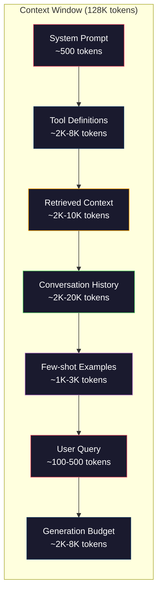
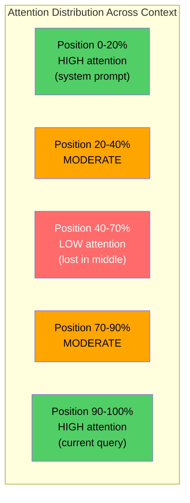
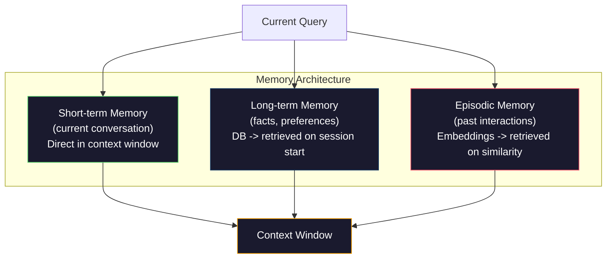

# 上下文工程：窗口、预算、内存与检索

> 提示工程是一个子集。上下文工程才是整场游戏。提示是你输入的字符串。上下文则是进入模型窗口的所有内容：系统指令、检索到的文档、工具定义、对话历史、少样本示例以及提示本身。2026年最优秀的AI工程师是上下文工程师。他们决定什么内容进入、什么内容不进入以及进入的顺序。

**类型:** 构建
**语言:** Python
**前提条件:** 第10阶段（从零开始构建LLM），第11阶段 第01-02课
**时间:** ~90分钟
**相关内容:** 第11阶段 · 15（提示缓存）—— 缓存友好的布局是上下文工程的扩展。第5阶段 · 28（长上下文评估）—— 了解如何使用NIAH/RULER评估"迷失在中间"现象。

## 学习目标

- 计算所有上下文窗口组件（系统提示、工具、历史记录、检索到的文档、生成余量）的token预算
- 实现上下文窗口管理策略：对话历史的截断、摘要和滑动窗口
- 对上下文组件进行优先级排序，以最大化模型对最相关信息的注意力
- 构建一个上下文组装器，根据查询类型和可用窗口空间动态分配token

## 问题所在

Claude Opus 4.7拥有200K token窗口（测试版1M）。GPT-5拥有400K。Gemini 3 Pro拥有2M。Llama 4声称有10M。这些数字听起来很庞大，直到你试图填满它们。

这是一个编码助手的实际分解。系统提示：500 token。50个工具的定义：8,000 token。检索到的文档：4,000 token。对话历史（10轮）：6,000 token。当前用户查询：200 token。生成预算（最大输出）：4,000 token。总计：22,700 token。这仅仅是128K窗口的18%。

但注意力的消耗并不随上下文长度线性扩展。一个拥有128K token上下文的模型需要承担二次方的注意力成本（在传统Transformer中是O(n^2)，尽管大多数生产模型使用高效的注意力变体）。更重要的是，检索准确率会下降。"大海捞针"测试表明，模型难以在长上下文中间找到信息。Liu等人（2023）的研究表明，LLM从长上下文开头和结尾检索信息时准确率接近完美，但对于放置在中间位置（上下文40-70%处）的信息，准确率会下降10-20%。这种"迷失在中间"效应因模型而异，但影响所有当前架构。

实际教训是：拥有200K token可用并不意味着使用200K token是有效的。精心策划的10K token上下文往往比直接堆砌的100K token上下文表现更好。上下文工程是在上下文窗口内最大化信噪比的学科。

你放入窗口的每一个token都会排挤掉一个可能携带更相关信息的token。每一个无关的工具定义、每一个陈旧的对话轮次、每一个未能回答问题的检索文本块——每一个都让模型在该任务上的表现略有下降。

## 核心概念

### 上下文窗口是一种稀缺资源

将上下文窗口视为RAM，而非磁盘。它速度快且直接可访问，但容量有限。你无法容纳所有内容。你必须做出选择。



每个组件都在争夺空间。添加更多工具定义意味着更少的对话历史空间。添加更多检索到的上下文意味着更少的少样本示例空间。上下文工程是将这项预算分配以最大化任务性能的艺术。

### 迷失在中间

上下文工程中最重要的实证发现。模型对上下文开头和结尾的信息关注度更高。中间位置的信息获得的注意力分数较低，更容易被忽略。

Liu等人（2023）对此进行了系统性测试。他们将一份相关文档放置在20份无关文档中的不同位置，并测量回答准确率。当相关文档是第一个或最后一个时，准确率为85-90%。当它在中间位置（20份中的第10份）时，准确率降至60-70%。

这具有直接的工程意义：

- 将最重要的信息放在最前面（系统提示、关键指令）
- 将当前查询和最相关的上下文放在最后面（近期偏好有帮助）
- 将上下文中间部分视为最低优先级区域
- 如果必须将信息放在中间，则在末尾重复关键点



### 上下文组件

**系统提示**：设置角色、约束和行为规则。它位于最前面，并在各轮对话中保持不变。Claude Code的系统提示（包括工具定义和行为指令）大约使用6,000 token。保持简洁。系统提示中的每个词都会在每次API调用中被重复。

**工具定义**：每个工具增加50-200 token（名称、描述、参数模式）。在对话开始前，50个工具按每个150 token计算，就是7,500 token。动态工具选择——仅包含与当前查询相关的工具——可以将此减少60-80%。

**检索到的上下文**：来自向量数据库的文档、搜索结果、文件内容。检索的质量直接决定了响应的质量。糟糕的检索比没有检索更糟——它用噪音填满窗口，并主动误导模型。

**对话历史**：每条之前的用户消息和助手回复。随对话轮次线性增长。200 token每轮的50轮对话就是10,000 token的历史记录。其中大部分与当前查询无关。

**少样本示例**：演示期望行为的输入/输出对。两到三个精心挑选的示例通常比数千token的指令更能提升输出质量。但它们会占用空间。

**生成预算**：为模型响应预留的token。如果你将窗口填满到容量上限，模型就没有回答的空间了。至少预留2,000-4,000 token用于生成。

### 上下文压缩策略

**历史摘要**：不是逐字保留所有之前的轮次，而是定期总结对话。"我们讨论了X，决定了Y，用户想要Z"——用100 token替代了花费2,000 token的10轮对话。当历史记录超过阈值（例如5,000 token）时运行摘要。

**相关性过滤**：根据当前查询对每个检索到的文档进行评分，并丢弃低于阈值的文档。如果你检索了10个块但只有3个是相关的，就丢弃另外7个。3个高度相关的块比10个平庸的块要好。

**工具剪枝**：对用户的查询意图进行分类，只包含与该意图相关的工具。代码问题不需要日历工具。调度问题不需要文件系统工具。这可以将工具定义从8,000 token减少到1,000。

**递归摘要**：对于非常长的文档，分阶段进行摘要。首先对每个部分进行摘要，然后对摘要进行摘要。一份50页的文档可以变成一个500 token的摘要，捕捉关键点。

### 记忆系统

上下文工程跨越三个时间范围。

**短期记忆**：当前对话。直接存储在上下文窗口中。随每一轮对话增长。通过摘要和截断进行管理。

**长期记忆**：跨对话持续存在的事实和偏好。"用户偏好TypeScript。""项目使用PostgreSQL。"存储在数据库中，在会话开始时检索。Claude Code将其存储在CLAUDE.md文件中。ChatGPT将其存储在其记忆功能中。

**情景记忆**：可能相关的具体过去交互。"上周二，我们在auth模块调试了一个类似问题。"以嵌入形式存储，当当前对话与过去情景匹配时进行检索。



### 动态上下文组装

关键洞察：不同的查询需要不同的上下文。静态的系统提示 + 静态的工具 + 静态的历史记录是浪费的。最好的系统会为每个查询动态组装上下文。

1.  分类查询意图
2.  选择相关工具（不是所有工具）
3.  检索相关文档（不是固定集合）
4.  包含相关的历史轮次（不是所有历史记录）
5.  添加与任务类型匹配的少样本示例
6.  按重要性排序：关键的在前面，重要的在最后面，可选的在中间

这是将一个优秀的AI应用与一个出色的AI应用区分开来的关键。模型是相同的。上下文才是差异化因素。

## 动手构建

### 第1步：Token计数器

无法衡量就无法预算。构建一个简单的token计数器（使用空格分割进行近似计算，因为精确计数取决于分词器）。

```python
import json
import numpy as np
from collections import OrderedDict

def count_tokens(text):
    if not text:
        return 0
    return int(len(text.split()) * 1.3)

def count_tokens_json(obj):
    return count_tokens(json.dumps(obj))
```

### 第2步：上下文预算管理器

核心抽象。预算管理器跟踪每个组件使用的token数量并强制执行限制。

```python
class ContextBudget:
    def __init__(self, max_tokens=128000, generation_reserve=4000):
        self.max_tokens = max_tokens
        self.generation_reserve = generation_reserve
        self.available = max_tokens - generation_reserve
        self.allocations = OrderedDict()

    def allocate(self, component, content, max_tokens=None):
        tokens = count_tokens(content)
        if max_tokens and tokens > max_tokens:
            words = content.split()
            target_words = int(max_tokens / 1.3)
            content = " ".join(words[:target_words])
            tokens = count_tokens(content)

        used = sum(self.allocations.values())
        if used + tokens > self.available:
            allowed = self.available - used
            if allowed <= 0:
                return None, 0
            words = content.split()
            target_words = int(allowed / 1.3)
            content = " ".join(words[:target_words])
            tokens = count_tokens(content)

        self.allocations[component] = tokens
        return content, tokens

    def remaining(self):
        used = sum(self.allocations.values())
        return self.available - used

    def utilization(self):
        used = sum(self.allocations.values())
        return used / self.max_tokens

    def report(self):
        total_used = sum(self.allocations.values())
        lines = []
        lines.append(f"Context Budget Report ({self.max_tokens:,} token window)")
        lines.append("-" * 50)
        for component, tokens in self.allocations.items():
            pct = tokens / self.max_tokens * 100
            bar = "#" * int(pct / 2)
            lines.append(f"  {component:<25} {tokens:>6} tokens ({pct:>5.1f}%) {bar}")
        lines.append("-" * 50)
        lines.append(f"  {'Used':<25} {total_used:>6} tokens ({total_used/self.max_tokens*100:.1f}%)")
        lines.append(f"  {'Generation reserve':<25} {self.generation_reserve:>6} tokens")
        lines.append(f"  {'Remaining':<25} {self.remaining():>6} tokens")
        return "\n".join(lines)
```

### 第3步："迷失在中间"的重排序

实现重排序策略：最重要的项目放在最前面和最后面，最不重要的放在中间。

```python
def reorder_lost_in_middle(items, scores):
    paired = sorted(zip(scores, items), reverse=True)
    sorted_items = [item for _, item in paired]

    if len(sorted_items) <= 2:
        return sorted_items

    first_half = sorted_items[::2]
    second_half = sorted_items[1::2]
    second_half.reverse()

    return first_half + second_half

def score_relevance(query, documents):
    query_words = set(query.lower().split())
    scores = []
    for doc in documents:
        doc_words = set(doc.lower().split())
        if not query_words:
            scores.append(0.0)
            continue
        overlap = len(query_words & doc_words) / len(query_words)
        scores.append(round(overlap, 3))
    return scores
```

### 第4步：对话历史压缩器

对旧的对话轮次进行摘要以回收token预算。

```python
class ConversationManager:
    def __init__(self, max_history_tokens=5000):
        self.turns = []
        self.summaries = []
        self.max_history_tokens = max_history_tokens

    def add_turn(self, role, content):
        self.turns.append({"role": role, "content": content})
        self._compress_if_needed()

    def _compress_if_needed(self):
        total = sum(count_tokens(t["content"]) for t in self.turns)
        if total <= self.max_history_tokens:
            return

        while total > self.max_history_tokens and len(self.turns) > 4:
            old_turns = self.turns[:2]
            summary = self._summarize_turns(old_turns)
            self.summaries.append(summary)
            self.turns = self.turns[2:]
            total = sum(count_tokens(t["content"]) for t in self.turns)

    def _summarize_turns(self, turns):
        parts = []
        for t in turns:
            content = t["content"]
            if len(content) > 100:
                content = content[:100] + "..."
            parts.append(f"{t['role']}: {content}")
        return "Previous: " + " | ".join(parts)

    def get_context(self):
        parts = []
        if self.summaries:
            parts.append("[Conversation Summary]")
            for s in self.summaries:
                parts.append(s)
        parts.append("[Recent Conversation]")
        for t in self.turns:
            parts.append(f"{t['role']}: {t['content']}")
        return "\n".join(parts)

    def token_count(self):
        return count_tokens(self.get_context())
```

### 第5步：动态工具选择器

只包含与当前查询相关的工具。对意图进行分类，然后进行过滤。

```python
TOOL_REGISTRY = {
    "read_file": {
        "description": "Read contents of a file",
        "tokens": 120,
        "categories": ["code", "files"],
    },
    "write_file": {
        "description": "Write content to a file",
        "tokens": 150,
        "categories": ["code", "files"],
    },
    "search_code": {
        "description": "Search for patterns in codebase",
        "tokens": 130,
        "categories": ["code"],
    },
    "run_command": {
        "description": "Execute a shell command",
        "tokens": 140,
        "categories": ["code", "system"],
    },
    "create_calendar_event": {
        "description": "Create a new calendar event",
        "tokens": 180,
        "categories": ["calendar"],
    },
    "list_emails": {
        "description": "List recent emails",
        "tokens": 160,
        "categories": ["email"],
    },
    "send_email": {
        "description": "Send an email message",
        "tokens": 200,
        "categories": ["email"],
    },
    "web_search": {
        "description": "Search the web for information",
        "tokens": 140,
        "categories": ["research"],
    },
    "query_database": {
        "description": "Run a SQL query on the database",
        "tokens": 170,
        "categories": ["code", "data"],
    },
    "generate_chart": {
        "description": "Generate a chart from data",
        "tokens": 190,
        "categories": ["data", "visualization"],
    },
}

def classify_intent(query):
    query_lower = query.lower()

    intent_keywords = {
        "code": ["code", "function", "bug", "error", "file", "implement", "refactor", "debug", "test"],
        "calendar": ["meeting", "schedule", "calendar", "appointment", "event"],
        "email": ["email", "mail", "send", "inbox", "message"],
        "research": ["search", "find", "what is", "how does", "explain", "look up"],
        "data": ["data", "query", "database", "chart", "graph", "analytics", "sql"],
    }

    scores = {}
    for intent, keywords in intent_keywords.items():
        score = sum(1 for kw in keywords if kw in query_lower)
        if score > 0:
            scores[intent] = score

    if not scores:
        return ["code"]

    max_score = max(scores.values())
    return [intent for intent, score in scores.items() if score >= max_score * 0.5]

def select_tools(query, token_budget=2000):
    intents = classify_intent(query)
    relevant = {}
    total_tokens = 0

    for name, tool in TOOL_REGISTRY.items():
        if any(cat in intents for cat in tool["categories"]):
            if total_tokens + tool["tokens"] <= token_budget:
                relevant[name] = tool
                total_tokens += tool["tokens"]

    return relevant, total_tokens
```

### 第6步：完整的上下文组装管道

将所有部分连接起来。给定一个查询，动态组装最优上下文。

```python
class ContextEngine:
    def __init__(self, max_tokens=128000, generation_reserve=4000):
        self.budget = ContextBudget(max_tokens, generation_reserve)
        self.conversation = ConversationManager(max_history_tokens=5000)
        self.system_prompt = (
            "You are a helpful AI assistant. You have access to tools for "
            "code editing, file management, web search, and data analysis. "
            "Use the appropriate tools for each task. Be concise and accurate."
        )
        self.knowledge_base = [
            "Python 3.12 introduced type parameter syntax for generic classes using bracket notation.",
            "The project uses PostgreSQL 16 with pgvector for embedding storage.",
            "Authentication is handled by Supabase Auth with JWT tokens.",
            "The frontend is built with Next.js 15 using the App Router.",
            "API rate limits are set to 100 requests per minute per user.",
            "The deployment pipeline uses GitHub Actions with Docker multi-stage builds.",
            "Test coverage must be above 80% for all new modules.",
            "The codebase follows the repository pattern for data access.",
        ]

    def assemble(self, query):
        self.budget = ContextBudget(self.budget.max_tokens, self.budget.generation_reserve)

        system_content, _ = self.budget.allocate("system_prompt", self.system_prompt, max_tokens=1000)

        tools, tool_tokens = select_tools(query, token_budget=2000)
        tool_text = json.dumps(list(tools.keys()))
        tool_content, _ = self.budget.allocate("tools", tool_text, max_tokens=2000)

        relevance = score_relevance(query, self.knowledge_base)
        threshold = 0.1
        relevant_docs = [
            doc for doc, score in zip(self.knowledge_base, relevance)
            if score >= threshold
        ]

        if relevant_docs:
            doc_scores = [s for s in relevance if s >= threshold]
            reordered = reorder_lost_in_middle(relevant_docs, doc_scores)
            doc_text = "\n".join(reordered)
            doc_content, _ = self.budget.allocate("retrieved_context", doc_text, max_tokens=3000)

        history_text = self.conversation.get_context()
        if history_text.strip():
            history_content, _ = self.budget.allocate("conversation_history", history_text, max_tokens=5000)

        query_content, _ = self.budget.allocate("user_query", query, max_tokens=500)

        return self.budget

    def chat(self, query):
        self.conversation.add_turn("user", query)
        budget = self.assemble(query)
        response = f"[Response to: {query[:50]}...]"
        self.conversation.add_turn("assistant", response)
        return budget


def run_demo():
    print("=" * 60)
    print("  Context Engineering Pipeline Demo")
    print("=" * 60)

    engine = ContextEngine(max_tokens=128000, generation_reserve=4000)

    print("\n--- Query 1: Code task ---")
    budget = engine.chat("Fix the bug in the authentication module where JWT tokens expire too early")
    print(budget.report())

    print("\n--- Query 2: Research task ---")
    budget = engine.chat("What is the best approach for implementing vector search in PostgreSQL?")
    print(budget.report())

    print("\n--- Query 3: After conversation history builds up ---")
    for i in range(8):
        engine.conversation.add_turn("user", f"Follow-up question number {i+1} about the implementation details of the system")
        engine.conversation.add_turn("assistant", f"Here is the response to follow-up {i+1} with technical details about the architecture")

    budget = engine.chat("Now implement the changes we discussed")
    print(budget.report())

    print("\n--- Tool Selection Examples ---")
    test_queries = [
        "Fix the bug in auth.py",
        "Schedule a meeting with the team for Tuesday",
        "Show me the database query performance stats",
        "Search for best practices on error handling",
    ]

    for q in test_queries:
        tools, tokens = select_tools(q)
        intents = classify_intent(q)
        print(f"\n  Query: {q}")
        print(f"  Intents: {intents}")
        print(f"  Tools: {list(tools.keys())} ({tokens} tokens)")

    print("\n--- Lost-in-the-Middle Reordering ---")
    docs = ["Doc A (most relevant)", "Doc B (somewhat relevant)", "Doc C (least relevant)",
            "Doc D (relevant)", "Doc E (moderately relevant)"]
    scores = [0.95, 0.60, 0.20, 0.80, 0.50]
    reordered = reorder_lost_in_middle(docs, scores)
    print(f"  Original order: {docs}")
    print(f"  Scores:         {scores}")
    print(f"  Reordered:      {reordered}")
    print(f"  (Most relevant at start and end, least relevant in middle)")
```

## 实际应用

### Claude Code的上下文策略

Claude Code使用分层方法管理上下文。系统提示包含行为规则和工具定义（约6K token）。当你打开一个文件时，其内容会被作为上下文注入。当你进行搜索时，结果会被添加进来。旧的对话轮次会被摘要。CLAUDE.md提供跨会话持久的长期记忆。

关键的工程决策是：Claude Code不会将你的整个代码库全部放入上下文。它根据需要检索相关文件。这是上下文工程的实践。

### Cursor的动态上下文加载

Cursor将你的整个代码库索引为嵌入向量。当你输入查询时，它使用向量相似性检索最相关的文件和代码块。只有这些部分会进入上下文窗口。一个50万行的代码库被压缩到5-10个最相关的代码块。

这就是模式：嵌入所有内容，按需检索，只包含重要的内容。

### ChatGPT记忆

ChatGPT将用户偏好和事实存储为长期记忆。每次对话开始时，相关的记忆会被检索并包含在系统提示中。"用户偏好Python"花费5个token，但节省了跨对话的数百个重复指令的token。

### RAG即上下文工程

检索增强生成是形式化的上下文工程。你不是将知识塞入模型权重（训练）或系统提示（静态上下文），而是在查询时检索相关文档并将其注入上下文窗口。整个RAG管道——分块、嵌入、检索、重排序——都是为了解决一个问题：将正确的信息放入上下文窗口。

## 交付使用

本课程将产出 `outputs/prompt-context-optimizer.md` —— 一个可复用的提示，用于审计上下文组装策略并推荐优化。将其提供给你的系统提示、工具数量、平均历史记录长度和检索策略，它会识别token浪费并建议改进措施。

它还会产出 `outputs/skill-context-engineering.md` —— 一个决策框架，用于根据任务类型、上下文窗口大小和延迟预算设计上下文组装管道。

## 练习

1.  向`ContextBudget`类添加一个"token浪费检测器"。它应标记使用超过预算30%的组件，并针对每种组件类型（摘要历史、剪枝工具、重排文档）建议具体的压缩策略。

2.  为检索到的上下文实现语义去重。如果两个检索到的文档相似度超过80%（通过词汇重叠或嵌入向量的余弦相似度），只保留得分较高的那个。衡量这能回收多少token预算。

3.  构建一个"上下文回放"工具。给定一个对话记录，通过`ContextEngine`回放它，并可视化预算分配如何随轮次变化。绘制每个组件随时间的token使用情况。找出上下文开始被压缩的轮次。

4.  实现一个基于优先级的工具选择器。不是简单的二元包含/排除，而是为每个工具分配一个与当前查询的相关性分数。按相关性降序包含工具，直到工具预算耗尽。比较包含5个、10个、20个和50个工具时的任务表现。

5.  构建一个多策略上下文压缩器。实现三种压缩策略（截断、摘要、关键句提取），并在20份文档集上进行基准测试。衡量压缩率与信息保留之间的权衡（压缩后的版本是否仍包含查询的答案？）。

## 关键术语

| 术语 | 人们常说 | 实际含义 |
|------|----------------|----------------------|
| 上下文窗口 | "模型能读多少" | 模型在单次前向传播中处理的最大token数量（输入+输出）——GPT-5为400K，Claude Opus 4.7为200K（测试版1M），Gemini 3 Pro为2M |
| 上下文工程 | "高级提示工程" | 决定什么内容进入上下文窗口、以什么顺序、什么优先级的学科——涵盖检索、压缩、工具选择和内存管理 |
| 迷失在中间 | "模型会忘记中间的内容" | 实证发现，LLM对上下文开头和结尾的关注度更高，放置在中间位置的信息准确率下降10-20% |
| Token预算 | "你还剩多少token" | 对上下文窗口容量在组件（系统提示、工具、历史记录、检索、生成）间的明确分配，具有每个组件的限制 |
| 动态上下文 | "即时加载内容" | 根据意图分类、相关工具选择和检索结果，为每个查询组装不同的上下文窗口 |
| 历史摘要 | "压缩对话" | 用简洁的摘要替代逐字的旧对话轮次，在保留关键信息的同时降低token成本 |
| 工具剪枝 | "只包含相关工具" | 对查询意图进行分类，只包含匹配的工具定义，将工具token成本降低60-80% |
| 长期记忆 | "跨会话记忆" | 存储在数据库中并在会话开始时检索的事实和偏好——CLAUDE.md、ChatGPT记忆及类似系统 |
| 情景记忆 | "记住具体的过去事件" | 以嵌入形式存储的过去交互，当当前查询与过去对话相似时进行检索 |
| 生成预算 | "回答的空间" | 为模型输出预留的token——如果上下文将窗口完全填满，模型就没有响应空间了 |

## 扩展阅读

- [Liu等人, 2023 -- "迷失在中间：语言模型如何使用长上下文"](https://arxiv.org/abs/2307.03172) —— 关于位置依赖性注意力的权威研究，表明模型处理长上下文中间位置的信息存在困难
- [Anthropic的上下文检索博客文章](https://www.anthropic.com/news/contextual-retrieval) —— Anthropic如何处理上下文感知的块检索，将检索失败率降低49%
- [Simon Willison的"上下文工程"](https://simonwillison.net/2025/Jun/27/context-engineering/) —— 为该学科命名并将其与提示工程区分开来的博客文章
- [LangChain关于RAG的文档](https://python.langchain.com/docs/tutorials/rag/) —— 检索增强生成作为上下文工程模式的实际实现
- [Greg Kamradt的"大海捞针"测试](https://github.com/gkamradt/LLMTest_NeedleInAHaystack) —— 揭示所有主要模型中位置依赖性检索失败的基准测试
- [Pope等人, "高效扩展Transformer推理" (2022)](https://arxiv.org/abs/2211.05102) —— 为什么上下文长度驱动内存和延迟，以及KV缓存、MQA和GQA如何改变预算计算。
- [Agrawal等人, "SARATHI：通过搭载解码与分块预填充实现高效LLM推理" (2023)](https://arxiv.org/abs/2308.16369) —— 推理的两个阶段，使得长提示在TTFT上昂贵但在TPOT上廉价；上下文打包权衡背后的底层真相。
- [Ainslie等人, "GQA：从多头检查点训练广义多查询Transformer模型" (EMNLP 2023)](https://arxiv.org/abs/2305.13245) —— 分组查询注意力论文，在不影响质量的情况下将生产解码器的KV内存减少8倍。