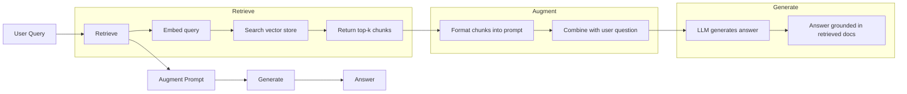
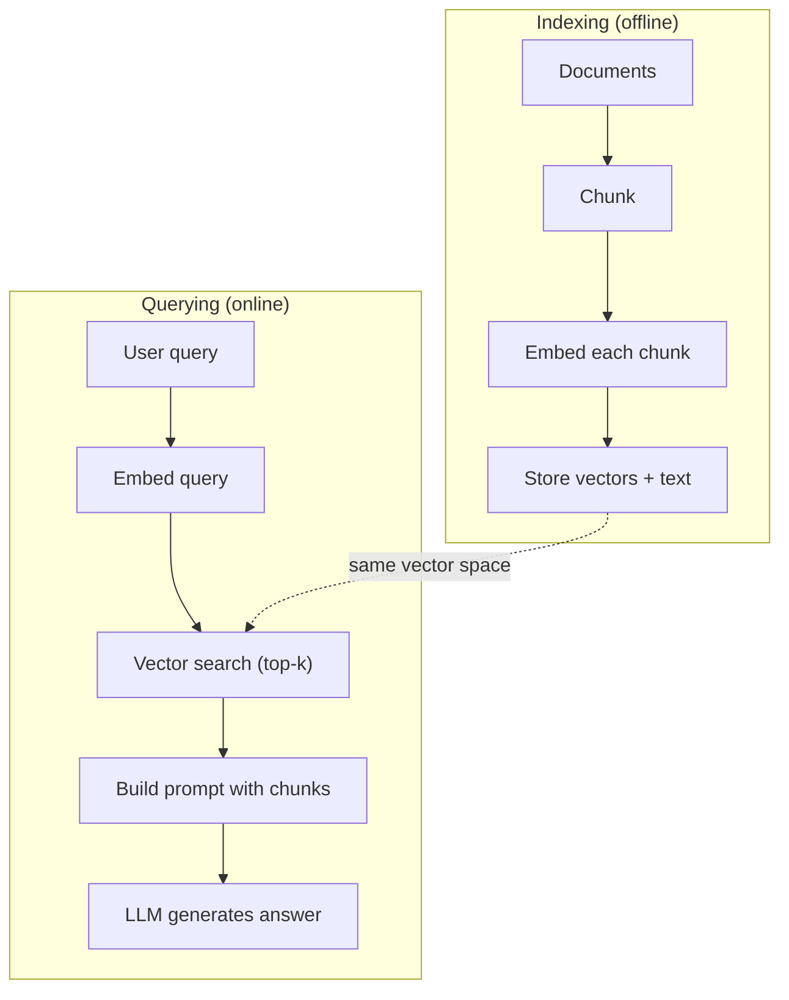

# RAG（检索增强生成）

> 你的大语言模型只知道训练截止日期前的一切信息。它对你公司的文档、代码库或上周的会议记录一无所知。RAG通过检索相关文档并将其注入提示来解决这个问题。这是生产环境中最常部署的AI模式。如果从这门课程中只构建一个东西，那就构建一个RAG流水线吧。

**类型：** 构建
**语言：** Python
**前置条件：** 第10阶段（从零开始构建LLMs）、第11阶段课程01-05
**时间：** 约90分钟
**相关内容：** 第5阶段·23（RAG分块策略）讲解六种分块算法及其适用场景。第5阶段·22（嵌入模型深入探讨）讲解如何选择嵌入器。第11阶段·07（高级RAG）讲解混合搜索、重排序和查询转换。

## 学习目标

- 构建完整的RAG流水线：文档加载、分块、嵌入、向量存储、检索和生成
- 使用向量数据库（ChromaDB、FAISS或Pinecone）并配合正确索引来实现语义搜索
- 解释为何在知识增强应用中RAG优于微调（成本、时效性、可溯源性）
- 使用检索指标（精确率、召回率）和生成指标（忠实度、相关性）评估RAG质量

## 问题所在

你为公司构建了一个聊天机器人。客户问：“企业版计划的退款政策是什么？”大语言模型给出了一个关于典型SaaS退款政策的通用回答。而实际政策深藏在一份200页的内部维基中，明确说明企业客户享有60天窗口期并按比例退款。大语言模型从未见过这份文档。它无法知道训练数据之外的信息。

微调是一种解决方案。取出大语言模型，用你的内部文档进行训练，然后部署更新后的模型。这可行但存在严重问题。微调计算成本高达数千美元。文档一旦变更模型就过时了。你无法得知模型借鉴了哪个来源。而且如果下个月公司收购了另一条产品线，你又得重新微调。

RAG是另一种解决方案。保持模型不变。当问题到来时，搜索你的文档库寻找相关段落，在提问前将它们粘贴到提示中，然后让模型使用这些段落作为上下文来回答。文档库可以在几分钟内更新。你可以清楚看到检索到了哪些文档。模型本身永不改变。这就是RAG在生产环境中占主导地位的原因：它更便宜、更新及时、更易审计，并且适用于任何大语言模型。

## 核心概念

### RAG模式

整个模式包含四个步骤：



查询 -> 检索 -> 增强提示 -> 生成。每个RAG系统都遵循此模式。生产级RAG系统之间的差异在于每个步骤的具体实现：如何分块、如何嵌入、如何搜索以及如何构建提示。

### 为何RAG优于微调

| 关注点 | 微调 | RAG |
|---------|------------|-----|
| 成本 | 每次训练运行$1,000-$100,000+ | 每次查询$0.01-$0.10（嵌入+LLM） |
| 时效性 | 重新训练前一直过时 | 通过重新索引文档在几分钟内更新 |
| 可审计性 | 无法追溯答案来源 | 可显示确切的检索到的段落 |
| 幻觉 | 仍然自由产生幻觉 | 基于检索到的文档生成 |
| 数据隐私 | 训练数据融入权重 | 文档保留在你的向量存储中 |

微调会永久改变模型的权重。RAG临时改变模型的上下文。对于大多数应用，你需要的正是临时上下文。

微调胜出的唯一情况：当你需要模型采用特定的风格、语气或推理模式，而这些无法仅通过提示实现时。对于事实性知识检索，RAG每次都胜出。

### 嵌入模型

嵌入模型将文本转换为稠密向量。相似的文本在这个高维空间中产生的向量彼此接近。“我如何重置密码？”和“我需要更改密码”尽管共享的词汇很少，却产生几乎相同的向量。“猫坐在垫子上”则产生非常不同的向量。

常见嵌入模型（2026年阵容——完整分析见第5阶段·22）：

| 模型 | 维度 | 提供商 | 备注 |
|-------|-----------|----------|-------|
| text-embedding-3-small | 1536（套娃式） | OpenAI | 大多数用例性价比最佳 |
| text-embedding-3-large | 3072（套娃式） | OpenAI | 更高精度，可截断至256/512/1024 |
| Gemini Embedding 2 | 3072（套娃式） | Google | MTEB检索性能顶尖；8K上下文 |
| voyage-4 | 1024/2048（套娃式） | Voyage AI | 域特定变体（代码、金融、法律） |
| Cohere embed-v4 | 1024（套娃式） | Cohere | 强多语言支持，128K上下文 |
| BGE-M3 | 1024（稠密+稀疏+ColBERT） | BAAI（开源权重） | 一个模型三种视图 |
| Qwen3-Embedding | 4096（套娃式） | 阿里巴巴（开源权重） | 开源权重检索分数最高 |
| all-MiniLM-L6-v2 | 384 | 开源权重（Sentence Transformers） | 原型设计基线 |

本课程中，我们使用TF-IDF构建自己的简单嵌入。并非因为TF-IDF是生产系统使用的，而是因为它使概念具体化：文本输入，向量输出，相似文本产生相似向量。

### 向量相似度

给定两个向量，如何衡量相似度？三种选择：

**余弦相似度**：两个向量之间夹角的余弦值。范围从-1（相反）到1（相同）。忽略幅度，只关注方向。这是RAG的默认选择。

```
cosine_sim(a, b) = dot(a, b) / (||a|| * ||b||)
```

**点积**：原始内积。较大的向量得分更高。当幅度携带信息时很有用（较长的文档可能更相关）。

```
dot(a, b) = sum(a_i * b_i)
```

**L2（欧几里得）距离**：向量空间中的直线距离。距离越小=越相似。对幅度差异敏感。

```
L2(a, b) = sqrt(sum((a_i - b_i)^2))
```

余弦相似度是标准。它能优雅地处理不同长度的文档，因为它通过幅度进行归一化。当有人说“向量搜索”时，他们几乎总是指余弦相似度。

### 分块策略

文档太长无法作为单个向量嵌入。一份50页的PDF可能产生糟糕的嵌入，因为它包含数十个主题。相反，你将文档分割成块，并单独嵌入每个块。

**固定大小分块**：每N个token分割一次。简单且可预测。一个512个token的块，50个token重叠意味着块1是token 0-511，块2是token 462-973，依此类推。重叠确保你不会在不幸的边界处断开句子。

**语义分块**：在自然边界处分割。段落、章节或markdown标题。每个块是连贯的意义单元。实现更复杂，但产生更好的检索结果。

**递归分块**：尝试首先在最大边界处分割（章节标题）。如果章节仍然太大，则在段落边界处分割。如果段落仍然太大，则在句子边界处分割。这是LangChain的RecursiveCharacterTextSplitter方法，在实践中效果良好。

分块大小比人们想象的更重要：

- 太小（64-128个token）：每个块缺乏上下文。“它上季度增长了15%”在不知道“它”指什么的情况下毫无意义。
- 太大（2048+个token）：每个块涵盖多个主题，稀释相关性。当你搜索收入数据时，你会得到一个10%关于收入、90%关于人员规模的块。
- 最佳区间（256-512个token）：足够上下文使其自包含，足够聚焦使其相关。

大多数生产级RAG系统使用256-512个token的块，50个token重叠。Anthropic的RAG指南推荐此范围。

### 向量数据库

一旦你有了嵌入，就需要一个地方来存储和搜索它们。选择：

| 数据库 | 类型 | 最适用于 |
|----------|------|----------|
| FAISS | 库（进程内） | 原型设计，中小规模数据集 |
| Chroma | 轻量级数据库 | 本地开发，小规模部署 |
| Pinecone | 托管服务 | 无需运维开销的生产环境 |
| Weaviate | 开源数据库 | 自托管生产环境 |
| pgvector | Postgres扩展 | 已在使用Postgres |
| Qdrant | 开源数据库 | 高性能自托管 |

本课程中，我们构建一个简单的内存向量存储。它将向量存储在列表中并进行暴力余弦相似度搜索。这相当于具有平坦索引的FAISS。它可扩展到大约100,000个向量，之后会变慢。生产系统使用近似最近邻（ANN）算法（如HNSW）在毫秒内搜索数百万个向量。

### 完整流水线



索引阶段对每个文档运行一次（或当文档更新时）。查询阶段对每个用户请求运行。在生产中，索引可能需要数小时来处理数百万份文档。查询必须在一秒钟内响应。

### 实际参数

大多数生产级RAG系统使用以下参数：

- **k = 5到10** 每次查询检索的块数
- **分块大小 = 256到512个token**，50个token重叠
- **上下文预算**：每次查询检索到的内容2,500-5,000个token
- **总提示**：约8,000-16,000个token（系统提示 + 检索到的块 + 对话历史 + 用户查询）
- **嵌入维度**：384-3072，取决于模型
- **索引吞吐量**：使用API嵌入时每秒100-1,000份文档
- **查询延迟**：检索50-200ms，生成500-3000ms

## 动手构建

### 步骤1：文档分块

```python
def chunk_text(text, chunk_size=200, overlap=50):
    words = text.split()
    chunks = []
    start = 0
    while start < len(words):
        end = start + chunk_size
        chunk = " ".join(words[start:end])
        chunks.append(chunk)
        start += chunk_size - overlap
    return chunks
```

### 步骤2：TF-IDF嵌入

我们构建一个简单的嵌入函数。TF-IDF（词频-逆文档频率）不是神经嵌入，但它以一种捕捉单词重要性的方式将文本转换为向量。文档中频繁出现的词获得较高的TF。语料库中罕见的词获得较高的IDF。乘积产生一个向量，其中重要的、独特的词具有高值。

```python
import math
from collections import Counter

def build_vocabulary(documents):
    vocab = set()
    for doc in documents:
        vocab.update(doc.lower().split())
    return sorted(vocab)

def compute_tf(text, vocab):
    words = text.lower().split()
    count = Counter(words)
    total = len(words)
    return [count.get(word, 0) / total for word in vocab]

def compute_idf(documents, vocab):
    n = len(documents)
    idf = []
    for word in vocab:
        doc_count = sum(1 for doc in documents if word in doc.lower().split())
        idf.append(math.log((n + 1) / (doc_count + 1)) + 1)
    return idf

def tfidf_embed(text, vocab, idf):
    tf = compute_tf(text, vocab)
    return [t * i for t, i in zip(tf, idf)]
```

### 步骤3：余弦相似度搜索

```python
def cosine_similarity(a, b):
    dot = sum(x * y for x, y in zip(a, b))
    norm_a = math.sqrt(sum(x * x for x in a))
    norm_b = math.sqrt(sum(x * x for x in b))
    if norm_a == 0 or norm_b == 0:
        return 0.0
    return dot / (norm_a * norm_b)

def search(query_embedding, stored_embeddings, top_k=5):
    scores = []
    for i, emb in enumerate(stored_embeddings):
        sim = cosine_similarity(query_embedding, emb)
        scores.append((i, sim))
    scores.sort(key=lambda x: x[1], reverse=True)
    return scores[:top_k]
```

### 步骤4：提示构建

这是RAG中“增强”发生的地方。获取检索到的块，将它们格式化为提示，并要求大语言模型基于提供的上下文回答。

```python
def build_rag_prompt(query, retrieved_chunks):
    context = "\n\n---\n\n".join(
        f"[Source {i+1}]\n{chunk}"
        for i, chunk in enumerate(retrieved_chunks)
    )
    return f"""Answer the question based ONLY on the following context.
If the context doesn't contain enough information, say "I don't have enough information to answer that."

Context:
{context}

Question: {query}

Answer:"""
```

### 步骤5：完整的RAG流水线

```python
class RAGPipeline:
    def __init__(self):
        self.chunks = []
        self.embeddings = []
        self.vocab = []
        self.idf = []

    def index(self, documents):
        all_chunks = []
        for doc in documents:
            all_chunks.extend(chunk_text(doc))
        self.chunks = all_chunks
        self.vocab = build_vocabulary(all_chunks)
        self.idf = compute_idf(all_chunks, self.vocab)
        self.embeddings = [
            tfidf_embed(chunk, self.vocab, self.idf)
            for chunk in all_chunks
        ]

    def query(self, question, top_k=5):
        query_emb = tfidf_embed(question, self.vocab, self.idf)
        results = search(query_emb, self.embeddings, top_k)
        retrieved = [(self.chunks[i], score) for i, score in results]
        prompt = build_rag_prompt(
            question, [chunk for chunk, _ in retrieved]
        )
        return prompt, retrieved
```

### 步骤6：生成（模拟）

在生产中，这是你调用大语言模型API的地方。本课程中，我们通过从检索到的上下文中提取最相关的句子来模拟生成。

```python
def simple_generate(prompt, retrieved_chunks):
    query_words = set(prompt.lower().split("question:")[-1].split())
    best_sentence = ""
    best_score = 0
    for chunk in retrieved_chunks:
        for sentence in chunk.split("."):
            sentence = sentence.strip()
            if not sentence:
                continue
            words = set(sentence.lower().split())
            overlap = len(query_words & words)
            if overlap > best_score:
                best_score = overlap
                best_sentence = sentence
    return best_sentence if best_sentence else "I don't have enough information."
```

## 实际使用

使用真实的嵌入模型和大语言模型，代码几乎不变：

```python
from openai import OpenAI

client = OpenAI()

def embed(text):
    response = client.embeddings.create(
        model="text-embedding-3-small",
        input=text
    )
    return response.data[0].embedding

def generate(prompt):
    response = client.chat.completions.create(
        model="gpt-4o-mini",
        messages=[{"role": "user", "content": prompt}],
        temperature=0
    )
    return response.choices[0].message.content
```

或者使用Anthropic：

```python
import anthropic

client = anthropic.Anthropic()

def generate(prompt):
    response = client.messages.create(
        model="claude-sonnet-4-20250514",
        max_tokens=1024,
        messages=[{"role": "user", "content": prompt}]
    )
    return response.content[0].text
```

流水线是相同的。更换嵌入函数。更换生成函数。检索逻辑、分块、提示构建——无论你使用哪个模型都完全相同。

对于大规模向量存储，用合适的向量数据库替换暴力搜索：

```python
import chromadb

client = chromadb.Client()
collection = client.create_collection("my_docs")

collection.add(
    documents=chunks,
    ids=[f"chunk_{i}" for i in range(len(chunks))]
)

results = collection.query(
    query_texts=["What is the refund policy?"],
    n_results=5
)
```

Chroma在内部处理嵌入（默认使用all-MiniLM-L6-v2），并将向量存储在本地数据库中。相同的模式，不同的底层实现。

## 产出成果

本课程产出：
- `outputs/prompt-rag-architect.md` -- 一个用于为特定用例设计RAG系统的提示
- `outputs/skill-rag-pipeline.md` -- 一项教导智能体如何构建和调试RAG流水线的技能

## 练习

1. 用简单的词袋方法（二元值：如果单词出现则为1，否则为0）替换TF-IDF嵌入。比较样本文档上的检索质量。TF-IDF应该表现更好，因为它对罕见词赋予更高权重。

2. 实验不同的分块大小：在同一文档集上尝试50、100、200和500个词。对于每个大小，运行相同的5个查询，并计算前3个结果中返回相关块的数量。找到检索质量达到顶峰的最佳区间。

3. 为每个块添加元数据（源文档名称、块位置）。修改提示模板以包含来源归属，让大语言模型引用其来源。

4. 实现一个简单的评估：给定10个问答对，将每个问题通过RAG流水线运行，并测量检索到的块中包含答案的百分比。这是在k处的检索召回率。

5. 构建一个对话感知的RAG流水线：维护最近3次对话的历史记录，并将它们与检索到的块一起包含在提示中。用后续问题进行测试，例如在询问价格后询问“企业版呢？”。

## 关键术语

| 术语 | 人们常说的 | 实际含义 |
|------|----------------|----------------------|
| RAG | “能阅读你文档的AI” | 检索相关文档，将它们粘贴到提示中，并生成基于这些文档的答案 |
| 嵌入 | “将文本转换为数字” | 文本的稠密向量表示，相似的含义产生相似的向量 |
| 向量数据库 | “AI的搜索引擎” | 优化用于存储向量并通过相似度查找最近邻的数据存储 |
| 分块 | “将文档拆分成片段” | 将文档分割成较小的片段（通常256-512个token），以便每个片段可以独立嵌入和检索 |
| 余弦相似度 | “两个向量有多相似” | 两个向量之间夹角的余弦值；1 = 方向相同，0 = 正交，-1 = 方向相反 |
| Top-k检索 | “获取k个最佳匹配项” | 从向量存储中返回与查询最相似的k个块 |
| 上下文窗口 | “大语言模型能看到多少文本” | 大语言模型在单次请求中能处理的最大token数；检索到的块必须在此范围内 |
| 增强生成 | “使用给定上下文回答” | 使用检索到的文档作为上下文生成响应，而不是仅依赖训练知识 |
| TF-IDF | “词重要性评分” | 词频乘以逆文档频率；根据单词在语料库中的独特性为其加权 |
| 索引 | “为搜索准备文档” | 分块、嵌入和存储文档的离线过程，以便在查询时可以进行搜索 |

## 扩展阅读

- Lewis等人，“Retrieval-Augmented Generation for Knowledge-Intensive NLP Tasks”（2020）——来自Facebook AI Research的原始RAG论文，形式化了检索后生成的模式
- Anthropic的RAG文档（docs.anthropic.com）——关于分块大小、提示构建和评估的实用指南
- Pinecone学习中心，“什么是RAG？”——对RAG流水线的清晰视觉解释，包含生产考虑因素
- Sentence-BERT: Reimers & Gurevych (2019)——all-MiniLM嵌入模型背后的论文，展示了如何训练用于语义相似度的双编码器
- [Karpukhin等人，“Dense Passage Retrieval for Open-Domain Question Answering”（EMNLP 2020）](https://arxiv.org/abs/2004.04906)——DPR论文，证明了在开放领域问答中稠密双编码器检索优于BM25，并为现代RAG检索器设定了模式
- [LlamaIndex高级概念](https://docs.llamaindex.ai/en/stable/getting_started/concepts.html)——构建RAG流水线时需要了解的主要概念：数据加载器、节点解析器、索引、检索器、响应合成器
- [LangChain RAG教程](https://python.langchain.com/docs/tutorials/rag/)——另一种风格的编排器；对相同检索后生成模式的可运行链视角