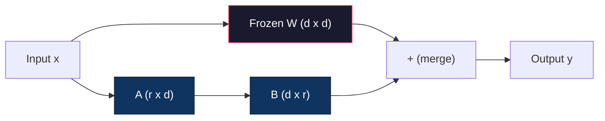
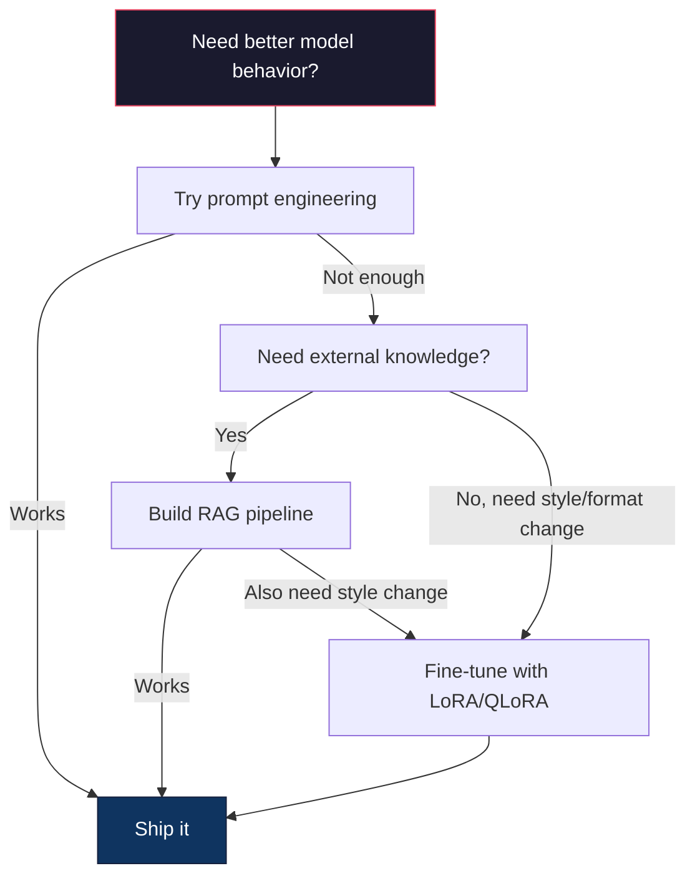

# 使用LoRA和QLoRA进行微调

> 完整微调一个7B模型需要56GB显存。你并没有那么多显存。大多数公司也没有。LoRA让你能够用6GB显存微调同一个模型，只需训练不到1%的参数。这并非一种妥协——在大多数任务上，它都能达到与完整微调相当的质量。整个开源微调生态系统都建立在这一技巧之上。

**类型:** 构建
**语言:** Python
**先修课程:** 阶段10，第06课（指令微调 / SFT）
**时长:** ~75分钟
**相关:** 阶段10从头讲解SFT/DPO循环。本课将这些内容与2026年的PEFT工具包（PEFT, TRL, Unsloth, Axolotl, LLaMA-Factory）对接。

## 学习目标

- 通过向预训练模型的注意力层注入低秩适配器矩阵（A和B）来实现LoRA
- 计算LoRA与完整微调的参数节省量：秩r与d_model维度的组合训练2*r*d个参数，而非d^2个参数
- 使用QLoRA（4位量化基础模型 + LoRA适配器）微调模型，使其适配消费级GPU内存
- 将LoRA权重合并回基础模型用于部署，并比较有无适配器时的推理速度

## 问题所在

你有一个基础模型。Llama 3 8B。你希望它能以你公司的口吻回答客户支持工单。SFT（监督微调）是解决方案。但SFT存在成本问题。

完整微调会更新模型中的每一个参数。Llama 3 8B有80亿参数。在fp16格式下，每个参数占用2字节。仅加载权重就需要16GB。训练过程中，你还需要梯度（16GB）、Adam优化器的状态（动量和方差需要32GB）以及激活值。总共：单个8B模型大约需要56GB显存。

一张A100 80GB显卡勉强能装下。两张A100在云服务提供商那里的成本约为每小时3-4美元。在50,000个样本上训练3个epoch需要6-10小时。每个实验大约花费30-40美元。运行10个实验来调整超参数，在部署任何东西之前你就已经花费了400美元。

如果将此扩展到Llama 3 70B，数字会变得荒谬。仅权重就需要140GB。你需要一个集群。每个实验花费超过100美元。

还有一个更深层次的问题。完整微调会修改模型中的每一个权重。如果你在客户支持数据上进行微调，可能会损害模型的通用能力。这被称为灾难性遗忘。模型在你的任务上变得更好，但在其他所有事情上变得更差。

你需要一种方法，它训练更少的参数，使用更少的内存，并且不会破坏模型已有的知识。

## 概念解析

### LoRA：低秩自适应

微软的Edward Hu及其同事于2021年6月发布了LoRA。论文的洞见是：微调过程中的权重更新具有低内在秩。你不需要更新一个4096x4096权重矩阵中的所有1670万个参数。更新中有用的信息可以由一个秩为16或32的矩阵捕获。

以下是数学原理。一个标准的线性层计算为：

```
y = Wx
```

其中W是一个d_out x d_in矩阵。对于一个4096x4096的注意力投影，那是16,777,216个参数。

LoRA冻结W并添加一个低秩分解：

```
y = Wx + BAx
```

其中B是(d_out x r)，A是(r x d_in)。秩r远小于d——通常为8、16或32。

对于一个4096x4096层，r=16：
- 原始参数：4096 x 4096 = 16,777,216
- LoRA参数：(4096 x 16) + (16 x 4096) = 65,536 + 65,536 = 131,072
- 减少比例：131,072 / 16,777,216 = 0.78%

你只训练了0.78%的参数，却获得了95-100%的质量。



A用随机高斯分布初始化。B初始化为零。这意味着LoRA的贡献从零开始——模型从其原始行为开始训练，并逐渐学习自适应。

### 缩放因子：Alpha

LoRA引入了一个缩放因子alpha，它控制低秩更新对输出的影响程度：

```
y = Wx + (alpha / r) * BAx
```

当alpha = r时，缩放比例为1倍。当alpha = 2r（常用的默认值）时，缩放比例为2倍。这个超参数独立于基础学习率，控制LoRA路径的学习率。

实用指导：
- alpha = 2 * rank 是社区常见的约定（原论文在大多数实验中使用alpha = rank）
- alpha = rank 提供1倍缩放，保守但稳定
- 更高的alpha意味着每步更新更大，这可以加速收敛或导致不稳定

### 在哪里应用LoRA

一个Transformer有很多线性层。你不需要在所有层上都添加LoRA。原论文测试了不同的组合：

| 目标层 | 可训练参数量 (7B模型) | 质量 |
|--------------|----------------------|---------|
| 仅q_proj | 4.7M | 良好 |
| q_proj + v_proj | 9.4M | 更好 |
| q_proj + k_proj + v_proj + o_proj | 18.9M | 注意力层最佳 |
| 所有线性层 (注意力 + MLP) | 37.7M | 收益微小，参数量翻倍 |

大多数任务的甜蜜点：q_proj + v_proj。这针对自注意力中的查询和值投影，它们控制模型关注什么以及提取什么信息。对于代码生成等复杂任务，添加MLP层有帮助，但会使参数量翻倍，而对于较简单的任务收益递减。

### 秩的选择

秩r控制了自适应的表达能力：

| 秩 | 可训练参数量 (每层) | 最适用于 |
|------|---------------------------|----------|
| 4 | 32,768 | 简单分类、情感分析 |
| 8 | 65,536 | 单一领域问答、摘要 |
| 16 | 131,072 | 多领域任务、遵循指令 |
| 32 | 262,144 | 复杂推理、代码生成 |
| 64 | 524,288 | 对大多数任务收益递减 |
| 128 | 1,048,576 | 很少有理由使用 |

Hu等人表明，对于简单任务，r=4已经捕获了大部分自适应。实践中最常用的选择是r=8和r=16。超过r=64很少能提高质量，并且开始失去LoRA的内存优势。

### QLoRA：4位量化 + LoRA

华盛顿大学的Tim Dettmers及其同事于2023年5月发布了QLoRA。核心思想是：将冻结的基础模型量化到4位精度，然后在其上附加fp16的LoRA适配器。

这极大地改变了内存方程：

| 方法 | 权重内存 (7B) | 训练内存 (7B) | 所需GPU |
|--------|-------------------|---------------------|-------------|
| 完整微调 (fp16) | 14GB | ~56GB | 1x A100 80GB |
| LoRA (fp16基础模型) | 14GB | ~18GB | 1x A100 40GB |
| QLoRA (4位基础模型) | 3.5GB | ~6GB | 1x RTX 3090 24GB |

QLoRA做出了三项技术贡献：

**NF4 (Normal Float 4-bit)**：一种专门为神经网络权重设计的新数据类型。神经网络权重大致服从正态分布。NF4将其16个量化级别放置在标准正态分布的分位数上。对于正态分布的数据，这在信息论上是最优的。它比均匀4位量化（INT4）或标准Float4丢失的信息更少。

**双重量化**：量化常数本身占用内存。每64个权重的块需要一个fp32比例因子（4字节）。对于一个7B模型，这额外增加了0.4GB。双重量化将这些常数量化为fp8，将开销减少到0.1GB。虽然微小，但会累积。

**分页优化器**：在训练过程中，优化器状态（Adam的动量和方差）在长序列上可能超出GPU内存。分页优化器使用NVIDIA的统一内存，在GPU内存耗尽时自动将优化器状态分页到CPU RAM，并在需要时分页回来。这避免了OOM崩溃，但会损失一些吞吐量。

### 质量问题

减少参数或量化基础模型会损害质量吗？多篇论文的结果：

| 方法 | MMLU (5-shot) | MT-Bench | HumanEval |
|--------|--------------|----------|-----------|
| 完整微调 (Llama 2 7B) | 48.3 | 6.72 | 14.6 |
| LoRA r=16 | 47.9 | 6.68 | 14.0 |
| QLoRA r=16 (NF4) | 47.5 | 6.61 | 13.4 |
| QLoRA r=64 (NF4) | 48.1 | 6.70 | 14.2 |

在大多数基准测试中，r=16的LoRA与完整微调相差在1%以内。r=16的QLoRA又损失了零点几个百分点。r=64的QLoRA基本上与完整微调相当，同时使用的内存少90%。

### 现实成本

在50,000个样本（3个epoch）上微调Llama 3 8B：

| 方法 | GPU | 时间 | 成本 |
|--------|-----|------|------|
| 完整微调 | 2x A100 80GB | 8小时 | ~$32 |
| LoRA r=16 | 1x A100 40GB | 4小时 | ~$8 |
| QLoRA r=16 | 1x RTX 4090 24GB | 6小时 | ~$5 |
| QLoRA r=16 (Unsloth) | 1x RTX 4090 24GB | 2.5小时 | ~$2 |
| QLoRA r=16 | 1x T4 16GB | 12小时 | ~$4 |

在单张消费级GPU上运行QLoRA的成本低于一顿午餐。这就是为什么开源权重的微调社区在2023年爆发，以及为什么下面列出的每个训练框架在2026年都默认包含QLoRA。

### 2026年的PEFT技术栈

| 框架 | 它是什么 | 何时选择 |
|-----------|-----------|-----------|
| **Hugging Face PEFT** | 规范的LoRA/QLoRA/DoRA/IA3库 | 你需要完全控制，并且你的训练循环已经基于 `transformers.Trainer` |
| **TRL** | HF的强化反馈训练器（SFT, DPO, GRPO, PPO, ORPO） | 在SFT之后需要DPO/GRPO；基于PEFT构建 |
| **Unsloth** | Triton内核重写的前向/反向传播 | 你想要2-5倍加速 + 一半内存，且无精度损失；适用于Llama/Mistral/Qwen系列 |
| **Axolotl** | 基于PEFT + TRL + DeepSpeed + Unsloth的YAML配置封装 | 你想要可复现、版本控制的训练运行 |
| **LLaMA-Factory** | 基于PEFT + TRL的图形界面/命令行/应用接口 | 你想要零代码微调；支持100+模型系列 |
| **torchtune** | 原生PyTorch方法，无 `transformers` 依赖 | 你想要最小依赖，并且你的组织已标准化使用PyTorch |

经验法则：研究用途或一次性实验 → PEFT。可重复的生产流程 → 启用Unsloth内核的Axolotl。快速原型设计 → LLaMA-Factory。

### 合并适配器

训练后，你有两个东西：冻结的基础模型和一个小的LoRA适配器（通常10-100MB）。你可以选择：

1. **保持分离**：加载基础模型，然后在上面加载适配器。为不同任务交换适配器。这是你从一个基础模型服务多个微调变体的方式。

2. **永久合并**：计算 W' = W + (alpha/r) * BA 并将结果保存为一个新的完整模型。合并后的模型大小与原始模型相同。没有推理开销。无需管理适配器。

对于服务多个任务（客户支持适配器、代码适配器、翻译适配器），保持分离。对于部署单个专业模型，则合并。

用于组合多个适配器的高级合并技术：

- **TIES-Merging**（Yadav等人，2023年）：修剪小幅度的参数，解决符号冲突，然后合并。减少适配器之间的干扰。
- **DARE**（Yu等人，2023年）：在合并前随机丢弃适配器参数并重新缩放其余部分。在组合能力方面出奇地有效。
- **任务算术**：简单地加或减适配器权重。添加一个“代码”适配器和一个“数学”适配器通常会产生一个两者都擅长的模型。

### 何时不进行微调

微调是第三选择，而非第一选择。

**第一：提示工程。** 写一个更好的系统提示。添加少样本示例。使用思维链。这无需成本，只需几分钟。如果提示能让你达到80%的目标，你可能不需要微调。

**第二：RAG（检索增强生成）。** 如果模型需要了解你的特定数据（文档、知识库、产品目录），检索比将其烘焙进权重更便宜且更易于维护。参见第06课。

**第三：微调。** 当你需要模型采用特定的风格、格式或推理模式（这些无法通过提示实现）时，使用此方法。当你需要一致的结构化输出时。当你需要将一个更大的模型蒸馏到一个更小的模型时。当延迟很重要，且你无法承受少样本提示带来的额外token时。



## 动手实现

我们用纯PyTorch从头实现LoRA。没有库。没有魔法。你将构建LoRA层，将其注入模型，训练它，并将权重合并回去。

### 步骤1：LoRA层

```python
import torch
import torch.nn as nn
import math

class LoRALayer(nn.Module):
    def __init__(self, in_features, out_features, rank=8, alpha=16):
        super().__init__()
        self.rank = rank
        self.alpha = alpha
        self.scaling = alpha / rank

        self.A = nn.Parameter(torch.randn(in_features, rank) * (1 / math.sqrt(rank)))
        self.B = nn.Parameter(torch.zeros(rank, out_features))

    def forward(self, x):
        return (x @ self.A @ self.B) * self.scaling
```

A用缩放的随机值初始化。B初始化为零。乘积BA从零开始，因此模型从其原始行为开始。

### 步骤2：包裹LoRA的线性层

```python
class LinearWithLoRA(nn.Module):
    def __init__(self, linear, rank=8, alpha=16):
        super().__init__()
        self.linear = linear
        self.lora = LoRALayer(
            linear.in_features, linear.out_features, rank, alpha
        )

        for param in self.linear.parameters():
            param.requires_grad = False

    def forward(self, x):
        return self.linear(x) + self.lora(x)
```

原始的线性层被冻结。只有LoRA的参数（A和B）是可训练的。

### 步骤3：将LoRA注入模型

```python
def inject_lora(model, target_modules, rank=8, alpha=16):
    for param in model.parameters():
        param.requires_grad = False

    lora_layers = {}
    for name, module in model.named_modules():
        if isinstance(module, nn.Linear):
            if any(t in name for t in target_modules):
                parent_name = ".".join(name.split(".")[:-1])
                child_name = name.split(".")[-1]
                parent = dict(model.named_modules())[parent_name]
                lora_linear = LinearWithLoRA(module, rank, alpha)
                setattr(parent, child_name, lora_linear)
                lora_layers[name] = lora_linear
    return lora_layers
```

首先，冻结模型中的每个参数。然后遍历模型树，找到匹配目标名称的线性层，并用包裹LoRA的版本替换它们。LoRA的A和B矩阵是整个模型中唯一可训练的参数。

### 步骤4：统计参数量

```python
def count_parameters(model):
    total = sum(p.numel() for p in model.parameters())
    trainable = sum(p.numel() for p in model.parameters() if p.requires_grad)
    frozen = total - trainable
    return {
        "total": total,
        "trainable": trainable,
        "frozen": frozen,
        "trainable_pct": 100 * trainable / total if total > 0 else 0
    }
```

### 步骤5：合并权重回来

```python
def merge_lora_weights(model):
    for name, module in model.named_modules():
        if isinstance(module, LinearWithLoRA):
            with torch.no_grad():
                merged = (
                    module.lora.A @ module.lora.B
                ) * module.lora.scaling
                module.linear.weight.data += merged.T
            parent_name = ".".join(name.split(".")[:-1])
            child_name = name.split(".")[-1]
            if parent_name:
                parent = dict(model.named_modules())[parent_name]
            else:
                parent = model
            setattr(parent, child_name, module.linear)
```

合并后，LoRA层消失了。模型的大小与原始模型相同，自适应功能已烘焙进权重。没有推理开销。

### 步骤6：模拟QLoRA量化

```python
def quantize_to_nf4(tensor, block_size=64):
    blocks = tensor.reshape(-1, block_size)
    scales = blocks.abs().max(dim=1, keepdim=True).values / 7.0
    scales = torch.clamp(scales, min=1e-8)
    quantized = torch.round(blocks / scales).clamp(-8, 7).to(torch.int8)
    return quantized, scales

def dequantize_from_nf4(quantized, scales, original_shape):
    dequantized = quantized.float() * scales
    return dequantized.reshape(original_shape)
```

这通过将权重映射到每64个块内的16个离散级别来模拟4位量化。生产环境的QLoRA使用bitsandbytes库在GPU上实现真正的NF4。

### 步骤7：训练循环

```python
def train_lora(model, data, epochs=5, lr=1e-3, batch_size=4):
    optimizer = torch.optim.AdamW(
        [p for p in model.parameters() if p.requires_grad], lr=lr
    )
    criterion = nn.MSELoss()

    losses = []
    for epoch in range(epochs):
        epoch_loss = 0.0
        n_batches = 0
        indices = torch.randperm(len(data["inputs"]))

        for i in range(0, len(indices), batch_size):
            batch_idx = indices[i:i + batch_size]
            x = data["inputs"][batch_idx]
            y = data["targets"][batch_idx]

            output = model(x)
            loss = criterion(output, y)

            optimizer.zero_grad()
            loss.backward()
            optimizer.step()

            epoch_loss += loss.item()
            n_batches += 1

        avg_loss = epoch_loss / n_batches
        losses.append(avg_loss)

    return losses
```

### 步骤8：完整演示

```python
def demo():
    torch.manual_seed(42)
    d_model = 256
    n_classes = 10

    model = nn.Sequential(
        nn.Linear(d_model, 512),
        nn.ReLU(),
        nn.Linear(512, 512),
        nn.ReLU(),
        nn.Linear(512, n_classes),
    )

    n_samples = 500
    x = torch.randn(n_samples, d_model)
    y = torch.randint(0, n_classes, (n_samples,))
    y_onehot = torch.zeros(n_samples, n_classes).scatter_(1, y.unsqueeze(1), 1.0)

    data = {"inputs": x, "targets": y_onehot}

    params_before = count_parameters(model)

    lora_layers = inject_lora(
        model, target_modules=["0", "2"], rank=8, alpha=16
    )

    params_after = count_parameters(model)

    losses = train_lora(model, data, epochs=20, lr=1e-3)

    merge_lora_weights(model)
    params_merged = count_parameters(model)

    return {
        "params_before": params_before,
        "params_after": params_after,
        "params_merged": params_merged,
        "losses": losses,
    }
```

该演示创建一个小模型，向两层注入LoRA，进行训练，并将权重合并回来。在LoRA训练期间，可训练参数量从完全可训练下降到约1%，合并后恢复原始架构。

## 使用它

使用Hugging Face生态系统，在真实模型上应用LoRA大约只需20行代码：

```python
from transformers import AutoModelForCausalLM, AutoTokenizer
from peft import LoraConfig, get_peft_model, TaskType

model = AutoModelForCausalLM.from_pretrained("meta-llama/Llama-3.1-8B")
tokenizer = AutoTokenizer.from_pretrained("meta-llama/Llama-3.1-8B")

lora_config = LoraConfig(
    task_type=TaskType.CAUSAL_LM,
    r=16,
    lora_alpha=32,
    lora_dropout=0.05,
    target_modules=["q_proj", "v_proj"],
)

model = get_peft_model(model, lora_config)
model.print_trainable_parameters()
```

对于QLoRA，添加bitsandbytes量化：

```python
from transformers import BitsAndBytesConfig

bnb_config = BitsAndBytesConfig(
    load_in_4bit=True,
    bnb_4bit_quant_type="nf4",
    bnb_4bit_compute_dtype=torch.bfloat16,
    bnb_4bit_use_double_quant=True,
)

model = AutoModelForCausalLM.from_pretrained(
    "meta-llama/Llama-3.1-8B",
    quantization_config=bnb_config,
    device_map="auto",
)

model = get_peft_model(model, lora_config)
```

就这样。相同的训练循环。相同的数据管线。基础模型现在以4位形式存在，LoRA适配器以fp16训练，整个过程适配在6GB显存中。

使用Hugging Face Trainer进行训练：

```python
from transformers import TrainingArguments, Trainer
from datasets import load_dataset

dataset = load_dataset("tatsu-lab/alpaca", split="train[:5000]")

training_args = TrainingArguments(
    output_dir="./lora-llama",
    num_train_epochs=3,
    per_device_train_batch_size=4,
    gradient_accumulation_steps=4,
    learning_rate=2e-4,
    fp16=True,
    logging_steps=10,
    save_strategy="epoch",
    optim="paged_adamw_8bit",
)

trainer = Trainer(
    model=model,
    args=training_args,
    train_dataset=dataset,
)

trainer.train()

model.save_pretrained("./lora-adapter")
```

保存的适配器大小为10-100MB。基础模型保持不变。你可以在Hugging Face Hub上分享适配器，而无需重新分发完整模型。

## 交付成果

本课产出：
- `outputs/prompt-lora-advisor.md` -- 一个提示，帮助你为特定任务决定LoRA的秩、目标模块和超参数
- `outputs/skill-fine-tuning-guide.md` -- 一项技能，教会智能体何时以及如何进行微调的决策树

## 练习

1. **秩的消融研究。** 使用秩2、4、8、16、32和64运行演示。绘制最终损失与秩的关系图。找到收益递减的点，即秩加倍不再使损失减半的位置。对于在256维特征上的简单分类任务，这应该在r=8-16左右。

2. **目标模块比较。** 修改`inject_lora`以仅针对层"0"、仅针对层"2"、仅针对层"4"以及所有三层。将每个变体训练20个epoch。比较收敛速度和最终损失。这反映了在真实决策中，是针对q_proj、v_proj还是所有线性层。

3. **量化误差分析。** 取训练模型在`quantize_to_nf4` / `dequantize_from_nf4`前后的权重矩阵。计算均方误差、最大绝对误差以及原始权重与重建权重之间的相关性。尝试`block_size`值为32、64、128和256。

4. **多适配器服务。** 在不同的数据子集（偶数索引 vs 奇数索引）上训练两个LoRA适配器。保存两个适配器。加载基础模型一次，然后交换适配器，并验证每个适配器在相同输入上产生不同的输出。这是生产系统从一个基础模型服务多个微调模型的方式。

5. **合并与未合并的推理。** 在相同的100个输入上，比较LoRA模型在`merge_lora_weights`前后的输出。验证输出是相同的（在1e-5的浮点容差范围内）。然后对两者进行推理速度基准测试——合并的应该稍快，因为它是单次矩阵乘法而不是两次。

## 关键术语

| 术语 | 人们怎么说 | 它的实际含义 |
|------|----------------|----------------------|
| LoRA | "高效微调" | 低秩自适应：冻结基础权重，训练两个小矩阵A和B，它们的乘积近似完整的权重更新 |
| QLoRA | "在笔记本电脑上微调" | 量化LoRA：以4位NF4加载基础模型，在上面以fp16训练LoRA适配器，使得6GB显存即可微调7B模型 |
| 秩 (r) | "模型能学多少" | A和B矩阵的内部维度；控制表达能力与参数量的权衡 |
| Alpha | "LoRA学习率" | 应用于LoRA输出的缩放因子；alpha/r 缩放自适应对最终输出的贡献 |
| NF4 | "4位量化" | Normal Float 4：一种4位数据类型，其量化级别位于正态分布分位数，对神经网络权重最优 |
| 适配器 | "训练好的小部分" | LoRA的A和B矩阵，保存为单独的文件（10-100MB），可加载到基础模型的任何副本上 |
| 目标模块 | "LoRA哪些层" | 注入LoRA适配器的特定线性层（q_proj, v_proj等） |
| 合并 | "把它烘焙进去" | 计算 W + (alpha/r) * BA 并替换原始权重，消除推理时的适配器开销 |
| 分页优化器 | "训练时别OOM" | 当GPU内存耗尽时，将优化器状态（Adam动量、方差）卸载到CPU |
| 灾难性遗忘 | "微调把其他都搞坏了" | 当更新所有权重导致模型丢失先前学到的能力时 |

## 扩展阅读

- Hu等人，"LoRA: Low-Rank Adaptation of Large Language Models"（2021）—— 介绍低秩分解方法的原始论文，在GPT-3 175B上测试，秩低至4
- Dettmers等人，"QLoRA: Efficient Finetuning of Quantized Language Models"（2023）—— 引入NF4、双重量化和分页优化器，使得在单张48GB GPU上微调65B模型成为可能
- PEFT库文档（huggingface.co/docs/peft）—— Hugging Face生态系统中LoRA、QLoRA及其他参数高效方法的标准库
- Yadav等人，"TIES-Merging: Resolving Interference When Merging Models"（2023）—— 无质量损失地组合多个LoRA适配器的技术
- [Rafailov等人，"Direct Preference Optimization: Your Language Model is Secretly a Reward Model"（NeurIPS 2023）](https://arxiv.org/abs/2305.18290)—— DPO推导；SFT之后的偏好调优阶段，无需奖励模型
- [TRL文档](https://huggingface.co/docs/trl/)—— `SFTTrainer`、`DPOTrainer`、`KTOTrainer` 的官方参考，以及与PEFT/bitsandbytes/Unsloth的集成界面
- [Unsloth文档](https://docs.unsloth.ai/)—— 融合内核使微调吞吐量翻倍、内存减半；TRL下的性能层
- [Axolotl文档](https://axolotl-ai-cloud.github.io/axolotl/)—— YAML配置的多GPU SFT/DPO/QLoRA训练器；替代手写脚本的“配置即代码”方案