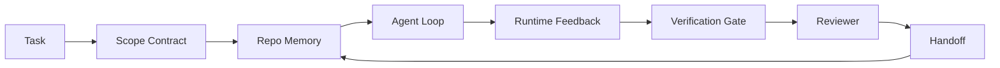

# 智能体工作台工程：为何强大的模型仍然失败

> 仅有强大模型是不够的。可靠的智能体需要一套工作台：指令、状态、作用域、反馈、验证、审查与交接。剥离这些部分，即使是前沿模型产生的工作成果也难以安全交付。

**类型：** 学习 + 构建
**语言：** Python（标准库）
**前置条件：** 第14阶段 · 01（智能体循环），第14阶段 · 26（失败模式）
**时间：** 约45分钟

## 学习目标

- 区分模型能力与执行可靠性。
- 识别决定智能体能否交付产品的七个工作台界面。
- 在小型代码仓库任务中，对比纯提示运行与工作台引导运行的差异。
- 生成一份失败模式报告，将每个缺失的界面与其引发的症状对应起来。

## 问题所在

你将一个前沿模型投入实际代码仓库，要求它添加输入验证。它打开四个文件，编写了看似合理的代码，宣布成功，然后停止运行。你执行测试，两个失败。第三个与验证无关的文件也被修改。没有任何记录说明智能体的假设、首先尝试的内容，以及剩余的工作。

模型并非在Python知识上出错，而是在工作执行上出错。它不知道什么算作完成，哪里可以写入，哪些测试具有权威性，以及下一次会话应如何继续。

这不是模型的错误，而是工作台的错误。智能体周围的环境缺失了将单次生成转化为可靠、可恢复工程所需的部分。

## 核心概念

工作台是在任务期间包裹模型的执行环境。它包含七个界面：

| 界面       | 承载内容           | 缺失时的失败模式         |
|------------|---------------------|--------------------------|
| 指令       | 启动规则、禁止操作、完成定义 | 智能体猜测“交付”的含义   |
| 状态       | 当前任务、已修改文件、阻碍因素、下一步操作 | 每次会话都从零开始       |
| 作用域     | 允许修改的文件、禁止修改的文件、验收标准 | 编辑泄漏到无关代码中     |
| 反馈       | 捕获到循环中的真实命令输出 | 智能体在收到400错误时宣布成功 |
| 验证       | 测试、代码检查、冒烟运行、作用域检查 | “看起来不错”的代码被合并到主分支 |
| 审查       | 由不同角色进行的第二轮检查 | 构建者自己批改作业       |
| 交接       | 变更内容、原因、剩余工作 | 下次会话重新发现所有内容 |

工作台独立于模型。你可以更换模型并保留这些界面。但你无法更换这些界面而保持可靠性。



循环基于状态文件关闭，而非聊天历史。聊天记录是易变的。代码仓库才是系统记录的来源。

### 工作台与提示工程

提示告诉模型你在本轮想要什么。工作台告诉模型如何跨轮次、跨会话地工作。大多数智能体失败的故事，本质上都是披着提示工程外衣的工作台失败。

### 工作台与框架

框架为你提供运行时（如LangGraph, AutoGen, Agents SDK）。工作台为智能体在该运行时内提供一个工作场所。两者都需要。本迷你课程聚焦于后者。

### 基于原语进行推理，而非依赖供应商分类法

当前关于“框架工程”的论述很多。Addy Osmani、OpenAI、Anthropic、LangChain、Martin Fowler、MongoDB、HumanLayer、Augment Code、Thoughtworks、walkinglabs的精选列表，以及Medium和Hacker News上的持续讨论都在涉及此话题。他们对于框架的边界、范围以及所用术语存在分歧。我们无需选边站队。七个界面是用户体验层；每个工作台之下，都是支撑任何可靠后端系统的同一组分布式系统原语。

暂时剥离智能体标签。一次智能体运行是跨越时间、进程和机器的计算。要使其可靠，你需要与任何生产系统所需的相同原语。

| 原语         | 它是什么                     | 为智能体承载什么                                 |
|--------------|-----------------------------|--------------------------------------------------|
| 函数         | 类型化处理程序。尽可能保持纯粹。管理其输入和输出。 | 一次工具调用、一次规则检查、一次验证步骤、一次模型调用 |
| 工作者       | 拥有一个或多个函数及生命周期的长时进程 | 构建者、审查者、验证者、一个MCP服务器             |
| 触发器       | 调用函数的事件源             | 智能体循环计时、HTTP请求、队列消息、定时任务、文件变更、钩子 |
| 运行时       | 决定在何处运行、使用何种超时和资源的边界 | Claude Code的进程、LangGraph的运行时、一个工作者容器 |
| HTTP / RPC   | 调用者与工作者之间的通信线路 | 工具调用协议、MCP请求、模型API                    |
| 队列         | 触发器与工作者之间的持久缓冲区；具备背压、重试、幂等性 | 任务看板、反馈日志、审查收件箱                     |
| 会话持久化   | 能在崩溃、重启、模型更换后保留的状态 | `agent_state.json`、检查点、KV存储、代码仓库本身           |
| 授权策略     | 谁能以何种作用域调用哪个函数 | 允许/禁止的文件、审批边界、MCP能力列表             |

现在，将七个工作台界面映射到这些原语上：

- **指令** — 策略 + 函数元数据。规则是检查（函数）。路由器（`AGENTS.md`）是附加在运行时启动时的策略。
- **状态** — 会话持久化。运行时在每个步骤读取的键值存储。可以是文件、KV或DB；持久化语义很重要，存储后端不重要。
- **作用域** — 每个任务的授权策略。允许/禁止的文件模式是访问控制列表。需要审批是一个权限格。
- **反馈** — 写入队列的调用日志。每个shell命令调用都是一条记录，持久且可重放。
- **验证** — 一个函数。对输入具有确定性。在任务关闭时触发。失败则中止。
- **审查** — 一个独立的工作者，对构建者产物拥有只读授权，对审查报告拥有只写授权。
- **交接** — 由会话结束触发器发出的持久记录。下次会话的启动触发器会读取它。

智能体循环本身就是一个工作者，它消费事件（用户消息、工具结果、计时器滴答），调用函数（首先是模型，然后是模型选择的工具），写入记录（状态、反馈），并发出触发器（验证、审查、交接）。没有神秘之处；其结构与任务处理器相同。

### 流行模式翻译为原语

每个流行的智能体框架模式都可以归结为这八个原语。翻译对照表。

| 供应商或社区模式                         | 它实际是什么                                   |
|------------------------------------------|------------------------------------------------|
| 拉尔夫循环（Claude Code, Codex, 《智能体框架工程》）— 当智能体试图提前停止时，将原始意图重新注入到新的上下文窗口中 | 一个触发器，将任务重新排队并带入干净的上下文；会话持久化将目标向前传递 |
| 计划 / 执行 / 验证（PEV）                | 三个工作者，每个角色一个，通过状态和阶段之间的队列进行通信 |
| 框架-计算分离（OpenAI Agents SDK，2026年4月）— 将控制平面与执行平面分离 | 重申了控制平面/数据平面的分离。比智能体标签早出现数十年 |
| 开放智能体通行证（OAP，2026年3月）— 在执行前对每个工具调用进行签名并对照声明式策略进行审计 | 由一个前置操作工作者强制执行的授权策略，带有签名的审计队列 |
| 引导与传感器（Birgitta Böckeler / Thoughtworks）— 前馈规则 + 反馈可观测性 | 授权策略 + 验证函数 + 可观测性追踪 |
| 渐进式压缩，5阶段（Claude Code逆向工程，2026年4月） | 一个状态管理工作者，类似定时任务般运行，管理会话持久化以保持其在预算内 |
| 钩子/中间件（LangChain, Claude Code）— 拦截模型和工具调用 | 包裹在运行时调用路径周围的触发器 + 函数 |
| 技能作为具有渐进式披露的Markdown（Anthropic, Flue） | 一个函数注册表，函数元数据按需（just-in-time）加载到上下文中 |
| 沙箱智能体（Codex, Sandcastle, Vercel Sandbox） | 计算平面：一个具有隔离文件系统、网络和生命周期的运行时 |
| MCP服务器       | 通过稳定的RPC暴露函数的工作者，其能力列表即为授权 |

该表中的每一项，都是智能体社区为一个在分布式系统中早已存在的原语赋予了新名称。作为营销标签很有用；但作为工程术语则无益。

### 实证数据说明什么

框架优于模型的主张现在有数据支持。这些数据值得了解，因为它们也是反驳“等待更智能模型出现”论调的唯一诚实论据。

- Terminal Bench 2.0 — 相同模型，框架更改使一个编程智能体从排名30开外跃升至第五名（LangChain，《智能体框架解剖》）。
- Vercel — 删除了其智能体80%的工具；成功率从80%跃升至100%（MongoDB）。
- Harvey — 法律智能体仅通过框架优化就将准确率提高了一倍多（MongoDB）。
- 88%的企业AI智能体项目未能投入生产。失败集中于运行时，而非推理能力（preprints.org，《语言智能体的框架工程》，2026年3月）。
- 2025年的一项跨三个流行开源框架的基准研究报告约50%的任务完成率；长上下文WebAgent在长上下文条件下从40-50%暴跌至10%以下，主要原因是无限循环和目标丢失（2026年初的广泛报道）。

结论并非“框架永远获胜”。模型确实会随着时间吸收框架技巧。结论是，当今承重工程在于模型周围，而非模型内部，而承载这部分负荷的原语，是每个生产系统一直都需要的。

### 供应商论述止步之处

这部分你无需客气。

- LangChain的《智能体框架解剖》列举了十一个组件——提示、工具、钩子、沙箱、编排、记忆、技能、子智能体和一个运行时“傻循环”。它没有命名队列、作为部署单元的工作者、触发器语义、作为独立关注点的会话持久化，或授权策略。它将框架视为一个你配置的对象，而不是一个你部署的系统。
- Addy Osmani的《智能体框架工程》确立了`Agent = Model + Harness`的框架和棘轮模式，但并未说明框架由什么构成。它读起来像是一个立场，而非规范。
- Anthropic和OpenAI在界面上的论述最为深入，但始终局限于其自身的运行时。2026年4月Agents SDK中的“框架-计算分离”公告是第一份明确支持控制平面/数据平面分离的供应商文档。这是一个原语概念，而非新概念。
- 《智能体框架工程》一书将框架视为配置对象（Jaymin West的《智能体工程》第6章），其中最有力的一句话是“框架是智能体系统中的主要安全边界”。这不过是授权策略的重述。
- Hacker News的讨论串不断得出相同的结论。2026年4月的讨论串《智能体框架应位于沙箱之外》论证框架应“更像是一个位于一切之外、根据上下文和用户授权访问的超级管理程序”。这再次是，授权策略作为一个独立平面。

你无需反对这些文章的任何部分就能注意到其中的差距。他们是在描述一个已存在系统的用户体验。我们是在构建这个系统。当系统构建得当时，七个界面会自然产生于这些原语。当构建错误时，再多`AGENTS.md`的修饰也修复不了缺失的队列。

所以，当你在别处听到“框架工程”时，请将其翻译为原语。提示和规则是策略与函数。脚手架是运行时。防护栏是授权 + 验证。钩子是触发器。记忆是会话持久化。拉尔夫循环是重新排队。子智能体是工作者。沙箱是计算平面。术语在变；工程不变。工作台是面向智能体的用户体验；而框架，在能经受下一次供应商重新定义的意义上，是函数、工作者、触发器、运行时、队列、持久化与策略的正确连接。

## 动手构建

`code/main.py` 将一个小型仓库任务运行两次。第一次仅使用提示，第二次则接入七个界面。相同的模型，相同的任务。脚本会统计在失败运行中缺失了哪些界面，并打印一份失败模式报告。

仓库任务故意设计得很小：为一个单文件的FastAPI风格处理程序添加输入验证，并编写一个通过的测试。

运行它：

```
python3 code/main.py
```

输出：两次运行的并排日志，一份总结纯提示运行的`failure_modes.json`，以及针对工作台运行的一行判定。

智能体是一个微小的、基于规则的存根；重点在于界面，而非模型。在本迷你课程的其余部分，你将把每个界面重构为一个真实、可复用的组件。

## 实际应用

工作台界面在实际中已经存在的三个地方，即使没人这么称呼它们：

- **Claude Code, Codex, Cursor。** `AGENTS.md` 和 `CLAUDE.md` 是指令界面。斜杠命令是作用域。钩子是验证。
- **LangGraph, OpenAI Agents SDK。** 检查点和会话存储是状态界面。交接是交接界面。
- **实际代码仓库上的CI。** 测试、代码检查和类型检查是验证。PR模板是交接。CODEOWNERS是审查。

工作台工程是一门学科，它旨在使这些界面显式化和可复用化，而不是让每个团队都重新发现它们。

## 交付使用

`outputs/skill-workbench-audit.md` 是一个可移植的技能，它审计现有仓库的七个工作台界面，并报告哪些缺失、哪些部分存在、哪些健康。将其放置在任何智能体配置旁；它会告诉你首先需要修复什么。

## 练习

1.  选择一个你已运行智能体的代码仓库。为七个界面打分（0分缺失，2分健康）。你最薄弱的界面是哪个？
2.  扩展`main.py`，使纯提示运行也能产生一个虚假的“成功”声明。验证验证关卡本应能抓住它。
3.  为你自己的产品添加第八个界面。论证为什么它不能归入现有七个界面中的任何一个。
4.  使用一个幻觉额外文件写入的不同存根智能体重新运行脚本。哪个界面能最先抓住它？
5.  将第14阶段 · 26中的五个行业反复出现的失败模式映射到七个界面上。每个界面旨在吸收哪种模式？

## 关键术语

| 术语             | 人们怎么说       | 它实际意味着什么                             |
|------------------|------------------|----------------------------------------------|
| 工作台           | “配置”或“搭建” | 模型周围经过工程设计的界面，使工作可靠       |
| 界面             | “一份文档”或“一个脚本” | 一个命名的、机器可读的输入，智能体每轮都会读取或写入 |
| 系统记录源       | “笔记”         | 当聊天历史消失时，智能体视为真理的文件       |
| 完成定义         | “验收”         | 一个客观的、基于文件的检查清单，智能体无法伪造 |
| 工作台审计       | “仓库就绪检查” | 对七个界面进行检查，在开始工作前标记缺失部分 |

## 扩展阅读

将这些作为数据点，而非权威来阅读。每一份都是部分分类法。在决定是否采纳之前，将每个概念翻译回原语（函数、工作者、触发器、运行时、HTTP/RPC、队列、持久化、策略）。

供应商框架论述：

- [Addy Osmani, 《智能体框架工程》](https://addyosmani.com/blog/agent-harness-engineering/) — `Agent = Model + Harness` 和棘轮模式；在基础设施方面较薄弱
- [LangChain, 《智能体框架解剖》](https://blog.langchain.com/the-anatomy-of-an-agent-harness/) — 十一个组件：提示、工具、钩子、编排、沙箱、记忆、技能、子智能体、运行时；遗漏了队列、部署、授权
- [OpenAI, 《框架工程：在智能体优先世界中利用Codex》](https://openai.com/index/harness-engineering/) — Codex团队对其运行时周围界面的看法
- [OpenAI, 《解构Codex智能体循环》](https://openai.com/index/unrolling-the-codex-agent-loop/) — 将智能体循环归纳为`while`对函数调用的迭代
- [Anthropic, 《长时运行智能体的有效框架》](https://www.anthropic.com/engineering/effective-harnesses-for-long-running-agents) — 特定运行时内的长时界面向面
- [Anthropic, 《长时应用开发的框架设计》](https://www.anthropic.com/engineering/harness-design-long-running-apps) — 应用设计笔记
- [LangChain Deep Agents框架能力](https://docs.langchain.com/oss/python/deepagents/harness) — 运行时配置界面

包含实用细节的从业者文章：

- [Martin Fowler / Birgitta Böckeler, 《为编码智能体用户提供框架工程》](https://martinfowler.com/articles/harness-engineering.html) — 引导（前馈） + 传感器（反馈）；最清晰的控制论框架
- [HumanLayer, 《技能问题：编码智能体的框架工程》](https://www.humanlayer.dev/blog/skill-issue-harness-engineering-for-coding-agents) — “这不是模型问题，而是配置问题”
- [MongoDB, 《智能体框架：为什么LLM是你智能体系统中最小的部分》](https://www.mongodb.com/company/blog/technical/agent-harness-why-llm-is-smallest-part-of-your-agent-system) — 实证：Vercel 80% 到 100%，Harvey 准确率翻倍，Terminal Bench 前30 到 前5
- [Augment Code, 《AI编码智能体的框架工程》](https://www.augmentcode.com/guides/harness-engineering-ai-coding-agents) — 约束优先的实操指南
- [Sequoia播客, 《Harrison Chase 谈长时智能体的上下文工程》](https://sequoiacap.com/podcast/context-engineering-our-way-to-long-horizon-agents-langchains-harrison-chase/) — 运行时关注点优先于模型关注点

书籍、论文和参考实现：

- [Jaymin West, 《智能体工程》— 第6章：框架](https://www.jayminwest.com/agentic-engineering-book/6-harnesses) — 专著篇幅，将框架视为主要安全边界
- [preprints.org, 《语言智能体的框架工程（2026年3月）》](https://www.preprints.org/manuscript/202603.1756) — 学术框架：控制 / 代理 / 运行时
- [walkinglabs/awesome-harness-engineering](https://github.com/walkinglabs/awesome-harness-engineering) — 跨上下文、评估、可观测性、编排的精选阅读列表
- [ai-boost/awesome-harness-engineering](https://github.com/ai-boost/awesome-harness-engineering) — 另一份精选列表（工具、评估、记忆、MCP、权限）
- [andrewgarst/agentic_harness](https://github.com/andrewgarst/agentic_harness) — 生产就绪的参考实现，具有基于Redis的记忆和评估套件
- [HKUDS/OpenHarness](https://github.com/HKUDS/OpenHarness) — 内置个人智能体的开放智能体框架

Hacker News讨论串（值得阅读其分歧，而非共识）：

- [HN: 长时运行智能体的有效框架](https://news.ycombinator.com/item?id=46081704)
- [HN: 一个下午改进15个LLM的编码能力。只有框架改变了](https://news.ycombinator.com/item?id=46988596)
- [HN: 智能体框架应位于沙箱之外](https://news.ycombinator.com/item?id=47990675) — 主张授权作为一个独立平面

本课程内的交叉引用：

- 第14阶段 · 23 — OpenTelemetry GenAI规范：传感器文献所指的可观测性层
- 第14阶段 · 26 — 七个界面旨在吸收的失败模式目录
- 第14阶段 · 27 — 位于授权策略原语处的提示注入防御
- 第14阶段 · 29 — 生产运行时（队列、事件、定时任务）：本课原语在部署中的位置