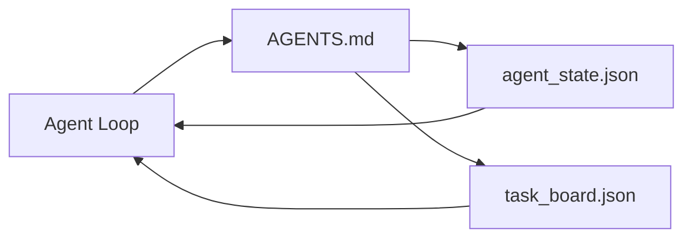

# 最小智能体工作台

> 最小的有用工作台是三个文件：一个根指令路由、一个状态文件和一个任务看板。其他所有内容都是在此之上叠加的。如果一个仓库连这三个文件都承载不了，没有任何模型能拯救它。

**类型：** 构建
**语言：** Python（标准库）
**前置课程：** 第14章 · 31（为什么能力强的模型仍然失败）
**时间：** 约45分钟

## 学习目标

- 定义构成最小可行工作台的三个文件。
- 解释为什么一个短的根路由优于一个长的、单体的 `AGENTS.md`。
- 构建一个智能体可以在每个回合读取并在结束时写入的状态文件。
- 构建一个能够在不依赖聊天历史的情况下，在多会话工作中存活的任务看板。

## 问题所在

大多数团队会写一个3000行的 `AGENTS.md` 并称之为完成了工作台。模型加载它，忽略它无法总结的部分，然后在它一直失败的相同表面上继续失败。

你需要的是相反的方法。一个微小的根文件，只在相关时才将智能体路由到更深层的文件。智能体在行动前读取、行动后写入的持久化状态。一个说明什么正在进行、什么被阻塞、什么待处理的任务看板。

三个文件。每个文件都有自己的职责。每个文件都足够机器可读，以便日后能演进成一个真正的系统。

## 核心概念



### AGENTS.md 是路由，不是手册

一个好的 `AGENTS.md` 应该很短。它将智能体指向：

- 状态文件（你在哪里）。
- 任务看板（还剩什么）。
- 更深层的规则（在 `docs/agent-rules.md` 下）。
- 验证命令（如何知道它有效）。

任何更长的内容都应该放在更深层的文档中，仅在需要时加载。长手册会被忽略。短路由会被遵循。

### agent_state.json 是记录系统

状态包含：活动任务ID、接触过的文件、做出的假设、阻塞因素和下一个动作。智能体在每个回合读取它。下一个会话会读取它，而不是重播聊天历史。

状态保存在文件中，因为聊天历史不可靠。会话会终止。对话会被修剪。文件不会。

### task_board.json 是队列

任务看板承载着状态为 `todo | in_progress | done | blocked` 的每个任务。它是当状态为空时智能体从中拉取任务的队列，也是当你想知道智能体是否在正轨时阅读的队列。

看板上的任务有一个ID、一个目标、一个所有者（`builder`、`reviewer` 或 `human`）以及验收标准。看板被有意设计得很小：当它长到超过一屏时，你有的是规划问题，而不是看板问题。

### 三个文件是地板，不是天花板

后续的课程会增加范围合约、反馈运行器、验证门、审查清单和交接包。这里的三个文件是它们所有内容所依赖的基础。

## 构建它

`code/main.py` 会将最小工作台写入一个空仓库，并演示一个智能体回合，该回合：

1. 读取 `agent_state.json`。
2. 如果状态为空，则从 `task_board.json` 拉取下一个任务。
3. 在范围内接触一个文件。
4. 写回更新后的状态。

运行它：

```
python3 code/main.py
```

该脚本会在其自身旁边创建 `workdir/`，部署三个文件，运行一个回合，并打印差异。重新运行它可以查看第二个回合如何从第一个回合结束的地方继续。

## 使用它

在生产级的智能体产品中，同样的三个文件以不同的名称出现：

- **Claude Code：** 使用 `AGENTS.md` 或 `CLAUDE.md` 作为路由，`.claude/state.json` 风格的存储作为状态，钩子用于看板。
- **Codex / Cursor：** 使用工作区规则作为路由，会话内存作为状态，聊天侧边栏中的排队任务作为看板。
- **自定义 Python 智能体：** 使用你刚刚编写的相同文件。

名称会变。形态不会。

## 生产环境中的模式

最小工作台在与真实的大型代码库接触时，通过叠加三个模式来生存。它们是相互独立的；选择你的仓库实际需要的那些。

**嵌套 `AGENTS.md` 和就近优先原则。** OpenAI 在其主仓库中发布了 88 个 `AGENTS.md` 文件，每个子组件一个。Codex、Cursor、Claude Code 和 Copilot 都会从工作文件向仓库根目录遍历，并连接它们在路径上找到的每个 `AGENTS.md`。子目录文件扩展根文件。Codex 添加了 `AGENTS.override.md` 以替换而非扩展；这种覆盖机制是 Codex 特有的，在跨工具工作中应避免使用。Augment Code 的测量是重要的一句话：最好的 `AGENTS.md` 文件带来的质量提升相当于从 Haiku 升级到 Opus；最差的文件甚至会让输出比没有文件时更糟。

**必须拒绝的反模式，即使它们看起来像覆盖。** 冲突的指令会让智能体从交互模式静默地切换到贪婪模式（ICLR 2026 AMBIG-SWE：解决率从 48.8% 降至 28%）；使用数字优先级，而不是平铺它们。不可验证的样式规则（“遵循 Google Python 风格指南”）没有执行命令，会让智能体自己发明合规性；将每个样式规则与确切的 lint 命令配对。以风格而非命令开头会埋葬验证路径；命令在前，风格在后。为人类而非智能体编写会浪费上下文预算；简洁是一个特性。

**跨工具符号链接。** 一个带有符号链接（`ln -s AGENTS.md CLAUDE.md`、`ln -s AGENTS.md .github/copilot-instructions.md`、`ln -s AGENTS.md .cursorrules`）的根文件可以让每个编码智能体使用同一个事实来源。Nx 的 `nx ai-setup` 可以通过单一配置，自动化处理 Claude Code、Cursor、Copilot、Gemini、Codex 和 OpenCode 的链接。

## 部署它

`outputs/skill-minimal-workbench.md` 为任何新仓库生成三文件工作台：一个针对项目调优的 `AGENTS.md` 路由，一个包含正确键的 `agent_state.json`，以及一个用当前积压工作初始化的 `task_board.json`。

## 练习

1. 在 `agent_state.json` 中添加一个 `last_run` 时间戳。如果文件超过24小时，则拒绝运行，除非操作员确认。
2. 在任务看板中添加一个 `priority` 字段，并更改拉取器以始终选择最高优先级的 `todo`。
3. 将 `task_board.json` 迁移到 JSON Lines，使每个任务成为一行，以便在版本控制中获得干净的差异比较。
4. 编写一个 `lint_workbench.py`，如果 `AGENTS.md` 超过80行或引用了一个不存在的文件，则使其失败。
5. 决定这三个文件中失去哪一个损失最大。为你的选择辩护。

## 关键术语

| 术语 | 人们的说法 | 它的实际含义 |
|------|----------|------------|
| 路由器 | `AGENTS.md` | 一个短的根文件，将智能体指向更深层的文档和文件 |
| 状态文件 | “笔记” | 智能体当前位置的机器可读记录，每个回合写入 |
| 任务看板 | “积压工作” | 带有状态、所有者、验收标准的 JSON 工作队列 |
| 记录系统 | “单一事实来源” | 当聊天记录消失时，工作台视为权威的文件 |

## 延伸阅读

- [agents.md — 开放规范](https://agents.md/) — 被 Cursor、Codex、Claude Code、Copilot、Gemini、OpenCode 采用
- [Augment Code，一个好的 AGENTS.md 就是一次模型升级。一个坏的比没有文档更糟](https://www.augmentcode.com/blog/how-to-write-good-agents-dot-md-files) — 已测量的质量提升
- [Blake Crosley, AGENTS.md 模式：什么真正改变了智能体行为](https://blakecrosley.com/blog/agents-md-patterns) — 实际有效的是什么，无效的是什么
- [Datadog 前端团队, 使用 AGENTS.md 在大型代码库中引导 AI 智能体](https://dev.to/datadog-frontend-dev/steering-ai-agents-in-monorepos-with-agentsmd-13g0) — 嵌套优先级的实践
- [Nx 博客, 教会你的 AI 智能体如何在大型代码库中工作](https://nx.dev/blog/nx-ai-agent-skills) — 跨六个工具的单一来源生成
- [The Prompt Shelf, AGENTS.md 最佳实践：结构、范围和真实示例](https://thepromptshelf.dev/blog/agents-md-best-practices/) — 经得起审查的章节顺序
- [Anthropic, Claude Code 子智能体和会话存储](https://docs.anthropic.com/en/docs/agents-and-tools/claude-code/sub-agents)
- 第14章 · 31 — 这个最小系统能吸收的失败模式
- 第14章 · 34 — 本课预览的持久状态模式